# 03 SQL 编译全链路：从 HQL 到 Operator Tree

## 摘要

一条 HQL 字符串从提交到最终成为可执行的 MapReduce 或 Tez 任务，中间经历了一条精密的编译流水线。理解这条流水线，不仅能帮助工程师写出"对编译器友好"的 SQL（避免触发低效的执行路径），更是进行查询调优时解读 `EXPLAIN` 输出的必备知识——如果连 Operator Tree 是什么都不清楚，`EXPLAIN` 的输出对你来说就只是一堆晦涩的文本。本文完整拆解 Hive SQL 编译的五个阶段：**词法与语法分析**（ANTLR 如何将 HQL 字符串转化为 AST）、**语义分析**（SemanticAnalyzer 如何将 AST 中的符号绑定到 HMS 中的实际对象）、**逻辑计划生成**（QueryBlock 到 Operator Tree 的转换）、**逻辑优化**（谓词下推、列裁剪等规则的应用）、**物理计划生成**（Operator Tree 到 MR/Tez Task 树的最终转换）。每个阶段都会结合具体的 SQL 示例，展示中间产物的实际形态。

---

## 第 1 章 Hive 编译器的历史演进

### 1.1 从手工解析到 ANTLR

Hive 最初的 SQL 解析器是手写的递归下降解析器——工程师们手动编写词法规则和语法规则的 Java 代码。这种方式在 SQL 语法简单时尚可维护，但随着 HQL 功能不断扩展（窗口函数、子查询、CTEs、复杂类型操作），手工解析器变得极其脆弱：添加任何新的语法特性都可能破坏已有规则，测试覆盖困难。

Hive 0.6（2010 年前后）引入了 **ANTLR（ANother Tool for Language Recognition）** 框架来替代手工解析器。ANTLR 是一个成熟的解析器生成工具——工程师用 ANTLR 的 DSL（g 文件格式）声明式地描述语法规则，ANTLR 自动生成对应的 Java 词法分析器（Lexer）和语法分析器（Parser）代码。这使得语法规则的维护和扩展变得系统化，添加新语法特性只需修改 g 文件，重新生成解析器代码即可。

Hive 的 ANTLR 语法文件位于源码的 `ql/src/java/org/apache/hadoop/hive/ql/parse/HiveParser.g`，这个文件长达数千行，定义了完整的 HQL 语法。

### 1.2 编译器五阶段总览

```mermaid
%%{init: {"theme": "dracula", "themeVariables": {"primaryColor": "#6272a4", "primaryTextColor": "#f8f8f2", "lineColor": "#ff79c6"}}}%%
graph LR
    SQL["HQL 字符串</br>SELECT a, SUM(b)</br>FROM t WHERE c > 1</br>GROUP BY a"]
    AST["抽象语法树 (AST)</br>TOK_QUERY</br>├── TOK_FROM</br>└── TOK_INSERT"]
    QB["查询块 (QueryBlock)</br>表引用、谓词、</br>聚合、输出绑定到</br>HMS 实际对象"]
    OPT["Operator Tree</br>FileSink</br>↑ GroupBy</br>↑ Filter</br>↑ TableScan"]
    OPTZ["优化后 Operator Tree</br>谓词下推</br>列裁剪后的 OT"]
    TASK["Task 树</br>MR Job 或</br>Tez DAG"]

    SQL -->|"阶段1: ANTLR 解析"| AST
    AST -->|"阶段2: 语义分析"| QB
    QB -->|"阶段3: 逻辑计划生成"| OPT
    OPT -->|"阶段4: 逻辑优化"| OPTZ
    OPTZ -->|"阶段5: 物理计划生成"| TASK

    classDef phase fill:#6272a4,stroke:#bd93f9,color:#f8f8f2
    classDef artifact fill:#44475a,stroke:#ff79c6,color:#f8f8f2
    class SQL,AST,QB,OPT,OPTZ,TASK artifact
```



**编译器的入口**：上述五个阶段都在 Hive 的 `Driver.compile()` 方法中串行执行。`Driver` 是每个 Session 独立拥有的对象（第 01 篇提到），因此多个并发 Session 的 SQL 编译是并行的，互不干扰（各自持有独立的 `Driver` 实例）。

---

## 第 2 章 阶段一：词法与语法分析——AST 的诞生

### 2.1 词法分析（Lexer）：字符流→Token 序列

词法分析（Lexical Analysis）是将 HQL 字符串拆解为一系列**词法单元（Token）**的过程。Token 是 SQL 中有意义的最小单位：关键字、标识符、操作符、字面量、标点符号。

以 `SELECT a, SUM(b) FROM t WHERE c > 1 GROUP BY a` 为例，Lexer 产生的 Token 序列：

```
KW_SELECT       → "SELECT"
Identifier      → "a"
COMMA           → ","
Identifier      → "SUM"
LPAREN          → "("
Identifier      → "b"
RPAREN          → ")"
KW_FROM         → "FROM"
Identifier      → "t"
KW_WHERE        → "WHERE"
Identifier      → "c"
GREATERTHAN     → ">"
Number          → "1"
KW_GROUP        → "GROUP"
KW_BY           → "BY"
Identifier      → "a"
EOF             → （结束）
```

Lexer 的工作是**无歧义的**：每个字符序列只对应唯一的 Token 类型。这个过程极快（O(n)，n 为字符串长度），通常在微秒级完成。

### 2.2 语法分析（Parser）：Token 序列→AST

语法分析（Syntactic Analysis）将 Token 序列按照 HQL 的文法规则组织成**抽象语法树（Abstract Syntax Tree，AST）**。AST 的每个节点是一个 `CommonTree`（ANTLR 的标准树节点类），节点类型是一个整数（在 `HiveParser` 中定义为常量，如 `TOK_QUERY`、`TOK_SELECT`、`TOK_FROM` 等）。

上面那条 SQL 经过语法分析后，产生的 AST（简化表示）：

```
TOK_QUERY
├── TOK_FROM
│   └── TOK_TABREF
│       └── t（表名标识符）
└── TOK_INSERT
    ├── TOK_DESTINATION（输出目标，这里是临时输出）
    ├── TOK_SELECT
    │   ├── TOK_SELEXPR
    │   │   └── a（列标识符）
    │   └── TOK_SELEXPR
    │       └── TOK_FUNCTION
    │           ├── SUM（函数名）
    │           └── b（参数）
    ├── TOK_WHERE
    │   └── >（操作符）
    │       ├── c（列标识符）
    │       └── 1（字面量）
    └── TOK_GROUPBY
        └── a（分组列）
```

**AST 的特点**：

1. **结构化**：SQL 的层次结构在 AST 中被明确表示（FROM、WHERE、SELECT、GROUP BY 都是独立的子树）
2. **无语义**：AST 中的 `t`、`a`、`b`、`c` 都只是字符串标识符，此时不知道 `t` 是表还是视图，`a` 是什么类型的列——这些语义信息要到下一阶段才被绑定
3. **快速生成**：语法分析通常在几毫秒内完成（对于复杂的大 SQL 可能到几十毫秒）

**常见的语法错误来源**：在这个阶段抛出的错误是 "ParseException"，通常提示 "cannot recognize input near ..."。这说明 SQL 字符串本身违反了 HQL 的语法规则（关键字拼错、括号不匹配、子查询格式错误等），与数据库状态无关。

### 2.3 EXPLAIN 与 AST

实际工作中很少直接看 AST，但理解 AST 有助于理解 `EXPLAIN` 的输出：`EXPLAIN` 展示的是逻辑计划（Operator Tree），是 AST 经过后续几个阶段处理后的产物。

```sql
-- 查看 AST（调试用，生产中不常用）
EXPLAIN AST SELECT a, SUM(b) FROM t WHERE c > 1 GROUP BY a;
```

---

## 第 3 章 阶段二：语义分析——AST 到 QueryBlock

### 3.1 语义分析的职责

语义分析（Semantic Analysis）是编译链路中最复杂的阶段，负责将 AST 中的符号（字符串标识符）绑定到实际的语义对象（HMS 中的表、列、函数）。主要工作包括：

**名称解析（Name Resolution）**：
- `t` → 通过 HMS 查询，确认是 `mydb.t` 这张表，类型是 `MANAGED_TABLE`，存储格式是 ORC
- `a`、`b`、`c` → 确认是表 `t` 的列，类型分别是 `STRING`、`BIGINT`、`INT`
- `SUM` → 解析为内置聚合函数，输入类型 `BIGINT`，输出类型 `BIGINT`

**类型推断与类型兼容性检查**：
- `c > 1`：`c` 是 `INT`，`1` 是整数字面量（默认 `INT`）→ 类型兼容，比较操作合法
- 如果写成 `c > 'abc'`：`INT` 与 `STRING` 比较，Hive 会尝试隐式类型转换（`'abc'` → `INT`，失败时报语义错误）

**子查询展开**：
- 将 `IN (subquery)` 展开为等价的 JOIN
- 将相关子查询（Correlated Subquery）转换为 JOIN 形式

**视图展开**：
- 如果 `t` 是视图而非基础表，递归展开视图定义，将视图的 SQL 内联到当前查询

### 3.2 QueryBlock：语义分析的中间产物

`QueryBlock` 是语义分析阶段的核心数据结构，表示一个**有语义的查询单元**。一条简单 SQL 对应一个 QueryBlock；包含子查询的复杂 SQL 会产生多个嵌套的 QueryBlock（每个子查询是一个独立的 QueryBlock）。

QueryBlock 的关键组成部分（简化）：

```java
// QueryBlock 的核心字段（Hive 源码中的 QB.java，此处为简化伪代码）
class QB {
    // 这个查询块引用的所有表（别名 → TableDesc 映射）
    Map<String, Table> aliasToTable;
    // = {"t": Table{name="mydb.t", schema=[...], location="hdfs://..."}}

    // 这个查询块引用的所有子查询（别名 → QueryBlock 映射）
    Map<String, QB> aliasToSubQuery;

    // 查询块的元信息（SELECT 列表、WHERE 谓词、GROUP BY 列、HAVING 谓词等）
    QBParseInfo qbp;
    // qbp.destToSelExpr: SELECT 子句中每列的表达式
    // qbp.destToWhereExpr: WHERE 谓词表达式
    // qbp.destToGroupby: GROUP BY 列列表
    // qbp.destToHaving: HAVING 谓词表达式
    // qbp.destToOrderBy: ORDER BY 列列表
    
    // FROM 子句中的 JOIN 信息（如果有 JOIN）
    QBJoinTree joinTree;
    
    // 这个查询块的元数据（行数估算、列统计等，由 CBO 填充）
    QBMetaData metaData;
}
```

`QB` 是一个语义完整的查询描述——它包含了执行这个查询所需的所有信息：哪些表、列的类型、过滤条件、聚合方式、输出格式。下一阶段的 Operator Tree 生成就是将 QB 翻译为可执行的算子树。

---

## 第 4 章 阶段三：逻辑计划生成——Operator Tree

### 4.1 Operator 是什么

**Operator**（算子）是 Hive 逻辑执行计划中的基本计算单元，每个 Operator 完成一种特定的数据变换操作，接收上游 Operator 产生的行流，处理后输出到下游 Operator。

Operator Tree 是一棵有向树：叶子节点是数据源（`TableScanOperator`），根节点是数据输出（`FileSinkOperator`），数据从叶子流向根节点，经过中间 Operator 的逐层处理。

**Hive 中的核心 Operator 类型**：

| Operator 类型 | 功能 | 对应 SQL 子句 |
|-------------|-----|------------|
| `TableScanOperator (TS)` | 扫描一张 HDFS 表，产生行流 | `FROM t` |
| `FilterOperator (FIL)` | 按谓词过滤行 | `WHERE c > 1` |
| `SelectOperator (SEL)` | 列投影（选择/计算列）| `SELECT a, SUM(b)` |
| `GroupByOperator (GBY)` | 聚合计算（部分或完全）| `GROUP BY a` |
| `ReduceSinkOperator (RS)` | 将数据序列化并分发到 Reduce 端，决定 Shuffle 分区策略 | 触发 Shuffle 的操作 |
| `JoinOperator (JOIN)` | Reduce 端 Join（Common Join）| `JOIN` |
| `MapJoinOperator (MAPJOIN)` | Map 端 Join（小表广播）| `/*+MAPJOIN(t)*/` |
| `LimitOperator (LIM)` | 限制输出行数 | `LIMIT N` |
| `FileSinkOperator (FS)` | 将结果行写入 HDFS 文件 | `INSERT INTO / SELECT ... INTO` |
| `UnionOperator (UNION)` | 合并多个流 | `UNION ALL` |
| `LateralViewOperator` | 横向视图展开 | `LATERAL VIEW explode(...)` |

### 4.2 Operator Tree 的生成过程

`SemanticAnalyzer.genPlan()` 方法将 QueryBlock 翻译为 Operator Tree，这个翻译过程遵循 SQL 的逻辑执行顺序：

```
SQL 逻辑执行顺序（从数据源到最终输出）：
  FROM（数据扫描）
    → WHERE（行过滤，在聚合前）
      → GROUP BY（聚合）
        → HAVING（聚合后过滤）
          → SELECT（列投影）
            → ORDER BY（排序）
              → LIMIT（限制行数）
                → 输出（写文件或返回结果）
```

对应的 Operator Tree（以 `SELECT a, SUM(b) FROM t WHERE c > 1 GROUP BY a` 为例）：

```
FileSinkOperator (FS)         ← 输出结果行
    ↑
SelectOperator (SEL)          ← 投影 a, SUM(b)
    ↑
GroupByOperator (GBY)         ← 聚合 SUM(b) GROUP BY a（Reduce 端完全聚合）
    ↑
ReduceSinkOperator (RS)       ← 按 a 进行 Shuffle 分区（将数据发送到对应 Reducer）
    ↑
GroupByOperator (GBY)         ← 预聚合 SUM(b)（Map 端的部分聚合，减少 Shuffle 数据量）
    ↑
FilterOperator (FIL)          ← 过滤 c > 1
    ↑
TableScanOperator (TS)        ← 扫描表 t，读取 a, b, c 三列（仅读取需要的列）
```

**注意 GroupBy 出现了两次**：这是 Hive 对 COUNT/SUM 等可结合（associative）聚合函数的优化——在 Map 端先做一次部分聚合（`GroupByOperator` 1）减少 Shuffle 数据量，再在 Reduce 端做完全聚合（`GroupByOperator` 2）。这等价于 MapReduce 的 Combiner 优化，但在 Operator Tree 层面明确表达。

### 4.3 ReduceSinkOperator：Shuffle 的决策者

`ReduceSinkOperator`（RS）是 Operator Tree 中最关键的 Operator——它决定了**哪些列作为 Shuffle 的分区键**，直接影响 MR/Tez 任务的 Reducer 数量和数据分布。

RS 的关键属性：
- **`keyCols`**：Shuffle 分区键列（按这些列的 Hash 值分配到 Reducer）
- **`valueCols`**：随 key 一起传输到 Reducer 的值列
- **`numReducers`**：Reducer 数量（-1 表示由框架自动决定）
- **`order`**：排序顺序（升序/降序，用于 ORDER BY 场景）

RS 的出现意味着**一个 MR Stage 的边界**：RS 之前的 Operator 在 Map 端执行，RS 之后的 Operator 在 Reduce 端执行。一棵 Operator Tree 中 RS 的数量决定了 MR Job 数量（简化地说）。

---

## 第 5 章 阶段四：逻辑优化

### 5.1 Hive 逻辑优化器的架构

Hive 的逻辑优化器基于**规则驱动**（Rule-Based Optimization，RBO）——预定义一组优化规则（Transformation），将 Operator Tree 中的低效模式替换为等价但更高效的模式。优化器遍历 Operator Tree，对每个节点尝试应用所有适用的规则。

Hive 3.x 中主要的逻辑优化规则：

### 5.2 谓词下推（Predicate Pushdown，PPD）

**什么是谓词下推**：将 WHERE 过滤条件尽可能往数据源方向"推"，使过滤尽早发生，减少中间数据量。

**优化前**（不带谓词下推）：
```
FileSink
  ↑
Filter (c > 1)          ← 过滤在 JOIN 之后执行，JOIN 产生了大量无用数据
  ↑
Join (t1.id = t2.id)
  ↑               ↑
TS(t1)          TS(t2)
```

**优化后**（谓词下推到 TableScan 层）：
```
FileSink
  ↑
Join (t1.id = t2.id)
  ↑                        ↑
Filter (t1.c > 1)        Filter (t2.d < 100)
  ↑                        ↑
TS(t1)                  TS(t2)    ← 过滤尽早发生，JOIN 前数据量已大幅减少
```

谓词下推的极致形态是**分区裁剪（Partition Pruning）**：如果 `c` 是分区列，`Filter (c > '2026-01-01')` 可以下推到 `TS` 层，Hive 在规划阶段就确定只扫描满足条件的分区，而不是读取所有分区后再过滤。分区裁剪对大型分区表的性能影响是数量级的——从扫描 1000 个分区减少到扫描 7 个分区，意味着 I/O 减少 99.3%。

### 5.3 列裁剪（Column Pruning）

**什么是列裁剪**：只扫描查询实际需要的列，不读取无关列。对于列式存储格式（ORC、Parquet），列裁剪能显著减少 I/O。

优化前的 `TableScanOperator` 读取表的所有列；优化后，Hive 分析整棵 Operator Tree，确定哪些列被实际使用（出现在 SELECT、WHERE、JOIN、GROUP BY 中），在 `TableScanOperator` 上设置列过滤列表，读取 ORC/Parquet 文件时只解码被需要的列。

**列裁剪的 SQL 写作启示**：`SELECT *` 禁用了列裁剪（Hive 必须读取所有列），即使你在 WHERE 中大量过滤了列，底层仍会读取无关列。生产中应始终明确指定需要的列名，避免 `SELECT *`。

### 5.4 常量折叠（Constant Folding）

将编译期可确定的表达式直接计算为常量值，避免在运行时每行重复计算：

```sql
-- 优化前
SELECT * FROM t WHERE dt = date_sub('2026-01-15', 1);
-- date_sub('2026-01-15', 1) 的结果在编译期就可以确定

-- 优化后（等价）
SELECT * FROM t WHERE dt = '2026-01-14';
-- 这使得 dt='2026-01-14' 可以直接作为分区裁剪条件
```

如果 `dt` 是分区列，优化前无法进行分区裁剪（因为分区裁剪要求分区列与常量比较），优化后可以。常量折叠与分区裁剪协同工作，效果显著。

### 5.5 Join 重排序（Join Reordering）

多表 JOIN 时，JOIN 顺序影响中间结果集的大小。启用 CBO 后，Hive 可以根据表的行数统计选择代价最低的 JOIN 顺序（小表先 JOIN，结果集小，后续 JOIN 代价更低）。

```sql
-- 三表 JOIN
SELECT a.id, b.name, c.region
FROM large_orders a
JOIN small_customers b ON a.cust_id = b.id
JOIN tiny_regions c ON b.region_id = c.id;

-- CBO 可能选择：先 JOIN small_customers + tiny_regions（都是小表），
-- 再 JOIN large_orders（大表），中间结果集最小
```

这个优化需要 `hive.cbo.enable=true` 且表有有效的统计信息（`ANALYZE TABLE` 收集）。

---

## 第 6 章 阶段五：物理计划生成——Task 树

### 6.1 从 Operator Tree 到 Task 树

物理计划生成是将优化后的 Operator Tree 翻译为**可提交给执行引擎的任务树（Task Tree）**。

**MR 执行引擎**：每个 `ReduceSinkOperator` 定义了一个 MR Stage 的边界。Hive 按 RS 将 Operator Tree 切分为若干段，每段对应一个 `MapRedTask`（MapReduce 任务）。相邻两个 MR 任务之间通过 HDFS 中间文件交换数据。

**Tez 执行引擎**：将 Operator Tree 翻译为 Tez DAG（有向无环图），每段对应一个 Tez Vertex，相邻 Vertex 之间通过 Tez Edge 传输数据（不落磁盘，在内存或 Tez 内部缓冲区中传输）。这是 Tez 相比 MR 性能更好的核心原因——省去了 HDFS 中间写入。

### 6.2 用 EXPLAIN 观察编译产物

`EXPLAIN` 是理解编译结果的最直接工具：

```sql
-- 基本 EXPLAIN（显示执行计划的 Operator Tree 和 Task 依赖）
EXPLAIN SELECT a, SUM(b) FROM t WHERE c > 1 GROUP BY a;

-- 详细 EXPLAIN（显示每个 Operator 的详细统计和配置）
EXPLAIN EXTENDED SELECT a, SUM(b) FROM t WHERE c > 1 GROUP BY a;

-- 向量化执行信息
EXPLAIN VECTORIZATION SELECT a, SUM(b) FROM t WHERE c > 1 GROUP BY a;

-- 依赖关系（只显示 Stage 依赖图）
EXPLAIN DEPENDENCY SELECT a, SUM(b) FROM t WHERE c > 1 GROUP BY a;
```

典型的 `EXPLAIN` 输出结构（MR 模式）：

```
STAGE DEPENDENCIES:
  Stage-1 is a root stage             ← Stage-1 是第一个 MR 任务（无依赖）
  Stage-0 depends on stages: Stage-1  ← Stage-0 是最终输出（依赖 Stage-1 完成）

STAGE PLANS:
  Stage: Stage-1
    Map Reduce
      Map Operator Tree:
          TableScan                   ← Map 端
            alias: t
            Statistics: Num rows: 1000000 Data size: ...
            Filter Operator           ← c > 1 已经下推到 Map 端
              predicate: (c > 1)
              Select Operator         ← 列裁剪：只选 a, b
                expressions: a (type: string), b (type: bigint)
                Group By Operator     ← Map 端部分聚合
                  aggregations: sum(b)
                  keys: a (type: string)
                  Reduce Output Operator  ← RS：按 a 分发到 Reducer
                    key expressions: a (type: string)
                    sort order: +
                    Map-reduce partition columns: a (type: string)
      Reduce Operator Tree:
          Group By Operator           ← Reduce 端完全聚合
            aggregations: sum(VALUE._col0)
            keys: KEY._col0 (type: string)
            File Output Operator      ← 写结果
```

这个 EXPLAIN 输出直接对应了我们在第 4 章构建的 Operator Tree——理解了 Operator 的概念，EXPLAIN 输出就变得完全可读了。

### 6.3 编译阶段的耗时分析

在生产中，SQL 编译时间有时会成为瓶颈——特别是复杂 SQL（包含多层子查询、多个 CTE、数十张表的 JOIN）的编译可能需要几十秒。编译耗时的主要来源：

| 阶段 | 典型耗时 | 影响因素 |
|-----|--------|---------|
| ANTLR 词法/语法分析 | 1-10ms | SQL 字符串长度 |
| 语义分析（HMS 查询）| 50-500ms | 表数量 × HMS 往返延迟（网络 RTT）|
| Operator Tree 生成 | 10-100ms | SQL 复杂度（JOIN 数量、子查询层数）|
| 逻辑优化 | 10-500ms | Operator Tree 大小；CBO 启用时 + 统计信息收集时间 |
| 物理计划生成 | 10-100ms | Task 数量 |

**HMS 查询延迟是语义分析的主要瓶颈**：编译一条涉及 10 张表的 SQL，需要 10 次 HMS `getTable()` 调用 + 若干次 `getPartitions()` 调用。如果 HMS 响应延迟是 50ms，仅元数据查询就需要 500ms+。这是为什么 HMS 的 CachedStore 对 SQL 编译吞吐量影响显著的原因。

---

## 小结

Hive SQL 编译流水线的五个阶段共同将一条 HQL 字符串转化为可执行的 MR/Tez 任务：

- **ANTLR 解析**：词法 Lexer 将字符串分解为 Token，语法 Parser 将 Token 按文法规则组装为 AST；这个阶段只检查语法正确性，不感知表/列是否存在
- **语义分析**：`SemanticAnalyzer` 将 AST 中的符号绑定到 HMS 的实际对象（表、列、类型、函数）；HMS 的查询延迟直接影响语义分析耗时；产物是语义完整的 `QueryBlock` 树
- **Operator Tree 生成**：将 `QueryBlock` 按 SQL 逻辑执行顺序（FROM→WHERE→GROUP BY→SELECT→...）翻译为 Operator 算子树；`ReduceSinkOperator` 是 Shuffle 边界的标志
- **逻辑优化**：RBO 规则集对 Operator Tree 进行变换——谓词下推（减少 Shuffle 数据量）、列裁剪（减少 I/O）、常量折叠（配合分区裁剪）、Join 重排序（CBO 提供）
- **物理计划生成**：将 Operator Tree 切分为 MR Job 或 Tez Vertex；`EXPLAIN` 命令可以直接观察这个产物

第 04 篇聚焦执行引擎：深入对比 MapReduce 和 Tez 的本质差异——为什么 MR 执行效率低（磁盘 I/O、JVM 启动代价），Tez 如何通过 DAG 模型和 Container 复用从根本上解决这些问题。

---

> [!note] 思考题
> 1. Hive 的编译器将 SQL 转换为 Operator Tree（算子树），然后再生成物理执行计划（MapReduce 或 Tez DAG）。Operator Tree 中的每个节点代表一个关系代数操作（Filter、Select、Join、GroupBy）。如果一条 SQL 包含多个子查询和复杂的 JOIN，生成的 Operator Tree 可能非常庞大。Hive 的优化器（RBO + CBO）在何时介入，对 Operator Tree 进行简化和重排序？RBO 的规则优化发生在 Operator Tree 阶段还是物理计划阶段？
> 2. Hive 的语义分析阶段（Semantic Analyzer）会将 AST 转换为 QueryBlock（QB），QB 代表一个查询块（如一个 SELECT 语句或一个子查询）。嵌套子查询会生成嵌套的 QB 结构。Hive 为什么要引入 QB 这一中间表示，而不是直接从 AST 生成 Operator Tree？QB 在处理相关子查询（Correlated Subquery）时扮演什么角色？
> 3. Hive 支持通过 `EXPLAIN` 命令查看查询的执行计划，包括 Operator Tree 和物理执行阶段。`EXPLAIN EXTENDED` 会显示更详细的信息，而 `EXPLAIN VECTORIZATION` 显示向量化执行的细节。在生产调优中，如何通过 `EXPLAIN` 的输出来判断是否触发了预期的优化（如 Map-side Join、Partition Pruning）？有哪些常见的"优化没有生效"场景及其诊断方法？

## 参考资料

- [Hive SemanticAnalyzer 源码](https://github.com/apache/hive/blob/master/ql/src/java/org/apache/hadoop/hive/ql/parse/SemanticAnalyzer.java)
- [Hive Operator 体系（ql/src/java/org/apache/hadoop/hive/ql/exec）](https://github.com/apache/hive/tree/master/ql/src/java/org/apache/hadoop/hive/ql/exec)
- [Hive 逻辑优化规则](https://cwiki.apache.org/confluence/display/Hive/LanguageManual+JoinOptimization)
- [ANTLR 官方文档](https://www.antlr.org/)
