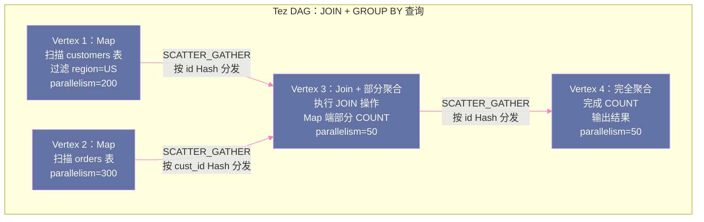

# 04 执行引擎对比：MapReduce vs Tez 的本质差异

## 摘要

Hive 支持多种计算引擎：MapReduce（历史）、Tez（当前主流）、Spark（可选）。你的集群上同时跑着 MR 作业和 Tez 作业，理解它们的本质差异是调优和排障的前提。MapReduce 是一个极其保守的执行模型——它假设一切都可能失败，通过把每个 Stage 的中间结果写入 HDFS 来实现容错，代价是巨大的磁盘 I/O 放大。Tez 的核心突破是将 MapReduce 的"两阶段"模型扩展为通用的 DAG（有向无环图），并通过 Container 复用消除了 JVM 频繁启动的开销——这两个改进使得 Tez 在多阶段 SQL（含 JOIN、子查询、窗口函数）上比 MR 快 2-10 倍。本文从 MapReduce 的架构局限出发，系统讲解 Tez 的 DAG/Vertex/Edge/Task 模型，深入剖析 Tez ApplicationMaster 的任务调度机制，以及 Tez Session 模式（Container 复用）的实现原理，最终以性能数据和选择建议收尾。

---

## 第 1 章 MapReduce 的架构局限：为什么它在 Hive 场景下很慢

### 1.1 MapReduce 的设计哲学

MapReduce 诞生于 Google 2003 年的论文，其设计目标是解决大规模批处理计算的**容错性**问题——在廉价服务器组成的集群上，机器故障是常态而非异常。MapReduce 的核心设计决策是：**每个计算阶段（Map 和 Reduce）的中间结果都写入持久化存储（HDFS），以便任何节点故障后可以从上一个持久化检查点重新恢复**。

这个设计在 2003 年是正确的工程权衡——当时廉价服务器的 MTBF（平均故障间隔时间）可能只有几个月，大规模集群的节点故障率相当高，持久化中间结果是必要的容错手段。

但这个设计在 SQL 执行场景下暴露了严重的性能问题。

### 1.2 MR 执行 SQL 的代价：多阶段级联

一条包含 JOIN 和 GROUP BY 的 SQL 在 MR 模式下需要多个串行的 MR Job，每个 Job 之间通过 HDFS 文件交换数据：

以 `SELECT a.id, COUNT(b.order_id) FROM customers a JOIN orders b ON a.id = b.cust_id WHERE a.region = 'US' GROUP BY a.id` 为例：

```
MR Job 1（JOIN 阶段）：
  Map 端：
    - 扫描 customers 表，过滤 region='US'，输出 (id, name) 到 Shuffle
    - 扫描 orders 表，输出 (cust_id, order_id) 到 Shuffle
  Shuffle：按 id/cust_id 分发到 Reducer
  Reduce 端：执行 JOIN，输出 (id, order_id) 到 HDFS 临时文件 /tmp/hive/stage1/
  ↓ HDFS 写入（每个 Reducer 输出一个文件）

MR Job 2（GROUP BY 阶段）：
  Map 端：读取 /tmp/hive/stage1/ 的文件（HDFS 读取！）
  Shuffle：按 id 分发到 Reducer
  Reduce 端：执行 COUNT，输出结果到 HDFS 最终目录
  ↓ HDFS 写入

总 I/O：
  原始数据读取（1次）+ 中间 JOIN 结果写入 HDFS（1次）+ 中间 JOIN 结果读取（1次）+ 最终结果写入（1次）
  = 4次 HDFS I/O，而实际必要的只有 2 次（原始读取 + 最终写入）
```

对于更复杂的 SQL（3 个 JOIN + 2 个子查询），可能产生 5-8 个串行 MR Job，中间文件的写入/读取次数成倍增加。每次 HDFS 写入涉及数据块的 3 副本复制，实际 I/O 放大系数是理论值的 3 倍。

### 1.3 MR 的 JVM 启动代价

MapReduce 的每个 Task（Map 或 Reduce）都运行在独立的 JVM 进程中，每个 JVM 需要：
- JVM 进程启动：100-500ms（取决于 classpath 大小和服务器负载）
- Hive 类加载：加载 Hive 所有依赖的 JAR（hive-exec.jar 等，总计数百 MB），触发大量类加载：200-1000ms
- 初始化（SerDe、Operator 对象创建）：50-200ms

**总启动开销：0.5-2 秒/Task**。对于一个有 1000 个 Map Task 的作业，即使 Task 实际执行只需要 10 秒，JVM 启动开销也贡献了 5-20% 的总时间。更严重的是，如果有多个串行 MR Job（复杂 SQL），每个 Job 的 Task 都需要重新启动 JVM，这个代价被放大 N 倍。

### 1.4 MR 的两阶段限制

MapReduce 只支持 **Map + Reduce** 两个阶段，无法直接表达更复杂的数据流图。任何复杂的数据处理逻辑都必须被切分为若干个两阶段的 MR Job 的串行链——这既增加了编排复杂性，也增加了不必要的 HDFS 中间文件。

例如，一个需要先 JOIN、然后排序、然后聚合的操作，理论上可以在内存中流水线执行（JOIN 的输出直接流入排序，排序输出直接流入聚合），但 MR 的两阶段限制迫使每个"阶段"都成为独立的 MR Job，每步都要落盘。

---

## 第 2 章 Tez 的设计思想：用 DAG 替代两阶段

### 2.1 Tez 的核心创新

**Apache Tez**（2013 年 Hortonworks 主导开发，已进入 Apache 顶级项目）的核心创新是：将 MapReduce 的"两阶段"模型推广为**通用的有向无环图（DAG）**，并在 YARN 上运行这个 DAG，而不是通过 HDFS 文件链接多个 MR Job。

Tez 的哲学：**数据处理的本质是在数据集上施加一系列变换，这些变换天然形成一个有向无环图——图中的每个节点（Vertex）消费上游节点的输出，产生下一个节点的输入，相邻节点之间的数据流不必经过持久化存储**。

> [!info] 核心概念
> Tez 并非"比 MapReduce 更快的 MapReduce"，而是一个全新的通用数据处理框架。MapReduce 是 Tez 可以表达的一种特殊 DAG（只有两个 Vertex：Map Vertex → Reduce Vertex，Edge 类型是 Scatter-Gather Shuffle）。Tez 的能力远超 MapReduce：它可以表达多路 JOIN（多个 Vertex 同时运行，结果汇聚到一个 Join Vertex），可以表达流水线处理（上游 Vertex 的输出直接流入下游 Vertex，无需全部完成后再开始），可以表达广播（将一个 Vertex 的完整输出广播到所有下游 Vertex）。

### 2.2 Tez 的核心概念：DAG、Vertex、Edge、Task

**DAG（有向无环图）**：一次 Hive 查询对应一个 Tez DAG。DAG 中的节点是 Vertex，边是 Edge。DAG 描述了整个查询的计算拓扑。

**Vertex（顶点）**：DAG 中的计算节点，每个 Vertex 对应一组并行运行的 Task。Vertex 有以下关键属性：
- `parallelism`：并发度（Task 数量），即这个 Vertex 同时运行多少个 Task
- `processorDescriptor`：Task 中运行的计算逻辑（Hive 的 Processor 实现，封装了对应的 Operator Tree 片段）
- 输入/输出配置：如何读取输入数据，如何写出输出数据

**Edge（边）**：连接两个 Vertex 的数据通道。Edge 定义了上游 Vertex 的输出数据如何路由到下游 Vertex 的输入。Edge 有三种语义类型：

| Edge 类型 | 数据路由方式 | 对应 SQL 操作 |
|----------|-----------|------------|
| **SCATTER_GATHER** | 按 Key Hash 分发（类似 MR Shuffle）| GROUP BY、JOIN、ORDER BY |
| **BROADCAST** | 上游每个 Task 的完整输出广播给下游所有 Task | Map Join（小表广播）|
| **ONE_TO_ONE** | 上游第 i 个 Task 的输出发给下游第 i 个 Task | 不需要 Shuffle 的流水线操作 |

**Task（任务）**：Vertex 中的并发执行单元，每个 Task 处理输入数据的一个分片。Task 运行在 YARN Container 中。

### 2.3 Tez DAG 的执行模型

以前面那条 SQL（JOIN + GROUP BY）为例，Tez 的 DAG 表示：



**与 MR 的关键差异**：
- V1 和 V2 可以**并行运行**（同时扫描两张表），而 MR 模式下两张表的扫描在同一个 MR Job 的 Map 阶段，需要等所有 Map 完成后才能开始 Reduce（JOIN）
- V3 完成 JOIN 后，输出数据**直接通过内存缓冲区传输给 V4**（Tez 的 Pipelined Shuffle），而不是写入 HDFS 再被 V4 读取
- 整个 DAG 是一个整体提交给 YARN 的作业，而不是 2 个串行的 MR Job（各自有独立的 ApplicationMaster 启动开销）

---

## 第 3 章 Tez ApplicationMaster：DAG 的大脑

### 3.1 Tez AM 的角色

在 YARN 上，每个 Tez 作业有一个专属的 **Tez ApplicationMaster（Tez AM）**。Tez AM 是整个 DAG 执行的指挥中心，运行在 YARN 的一个 Container 中，负责：

1. **Vertex 调度**：决定 DAG 中哪些 Vertex 可以开始运行（所有上游 Vertex 都已完成），按拓扑顺序调度 Vertex
2. **Task 分配**：向 YARN ResourceManager 申请 Container，将 Vertex 的 Task 分配到获得的 Container 上运行
3. **任务监控**：实时监控所有 Task 的状态（运行中/成功/失败/超时）
4. **故障处理**：当某个 Task 失败时，决定重试策略（在同一 Container 重试，或申请新 Container）
5. **推测执行（Speculative Execution）**：当某个 Task 明显慢于同 Vertex 的其他 Task 时，在另一个 Container 上启动相同 Task 的副本，取最先完成的结果

### 3.2 Tez AM 的 Vertex 调度细节

Tez AM 内部维护每个 Vertex 的状态机：

```
VERTEX 状态转换：
  NEW → INITIALIZING：收到 DAG 提交，开始初始化
  INITIALIZING → INITED：Vertex 的输入/输出配置完成
  INITED → RUNNING：所有上游 Vertex 完成（DAG 依赖满足），开始申请 Container
  RUNNING → SUCCEEDED：所有 Task 成功完成
  RUNNING → FAILED：Task 失败次数超过阈值（hive.tez.max.partition.factor 控制）
```

**Vertex 的并发调度**：Tez AM 允许没有依赖关系的 Vertex 并发运行。在复杂 SQL（多表 JOIN）中，读取不同输入表的 Map Vertex 可以同时运行，充分利用集群资源。这是 Tez 相比串行 MR Job 的重要优势——多个 Vertex 的 I/O 可以并行，集群 I/O 利用率更高。

---

## 第 4 章 Tez Session 模式：Container 复用的工程价值

### 4.1 Container 复用解决了什么问题

前面分析了 MR 的 JVM 启动代价（0.5-2 秒/Task）。Tez 通过 **Container 复用（Container Reuse）** 彻底解决了这个问题。

**Container 复用的原理**：

在普通模式下，每个 Task 在一个新 Container（新 JVM 进程）中运行，Task 完成后 Container 立即被 YARN 释放。

在 Container 复用模式下，Task 完成后，Container 不立即释放，而是**保留在 Tez AM 的 Container 池中**，等待被下一个 Task 复用。下一个 Task 启动时，直接在已存在的 JVM 中运行（不需要重启 JVM，不需要重新加载类），节省了 0.5-2 秒的启动时间。

**Tez Session 模式**：在 Hive-on-Tez 场景中，Container 复用进一步扩展为"Session 内跨 DAG 的 Container 复用"——同一个 Hive Session 内，前一个查询用完的 Container 不归还给 YARN，而是保留给同 Session 的下一个查询使用。

```
Hive Session 内，连续执行 3 条 SQL：

SQL 1（10 个 Map Task，5 个 Reduce Task）：
  申请 15 个 Container → 执行 → 完成后保留 Container 在 Session Pool

SQL 2（8 个 Map Task，4 个 Reduce Task）：
  直接从 Session Pool 取 12 个 Container → 执行（无 JVM 启动开销！）
  → 完成后归还 3 个多余 Container，保留 12 个

SQL 3（20 个 Task）：
  从 Session Pool 取 12 个 Container，再向 YARN 申请 8 个
  → 执行 → 完成后 Session 结束，归还所有 Container
```

在 Hive Session 内连续执行 SQL 的场景（如 Beeline 执行脚本、ETL 工具），Container 复用可将查询的"冷启动"开销从秒级降到几十毫秒级。

### 4.2 Tez Session 的配置

```xml
<!-- 开启 Tez 执行引擎 -->
<property>
  <name>hive.execution.engine</name>
  <value>tez</value>
</property>

<!-- Tez Session 模式（Hive-on-Tez 的默认是 Session 模式）-->
<property>
  <name>hive.server2.tez.sessions.per.default.queue</name>
  <value>1</value>  <!-- 每个 YARN 队列预分配的 Tez Session 数量 -->
</property>

<!-- Container 复用配置 -->
<property>
  <name>tez.am.container.reuse.enabled</name>
  <value>true</value>  <!-- 开启 Container 复用 -->
</property>
<property>
  <name>tez.am.container.reuse.rack-fallback.enabled</name>
  <value>true</value>  <!-- Container 可以在同机架的其他节点上复用 -->
</property>
<property>
  <name>tez.am.container.idle.release-timeout-min.millis</name>
  <value>5000</value>   <!-- 空闲 Container 最短保留 5 秒（等待被复用）-->
</property>
<property>
  <name>tez.am.container.idle.release-timeout-max.millis</name>
  <value>60000</value>  <!-- 空闲 Container 最长保留 60 秒（超时则归还 YARN）-->
</property>
```

### 4.3 Tez Session 与 YARN 队列的关系

在 `hive.server2.tez.sessions.per.default.queue=1` 时，HS2 会在启动时（或第一次需要时）在 YARN 上预启动一个 Tez AM，这个 Tez AM 持续运行（不随查询结束而终止），等待 HS2 提交新的 DAG。

**生产中的资源规划**：Tez AM 本身需要资源（通常配置 4GB 内存，2 VCore），并且它持续占用这部分资源（即使没有查询在运行）。在多租户环境下，每个 YARN 队列预分配多少 Tez Session，需要平衡"冷启动延迟"（Session 少时新查询需要等待 Tez AM 启动）和"资源浪费"（Session 多时大量 Tez AM 持续占用资源但空闲）。

---

## 第 5 章 MR vs Tez 的全面对比

### 5.1 执行模型对比

| 维度 | MapReduce | Tez |
|-----|----------|-----|
| **执行图模型** | 两阶段（Map + Reduce）| 通用 DAG（任意有向无环图）|
| **多阶段 SQL** | 多个串行 MR Job，通过 HDFS 文件衔接 | 单个 DAG，Vertex 间数据通过内存/缓冲区传输 |
| **中间数据落盘** | 必须（每个 Stage 完成后写 HDFS）| 可选（Pipelined Shuffle 可不落盘）|
| **Vertex 并发** | 同一 Job 内 Map 并发，但 Job 间串行 | DAG 中无依赖关系的 Vertex 全部并发 |
| **JVM 启动代价** | 每个 Task 启动新 JVM（0.5-2 秒）| Container 复用，Task 复用已有 JVM |
| **YARN AM 数量** | 每个 MR Job 一个 AM（N 个串行 Job = N 个 AM）| 整个 DAG 一个 Tez AM |
| **容错粒度** | Task 级别（失败重试 Task）| Task 级别（可配置 Vertex 级别）|

### 5.2 性能对比（典型场景）

以下基于真实 Hive 集群的性能对比数据（仅供参考，实际差异因 SQL 复杂度和数据量而异）：

| SQL 类型 | MR 执行时间 | Tez 执行时间 | 加速比 |
|---------|-----------|-----------|------|
| 单表 COUNT/SUM（无 JOIN）| 120s | 80s | 1.5x |
| 两表 JOIN + GROUP BY | 450s | 120s | 3.75x |
| 三表 JOIN + 子查询 | 900s | 180s | 5x |
| 复杂窗口函数（多个 Shuffle）| 1200s | 200s | 6x |
| 简单 `SELECT ... WHERE ...`（无 Shuffle）| 30s | 35s（Tez AM 启动开销）| 0.86x |

**规律**：越是涉及多次 Shuffle（多表 JOIN、多级聚合、窗口函数）的 SQL，Tez 的优势越明显。对于简单的无 Shuffle 操作（单表过滤），Tez 因 AM 启动开销反而可能略慢于 MR（如果 Tez Session 未预热）。

### 5.3 什么情况下 MR 仍然是合理的选择

尽管 Tez 在多数场景更快，但 MR 在以下场景仍有保留价值：

**超长批处理作业（运行时间 > 4 小时）**：Tez AM 是一个长期运行的进程，如果 Tez AM 所在的节点发生硬件故障，整个 DAG 需要从头重新运行（没有检查点）。而 MR 每个 Stage 完成后结果都持久化在 HDFS，节点故障只影响当前 Stage，从 HDFS 中间文件重新运行，不会损失之前 Stage 的工作。对于运行 4-8 小时的超长 ETL 作业，MR 的这种中间检查点能力具有实际价值。

**资源极度受限的集群**：Tez Session 模式需要持续运行 Tez AM（占用 4GB+ 内存），在资源紧张的集群（内存总量 < 100GB）这个开销不可忽视。

**遗留兼容性**：某些旧版本的 HMS 或 YARN 组件与 Tez 存在兼容性问题，升级困难的场景不得不继续使用 MR。

---

## 第 6 章 Tez 的 Shuffle 机制详解

### 6.1 Tez 的三种 Edge 数据传输方式

Tez 的 Edge 不只是一个逻辑上的数据通道，它背后有具体的数据传输实现：

**SCATTER_GATHER（分散-收集，等价于 MR Shuffle）**：

上游 Task 将输出数据按 Key Hash 分区，序列化后写入本地磁盘（Tez 的 `LocalDiskShuffleManager`）。下游 Task 启动后，通过 HTTP 从所有上游 Task 的节点拉取属于自己分区的数据。这与 MR 的 Shuffle 机制完全相同，但数据不经过 HDFS——数据存储在上游 Task 的本地磁盘（NodeManager 的 `tez.am.shuffle.auxiliary-service.port` 服务提供 HTTP 下载）。

**BROADCAST（广播）**：

上游所有 Task 的完整输出都发送给下游每个 Task。用于 Map Join（小表广播）：小表的数据被每个处理大表的 Task 完整接收，加载到内存 Hash 表中。Broadcast Edge 要求上游数据量小（能放入内存）。

**PIPELINED（流水线，ONE_TO_ONE 的变体）**：

上游 Task 产生的数据直接流入下游 Task（不需要上游全部完成），实现真正的流水线处理。适用于简单的转换（过滤、投影）。

### 6.2 Tez 的 Speculative Execution（推测执行）

**推测执行**解决"慢任务"（Straggler）问题：在一个 Vertex 的所有 Task 中，如果某个 Task 明显比其他 Task 慢（可能由于所在节点负载高、磁盘 I/O 慢），它会拖慢整个 Vertex 的完成时间（一个 Vertex 必须等所有 Task 完成才算完成）。

推测执行策略：当一个 Task 的进度明显落后（超过某个阈值）时，Tez AM 在另一个 Container 上启动相同 Task 的副本（Speculative Task），两个副本并行运行，取先完成的结果，另一个副本被取消。

```xml
<!-- Tez 推测执行配置 -->
<property>
  <name>tez.am.speculation.enabled</name>
  <value>true</value>
</property>
<property>
  <name>tez.task.max-allowed-output-failures-fraction</name>
  <value>0.1</value>  <!-- 允许 10% 的 Task 推测执行失败后整体重试 -->
</property>
```

> [!warning] 生产避坑
> **数据倾斜场景不适合依赖推测执行**：如果某个 Reducer 收到了大量数据（数据倾斜），推测执行无法解决问题——副本 Task 收到同样多的数据，运行时间相同，只是浪费了双倍资源。数据倾斜需要通过 Skew Join 优化或手动加盐（Salt）来解决，不是推测执行的适用场景。

---

## 小结

MapReduce 和 Tez 代表了两种不同的批处理哲学：

- **MapReduce**：以容错为首要设计目标，通过 HDFS 持久化每个 Stage 的中间结果换取节点故障恢复能力。代价是多阶段 SQL 产生大量不必要的 HDFS I/O 放大，以及每个 Task JVM 启动的固定开销。适合超长批处理作业（需要中间检查点）
- **Tez**：以执行效率为首要设计目标，将 MR 的两阶段模型升级为通用 DAG，无依赖的 Vertex 并发执行，Vertex 间数据通过内存缓冲区传输（不落 HDFS），Container 复用消除 JVM 启动开销。在多阶段 SQL（JOIN + GROUP BY + 窗口函数）上比 MR 快 2-6 倍

**生产选型建议**：
- 新建 Hive 集群：默认 `hive.execution.engine=tez`，配置 Tez Session 模式预热
- 遗留 MR 作业：优先迁移到 Tez，特别是包含多次 JOIN 的 SQL
- 超长批处理（>4h）：评估是否需要 MR 的中间检查点特性；Tez 也支持中间结果持久化，但默认不开启

第 05 篇深入查询优化器：Hive RBO 的完整规则集（谓词下推、列裁剪、Join 重排序的内部算法），以及 Hive 如何集成 Apache Calcite 实现 CBO，统计信息收集对 CBO 效果的影响。

---

## 参考资料

- [Apache Tez 官方文档](https://tez.apache.org/user-guide.html)
- [Tez 设计文档：Data Processing API](https://tez.apache.org/design-documents/TEZ-DAG.html)
- [Hortonworks Blog: Hive on Tez（经典分析）](https://hortonworks.com/blog/hive-0-13-is-here/)
- [MapReduce 原始论文：Dean & Ghemawat, OSDI 2004](https://static.googleusercontent.com/media/research.google.com/en//archive/mapreduce-osdi04.pdf)
