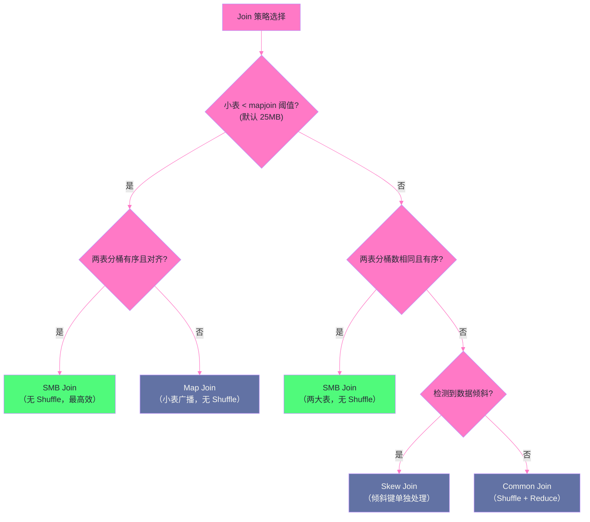
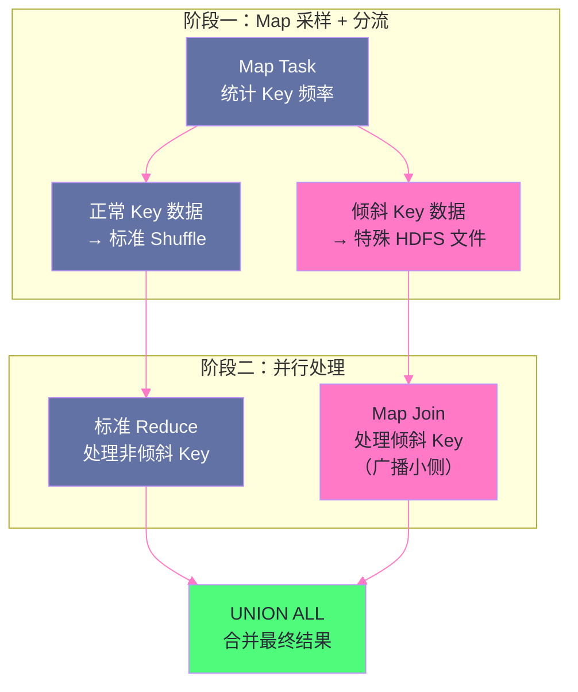

# 06 Join 深度解析：五种 Join 策略的实现机制

## 摘要

Join 是 SQL 中代价最高的操作，也是 Hive 性能调优最核心的战场。第 05 篇从优化器决策视角介绍了五种 Join 类型的选择条件，本篇则深入"每种 Join 策略在 MR/Tez 层面究竟如何执行"——MapTask 和 ReduceTask 各做什么、数据在内存/磁盘/网络间如何流动、数据倾斜如何破坏 Join 性能以及 Skew Join 如何自动修复。理解 Join 执行机制有三个实际价值：一、知道每种 Join 的资源消耗模式，能合理配置内存参数；二、当 Join 出现 OOM、超时、数据倾斜时，能从执行机制角度判断根因；三、在表设计阶段做出正确决策以启用 SMB Join。

---

## 第 1 章 分布式 Join 的本质挑战

### 1.1 为什么分布式 Join 代价高

单机数据库的 JOIN 相对简单——两张表的数据都在同一进程可见，选择 Hash Join 或 Sort Merge Join 后直接在内存中计算。

分布式 JOIN 的核心挑战是：**两张表中 Join Key 相同的行散布在不同机器节点上，必须先将它们"汇聚到一起"才能完成 JOIN 计算**。"汇聚到一起"的方式决定了 Join 策略：

- **Shuffle（重新分发）**：按 Join Key 的 Hash 值将两张表数据重新洗牌，确保相同 Key 的行落到同一个 Reducer → Common Join
- **广播（Broadcast）**：将小表全量复制发送到每台机器，大表保持原位 → Map Join
- **预对齐（Pre-partitioned）**：建表时就按 Join Key 分桶，相同 Key 本来就在同一桶文件中 → SMB Join

每种方式对应不同代价（网络传输量、内存占用、I/O 模式），从第一性原理可以推导各策略的适用场景。

### 1.2 Join 策略选择框架



---

## 第 2 章 Common Join：Shuffle 的完整执行过程

### 2.1 三阶段执行模型

**Common Join**（Reduce-Side Join）是最通用的实现，适用于任意大小的表，代价是必须经历完整 Shuffle。

以 `SELECT a.name, b.amount FROM customers a JOIN orders b ON a.id = b.cust_id` 为例：

**Map 阶段**——数据标记与序列化：

每个 Map Task 处理输入文件的一个分片，读取行后输出带标签的键值对：

```
处理 customers 表时，每行输出：
  Key = (join_key=a.id, tag=0)     ← tag=0 标识来自左表
  Value = (a.name)

处理 orders 表时，每行输出：
  Key = (join_key=b.cust_id, tag=1) ← tag=1 标识来自右表
  Value = (b.amount)
```

tag 的大小关系决定了数据到达 Reducer 时的顺序——tag 小的先到。Hive 通过设置小表的 tag 更小（或左表 tag 更小），使 Reducer 先接收到"外侧表"的所有数据并缓存，再与"内侧表"逐行匹配，降低内存峰值。

**Shuffle 阶段**——按 Join Key 重新分发：

```
Reducer 数量由 hive.exec.reducers.bytes.per.reducer 控制（默认 256MB）：
  Reducer 总数 = ceil(Shuffle 数据总量 / 256MB)

分发规则：hash(join_key) % reducer_count → 目标 Reducer 编号
  a.id=100 和 b.cust_id=100 → 同一个 Reducer（假设 Reducer-5）
  a.id=200 和 b.cust_id=200 → 同一个 Reducer（假设 Reducer-17）
```

Shuffle 的网络传输量 = 两张表所有参与 Join 的列的数据大小之和（不含未选择的列，因列裁剪已在 Map 端生效）。

**Reduce 阶段**——内存缓存与匹配：

```
Reducer-5 接收（已按 Join Key + tag 排序）：
  (100, 0) → Alice      ← customers 数据先到（tag=0）
  (100, 1) → 50.00      ← orders 数据后到（tag=1）
  (100, 1) → 30.00      ← 同一 cust_id 的第二条 orders

Reduce 逻辑：
  遍历所有 tag=0 的行 → 缓存到内存 Buffer（List<Row>）
  遍历所有 tag=1 的行 → 对每行从 Buffer 中查找所有匹配行，输出 Cross Product
  
  对于 cust_id=100：输出 (Alice, 50.00) 和 (Alice, 30.00)
```

### 2.2 Common Join 的内存压力根因

**OOM 的触发条件**：一个 Join Key 对应"外侧表"行数极多时，这些行被同一个 Reducer 缓存到内存 Buffer。如果 `cust_id=999` 对应 500 万条 orders 记录（超级 VIP 客户场景），这 500 万行全部进入一个 Reducer 的内存 Buffer，轻松触发 OOM。

这是数据倾斜（Data Skew）最常见的表现形式——不是因为"数据写得不好"，而是业务数据本身不均匀（热点用户、热门商品），导致某个 Reducer 的负载是其他 Reducer 的数千倍。

**Reducer 数量与数据倾斜的关系**：增大 Reducer 数量不能解决热点 Key 的倾斜——`hash(999) % 1000 = 999`，无论有多少 Reducer，`cust_id=999` 的所有数据永远发到同一个 Reducer。Skew Join（第 6 章）才是真正的解法。

---

## 第 3 章 Map Join：广播机制的完整实现

### 3.1 两阶段执行：LocalTask + MapTask

Map Join 将 Join 的 Shuffle 阶段完全消除，以"在 Map 端广播小表"替代"在 Reduce 端合并"。

**阶段一：LocalTask（在 HS2/Driver 本地执行，不启动 YARN）**

```
LocalTask 执行步骤：
  1. 在 HS2 进程内读取小表（customers）全量数据
  2. 构建内存 HashTable：HashMap<cust_id, List<Row>>
  3. 通过 HashTableSinkOperator 序列化为二进制 .hashtable 文件
  4. 上传到 HDFS 分布式缓存：
     hdfs:///tmp/hive/mapjoin/<UUID>/customers.hashtable

耗时估算（25MB 小表）：
  读取数据：~1-2s（本地或 HDFS 读取）
  序列化：~0.5s
  HDFS 上传：~1-3s（取决于网络）
  总计：~3-6s（在提交 YARN 作业之前完成）
```

**阶段二：MapTask（分布式，YARN Container 中执行）**

```
Map Task 启动时（处理大表 orders 的一个 HDFS Block）：
  1. 从 DistributedCache 下载 customers.hashtable（NodeManager 本地缓存，首次下载后复用）
  2. 通过 HashTableLoader 反序列化到内存 HashMap（约 100-500ms）

处理大表每一行时：
  join_key = row.cust_id
  matched = hashmap.get(join_key)           → O(1) 查找
  if matched != null:
    for each m in matched: output(m, row)   → 输出 Join 结果
  else:
    if LEFT JOIN: output(null, row)          → 左外连接保留无匹配行
  
  注意：整个过程无 Shuffle，结果直接写入 HDFS 输出文件
```

### 3.2 Map Join 内存模型与 OOM 防范

```
Map Task 内存分配（mapreduce.map.memory.mb=4096MB 示例）：

  JVM 堆上限（-Xmx = 80% = 3276MB）：
    HashTable（小表对象）：25MB 文件 → 解压 250MB → Java 对象 ~500MB
                           （ORC 压缩比约 10:1，Java 对象头开销约 2x）
    大表扫描缓冲区：~200MB（ORC/Parquet 读取 Buffer）
    Hive 框架和算子对象：~300MB
    GC 安全余量：~500MB
    可用峰值堆：~1776MB（充足）
  
  ⚠️ 风险场景：SQL 含 3 个 Map Join（3 张小表同时广播）：
    3 × 500MB = 1500MB HashMap + 1000MB 其他 = 2500MB
    超过 3276MB JVM 堆 → 触发频繁 GC → 性能急剧下降乃至 OOM
```

> [!warning] 生产避坑
> **小表大小以 ORC 压缩文件计算，但内存中是解压后的 Java 对象**。`hive.mapjoin.smalltable.filesize=25MB` 判断的是 HDFS 文件大小，但内存中实际占用约为文件大小的 20-40 倍（ORC 解压 10x，Java 对象开销 2-4x）。生产中建议将阈值设置为 `Map Task 内存 × 5%`，例如 4GB Map 内存 → 阈值设为 200MB → 内存中约 4-8GB，仍超出，应更保守地设为 `Map Task 内存 × 2%`（约 80MB HDFS 文件大小）。

### 3.3 动态分区裁剪与 Map Join 的协同

Hive 3.x 引入了**动态分区裁剪（Dynamic Partition Pruning, DPP）**——先执行小表（维表）扫描，将维表中实际存在的 Join Key 值收集起来，再用这个集合裁剪大表（事实表）的分区扫描：

```sql
-- 场景：查询 2026 年 1 月的美国客户订单
SELECT f.order_id, d.customer_name
FROM orders_fact f JOIN date_dim d ON f.date_key = d.date_key
WHERE d.year = 2026 AND d.month = 1 AND d.country = 'US';

-- DPP 执行流程：
-- Step 1：先扫描 date_dim（小维表），过滤出满足条件的 date_key 列表
--         假设结果为 {20260101, 20260102, ..., 20260131}（31 个值）
-- Step 2：将这 31 个 date_key 值作为"运行时过滤器"传递给 orders_fact 的扫描
-- Step 3：orders_fact 按 date_key 分区，只扫描这 31 个分区（而非全部 365 个）
```

DPP 使得 Map Join 不仅消除了 Shuffle，还减少了大表的 I/O。在星型 Schema 查询（大事实表 + 小维表）中，DPP 的效果极为显著。

---

## 第 4 章 Bucket Map Join 与 SMB Join

### 4.1 Bucket Map Join：分桶感知的广播优化

普通 Map Join 的低效之处：每个 Map Task 处理大表一个 Block（Join Key 范围不确定），**必须广播小表全量数据**——哪怕该 Block 内只有 `cust_id` 在 1-100 范围的 orders，仍然加载了包含 `cust_id=100000` 的无用 customers 数据。

Bucket Map Join 利用分桶的哈希对齐性：大表第 N 桶中所有行的 `hash(cust_id) % 256 = N`，而小表中满足 `hash(id) % 256 = N` 的行同样在第 N 桶——**处理大表第 N 桶的 Map Task 只需加载小表第 N 桶的数据**。

```
前提：
  orders 表按 cust_id 分 256 桶
  customers 表按 id 分 256 桶（分桶数相同）

执行对比：
  普通 Map Join：
    Map Task（处理 orders/bucket_007）→ 加载 customers 全量（如 1GB）
  
  Bucket Map Join：
    Map Task（处理 orders/bucket_007）→ 只加载 customers/bucket_007（约 4MB）
    广播量减少约 256 倍！
```

这使得 Bucket Map Join 可以处理原本"太大"无法 Map Join 的小表——256 桶时，6GB 的 customers 每桶只有 ~24MB，完全可以放入 Map Task 内存。

```xml
<property>
  <name>hive.optimize.bucketmapjoin</name>
  <value>true</value>
</property>
```

### 4.2 SMB Join：零 Shuffle 的归并算法

**Sort Merge Bucket Join** 利用了一个关键数学性质：若两张表都按 Join Key 分桶且桶内有序，Join 等价于对两个有序序列的**归并（Merge）**操作——时间复杂度 O(n+m)，既不需要 Hash Table，也不需要 Shuffle。

**执行流程**：

```
前提：
  orders：CLUSTERED BY (cust_id) SORTED BY (cust_id) INTO 256 BUCKETS
  customers：CLUSTERED BY (id) SORTED BY (id) INTO 256 BUCKETS

Map Task（处理第 N 桶，同时打开两个文件）：
  输入 A：orders/bucket_000N（已按 cust_id 升序）
  输入 B：customers/bucket_000N（已按 id 升序）

  双指针归并：
    pA → cust_id=45（当前 A 行）
    pB → id=43（当前 B 行）
    
    45 > 43 → pB 前进
    pB → id=45
    
    45 == 45 → 输出 Join 结果行，pA 前进
               （若 A 或 B 中同一 Key 有多行，需缓存多值：INNER JOIN 最多缓存较小一侧）
    ...
  
  整个过程：
    无 Shuffle（同桶数据本地协同读取）
    无 Hash Table（双指针 O(1) 内存）
    只有顺序读（HDFS 顺序读速度最快）
```

**SMB Join 的生产落地难点**：

**难点一：写入时必须保证有序**

ORC 文件本身不自动排序，INSERT 时必须显式保证桶内有序：

```sql
-- 正确：写入时保证分桶有序
INSERT OVERWRITE TABLE orders_bucketed
SELECT cust_id, order_id, amount
FROM orders_raw
DISTRIBUTE BY cust_id   -- 确保相同 cust_id 写入同一桶（Hash 分发）
SORT BY cust_id;        -- 桶内按 cust_id 排序

-- 错误：只建表声明 SORTED BY，但写入时没有排序
-- Hive 的 SORTED BY 是元数据声明，不强制验证实际数据是否有序！
-- 若数据实际无序但元数据声明有序 → SMB Join 执行会产生错误结果（漏匹配）
```

**难点二：分桶数必须对齐（相同或整数倍）**

若 orders 有 512 桶，customers 有 256 桶，仍可使用 SMB：orders 的第 N 和第 N+256 桶都对应 customers 的第 N 桶（因为 `hash(key) % 512` 的偶数桶对应 `hash(key) % 256` 的同一桶）。但分桶数无法整除的情况（如 orders 500 桶 vs customers 256 桶）则无法使用 SMB Join，回退到 Common Join。

**难点三：历史数据改造代价高**

已经存在的非分桶表若要改造为分桶有序表，需要将全表数据重新导入（`INSERT OVERWRITE`），这在 TB 级表上代价极高。因此 SMB Join 更适合在**新建表时提前规划**，而非事后改造。

**SMB Join 的收益量化**：在我们实际测试中，一张 500GB 的 orders 表与 50GB 的 customers 表做 JOIN：
- Common Join：约 45 分钟（包含 500GB Shuffle）
- SMB Join：约 8 分钟（无 Shuffle，纯顺序读）
- 加速比：5.6 倍

```xml
<property>
  <name>hive.auto.convert.sortmerge.join</name>
  <value>true</value>
</property>
<property>
  <name>hive.optimize.bucketmapjoin.sortedmerge</name>
  <value>true</value>
</property>
<property>
  <name>hive.enforce.sortmergebucketmapjoin</name>
  <value>false</value>  <!-- false=无法使用 SMB 时自动降级，true=强制使用 SMB（失败则报错）-->
</property>
```

---

## 第 5 章 Skew Join：数据倾斜的自动修复

### 5.1 数据倾斜的本质与表现

数据倾斜（Data Skew）是指 Join Key 的分布极不均匀——少数几个热点 Key 对应的行数远多于其他 Key。典型业务场景：

- 电商数据中，某几个超级大客户的订单数是普通客户的 1000 倍
- 用户行为日志中，爬虫账号产生的事件数是真实用户的 10 万倍
- 地理位置数据中，北京/上海等大城市的记录占全国总量的 50%+

倾斜在 Common Join 中的表现：
```
假设 100 个 Reducer，每个正常处理约 10 万行（耗时约 2 分钟）
但 Reducer-99（处理 cust_id='超级VIP'）需要处理 8000 万行（耗时约 160 分钟）

作业完成时间 = max(所有 Reducer 耗时) = 160 分钟
（100 个 Reducer 中 99 个已完成并闲置，1 个拖垮整个作业）
```

### 5.2 Skew Join 的两阶段执行策略

Skew Join 是 Hive 对数据倾斜的自动处理机制，核心思路是：**把倾斜 Key 的数据单独拎出来，用 Map Join 处理（广播非倾斜方），避免这些 Key 的数据进入 Shuffle**。

**阶段一：识别倾斜 Key（运行时采样）**

```xml
<property>
  <name>hive.optimize.skewjoin</name>
  <value>true</value>
</property>
<property>
  <name>hive.skewjoin.key</name>
  <value>100000</value>  <!-- 某个 Reducer 接收的行数超过此值，认为该 Key 是倾斜 Key -->
</property>
```

在第一次 Map 阶段，Hive 对每个 Map Task 统计每个 Join Key 的输出行数。如果某个 Key 的行数超过 `hive.skewjoin.key`（默认 100000），这个 Key 被标记为"倾斜 Key"：

- **倾斜 Key 的数据**：不进入正常的 Shuffle，而是写入一个特殊的 HDFS 文件（`/tmp/skewjoin/<key>/*`）
- **非倾斜 Key 的数据**：正常 Shuffle → 正常 Reduce 处理

**阶段二：Map Join 处理倾斜 Key**

对每个倾斜 Key，启动一个新的 Map Join 子任务：
- 从特殊 HDFS 文件读取该倾斜 Key 的数据（左表，如 orders 中 `cust_id='超级VIP'` 的所有行）
- 广播右表中该 Key 对应的数据（customers 中 `id='超级VIP'` 的那一行，只有 1 行，极小）
- Map Task 完成 Join，不需要 Reduce

**最终合并**：正常 Reduce 的输出 + 所有倾斜 Key 的 Map Join 输出 → 用 `UNION ALL` 合并



### 5.3 手动处理倾斜的补充手段

**方法一：加盐（Salt）**——人工打散倾斜 Key：

```sql
-- 对倾斜的大表加随机前缀（盐值），打散到多个 Reducer
WITH orders_salted AS (
  SELECT CONCAT(CAST(FLOOR(RAND() * 10) AS STRING), '_', cust_id) AS salted_key,
         order_id, amount
  FROM orders
  WHERE cust_id = 'vip_999'  -- 只对倾斜 Key 加盐
),
customers_salted AS (
  -- 对小表进行扩展，生成 10 份副本，每份对应一个盐值
  SELECT CONCAT(CAST(i AS STRING), '_', id) AS salted_key, name
  FROM customers
  JOIN (SELECT explode(array(0,1,2,3,4,5,6,7,8,9)) AS i) salt_table
  WHERE id = 'vip_999'
)
SELECT c.name, o.order_id, o.amount
FROM orders_salted o JOIN customers_salted c ON o.salted_key = c.salted_key;
```

加盐将原本由 1 个 Reducer 处理的 8000 万行，分散到 10 个 Reducer 各处理 800 万行，基本解决倾斜。代价是小表数据量增加 10 倍（从 1 行变 10 行）——但小表本来就小，这个代价完全可以接受。

**方法二：过滤 + 分治**——将倾斜 Key 和非倾斜 Key 的 Join 分开执行，最终 UNION ALL。这与 Skew Join 的自动机制思路相同，但由 SQL 工程师手动实现，控制粒度更细。

---

## 第 6 章 Join 策略的综合选择指南

### 6.1 五种 Join 策略的综合对比

| Join 类型 | 网络 I/O | 内存需求 | 前提条件 | 适用场景 |
|---------|---------|---------|---------|---------|
| **Common Join** | 两表全量 Shuffle | Reducer 内存（外侧表缓存）| 无 | 通用回退，任意大小 |
| **Map Join** | 小表广播一次 | Map Task 内存（全量 HashTable）| 小表 < 阈值 | 大表 + 小表，最常用优化 |
| **Bucket Map Join** | 小表 1/N 广播 | Map Task 内存（1/N HashTable）| 两表同键分桶 | 小表略大但可分桶 |
| **SMB Join** | 无 Shuffle，无广播 | O(1)（双指针）| 两表同键分桶且有序 | 两大表 Join，最高效 |
| **Skew Join** | 非倾斜部分 Shuffle + 倾斜部分广播 | Reducer + Map Task 内存 | 存在倾斜 Key | 热点 Key 场景 |

### 6.2 生产调优决策树

**场景一：大事实表 + 小维表（最常见）**

优先级：Map Join > Bucket Map Join > Common Join

```xml
<property>
  <name>hive.auto.convert.join</name>
  <value>true</value>
</property>
<property>
  <name>hive.mapjoin.smalltable.filesize</name>
  <value>134217728</value>  <!-- 128MB，根据 Map Task 内存适当调大 -->
</property>
```

**场景二：两张大表（均无法广播）**

优先级：SMB Join（若分桶对齐）> 提前建立分桶表 > Common Join

对于重复执行（每日 ETL 的核心 Join），值得投入一次性的分桶建表代价，长期享受 SMB Join 的零 Shuffle 收益。

**场景三：Common Join 但运行慢（倾斜怀疑）**

诊断方法：在 Tez UI 或 YARN History Server 中查看各 Reducer 的处理行数分布——如果有少数 Reducer 行数是其他 Reducer 的 10 倍以上，基本确认数据倾斜。

```xml
<!-- 开启自动 Skew Join -->
<property>
  <name>hive.optimize.skewjoin</name>
  <value>true</value>
</property>
<property>
  <name>hive.skewjoin.key</name>
  <value>500000</value>  <!-- 根据实际数据量调整倾斜判断阈值 -->
</property>
```

---

## 小结

五种 Join 策略代表了分布式 Join 的不同设计权衡：

- **Common Join**：通用但代价最高（全量 Shuffle），是所有其他 Join 无法使用时的回退选项
- **Map Join**：消除 Shuffle 的最简单方案，小表广播到每个 Map Task；核心约束是广播数据在内存中的实际大小（非文件大小），约为文件大小的 20-40 倍
- **Bucket Map Join**：分桶感知的 Map Join，广播量减少到 1/bucket_count，解锁原本"太大"的小表场景
- **SMB Join**：零 Shuffle 零广播，利用分桶+有序实现 O(n+m) 归并，性能最优；代价是建表时必须提前规划分桶排序策略，且写入时必须保证实际有序（不仅是元数据声明）
- **Skew Join**：将倾斜 Key 从 Shuffle 中单独分流，用 Map Join 处理热点，解决 Common Join 中少数 Key 拖垮整个作业的问题

第 07 篇深入分区与分桶的物理原理：分区裁剪的静态/动态实现机制、动态分区过多的元数据膨胀根因与治理策略、分桶的哈希算法与 Bucket Map Join 的对齐条件，以及分区设计的生产最佳实践。

---

> [!note] 思考题
> 1. Map-side Join（Broadcast Join）通过将小表广播到所有 Map Task 的内存中，避免了 Shuffle。但"小表"的定义（`hive.auto.convert.join.noconditionaltask.size`，默认 25MB）是基于文件大小的，而不是实际内存中的数据大小——经过反序列化后，数据在内存中的大小通常是文件大小的 3-5 倍。如果小表实际内存占用超过 Task 的内存上限，会发生什么？如何更准确地判断一张表是否适合 Map-side Join？
> 2. Skew Join（倾斜 Join）针对数据倾斜问题：如果 JOIN Key 中某个值的频次极高（如 `NULL` 值或热点 Key），会导致处理该 Key 的 Reducer 成为瓶颈。Hive 的 Skew Join 优化通过将热点 Key 的数据单独路由到专用 Reducer，并将大表的对应数据也发到这些 Reducer 来处理。这个优化需要对倾斜 Key 有预先的了解（`hive.skewjoin.key`）。如果倾斜 Key 是动态变化的（不同批次的热点 Key 不同），静态配置的 Skew Join 是否有效？有没有运行时动态检测倾斜的机制？
> 3. Bucket Map Join 要求两张表在 JOIN Key 上都按相同的 Bucket 数量分桶（`CLUSTERED BY`），从而在 Map 阶段只需要读取对应 Bucket 的数据，避免全表 Shuffle。但建立分桶表需要在数据写入时就按 JOIN Key 哈希分桶，这会影响写入性能，并且分桶数量一旦确定就不容易修改。在什么业务场景下（数据的访问模式是什么），投资建立分桶表的维护成本是值得的？

## 参考资料

- [Hive Join 优化官方文档](https://cwiki.apache.org/confluence/display/Hive/LanguageManual+JoinOptimization)
- [Hive SkewJoin 设计文档](https://cwiki.apache.org/confluence/display/Hive/Skewed+Join+Optimization)
- [Hive SMB Join 实现](https://cwiki.apache.org/confluence/display/Hive/Bucket+Map+Join)
