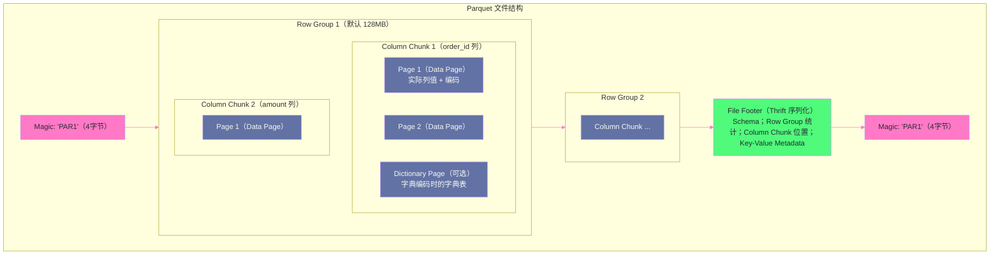

# 08 ORC 与 Parquet：列式存储格式的内部结构与选型

## 摘要

存储格式是 Hive 查询性能的物理基础。选择正确的文件格式，能让同一条 SQL 的 I/O 从 1TB 降到 50GB——这不是夸张，而是列式存储与谓词下推协同作用的真实效果。Hive 生产环境中最主流的两种格式是 **ORC**（Optimized Row Columnar，Hive 原生）和 **Parquet**（Apache 开源，Spark/Presto 生态首选）。这两种格式都是列式存储，但在内部结构设计、压缩编码策略、谓词下推粒度、跨引擎兼容性方面存在显著差异。本文从行式存储的局限讲起，深入 ORC 的 Stripe/Index/Column Chunk 三层结构与 Parquet 的 Row Group/Column Chunk/Page 三层结构，解析字典编码、Run Length Encoding、Bit Packing 等压缩编码技术的工作原理，分析两种格式在谓词下推粒度上的差异，并给出面向生产的选型建议。

---

## 第 1 章 为什么列式存储会出现

### 1.1 行式存储的天然局限

关系型数据库（MySQL、PostgreSQL）和早期的 HDFS 文本格式都是**行式存储**——一张表的每一行数据在磁盘上连续存放：

```
行式存储布局示例（orders 表，5列：order_id, cust_id, amount, status, dt）：

物理磁盘字节流：
[1, 100, 99.90, 'paid', '2026-01-15'] [2, 101, 50.00, 'pending', '2026-01-15'] [3, 102, 200.00, 'paid', '2026-01-16'] ...
```

行式存储在 OLTP（事务处理）场景下表现出色：插入/更新一行只需写入一个连续区域，点查（`SELECT * WHERE order_id = 1`）只需读取一行的数据。

但 OLAP（分析查询）场景完全不同：

```sql
-- 典型 OLAP 查询：只需要 amount 和 dt 两列（共 5 列中的 2 列）
SELECT SUM(amount) FROM orders WHERE dt = '2026-01-15';
```

在行式存储中，即使只需要 `amount` 和 `dt` 两列，读取时也必须将每行的所有 5 列（`order_id`、`cust_id`、`amount`、`status`、`dt`）都从磁盘读到内存，然后丢弃 `order_id`、`cust_id`、`status` 三列的数据。如果 `amount` 和 `dt` 只占每行数据的 20%，实际有用读取 I/O 比例只有 20%，80% 的 I/O 是浪费。

更糟糕的是，HDFS 的文件通常有高压缩率，但行式存储中一行数据的各列类型各异（INT、STRING、DECIMAL 交错），压缩算法无法有效识别模式，压缩率远低于同类数据集中的情况。

### 1.2 列式存储的核心洞见

列式存储的洞见很直接：**将同一列的所有值连续存放在一起**，利用两个物理特性：

**特性一：I/O 最小化**。读取一列时，磁盘顺序读取该列的连续数据块，跳过不需要的列（不产生 I/O）。上面的 `SUM(amount)` 查询，只需读取 `amount` 列的数据块和 `dt` 列的数据块——即使有 100 列，只读 2 列的数据，I/O 减少 98%。

**特性二：压缩率极大提升**。同一列的所有值类型相同、语义相似——`status` 列的值全是 `'paid'`、`'pending'`、`'cancelled'`（3 个不同值），重复率极高；`dt` 列的值是日期字符串，格式固定；`amount` 列是小数，相邻值差异不大。针对列数据设计的专用编码（字典编码、RLE、Delta 编码）可以将压缩率提高 5-10 倍，使存储成本大幅下降，同时进一步减少 I/O。

> [!info] 核心概念
> 列式存储并非只有"将列分开存储"这一个层次。真正高效的列式格式（ORC、Parquet）还在列内引入了**分组（Stripe/Row Group）**机制——将所有行分成若干组，每组内按列存储，并为每组维护**统计信息（min/max/null count）**。查询时，只需读取统计信息就能判断某组是否可能包含满足过滤条件的行（**谓词下推到文件内部**），进一步减少 I/O，这是 ORC/Parquet 超越早期列式格式（如 RCFile）的关键创新。

---

## 第 2 章 ORC 文件格式的内部结构

### 2.1 ORC 的诞生背景

ORC（Optimized Row Columnar）于 2013 年作为 Hive 0.11 的一部分发布，由 Hortonworks 开发，目标是解决 Hive 当时使用的 RCFile 格式的性能问题。RCFile 虽然也是列式存储，但缺少索引（无法做列统计谓词下推）、压缩编码简陋（只有通用压缩，无专用列编码），查询性能远不如 ORC。

ORC 的核心设计目标：**高压缩率 + 快速谓词下推 + 高效列读取**。

### 2.2 ORC 文件的三层结构

```mermaid
%%{init: {"theme": "dracula", "themeVariables": {"primaryColor": "#6272a4", "primaryTextColor": "#f8f8f2", "lineColor": "#ff79c6"}}}%%
graph TD
    subgraph ORC["ORC 文件结构"]
        HEADER["ORC 文件头</br>（Magic: 'ORC'，3字节）"]

        subgraph S1["Stripe 1（默认 256MB）"]
            IDX1["Index Data</br>（Row Group 级别的列统计信息）"]
            COL1["Row Data</br>（按列存储的实际数据）"]
            FOOT1["Stripe Footer</br>（每列的编码类型、数据流位置）"]
        end

        subgraph S2["Stripe 2"]
            IDX2["Index Data"]
            COL2["Row Data"]
            FOOT2["Stripe Footer"]
        end

        FOOTER["File Footer</br>（所有 Stripe 的位置与统计；Schema；列统计信息总计）"]
        POSTSCRIPT["PostScript</br>（Footer 压缩方式；文件格式版本）"]
    end

    HEADER --> S1
    S1 --> S2
    S2 --> FOOTER
    FOOTER --> POSTSCRIPT

    classDef header fill:#ff79c6,stroke:#bd93f9,color:#282a36
    classDef stripe fill:#6272a4,stroke:#bd93f9,color:#f8f8f2
    classDef footer fill:#50fa7b,stroke:#bd93f9,color:#282a36
    class HEADER,POSTSCRIPT header
    class IDX1,COL1,FOOT1,IDX2,COL2,FOOT2 stripe
    class FOOTER footer
```



**第一层：File（文件）**

整个 ORC 文件由若干个 **Stripe** 组成，文件末尾是 **File Footer**（全局元数据）和 **PostScript**（文件级配置）。PostScript 是最后读取的部分——读取 ORC 文件的第一步是读取文件末尾的 PostScript，从中获得 File Footer 的长度和压缩方式，再读取 File Footer，从中获取所有 Stripe 的位置和每列的全局统计信息。

**第二层：Stripe（条带）**

Stripe 是 ORC 的核心组织单元，默认大小 **256MB**（由 `orc.stripe.size` 控制）。每个 Stripe 包含三部分：
- **Index Data（索引数据）**：每隔 10,000 行（一个 Row Group）记录一次每列的统计信息（min、max、nullCount）以及每列当前偏移量（用于快速 seek）。这是 ORC 实现"行组级谓词下推"的数据基础。
- **Row Data（行数据）**：实际的列数据，按列存储（每列是一个连续的字节流）。
- **Stripe Footer（条带元数据）**：记录每列在 Row Data 中的偏移量和长度，以及每列使用的编码类型。

**第三层：Row Group（行组）**

Row Group 是 ORC 索引的粒度单位——每 10,000 行形成一个 Row Group，Index Data 中记录每个 Row Group 内每列的 min/max/nullCount。谓词下推的工作原理是：

```
查询：SELECT SUM(amount) FROM orders WHERE dt = '2026-01-15';

ORC 读取流程：
  1. 读取 File Footer → 获取所有 Stripe 的位置和 dt 列的全局 min/max
  2. 对每个 Stripe：
     读取 Index Data → 获取 dt 列每个 Row Group 的 min/max
     对每个 Row Group：
       if max(dt) < '2026-01-15' OR min(dt) > '2026-01-15':
         跳过该 Row Group（完全不读取 Row Data！）
       else:
         读取该 Row Group 的 dt 列数据，进行精确过滤
         对通过过滤的行，读取 amount 列数据进行聚合
```

通过 Stripe 级和 Row Group 级两层过滤，ORC 可以跳过大量不满足条件的数据块，实现精细的 I/O 裁剪。

### 2.3 ORC 的列编码技术

ORC 针对不同列类型选用不同的编码策略，在存储效率和读取速度之间取得平衡。

**字典编码（Dictionary Encoding）**——适用于低基数字符串列：

```
status 列（原始值）：paid, paid, pending, paid, cancelled, paid, paid, ...
                     （假设有 100 万行，status 只有 3 个不同值）

字典编码过程：
  Step 1 构建字典：{0: 'paid', 1: 'pending', 2: 'cancelled'}
  Step 2 将原始值替换为字典索引：[0, 0, 1, 0, 2, 0, 0, ...]
  Step 3 对索引序列做 RLE（游程编码）：
          [0, 0, ...] → (run_length=2, value=0) 即 "0 出现 2 次"

存储：字典表（3 个字符串）+ 索引序列（整数）
对比原始存储：
  原始：100万 × 平均 7 字节 = 7MB
  字典编码后：字典 ~30 字节 + 索引 100万 × 2 位（约 25 万字节）≈ 0.25MB
  压缩比约 28:1
```

**RLE v2（Run Length Encoding Version 2）**——适用于整型列：

ORC 的 RLE v2 支持四种子编码模式，根据数据特征自动选择：
- **SHORT_REPEAT**：序列中有短重复（如 `[5, 5, 5, 5, 5]`），存储 (5, repeat_count=5)
- **DIRECT**：无明显规律，使用 [[Bit Packing]] 减少存储宽度（如 0-100 范围的值只需 7 位存储，而不是默认的 8 位 int）
- **PATCHED_BASE**：大多数值在小范围内，少数异常值用 patch 单独记录
- **DELTA**：相邻值的差值固定或递增（如时间戳序列），只存储初始值和 delta

```
amount 列（原始）：[100, 105, 110, 115, 120, ...]（等差序列，delta=5）
DELTA 编码：初始值=100, delta=5, count=N
存储：3 个数字，而非 N 个数字！
```

---

## 第 3 章 Parquet 文件格式的内部结构

### 3.1 Parquet 的诞生背景

Parquet 由 Twitter 和 Cloudera 在 2013 年发布（与 ORC 几乎同期），是 Apache Hadoop 生态的开源项目，设计目标是**跨语言、跨框架的通用列式存储格式**。Parquet 的设计受到了 Google Dremel 论文（2010）的启发，特别是在嵌套数据（Nested Data）的编码上采用了 Dremel 的 Repetition Level / Definition Level 机制，能高效表达 JSON/Avro 中的复杂嵌套结构。

Spark、Presto、Flink、Drill、Impala 都将 Parquet 作为默认或重要支持的格式，这使 Parquet 成为多引擎互操作场景（数据在多个引擎间共享）的首选格式。

### 3.2 Parquet 文件的三层结构



**Row Group（行组）**：Parquet 中最顶层的数据分组单元，默认大小 **128MB**（由 `parquet.block.size` 控制）。每个 Row Group 包含该行组内所有行的所有列数据。Row Group 是 Parquet 谓词下推的粒度——File Footer 中记录了每个 Row Group 每列的 min/max/null count 统计信息，可以在 Row Group 级别跳过不满足条件的行组。

**Column Chunk（列块）**：Row Group 内每一列的数据。一个 Row Group 有多少列，就有多少个 Column Chunk。Column Chunk 是列读取的最小独立单元——读取某一列时，直接 seek 到对应 Column Chunk 的起始偏移量，顺序读取，不受其他列的干扰。

**Page（页）**：Column Chunk 内更细粒度的分组，是 Parquet 压缩和编码的基本单位，默认大小 **1MB**（由 `parquet.page.size` 控制）。Page 分为两种：
- **Data Page**：实际的列值数据（经过编码和压缩）
- **Dictionary Page**：如果该列使用字典编码，Dictionary Page 存储字典表，Column Chunk 中最多一个 Dictionary Page，位于所有 Data Page 之前

Page 级别有压缩（Snappy/GZIP/ZSTD），不同 Page 可以用不同压缩算法（虽然实际中通常整个文件用同一种压缩）。

### 3.3 ORC 与 Parquet 结构的核心差异

| 维度 | ORC | Parquet |
|-----|-----|---------|
| **分组单元** | Stripe（256MB 默认）| Row Group（128MB 默认）|
| **谓词下推粒度** | Row Group（10,000 行/组）| Row Group（128MB/组）|
| **索引数据位置** | Stripe 开头（Index Data）| File Footer（所有统计集中存储）|
| **页面单元** | 无显式 Page 概念（列数据流连续）| Page（1MB，压缩编码的最小单元）|
| **Bloom Filter** | 支持（Hive 3.x）| 支持（Parquet 2.x）|
| **嵌套数据支持** | 支持（有限，通过 Struct/Array 类型）| 优秀（Dremel 编码，天然支持深层嵌套）|
| **读取元数据代价** | 需要先读每个 Stripe 的 Index Data（分散在文件中）| 一次读取 File Footer（集中，高效）|

**谓词下推粒度的差异**：ORC 的 Row Group（10,000 行）比 Parquet 的 Row Group（128MB，可能百万行）粒度细得多，意味着 ORC 能跳过更细粒度的数据块，在高度不均匀的数据分布下（如按时间有序的日志数据），ORC 的过滤效率通常优于 Parquet。

**File Footer 位置的差异**：Parquet 将所有统计信息集中在文件末尾的 File Footer（一次 seek 读取所有 Row Group 的统计），而 ORC 的 Index Data 分散在每个 Stripe 的开头（需要 seek 到每个 Stripe 的 Index 部分读取统计）。对于读取列多、Stripe 多的场景，ORC 的 seek 次数更多，但对于只读少数列的场景，两者差异不大。

---

## 第 4 章 压缩算法选型

### 4.1 ORC/Parquet 支持的压缩算法

ORC 和 Parquet 支持多种压缩算法，每种在压缩率和 CPU 开销之间有不同的权衡：

| 压缩算法 | 压缩率 | 解压速度 | 适用场景 |
|--------|-------|--------|---------|
| **NONE** | 1x（无压缩）| 最快 | 测试/调试，或已压缩的数据 |
| **SNAPPY** | 2-4x | 极快（CPU 低开销）| 生产首选，CPU 密集型查询 |
| **ZLIB（DEFLATE）** | 3-6x | 中等 | 冷数据归档，存储优先 |
| **ZSTD** | 3-7x | 快（介于 Snappy 和 ZLIB 之间）| 现代化选择，兼顾压缩率和速度 |
| **LZO** | 2-3x | 快 | 历史遗留，不推荐新项目使用 |
| **BROTLI** | 4-8x（Parquet）| 慢 | 极限压缩，很少使用 |

**生产推荐**：
- **SNAPPY**：默认选择。解压 CPU 开销极低，不成为查询瓶颈；压缩率 2-4 倍，已能显著减少存储和 I/O。
- **ZSTD**（ORC 3.x / Parquet 2.x 支持）：压缩率与 ZLIB 相近，但解压速度接近 SNAPPY，是未来的优选方案。
- **ZLIB**：仅在存储成本极敏感且读取频率低（如冷数据归档）的场景使用。

```xml
<!-- ORC 压缩配置 -->
<property>
  <name>hive.exec.orc.default.compress</name>
  <value>SNAPPY</value>
</property>

<!-- Parquet 压缩配置 -->
<property>
  <name>parquet.compression</name>
  <value>SNAPPY</value>
</property>
```

### 4.2 压缩与列编码的叠加效果

ORC/Parquet 的存储优化是**两层叠加**的：
1. **专用列编码**（字典编码、RLE、Delta）：针对列数据的语义特征做编码，在压缩前就大幅减少数据量
2. **通用压缩算法**（SNAPPY/ZSTD）：对编码后的字节流做进一步压缩

两层叠加的效果远好于单独任何一层：

```
status 列（原始 7MB）：
  Step 1 字典编码 → 0.25MB（28:1）
  Step 2 SNAPPY 压缩 0.25MB → 0.18MB（~1.4:1）
  最终：0.18MB（原始大小的 2.6%，压缩比约 39:1）

order_id 列（原始 8MB，连续递增整数）：
  Step 1 DELTA 编码（初始值 + 增量序列）→ 约 0.5MB
  Step 2 SNAPPY 压缩 → 约 0.35MB
  最终：0.35MB（原始大小的 4.4%，压缩比约 23:1）
```

实际生产中，一张 ORC/Parquet 表的压缩比通常在 5:1 到 15:1 之间（相比原始文本格式），高压缩率的数据（如日志中大量重复的 status、event_type 列）可以达到 20:1 以上。

---

## 第 5 章 Bloom Filter：ORC 对高基数列的查询加速

### 5.1 Bloom Filter 解决什么问题

ORC 的 Row Group min/max 统计适用于**有序或近似有序的列**（如时间戳、递增 ID）——`WHERE order_id = 12345678` 可以通过 min/max 快速跳过不包含该值的 Row Group。

但对于**无序高基数列**（如 `uuid`、`email`、`phone`），min/max 无法有效过滤：如果 Row Group 1 的 uuid 列 min = 'a...' max = 'z...'，几乎任何查询值都落在这个范围内，min/max 过滤失效。

**[[Bloom Filter]]（布隆过滤器）** 解决这个问题：对每个 Row Group 的目标列，构建一个 Bloom Filter（一种空间高效的概率性数据结构），用于判断某个值**是否可能存在于该 Row Group 中**。

> [!info] 核心概念：Bloom Filter 原理
> Bloom Filter 是一个 m 位的位数组，初始全为 0。插入一个值 v 时，用 k 个不同的哈希函数分别计算 v 的哈希值，将对应的 k 个位置设为 1。查询 v 是否存在时，用同样的 k 个哈希函数计算，如果所有对应位都为 1，则"可能存在"；如果有任何一位为 0，则"一定不存在"。
> 
> **假阳性（False Positive）**：Bloom Filter 可能错误地判断"存在"（实际不存在），但不会错误地判断"不存在"。假阳性率与位数组大小和哈希函数数量有关，通常设计为 1% 以内。
> 
> 对于 ORC Row Group 过滤：Bloom Filter 说"不存在" → 跳过整个 Row Group（一定正确）；Bloom Filter 说"可能存在" → 实际读取该 Row Group 数据进行精确过滤（可能是假阳性，但不影响正确性，只是多读了一些数据）。

### 5.2 ORC Bloom Filter 的配置

```xml
<!-- 为指定列开启 Bloom Filter（写入时构建，读取时使用）-->
<property>
  <name>orc.bloom.filter.columns</name>
  <value>uuid,email,phone</value>  <!-- 对这些列构建 Bloom Filter -->
</property>
<!-- Bloom Filter 的假阳性率（越小越精确，占用空间越大）-->
<property>
  <name>orc.bloom.filter.false.positive.probability</name>
  <value>0.05</value>  <!-- 5% 假阳性率（生产推荐 1%-5%）-->
</property>
```

**Bloom Filter 的代价**：每个 Row Group 的 Bloom Filter 存储在 ORC 的 Index Data 中，增加文件大小（通常增加 1%-5%）。写入时需要额外计算哈希，读取时需要额外加载 Bloom Filter 数据。对于点查（`WHERE uuid = 'xxx'`）场景，这个开销是值得的；对于范围查询（`WHERE amount BETWEEN 100 AND 200`），Bloom Filter 不起作用，应使用 min/max 统计。

---

## 第 6 章 ORC vs Parquet：生产选型指南

### 6.1 两种格式的全面对比

| 维度 | ORC | Parquet |
|-----|-----|---------|
| **原生引擎** | Hive（原生优化最深）| Spark、Presto/Trino（深度优化）|
| **跨引擎兼容** | 良好（Spark/Flink 支持，但 Bloom Filter 互操作有差异）| 优秀（几乎所有 OLAP 引擎）|
| **谓词下推粒度** | Row Group 10,000 行（更细）| Row Group 128MB（较粗）|
| **嵌套类型支持** | 支持 Struct/Array/Map | 优秀（Dremel 原生）|
| **ACID 事务支持** | Hive ACID 事务基于 ORC（Delete Delta 文件）| 不支持 Hive ACID |
| **向量化读取** | Hive 向量化执行原生支持 | Spark/Presto 向量化支持优秀 |
| **小文件代价** | ORC Footer 读取较轻量 | Parquet Footer 较大（Row Group 统计集中）|
| **压缩编码** | RLE v2（更丰富的整型编码）| Plain/Dictionary/RLE（相对简单）|
| **Bloom Filter** | 支持（ORC 1.6+）| 支持（Parquet 2.0+）|

### 6.2 选型建议

**选 ORC 的场景**：

1. **Hive-主导的数仓环境**：如果数据主要通过 Hive 写入和查询，ORC 是最优选择——Hive 对 ORC 的优化最深（向量化读取、谓词下推、统计信息直接写入 HMS），查询性能最优。

2. **需要 Hive ACID 事务**：Hive 的 ACID 事务（支持 UPDATE/DELETE）完全依赖 ORC 格式（基于 ORC 的 Delete Delta 文件实现行级别变更）。如果业务需要在 Hive 中执行 UPDATE/DELETE 操作，必须使用 ORC + ACID 表。

3. **高频点查或低选择性过滤**：ORC 的 Row Group 粒度（10,000 行）比 Parquet（128MB）细，在 `WHERE uuid = 'xxx'`（点查）场景下配合 Bloom Filter，能过滤掉更多数据块。

**选 Parquet 的场景**：

1. **多引擎共享数据**：如果同一份数据同时被 Spark（ETL）、Presto（即席查询）、Flink（实时计算）访问，Parquet 的跨引擎兼容性更好——Spark 对 Parquet 的优化最深（Arrow-based 向量化读取），Presto 的 Parquet 读取性能也显著优于 ORC。

2. **嵌套/半结构化数据**：如果数据包含深层嵌套的 JSON 结构（如用户行为事件的 properties 字段，内部有不规则的嵌套 Map/Array），Parquet 的 Dremel 编码对嵌套数据的表达和压缩效率显著优于 ORC 的实现。

3. **Spark 主导的 Lakehouse 架构**：如果使用 Delta Lake、Apache Iceberg（Parquet-based）作为存储层，数据天然以 Parquet 格式存储，通过 Hive Connector 读取时格式一致，避免格式转换开销。

> [!note] 设计哲学
> ORC 和 Parquet 的差异在现代大数据引擎（Hive 3.x、Spark 3.x）的充分优化下已经缩小。两种格式的**量级差异（10 倍）**已经不存在，现实中通常是 **30% 以内的性能差异**，具体方向取决于查询模式和引擎。真正影响性能的往往不是 ORC vs Parquet 的选择，而是：分区裁剪是否生效、列裁剪是否生效、是否启用了向量化执行、统计信息是否准确。

### 6.3 向量化执行：ORC/Parquet 性能的倍增器

无论选择 ORC 还是 Parquet，**向量化执行（Vectorized Execution）** 都是进一步放大列式存储优势的关键配置。

传统的行式执行模型：一次处理一行数据，每行都调用 Java 虚拟函数、类型判断等，函数调用开销占比高。

向量化执行模型：一次处理一个"批（Batch）"数据——通常 1024 行。每个算子（过滤、投影、聚合）一次性处理 1024 行的某一列，用 SIMD（单指令多数据）指令并行计算，大幅减少函数调用次数和 CPU 分支预测失败。

```xml
<!-- Hive 向量化执行（配合 ORC 效果最佳）-->
<property>
  <name>hive.vectorized.execution.enabled</name>
  <value>true</value>
</property>
<property>
  <name>hive.vectorized.execution.reduce.enabled</name>
  <value>true</value>
</property>
<!-- 向量化批大小（一次处理的行数）-->
<property>
  <name>hive.vectorized.groupby.vector.aggregate.enabled</name>
  <value>true</value>
</property>
```

在 TPC-DS 基准测试中，开启向量化执行后，ORC 格式的 Hive 查询性能提升 2-5 倍（相比不开启向量化）。

---

## 小结

ORC 和 Parquet 都是成熟的列式存储格式，理解其内部结构是做出正确选型和配置调优的基础：

- **列式存储的核心收益**：I/O 最小化（只读需要的列）+ 高压缩率（同质数据列编码效率极高），两者叠加可使 OLAP 查询的 I/O 降低 90%+
- **ORC 结构**：三层（File → Stripe → Row Group），Row Group 级统计（10,000 行粒度）实现精细谓词下推；RLE v2 编码对整型列优化深入；是 Hive ACID 的基础
- **Parquet 结构**：三层（File → Row Group → Page），File Footer 集中统计便于快速读取；Dremel 编码对嵌套数据支持优秀；是多引擎互操作的首选
- **压缩选型**：SNAPPY 是首选（速度优先）；ZSTD 是未来趋势（速度+压缩率平衡）；生产中专用列编码 + SNAPPY 两层叠加，综合压缩比通常达到 10:1 至 20:1
- **Bloom Filter**：弥补 min/max 对无序高基数列的过滤盲区，对点查场景效果显著，代价是约 2%-5% 的额外存储
- **选型建议**：Hive 主导 + 需要 ACID → ORC；多引擎共享 + Spark/Presto 主导 → Parquet；两者性能差距在 30% 以内，分区裁剪和向量化执行的配置往往比格式选择影响更大

第 09 篇深入 Hive UDF 开发体系：GenericUDF（标量函数）、UDAF（聚合函数）、UDTF（表生成函数）的实现接口，类加载隔离机制（如何避免 JAR 包冲突），以及关联现有事故报告中的 UDF 文件描述符泄漏根因分析。

---

> [!note] 思考题
> 1. ORC 的行组（Row Group / Stripe）级别统计信息（Min、Max、Sum、Count）允许查询引擎在扫描时跳过不满足 WHERE 条件的 Stripe（称为 Predicate Pushdown 到存储层）。但这个优化依赖数据的有序性——如果 Stripe 中的数据完全随机分布，Min/Max 范围会很宽，无法跳过任何 Stripe。在 Hive 写入 ORC 数据时，如何通过 `ORDER BY` 或 `SORT BY` 来提升 Stripe 级别统计的过滤效果？这与 Parquet 的 Row Group 级别统计有什么异同？
> 2. 列式存储的压缩效率高于行式存储，因为同一列的数据类型相同且往往具有相关性（如一列 `country` 数据中有大量重复值），适合字典编码（Dictionary Encoding）和 RLE（Run-Length Encoding）压缩。但对于高基数的列（如 UUID、随机哈希值），字典编码反而会增加存储大小（字典本身很大且无法压缩）。ORC 和 Parquet 如何自动检测何时使用字典编码，何时回退到其他压缩算法？在 Schema 设计时，哪些列适合作为列式存储的过滤列（低基数），哪些不适合？
> 3. Parquet 的元数据设计（Footer 在文件末尾）意味着读取文件时必须先读取文件末尾的 Footer 来了解文件结构，然后才能读取数据。对于存储在 HDFS 的大文件，这不是问题（Footer 可以被缓存）。但对于存储在 S3 的小文件（如流处理产生的大量小 Parquet 文件），每次读取都需要两次 HTTP 请求（一次读 Footer，一次读数据），产生大量额外的 API 调用开销。有哪些方法可以减少这种"Footer 开销"对 S3 上 Parquet 读取性能的影响？

## 参考资料

- [ORC 文件格式规范](https://orc.apache.org/specification/ORCv1/)
- [Parquet 文件格式规范](https://parquet.apache.org/docs/file-format/)
- [Hive ORC 官方文档](https://cwiki.apache.org/confluence/display/Hive/LanguageManual+ORC)
- [Facebook Engineering: RCFile to ORC](https://engineering.fb.com/2014/04/10/core-infra/scaling-the-facebook-data-warehouse-to-300-pb/)
