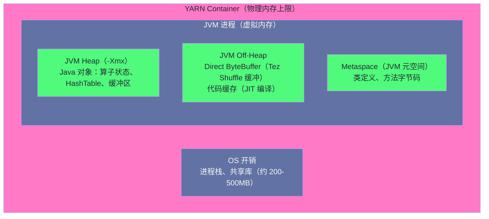

# 10 Tez 调优实战：DAG 诊断、内存配置与数据倾斜治理

## 摘要

第 04 篇讲清楚了 Tez 为什么比 MapReduce 快（DAG 模型 + Container 复用），但"理解原理"和"把 Tez 作业调到最优状态"之间还有很大的距离。在生产环境中，Hive-on-Tez 作业常见的性能问题有三类：内存配置不当（Container 内存不足频繁 GC，或 AM 内存不足导致调度延迟）、数据倾斜（少数 Vertex Task 的数据量是其他 Task 的数千倍，拖垮整个 DAG）、向量化执行未生效（SQL 写法触发了 Fallback，丧失向量化带来的 2-5 倍性能提升）。本文以"如何诊断 → 为什么出现 → 怎么修复"为主线，系统讲解 Tez UI 的关键诊断路径、Container/AM/JVM Heap 三层内存的关系与配置计算方法、数据倾斜的多种治理手段，以及向量化执行的启用条件与验证方法。

---

## 第 1 章 Tez 作业的诊断工具链

### 1.1 Tez UI：性能诊断的主战场

**Tez UI**（部署在 YARN Timeline Server 上）是 Tez 作业最重要的诊断工具。它以可视化的方式展示 DAG 的拓扑结构、每个 Vertex 的运行状态、Task 级别的时间分布。在 YARN 资源管理页面找到对应的 Application，点击 "Tez UI" 链接即可访问。

**Tez UI 的关键诊断路径**：

```
DAG 视图（首页）：
  → 查看 DAG 拓扑（各 Vertex 的依赖关系）
  → 查看 DAG 整体状态（SUCCEEDED/FAILED/KILLED）
  → 查看各 Vertex 的状态和完成时间

Vertex 视图（点击具体 Vertex）：
  → 查看该 Vertex 所有 Task 的执行时间分布
  → 如果某个 Task 时间远超其他 Task → 数据倾斜信号
  → 查看 Task 的 Input/Output 数据量（inputRecords, outputRecords）
  → 查看 Task 的内存使用（GC Time 占比）

Task 视图（点击具体 Task）：
  → 查看 Task Attempt 详情（是否有重试，重试原因）
  → 查看 Counter 信息（HDFS 读写字节数、Shuffle 字节数、GC 时间）
```

### 1.2 关键 Counter 指标解读

Tez 为每个 Task 维护一组 Counter（计数器），是定量分析性能瓶颈的数据来源：

**内存与 GC 相关**：

```
GC_TIME_MILLIS：Task 执行期间 JVM GC 消耗的时间（毫秒）
  健康值：GC 时间 < Task 总执行时间的 5%
  告警：GC 时间占比 > 20% → Container 内存不足，JVM 频繁 GC → 扩大 Container 内存

PHYSICAL_MEMORY_BYTES：Task 实际使用的物理内存（含 JVM 堆 + off-heap + 操作系统缓冲）
  如果接近 Container 内存上限 → 可能被 YARN OOM Kill
```

**I/O 相关**：

```
HDFS_BYTES_READ：从 HDFS 读取的字节数
  与"表统计信息"中的 rawDataSize 对比，差异过大说明分区裁剪未生效

SHUFFLE_BYTES：Shuffle 传输的字节数（SCATTER_GATHER Edge 的数据量）
  关注 Shuffle 数据量 vs 输入数据量的比值，高比值说明有大量数据参与 Shuffle

NUM_FAILED_TASKS：失败的 Task 数量（非 0 时需要查看具体 Task 的错误信息）
```

**数据量相关**：

```
INPUT_RECORDS_PROCESSED：该 Task 处理的输入记录数
  对同一 Vertex 的所有 Task，比较这个值的分布：
  如果最大值 / 中位数 > 5 → 数据倾斜，需要 Skew Join 或 Repartition

OUTPUT_RECORDS：该 Task 输出的记录数
  如果 OUTPUT_RECORDS >> INPUT_RECORDS（UDTF 除外）→ 可能有数据爆炸（笛卡尔积）
```

### 1.3 Hive 执行日志分析

除 Tez UI 外，HS2 的执行日志也提供了丰富的诊断信息。关键日志片段：

```
-- SQL 编译时间（在 HS2 日志中）
INFO  compile: [HQL] ... Duration: 2340ms   ← 编译耗时 2.3 秒（可能 HMS 查询慢）

-- Tez DAG 提交信息
INFO  Status: Running (Application id: application_1709000000_12345)
INFO  Map 1: 0(+200)/200  Reducer 2: 0(+50)/50   ← Map 阶段 200 Task 全部在运行
INFO  Map 1: 150/200  Reducer 2: 0(+50)/50        ← Map 完成 150/200
INFO  Map 1: 200/200  Reducer 2: 45/50            ← Map 全完成，Reducer 45/50
INFO  Map 1: 200/200  Reducer 2: 45/50  [长时间卡在这里] ← 数据倾斜：5 个 Reducer 未完成

-- Container 内存不足被 YARN Kill（需要在 YARN NodeManager 日志中查找）
INFO  Container killed by YARN for exceeding physical memory limits: 6.3 GB
      of 6 GB physical memory used.
```

---

## 第 2 章 内存配置：三层内存的精确计算

### 2.1 三层内存的关系

Tez 作业的内存配置涉及三个层次，理解它们的关系是正确配置的前提：



**层次一：YARN Container 内存上限**

由 `mapreduce.map.memory.mb` 和 `mapreduce.reduce.memory.mb`（MR 模式）或 `tez.task.resource.memory.mb` 控制。这是 YARN 给 Container 分配的物理内存硬上限——一旦 Container 的实际物理内存使用超过这个上限，YARN NodeManager 会直接 Kill 该 Container（不管 JVM GC 是否能回收内存）。

**层次二：JVM Heap（-Xmx）**

由 `mapreduce.map.java.opts`（包含 `-Xmx` 参数）或 `tez.task.launch.cmd-opts` 控制。JVM Heap 是 Java 对象（算子状态、HashTable、DataFrame 缓冲）的内存空间。

**黄金比例**：`-Xmx = Container 内存 × 0.8`，为 OS 开销和 Off-Heap 留出 20% 余量。

```
Container 内存 = 8192MB（8GB）
JVM Heap = 8192 × 0.8 = 6553MB ≈ 6GB（-Xmx6g）
OS + Off-Heap 余量 = 8192 - 6553 = 1639MB（约 1.6GB）
```

**层次三：JVM 内存结构**

在 `-Xmx`（JVM Heap 上限）内部，还需要考虑：
- **Young Generation（年轻代）**：新对象分配区域，Minor GC 频繁但代价低
- **Old Generation（老年代）**：长期存活对象，Full GC 代价高、暂停时间长
- **Metaspace**：类定义元数据（Hive UDF 类、SerDe 类等），不在 Heap 内，默认无限制

```xml
<!-- Tez Task Container 内存配置 -->
<property>
  <name>tez.task.resource.memory.mb</name>
  <value>8192</value>  <!-- 8GB Container -->
</property>
<!-- JVM 启动参数：-Xmx 设为 Container 的 80% -->
<property>
  <name>tez.task.launch.cmd-opts</name>
  <value>-Xmx6144m -Xms512m -XX:+UseG1GC -XX:MaxGCPauseMillis=200</value>
</property>
```

### 2.2 Tez AM 的内存配置

Tez ApplicationMaster（AM）是整个 DAG 的调度核心，其内存配置往往被忽视：

```xml
<!-- Tez AM Container 内存（调度大型 DAG 需要较多内存，维护所有 Task 状态）-->
<property>
  <name>tez.am.resource.memory.mb</name>
  <value>4096</value>  <!-- 4GB，复杂 SQL（数百 Vertex、数千 Task）建议 8GB -->
</property>
<!-- Tez AM JVM Heap -->
<property>
  <name>tez.am.launch.cmd-opts</name>
  <value>-Xmx3276m -XX:+UseG1GC</value>  <!-- AM 内存的 80% -->
</property>
```

**AM 内存不足的典型表现**：

AM 需要在内存中维护所有 Task 的状态（Task State Machine），以及处理来自所有 Task Container 的心跳。对于有 1000 个并发 Task 的大型 DAG，AM 内存压力较大。AM 内存不足会导致：
- AM 自身 Full GC 频繁，Task 状态更新延迟，表现为 Tez UI 中 Task 状态长时间不刷新
- 严重时 AM 进程 OOM，整个 DAG 被 Kill，作业失败（通过 YARN 日志可以看到 AM Container 的 OOM 错误）

### 2.3 Map Join HashTable 的内存计算

第 06 篇提到 Map Join 将小表加载为 HashTable，这里给出精确的内存计算方法：

```
场景：小表 ORC 文件大小 50MB，Join 用到 3 列（id BIGINT, name STRING 平均 10 字节, region STRING 平均 5 字节）

Step 1：估算 ORC 解压后的原始数据量
  50MB ORC × 10（ORC 压缩比） = 500MB 原始数据

Step 2：估算 Java HashMap 对象的内存开销
  HashMap Entry 对象开销：约 48 字节/Entry（包含 key、value 引用、hash code、next 指针）
  每条记录的列数据：id(8字节) + name(10+对象头24字节) + region(5+对象头24字节) ≈ 71 字节
  总内存 ≈ (48 + 71) × 记录数

Step 3：估算记录数
  原始数据 500MB，每行平均 (8+10+5) = 23 字节 → 约 2100 万行

Step 4：HashMap 总内存
  (48 + 71) × 2100万 ≈ 2.5GB

结论：50MB 的 ORC 小表，在内存中 HashMap 约占 2.5GB
      Task Container 内存至少需要 2.5GB（HashMap）+ 2GB（大表扫描 + 框架开销）= 4.5GB
      推荐 Container 内存：6-8GB
```

这个计算说明，**`hive.mapjoin.smalltable.filesize=50MB` 看起来很小，但实际需要的 Container 内存是几 GB**，必须配合足够大的 Container 才能安全运行。

---

## 第 3 章 数据倾斜的全面治理

### 3.1 数据倾斜的识别方法

**方法一：Tez UI Task 时间分布**

在 Tez UI 的 Vertex 视图中，查看所有 Task 的执行时间分布。典型的数据倾斜表现：99% 的 Task 在 2 分钟内完成，但 1-3 个 Task 运行了 60 分钟甚至更长，整个 Vertex 因等待这些慢 Task 而无法完成。

**方法二：INPUT_RECORDS_PROCESSED 分布**

在 Tez UI 中查看 Vertex 的 Task 列表，按 `inputRecords` 排序。如果 Top 3 Task 的 `inputRecords` 是中位数的 10 倍以上，基本可以确定数据倾斜。

**方法三：SQL 分析**

```sql
-- 提前分析 Join Key 的分布，发现热点 Key
SELECT cust_id, COUNT(*) as cnt
FROM orders
GROUP BY cust_id
ORDER BY cnt DESC
LIMIT 20;

-- 如果 Top 1 的 cust_id 的 cnt 是 Top 2 的 10 倍以上 → 存在热点，需要 Skew Join 处理
```

### 3.2 Reduce 阶段数据倾斜的治理

**策略一：启用 Tez 自动 Reduce 并行度调整**

```xml
<!-- Tez 的 Auto Reducer Parallelism：根据 Shuffle 数据量动态调整 Reducer 数量 -->
<property>
  <name>hive.tez.auto.reducer.parallelism</name>
  <value>true</value>
</property>
<!-- 每个 Reducer 期望处理的字节数（影响自动计算的 Reducer 数量）-->
<property>
  <name>hive.exec.reducers.bytes.per.reducer</name>
  <value>67108864</value>  <!-- 64MB（适当减小，使 Reducer 数量增加，分摊负载）-->
</property>
```

注意：Auto Reducer Parallelism 只能在 Tez 框架下生效（MR 模式不支持），且只调整 Reducer 数量，不解决单个热点 Key 的倾斜——热点 Key 的所有数据仍然落到同一个 Reducer。

**策略二：针对 Join 倾斜，启用 Skew Join 优化**

参见第 06 篇的 Skew Join 详细说明。核心配置：

```xml
<property>
  <name>hive.optimize.skewjoin</name>
  <value>true</value>
</property>
<property>
  <name>hive.skewjoin.key</name>
  <value>500000</value>  <!-- 单 Reducer 超过 50 万行认定为倾斜 Key -->
</property>
```

**策略三：针对 GROUP BY 倾斜，启用两阶段聚合**

```xml
<!-- 开启 Map 端随机 Reducer 分配（打散热点 Key 到不同 Reducer 做部分聚合）-->
<property>
  <name>hive.groupby.skewindata</name>
  <value>true</value>
</property>
```

开启 `hive.groupby.skewindata` 后，GROUP BY 操作分两个 MR/Tez Stage 执行：
- **Stage 1**：Map 端不按 GROUP BY Key 分发，而是随机分发到 Reducer，每个 Reducer 做**部分聚合**（不按 Key 聚合，而是随机聚合减少数据量）
- **Stage 2**：按 GROUP BY Key 分发到 Reducer，做最终聚合

这样热点 Key 的数据在 Stage 1 中被分散到多个 Reducer，Stage 2 中每个 Reducer 处理的是来自 Stage 1 的部分聚合结果（已经大幅减少），而不是原始热点数据。

### 3.3 Map 阶段数据倾斜：小文件与大文件并存

Map 阶段的"倾斜"不是 Key 分布问题，而是**输入文件大小不均匀**——某些 Map Task 分到一个 5GB 的大文件（长时间运行），其他 Task 分到若干个 1MB 的小文件（很快完成），导致 Map Vertex 的长尾效应。

**根因**：历史写入产生了大量小文件（如每小时动态分区各产生 100 个小文件），部分分区又有少量大文件（如全量重写产生的单一大文件），小文件和大文件并存导致 Map Task 负载不均。

**治理方案**：

```xml
<!-- 开启 CombineInputFormat：将多个小文件合并为一个 Map Task 输入 -->
<property>
  <name>hive.input.format</name>
  <value>org.apache.hadoop.hive.ql.io.CombineHiveInputFormat</value>
</property>
<!-- 每个 Map Task 处理的输入数据量（合并小文件的目标大小）-->
<property>
  <name>mapreduce.input.fileinputformat.split.maxsize</name>
  <value>268435456</value>  <!-- 256MB，小文件会被合并到接近这个大小的 Task -->
</property>
<!-- 允许跨不同 HDFS Block 合并的阈值 -->
<property>
  <name>mapreduce.input.fileinputformat.split.minsize.per.rack</name>
  <value>134217728</value>  <!-- 128MB -->
</property>
```

---

## 第 4 章 向量化执行：配置、验证与常见 Fallback

### 4.1 向量化执行的工作原理

**向量化执行（Vectorized Execution）** 改变了 Hive 算子的执行粒度：从"一次处理一行"变为"一次处理一批（Batch）"。

```
传统行式执行模型（非向量化）：
  for each row in input_stream:
    row = deserialize(bytes)          // 反序列化一行
    if filter_condition(row.dt):     // 函数调用（虚函数分发）
      accumulate(row.amount)          // 聚合计算
  
  问题：每行都有函数调用开销、类型判断开销，CPU 指令流中有大量分支判断

向量化执行模型：
  for each batch in input_stream:    // batch = 1024 行
    dt_col = deserialize_column(bytes, 'dt')    // 整列批量反序列化
    filter_mask = vectorized_filter(dt_col, '2026-01-15')  // SIMD 并行比较
    amount_col = deserialize_column(bytes, 'amount', filter_mask)  // 只解码满足条件的行
    sum_result = vectorized_sum(amount_col)     // SIMD 向量加法
  
  优势：
    - 减少函数调用次数（1024x）
    - SIMD 指令并行处理（如 AVX2 可以同时处理 4 个 double）
    - 更好的 CPU 缓存利用率（同类型数据连续存储）
```

在 TPC-DS 基准测试中，向量化执行使 ORC 格式的查询性能提升 **2-5 倍**。

### 4.2 向量化执行的启用配置

```xml
<!-- 启用向量化执行（Map 阶段）-->
<property>
  <name>hive.vectorized.execution.enabled</name>
  <value>true</value>
</property>
<!-- 启用向量化执行（Reduce 阶段）-->
<property>
  <name>hive.vectorized.execution.reduce.enabled</name>
  <value>true</value>
</property>
<!-- 向量化 GROUP BY（聚合函数向量化）-->
<property>
  <name>hive.vectorized.groupby.vector.aggregate.enabled</name>
  <value>true</value>
</property>
```

### 4.3 向量化 Fallback 的常见原因

向量化执行不是对所有 SQL 都生效——当某些条件不满足时，Hive 会自动降级（Fallback）到非向量化执行，但**不给出任何告警**（静默降级是向量化执行最常见的坑）。

**常见的 Fallback 触发条件**：

**Fallback 原因一：不支持的函数**

```sql
-- 向量化不支持自定义 UDF（所有 GenericUDF）！
-- 如果 SELECT 中包含自定义 UDF，整个 Task 的向量化被关闭
SELECT mask_phone(phone), SUM(amount) FROM orders GROUP BY mask_phone(phone);
-- ↑ mask_phone 是自定义 UDF → 向量化 Fallback → 性能比纯向量化差 2-5 倍
```

解决方案：将复杂逻辑移到预处理阶段（先创建中间表存储 UDF 计算结果，再对中间表做向量化聚合），减少向量化主查询中的 UDF 使用。

**Fallback 原因二：不支持的数据类型**

```
向量化支持的类型：
  ✅ TINYINT, SMALLINT, INT, BIGINT, FLOAT, DOUBLE
  ✅ BOOLEAN, DATE, TIMESTAMP（有条件支持）
  ✅ STRING, VARCHAR（部分操作支持）
  ✅ DECIMAL（有限支持，某些精度不支持）
  ❌ BINARY（不支持）
  ❌ ARRAY, MAP, STRUCT（复杂类型，不支持）
```

如果查询涉及 ARRAY/MAP/STRUCT 类型的列（如 EXPLODE、MAP 字段访问），向量化无法生效。

**Fallback 原因三：某些表达式**

```sql
-- 向量化不支持的表达式示例：
-- 子查询（某些形式）
WHERE cust_id IN (SELECT id FROM customers WHERE ...)  -- 可能 Fallback
-- 某些字符串操作（REGEXP）
WHERE REGEXP(phone, '^1[38]')  -- 正则匹配不支持向量化
```

### 4.4 验证向量化执行是否生效

```sql
-- 方法一：EXPLAIN VECTORIZATION 查看向量化计划
EXPLAIN VECTORIZATION SELECT SUM(amount) FROM orders WHERE dt = '2026-01-15';

-- 输出中关注：
-- "EXEC_MODE: VECTORIZED" → 该算子已向量化
-- "EXEC_MODE: ROW" → 该算子 Fallback 为行式执行（同时输出 Fallback 原因）

-- 方法二：查看 Tez Counter
-- 在 Tez UI 的 Task Counter 中找：
-- CREATED_ROW_BATCHES（>0 表示向量化已生效，每批 1024 行）
-- SELECTED_IN_ROW_BATCHES（过滤后保留的行批数量）
```

---

## 第 5 章 Tez 调优参数速查

### 5.1 核心调优参数汇总

**资源配置类**：

```xml
<!-- Task Container 内存 -->
<property><name>tez.task.resource.memory.mb</name><value>8192</value></property>
<!-- Task JVM 堆（Container 内存的 80%）-->
<property><name>tez.task.launch.cmd-opts</name>
  <value>-Xmx6144m -XX:+UseG1GC -XX:MaxGCPauseMillis=200</value></property>
<!-- Tez AM 内存 -->
<property><name>tez.am.resource.memory.mb</name><value>4096</value></property>
<!-- Tez AM JVM 堆 -->
<property><name>tez.am.launch.cmd-opts</name><value>-Xmx3276m -XX:+UseG1GC</value></property>
<!-- Task 虚拟 CPU 核数 -->
<property><name>tez.task.resource.cpu.vcores</name><value>1</value></property>
```

**并发与调度类**：

```xml
<!-- 每个 YARN 队列预分配的 Tez Session 数 -->
<property><name>hive.server2.tez.sessions.per.default.queue</name><value>1</value></property>
<!-- Container 复用：空闲 Container 保留时间 -->
<property><name>tez.am.container.idle.release-timeout-min.millis</name><value>5000</value></property>
<property><name>tez.am.container.idle.release-timeout-max.millis</name><value>60000</value></property>
<!-- Tez 最大 Task 并发数（超过 YARN 队列容量时排队）-->
<property><name>tez.am.task.max.failed.attempts</name><value>4</value></property>
```

**Shuffle 类**：

```xml
<!-- Shuffle 阶段 Task 的内存缓冲区（用于写出 Shuffle 数据）-->
<property><name>tez.runtime.io.sort.mb</name><value>512</value></property>
<!-- Shuffle 合并因子（一次合并多少个 Shuffle 文件）-->
<property><name>tez.runtime.shuffle.merge.percent</name><value>0.9</value></property>
<!-- Shuffle 阶段最大并发 Fetch 线程数（下载 Map 输出）-->
<property><name>tez.runtime.shuffle.parallel.copies</name><value>20</value></property>
```

**倾斜处理类**：

```xml
<property><name>hive.optimize.skewjoin</name><value>true</value></property>
<property><name>hive.skewjoin.key</name><value>500000</value></property>
<property><name>hive.groupby.skewindata</name><value>true</value></property>
<property><name>hive.tez.auto.reducer.parallelism</name><value>true</value></property>
```

### 5.2 典型问题与调优对照表

| 症状 | 诊断方法 | 根因 | 调优手段 |
|-----|--------|-----|---------|
| Task 频繁 GC（GC_TIME > 20%）| Tez UI Counter | Container 内存不足 | 增大 `tez.task.resource.memory.mb`；扩大 `-Xmx` |
| Task 被 YARN Kill（OOM）| NodeManager 日志 | Container 内存超限 | 增大 Container 内存；检查 Map Join 小表大小 |
| 少数 Task 运行时间 10x 其他 | Tez UI Task 时间分布 | 数据倾斜 | 启用 Skew Join / `skewindata` |
| 向量化未生效 | EXPLAIN VECTORIZATION | UDF/复杂类型/不支持函数 | 移除 UDF；检查列类型 |
| SQL 编译慢（>10s）| HS2 日志 | HMS 响应慢（分区多）| 开启 CachedStore；减少分区数 |
| Map Task 数量过多 | Tez UI | 大量小文件 | 开启 CombineInputFormat；合并小文件 |
| Reducer 数量不合理 | EXPLAIN 输出 | `bytes_per_reducer` 设置不当 | 调整 `hive.exec.reducers.bytes.per.reducer` |
| Container 申请等待超时 | YARN ResourceManager UI | YARN 队列资源不足 | 增加队列容量；减少并发 Session 数 |

---

## 小结

Tez 调优的本质是**消除执行链路中的短板**：

- **诊断工具**：Tez UI 是主战场，`INPUT_RECORDS_PROCESSED` 和 `GC_TIME_MILLIS` 是两个最关键的 Counter；HS2 日志用于诊断编译阶段问题
- **内存配置**：YARN Container（物理上限）→ JVM Heap（`-Xmx` = Container × 80%）→ Metaspace 三层关系；AM 内存对大型 DAG 的调度稳定性至关重要；Map Join HashTable 的内存消耗是 ORC 文件大小的 20-40 倍
- **数据倾斜**：GROUP BY 倾斜用 `hive.groupby.skewindata` 的两阶段聚合打散；Join 倾斜用 Skew Join 分流热点 Key；Map 阶段小文件不均用 CombineInputFormat 解决
- **向量化执行**：默认开启，但自定义 UDF 和复杂类型会导致静默 Fallback；`EXPLAIN VECTORIZATION` 是验证是否生效的唯一手段；向量化生效时，ORC 格式的查询性能提升 2-5 倍

第 11 篇深入生产运维：Kerberos 认证集成（Hive + Hadoop 安全机制，对接现有故障报告）、JDBC 连接池最佳实践（HikariCP 与 HS2 Session 的交互模型）、JVM 调优（G1GC 参数与 HS2 进程稳定性）、监控指标体系建设（核心 JMX 指标 + 告警规则）。

---

> [!note] 思考题
> 1. Tez 的 Vertex（顶点）对应 Hive 的一个处理阶段，每个 Vertex 有多个 Task 并发执行。Tez UI 中可以看到每个 Vertex 的 Task 执行时间分布。如果某个 Vertex 的 Task 执行时间呈现"长尾效应"（大多数 Task 快速完成，少数 Task 慢很多），通常是数据倾斜的表现。如何通过 Tez UI 和 Counter 指标（如 `RECORDS_IN_Map`、`RECORDS_OUT_Reduce`）量化倾斜的严重程度，并确定倾斜发生在哪个 Key 上？
> 2. Tez 的内存配置涉及三层：Container 内存（`hive.tez.container.size`）、JVM 堆内存（`hive.tez.java.opts` 中的 `-Xmx`）、以及 Tez Task 内部的操作内存（如 Hash Join 的 Hash Table 大小）。这三层内存有严格的包含关系：堆内存必须小于 Container 内存，操作内存必须小于堆内存。如果配置不当（如 `-Xmx` 超过 Container 内存），会在 Container 启动时报错还是运行时 OOM？合理的三层内存比例应该如何设置？
> 3. Hive 的"自动倾斜 Join 优化"（`hive.optimize.skewjoin`）在 MapReduce 模式下有效，但在 Tez 模式下，数据倾斜的处理方式有所不同——Tez 可以在运行时动态调整 Reducer 数量（通过 `hive.tez.dynamic.partition.pruning`）。但动态分区裁剪是针对分区裁剪优化的，不是针对倾斜处理的。在 Tez 模式下，处理倾斜数据的主要手段是什么？在 SQL 层面（如加盐、两阶段聚合）和配置层面（如增大倾斜 Key 的 Reducer 数）各有什么工程实践？

## 参考资料

- [Tez 性能调优指南](https://tez.apache.org/install.html)
- [Hive 向量化执行文档](https://cwiki.apache.org/confluence/display/Hive/Vectorized+Query+Execution)
- [Hive 数据倾斜处理](https://cwiki.apache.org/confluence/display/Hive/Skewed+Join+Optimization)
