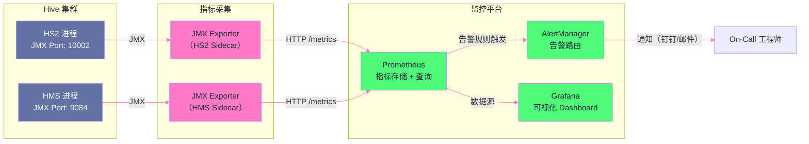

# 11 生产运维：Kerberos 认证、连接池与监控体系

## 摘要

前面十篇文章构建了对 Hive 内部机制的完整认知，本篇和下篇转向"如何稳定地运营一个生产 Hive 集群"。生产运维的核心挑战有三个维度：**安全**（Kerberos 认证在分布式系统中的正确配置，Token 刷新机制的边界条件）、**连接管理**（JDBC 连接池与 HS2 Session 生命周期的交互，连接泄漏的根因与防范）、**可观测性**（HS2 和 HMS 的关键 JMX 指标，从原始指标到有效告警规则的完整链路）。知识库中已有一份 [[HiveServer2 Kerberos 认证故障深度分析报告]]，本文将从系统视角补充其背后的原理，帮助理解该故障的不可避免性以及根本性的防范措施。同时，本文还覆盖了生产中 HS2 进程 JVM 调优（G1GC 参数选择）和 HMS 高负载时的容量规划方法。

---

## 第 1 章 Kerberos 在 Hive 中的完整认证链路

### 1.1 为什么 Hive 生产环境必须有 Kerberos

没有 Kerberos 的 Hadoop 集群是完全不设防的：任何能接触到 HS2 端口（10000）的客户端，可以声称自己是任意用户（只需在 JDBC URL 中设置 `user=hdfs`）并以该用户权限执行任意 SQL，包括读取所有表、删除数据、甚至修改 HDFS 权限。

Kerberos 提供的是**强身份认证**——客户端必须持有 KDC（Key Distribution Center）颁发的、以客户端真实身份加密的凭证（Ticket），HS2 通过验证这个凭证确认客户端身份，而不是相信客户端的自我声明。

> [!info] 核心概念：Kerberos 三方认证模型
> Kerberos 的认证涉及三个角色：
> - **KDC（密钥分发中心）**：认证权威，包含 AS（Authentication Service，颁发初始 TGT）和 TGS（Ticket Granting Service，颁发服务票据）
> - **Client（客户端）**：需要访问 Hive 的用户进程或服务进程
> - **Service（服务端）**：HS2 进程
> 
> 认证流程（简化）：
> 1. Client 向 AS 认证，获得 TGT（Ticket Granting Ticket）——证明"我是谁"的凭证
> 2. Client 持 TGT 向 TGS 申请 HS2 的服务票据（Service Ticket）
> 3. Client 持 Service Ticket 连接 HS2，HS2 验证票据有效性
> 4. 双向认证完成，建立加密通信通道（Mutual Authentication）

### 1.2 Hive 的 Kerberos 配置体系

**HS2 的 Principal 和 Keytab**：

HS2 需要一个服务 Principal（如 `hive/hs2-host1.example.com@EXAMPLE.COM`）和对应的 Keytab 文件（包含该 Principal 的长效密钥，服务进程用它自动获取 TGT，无需人工干预）。

```xml
<!-- hive-site.xml：HS2 Kerberos 配置 -->
<property>
  <name>hive.server2.authentication</name>
  <value>KERBEROS</value>  <!-- 启用 Kerberos 认证 -->
</property>
<property>
  <name>hive.server2.authentication.kerberos.principal</name>
  <value>hive/_HOST@EXAMPLE.COM</value>  <!-- _HOST 会被自动替换为当前主机名 -->
</property>
<property>
  <name>hive.server2.authentication.kerberos.keytab</name>
  <value>/etc/security/keytabs/hive.service.keytab</value>
</property>
```

**HMS 的 Principal 和 Keytab**：

HMS 也需要自己的 Kerberos Principal（如 `hive/hms-host1.example.com@EXAMPLE.COM`），HS2 连接 HMS 时需要以服务身份认证：

```xml
<!-- HMS 自身的 Principal/Keytab -->
<property>
  <name>hive.metastore.kerberos.principal</name>
  <value>hive/_HOST@EXAMPLE.COM</value>
</property>
<property>
  <name>hive.metastore.kerberos.keytab.file</name>
  <value>/etc/security/keytabs/hive.service.keytab</value>
</property>
<!-- HS2 连接 HMS 时使用的认证方式 -->
<property>
  <name>hive.metastore.sasl.enabled</name>
  <value>true</value>
</property>
```

### 1.3 Delegation Token：跨服务认证的关键机制

在 Hive 的执行过程中，存在一个容易被忽视的认证链路问题：

```
HS2（以 hive principal 运行）
  → 向 HDFS 读写数据
  → 向 YARN 提交 MR/Tez 任务
  → 向 HMS 查询元数据

MR/Tez Task（运行在 NodeManager 的 Container 中）
  → 也需要访问 HDFS（读取输入文件）
  → 也需要访问 HMS（动态分区写入时注册新分区）
```

MR/Tez Task 运行在 YARN Container 中，它的身份是"提交作业的用户"（Hive 中是执行 SQL 的用户），而不是 HS2 的服务 Principal。Container 需要能够访问 HDFS——但它没有 Keytab（不能持久保存用户密码），也无法在 Container 内部做完整的 Kerberos 认证（TGT 获取过程需要与 KDC 通信，但 Container 可能无法直接访问 KDC，或 KDC 负载原因导致延迟）。

**Delegation Token（委托令牌）** 解决这个问题：

1. HS2 在提交作业前，以自己的 Kerberos 身份向 HDFS NameNode 申请一个 Delegation Token（有时效的、可传递的访问凭证，不需要 Kerberos TGT 就能访问 HDFS）
2. HS2 将 Delegation Token 附加到作业的配置中（存放在 HDFS 上的 job.xml 或直接通过 YARN API 传递）
3. MR/Tez Task 启动时，从作业配置中读取 Delegation Token，用它直接访问 HDFS（不需要完整 Kerberos 认证）
4. Delegation Token 有过期时间（通常 7 天），可以续期（Renew）

### 1.4 Kerberos TGT 过期：故障的根源

[[HiveServer2 Kerberos 认证故障深度分析报告]] 中的核心故障根因是 **TGT（Ticket Granting Ticket）过期**。

**TGT 的生命周期**：

```
KDC 配置参数（/etc/krb5.conf 或 KDC krb5.conf）：
  max_life = 24h          ← TGT 最长有效时间（从颁发时刻起）
  max_renewable_life = 7d ← TGT 最长可续期时间（续期后的绝对过期时间）
  renew_lifetime = 7d

HS2 的 TGT 自动续期机制（Hadoop UGI 框架）：
  UGI.loginUserFromKeytab(principal, keytab)
  → 获取初始 TGT（有效期 24h）
  → 启动后台线程，每隔 (TGT有效期 × 0.8) 自动 renew TGT
  → 即：每隔约 19.2 小时 renew 一次，确保 TGT 不过期
```

**故障场景**：

```
正常情况：HS2 后台线程每 19.2h 调用 kinit 续期 TGT，一直保持有效
故障触发：

  场景一：KDC 暂时不可用（网络故障、KDC 维护）
    → UGI 续期失败（连接 KDC 超时）
    → 重试若干次后仍失败
    → TGT 继续使用，但距过期还有几小时
    → KDC 恢复时，如果 TGT 已在 renew 失败期间过期（max_life 到了）
    → 续期失败（expired TGT 不能续期，只能重新 kinit）
    → 后续所有需要 Kerberos 认证的操作全部失败
    → HS2 无法连接 HMS（SASL 认证失败）
    → HS2 无法向 HDFS 写入结果
    → 客户端收到 "GSSException: No valid credentials provided"

  场景二：HS2 进程长时间运行，UGI 内部状态异常
    → 这是故障报告中描述的具体场景
```

**防范措施**：

```xml
<!-- hadoop.security.auth_to_local 规则正确配置（防止 Principal 到用户名映射错误）-->
<!-- core-site.xml -->
<property>
  <name>hadoop.security.auth_to_local</name>
  <value>
    RULE:[2:$1@$0](hive@EXAMPLE.COM)s/.*/hive/
    RULE:[2:$1@$0](hdfs@EXAMPLE.COM)s/.*/hdfs/
    DEFAULT
  </value>
</property>

<!-- UGI 续期检查间隔（建议缩短，及早发现续期失败）-->
<!-- 在 hadoop-env.sh 或 hive-env.sh 中设置 -->
<!-- HADOOP_OPTS="-Dhadoop.kerberos.ticket.cache.path=/tmp/krb5cc_hive" -->
```

**生产最佳实践**：
1. 监控 HS2 进程的 TGT 有效期（通过 `klist -e` 脚本定期检查，距过期 < 2h 时告警）
2. KDC 和 HS2 之间的网络稳定性监控（KDC 端口 88 的可达性探测）
3. 为 HS2 服务 Principal 配置较长的 `renew_lifetime`（如 14d），给续期失败留出更长的容错窗口

---

## 第 2 章 JDBC 连接池与 HS2 Session 管理

### 2.1 JDBC 连接池的必要性

直接在应用代码中为每次查询创建 JDBC 连接是不可行的：建立一个 Hive JDBC 连接的代价包括：
- TCP 三次握手：< 1ms
- Thrift 握手（TTransport）：1-5ms
- HS2 OpenSession（创建 Session、初始化 Driver）：**50-500ms**
- Kerberos 认证（如果启用）：**100-1000ms**

对于每秒执行数十个查询的 BI 工具或数据平台，每次创建连接的 1-2 秒开销是不可接受的。**JDBC 连接池**预先创建并复用连接，使查询的建立时间降到毫秒级。

### 2.2 连接池与 HS2 Session 的交互模型

理解连接池与 HS2 Session 的交互是避免连接泄漏和性能问题的关键：

```
连接池（应用端）                    HS2（服务端）

  Connection 对象 ←──TCP+Thrift──→  HiveSession 对象
  （池中预分配，应用借用后归还）     （在 HS2 JVM 内存中常驻）

  Pool 配置：
    minimumIdle = 5   ← 池中最少保持 5 个空闲连接
    maximumPoolSize = 20 ← 最多 20 个连接
    idleTimeout = 600000ms（10分钟）← 空闲连接超过 10 分钟后关闭

  HS2 Session 配置：
    hive.server2.idle.session.timeout = 7200000ms（2小时）
    hive.server2.session.check.interval = 3600000ms（1小时检查周期）
```

**关键冲突点**：连接池的 `idleTimeout`（10 分钟）远小于 HS2 的 `idle.session.timeout`（2 小时）——连接池认为连接"超时"关闭时，HS2 的对应 Session 仍然存活；HS2 Session 超时关闭时，连接池中对应的连接变为"死连接"（TCP 连接已断开，但连接池不知道）。

**死连接问题**：连接池的连接被 HS2 服务端超时关闭后，连接池仍认为该连接可用，将其分配给应用——应用尝试执行 SQL 时，TCP 连接已断开，抛出 `CommunicationsException: Communications link failure`。

**解决方案**：在连接池中配置**连接验证（Connection Validation）**：

```java
// HikariCP 配置示例（Java 应用中最常用的 JDBC 连接池）
HikariConfig config = new HikariConfig();
config.setJdbcUrl("jdbc:hive2://hs2-host:10000/default;principal=hive/_HOST@EXAMPLE.COM");
config.setUsername("app_user");
config.setPassword("");  // Kerberos 认证时密码为空

config.setMaximumPoolSize(20);          // 最大连接数
config.setMinimumIdle(5);              // 最小空闲连接数
config.setIdleTimeout(600000);         // 空闲连接生存时间（10分钟）
config.setConnectionTimeout(30000);    // 等待连接的超时时间（30秒）
config.setMaxLifetime(1800000);        // 连接最大生命周期（30分钟，防止长期连接 TGT 过期）

// 关键配置：借出连接时验证其有效性
config.setConnectionTestQuery("SELECT 1");   // 借出时执行简单查询验证连接有效性
// 注：Hive JDBC 4.0+ 支持 isValid() 方法，不需要 testQuery
config.setKeepaliveTime(300000);       // 每 5 分钟对空闲连接发送 keepalive（防止被服务端超时关闭）
```

> [!warning] 生产避坑
> **连接池的 `maxLifetime` 必须小于 HS2 的 Kerberos TGT 有效期**。如果 TGT 有效期是 24 小时，而连接池中某个连接存活了 25 小时（`maxLifetime` 设得太大），该连接的 Kerberos 上下文已过期，执行 SQL 时会报 `GSS initiate failed` 错误。将 `maxLifetime` 设为 `TGT有效期 × 0.5`（如 12 小时）可以确保所有池中连接都在 TGT 过期前被重建。

### 2.3 连接泄漏的检测

连接泄漏（Connection Leak）是指应用借用连接后由于代码 BUG（未在 finally 块中关闭 Statement 和 Connection）导致连接未归还连接池，最终耗尽所有连接使应用无法获取新连接。

HikariCP 提供了内置的泄漏检测：

```java
// 开启连接泄漏检测：借出连接超过 leakDetectionThreshold 未归还时，打印警告日志
config.setLeakDetectionThreshold(60000);  // 60 秒未归还则报警
// 日志示例：
// WARN  HikariPool - Connection leak detection triggered for <connection>, stack trace follows
//   at com.example.dao.OrderDao.queryOrders(OrderDao.java:45) ← 泄漏代码位置
```

---

## 第 3 章 HS2 进程 JVM 调优

### 3.1 HS2 的 JVM 内存负载特征

HS2 是一个典型的**中等堆内存、长期运行**的服务进程，JVM 调优目标是：**低 GC 停顿时间**（HS2 的 Full GC 会导致所有 Session 的 SQL 编译和执行被暂停，直接影响 QPS）+ **合理的内存使用**（避免因内存不足触发频繁 GC）。

HS2 的对象分配特征：
- **短生命周期对象**（年轻代）：SQL 编译过程中创建的 AST 节点、Operator 对象、临时字符串；每条 SQL 完成后即可 GC
- **中等生命周期对象**（年轻代晋升到老年代）：Session 对象（存活数小时）、连接中的 HMS 缓存数据
- **长期对象**（老年代常驻）：Hive 框架类的静态对象、全局配置、函数注册表

这种分布非常适合 **G1GC（Garbage First GC）**：G1 能够独立地对年轻代（短命对象密集区）做高频 Minor GC（停顿 < 200ms），对老年代做低频 Mixed GC，比 CMS GC 的并发模式失败风险更低。

### 3.2 G1GC 参数配置

```
HS2 进程推荐 JVM 配置（hive-env.sh 或 HS2 启动脚本）：

# 堆内存：总物理内存 × 30%（HS2 不需要太大堆，避免 Full GC 停顿过长）
# 示例：16GB 物理内存的节点，HS2 分配 4-6GB 堆
export HADOOP_HEAPSIZE=6144  # 6GB，最终 -Xmx6g -Xms6g

# JVM 参数
export HADOOP_OPTS="$HADOOP_OPTS \
  -XX:+UseG1GC \
  -XX:MaxGCPauseMillis=200 \        # G1 的目标最大 GC 停顿时间（毫秒）
  -XX:G1HeapRegionSize=16m \        # G1 Region 大小（对于 6GB 堆，16MB Region 合适）
  -XX:InitiatingHeapOccupancyPercent=45 \  # 老年代占用超过 45% 时触发并发标记
  -XX:G1ReservePercent=15 \         # 预留 15% 堆空间防止晋升失败（Evacuation Failure）
  -XX:MaxMetaspaceSize=512m \       # 限制 Metaspace 最大大小（UDF JAR 类较多时可适当增加）
  -XX:+ParallelRefProcEnabled \     # 并行处理引用对象（减少引用处理阶段的停顿）
  -Xloggc:/var/log/hive/hs2-gc.log \  # GC 日志路径
  -XX:+PrintGCDetails \
  -XX:+PrintGCDateStamps \
  -XX:+UseGCLogFileRotation \
  -XX:NumberOfGCLogFiles=5 \        # GC 日志文件轮转
  -XX:GCLogFileSize=64m"
```

**关键参数解读**：

- **`-XX:MaxGCPauseMillis=200`**：这是 G1 的**目标**（不是硬性保证），G1 会尽量将 GC 停顿控制在 200ms 以内。对于 HS2，200ms 的 GC 停顿是可以接受的（客户端 JDBC 超时通常是秒级）。如果要求更低停顿，可以调整为 100ms，但代价是 GC 频率增加、吞吐量降低。

- **`-XX:InitiatingHeapOccupancyPercent=45`**（IHOP）：G1 在老年代占用超过 45% 时开始并发标记（Concurrent Marking）。如果 HS2 长期运行后老年代增长较快（大量 Session 对象积累），需要降低 IHOP（如 35%）让 G1 更早开始标记，避免来不及回收就发生堆满。

### 3.3 GC 监控：识别 JVM 健康状态

```bash
# 在线查看 HS2 JVM 内存使用（使用 jstat）
# PID 是 HS2 进程 ID
jstat -gcutil <HS2_PID> 5s

# 输出示例：
#  S0     S1     E      O      M     CCS    YGC     YGCT    FGC    FGCT     GCT
#  50.0    0.0   70.2   45.3  96.2  93.1    1234    45.2     2     3.5    48.7

# S0/S1：Survivor Space 使用率（应 < 80%）
# E：Eden Space 使用率（变化正常，快速填充后 Minor GC 清空）
# O：Old Generation 使用率（警戒：> 75% 时需关注；> 85% 时立即告警）
# FGC：Full GC 次数（正常运行中应为 0 或极少；非零时查看 GC 日志分析原因）
# FGCT：Full GC 总时间（应远小于进程运行时间）
```

---

## 第 4 章 HMS 容量规划与性能监控

### 4.1 HMS 的容量规划方法

HMS 是整个平台的元数据入口，在大型集群中（数百个 Hive 表、数千万个分区、数十个 HS2 Session 和 Spark Driver 并发访问）需要提前进行容量规划：

**RPC 并发估算**：

```
并发 HMS 调用数 =
  HS2 实例数 × 并发 Session 数/HS2 × 每 Session 的 HMS 调用频率
  + Spark Job 数 × 每 Job 的 HMS 调用频率
  + 其他引擎（Presto/Flink）的调用

示例（中型集群）：
  2 个 HS2 实例 × 50 并发 Session/HS2 × 2 次/秒 = 200 次/秒
  10 个并发 Spark Job × 5 次/秒 = 50 次/秒
  总计：约 250 次/秒 HMS RPC 调用
```

**MySQL 容量**：

```
QPS 估算：
  单次 getTable() → 2-3 个 MySQL SELECT
  单次 getPartitions() → 1-3 个 MySQL SELECT（取决于分区数）
  250 次/秒 HMS RPC × 2.5 MySQL 查询/HMS RPC = 约 625 QPS MySQL

MySQL 推荐规格（中型集群）：
  CPU：8 核
  内存：32GB（足够缓存 HMS 的热点元数据表）
  磁盘：SSD（HMS 元数据表的索引访问 I/O 密集）
  max_connections：500（HMS 实例数 × DataNucleus 连接池大小 + 30% 余量）
```

### 4.2 HMS 的关键监控指标

HMS 通过 JMX 暴露内部指标，可以通过 Prometheus JMX Exporter 采集：

```yaml
# Prometheus JMX Exporter 配置（jmx_exporter_config.yaml）
---
rules:
  # HMS RPC 延迟（最关键的 HMS 性能指标）
  - pattern: 'HiveMetastore<name=api>:(.+)'
    name: hms_api_$1
    
  # HMS 的 Thrift Server 连接数
  - pattern: 'hive.metastore:type=MetaStoreDirectSqlConnections'
    name: hms_mysql_connections_active
```

**HMS 核心监控指标**：

| 指标名 | 含义 | 正常范围 | 告警阈值 |
|-------|-----|--------|---------|
| `hms_api_getTable_99thPercentile` | getTable() 的 P99 延迟 | < 50ms | > 200ms |
| `hms_api_getPartitions_99thPercentile` | getPartitions() P99 延迟 | < 500ms | > 2000ms |
| `hms_api_addPartitions_99thPercentile` | addPartitions() P99 延迟 | < 1000ms | > 5000ms |
| `hms_jvm_heap_used` | HMS JVM 堆使用量 | < 70% | > 85% |
| `mysql_connections_active` | MySQL 活跃连接数 | < `maxPoolSize × 0.8` | > `maxPoolSize × 0.9` |

---

## 第 5 章 HS2 的全面监控体系

### 5.1 HS2 的 JMX 核心指标

HS2 通过 JMX（Java Management Extensions）暴露内部状态，是监控的主要数据来源：

**连接与 Session 类**：

```
# 当前活跃 Session 数
hive.hs2.active.sessions

# 当前排队等待执行的 Operation 数（队列积压的信号）
hive.hs2.active.operations

# 已完成的 Operation 总数（用于计算 QPS）
hive.hs2.completed.operations

# Session 打开总时间（秒），与 active.sessions 可以计算平均 Session 年龄
hive.hs2.open.sessions
```

**SQL 执行类**：

```
# SQL 编译时间（P99），持续 > 10s 说明 HMS 响应慢或 CBO 计算耗时
hive.hs2.sql.compile.time.p99

# SQL 执行时间（P99）
hive.hs2.sql.execution.time.p99

# 失败的 Operation 数（非 0 时需要查看具体错误）
hive.hs2.failed.operations.count
```

**JVM 类（通用 JMX 指标）**：

```
# 老年代使用率（G1 Old Region）
java.lang:type=MemoryPool,name=G1 Old Gen:Usage.used / Usage.max

# GC 次数和时间（Full GC 频率）
java.lang:type=GarbageCollector,name=G1 Old Generation:CollectionCount

# 线程数（Worker 线程池使用情况）
java.lang:type=Threading:ThreadCount
```

### 5.2 Prometheus + Grafana 监控架构



### 5.3 告警规则设计

生产中有效的告警规则，要区分"应立即介入的严重问题"和"需要关注的趋势性问题"：

```yaml
# Prometheus 告警规则（prometheus-rules.yaml）
groups:
  - name: hive_hs2_alerts
    rules:
      # P1：HS2 进程宕机（最高优先级，立即告警）
      - alert: HS2Down
        expr: up{job="hive-hs2"} == 0
        for: 1m
        labels:
          severity: critical
        annotations:
          summary: "HS2 实例 {{ $labels.instance }} 不可达，持续 1 分钟"
          description: "检查 HS2 进程是否存活；检查网络连通性；查看 HS2 日志"

      # P2：Session 积压（可能是并发瓶颈或 Worker 线程耗尽）
      - alert: HS2HighSessionCount
        expr: hive_hs2_active_sessions > 150
        for: 5m
        labels:
          severity: warning
        annotations:
          summary: "HS2 活跃 Session 数超过 150，当前 {{ $value }}"

      # P2：SQL 编译时间过长（HMS 可能变慢）
      - alert: HS2SlowSQLCompile
        expr: hive_hs2_sql_compile_time_p99_ms > 10000
        for: 10m
        labels:
          severity: warning
        annotations:
          summary: "SQL 编译 P99 延迟超过 10 秒，当前 {{ $value }}ms"
          description: "可能原因：HMS 响应慢（分区数过多）；HMS 与 MySQL 连接耗尽；CBO 计算复杂 SQL"

      # P1：JVM 老年代使用率过高（即将 Full GC）
      - alert: HS2OldGenHighUsage
        expr: (jvm_memory_pool_bytes_used{pool="G1 Old Gen", job="hive-hs2"}
               / jvm_memory_pool_bytes_max{pool="G1 Old Gen", job="hive-hs2"}) > 0.85
        for: 5m
        labels:
          severity: critical
        annotations:
          summary: "HS2 JVM 老年代使用率超过 85%，当前 {{ $value | humanizePercentage }}"
          description: "即将触发 Full GC，可能导致长时间 STW 停顿；检查是否有大量 Session 未关闭；考虑重启 HS2"

  - name: hive_hms_alerts
    rules:
      # HMS 慢查询（getPartitions 是最常见的慢 RPC）
      - alert: HMSSlowGetPartitions
        expr: hms_api_getPartitions_p99_ms > 2000
        for: 5m
        labels:
          severity: warning
        annotations:
          summary: "HMS getPartitions() P99 延迟超过 2 秒"
          description: "可能原因：某张表分区数过多；MySQL 慢查询；HMS 连接池耗尽"
```

---

## 小结

生产 Hive 集群的稳定运营需要在安全、连接管理、可观测性三个维度同时做好：

- **Kerberos 认证**：HS2 和 HMS 分别持有 Keytab，通过 UGI 框架自动续期 TGT；Delegation Token 解决 MR/Tez Task 对 HDFS 的认证问题；TGT 过期是生产中最常见的 Kerberos 故障根因，监控 TGT 有效期并在 KDC 不可达时及时告警
- **JDBC 连接池**：`maxLifetime` 必须小于 Kerberos TGT 有效期；`keepaliveTime` 防止连接被 HS2 端 idle timeout 关闭；`leakDetectionThreshold` 检测连接泄漏；连接池的 `maximumPoolSize` 受 HS2 Worker 线程数和 YARN 资源约束
- **JVM 调优**：G1GC 是 HS2 的推荐 GC 算法；`MaxGCPauseMillis=200` + `IHOP=45%` 是合理的基础配置；老年代使用率 > 85% 是 Full GC 的预警信号，应配置告警并提前扩容
- **监控体系**：HS2 Session 数、SQL 编译 P99 延迟、JVM 老年代使用率是三个最核心的告警维度；HMS getPartitions() 延迟是元数据层的核心 SLI；JMX Exporter + Prometheus + Grafana 是现代化的监控架构

第 12 篇深入故障排查手册：从 HS2 无响应（Kerberos、线程耗尽、Full GC 三类根因诊断）到 Tez 作业失败（Container OOM、数据倾斜、HDFS 权限），以及结合知识库中的三份故障分析报告，构建一套系统化的 Hive 集群故障诊断方法论。

---

> [!note] 思考题
> 1. Hive 的 Kerberos 认证依赖 Delegation Token——用户首先通过 Kerberos TGT 认证，获取 Delegation Token，后续操作使用 Delegation Token 而不需要再次访问 KDC。Delegation Token 有过期时间（通常 7 天），可以通过 `renew` 操作延期。在长时间运行的 ETL 作业（如运行 10 天的历史回溯作业）中，如果忘记 renew Token，会在哪个时间点出现认证失败？如何设计自动化的 Token 续期机制？
> 2. HiveServer2 的连接池（如 Druid、HikariCP）通常维护一定数量的常驻 JDBC 连接。这些连接在 HS2 侧对应着 Session 资源消耗（内存、线程）。如果连接池配置的最大连接数超过了 HS2 的服务能力（线程数），会导致 HS2 资源耗尽。如何通过 HS2 的 `maxconnections` 配置和连接池的超时机制，在客户端和服务端两侧协调建立"流量控制"，防止 HS2 被连接风暴压垮？
> 3. Hive 的监控体系通常依赖 JMX 指标（通过 Prometheus JMX Exporter 采集）和 Tez UI（作业级别的 DAG 诊断）。但对于生产环境的 SLA 监控，我们更关心"慢查询"——如何系统性地识别和处理执行时间超过预期的 Hive 查询？HMS 的审计日志（`hive.metastore.event.listeners`）和 HS2 的查询历史（HiveServer2 WebUI 的 Query History）在慢查询诊断中各提供了什么信息？

## 参考资料

- [[HiveServer2 Kerberos 认证故障深度分析报告]]（本知识库）
- [[HiveServer2 Redis UDF 文件描述符泄漏故障报告]]（本知识库）
- [Hadoop Security Guide: Kerberos](https://hadoop.apache.org/docs/stable/hadoop-project-dist/hadoop-common/SecureMode.html)
- [HikariCP 文档](https://github.com/brettwooldridge/HikariCP)
- [G1GC 调优指南（Oracle）](https://docs.oracle.com/en/java/javase/11/gctuning/garbage-first-g1-garbage-collector1.html)
