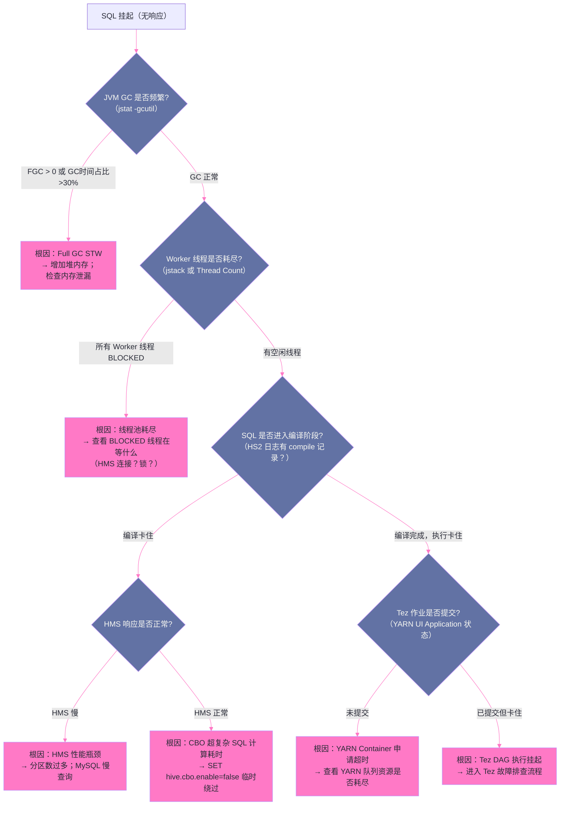

# 12 故障排查手册：从 HS2 无响应到 Tez 作业失败的系统诊断

## 摘要

Hive 集群的故障往往不是单点的，而是多个组件的联动问题——HS2 无响应可能是 Kerberos TGT 过期导致的，也可能是线程池耗尽，还可能是 JVM Full GC 引发的长时间 STW；Tez 作业挂起可能是数据倾斜，也可能是 Container 申请超时，还可能是 Shuffle 阶段的磁盘 I/O 瓶颈。没有系统性的诊断方法论，排查这类问题就是"猜谜"——经验丰富的工程师"碰巧"猜对，经验不足的工程师可能花费数小时还没有方向。本文构建一套**故障诊断决策树**，以"症状 → 缩小范围的问题 → 验证假设的命令/工具 → 根因 → 修复方案"为主线，覆盖生产中最高频的 HS2 故障、HMS 故障和 Tez 作业故障。本知识库中已有三份真实故障分析报告（[[HiveServer2 Kerberos 认证故障深度分析报告]]、[[HiveServer2 Redis UDF 文件描述符泄漏故障报告]]、[[NameNode长GC事故深度分析]]），本文在这些报告的基础上进行系统性的方法论总结，帮助工程师建立可复用的排查框架。

---

## 第 1 章 故障诊断的第一性原理

### 1.1 信息收集先于假设

生产事故现场，工程师最常犯的错误是：**在信息不充分的情况下急于假设根因并执行操作**。这不仅浪费时间（操作无效后还要撤销），更可能加重故障（如在 HS2 高负载时重启进程，导致大批作业失败）。

正确的顺序是：

```
第一步：确认故障边界
  - 所有 HS2 实例都受影响，还是只有某一台？
  - 所有 SQL 都失败，还是只有特定类型的 SQL？
  - 故障是突发的（某一时刻开始），还是渐进恶化的？
  - 大约从什么时间点开始？（确定时间范围，缩小日志搜索范围）

第二步：收集原始信息
  - HS2 进程是否存活？（端口探测 / YARN UI Application 状态）
  - HS2 日志中最近的 ERROR/WARN 是什么？
  - JVM 状态：GC 是否正常？堆使用率？线程数？

第三步：形成假设并验证
  - 根据第二步收集的信息，形成 1-3 个假设（按可能性排序）
  - 针对每个假设，执行最小代价的验证命令（不改变系统状态的只读操作）
  - 找到与所有症状吻合的单一根因

第四步：修复 + 预防
  - 执行修复操作（先确认影响范围，再执行）
  - 复盘：为什么这个故障没有被监控提前发现？如何补充告警规则？
```

### 1.2 分层诊断模型

Hive 的技术栈分为多个层次，故障总是从某一层开始，可能向上向下传播。分层诊断的思路是**从上到下定位到哪一层出了问题，再在该层内精确定位根因**：

```
第 7 层（应用层）：JDBC 客户端报错 → 从客户端错误信息判断是连接问题还是 SQL 执行问题
第 6 层（HS2 层）：HS2 进程状态 → JVM 状态、线程状态、Session/Operation 状态
第 5 层（HMS 层）：元数据操作延迟 → HMS 日志、MySQL 响应时间
第 4 层（YARN/Tez 层）：作业调度与执行 → YARN RM UI、Tez UI、Container 日志
第 3 层（HDFS 层）：数据读写 → NameNode 日志、DataNode 状态
第 2 层（操作系统层）：机器资源（CPU/内存/磁盘 I/O/网络）→ top/sar/iostat
第 1 层（基础设施层）：网络、Kerberos KDC、ZooKeeper → 连通性探测
```

---

## 第 2 章 HS2 故障排查手册

### 2.1 故障类型一：HS2 连接被拒绝

**症状**：客户端 JDBC 连接时抛出 `Connection refused` 或 `Cannot open new connection`。

**诊断流程**：

```bash
# Step 1：确认 HS2 进程是否存活
ps aux | grep HiveServer2    # 检查进程是否存在
# 或
systemctl status hive-server2  # 如果使用 systemd 管理

# Step 2：确认 HS2 端口是否监听
netstat -tlnp | grep 10000   # 检查 10000 端口（Binary 协议）和 10001（HTTP 协议）
# 如果端口不在监听：HS2 进程启动失败，查看 HS2 启动日志

# Step 3：如果 HS2 正在运行但端口不监听
tail -n 500 /var/log/hive/hiveserver2.log | grep -E "ERROR|FATAL|Exception"
# 常见原因：
# - Kerberos 初始化失败（kinit 失败，HS2 无法启动 Thrift Server）
# - 端口被占用（另一个 HS2 实例存在）
# - Keytab 文件权限问题（HS2 用户无读取权限）

# Step 4：如果 HS2 端口正常监听但客户端连接失败
# 检查是否为 ZooKeeper 注册问题（HS2 HA 模式下，HS2 注册到 ZK 失败会导致客户端找不到 HS2）
zkCli.sh ls /hiveserver2  # 查看 ZooKeeper 中的 HS2 节点
```

**常见根因与修复**：

| 根因 | 特征日志 | 修复 |
|-----|---------|-----|
| Kerberos TGT 过期/初始化失败 | `GSSException: No valid credentials` | 检查 Keytab 是否有效；手动 kinit 后重启 HS2 |
| 端口冲突 | `Address already in use: 10000` | 找到占用端口的进程并终止；确认 HS2 只启动了一个实例 |
| HS2 内存不足进程崩溃 | OOM Killer 日志（`/var/log/kern.log` 中 `oom-kill`）| 增加 HS2 JVM 堆；减少并发 Session 数上限 |
| ZooKeeper 注册失败 | `ZooKeeper expired` 或 `KeeperException` | 检查 ZooKeeper 集群状态；检查 HS2 到 ZK 的网络连通性 |

### 2.2 故障类型二：HS2 连接成功但 SQL 挂起

**症状**：JDBC 连接成功，`execute()` 或 `executeQuery()` 调用长时间无返回（既不报错也不返回结果）。

这是生产中最难排查的 HS2 故障类型，因为表象相同（SQL 挂起），但根因可能是 JVM Full GC、Worker 线程耗尽、HMS 连接耗尽或 Tez 作业挂起中的任意一种。

**诊断决策树**：



**关键诊断命令**：

```bash
# 诊断 JVM GC 状态
jstat -gcutil <HS2_PID> 2s 10   # 每 2 秒输出一次，共 10 次
# 关注：FGC（Full GC 次数是否在增加）、FGCT（Full GC 累计时间）

# 诊断线程状态（生成线程快照）
jstack <HS2_PID> > /tmp/hs2_thread_dump_$(date +%Y%m%d%H%M%S).txt
# 分析线程快照中 BLOCKED 线程的等待原因：
grep -A 20 "BLOCKED" /tmp/hs2_thread_dump_*.txt | head -100

# 诊断 HS2 Worker 线程池使用情况
# 在 HS2 日志中搜索线程池相关信息：
grep "pool size" /var/log/hive/hiveserver2.log | tail -20

# 诊断 HMS 连接是否正常
# 从 HS2 执行简单的 HMS 操作：
hive -e "SHOW DATABASES;" 2>&1 | head -20
# 如果这个命令也挂起 → HMS 或其与 MySQL 的连接有问题
```

### 2.3 故障类型三：HS2 频繁重启（OOM）

**症状**：HS2 进程间歇性崩溃，YARN History Server 或监控显示 HS2 Application 定期出现，同时 HS2 日志中有 `OutOfMemoryError`。

**分析思路**：

```bash
# Step 1：确认 OOM 类型（不同类型对应不同根因）
grep "OutOfMemoryError" /var/log/hive/hiveserver2.log | tail -20

# Java heap space → JVM 堆耗尽（最常见）
# GC overhead limit exceeded → GC 时间占比过高，JVM 主动抛出（类似堆耗尽）
# Metaspace → 类元数据空间耗尽（UDF JAR 过多，每次 ADD JAR 都占用 Metaspace）
# Direct buffer memory → Off-Heap 内存耗尽（Shuffle 缓冲区过大）

# Step 2：分析 Heap Dump（需要提前配置 -XX:+HeapDumpOnOutOfMemoryError）
# 生成的 heapdump 文件（通常在 HS2 工作目录）：hs2_heapdump.hprof
# 使用 Eclipse MAT（Memory Analyzer Tool）分析：
# 找到 Retained Heap 最大的对象，定位内存泄漏源
```

> [!info] 核心概念：Metaspace OOM 的特殊性
> Metaspace OOM 是 Hive 特有的高频问题。每次客户端执行 `ADD JAR` 并注册 UDF，都会创建一个新的 `SessionClassLoader`，JAR 中的所有类被加载到 Metaspace。如果 Session 结束后 `SessionClassLoader` 没有被 GC（因为有强引用链），这些类定义永远驻留在 Metaspace。随着时间推移（HS2 长期运行，Session 越来越多），Metaspace 持续增长，最终 OOM。修复方法：检查 UDF Session 是否在 close() 中释放引用；在 JVM 参数中设置 `-XX:MaxMetaspaceSize=512m`（设置上限，OOM 时可快速发现；不设上限则无限增长直到 OS 内存耗尽）。

---

## 第 3 章 Tez 作业故障排查手册

### 3.1 故障类型一：Container 申请超时，作业无法启动

**症状**：SQL 编译成功，Tez DAG 已提交（YARN UI 可以看到 Application），但 DAG 长时间处于 RUNNING 状态，没有任何 Task 开始执行。Tez UI 显示所有 Vertex 处于 `RUNNING` 但 Task 数为 0（Container 申请中）。

**根因分析**：

```bash
# Step 1：查看 YARN 队列资源使用情况
yarn queue -status <队列名称>
# 关注：usedCapacity 是否接近 100%；pendingContainers 数量

# Step 2：查看 YARN ResourceManager 日志（Container 申请日志）
grep "application_<ID>" /var/log/hadoop/yarn/resourcemanager.log | grep -i "allocated\|rejected\|reserved"

# 常见原因：
# 1. 队列资源耗尽（usedCapacity=100%，新作业 Container 排队等待）
# 2. 单个 Container 申请内存超过 YARN 的最大 Container 限制（yarn.scheduler.maximum-allocation-mb）
# 3. Tez AM 申请的 Container 资源超过队列配置的 maximum-capacity
```

**检查 Container 内存是否超出 YARN 上限**：

```bash
# 查看 YARN 配置的最大 Container 内存
yarn node -list -states RUNNING | head -5
# 或直接查看 yarn-site.xml
grep "maximum-allocation-mb" /etc/hadoop/conf/yarn-site.xml
# 默认值通常是 8192MB，如果 Tez Task 配置了 tez.task.resource.memory.mb=16384
# 超出上限 → YARN 拒绝分配 → Container 一直 PENDING
```

### 3.2 故障类型二：Task 失败（Container OOM）

**症状**：Tez UI 显示部分 Task 状态为 `FAILED`，Tez Counter 中有 `NUM_FAILED_TASKS > 0`。点击失败 Task 查看 Attempt 详情，错误信息包含 `Container killed by YARN for exceeding memory limits`。

**完整诊断链**：

```bash
# Step 1：在 Tez UI 找到失败的 Task，记录 Container ID
# 形如：container_1709000000_12345_01_000023

# Step 2：到 NodeManager 上查找该 Container 的日志
# YARN Container 日志聚合后可从 YARN UI 下载，或直接在 NodeManager 上查找
yarn logs -applicationId application_1709000000_12345 -containerId container_..._000023
# 关键日志行：
# INFO  DefaultContainerExecutor - Container killed on request. Exit code is 137
# ERROR YarnMemoryMonitorThread - Container ... is running 7.3 GB of 7 GB physical memory used

# Step 3：确认是 Map Join HashTable 过大还是数据处理逻辑内存溢出
# 在 HS2 日志中找到该 SQL 的 EXPLAIN 输出（如果开启了 SQL 审计日志）
# 或重新执行 EXPLAIN，查看是否有 Map Join

# Step 4：计算 Map Join HashTable 的预计内存
# 找到小表的 ORC 文件大小：
hdfs dfs -du -h /user/hive/warehouse/<db>/<table>
# 估算 HashTable 内存：ORC 文件大小 × 20-40（解压系数）

# Step 5：根据分析结果调整配置
```

**修复方案决策**：

```
如果是 Map Join HashTable 太大：
  方案 A：增大 Container 内存（tez.task.resource.memory.mb + -Xmx）
  方案 B：减小 hive.mapjoin.smalltable.filesize，使该表不再被 Map Join（改用 Common Join）
  方案 C：分析该"小表"是否真的有必要 Map Join（是否因统计信息过期被误判为小表）

如果是 Reduce 端 GROUP BY / Join 中间结果太大：
  方案：增大 Container 内存；或检查是否有数据倾斜导致单 Reducer 处理过多数据
  
如果是 UDTF/UDF 导致的内存泄漏：
  方案：检查 UDF 的 close() 方法是否正确释放资源；限制 UDTF 的输出行数
```

### 3.3 故障类型三：Tez 作业挂起（无 Task 失败但长时间不完成）

**症状**：Tez DAG 显示为 RUNNING，大部分 Task 已完成，但有少数（通常 1-5 个）Task 长时间运行（可能已运行数小时）。整个作业因等待这些慢 Task 而无法完成。

**这是数据倾斜的典型表现**。诊断方法：

```bash
# Step 1：在 Tez UI 找到卡住的 Vertex（状态 RUNNING 但 Task 完成比例接近 100%）
# 比如：Reducer 2: 199/200 → 1 个 Task 卡住

# Step 2：点击未完成的 Task，查看 inputRecords
# 如果该 Task 的 inputRecords 是其他 Task 的 10-1000 倍 → 数据倾斜确认

# Step 3：分析倾斜的 Join Key 或 GROUP BY Key
# 在 HS2 上执行分布分析：
hive -e "SELECT join_key, COUNT(*) cnt FROM table GROUP BY join_key ORDER BY cnt DESC LIMIT 10;"

# Step 4：根据倾斜类型选择修复方案
```

**倾斜修复方案速查**：

| 倾斜类型 | 临时修复（不重跑 SQL）| 根本修复（改 SQL 或配置）|
|---------|-------------------|---------------------|
| Join 倾斜（热点 Join Key）| `SET hive.optimize.skewjoin=true` + 重跑 | 使用 Map Join（如果小表）或手动加盐 |
| GROUP BY 倾斜 | `SET hive.groupby.skewindata=true` + 重跑 | 提前过滤热点 Key 或增加 GROUP BY 维度 |
| Reduce 数量不足 | 减小 `bytes_per_reducer` 增加 Reducer 数（注意 Key 倾斜 Reducer 再多也无效）| 根据数据量合理设置 Reducer 数 |
| NULL Key 倾斜（JOIN 中有大量 NULL）| 提前 `WHERE key IS NOT NULL` 过滤（INNER JOIN 时 NULL 不匹配，可以安全过滤）| 建表时添加 NOT NULL 约束 |

### 3.4 故障类型四：Shuffle 阶段挂起

**症状**：Tez UI 显示 Map Vertex 全部完成，但 Reduce Vertex 长时间处于 `RUNNING` 且进度为 0%——所有 Reducer 都在 Shuffle（从 Map 输出拉取数据）但迟迟未完成。

**诊断**：

```bash
# Step 1：查看 NodeManager 上的磁盘 I/O 状态（Shuffle 中间文件读写密集）
iostat -x 5 3  # 在疑似瓶颈的 NodeManager 上执行
# 如果 %util 接近 100% → 磁盘 I/O 成为 Shuffle 瓶颈

# Step 2：查看 Shuffle 相关的 Tez Counter
# SHUFFLE_BYTES：Map 总 Shuffle 输出量
# SHUFFLE_BYTES_DISK_DIRECT：磁盘直接读取的 Shuffle 字节数（大 → 内存不足 Spill 到磁盘）
# SHUFFLE_FAILED_FETCHES：Fetch 失败次数（>0 → 某些 Map 的 Shuffle 输出不可读）

# Step 3：查看 DataNode / NodeManager 日志中的 Shuffle 错误
grep -i "shuffle\|fetch" /var/log/hadoop/yarn/userlogs/application_*/container_*/syslog | grep -i "error\|fail"
```

**常见 Shuffle 瓶颈根因**：

- **Shuffle 磁盘 I/O 饱和**：Shuffle 中间文件写在 `mapreduce.cluster.local.dir` 指定的目录，如果这个目录所在磁盘被其他进程（如 HDFS DataNode）占满或 I/O 饱和，Shuffle 就会显著变慢。修复：为 Shuffle 临时文件单独配置专用磁盘目录，与 HDFS 数据盘分离。

- **Shuffle 内存不足，频繁 Spill**：Shuffle 缓冲区（`tez.runtime.io.sort.mb`）太小，导致 Map 端频繁将 Shuffle 输出 Spill 到磁盘（而非保留在内存中供 Reduce 直接读取）。修复：增大 `tez.runtime.io.sort.mb`（从默认 100MB 调整到 256-512MB）。

- **Shuffle 阶段某个 Map 输出不可读**：某个 DataNode 宕机，其上保存的 Shuffle 临时文件无法访问，Reducer 的 Fetch 一直失败重试。修复：检查相关 NodeManager 的存活状态；增大 `tez.runtime.shuffle.connect.timeout` 和重试次数让 Tez 有足够时间处理临时不可达的节点。

---

## 第 4 章 HMS 故障排查手册

### 4.1 故障类型一：HMS RPC 延迟过高

**症状**：HS2 日志中大量 `Waiting for HMS response`；SQL 编译阶段的时间（`compile` 日志）从正常的 < 1s 变为 10s 以上；Prometheus 告警触发 `HMSSlowGetPartitions`。

**诊断**：

```bash
# Step 1：确认 HMS 进程是否正常响应
# 检查 HMS 日志中的最近 ERROR
tail -n 200 /var/log/hive/hivemetastore.log | grep -E "ERROR|WARN|Exception"

# Step 2：查看 MySQL 慢查询日志
# 在 HMS 的 MySQL 实例上执行：
SHOW PROCESSLIST;  # 查看当前 MySQL 正在执行的查询
-- 如果有大量查询卡在 "Waiting for table lock" 或某个查询耗时 > 10s → MySQL 是瓶颈

# 检查 MySQL 慢查询日志（需要提前开启 slow_query_log）
tail -n 100 /var/log/mysql/slow-query.log
# 常见的 HMS 慢查询：
# SELECT * FROM PARTITIONS WHERE TBL_ID = ? → 分区数过多（单次返回万级别分区）

# Step 3：查看 HMS 的连接池使用情况（DataNucleus 连接池）
# HMS JMX 指标：hms_mysql_connections_active
# 如果 active = maxPoolSize → 连接池耗尽，所有 HMS RPC 在等待连接
```

**HMS 连接池耗尽的修复**：

```xml
<!-- hive-site.xml：调整 HMS DataNucleus 连接池 -->
<property>
  <name>datanucleus.connectionPool.maxPoolSize</name>
  <value>50</value>  <!-- 默认 10，根据并发 RPC 量增大 -->
</property>
<property>
  <name>datanucleus.connectionPool.minPoolSize</name>
  <value>10</value>
</property>
<!-- MySQL 连接超时（防止长期空闲连接被 MySQL 关闭后 HMS 仍尝试使用）-->
<property>
  <name>datanucleus.connectionPool.testSQL</name>
  <value>SELECT 1</value>  <!-- 借出连接时验证有效性 -->
</property>
```

### 4.2 故障类型二：分区元数据不一致（HDFS 有目录但 HMS 无记录）

**症状**：查询某个分区时返回空结果，但 `hdfs dfs -ls` 确认分区目录和文件都存在。或者相反：查询某个分区时 HMS 显示有数据，但 HDFS 上分区目录已被删除（直接 HDFS 操作而非通过 Hive DROP PARTITION）。

**这是绕过 Hive API 直接操作 HDFS 导致的 HDFS/HMS 状态不一致**，是运维操作不规范的典型后果。

```sql
-- 诊断：检查 HMS 中是否注册了该分区
SHOW PARTITIONS table_name;

-- 如果 HDFS 有分区目录但 HMS 无记录，用 MSCK REPAIR TABLE 同步：
MSCK REPAIR TABLE table_name;
-- 这会扫描 HDFS 目录，将存在目录但 HMS 未记录的分区注册到 HMS

-- 如果 HMS 有记录但 HDFS 无文件（幽灵分区），手动删除：
ALTER TABLE table_name DROP PARTITION (dt='2026-01-15');
```

> [!warning] 生产避坑
> **永远不要直接 `hdfs dfs -rm` 删除 Hive 表或分区目录**。直接删除 HDFS 目录不会更新 HMS 元数据，导致不一致状态。正确做法：始终通过 `DROP TABLE` / `ALTER TABLE DROP PARTITION` 等 Hive DDL 操作（Hive 会同时清理 HDFS 和 HMS）。如果确实需要在 HDFS 层面操作（如磁盘清理），执行 HDFS 操作后务必执行 `MSCK REPAIR TABLE` 同步 HMS 状态。

---

## 第 5 章 三份故障报告的方法论总结

### 5.1 故障模式归纳

结合本知识库的三份真实故障分析报告，可以归纳出以下高频故障模式：

**模式一：外部依赖可用性引发的级联故障**

[[HiveServer2 Kerberos 认证故障深度分析报告]] 中，KDC 短暂不可用导致 TGT 续期失败，进而引发 HS2 所有认证操作失败——这是一个典型的**外部依赖单点故障引发的级联**。防范原则：对 HS2 的所有外部依赖（KDC、ZooKeeper、HMS、HDFS NameNode）都应有独立的可用性监控，不能等到 HS2 本身出现故障才发现。

**模式二：资源泄漏的"温水煮青蛙"**

[[HiveServer2 Redis UDF 文件描述符泄漏故障报告]] 中，每个 Session 泄漏若干个文件描述符，初期无感知（FD 数量从几百到几千，系统正常工作），直到 FD 数量接近 `ulimit -n` 上限时，突然大量操作失败——这是**资源泄漏的渐进式恶化**，在阈值处突然崩溃。防范原则：对进程级资源使用（FD 数量、线程数、内存）设置**趋势告警**（不仅告警绝对值，也告警增长速率），在接近上限前主动介入。

**模式三：JVM 内存管理与 OS 交互的隐蔽故障**

[[NameNode长GC事故深度分析：JVM内存管理与Linux Swap的致命交互]] 中，NameNode 的 JVM Heap 在 GC 时被 OS 换出到 Swap，导致 GC 时间从正常的 < 200ms 飙升到 30+ 秒——这是**JVM 与 OS 内存管理机制交互**导致的性能崩溃。这个故障模式同样适用于 HMS 进程（HMS 在处理大量分区元数据时 JVM 堆较大，OS Swap 会造成类似问题）。防范原则：确保 Hive 关键进程（HS2、HMS）所在机器的物理内存充足，避免 Swap；或直接在 JVM 启动参数中设置 `-XX:+AlwaysPreTouch`（JVM 启动时预先 touch 所有页面，防止延迟分配）。

### 5.2 系统化故障预防清单

基于上述故障模式，以下是一张生产 Hive 集群的**预防性检查清单**：

**安全层**：
- [ ] HS2 和 HMS 的 Kerberos TGT 有效期监控（`klist -e` 检查，距过期 < 4h 告警）
- [ ] KDC 端口（88）可达性探测（每分钟检测一次，连续失败 3 次告警）
- [ ] Keytab 文件权限定期检查（只有 hive 用户可读，其他用户无权限）

**资源层**：
- [ ] HS2 进程 FD 数量监控（`/proc/<pid>/fd/` 文件数，> 50% ulimit 时告警）
- [ ] HS2 JVM 老年代使用率（> 75% 告警，> 85% 紧急告警）
- [ ] HS2 所在机器 Swap 使用率（> 5% 告警，HS2 进程不应使用 Swap）
- [ ] HMS MySQL 磁盘使用率（> 80% 告警，HMS 元数据 DB 很少清理容易打满）

**元数据层**：
- [ ] HMS `getPartitions()` P99 延迟（> 2s 告警）
- [ ] 各大表的分区数量趋势（每周检查一次，单表超过 10 万分区时提醒规划）
- [ ] MSCK REPAIR TABLE 定期执行（对可能有 HDFS 直接操作的表，每日检查一致性）

**作业层**：
- [ ] 长时间运行的 Tez 作业告警（运行超过业务正常 SLA 的 2 倍时告警）
- [ ] YARN 队列资源使用率（> 90% 告警，防止新作业无法申请 Container）
- [ ] Tez 作业失败率监控（每小时失败作业数 > 阈值时告警）

---

## 小结

系统性的故障排查能力建立在三个基础上：**深厚的技术原理认知**（知道每层的工作机制，才能推断故障在哪一层）、**完善的可观测性体系**（没有监控数据，排查就是猜测）、**经验积累的故障模式库**（本知识库的故障分析报告就是这种积累）。

本专栏 12 篇的内容覆盖了 Hive 从架构到运维的完整链路：
- **第 01-02 篇**：HS2 和 HMS 的内部架构——是理解所有"连接类故障"和"元数据类故障"的基础
- **第 03-04 篇**：SQL 编译链路和执行引擎——是理解"作业执行类故障"的基础
- **第 05-06 篇**：优化器和 Join 策略——是理解"性能类问题"（慢 SQL、数据倾斜）的基础
- **第 07-08 篇**：分区分桶和文件格式——是理解"存储类问题"（分区爆炸、I/O 低效）的基础
- **第 09 篇**：UDF 体系——是理解"扩展性问题"（类加载、文件描述符泄漏）的基础
- **第 10 篇**：Tez 调优——是理解"资源配置类问题"（Container OOM、向量化失效）的基础
- **第 11-12 篇**：生产运维和故障排查——将前 10 篇的理论知识汇聚为可操作的运维手册

理解 Hive 的深层机制，不只是为了"会用"，更是为了在故障发生时，能够迅速地从症状推导出根因，给出精准的修复方案，并建立预防机制让同类故障不再发生。

---

> [!note] 思考题
> 1. HS2 无响应是一类常见但原因复杂的生产故障——可能是线程池耗尽（所有工作线程被阻塞的查询占用）、GC 暂停（HS2 JVM 执行长时间 Full GC）、或者 HMS 不可用（所有查询都在等待元数据查询返回）。这三类原因在表象上都是"HS2 不响应新连接"，如何通过 HS2 的 JStack 线程 Dump、GC 日志和 HMS 监控指标快速区分具体原因？
> 2. Tez 作业中的 Task 失败通常会被 Tez AM 自动重试（`tez.am.task.max.failed.attempts`）。但如果某个 Task 因为"毒数据"（如一条包含特殊字符导致 UDF 抛出异常的记录）反复失败，每次重试都会产生相同的失败。这类"必然失败"的 Task 会消耗大量重试资源，最终导致整个 Vertex 失败。Hive/Tez 是否有机制跳过无法处理的"毒数据"记录（类似 Spark 的 `spark.task.maxFailures` 结合部分失败容忍）？
> 3. 在多节点 Hive 集群中，当 Tez 作业失败时，故障 Task 的日志可能分散在不同的 NodeManager 节点上，通过 Tez UI 能看到每个 Task 的日志链接，但如果 NM 节点的日志已经被 GC（日志轮转清理），这些链接会失效。在生产环境中，如何建立统一的日志收集体系（如将所有 Container 日志实时写入 Elasticsearch 或 S3），确保即使 Container 已经退出，日志仍然可查？

## 参考资料

- [[HiveServer2 Kerberos 认证故障深度分析报告]]（本知识库）
- [[HiveServer2 Redis UDF 文件描述符泄漏故障报告]]（本知识库）
- [[NameNode长GC事故深度分析：JVM内存管理与Linux Swap的致命交互]]（本知识库）
- [Hive 故障排查官方文档](https://cwiki.apache.org/confluence/display/Hive/Troubleshooting)
- [YARN 日志聚合与故障诊断](https://hadoop.apache.org/docs/stable/hadoop-yarn/hadoop-yarn-site/YarnCommands.html#logs)
- [G4 JVM GC 调优（OpenJDK）](https://wiki.openjdk.org/display/zgc)
