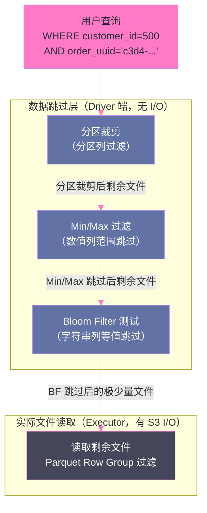

# 07 Z-Order 与数据跳过：查询加速的核心机制

## 摘要

Delta Lake 在 Parquet 文件之上构建了一套精巧的**查询加速**体系，其核心思路是：与其让 Spark 扫描所有文件，不如在写入阶段就把"有相关数据"的可能性编码到元数据中，查询时直接跳过不可能包含目标数据的文件。这套体系由两个相互配合的机制构成：**数据跳过（Data Skipping）**——基于 Delta Log 中每个文件的列统计信息（Min/Max/NullCount），在读取文件列表阶段就过滤掉不相关的文件；**Z-Order 排序**——通过多维空间填充曲线对数据进行聚类排序，使具有相似 Key 的记录尽量集中在同一个 Parquet 文件中，从而最大化数据跳过的效果。两者缺一不可：没有 Z-Order 的数据跳过，Min/Max 范围宽，跳过率低；没有数据跳过的 Z-Order，排序本身没有查询价值。本文从数据跳过的原理出发，深入分析 Z-Order 算法的数学本质（Hilbert 曲线/Z-曲线），讲解 `OPTIMIZE ZORDER BY` 命令的执行过程、效果评估方法，以及 Bloom Filter 在高基数字符串列上的补充优化作用。

---

## 第 1 章 数据跳过（Data Skipping）：查询加速的基础

### 1.1 数据跳过是什么，为什么重要

在传统 Parquet 数据湖（无 Delta Lake）中，一个包含 1000 个 Parquet 文件的表，无论你的 `WHERE` 条件多精确（如 `WHERE order_id = 12345`），Spark 都必须**打开所有 1000 个文件**，读取每个文件的 Footer（Parquet 格式的元数据区域），才能确定哪些 Row Group 包含目标数据。

1000 次文件打开操作（每次约 10-50ms 的 S3 请求延迟）= 10-50 秒仅用于元数据读取，还未开始实际的数据读取和计算。

**数据跳过的核心思想**：在 Delta Log 的 `add` Action 中，每个文件存储了列级别的统计信息（Min/Max/NullCount），查询时在 Driver 端直接用这些统计信息过滤文件列表——不需要实际打开文件，不需要任何 S3 请求，纯内存计算。

```
不使用数据跳过：
  列出所有 add Action → 1000 个文件 → 全部分配给 Executor 读取

使用数据跳过（WHERE order_id BETWEEN 10000 AND 20000）：
  列出所有 add Action → 读取每个文件的 stats（Min/Max）
  → 过滤掉 maxValues.order_id < 10000 或 minValues.order_id > 20000 的文件
  → 假设每个文件包含 10 万条记录，只有 order_id 在 10000-20000 范围内的文件才被保留
  → 可能只保留 5-10 个文件 → 只分配这 5-10 个文件给 Executor 读取
  → 数据扫描量减少 100-200 倍！
```

### 1.2 列统计信息的收集时机

Delta Lake 在写入 Parquet 文件时，**自动**收集每个文件的列统计信息并存入 `add` Action 的 `stats` 字段：

```json
{
  "add": {
    "path": "part-00000-abc123.snappy.parquet",
    "stats": "{
      \"numRecords\": 100000,
      \"minValues\": {
        \"order_id\": 1000001,
        \"order_date\": \"2026-01-01\",
        \"amount\": 10.5,
        \"customer_id\": 50001
      },
      \"maxValues\": {
        \"order_id\": 1100000,
        \"order_date\": \"2026-01-15\",
        \"amount\": 9999.99,
        \"customer_id\": 60000
      },
      \"nullCount\": {
        \"order_id\": 0,
        \"order_date\": 0,
        \"amount\": 125,
        \"customer_id\": 0
      }
    }"
  }
}
```

默认只收集前 **32 列**的统计信息（`delta.dataSkippingNumIndexedCols`，可调整）。对于列很多的宽表，如果关键查询列不在前 32 列，需要调整这个配置或通过 `dataSkippingStatsColumns` 指定要收集统计的列。

### 1.3 数据跳过的查询谓词支持

Data Skipping 对以下类型的查询谓词有效：

| 谓词类型 | 示例 | 跳过逻辑 |
|--------|-----|---------|
| 等值查询 | `WHERE order_id = 12345` | 跳过 `minValues.order_id > 12345 OR maxValues.order_id < 12345` 的文件 |
| 范围查询 | `WHERE order_id BETWEEN 1000 AND 2000` | 跳过 `minValues.order_id > 2000 OR maxValues.order_id < 1000` 的文件 |
| 大于/小于 | `WHERE amount > 1000` | 跳过 `maxValues.amount <= 1000` 的文件 |
| IS NULL | `WHERE customer_id IS NULL` | 跳过 `nullCount.customer_id = 0`（无 NULL）的文件 |
| IS NOT NULL | `WHERE customer_id IS NOT NULL` | 跳过 `nullCount.customer_id = numRecords`（全 NULL）的文件 |
| AND 组合 | `WHERE a > 10 AND b < 100` | 对 a 和 b 分别应用跳过，取交集 |

数据跳过对 **LIKE 模糊查询**和 **OR 组合**（某些情况下）效果有限：`WHERE name LIKE '%abc%'` 无法基于 Min/Max 做有效过滤（因为字符串的 Min/Max 不足以判断是否包含子串）。

---

## 第 2 章 Z-Order 排序：多维数据聚类的数学原理

### 2.1 单列排序的局限性

如果 `orders` 表按 `order_date` 分区，在分区内按 `customer_id` 排序，则：

```
查询 WHERE order_date = '2026-01-15' AND customer_id = 12345：
  → 分区裁剪：只扫描 order_date=2026-01-15 的分区文件
  → 在分区内，因为按 customer_id 排序，Min/Max 跳过效果极好
  
查询 WHERE order_date = '2026-01-15' AND product_id = 678：
  → 分区裁剪正常
  → 但 product_id 没有排序，每个文件的 Min/Max 覆盖的 product_id 范围很宽
  → 数据跳过效果很差，几乎所有文件都需要扫描
```

单列排序只对该列有良好的数据跳过效果，对其他列无效。**如果查询条件经常同时涉及多个列（多维查询），单列排序是不够的**。

### 2.2 Z-Order：多维空间填充曲线

**Z-Order（也叫 Morton Code）** 是一种将多维数据映射到一维的空间填充曲线算法，其关键特性是：**在多维空间中距离相近的点，在 Z-Order 值上也倾向于相近**——即保持了多维空间的局部性。

**Z-Order 的工作原理（以二维为例）**：

```
假设有两个列：customer_id（范围 0-15）和 product_id（范围 0-15）
将每个值的二进制表示交叉排列（Bit Interleaving）：

customer_id = 3  = 0011 (binary)
product_id  = 5  = 0101 (binary)

Z-Order 值 = 交叉排列两个二进制数：
  0 0 0 1 1 1 = 从 product_id 取位、customer_id 取位交替排列
  具体：c3 p3 c2 p2 c1 p1 c0 p0 = 0 0 0 1 1 0 1 1 = 27 (十进制)
```

**为什么交叉排列能保持多维局部性**？直觉上，如果两个点在二维空间中距离近，它们的 x 坐标和 y 坐标都不会差太多，交叉排列后的值也不会差太多（因为高位相同的点空间距离也近）。

Delta Lake 在 `OPTIMIZE ZORDER BY (col1, col2)` 时：
1. 计算每条记录在 (col1, col2) 维度上的 Z-Order 值
2. 按 Z-Order 值对所有记录排序
3. 将排序后的记录写入 Parquet 文件（每个文件包含 Z-Order 值连续的一段记录）

排序后的效果：**在 (col1, col2) 多维空间中位置相近的记录，被分配到同一个或相邻的 Parquet 文件**。

### 2.3 Z-Order 对数据跳过的提升

未 Z-Order 排序时的数据分布（`customer_id` 和 `product_id` 均匀分散在所有文件中）：

```
文件 1：customer_id: [1, 1000], product_id: [1, 500]  (范围宽)
文件 2：customer_id: [2, 998],  product_id: [3, 497]  (范围宽)
...（1000 个文件，每个文件的 Min/Max 范围都很宽，几乎无法跳过）

查询 WHERE customer_id = 500 AND product_id = 250：
→ 几乎所有文件的 Min/Max 范围都包含 (500, 250)
→ 数据跳过无效，需要扫描全部 1000 个文件
```

按 (customer_id, product_id) Z-Order 排序后：

```
文件 1：customer_id: [1, 50],    product_id: [1, 50]   (范围窄，聚类好)
文件 2：customer_id: [1, 55],    product_id: [50, 100] (范围窄，聚类好)
...
文件 500：customer_id: [490, 510], product_id: [240, 260]  ← 包含目标数据
...

查询 WHERE customer_id = 500 AND product_id = 250：
→ 只有文件 490-510（约 20 个文件）的 Min/Max 范围包含 (500, 250)
→ 数据跳过：扫描从 1000 个文件减少到 20 个，减少 98%
```

### 2.4 Z-Order 与 Hilbert Curve 的关系

Delta Lake 默认使用 **Z-Curve（Morton Curve）**，但 Z-Curve 存在一个已知缺陷：在某些区域，Z-Curve 会跳越（从一个象限突然跳到另一个象限），导致空间局部性的局部中断。

**Hilbert Curve** 是空间填充曲线的更优版本，不存在这种跳越问题，多维聚类效果更好。Delta Lake 2.2+ 支持通过配置使用 Hilbert Curve：

```sql
ALTER TABLE orders SET TBLPROPERTIES (
    'delta.layoutOptimization.strategy' = 'hilbert'
);
OPTIMIZE orders ZORDER BY (customer_id, product_id);
```

在实测中，Hilbert Curve 相比 Z-Curve 的数据跳过率通常提升 10-30%（取决于数据分布和查询模式）。

---

## 第 3 章 OPTIMIZE ZORDER BY 的执行过程

### 3.1 命令语法

```sql
-- 对整个表执行 Z-Order 排序（按 customer_id 和 product_id 聚类）
OPTIMIZE orders ZORDER BY (customer_id, product_id);

-- 只对特定分区执行（增量 OPTIMIZE，减少计算量）
OPTIMIZE orders WHERE order_date = '2026-01-15' ZORDER BY (customer_id, product_id);

-- 通过 PySpark API
from delta.tables import DeltaTable
dt = DeltaTable.forPath(spark, "s3://bucket/delta/orders/")
dt.optimize().executeZOrderBy("customer_id", "product_id")

# 只优化特定分区
dt.optimize().where("order_date = '2026-01-15'").executeZOrderBy("customer_id", "product_id")
```

### 3.2 OPTIMIZE 的执行逻辑

```
Step 1：收集候选文件
  找出目标分区（或整个表）中所有 "小文件"（大小 < 目标文件大小，默认 1GB）
  注意：已经是目标大小的大文件也会参与 Z-Order 重排

Step 2：读取所有候选文件的数据
  将所有候选文件的 Parquet 数据读入 Spark
  计算每行记录在 (customer_id, product_id) 维度的 Z-Order 值

Step 3：按 Z-Order 值全局排序
  对所有记录按 Z-Order 值排序（内部用 Spark 的 repartitionByRange）

Step 4：写入新的优化 Parquet 文件
  将排序后的记录写入新的大 Parquet 文件（目标大小 ~1GB）
  同时收集每个新文件的列统计信息（Min/Max）

Step 5：写入 Delta Log
  add 所有新文件（dataChange=false，因为 OPTIMIZE 不改变数据内容）
  remove 所有旧的候选文件
```

**`dataChange=false` 的重要性**：OPTIMIZE 操作的 `add` Action 带有 `dataChange=false` 标记，表示这是一次**数据重组**（不产生新数据，只是重新排列现有数据）。这个标记被 Change Data Feed 识别——OPTIMIZE 操作不会产生 CDF 变更记录，下游增量消费者不受 OPTIMIZE 影响。

### 3.3 OPTIMIZE 的代价分析

```
表规模：1TB，1000 个文件，每个 1GB
OPTIMIZE ZORDER BY (customer_id, product_id)（全表）：

读取代价：读取 1TB 数据
计算代价：计算所有行的 Z-Order 值 + 全局排序（Shuffle 密集型）
写入代价：写回 1TB 重排后的数据

总 I/O：~2TB（读 1TB + 写 1TB）
Shuffle 数据量：~1TB（排序需要全局 Shuffle）
执行时间：取决于集群规模，通常 30-120 分钟
```

**实践建议**：不要对整个大表频繁执行全量 OPTIMIZE，而是**按分区增量 OPTIMIZE**：

```python
# 只 OPTIMIZE 昨天的新数据分区（增量模式）
from datetime import datetime, timedelta
yesterday = (datetime.now() - timedelta(days=1)).strftime("%Y-%m-%d")

dt.optimize() \
  .where(f"order_date = '{yesterday}'") \
  .executeZOrderBy("customer_id", "product_id")
```

---

## 第 4 章 Bloom Filter：高基数字符串列的补充优化

### 4.1 为什么 Min/Max 对字符串等值查询效果有限

Z-Order 和 Min/Max 统计对**数值型列的范围查询**效果最好。但对于高基数字符串列（如 UUID、手机号、邮件地址）的**等值查询**，Min/Max 的效果很差：

```
文件 1 中的 order_uuid 列：
  minValues.order_uuid = "a000-..." （字典序最小）
  maxValues.order_uuid = "ffff-..." （字典序最大）

查询 WHERE order_uuid = 'c3d4-5678-...'：
  'a000' ≤ 'c3d4' ≤ 'ffff' → 无法跳过！
  几乎所有文件都无法通过 Min/Max 跳过
```

UUID 的字典序范围宽（a 到 f 几乎覆盖所有），Min/Max 跳过几乎完全失效。

### 4.2 Bloom Filter：概率性成员测试

**Bloom Filter（布隆过滤器）** 是一种空间效率极高的概率数据结构，支持"某个元素是否可能在集合中"的测试：

- **回答"不在"：100% 准确**（如果 Bloom Filter 说某个 UUID 不在文件中，一定不在）
- **回答"在"：可能有误（False Positive，误判率可配置）**（如果 Bloom Filter 说可能在，需要实际读取文件确认）

对于等值查询，Bloom Filter 可以高效判断"某个文件肯定不包含目标 UUID"，从而跳过这个文件：

```
对每个 Parquet 文件构建 Bloom Filter（包含该文件所有 order_uuid 的集合）

查询 WHERE order_uuid = 'c3d4-5678-...'：
  文件 1 的 Bloom Filter → 测试 'c3d4-5678-...' → "不在" → 跳过文件 1
  文件 2 的 Bloom Filter → 测试 'c3d4-5678-...' → "可能在" → 读取文件 2
  文件 3 的 Bloom Filter → 测试 'c3d4-5678-...' → "不在" → 跳过文件 3
  ...
  假设 1000 个文件中只有 1 个确实包含目标 UUID（加上 1% 误判率，约 10 个文件触发假阳性）
  → 实际读取 ~11 个文件（从 1000 个减少到 11 个，减少 99%）
```

### 4.3 在 Delta Lake 中配置 Bloom Filter

```sql
-- 为 order_uuid 列创建 Bloom Filter
ALTER TABLE orders SET TBLPROPERTIES (
    'delta.bloomFilter.columns' = 'order_uuid, customer_email',
    'delta.bloomFilter.fpp' = '0.01'        -- 误判率（False Positive Probability）：1%
);

-- 执行 OPTIMIZE 时生成 Bloom Filter（Bloom Filter 存储在 Parquet 文件的 Footer 中）
OPTIMIZE orders;
```

**Bloom Filter 的存储开销**：Bloom Filter 存储在 Parquet 文件内部（Row Group 级别），占用空间约为：

```
大小 ≈ numRecords × log(1/fpp) / ln(2)² × (1/8) 字节
对于 100 万条记录，fpp=0.01：
  ≈ 1,000,000 × 6.64 / 0.48 × 0.125 ≈ 1.7MB
（总 Parquet 文件大小可能是 500MB，Bloom Filter 只增加了 0.3% 的存储开销）
```

### 4.4 Z-Order + Data Skipping + Bloom Filter 的组合效果



三层过滤是串联的，每层都进一步减少需要实际读取的文件数量，最终只有极少数文件需要真正的 S3 I/O。

---

## 第 5 章 Z-Order 效果评估与生产配置

### 5.1 如何评估 Z-Order 效果

```python
# 通过 Spark UI 的 SQL 执行计划评估数据跳过情况
# 在 SQL 执行计划中查找 "filesSkipped" 和 "filesRead" 指标

# 方法 1：通过 operationMetrics 评估 OPTIMIZE 效果
from delta.tables import DeltaTable
dt = DeltaTable.forPath(spark, "s3://bucket/delta/orders/")
history = dt.history(5).select("version", "operation", "operationMetrics")
history.show(truncate=False)

# 方法 2：通过 explain() 查看执行计划中的数据跳过统计
spark.sql("""
    SELECT * FROM orders 
    WHERE customer_id = 500 AND order_date = '2026-01-15'
""").explain(True)
# 在 Physical Plan 中查找：
# BatchScan[..., filesRead: 5, filesSkipped: 995, ...]

# 方法 3：通过 Spark UI 的 "Scan" 阶段统计
# 在 Spark UI → SQL → 某次查询 → 对应 Scan 节点
# 查看 "number of files read" 和 "number of files skipped"
```

### 5.2 Z-Order 列的选择原则

```
好的 Z-Order 列（高收益）：
  ✅ 查询频繁使用的 WHERE 条件列（如 customer_id、product_id、region）
  ✅ 高基数列（取值多，Min/Max 范围窄的效果更好）
  ✅ 与查询模式相关的维度列（多维分析的维度轴）

不好的 Z-Order 列（低收益甚至负收益）：
  ❌ 已经是分区列的列（分区裁剪已经处理，Z-Order 没有额外效果）
  ❌ 低基数列（如 status 只有 open/closed/cancelled，Min/Max 范围本来就窄）
  ❌ 查询中从不出现在 WHERE 条件中的列

Z-Order 列数量：
  2-3 列是最佳实践（超过 3 列 Z-Order 效果明显下降，
  因为多维 Z-Order 曲线的局部性随维度增加而急速退化）
```

### 5.3 生产推荐配置

```sql
-- 典型的电商订单表配置
CREATE TABLE fact_orders (
  order_id     BIGINT,
  order_date   DATE,
  customer_id  BIGINT,
  product_id   BIGINT,
  amount       DOUBLE,
  order_uuid   STRING,
  status       STRING
)
USING DELTA
PARTITIONED BY (order_date)   -- 按日期分区（粗粒度过滤）
TBLPROPERTIES (
  'delta.dataSkippingNumIndexedCols' = '10',
  'delta.bloomFilter.columns' = 'order_uuid',
  'delta.bloomFilter.fpp' = '0.01',
  'delta.autoOptimize.optimizeWrite' = 'true',  -- 写入时自动优化文件大小
  'delta.autoOptimize.autoCompact' = 'true'     -- 自动合并小文件
);

-- 每天对昨日分区执行 Z-Order（CI/CD 定时任务）
OPTIMIZE fact_orders 
  WHERE order_date = current_date() - interval 1 days
  ZORDER BY (customer_id, product_id);
```

---

## 小结

Delta Lake 的查询加速体系是一个分层次的系统，从粗粒度到细粒度依次过滤：

- **分区裁剪**：分区列的等值/范围条件直接跳过无关分区目录，粗粒度过滤，代价极低
- **Data Skipping（Min/Max）**：文件级别的列统计信息，在 Driver 内存中过滤文件列表，无需任何 S3 请求；对数值型列的范围查询效果极佳
- **Z-Order 排序**：通过 Hilbert/Z-Curve 将多维空间相近的记录聚集到同一文件，使 Min/Max 的范围更窄，大幅提升多维查询的数据跳过率；`OPTIMIZE ZORDER BY` 的关键操作，建议按分区增量执行
- **Bloom Filter**：为高基数字符串列（UUID、邮件、手机号）的等值查询提供概率性过滤，弥补 Min/Max 对字符串等值查询无效的短板；存储开销小（约 1-2MB/百万行）

第 08 篇深入流批一体：Delta Lake 如何与 Structured Streaming 深度集成——作为 Sink（Exactly-once 写入保证）和作为 Source（基于 Delta Log 的高效增量读取），以及 Change Data Feed 在流式场景下的应用。

---

## 参考资料

- [Delta Lake Data Skipping 官方文档](https://docs.delta.io/latest/optimizations-oss.html)
- [Delta Lake OPTIMIZE 官方文档](https://docs.delta.io/latest/optimizations-oss.html#optimize-performance-with-file-management)
- [Z-Order（Morton Code）算法原理](https://en.wikipedia.org/wiki/Z-order_curve)
- [Hilbert Curve 在 Delta Lake 中的实现（Databricks Blog）](https://www.databricks.com/blog/2023/01/25/introducing-delta-lake-liquid-clustering.html)
