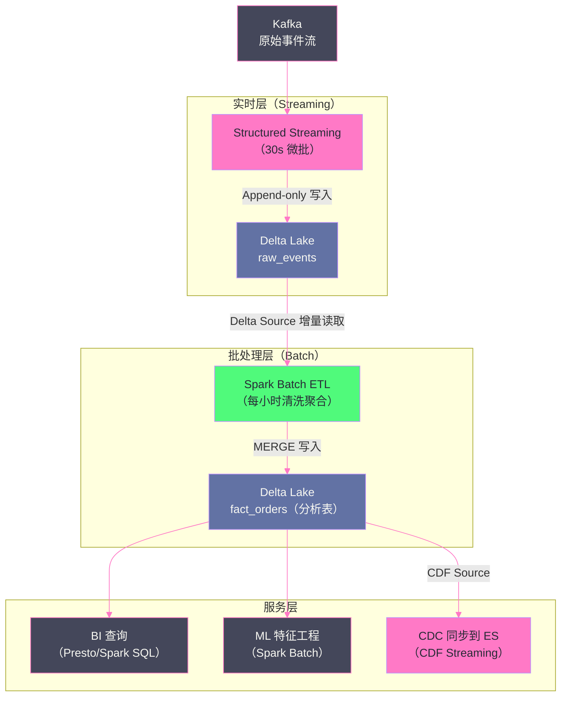

# 08 流批一体：Structured Streaming 写入与读取 Delta Lake

## 摘要

Delta Lake 与 [[Structured Streaming]] 的深度集成是 Lakehouse 架构"流批一体"愿景的核心实现——同一份 Delta 表，既可以作为 Spark Streaming 的 Sink（接收实时写入），也可以作为 Source（以增量方式读取新到达的数据），且两种模式都提供完整的 Exactly-once 语义保证。这种能力的基础依然是 Delta Log：Delta Log 的版本号天然是一个单调递增的"水位线"，Streaming 每次微批处理后将处理到的 Delta Log 版本号写入 Checkpoint，下次重启从这个版本号继续——不需要 Kafka 的 Offset 管理，不需要外部协调服务。本文系统讲解四个核心主题：**Delta 作为 Streaming Sink**（Exactly-once 的三层保证：Parquet 文件幂等写入 + Delta Log 原子提交 + Checkpoint 版本记录）、**Delta 作为 Streaming Source**（基于 Delta Log 版本差异的增量文件发现，`maxFilesPerTrigger` 等流量控制参数）、**Change Data Feed 在流式场景中的应用**（行级别增量，比文件级别增量精度更高）、以及**流批一体架构设计**（一张 Delta 表同时被 Streaming 写入和批处理读取的并发安全性）。

---

## 第 1 章 Delta Lake 作为 Streaming Sink

### 1.1 最简单的流式写入

```python
from pyspark.sql import SparkSession
from pyspark.sql.functions import from_json, col
from pyspark.sql.types import StructType, StringType, LongType, DoubleType

spark = SparkSession.builder \
    .config("spark.sql.extensions", "io.delta.sql.DeltaSparkSessionExtension") \
    .config("spark.sql.catalog.spark_catalog", "org.apache.spark.sql.delta.catalog.DeltaCatalog") \
    .getOrCreate()

# 从 Kafka 读取原始 JSON 消息
kafka_stream = spark.readStream \
    .format("kafka") \
    .option("kafka.bootstrap.servers", "kafka:9092") \
    .option("subscribe", "orders") \
    .option("startingOffsets", "latest") \
    .load()

# 解析 JSON Schema
order_schema = StructType() \
    .add("order_id", LongType()) \
    .add("customer_id", LongType()) \
    .add("amount", DoubleType()) \
    .add("order_date", StringType())

orders = kafka_stream \
    .select(from_json(col("value").cast("string"), order_schema).alias("data")) \
    .select("data.*")

# 写入 Delta Lake（Append 模式）
query = orders.writeStream \
    .format("delta") \
    .outputMode("append") \
    .option("checkpointLocation", "s3://bucket/checkpoints/orders/") \
    .trigger(processingTime="30 seconds") \
    .start("s3://bucket/delta/orders/")
```

### 1.2 Delta Sink 的 Exactly-once 保证机制

理解 Delta Sink 的 Exactly-once，需要从三个层面分析：

**层面一：Parquet 文件写入的幂等性**

每次微批（Micro-batch）写入前，Spark 为本次批次生成唯一的 **`batchId`**（从 0 开始单调递增）和唯一的 **`epochId`**。写入的 Parquet 文件名包含这个唯一标识：

```
part-00000-batchId=5-epochId=1234567890.snappy.parquet
```

如果 Spark 在写入 Parquet 文件后、提交 Delta Log 之前崩溃，重启后会重新执行这个批次：
- Parquet 文件已存在（同名文件，内容相同）→ 直接跳过写入（幂等）
- 重新提交 Delta Log → 成功

**层面二：Delta Log 提交的原子性**

如第 02 篇所述，Delta Log 的 JSON 文件写入是原子的（利用对象存储的原子 PUT）。微批的 Delta Log 提交要么完全成功（JSON 文件存在），要么完全失败（JSON 文件不存在）。读取者永远看不到半成功的微批。

**层面三：Checkpoint 记录微批进度**

Structured Streaming 的 Checkpoint 目录记录了每次成功提交的微批 ID（`batchId`），以及对应的 Kafka Offset（或其他 Source 的进度）。

```
s3://bucket/checkpoints/orders/
  commits/
    0           # batchId=0 的提交记录
    1           # batchId=1 的提交记录
    ...
  offsets/
    0           # batchId=0 对应的 Kafka Offset
    1
    ...
  sources/
    0/          # Source 0（Kafka）的状态
  metadata
```

重启后，Streaming 从 Checkpoint 中找到最后成功的 `batchId`，从对应的 Kafka Offset 继续消费，保证"每条消息只被处理一次"。

**三层机制协同**：Kafka Offset Checkpoint（Source 端 Exactly-once）+ Delta Log 原子提交（Sink 端 Exactly-once）= 端到端 Exactly-once。

### 1.3 foreachBatch：精细控制 Sink 逻辑

`foreachBatch` 是 Structured Streaming 中最灵活的 Sink 接口，允许将每个微批的 DataFrame 进行任意批处理操作：

```python
def write_to_delta(batch_df, batch_id):
    """
    batch_df: 本次微批的 DataFrame
    batch_id: 本次微批的 ID（单调递增，用于幂等性判断）
    """
    # 幂等性检查（防止重复写入）
    # 注意：Delta 的原子提交已经保证了幂等性，这里是额外的业务层保障
    
    # 场景：CDC 数据，需要 MERGE 而不是 Append
    from delta.tables import DeltaTable
    
    target = DeltaTable.forPath(spark, "s3://bucket/delta/orders/")
    
    target.alias("T").merge(
        batch_df.alias("S"),
        "T.order_id = S.order_id"
    ).whenMatchedUpdateAll() \
     .whenNotMatchedInsertAll() \
     .execute()

query = cdc_stream.writeStream \
    .foreachBatch(write_to_delta) \
    .option("checkpointLocation", "s3://bucket/checkpoints/orders_cdc/") \
    .trigger(processingTime="60 seconds") \
    .start()
```

> [!warning] 生产避坑
> **`foreachBatch` 中 MERGE 的幂等性**：如果 Spark 在 `foreachBatch` 执行完 MERGE 但在向 Checkpoint 写入 `batchId` 之前崩溃，重启后会用相同的 `batch_df` 重新执行 MERGE。如果 MERGE 的语义是 `whenMatchedUpdateAll / whenNotMatchedInsertAll`，重复执行的 MERGE 是幂等的（第二次 MERGE 时所有记录都 Matched，只更新不插入）。但如果 MERGE 中有 `whenNotMatchedInsertAll`（相同 key 的记录会被二次插入），则需要额外的幂等保证（如在 Source 数据中包含幂等 key）。

---

## 第 2 章 Delta Lake 作为 Streaming Source

### 2.1 Delta Source 的增量读取原理

Delta Lake 作为 Streaming Source 的核心机制：**将 Delta Log 的版本号当作 Source 的"Offset"**。

每次微批：
1. 读取上次处理到的版本号（从 Checkpoint 中）
2. 读取 Delta Log，找出从上次版本到当前最新版本之间新 `add` 的文件（增量文件）
3. 只扫描这些增量文件（不扫描历史数据）
4. 处理完成后，将当前最新版本号写入 Checkpoint

```python
# Delta Lake 作为 Streaming Source
delta_stream = spark.readStream \
    .format("delta") \
    .option("maxFilesPerTrigger", 1000)  \  # 每次最多处理 1000 个新文件
    .load("s3://bucket/delta/orders/")

# 或使用表名（需要已在 Catalog 注册）
delta_stream = spark.readStream \
    .format("delta") \
    .option("maxBytesPerTrigger", "1g")  \  # 每次最多处理 1GB 新数据
    .table("orders")
```

**与 Kafka Source 的对比**：

| 维度 | Kafka Source | Delta Source |
|-----|-------------|-------------|
| **Offset 语义** | Partition + Offset（整数）| Delta Log 版本号（整数）|
| **重放能力** | 依赖 Kafka 消息保留期 | 依赖 Delta 文件保留期（`delta.deletedFileRetentionDuration`）|
| **消费起点** | `startingOffsets: earliest/latest` | `startingVersion: 0/latest` |
| **背压控制** | `maxOffsetsPerTrigger` | `maxFilesPerTrigger`/`maxBytesPerTrigger` |
| **消息顺序** | Partition 内有序 | 同一 Delta Log 版本内无序（文件级别有序）|

### 2.2 Delta Source 的关键配置

```python
delta_stream = spark.readStream \
    .format("delta") \
    .option("startingVersion", "0")            # 从 version=0 开始（全量重放）
    .option("startingTimestamp", "2026-01-01") # 或按时间戳指定起点
    .option("maxFilesPerTrigger", 100)         # 每次微批最多处理 100 个文件（流量控制）
    .option("maxBytesPerTrigger", "512m")      # 每次微批最多处理 512MB
    .option("ignoreDeletes", "true")           # 忽略 DELETE 操作（只处理 INSERT/APPEND）
    .option("ignoreChanges", "true")           # 忽略 UPDATE/DELETE（只处理新增文件）
    .load("s3://bucket/delta/orders/")
```

**`ignoreChanges` vs `ignoreDeletes` 的使用场景**：

Delta Source 默认只支持 Append-only 的表——如果源表有 UPDATE/DELETE 操作（CoW 模式会生成新文件 + 删除旧文件），Delta Source 会抛出异常（因为它无法区分"重写旧文件产生的新文件"和"真正的新增数据"）。

- `ignoreDeletes=true`：忽略纯删除操作（`remove` Action），只响应 `add` Action
- `ignoreChanges=true`：忽略所有数据变更（UPDATE/DELETE/MERGE 产生的 `add` Actions 也视为新数据处理）——这可能导致下游看到重复数据（被 UPDATE 的行在旧文件被 remove、新文件被 add 后，会被重新处理）

**更好的方案**：对于需要感知 UPDATE/DELETE 的流式消费，使用 **Change Data Feed Source**（下一节）而不是 `ignoreChanges`。

### 2.3 Delta Source 处理 Schema 演进

当 Delta 表发生 Schema 变更（添加列）时，Delta Source 的行为：

```python
# 默认：Schema 变更时 Streaming 任务抛出异常并停止
# 需要手动更新 Checkpoint Schema 后重启

# 使用 schemaTrackingLocation 自动处理 Schema 变更（Delta 2.1+）
delta_stream = spark.readStream \
    .format("delta") \
    .option("schemaTrackingLocation", "s3://bucket/schema-tracking/orders/") \
    .load("s3://bucket/delta/orders/")
# 当源表 Schema 变化时，Streaming 任务自动在下次微批时使用新 Schema
# 新增列在 Schema 变化前的历史数据中返回 NULL
```

---

## 第 3 章 Change Data Feed 作为 Streaming Source

### 3.1 为什么 CDF Source 优于普通 Delta Source

普通 Delta Source 的粒度是**文件级别**：一次 UPDATE 操作修改了 100 行，但涉及的文件有 500MB，Delta Source 会将这整个 500MB 的文件（包含未修改的数据）作为增量数据发送给下游。下游需要自己识别哪些行是真正的变更。

**Change Data Feed（CDF）Source** 的粒度是**行级别**：直接告诉下游"这 100 行被更新了（update_preimage 和 update_postimage），那 50 行被删除了（delete），这 200 行是新插入的（insert）"。下游无需任何额外处理，直接消费行级别变更。

```python
# CDF 作为 Streaming Source
cdf_stream = spark.readStream \
    .format("delta") \
    .option("readChangeFeed", "true") \
    .option("startingVersion", "latest") \
    .table("orders")

# cdf_stream 的 Schema = 原表 Schema + _change_type + _commit_version + _commit_timestamp
# 过滤只处理 INSERT 和 UPDATE（不处理 DELETE）
inserts_and_updates = cdf_stream.filter(
    col("_change_type").isin("insert", "update_postimage")
)

# 将变更同步到 Elasticsearch
inserts_and_updates.writeStream \
    .foreachBatch(lambda batch_df, batch_id: sync_to_elasticsearch(batch_df)) \
    .option("checkpointLocation", "s3://bucket/checkpoints/orders_to_es/") \
    .start()
```

**CDF Source 与普通 Delta Source 的对比**：

| 维度 | 普通 Delta Source | CDF Source |
|-----|----------------|-----------|
| **数据粒度** | 文件级别（包含文件内所有行）| 行级别（只有真正变更的行）|
| **UPDATE 处理** | 重新读取整个被修改的文件 | 只读取 update_preimage + update_postimage |
| **DELETE 处理** | `ignoreDeletes=true` 忽略 | 明确提供 delete 行 |
| **下游重复数据** | 有（UPDATE 产生的 CoW 文件含未修改行）| 无（只有真正变更的行）|
| **数据量** | 大（整个文件）| 小（只有变更行）|
| **适用场景** | Append-only 表 | 有 UPDATE/DELETE 的表，CDC 同步 |

---

## 第 4 章 流批一体架构：并发安全性分析

### 4.1 Streaming 写入 + 批处理读取

最典型的 Lakehouse 流批一体场景：

```
Kafka → Structured Streaming → Delta Lake（orders） ← Spark Batch / BI 查询
```

**并发安全性**：这是安全的，因为：
1. Streaming 写入是 Append-only（`isBlindAppend=true`），不会与批处理读取产生冲突（参见第 03 篇 OCC 冲突矩阵）
2. 批处理读取基于某个固定 Snapshot（MVCC），不受 Streaming 写入影响
3. 批处理写入（如 ETL 对 Delta 表进行 MERGE）与 Streaming 读取：Delta Source 会在下次微批时自动感知到 MERGE 产生的文件变化（注意：如果 MERGE 修改了已存在的文件，需要设置 `ignoreChanges=true`）

### 4.2 多路 Streaming 并发写入同一张 Delta 表

```
Kafka Topic A → Streaming Job A → ↘
                                    Delta Lake (orders)
Kafka Topic B → Streaming Job B → ↗
```

**两个 Streaming 作业并发写入**：这是安全的——两个 Streaming 都是 Append（`isBlindAppend=true`），OCC 的冲突检测直接放行（不冲突），两个作业的写入版本号依次递增。

**需要注意**：两个作业使用**不同的 Checkpoint 目录**，维护各自独立的微批进度。

### 4.3 架构设计建议：Lambda 到 Kappa 的实践



**架构要点**：

1. **raw_events**（Delta Lake Append-only）：Streaming 写入，保持高吞吐；Delta Source 供 ETL 增量消费；设置短保留期（7 天）控制存储成本

2. **fact_orders**（Delta Lake MERGE-enabled）：批处理 ETL 每小时聚合写入；启用 CDF 供下游 CDC 同步；Z-Order + Bloom Filter 加速 BI 查询；设置 30 天保留期

3. **消除 Lambda 架构的双路逻辑**：不再有独立的"实时链路"和"批处理链路"——都是基于 Delta Lake 的同一份数据，通过不同的读取模式（最新版本 vs Delta Source 增量）满足不同的延迟需求

---

## 第 5 章 Streaming 性能调优

### 5.1 微批延迟的来源分析

Delta Streaming 的端到端延迟 = Trigger 间隔 + 微批执行时间：

```
微批执行时间的组成：
  1. Delta Log 读取（找出增量文件列表）：10-100ms
  2. 文件读取（S3 GET）：取决于文件数量和大小
  3. 计算（Spark Stage 执行）：取决于业务逻辑复杂度
  4. Delta Log 写入（提交新版本）：50-200ms
  5. Checkpoint 写入：100-500ms
```

### 5.2 关键调优参数

```python
# 1. 控制每次微批处理的数据量（避免微批过大导致 OOM）
.option("maxFilesPerTrigger", 1000)    # 按文件数限制
.option("maxBytesPerTrigger", "2g")   # 按数据量限制（与文件数取较小值）

# 2. 优化写入端的文件大小（避免小文件积累）
spark.conf.set("spark.databricks.delta.optimizeWrite.enabled", "true")
spark.conf.set("spark.databricks.delta.optimizeWrite.binSize", "128m")
# 或开源版本：
spark.conf.set("spark.sql.shuffle.partitions", "auto")  # AQE 自动调整

# 3. Delta Log 读取缓存（复用同一进程内的 Delta Log 缓存）
spark.conf.set("spark.databricks.delta.stalenessAllowedMs", "30000")
# 允许读取最多 30 秒前的 Delta Log 缓存（减少重复的 S3 LIST 请求）

# 4. Checkpoint 写入优化
.option("checkpointLocation", "hdfs:///checkpoints/...")  # HDFS 比 S3 写入快
```

### 5.3 监控 Delta Streaming 作业

```python
from pyspark.sql.streaming import StreamingQueryListener

class DeltaStreamingMonitor(StreamingQueryListener):
    def onQueryProgress(self, event):
        progress = event.progress
        print(f"Batch ID: {progress.batchId}")
        print(f"Input rows/sec: {progress.inputRowsPerSecond:.1f}")
        print(f"Process rows/sec: {progress.processedRowsPerSecond:.1f}")
        print(f"Batch duration: {progress.batchDuration}ms")
        
        # Delta 特有的指标（在 sources 中）
        for source in progress.sources:
            if "delta" in source.description.lower():
                print(f"Delta source: {source.numInputRows} rows from "
                      f"{source.description}")

spark.streams.addListener(DeltaStreamingMonitor())
```

---

## 小结

Delta Lake 与 Structured Streaming 的集成实现了真正意义上的流批一体：

- **Delta 作为 Sink**：三层 Exactly-once（Parquet 幂等写入 + Delta Log 原子提交 + Checkpoint 进度记录）；`foreachBatch` 支持 MERGE 等复杂 Sink 逻辑
- **Delta 作为 Source**：Delta Log 版本号作为 Offset，天然支持从任意版本重放；`maxFilesPerTrigger`/`maxBytesPerTrigger` 控制微批数据量；`ignoreChanges` 处理非 Append-only 表（但推荐用 CDF 替代）
- **CDF Source**：行级别增量，比文件级别增量数据量小、精度高，完美适配 CDC 同步场景
- **并发安全**：Streaming Append 与批处理读取/写入的并发由 OCC 保证，无需人工协调；多路 Streaming 并发写入同一表也是安全的

第 09 篇讲解 Delta Live Tables（DLT）：Databricks 推出的声明式流批一体管道框架，通过声明"期望（Expectations）"描述数据质量约束，通过物化视图和流式表自动管理依赖和增量计算。

---

## 参考资料

- [Delta Lake Structured Streaming 官方文档](https://docs.delta.io/latest/delta-streaming.html)
- [Delta Lake Change Data Feed Streaming 文档](https://docs.delta.io/latest/delta-change-data-feed.html)
- Armbrust et al. Delta Lake: High-Performance ACID Table Storage over Cloud Object Stores. VLDB 2020.
