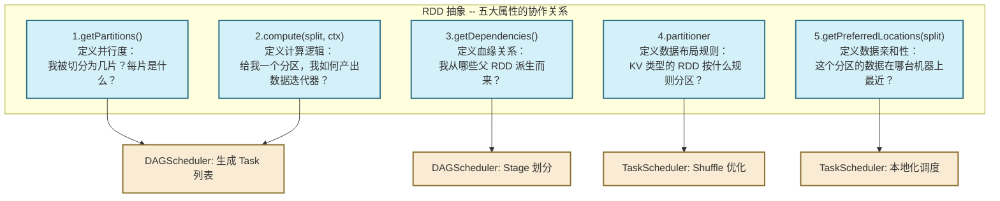

# 01 什么是 RDD：从数据流到工作集，分布式计算的代际变革与抽象本质

> [!abstract] 摘要
> 纵观大规模分布式计算的发展史，从 MapReduce 的"无状态批处理"，到 Spark RDD 的"弹性内存工作集"，本质上是整个行业对"如何在廉价商用机集群上高效复用内存中的中间数据"这一问题的一次系统性回答。本文不满足于停留在"RDD 是弹性分布式数据集"这种定义层面，而是从分布式系统的两大核心矛盾——**效率（内存共享）**与**可靠性（容错成本）**的天然对立出发，逐步推导出 RDD 必须做出的每一个设计决策：为什么选择不可变性、为什么选择粗粒度变换、为什么选择血缘而不是副本，以及这些选择背后的工程代价与局限。理解这些"为什么"，是真正掌握 Spark 内核、在生产环境中做出正确决策的前提。

---

## 第 1 章 大数据计算范式的演进：一道没有完美解的工程难题

要真正理解 RDD 的价值，必须先回到它诞生的历史背景中去。技术不是凭空出现的，每一次重大抽象的诞生，都是对前一代技术痛点的系统性回应。

### 1.1 MapReduce：伟大的起点，也是效率的天花板

2004 年，Google 发表了改变行业格局的 MapReduce 论文。它的核心贡献不是算法本身有多复杂，而是它**将分布式计算的复杂性封装进了框架**：你只需要提供 `Map` 函数和 `Reduce` 函数，框架负责切分数据、调度任务、处理故障、合并结果。这种"把分布式的复杂性还给框架"的思路，让普通工程师第一次具备了处理 PB 级数据的能力。

然而，MapReduce 的容错设计是一把双刃剑。它之所以能如此优雅地处理节点故障，是因为它强制了一个极其保守的数据流模型：**每一个 Job 的所有中间结果都必须落盘（写入 HDFS）**。

这个设计的逻辑是自洽的：既然数据都持久化在 HDFS 上了，任何节点挂掉都只需要重跑那个 Task，从 HDFS 重新读取输入就行了，容错代价极低。但它的代价同样极其明显：

**场景一：机器学习的迭代计算**

逻辑回归（Logistic Regression）是最典型的迭代算法。它需要反复扫描整个训练集，每次迭代都更新模型参数，通常需要 50 到 100 次迭代才能收敛。在 MapReduce 模型下，这意味着要启动 50 到 100 个相互依赖的 Job，每个 Job 都要经历：

```
读取 HDFS → 计算梯度 → 写入 HDFS → 下一个 Job 读取 HDFS → ...
```

UC Berkeley 的研究团队在 NSDI 2012 的原始 RDD 论文中实测了这个场景：在一个 100 节点的集群上，用 MapReduce 跑逻辑回归，127 秒完成一次迭代，其中**真正的 CPU 计算时间不到 5 秒，其余时间全部消耗在磁盘 I/O 和数据序列化/反序列化上**。

**场景二：交互式数据探索**

数据分析师在做探索性分析时，往往需要对同一份数据集反复查询：先看整体分布，再看某个维度，再做交叉对比。如果每次查询都要从 HDFS 重新读取、重新计算，这种交互体验是无法接受的——在大集群上，光读取一份 TB 级数据就要几分钟。

这两个场景揭示了 MapReduce 模型的根本局限：**它是为"一次性批处理"设计的，而不是为"数据复用"设计的**。每次计算都从持久化存储起步，计算结束就落盘销声，没有任何跨 Job 的内存状态复用机制。

### 1.2 "工作集"的概念：一个朴素但革命性的直觉

Matei Zaharia（Spark 的主要作者）在 2010 年的 HotCloud 论文中提出了一个简单而深刻的观察：

> 在机器学习和交互式查询这两类场景中，被频繁复用的数据集是可以预先识别的。这些被反复使用的数据集，就是所谓的"工作集（Working Sets）"。

如果能把这些工作集放在分布式集群的**内存**里，而不是每次从磁盘重新读取，速度提升将是量级级别的。这个直觉非常朴素——内存比磁盘快 1000 倍，这是计算机体系结构的基本常识。

但问题随之而来：**在分布式环境下，如何管理跨多台机器的共享内存？**

这不是一个简单的工程问题，它触碰了分布式系统最核心的矛盾：**效率与可靠性的对立**。

---

## 第 2 章 核心矛盾：分布式共享内存为什么难？

在单机程序里，内存是由操作系统统一管理的，进程通过 `malloc/free` 申请和释放内存，内核负责协调。这套机制在单机上工作得很好，因为所有操作都在同一个地址空间内。

但一旦跨越网络边界，情况就完全不同了。

### 2.1 DSM 的理想与现实

分布式共享内存（Distributed Shared Memory, DSM）并不是一个新概念，学术界和工业界在上世纪 90 年代就做过大量的探索，典型的系统包括 Ivy、Munin 等。DSM 的核心思想很诱人：**让程序员像操作本地内存一样操作分布式内存，底层的网络通信完全透明**。

DSM 的本质是允许任意粒度的读写操作——你可以读或写任意内存地址的任意字节。正是这种"细粒度（Fine-grained）"的灵活性，带来了两个在大规模集群下几乎无解的工程问题：

**问题一：一致性协议的开销呈指数级增长**

当节点 A 修改了一个变量，节点 B 如何知道这个变量已经改变了？这需要缓存一致性协议（Cache Coherence Protocol）。在 4 台机器的集群里，这是可以接受的。在 400 台机器的集群里，任何一个写操作都可能触发数百次网络消息来同步状态，协议开销远超实际计算量本身。

Piccolo 系统（OSDI 2010）是一个典型的大规模 DSM 实践案例，论文中坦承，在高并发写场景下，超过 60% 的计算时间消耗在一致性协议的消息处理上，而非实际业务逻辑。

**问题二：故障恢复成本极高**

在细粒度写入模型下，要想从节点故障中恢复，你必须知道这个节点上每一个字节的最新状态。常见的两种方案：

- **副本（Replication）**：每次写入都同步到 2-3 个副本。这直接将内存消耗放大 2-3 倍，而且每次写操作都要等待所有副本确认，写入延迟大幅上升。
- **检查点（Checkpointing）**：周期性地将所有内存状态序列化写入磁盘。问题是，在一个高并发写入的集群里，"全量内存快照"本身就是一个极其繁重的操作，会周期性地"卡顿"整个集群。

这就是分布式内存共享的核心困境：**内存的高速与分布式环境的不可靠，是天然对立的**。传统 DSM 为了兼顾两者，反而两头都做不好。

### 2.2 RDD 的破局：用"计算历史"替代"数据快照"

Spark 团队意识到，上述困境的根源是**"细粒度写入"这个假设**。如果我们从一开始就不允许随机写入，而是只允许**对整个数据集执行批量的、只读的变换**，那么整个问题的性质就变了。

这个限制看起来很严格，但它带来了一个革命性的结论：

> **当所有操作都是对整个数据集的批量变换时，我们不再需要记录"数据的每个字节是什么"，而只需要记录"这个数据集是通过哪些操作从哪个源数据派生出来的"。**

这就是 RDD **血缘（Lineage）** 机制的本质。与其存储数据快照，不如存储推导路径。当节点故障导致某个分区的数据丢失时，只需要重新执行这条推导路径，就能重建丢失的分区——成本极低，不需要任何副本，不需要任何检查点（在血缘不太长的情况下）。

> [!note] 设计逻辑的第一性推导
> 这是 RDD 设计中最关键的一次取舍，值得仔细品味：
>
> **如果允许细粒度写入** → 必须要副本或检查点 → 内存消耗 2-3 倍，或周期性卡顿 → 内存计算的优势部分抵消
>
> **如果禁止细粒度写入，只允许粗粒度变换** → 只需要记录操作序列 → 故障恢复只需重新执行序列 → 内存消耗极低，无需副本
>
> 第二条路的代价是：牺牲了"任意读写"的灵活性。但 Spark 团队判断，对于大数据批处理、机器学习、交互式分析这三大核心场景，"任意读写"本来就不是必要能力，而"内存复用"才是首要需求。所以这个取舍是值得的。

---

## 第 3 章 RDD 的三大设计决策：每一个"限制"背后都有深意

理解了上述矛盾，RDD 的三大核心设计决策就变得非常自然，每一个看似"限制"的设计都有其不可或缺的工程理由。

### 3.1 不可变性（Immutability）：并发安全的终极方案

RDD 一旦创建，就是**只读**的。你可以对它执行变换操作，但变换的结果是一个新的 RDD，原来的 RDD 不会被修改。

这个设计的直接好处有三点：

**第一，完全消除了并发竞争问题。** 在单机程序中，多线程并发修改同一个变量是需要加锁的，锁带来了竞争和死锁的风险。在分布式环境中，如果允许并发修改，一致性协议的复杂度是灾难性的。而不可变性从根本上消除了这个问题——没有修改，就没有竞争，就不需要任何同步机制。Spark 可以毫无顾虑地将同一个 RDD 的多个分区调度到不同节点并行执行，不存在任何竞态条件（Race Condition）。

**第二，任务重试具有天然的幂等性（Idempotency）。** 如果一个 Task 执行到一半失败了，可以直接重新执行，因为它不会修改任何共享状态，重试的结果与第一次执行完全相同。这对于推测执行（Speculative Execution）也至关重要——同一个 Task 可以同时在两台机器上跑，谁先完成就用谁的结果，这在可变模型下是不可能实现的。

**第三，调试和推理成本极低。** 纯函数（Pure Function）是最容易理解和测试的：给定相同的输入，总是产生相同的输出。分布式系统最难排查的问题往往是"状态不一致"，不可变性从架构层面消除了这类问题。

**代价是什么？** 不可变性意味着你无法做"点更新"（Point Update）——不能只修改一条记录，每次"修改"都要产生一个新的 RDD（整个数据集的新版本）。对于需要频繁更新的场景（如实时修改用户状态的 OLTP 场景），RDD 并不适用。这也是为什么 Spark 没有取代 HBase 或 Redis，而是专注于批处理和分析型计算。

### 3.2 粗粒度变换（Coarse-grained Transformations）：容错的成本控制器

粗粒度变换是指：**每次操作都作用于整个数据集（所有分区），而不是单独针对某几条记录**。

这个约束与不可变性相辅相成。正因为每次都是对"整个数据集"的操作，我们才能用"这个操作是什么"来代替"操作之后的数据长什么样"。反过来，如果允许"只更新第 100,000 条记录"这样的细粒度操作，血缘机制就退化为操作日志（WAL），代价与传统数据库无异。

粗粒度变换还带来了另一个重要性质：**每个分区的计算是独立的**。`map(f)` 操作中，分区 0 的计算和分区 1 的计算之间没有任何数据依赖，可以完全并行执行。这使得 Spark 的并行调度非常简洁——只需要把"对哪个分区执行什么函数"这个信息发给对应的 Executor 就行了，不需要任何全局协调。

> [!info] 关于"写幂等"的延伸思考
> 粗粒度变换确保了每个分区的计算可以安全重试，但有一个重要的前提：用户提供的函数 `f` 本身必须是无副作用的（Side-effect Free）。如果 `f` 内部会往外部数据库写数据，那么 Task 重试就会导致数据被写入多次。这是一个常见的生产陷阱，Spark 文档也专门提醒过这一点。

### 3.3 惰性求值（Lazy Evaluation）：让系统拥有全局视野

当你写 `rdd.filter(f1).map(f2)` 时，Spark 并不会立刻开始扫描数据。它只是在内部构建了一个"计划图"，记录了"需要对某个数据源先执行 filter，再执行 map"这两个意图。直到你调用 `rdd.count()` 这样的 Action 算子，Spark 才会"看着整张计划图"决定如何执行。

**为什么要"等一等"再执行？** 因为只有当所有的操作意图都摆在面前，优化器才能做出全局最优的决策：

- 如果看到 `filter` 后接 `map`，可以将两者融合为一个 Task，数据只扫描一遍，中间不需要任何缓冲区。
- 如果看到两个相邻的 `map`，可以在一个 CPU 执行流中串联执行 `f1(f2(x))`，完全利用 CPU 寄存器和 L1 缓存，不产生任何内存拷贝。
- 如果看到最终的 Action 只需要部分分区的数据（如 `take(10)`），可以提前终止其他分区的计算，避免无谓的全量扫描。

这种"看到全局才行动"的模式，在函数式编程中被称为"惰性求值"，在数据库领域被称为"查询优化"。本质上都是同一个思想：**推迟决策，让更多的信息积累后再做优化**。

---

## 第 4 章 从哲学到实现：RDD 的五大核心属性

理解了上述三大设计决策，我们就可以去看 RDD 在代码层面是如何被实现的了。`org.apache.spark.rdd.RDD` 是一个 Scala 抽象类，它没有直接存储数据，而是通过五个核心属性/方法定义了一个数据集的"完整描述"。



### 4.1 getPartitions()：并行度的物理基础

`getPartitions()` 方法返回一个 `Array[Partition]`，每个 `Partition` 对象代表数据集的一个物理分片。分区的数量直接决定了作业的**最大并行度**——有多少个分区，调度器就会为这个 Stage 生成多少个 Task，分配到多少个 CPU 核心上并行执行。

不同类型的 RDD，分区的具体含义是不同的：
- `HadoopRDD`：每个分区对应 HDFS 的一个 `InputSplit`，默认与 HDFS Block 大小（通常 128MB）一一对应。
- `ParallelCollectionRDD`（由 `sc.parallelize` 创建）：分区数量由用户指定，默认等于集群的总 CPU 核数。
- `ShuffledRDD`（经过 Shuffle 后产生）：分区数量由 `Partitioner` 的 `numPartitions` 参数决定。

> [!warning] 生产避坑：分区数不是越多越好
> 很多工程师认为分区越多并行度越高，性能越好。这是一个严重误解。每个分区对应一个 Task，Task 的创建、序列化、调度、反序列化都有固定的开销（通常在几毫秒量级）。如果一个 Stage 有 100 万个分区，但每个分区只有 1KB 数据，调度开销远超计算时间，整个作业会变得极其缓慢，甚至 Driver 端的内存也会被 Task 元信息撑爆。
>
> 经验法则：**每个分区的数据量建议在 100MB 到 1GB 之间**，Task 执行时间在 1 秒以上。如果分区数过多，用 `rdd.coalesce(n)` 合并；如果分区数过少，用 `rdd.repartition(n)` 扩展。

### 4.2 compute()：流水线的终点

`compute(split: Partition, context: TaskContext): Iterator[T]` 是 RDD 最核心的方法，它定义了"如何把一个分区的抽象描述，变成一个可以逐条读取的数据迭代器"。

注意返回值类型是 `Iterator[T]`，而不是 `Array[T]` 或 `List[T]`。这个选择至关重要：

如果返回 `Array[T]`，意味着 `compute` 被调用时，整个分区的数据必须**一次性全部加载到内存**，生成一个完整的数组对象。对于一个 256MB 的分区，这意味着一次性在堆内存分配 256MB 的对象。当多个分区并发计算时，JVM 堆压力会瞬间爆炸。

而返回 `Iterator[T]` 则是"按需生产"的：调用方每次只通过 `next()` 拉取一条记录，`compute` 每次只计算并返回一条记录。结合多层 RDD 嵌套调用时，整个数据流是这样工作的：

```scala
// map(f2) 的 compute 方法（简化示意）
override def compute(split: Partition, ctx: TaskContext): Iterator[U] =
  firstParent[T].iterator(split, ctx).map(f2)
  // firstParent.iterator 会递归调用父 RDD 的 compute，形成迭代器链
```

最底层的 `HadoopRDD.compute` 从磁盘逐行读取；`FilteredRDD.compute` 从父迭代器拉取一条，判断是否满足条件；`MappedRDD.compute` 从父迭代器拉取一条，执行变换函数。整个过程在同一个调用栈中完成，数据从未被"具体化"（Materialized）成任何中间集合对象。这正是 Spark "流水线计算"的物理基础。

### 4.3 getDependencies()：血缘的载体

`getDependencies()` 返回 `Seq[Dependency[_]]`，记录了当前 RDD 从哪些父 RDD 派生而来。这是 Spark 容错机制的基础。

依赖分为两类，这两类的区分对调度器的影响是根本性的（详见 [[04 依赖关系的本质：宽依赖与窄依赖的结构定义与性能边界]]）：

- **窄依赖（NarrowDependency）**：一个父分区最多被一个子分区依赖。失败重算时，只需要重算那一个子分区，不影响其他分区，可以在单个 Task 内完成。
- **宽依赖（ShuffleDependency）**：一个父分区可能被多个子分区依赖，意味着需要 Shuffle 操作，是 Stage 划分的边界。

### 4.4 partitioner：数据物理布局的规则制定者

`partitioner: Option[Partitioner]` 是一个可选属性。它只对 Key-Value 类型的 RDD 有意义，定义了"Key 应该被分配到哪个分区"的规则。

Spark 内置了两种 Partitioner：
- **HashPartitioner**：`partitionId = key.hashCode % numPartitions`。最常用，保证相同 Key 进同一分区。适合 `groupByKey`、`reduceByKey` 等操作。
- **RangePartitioner**：通过对数据进行采样，确定分区边界，使得每个分区的数据量大致均匀，且分区之间是有序的。`sortByKey` 使用此 Partitioner。

**Partitioner 对性能的影响远超很多人的预期。** 如果两个 RDD 拥有相同的 Partitioner（partitioner 对象相等），在进行 `join` 或 `cogroup` 时，Spark 能识别出这两个 RDD 的数据已经按相同规则分布，因此可以**跳过 Shuffle**，直接将对应分区合并计算。这在大数据 Join 场景中能节省大量的 I/O 和网络开销。

### 4.5 getPreferredLocations()："移动计算而非移动数据"的实现

`getPreferredLocations(split: Partition): Seq[String]` 返回指定分区的数据所在的首选节点列表（通常是主机名或 IP 地址）。

这个属性体现了 Spark 从 Hadoop 继承来的数据局部性（Data Locality）优化哲学。其背后的逻辑很直接：**网络传输是昂贵的，磁盘本地读取是廉价的**。与其把数据传输到计算节点，不如把计算任务调度到数据所在的节点。

对于 `HadoopRDD`，`getPreferredLocations` 会通过 HDFS NameNode API 查询每个 Block 所在的 DataNode 列表，然后告诉 TaskScheduler：这个 Task 最好发到这几台机器上跑。TaskScheduler 在调度时，会优先满足这个偏好（称为 `PROCESS_LOCAL` 或 `NODE_LOCAL` 级别），只有在这些机器负载过高或者等待超时时，才会降级到 `RACK_LOCAL` 或 `ANY`。

---

## 第 5 章 五大属性的协作：一次完整的 Action 触发链路

理解了五大属性各自的含义，我们来看一个完整的执行链路，感受它们是如何协同工作的：

```scala
val lines = sc.textFile("hdfs://namenode/data/logs")  // HadoopRDD
val errors = lines.filter(_.contains("ERROR"))         // FilteredRDD
val count  = errors.count()                            // Action 触发
```

当 `count()` 被调用时：

1. **DAGScheduler 介入**：从 `errors` 这个 RDD 开始，通过 `getDependencies()` 向上追溯，发现整条血缘是纯窄依赖（`filter` 是窄依赖），于是整条链路归属于**同一个 Stage**，不需要 Shuffle。

2. **Task 生成**：调用 `lines.getPartitions()` 获取 HDFS 分区列表（假设有 100 个分区），生成 100 个 Task。

3. **数据局部性调度**：对每个 Task，调用 `lines.getPreferredLocations(partition_i)` 获取该分区的首选节点，TaskScheduler 尽量把每个 Task 发到拥有对应 HDFS Block 的 DataNode 上。

4. **流水线计算**：Executor 拿到 Task 后，调用 `errors.iterator(split, ctx)`，这会递归调用 `lines.compute(split, ctx)` 获取本地文件的迭代器，再通过 `.filter(_.contains("ERROR"))` 包装成过滤迭代器。两个操作在同一个调用链中以流水线方式执行，不产生任何中间缓冲。

5. **结果聚合**：每个 Task 返回本分区的 count 值，Driver 端汇总得到最终结果。

---

## 第 6 章 横向对比：RDD 的位置与边界

理解 RDD 的设计决策，必须同时理解它的边界——那些它刻意不去做的事情。

| 维度 | MapReduce | 传统 DSM (Piccolo 等) | RDD |
| :--- | :--- | :--- | :--- |
| **数据复用方式** | 无（每次从 HDFS 读取） | 细粒度共享内存 | 粗粒度只读内存分区 |
| **容错机制** | 中间结果持久化到 HDFS | 副本 / Checkpoint | 血缘重算（轻量级） |
| **并发控制** | 无需（无状态） | 需要复杂的一致性协议 | 无需（不可变性保证） |
| **内存消耗（容错成本）** | 无额外消耗（但需要磁盘） | 2-3 倍副本开销 | 仅存操作序列（极小） |
| **支持的计算模式** | 批处理 DAG（非循环） | 任意读写 | 批处理、迭代、交互式查询 |
| **点更新能力** | 不支持 | 支持 | 不支持（天生限制） |
| **对 Schema 的感知** | 无 | 无 | 无（需要 DataFrame 补充） |

**RDD 的两个天生短板：**

1. **不支持点更新**：如前所述，这是不可变性的直接代价。对于需要频繁修改少量记录的 OLTP 场景，RDD 不适用。

2. **对结构（Schema）一无所知**：RDD 是 `RDD[T]` 泛型的，`T` 可以是任何 Scala/Java 类型。Spark 不知道你的数据有哪些字段、字段类型是什么。这意味着它无法进行列裁剪、谓词下推到存储层等基于 Schema 的优化。这个局限催生了 DataFrame 和 Dataset API，但那是后话了（详见 [[09 范式演进与回归：从 RDD 到 DataFrame & Dataset 的结构化跃迁]]）。

---

## 第 7 章 总结：设计哲学的启示

回望 RDD 的整个设计过程，它的核心贡献不是某种新奇的算法，而是一次**精准的取舍**：

- **放弃细粒度写入**，换来了无代价的容错（血缘重算）
- **放弃任意更新**，换来了无锁的高并发执行
- **放弃立即执行**，换来了跨算子的全局优化空间

这三个"放弃"，对应着分布式系统中三个最昂贵的成本来源：**一致性开销、同步开销、局部优化陷阱**。RDD 通过限制自己的能力边界，把这三类成本降到了接近零的水平，这才是它能在十年间保持大数据核心抽象地位的根本原因。

理解了这些"为什么"，在生产环境中遇到"为什么 Spark 不支持 X 特性"的问题时，你就不再需要查文档了——大多数"不支持"都是有意为之的设计选择，背后都有深刻的工程理由。

在 **[[02 RDD 的五大核心属性：深入剖析分布式对象的灵魂接口|下一篇文章]]** 中，我们将深入 RDD 的 Scala 源码，逐行解析这五大属性是如何被具体实现的，并结合不同 RDD 子类的差异，建立对分布式对象抽象的完整认知。

---

> [!note] 思考题
> 1. RDD 选择了"血缘重算"而非"副本"来做容错。在什么情况下，血缘重算的成本会反过来高于副本的成本？Spark 提供了什么机制来应对这种情况？
> 2. RDD 的不可变性使得任务重试具有幂等性。但如果用户在 `map` 的闭包里写了一个向外部数据库写数据的操作，会发生什么？应该如何避免这类问题？
> 3. `getPreferredLocations` 只是一个"偏好"，而不是"强制要求"。TaskScheduler 在什么情况下会违背这个偏好？这对性能意味着什么？

---

> [!info] 核心文献参考
> 1. Zaharia, M., et al. "Resilient Distributed Datasets: A Fault-Tolerant Abstraction for In-Memory Cluster Computing." NSDI 2012.
> 2. Dean, J., & Ghemawat, S. "MapReduce: Simplified Data Processing on Large Clusters." OSDI 2004.
> 3. Li, J., et al. "Piccolo: Building Fast, Distributed Programs with Partitioned Tables." OSDI 2010.
> 4. Zaharia, M., et al. "Spark: Cluster Computing with Working Sets." HotCloud 2010.
