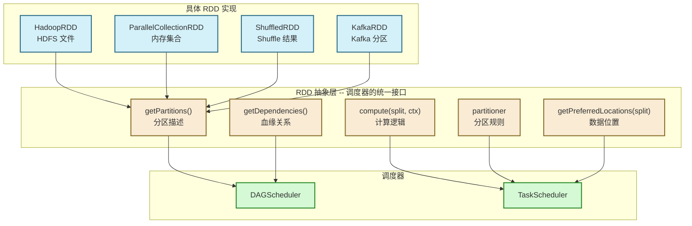
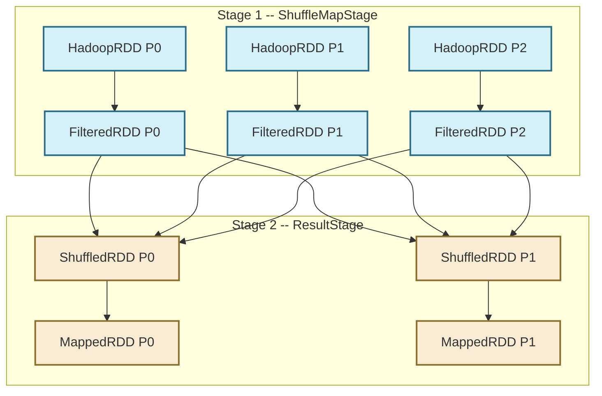

# 02 RDD 的五大核心属性：深入剖析分布式对象的灵魂接口

> [!abstract] 摘要
> 上一篇我们从哲学层面理解了 RDD 的设计动机：用粗粒度、不可变的操作换取轻量级的血缘容错。本文进入 RDD 的代码实现层：`org.apache.spark.rdd.RDD` 这个抽象类如何用五个核心方法将这套哲学落地？每个方法在整个执行链路中承担什么角色？不同子类如何实现这些方法？当你真正读懂这五个方法的设计意图和相互协作方式，你就能回答一个终极问题：**为什么 Spark 的调度器可以用统一的逻辑处理 HDFS 文件、Kafka 流、内存集合这些完全不同的数据源，且不需要为每种数据源单独写调度逻辑？**

---

## 第 1 章 接口化思维：为什么 RDD 是"逻辑描述"而非"物理容器"

理解 RDD 的五大属性，必须先理解 Spark 调度器面临的一个核心工程问题：**如何用统一的调度逻辑处理完全不同的数据源？**

HDFS 文件、Kafka 消息队列、内存中的 Scala 集合、数据库结果集——这些数据源的访问方式天差地别。如果为每种数据源都写一套调度逻辑，代码会极其臃肿，且每增加一种新数据源都要修改调度器核心代码，这是不可接受的。

Spark 的解法是经典的**面向接口编程**：定义一套所有数据集都必须回答的抽象问题，调度器只与这套抽象接口交互，完全不关心底层实现细节。

这套抽象问题就是五个核心方法/属性：

| 问题 | 对应方法/属性 | 调度器的使用方 |
| :--- | :--- | :--- |
| **你有多少分区？** | `getPartitions()` | DAGScheduler 生成 Task 列表 |
| **给你一个分区，怎么算出数据？** | `compute(split, ctx)` | Executor 执行 Task 时调用 |
| **你依赖哪些父 RDD？** | `getDependencies()` | DAGScheduler 划分 Stage |
| **你的 KV 数据按什么规则分区？** | `partitioner` | TaskScheduler 判断能否跳过 Shuffle |
| **这个分区的数据在哪台机器上？** | `getPreferredLocations(split)` | TaskScheduler 做本地化调度 |

**关键认知**：RDD 不存储数据，它存储的是"如何获取和计算数据"的完整描述。这就是为什么 RDD 是"逻辑视图"而非"物理容器"。
nini


---

## 第 2 章 属性一：Partitions（分区列表）——并行度的物理基础

### 2.1 Partition 是什么？为什么它"几乎没有内容"？

`getPartitions()` 返回 `Array[Partition]`。但当你打开 `org.apache.spark.Partition` 接口的定义，会发现它几乎什么都没有：

```scala
trait Partition extends Serializable {
  def index: Int  // 只有一个 index 方法
  def hashCode(): Int = index
  def equals(other: Any): Boolean = ...
}
```

这个设计看起来令人困惑——一个分区只有一个序号？数据呢？

这正是 RDD 设计精髓的体现：**分区对象本身不持有数据，它只是一个"定位符"**，告诉 `compute` 方法"你需要处理第几号分片"。具体这个分片的数据在哪里、怎么读取，由不同 RDD 子类自行决定。

以 `HadoopRDD` 为例，它的分区类是 `HadoopPartition`：

```scala
// HadoopRDD 的分区实现：持有的是 InputSplit 的引用，而非数据本身
private[spark] class HadoopPartition(rddId: Int, override val index: Int, s: InputSplit)
  extends Partition {
  val inputSplit = new SerializableWritable[InputSplit](s)
  // inputSplit 记录了"这个分片在 HDFS 上的位置和大小"，而非实际数据字节
}
```

`HadoopPartition` 持有的是 `InputSplit` 对象——一个描述"HDFS 上第几个 Block、从哪个偏移量读到哪个偏移量"的元数据对象。真正的数据字节流要到 `compute` 方法被调用时才会被读取。

### 2.2 分区数量如何决定？不同 RDD 的逻辑各有不同

| RDD 类型 | `getPartitions()` 的逻辑 | 分区数量决定因素 |
| :--- | :--- | :--- |
| `HadoopRDD` | 调用 `InputFormat.getSplits()` | HDFS Block 数量，默认 = 文件大小 / Block Size |
| `ParallelCollectionRDD` | 把集合均分成 n 份 | 用户指定，默认 = `sc.defaultParallelism`（集群总核数） |
| `ShuffledRDD` | 直接用 Partitioner 的 `numPartitions` | `reduceByKey`/`join` 时指定的分区数 |
| `FilteredRDD`/`MappedRDD` | 继承父 RDD 的分区列表 | 与父 RDD 完全相同 |
| `CoalescedRDD` | 将父 RDD 的 N 个分区合并为 M 个 | 用户通过 `coalesce(M)` 指定 |

**窄依赖算子（filter/map/flatMap）不改变分区数量**，这一设计值得深究。原因是：窄依赖保证了父子分区一一对应，如果重新分区，就需要数据重分布（Shuffle），就变成了宽依赖。因此，窄依赖算子天然继承父 RDD 的分区结构，这既保持了 Pipeline 的可能性，也避免了不必要的 Shuffle。

### 2.3 分区数与性能的非线性关系

分区数量是 Spark 调优中最重要的参数之一，但它与性能的关系并非"越多越好"：

**分区过少的问题：**
- 部分 CPU 核心空闲，集群利用率低
- 单个分区数据量过大，可能触发 Executor OOM

**分区过多的问题：**
- 每个分区对应一个 Task，Task 对象本身需要在 Driver 端内存中序列化和维护
- 若有 100 万个分区，Driver 端光维护 Task 元数据就会消耗大量内存
- 大量小 Task 的调度开销（网络 RPC、线程上下文切换）可能远超计算时间本身
- Shuffle 时大量小文件会给磁盘和网络带来大量随机 I/O

> [!warning] 生产调优经验
> **经验法则**：目标让每个 Task 执行时间在 100ms ~ 5s 之间，每个分区数据量在 128MB ~ 1GB 之间。
>
> - 数据倾斜时，不要简单增加总分区数，而应分析热点 Key 并针对性处理。
> - 对于 Shuffle 后的 Stage，分区数建议设置为集群总 CPU 核数的 2~4 倍。
> - 使用 `rdd.coalesce(n)` 减少分区时，优先使用 `coalesce` 而非 `repartition`，前者尽量避免 Shuffle。

---

## 第 3 章 属性二：Compute（计算函数）——流水线的物理驱动力

### 3.1 为什么返回 Iterator 而不是 Array？

`compute(split: Partition, context: TaskContext): Iterator[T]` 的签名看似普通，但返回 `Iterator[T]` 而非 `Array[T]` 或 `List[T]` 这个选择，是 Spark 能够高效处理大数据的核心秘密之一。

设想一个场景：一个分区包含 500MB 的原始日志数据，需要经过 `filter`（过滤出 ERROR 日志，假设只有 1%）再 `map`（提取字段）。

**如果 `compute` 返回 `Array[T]`：**
1. `HadoopRDD.compute` 读取 500MB 数据，在堆内存分配一个 500MB 的 `Array`
2. `FilteredRDD.compute` 接收这个 500MB Array，遍历后生成一个约 5MB 的新 Array（1% 的数据）
3. `MappedRDD.compute` 接收这个 5MB Array，生成另一个新 Array

高峰期堆内存占用：**500MB + 5MB + 结果 ≈ 505MB+**，且有大量中间对象需要 GC。

**如果 `compute` 返回 `Iterator[T]`（实际做法）：**
1. `HadoopRDD` 返回一个懒惰迭代器，指向磁盘文件，**不读取任何数据**
2. `FilteredRDD.compute` 包装父迭代器，每次 `next()` 调用时，从父迭代器拉一条、判断一条
3. `MappedRDD.compute` 再包装一层，每次 `next()` 调用时，从 FilteredRDD 迭代器拉一条、转换一条

整个流程中，**内存中同时只存在一条（或少数几条）记录**。高峰期堆内存占用：**接近零**（除了当前处理的那几条记录）。这就是"流水线计算"（Pipeline）的物理本质。

### 3.2 compute 的递归调用结构

多层 RDD 链的 `compute` 调用形成了一个**调用栈嵌套**结构，而非循环：

```scala
// 假设存在链: HadoopRDD -> FilteredRDD -> MappedRDD
// MappedRDD 的 compute 实现（简化）：
override def compute(split: Partition, ctx: TaskContext): Iterator[B] =
  firstParent[A].iterator(split, ctx).map(f)
  // firstParent[A].iterator 内部会调用 FilteredRDD.compute
  // FilteredRDD.compute 内部又会调用 HadoopRDD.compute
  // 形成三层嵌套的迭代器链

// RDD.iterator 是 compute 的入口，带缓存检查逻辑：
final def iterator(split: Partition, context: TaskContext): Iterator[T] = {
  if (storageLevel != StorageLevel.NONE) {
    // 若该 RDD 被 cache()，先查 BlockManager
    getOrCompute(split, context)
  } else {
    // 否则直接走 compute 路径（可能包含 checkpoint 检查）
    computeOrReadCheckpoint(split, context)
  }
}
```

当 Executor 最终调用 `mappedRDD.iterator(split, ctx)` 时，会触发一个 `next()` 调用链：
- `MappedRDD.iterator.next()` → 调用 `FilteredRDD.iterator.next()`
- `FilteredRDD.iterator.next()` → 调用 `HadoopRDD.iterator.next()`，读取一行数据
- 数据沿调用栈向上返回，经过 filter 判断，经过 map 变换，最终交给 Task 的汇聚逻辑

整个过程在同一个 JVM 调用栈中完成，数据在 CPU 寄存器和 L1/L2 缓存中流转，不产生任何堆内存对象分配（除了最终输出的结果对象）。这是 Spark 在 CPU 密集型场景下能接近理论峰值性能的原因。

### 3.3 compute 的缓存交互：iterator 方法的双路径

`RDD.iterator()` 是实际被调度器调用的入口（注意不是 `compute`），它包含一个关键的缓存检查逻辑：

- **已缓存路径**：若该 RDD 调用过 `cache()`，`iterator()` 会先查询 `BlockManager`。命中则直接从内存（或磁盘）返回，**整个上游 RDD 链的 compute 都不会被触发**。这是 `cache()` 能大幅提升迭代计算性能的根本原因。
- **未缓存路径**：调用 `computeOrReadCheckpoint()`，进一步检查是否有 Checkpoint，若有则从 Checkpoint 路径读取，否则走正常的递归 `compute` 路径。

---

## 第 4 章 属性三：Dependencies（依赖关系）——血缘与 Stage 划分的基础

### 4.1 Dependencies 承载的两大职责

`getDependencies()` 返回 `Seq[Dependency[_]]`，这个方法在整个系统中承担两个截然不同的职责：

**职责一：容错的"重建路径"**  
当某个分区的数据因节点故障丢失时，`DAGScheduler` 通过遍历 `dependencies` 向上追溯，找到可以重新计算该分区的最近起点，重新提交相关 Task。依赖链是血缘图的物理表示。

**职责二：Stage 划分的"切割依据"**  
`DAGScheduler` 在构建执行计划时，遍历 RDD 的依赖关系：遇到窄依赖则继续往上合并进同一个 Stage；遇到宽依赖（`ShuffleDependency`）则在此处切断，形成 Stage 边界。

### 4.2 窄依赖与宽依赖：两种截然不同的数据流模型

**窄依赖（NarrowDependency）的本质**：每个父分区的数据只流向**至多一个**子分区。

这意味着：
- 父子分区之间的数据交换完全在同一台机器的内存中进行（如果父 RDD 没有 Shuffle 的话）
- 每个分区的计算相互独立，可以并行执行，且失败只需重算自己，不影响其他分区
- 多个连续的窄依赖算子可以被 Pipeline 合并为一个 Task

窄依赖的两个子类：
- `OneToOneDependency`：父分区 $i$ → 子分区 $i$，一对一映射（`map`, `filter`, `flatMap`）
- `RangeDependency`：父分区 $[start, end)$ → 子分区 $i$（`union` 操作用于合并两个 RDD 的分区列表）

**宽依赖（ShuffleDependency）的本质**：一个父分区的数据可能被**多个**子分区所需要。

这意味着在父 Stage 的所有 Task 完成之前，子 Stage 的 Task 无法启动——这就是**同步屏障（Synchronization Barrier）**。这个屏障导致了：
- 宽依赖是 Stage 的边界
- 宽依赖触发 Shuffle：父侧写出 Shuffle 文件，子侧跨网络读取
- 任何一个父分区的 Task 失败，可能导致多个子 Task 需要重跑（因为多个子分区都依赖这个父分区）



### 4.3 ShuffleDependency 携带的额外信息

与窄依赖不同，`ShuffleDependency` 不只是记录"我依赖哪个父 RDD"，还必须携带：

```scala
class ShuffleDependency[K: ClassTag, V: ClassTag, C: ClassTag](
    @transient private val _rdd: RDD[_ <: Product2[K, V]],
    val partitioner: Partitioner,      // Key 的分区规则
    val serializer: Serializer,        // 序列化方式
    val keyOrdering: Option[Ordering[K]] = None,  // Key 的排序（可选）
    val aggregator: Option[Aggregator[K, V, C]] = None,  // Map 端聚合器（可选）
    val mapSideCombine: Boolean = false  // 是否开启 Map 端预聚合
) extends Dependency[Product2[K, V]] {
  val shuffleId: Int = _rdd.context.newShuffleId()  // 全局唯一的 Shuffle ID
}
```

`aggregator` 和 `mapSideCombine` 是 `reduceByKey` 性能优于 `groupByKey` 的关键所在：
- `groupByKey`：`mapSideCombine = false`，所有数据原样写入 Shuffle 文件
- `reduceByKey`：`mapSideCombine = true`，Map 端先对相同 Key 做本地聚合，大幅减少 Shuffle 数据量

---

## 第 5 章 属性四：Partitioner（分区器）——跳过 Shuffle 的关键信号

### 5.1 Partitioner 的核心合约

`partitioner: Option[Partitioner]` 是一个可选属性，只对 Key-Value 类型的 RDD 有意义。`Partitioner` 的核心接口只有两个方法：

```scala
abstract class Partitioner extends Serializable {
  def numPartitions: Int    // 这个 Partitioner 将数据分为多少个分区
  def getPartition(key: Any): Int  // 给定一个 Key，它应该进入哪个分区
}
```

### 5.2 HashPartitioner：最常用，但有一个经典陷阱

`HashPartitioner` 的实现非常简单：

```scala
class HashPartitioner(partitions: Int) extends Partitioner {
  def numPartitions: Int = partitions
  def getPartition(key: Any): Int = key match {
    case null => 0
    // 注意：这里使用的是 Utils.nonNegativeMod，而非简单的 hashCode % n
    // 原因：Java 的 hashCode 可能是负数，直接取模会得到负分区号
    case _    => Utils.nonNegativeMod(key.hashCode, numPartitions)
  }
}
```

**经典陷阱**：`Array` 类型的 hashCode 是基于对象引用（内存地址）的，两个内容相同的 `Array` 对象的 hashCode 几乎一定不同。所以如果你的 Key 是 `Array[Byte]`，用 `HashPartitioner` 会导致相同内容的 Key 被分配到不同分区，`groupByKey` 无法正常聚合。

### 5.3 RangePartitioner：有代价的有序性

`RangePartitioner` 通过**对 RDD 进行采样**来确定分区边界，使每个分区的数据量大致均匀，且分区之间全局有序（分区 0 的所有数据 < 分区 1 的所有数据 < ...）。

这个"全局有序"的性质使得 `sortByKey` 可以并行化：每个分区内部独立排序，分区之间已经有序，合并时只需要按分区序号依次读取即可，不需要全局归并排序。

**代价**：RangePartitioner 的构造本身需要对父 RDD 进行一次额外的 Action（采样），这意味着当你调用 `sortByKey` 时，Spark 实际上会触发两次计算：第一次采样确定分区边界，第二次才是真正的排序。

### 5.4 Partitioner 相等性：跳过 Shuffle 的关键

`Partitioner` 实现了 `equals()` 方法。**当两个 RDD 的 `partitioner` 相等时，Spark 会将对它们的 `join`/`cogroup` 操作视为窄依赖而非宽依赖**，从而完全跳过 Shuffle。

```scala
// 场景：两个 RDD 都已经按相同规则分区
val p = new HashPartitioner(100)
val rdd1 = someRDD.partitionBy(p)    // rdd1.partitioner = Some(HashPartitioner(100))
val rdd2 = anotherRDD.partitionBy(p) // rdd2.partitioner = Some(HashPartitioner(100))

// 此时 join 不会触发 Shuffle！
// 因为相同 Key 已经在同一分区，直接合并即可
val joined = rdd1.join(rdd2)
```

这是大数据 Join 场景最重要的性能优化手段之一——**预分区**。对于需要多次 Join 同一数据集的场景，提前用相同 Partitioner 分区一次，后续所有 Join 都无需 Shuffle。

---

## 第 6 章 属性五：Preferred Locations（优先位置）——数据局部性的实现

### 6.1 数据局部性：网络是最昂贵的资源

分布式计算中，网络带宽是最稀缺、最昂贵的资源。一块 SSD 的顺序读取带宽约 3-5 GB/s，而一个 10Gbps 网卡的实际吞吐量约 1 GB/s。在百台机器的集群中，如果每个 Task 都需要跨机器传输 512MB 数据，全集群的网络总带宽会迅速成为瓶颈。

Spark 从 Hadoop 继承的"数据局部性"优化哲学正是为了解决这个问题：**把计算任务发送到数据所在的节点执行，而不是把数据传输到计算节点**。这就是"移动计算而非移动数据"的工程含义。

### 6.2 getPreferredLocations 的实现差异

不同 RDD 子类的 `getPreferredLocations` 实现差异很大，体现了不同数据源的局部性语义：

| RDD 类型 | `getPreferredLocations` 的实现逻辑 |
| :--- | :--- |
| `HadoopRDD` | 调用 HDFS API 查询 Block 所在的 DataNode 列表（通常 3 副本，返回 3 个节点） |
| `ParallelCollectionRDD` | 返回空列表（内存数据无位置偏好） |
| `ShuffledRDD` | 返回空列表（Shuffle 数据分布到各节点，没有固定偏好） |
| `KafkaRDD` | 返回 Kafka Broker 节点（将 Task 发到持有对应 Partition 的 Broker 上） |
| `CachedRDD`（已 cache） | 返回持有该分区缓存的 Executor 所在节点（PROCESS_LOCAL） |

### 6.3 本地化等级的降级机制

`TaskScheduler` 在调度时维护了一套本地化等级，按优先级从高到低：

1. **PROCESS_LOCAL**：数据就在当前 Executor 的 BlockManager 里（已缓存的 RDD 分区）
2. **NODE_LOCAL**：数据在同一物理节点（HDFS DataNode 与 Executor 在同一机器）
3. **NO_PREF**：数据没有位置偏好（`ParallelCollectionRDD` 等）
4. **RACK_LOCAL**：数据在同一机架的另一台机器（需要机架感知配置）
5. **ANY**：任意节点

当集群繁忙时，可能没有空闲的 Executor 满足高级别本地性。Spark 的策略是**等待一段时间（locality wait）后降级**：先等待 `PROCESS_LOCAL`，超时后降级到 `NODE_LOCAL`，再超时后降级到 `ANY`。

这个等待时间（`spark.locality.wait`，默认 3s）是一个重要的调优参数：
- 等待时间过长：Task 等待时间长，整体 Stage 延迟上升
- 等待时间过短：大量 Task 以 `ANY` 级别运行，网络传输开销上升

> [!info] 何时调大 locality wait？
> 当你的作业是计算密集型（CPU 计算时间远大于 I/O 时间），且数据已经缓存在 Executor 内存中时，适当增大 locality wait 能显著提升 PROCESS_LOCAL 命中率，减少不必要的内存复制。
> 反之，若作业是 I/O 密集型（主要瓶颈在磁盘读取），且集群资源充足，locality wait 可以适当调小，优先让 Task 快速启动。

---

## 第 7 章 源码核心骨架：五大属性的协作全景

五大属性在 `RDD.scala` 中的完整架构如下：

```scala
abstract class RDD[T: ClassTag](
    @transient private var _sc: SparkContext,
    @transient private var deps: Seq[Dependency[_]]
  ) extends Serializable with Logging {

  // ===== 五大核心属性（子类必须实现前两个）=====

  // 属性1：分区列表（子类必须实现）
  protected def getPartitions: Array[Partition]

  // 属性2：计算逻辑（子类必须实现）
  def compute(split: Partition, context: TaskContext): Iterator[T]

  // 属性3：依赖关系（构造时传入，或子类重写）
  protected def getDependencies: Seq[Dependency[_]] = deps

  // 属性4：分区器（默认 None，KV 类型 RDD 会覆盖此属性）
  val partitioner: Option[Partitioner] = None

  // 属性5：优先位置（默认空，有本地性语义的子类会覆盖此方法）
  protected def getPreferredLocations(split: Partition): Seq[String] = Nil

  // ===== 对外暴露的封装方法 =====

  // 分区列表（带缓存，避免重复调用 getPartitions）
  final def partitions: Array[Partition] = {
    checkpointRDD.map(_.partitions).getOrElse {
      if (partitions_ == null) {
        partitions_ = getPartitions  // 惰性初始化，只调用一次
        partitions_.zipWithIndex.foreach { case (partition, index) =>
          require(partition.index == index, ...)
        }
      }
      partitions_
    }
  }

  // 迭代器入口（调度器通过此方法驱动计算）
  final def iterator(split: Partition, context: TaskContext): Iterator[T] = {
    if (storageLevel != StorageLevel.NONE) {
      getOrCompute(split, context)         // 缓存路径
    } else {
      computeOrReadCheckpoint(split, context)  // 计算路径
    }
  }
}
```

> [!note] 为什么 getPartitions 和 iterator 都有缓存机制？
> `getPartitions` 的结果被缓存在 `partitions_` 字段中，避免每次调用都重新查询 HDFS 元数据（这是一次 RPC 调用）。
> `iterator` 中的缓存检查使得被 `cache()` 的 RDD 在多次 Action 中都能命中内存而无需重算。
> 这两处缓存设计，体现了 Spark 对"避免重复计算"这一原则的一贯坚持。

---

## 第 8 章 总结：五大属性的完整协作视角

至此，我们可以用一段话完整描述 Spark 调度的工作原理：

> 当用户触发 Action 时，`DAGScheduler` 从末端 RDD 开始，通过 `getDependencies()` 向上遍历整个血缘 DAG，在每个 `ShuffleDependency` 处切割 Stage。对每个 Stage，通过 `getPartitions()` 生成 Task 列表，并通过 `getPreferredLocations()` 为每个 Task 标注期望节点。`TaskScheduler` 拿到这些 Task 后，结合集群资源状况和本地性偏好，将 Task 分发到最合适的 Executor。Executor 执行 Task 时，调用 `iterator(split, ctx)`，触发 `compute()` 的递归调用链，以 Pipeline 方式逐条处理数据。`partitioner` 则在需要 Shuffle 时，决定每条记录被路由到哪个下游分区。

这五大属性，正是调度器与执行器之间的完整"沟通协议"，也是 Spark 能够统一处理任意数据源的基础。

在 **[[03 算子转换逻辑：惰性求值与 DAG 构建的底层机制|下一篇文章]]** 中，我们将站在更高的视角，看这些 RDD 是如何通过 Transformation 算子串联成一张 DAG 的，以及惰性求值如何为整个执行计划的优化提供空间。

---

> [!note] 思考题
> 1. `HadoopRDD` 的 `getPreferredLocations` 返回的是 DataNode 的主机名，而 YARN 集群中的 Executor 是随机分配在某些 NodeManager 上的。如果 DataNode 和 NodeManager 部署在同一批机器上（混部），本地性优化才能生效。你的生产集群是这样部署的吗？如果 Spark 在非 YARN 集群（如 Kubernetes）上运行，HDFS 本地性优化会失效吗？
> 2. `ShuffleDependency` 中 `mapSideCombine` 参数决定了是否在 Map 端进行预聚合。为什么不是所有聚合操作都开启 Map 端预聚合？什么情况下开启 Map 端聚合反而会降低性能？
> 3. 如果你需要自定义一个 RDD（如接入某个自研存储系统），你需要实现哪几个方法？哪些是必须实现的，哪些是可选的？
