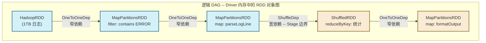
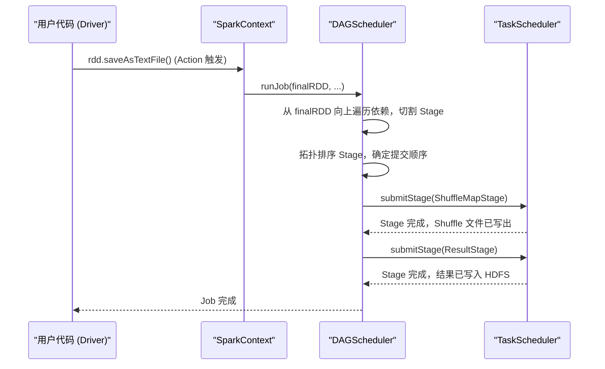
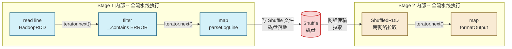

# 03 算子转换逻辑：惰性求值与 DAG 构建的底层机制

> [!abstract] 摘要
> 上一篇深入了 RDD 的五大核心属性，理解了 RDD 是"逻辑描述"而非"物理容器"。本文聚焦一个关键问题：当你写下 `rdd.filter(...).map(...).reduceByKey(...)` 这样一串代码时，Spark 内部究竟在做什么？为什么前两个调用"瞬间返回"而最后一个却触发了集群的全量计算？这不仅仅是一个"惰性求值"的技术概念问题，更涉及分布式计算引擎如何在"局部代码"与"全局最优执行计划"之间架起桥梁的深层设计哲学。本文将完整推导：Transformation 的本质是什么 → 惰性求值带来了哪些工程价值 → DAG 如何在内存中悄然成形 → Action 触发后 DAGScheduler 如何将 DAG 切分为可执行的 Stage → 流水线计算模型如何在物理层面消除中间开销。

---

## 第 1 章 一个被忽视的基本问题：算子调用究竟做了什么？

理解 Spark 算子的本质，需要先从一个看似简单的问题出发：**调用 `rdd.map(f)` 时，Spark 执行了什么操作？**

大多数初学者的直觉答案是"对 rdd 里的每条数据执行 f"。但这是错误的。正确答案是：**调用 `map` 只是在 Driver JVM 堆内存里创建了一个新的 `MapPartitionsRDD` 对象，并将 f 作为字段保存在这个对象中，整个过程在毫秒级内完成，不涉及任何数据读取或计算。**

让我们看一段简化的源码来验证这一点：

```scala
// RDD 基类中 map 的实现（简化自 Spark 源码）
def map[U: ClassTag](f: T => U): RDD[U] = withScope {
  val cleanF = sc.clean(f)  // 序列化闭包，确保可被发送到远端 Executor
  new MapPartitionsRDD[U, T](this, (_, _, iter) => iter.map(cleanF))
  // 仅仅是 new 了一个新对象，传入 this（父 RDD）和用户函数
  // 没有任何数据被读取或处理
}
```

这段代码做了两件事：
1. 通过 `sc.clean(f)` 序列化用户函数（捕获闭包，确保可以被发送到远端 Executor）
2. `new MapPartitionsRDD(...)` 创建一个新 RDD 对象，构造函数参数包含父 RDD（即 `this`）和计算函数

**新 RDD 对象的两个关键字段：**
- `dependencies`：指向父 RDD（`this`），这就是血缘链的物理连接方式
- `f`：用户传入的转换函数，被存储在闭包中，等待 Executor 执行时调用

这个"创建对象"而非"执行计算"的行为，就是**惰性求值（Lazy Evaluation）的物理本质：Transformation 算子构建的是一张由 RDD 对象构成的引用图，而非执行任何实际计算。

### 1.1 sc.clean(f) 的作用：闭包清理为什么必须存在？

`sc.clean(f)` 这个调用值得展开说明，因为它是 Spark 中一类常见运行时报错（`Task not serializable`）的根源。

用户在编写 `map(f)` 时，`f` 往往是一个 Lambda 表达式，而 Lambda 表达式会隐式捕获其所在作用域的变量（即"闭包"）。当这个闭包被发送到远端 Executor 执行时，整个闭包对象需要通过 Java 序列化传输。

问题在于：如果被捕获的变量（或其所在对象）没有实现 `Serializable` 接口，序列化就会失败，抛出 `Task not serializable` 异常。`sc.clean(f)` 的工作就是在 Driver 端**提前检测**这个问题，并尝试通过静态分析去除不必要的外层引用（"清理"闭包），让其可序列化。

> [!warning] 生产常见错误
> ```scala
> class MyProcessor {
>   val threshold = 100
>   def process(rdd: RDD[Int]): RDD[Int] = {
>     rdd.filter(_ > threshold)  // 看似只捕获了 threshold
>     // 实际上 Lambda 捕获了 this（MyProcessor 实例）
>     // 若 MyProcessor 不可序列化，则抛出 Task not serializable
>   }
> }
> ```
> **修复方式**：将 `threshold` 提取为本地变量 `val t = threshold`，再在 Lambda 中使用 `t`，这样闭包只捕获一个 `Int`，不再持有 `this` 引用。

---

## 第 2 章 Transformation 的分类学：数据流拓扑的两种形态

### 2.1 按依赖类型分类：窄变换 vs 宽变换

从调度器的视角，Transformation 最重要的分类维度不是"做什么"，而是"**会不会产生 Shuffle**"。

**窄变换（Narrow Transformation）**：每条输入记录只影响至多一个输出分区，不需要跨节点数据移动。

| 算子 | 依赖类型 | 说明 |
| :--- | :--- | :--- |
| `map(f)` | OneToOneDependency | 一对一，分区结构不变 |
| `filter(f)` | OneToOneDependency | 过滤，分区结构不变 |
| `flatMap(f)` | OneToOneDependency | 一变多，分区结构不变 |
| `mapPartitions(f)` | OneToOneDependency | 分区级批处理，分区结构不变 |
| `union(rdd2)` | RangeDependency | 合并分区列表，无 Shuffle |
| `coalesce(n, shuffle=false)` | NarrowDependency | 合并分区，不触发 Shuffle |

**宽变换（Wide Transformation）**：一条输入记录可能影响多个输出分区，必须经过 Shuffle（数据在节点间重分布）。

| 算子 | 说明 |
| :--- | :--- |
| `groupByKey()` | 按 Key 分组，全量数据 Shuffle |
| `reduceByKey(f)` | 按 Key 聚合，Map 端可预聚合 |
| `sortByKey()` | 全局排序，需 RangePartitioner |
| `join(rdd2)` | 两表 Join，若分区规则不同则 Shuffle |
| `repartition(n)` | 重分区，强制 Shuffle |

### 2.2 按作用粒度分类：元素级 vs 分区级

**元素级算子**（`map`, `filter`, `flatMap`）：函数作用于每条记录，是最常用的算子。其 `compute` 实现是对父迭代器的直接包装。

**分区级算子**（`mapPartitions`, `mapPartitionsWithIndex`）：函数接收整个分区的 `Iterator`，可以在函数内部维护分区级状态。

`mapPartitions` 是一个容易被低估的重要算子。考虑这个场景：将每条记录写入数据库。

```scala
// 低效写法：每条记录建立一次 JDBC 连接（N 条记录 = N 次连接）
rdd.map { record =>
  val conn = DriverManager.getConnection(url)
  conn.execute(record)
  conn.close()
}

// 高效写法：每个分区建立一次连接（N 条记录 = 1 次连接）
rdd.mapPartitions { iter =>
  val conn = DriverManager.getConnection(url)
  val result = iter.map { record =>
    conn.execute(record)
    record
  }
  conn.close()
  result
}
```

这种"资源在分区级别初始化和释放"的模式，是 Spark 大量生产场景中必须掌握的基础技巧。

### 2.3 有状态 vs 无状态 Transformation

**无状态 Transformation**：每条记录的处理结果只取决于该记录本身，与其他记录无关（`map`, `filter`）。这类算子天然适合并行化，且实现简单。

**有状态 Transformation**：记录的处理结果取决于同一分区或跨分区的其他记录（`sortByKey`, `groupByKey`, `distinct`）。这类算子通常需要 Shuffle，或者在分区内维护累积状态。

理解这一分类，能帮助你在调优时判断：**一个算子的性能瓶颈是 CPU 计算（无状态）还是 I/O 和内存（有状态）？**

---

## 第 3 章 惰性求值的工程价值：为什么推迟执行是更聪明的选择

### 3.1 即时执行模式（Eager Evaluation）的三个致命缺陷

假设有如下代码：

```scala
val lines = sc.textFile("hdfs://huge-log-1TB.txt")   // 1TB 日志
val errors = lines.filter(_.contains("ERROR"))         // 约 10GB（1%）
val parsed = errors.map(parseLogLine)                  // 仍约 10GB
val grouped = parsed.groupBy(_.hostname)               // Shuffle
grouped.saveAsTextFile("hdfs://output/")
```

如果 Spark 采用**即时执行**模式，每个 Transformation 调用立即触发计算：

**缺陷一：无效的中间数据物化**
- `filter` 完成后，10GB 中间结果必须存储（内存或磁盘），等待 `map` 读取
- `map` 完成后，再次生成 10GB 中间结果，等待 `groupBy` 读取
- 每个算子之间产生一次完整的数据写-读往返，放大了 I/O 成本

**缺陷二：调度器无法跨算子优化**
- 执行 `filter` 时，调度器不知道后面还有 `map`，无法将两者合并为一个 Task
- 每个算子都需要独立的调度开销（Task 序列化、RPC、线程上下文切换）

**缺陷三：无法实现短路（Short-Circuit）**
- 若用户调用 `result.take(10)`，即时执行模式仍然会处理全部 1TB 数据，生成完整结果后再取前 10 条
- 惰性模式下，Spark 知道只需要 10 条，可以在满足条件后立即停止各分区的计算

### 3.2 惰性求值的三大工程收益

**收益一：算子融合（Operator Fusion），消除中间物化**

惰性求值让调度器在真正执行前看到完整的 Transformation 链。`filter` 和 `map` 都是窄依赖，可以被合并为一个 Task 中的 Iterator 链：

```
磁盘 → [HadoopRDD.compute: 读一条] → [FilteredRDD.compute: 判断] → [MappedRDD.compute: 转换] → 结果
```

整个过程在单次数据扫描中完成，没有任何中间数据物化。

**收益二：全局优化视野**

调度器可以在执行前分析整个 DAG，做出只有全局视野才能做的优化决策：
- 发现两个相邻的 `filter` 可以合并为一个
- 发现某个 RDD 被多次使用（多个 Action 或多路 DAG 引用），主动建议 `cache()`
- 在 SQL/DataFrame 层（通过 [[Catalyst 优化器]]），实现谓词下推、列裁剪等

**收益三：容错模型的基础**

因为 Transformation 只记录"如何从父 RDD 算出子 RDD"，而不物化中间数据，整个 Lineage 图就是完整的重算路径。当某个 Executor 故障时，调度器只需从血缘图中找到最近的起点，重新提交相关 Task，不需要任何全局快照（这与 [[Hadoop MapReduce]] 的容错机制形成对比：MapReduce 每个 Step 的输出都写入 HDFS，容错靠重跑 Step，而非血缘重算）。

### 3.3 惰性求值的代价：调试难度上升

惰性求值也带来了一个实际问题：**错误的栈轨迹难以对应到用户代码的原始位置**。

当一个 `NullPointerException` 在某个 Executor 的 `map` 函数中发生时，异常堆栈显示的是 Executor 端的执行代码，而不是用户在 Driver 端写 `rdd.map(...)` 的那一行。这导致调试 Spark 作业往往比调试普通程序困难得多。

> [!info] 调试技巧
> - 在开发阶段可以在关键 Transformation 后调用 `.take(1)` 或 `.count()` 来"物化"中间结果，将惰性链路切断，快速定位问题所在的算子。
> - 使用 `mapPartitions` 时，在函数内部添加 `try-catch` 并打印详细日志，比默认异常信息有用得多。
> - Spark UI 的 "Stage DAG Visualization" 可以直观看到 DAG 结构和每个 Stage 的执行时间。

---

## 第 4 章 DAG 的成形：从 Scala 代码到内存中的图结构

### 4.1 DAG 是如何在内存中"悄然构建"的？

DAG（Directed Acyclic Graph，有向无环图）不是由某个显式的"构建器"创建的，它是 Transformation 算子链的**自然产物**。每次调用 Transformation，就在内存中增加一个 RDD 节点和一条依赖边。

```scala
val sc = new SparkContext(...)

val rdd0 = sc.textFile("hdfs://data.txt")
// 内存中：RDD节点 [HadoopRDD#0]

val rdd1 = rdd0.filter(_.contains("ERROR"))
// 内存中：[HadoopRDD#0] --OneToOneDep--> [MapPartitionsRDD#1]

val rdd2 = rdd1.map(parseLogLine)
// 内存中：[HadoopRDD#0] --> [MapPartitionsRDD#1] --> [MapPartitionsRDD#2]

val rdd3 = rdd2.reduceByKey(_ + _)
// 内存中：...#2 --ShuffleDep--> [ShuffledRDD#3]

val rdd4 = rdd3.map(formatOutput)
// 内存中：...#3 --> [MapPartitionsRDD#4]
```

整个过程在 Driver JVM 堆内存中完成，涉及的只是普通的 Scala 对象引用。DAG 的"图"结构由 RDD 对象之间的 `dependencies` 引用链构成。

### 4.2 DAG 的拓扑结构：为什么必须是"无环"的？

"有向无环图"中"无环"这个约束不是数学上的任意选择，而是有其工程必然性。

**如果 DAG 中存在环路**：假设 RDD A 依赖 RDD B，RDD B 又依赖 RDD A（循环依赖）。当 A 的某个分区需要重算（容错触发），调度器向上追溯依赖，发现需要 B 的某个分区，进而发现需要 A 的某个分区……陷入无限递归，容错机制彻底失效。

**"有向"保证了计算方向的单一性**：数据只从源头（如 HDFS 文件对应的 HadoopRDD）流向最终结果（Action 作用的 RDD），不会回流。这使得 Stage 的拓扑排序（先执行哪个 Stage、后执行哪个 Stage）有唯一确定的答案。



### 4.3 DAGScheduler 如何将逻辑 DAG 切分为物理 Stage？

当 Action 被调用时（如 `saveAsTextFile`），`SparkContext.runJob()` 被触发，最终调用 `DAGScheduler.handleJobSubmitted()`。DAGScheduler 执行以下关键步骤：

**步骤一：从末端 RDD 向上递归遍历依赖**

DAGScheduler 从 Action 作用的末端 RDD 出发，沿 `getDependencies()` 链向上逐层遍历，同时判断每条依赖边的类型：
- 遇到 `NarrowDependency`：继续向上，将上层 RDD 并入当前 Stage
- 遇到 `ShuffleDependency`：**在此处切割**，为上层 RDD 创建一个新的 Stage（`ShuffleMapStage`），当前 Stage 标记为依赖该 ShuffleMapStage 的输出

**步骤二：构建 Stage 依赖图（Stage DAG）**

切割完成后，原始的 RDD DAG 被转化为一个 Stage 级别的 DAG：
- **ShuffleMapStage**：不是最终 Stage，其输出数据需要被后续 Stage 通过 Shuffle 读取
- **ResultStage**：包含 Action 的最终 Stage，其输出直接返回 Driver 或写入外部存储

**步骤三：拓扑排序，按依赖顺序提交 Stage**

DAGScheduler 对 Stage DAG 进行拓扑排序，按顺序提交：无依赖的 Stage 先提交（通常是读取原始数据的 Stage），有依赖的 Stage 等待所有依赖 Stage 完成后再提交。



---

## 第 5 章 物理执行的基石：流水线计算模型（Pipelining）

### 5.1 MapReduce 的痛点：强制物化的中间结果

理解 Spark 流水线的价值，最好的对比对象是 [[Hadoop MapReduce]]。

MapReduce 的编程模型天然强制了"Map 全部完成 → Shuffle → Reduce 全部完成"的同步屏障。即使你的逻辑只是 `filter + map`（两个窄依赖操作），用 MapReduce 实现时：
1. Map 阶段执行 `filter`，结果写入 HDFS（临时目录）
2. Reduce 阶段读取 HDFS 临时数据，执行 `map`

这个写-读往返（Write-Read Roundtrip）产生了两次完整的磁盘 I/O。如果你有 10 个这样的 `filter + map` 步骤，就产生了 20 次磁盘 I/O，每次都是全量数据。这正是 Hadoop 在迭代计算（机器学习算法）场景下性能极差的根本原因。

### 5.2 Spark 的解法：Iterator 链构成的流水线

Spark 通过 Iterator 嵌套组合，将多个窄依赖算子的 `compute` 调用链接成一条流水线。数据在这条流水线中"流过"，每条记录只被处理一次，不产生任何中间存储。

**流水线的物理实现**：

```scala
// 假设 DAG: HadoopRDD -> FilterRDD -> MapRDD
// Task 执行时，实际调用的是末端 RDD 的 iterator：

// MapRDD.compute 返回：
iter_map = iter_filter.map(parseLogLine)

// iter_filter 是 FilterRDD.compute 返回的：
iter_filter = iter_hadoop.filter(_.contains("ERROR"))

// iter_hadoop 是 HadoopRDD.compute 返回的：
iter_hadoop = new HadoopLineIterator(inputSplit)  // 指向磁盘文件，按需读取

// 驱动力：Task 的汇聚逻辑不断调用 iter_map.next()
// 每次 next() 触发链式调用：
//   iter_map.next()
//     -> iter_filter.next()（循环直到找到满足条件的记录）
//       -> iter_hadoop.next()（从磁盘读取一行）
```

**关键特性**：
- 数据以"行"为单位在 CPU 缓存层级流转，不产生任何分区级别的中间对象
- 内存中同时只有极少数记录（当前处理的那几行）
- 所有窄依赖算子合并为**一个 Task**，享受单线程执行的局部性优势

### 5.3 流水线的边界：宽依赖（Shuffle）处的同步屏障

流水线不能跨越 Shuffle 边界。原因是：Shuffle 要求上游所有分区的数据都写出到 Shuffle 文件后，下游分区才能开始读取（否则读到的数据是不完整的）。

这个"所有上游分区完成后下游才能开始"的等待，就是**同步屏障（Synchronization Barrier）**，也是 Stage 边界的物理含义。

Stage 内部：全流水线，无中间物化，内存压力极低。  
Stage 之间：强制同步，Shuffle 数据写入本地磁盘（MapOutputTracker 追踪位置），下游 Stage 通过网络拉取。



### 5.4 流水线的性能量化：与 MapReduce 的对比

以一个典型的 ETL 作业为例：1TB 数据，经过 3 次 filter + map（全窄依赖），最后 reduceByKey：

| 指标 | MapReduce 实现 | Spark 实现 |
| :--- | :--- | :--- |
| 磁盘 I/O 次数（前 3 步） | 6 次（每步写+读） | 1 次（只读原始数据） |
| 内存峰值占用 | ~1 个分区数据大小 × 副本数 | ~当前处理记录大小（接近 0） |
| JVM GC 压力 | 高（大量中间对象） | 极低（几乎无中间对象） |
| 容错代价 | 重跑整个 Step（最差情况重读 HDFS） | 重算单个分区（最近 Shuffle 或源头） |

这张对比表解释了为什么在迭代型机器学习算法（如 K-Means、PageRank）上，Spark 能比 MapReduce 快 10x ~ 100x：不是因为 Spark 的 CPU 更快，而是因为 Spark 消除了绝大多数不必要的磁盘 I/O 和内存对象创建。

---

## 第 6 章 Action 触发：从 RDD 图到 JobSubmitted 事件

### 6.1 Action 的本质：消费者驱动的"拉取"

所有 Action（`count`, `collect`, `saveAsTextFile`, `take`, `foreach`）的共同本质是：它们是数据的**最终消费者**，通过"拉取"操作驱动整个 Iterator 链的执行。

```scala
// count() 的简化实现：
def count(): Long = sc.runJob(this, Utils.getIteratorSize _).sum
// 对每个分区提交一个 Task，Task 执行：
//   Utils.getIteratorSize(iter) = { var cnt = 0L; while(iter.hasNext) { iter.next(); cnt += 1 }; cnt }
// 这个 while 循环就是"拉取"驱动力，不断调用 next() 驱动整个 Iterator 链
```

不同 Action 的差异在于对分区数据的**汇聚方式**不同：
- `count()`：对每个分区统计数量，然后在 Driver 端求和
- `collect()`：将每个分区的全部数据拉到 Driver 端内存（注意：数据量大时可能导致 Driver OOM）
- `take(n)`：只从部分分区获取数据，满足 n 条后停止（短路优化）
- `saveAsTextFile(path)`：将每个分区的数据写入 HDFS（每个分区对应一个输出文件）
- `foreach(f)`：在 Executor 端对每条记录执行 f，结果不返回 Driver

### 6.2 runJob 的调用链

```
rdd.count()
  → SparkContext.runJob(rdd, func)
    → DAGScheduler.runJob(rdd, func, partitions, ...)
      → DAGScheduler.submitJob(rdd, func, ...)
        → eventProcessLoop.post(JobSubmitted(...))  // 投递事件到事件队列
          → DAGScheduler.handleJobSubmitted(...)    // 事件处理（异步）
            → createResultStage(...)               // 创建 ResultStage
              → getOrCreateShuffleMapStage(...)    // 递归创建上游 ShuffleMapStage
            → submitStage(resultStage)
```

`eventProcessLoop.post(JobSubmitted(...))` 这一步值得注意：DAGScheduler 内部使用**事件驱动架构**（Event Loop），Job 提交是通过投递事件消息实现的，而非直接函数调用。这使得 DAGScheduler 可以在单线程中顺序处理所有调度事件，避免并发问题，同时保持对多个并发 Job 的管理能力。

---

## 第 7 章 常见模式的 DAG 分析

### 7.1 多次 Action 与 cache() 的关系

```scala
val expensiveRDD = sc.textFile("hdfs://huge.txt")
  .filter(isValid)
  .map(expensiveTransform)
  .cache()  // 标记为需要缓存

val count = expensiveRDD.count()    // Action 1：触发计算，结果缓存到内存
val sample = expensiveRDD.take(10)  // Action 2：直接从内存读取，不重算
```

如果没有 `cache()`，Action 2 会重新触发从 HDFS 读取并执行 `filter + map` 的全量计算。`cache()` 的本质是将 RDD 的 `storageLevel` 设置为非 `NONE`（默认 `MEMORY_AND_DISK`），使得 `RDD.iterator()` 方法在第一次计算后将结果存入 `BlockManager`，后续调用直接从 `BlockManager` 读取。

### 7.2 DAG 的分叉与 Union

```scala
val rdd1 = sc.textFile("hdfs://logs-2024.txt").filter(isError)
val rdd2 = sc.textFile("hdfs://logs-2025.txt").filter(isError)
val combined = rdd1.union(rdd2)  // 两个独立 DAG 在此汇合
combined.map(parseError).saveAsTextFile("hdfs://output/")
```

`union` 创建的 `UnionRDD` 持有两个父 RDD 的引用，使用 `RangeDependency`（窄依赖）。DAG 在此处形成"菱形"结构，但不触发 Shuffle——`union` 只是将两个 RDD 的分区列表拼接在一起（rdd1 的分区 + rdd2 的分区），Task 仍然各自独立执行。

---

## 第 8 章 总结

本文从"调用 map 究竟做了什么"这一基础问题出发，逐层推导出 Spark 算子设计的完整逻辑：

- **Transformation 的本质**：在 Driver 内存中创建 RDD 对象，构建血缘引用链，不触发任何计算
- **惰性求值的价值**：赋予调度器全局视野，实现算子融合、短路优化，并作为血缘容错的基础
- **DAG 的构建方式**：Transformation 调用链的自然产物，无环性保证容错路径的收敛性
- **Stage 划分的机制**：DAGScheduler 沿依赖链向上遍历，在 ShuffleDependency 处切割，形成 Stage DAG
- **流水线计算的物理实现**：Iterator 嵌套组合，单次扫描完成多个窄依赖算子，消除中间物化
- **Action 的驱动作用**：作为最终消费者，通过 while 循环驱动 Iterator 链执行，触发 runJob 调用链

在 **[[04 依赖关系的本质：宽依赖与窄依赖的结构定义与性能边界|下一篇文章]]** 中，我们将把本文提到的"宽依赖是 Stage 边界"这一结论深入展开：DAGScheduler 具体如何识别和处理宽依赖？Shuffle 的数据流动过程是怎样的？宽依赖对容错代价有何影响？

---

> [!note] 思考题
> 1. `rdd.map(f1).filter(f2).map(f3).count()` 中，Spark 执行了几次磁盘读取？生成了几个 RDD 对象？如果改成 `rdd.map(f1).cache().filter(f2).map(f3).count()` 再调用一次 `count()`，第二次 `count()` 还会读磁盘吗？
> 2. 为什么 `collect()` 可能导致 Driver OOM，而 `foreach(f)` 不会？两者的 DAG 结构有什么本质区别？
> 3. 在迭代式机器学习算法（如 K-Means 迭代 100 次）中，如果不 `cache()` 中间数据集，每次迭代都从 HDFS 重新读取，会产生什么性能问题？`cache()` 如何打破这个瓶颈？
