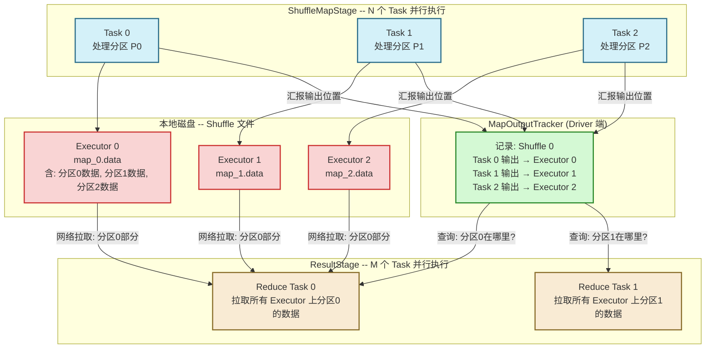
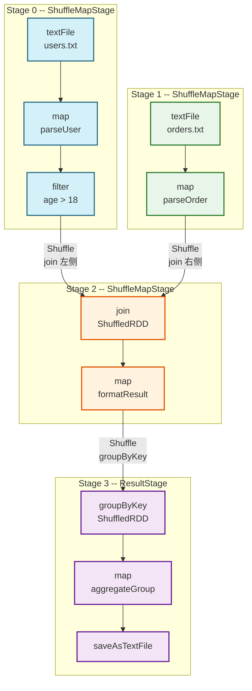

# 04 依赖关系的本质：宽依赖与窄依赖的结构定义与性能边界

> [!abstract] 摘要
> 上一篇推导了惰性求值如何让 DAGScheduler 获得"全局视野"，并在 ShuffleDependency 处切割 Stage。本文进入依赖关系本身的深层分析：窄依赖与宽依赖的区分标准究竟是什么？这个标准背后的工程逻辑是什么？ShuffleDependency 在源码层面携带了哪些信息？Stage 切割算法的完整逻辑是怎样的？宽依赖对容错代价的影响为何比窄依赖大得多？以及，在生产实践中如何利用对依赖关系的理解来消除不必要的 Shuffle。

---

## 第 1 章 依赖分类的核心标准：数据分区的流向

### 1.1 一个直觉性问题：父分区的数据"归谁所有"？

理解窄依赖与宽依赖的本质区分，最好从一个直觉性问题出发：**一个父 RDD 分区的数据，最终会流向几个子 RDD 分区？**

- **如果只流向一个子分区**：这个父分区的数据是"专属"的，子分区和父分区可以组成一个独立的计算单元（Task），在单台机器上执行，不需要等待其他父分区——这就是**窄依赖**。

- **如果可能流向多个子分区**：这个父分区的数据需要被"拆分"后发送到不同节点——这就是**宽依赖**，必须触发 Shuffle。

这个标准可以用形式化的方式表达：设父 RDD 有 $N$ 个分区 $P_0, P_1, ..., P_{N-1}$，子 RDD 有 $M$ 个分区 $C_0, C_1, ..., C_{M-1}$。

- **窄依赖**：对任意父分区 $P_i$，存在至多一个子分区 $C_j$ 使用 $P_i$ 的数据。（每个父分区最多被一个子分区使用）
- **宽依赖**：存在某个父分区 $P_i$，有多个子分区 $C_j, C_k, ...$ 都需要 $P_i$ 的部分数据。（父分区被多个子分区瓜分）

注意：窄依赖的定义允许多个父分区对应一个子分区（如 `union`，多对一），但不允许一个父分区对应多个子分区。宽依赖则恰恰是"一个父分区对应多个子分区"的情形。

### 1.2 从代码层面理解依赖分类

Spark 源码中，依赖类型的类层次结构如下：

```
Dependency[T]
├── NarrowDependency[T]          (窄依赖基类)
│   ├── OneToOneDependency[T]    (一对一，map/filter/flatMap)
│   └── RangeDependency[T]       (范围，union)
└── ShuffleDependency[K, V, C]   (宽依赖/Shuffle依赖)
```

窄依赖基类 `NarrowDependency` 定义了一个抽象方法：

```scala
abstract class NarrowDependency[T](_rdd: RDD[T]) extends Dependency[T] {
  // 给定子分区序号，返回它依赖的所有父分区序号
  def getParents(partitionId: Int): Seq[Int]
}
```

这个方法的签名揭示了窄依赖的关键性质：**给定一个子分区，可以精确地列举出它依赖的父分区集合**。这种"可预知性"使得调度器无需任何全局通信，就能为每个 Task 独立确定它需要的数据范围。

`OneToOneDependency` 的实现极其简单：

```scala
class OneToOneDependency[T](rdd: RDD[T]) extends NarrowDependency[T](rdd) {
  override def getParents(partitionId: Int): List[Int] = List(partitionId)
  // 子分区 i 只依赖父分区 i，无需任何计算
}
```

`RangeDependency`（用于 `union`）稍复杂：

```scala
class RangeDependency[T](rdd: RDD[T], inStart: Int, outStart: Int, length: Int)
    extends NarrowDependency[T](rdd) {
  override def getParents(partitionId: Int): List[Int] = {
    // 子分区序号 partitionId 在 [outStart, outStart+length) 范围内
    // 对应父分区序号 partitionId - outStart + inStart
    if (partitionId >= outStart && partitionId < outStart + length) {
      List(partitionId - outStart + inStart)
    } else {
      Nil
    }
  }
}
```

**宽依赖（ShuffleDependency）则没有对应的 `getParents` 方法**——因为在 Shuffle 之前，你无法预知某个子分区需要哪些父分区的哪些记录（这取决于每条记录的 Key 和 Partitioner 的映射关系，只有实际执行时才能确定）。

---

## 第 2 章 窄依赖深析：流水线、独立性与局部容错

### 2.1 OneToOneDependency：完美的计算局部性

`OneToOneDependency` 是 Spark 中最理想的依赖形式。它保证了：

**计算完全本地化**：子分区 $C_i$ 只需要父分区 $P_i$ 的数据，而 $P_i$ 的数据就在产生它的那台 Executor 的内存或磁盘上。只要 $C_i$ 被调度到与 $P_i$ 相同的机器（通过 `getPreferredLocations` 实现），整个计算链路完全本地化，零网络传输。

**Task 之间完全独立**：处理 $C_0$ 的 Task 和处理 $C_1$ 的 Task 没有任何依赖关系，可以真正并行。一个 Task 失败不影响其他 Task，也不需要重算其他分区。

**Pipeline 优化的基础**：多个连续的 `OneToOneDependency` 算子（如 `filter → map → flatMap`）可以被合并进同一个 Task 的 Iterator 链。每条记录在 JVM 调用栈中完成全部变换，不产生任何中间数据物化。

### 2.2 RangeDependency：Union 的实现原理

`union(rdd2)` 是 Spark 中唯一使用 `RangeDependency` 的核心算子。它的行为是：**将两个 RDD 的分区列表直接拼接**，而不触发任何数据移动。

```
rdd1: [P0, P1, P2]          (3个分区)
rdd2: [P0, P1]              (2个分区)
union: [P0, P1, P2, P3, P4] (5个分区)

分区映射关系：
- union.P0 → rdd1.P0 (RangeDependency: inStart=0, outStart=0, length=3)
- union.P1 → rdd1.P1
- union.P2 → rdd1.P2
- union.P3 → rdd2.P0 (RangeDependency: inStart=0, outStart=3, length=2)
- union.P4 → rdd2.P1
```

`union` 是窄依赖，不触发 Shuffle，这意味着你可以用 `union` 将多个数据源合并，而不产生任何额外的网络开销。每个 Task 独立处理其对应的原始分区数据。

> [!warning] union 的常见误用
> 很多开发者认为 `union` 后数据是"混合均匀"的，实际上 `union` 只是分区列表的拼接。如果 rdd1 有数据倾斜（某些分区特别大），union 后的结果同样存在倾斜，且没有任何自动均衡。如果需要均衡分布，应在 `union` 后接 `repartition(n)`（但这会触发 Shuffle）。

### 2.3 窄依赖的容错代价：精确的分区级重算

当窄依赖 Stage 中的某个 Task 失败时（Executor 崩溃、节点下线），调度器需要重算失败的分区。由于窄依赖的 `getParents` 可以精确给出依赖的父分区列表，重算路径是**确定且最小的**：

```
失败分区: MappedRDD.P3

重算路径（沿血缘向上追溯）:
MappedRDD.P3
  ← 依赖 FilteredRDD.P3 (OneToOneDependency)
    ← 依赖 HadoopRDD.P3 (OneToOneDependency)
      ← 从 HDFS Block 3 重新读取

需要重跑的 Task 数: 1个
影响范围: 仅 P3，其他分区完全不受影响
```

这种"**精确的分区级容错**"是窄依赖最重要的工程价值之一——失败代价小，恢复快，不影响其他正在运行的 Task。

---

## 第 3 章 宽依赖（ShuffleDependency）深析：Shuffle 的完整机制

### 3.1 ShuffleDependency 携带的信息远超依赖关系本身

`ShuffleDependency` 不只是一个"我依赖这个 RDD"的标记，它携带了执行 Shuffle 所需的全部元数据：

```scala
class ShuffleDependency[K: ClassTag, V: ClassTag, C: ClassTag](
    @transient private val _rdd: RDD[_ <: Product2[K, V]],
    val partitioner: Partitioner,       // 决定每条 KV 记录路由到哪个下游分区
    val serializer: Serializer = ...,   // 序列化方式（默认 Java 序列化，生产建议 Kryo）
    val keyOrdering: Option[Ordering[K]] = None,  // Key 排序（sortByKey 时设置）
    val aggregator: Option[Aggregator[K, V, C]] = None,  // 聚合器（reduceByKey 时设置）
    val mapSideCombine: Boolean = false  // 是否开启 Map 端预聚合
) extends Dependency[Product2[K, V]] {
  // 全局唯一的 Shuffle ID，用于 MapOutputTracker 追踪 Shuffle 输出位置
  val shuffleId: Int = _rdd.context.newShuffleId()
  // 将 ShuffleDependency 注册到 ShuffleManager，申请 Shuffle 句柄
  val shuffleHandle: ShuffleHandle = _rdd.context.env.shuffleManager
    .registerShuffle(shuffleId, this)
}
```

这些字段共同决定了 Shuffle 的行为模式：

**`partitioner`（必须）**：决定 Shuffle 的"分流规则"。每条 `(K, V)` 记录调用 `partitioner.getPartition(key)`，得到目标下游分区序号。所有相同 Key 的记录必须进入同一个分区，这是 `groupByKey`/`reduceByKey` 语义正确性的基础。

**`aggregator` + `mapSideCombine`（可选）**：这两个字段共同决定了 Shuffle Write 阶段是否进行 Map 端预聚合。
- `reduceByKey`：`mapSideCombine = true`，聚合器定义了如何将相同 Key 的多个 Value 合并为一个
- `groupByKey`：`mapSideCombine = false`，所有记录原样写入，不做任何合并

`mapSideCombine` 的工程价值极大。考虑一个词频统计场景：原始数据有 1 亿条 `(word, 1)` 记录，经过 Map 端预聚合后，可能只剩 100 万条 `(word, count)` 记录需要通过网络传输——数据量减少 100 倍，Shuffle 性能提升数倍到数十倍。

### 3.2 Shuffle 的完整数据流

一次 Shuffle 操作在物理执行层面分为两个阶段，被 Stage 边界分隔：

**Shuffle Write（属于 ShuffleMapStage）**：

上游 Stage 的每个 Task（ShuffleMapTask）在完成自己的计算后，不是将结果返回 Driver，而是将结果**按目标分区序号写入本地磁盘的 Shuffle 文件**。

1. 对每条记录，调用 `partitioner.getPartition(key)` 计算目标分区
2. 若开启 Map 端预聚合，先在内存中按 Key 聚合（使用 `ExternalAppendOnlyMap`），内存不足时 Spill 到磁盘
3. 将数据按分区序号排序后写入 Shuffle 数据文件（`.data` 文件）和索引文件（`.index` 文件，记录每个分区在数据文件中的偏移量）
4. 向 `MapOutputTracker`（Driver 端）汇报 Shuffle 输出的位置信息（哪台机器、哪个文件、哪个偏移区间）

**Shuffle Read（属于 ResultStage 或下一个 ShuffleMapStage）**：

下游 Stage 的每个 Task（ShuffleReadTask）启动后：
1. 向 Driver 的 `MapOutputTracker` 查询：我需要的分区数据在哪些机器上？
2. 通过 `BlockManager` 的网络模块（基于 Netty），从上游所有 Executor 拉取对应的数据块
3. 对拉取的数据进行归并排序（若需要 `keyOrdering`）或直接聚合（若有 `aggregator`）
4. 将合并后的数据作为 Iterator 传递给后续算子



### 3.3 宽依赖的容错代价：比窄依赖昂贵得多

宽依赖的容错代价远高于窄依赖，原因在于 Shuffle 数据的"多对多依赖"关系：

```
场景：ShuffleMapStage 有 3 个 Task，ResultStage 有 2 个 Task

Task 0 (Map) 写出: 分区0的数据 → Reduce Task 0 需要
                  分区1的数据 → Reduce Task 1 需要

Task 1 (Map) 写出: 分区0的数据 → Reduce Task 0 需要
                  分区1的数据 → Reduce Task 1 需要

Task 2 (Map) 写出: 分区0的数据 → Reduce Task 0 需要
                  分区1的数据 → Reduce Task 1 需要
```

**情形一：某个 Reduce Task 失败**（如 Reduce Task 0 所在的 Executor 崩溃）
- 只需重新调度 Reduce Task 0，从 3 个 Executor 重新拉取分区0的数据
- 代价：只重算 1 个 Task

**情形二：某个 Map Task 的输出丢失**（如存储 Map Task 1 输出的 Executor 崩溃）
- Map Task 1 的 Shuffle 文件丢失，导致 Reduce Task 0 和 Reduce Task 1 都无法获得完整数据
- 需要重新执行 Map Task 1，重新生成 Shuffle 文件
- 由于 ResultStage 已经在运行中（部分 Reduce Task 可能已完成），DAGScheduler 必须：
  1. 重新提交 Map Task 1（重算 ShuffleMapStage 的一部分）
  2. 等待新的 Shuffle 文件生成
  3. 重新提交所有依赖 Map Task 1 输出的 Reduce Task（可能包括已完成的 Reduce Task 0 和 1）
- 代价：重算成本可能是失败前已完成工作量的数倍

这就是为什么在宽依赖密集的 DAG 中（如多次 Shuffle 的复杂 Join），生产上必须对关键中间结果做 `checkpoint`——将数据持久化到可靠存储（HDFS），切断血缘链，避免一个节点故障引发的雪崩式重算。

---

## 第 4 章 Stage 划分算法：DAGScheduler 的核心逻辑

### 4.1 算法的输入与输出

**输入**：包含所有 RDD 对象和依赖关系的 DAG（从 Action 触发点可达的所有 RDD）

**输出**：一组 Stage（每个 Stage 包含一批可以流水线执行的 RDD），以及 Stage 之间的依赖关系（哪个 Stage 的输出是另一个 Stage 的输入）

### 4.2 递归创建 Stage 的核心逻辑

DAGScheduler 使用**深度优先搜索（DFS）**从 Action 作用的末端 RDD 向上遍历，递归地创建 Stage：

```scala
// 简化的 Stage 创建逻辑（参考 DAGScheduler.scala）
private def getOrCreateParentStages(rdd: RDD[_], firstJobId: Int): List[Stage] = {
  // 获取当前 RDD 的所有 ShuffleDependency（宽依赖）
  getShuffleDependencies(rdd).map { shuffleDep =>
    // 对每个宽依赖，创建或复用对应的 ShuffleMapStage
    getOrCreateShuffleMapStage(shuffleDep, firstJobId)
  }.toList
}

private def getShuffleDependencies(rdd: RDD[_]): HashSet[ShuffleDependency[_, _, _]] = {
  val parents = new HashSet[ShuffleDependency[_, _, _]]
  val visited = new HashSet[RDD[_]]
  val waitingForVisit = new ArrayStack[RDD[_]]
  waitingForVisit.push(rdd)
  while (waitingForVisit.nonEmpty) {
    val toVisit = waitingForVisit.pop()
    if (!visited(toVisit)) {
      visited += toVisit
      toVisit.dependencies.foreach {
        case shuffleDep: ShuffleDependency[_, _, _] =>
          parents += shuffleDep  // 找到宽依赖，记录
        case dependency =>
          waitingForVisit.push(dependency.rdd)  // 窄依赖，继续向上遍历
      }
    }
  }
  parents
}
```

**核心逻辑**：`getShuffleDependencies` 从当前 RDD 开始，沿窄依赖向上追溯（因为窄依赖不是 Stage 边界，继续合并），直到遇到宽依赖（`ShuffleDependency`）为止。所有遇到的宽依赖就是当前 Stage 的"上边界"——它们对应的 ShuffleMapStage 是当前 Stage 的父 Stage。

### 4.3 一个完整示例：多 Shuffle 场景的 Stage 划分

```scala
val rdd1 = sc.textFile("hdfs://users.txt")        // RDD A
val rdd2 = rdd1.map(parseUser)                     // RDD B (窄)
val rdd3 = rdd2.filter(_.age > 18)                 // RDD C (窄)
val rdd4 = sc.textFile("hdfs://orders.txt")        // RDD D
val rdd5 = rdd4.map(parseOrder)                    // RDD E (窄)
val rdd6 = rdd3.join(rdd5)                         // RDD F (宽：两路输入都需要 Shuffle)
val rdd7 = rdd6.map(formatResult)                  // RDD G (窄)
val rdd8 = rdd7.groupByKey()                       // RDD H (宽)
val rdd9 = rdd8.map(aggregateGroup)                // RDD I (窄)
rdd9.saveAsTextFile("hdfs://output/")              // Action
```

Stage 划分结果：

| Stage | 类型 | 包含的 RDD | 说明 |
| :--- | :--- | :--- | :--- |
| Stage 0 | ShuffleMapStage | A → B → C | 为 join 左侧准备 Shuffle 输出 |
| Stage 1 | ShuffleMapStage | D → E | 为 join 右侧准备 Shuffle 输出 |
| Stage 2 | ShuffleMapStage | F → G | join 结果，为 groupByKey 准备 Shuffle 输出 |
| Stage 3 | ResultStage | H → I | 最终 groupByKey 和 map，写入 HDFS |

执行顺序：Stage 0 和 Stage 1 可以**并行执行**（无依赖关系），两者都完成后 Stage 2 才能启动，Stage 2 完成后 Stage 3 才能启动。



---

## 第 5 章 生产优化：基于依赖关系的性能调优

### 5.1 reduceByKey vs groupByKey：Map 端预聚合的价值

这是 Spark 最经典的优化建议，但很多人知其然而不知其所以然。

**groupByKey 的数据流**：
```
原始数据（1亿条 (word, 1)）
  → Shuffle：全量数据网络传输
  → Reduce 端：按 Key 归并所有值为 List
  → 网络传输量：1亿条记录 × 每条大小
```

**reduceByKey 的数据流**：
```
原始数据（1亿条 (word, 1)）
  → Map 端预聚合：每个分区内按 Key 合并（假设词汇表 10 万词，每个分区压缩为 10 万条）
  → Shuffle：只传输预聚合后的数据
  → Reduce 端：按 Key 做最终合并
  → 网络传输量：分区数 × 10 万条记录（若 100 分区则 1000 万条，减少 90%）
```

**为什么不是所有聚合操作都能开启 Map 端预聚合？**

Map 端预聚合要求聚合函数满足**结合律和交换律**（即 `f(f(a, b), c) == f(a, f(b, c))`）。`reduceByKey` 满足这一条件（加法、乘法等），而 `groupByKey` 不能预聚合（因为需要保留所有原始值）。某些复杂聚合（如计算精确中位数）也无法 Map 端预聚合，因为局部中位数的合并不等于全局中位数。

### 5.2 利用 Partitioner 相等性消除 Shuffle

当两个 RDD 使用**相同的 Partitioner**（分区数相同、分区规则相同）时，对它们进行 `join` 或 `cogroup` 会变成窄依赖，完全跳过 Shuffle：

```scala
val p = new HashPartitioner(200)

// 预分区（只在第一次加载时 Shuffle 一次）
val userRDD = sc.textFile("hdfs://users.txt")
  .map(parseUser)
  .partitionBy(p)
  .cache()  // 缓存分区结果

val orderRDD = sc.textFile("hdfs://orders.txt")
  .map(parseOrder)
  .partitionBy(p)
  .cache()

// 后续所有 join 都不触发 Shuffle！因为两个 RDD 已经按相同规则分区
val joined = userRDD.join(orderRDD)     // 窄依赖 join
val joined2 = userRDD.join(anotherRDD.partitionBy(p))  // 同样无 Shuffle
```

这个优化对于需要**反复 Join 同一个维度表**的场景尤其有价值（如广告系统中反复关联用户画像表）。一次预分区 + 缓存，换取后续所有 Join 的零 Shuffle 代价。

### 5.3 Checkpoint 截断过长血缘链

在迭代计算（如机器学习算法的多轮迭代）中，每一轮迭代都在上一轮 RDD 的基础上增加新的 Transformation，血缘链逐轮增长：

```
第 1 轮：RDD_1
第 2 轮：RDD_1 → RDD_2
第 3 轮：RDD_1 → RDD_2 → RDD_3
...
第 N 轮：RDD_1 → ... → RDD_N（血缘链长度 N）
```

当血缘链过长时，两个问题随之而来：
1. **JVM 栈溢出**：`compute` 方法的递归调用深度与血缘链长度成正比，血缘过长可能导致 `StackOverflowError`
2. **容错代价指数增长**：如果第 N 轮的某个分区丢失，需要从第 1 轮开始重算，代价是 N 轮的全量计算

解决方案是**定期 Checkpoint**：

```scala
sc.setCheckpointDir("hdfs://checkpoints/")

var current = initialRDD
for (i <- 1 to 100) {
  current = iterate(current)  // 每轮迭代增加若干 Transformation
  if (i % 10 == 0) {
    current.checkpoint()  // 每 10 轮将当前状态持久化到 HDFS
    current.count()       // 触发一次 Action 使 checkpoint 真正执行
    // checkpoint 完成后，current 的血缘链被截断，指向 HDFS 上的 checkpoint 数据
  }
}
```

`checkpoint` 与 `cache` 的本质区别：
- `cache`：数据存储在 Executor 内存（或磁盘），Executor 崩溃后数据丢失，血缘链不截断
- `checkpoint`：数据写入可靠存储（HDFS），血缘链被截断（RDD 的 `dependencies` 被替换为指向 HDFS 文件的 `CheckpointRDD`），即使所有 Executor 都崩溃也能恢复

### 5.4 避免小文件触发的 Shuffle 放大

`repartition(n)` 是一个常被滥用的算子。它内部实现是 `coalesce(n, shuffle=true)`，强制触发一次全量 Shuffle。

常见误用场景：

```scala
// 错误：为了减少输出文件数，在最后 repartition
rdd.filter(...).map(...).repartition(10).saveAsTextFile(...)
// 问题：repartition 触发全量 Shuffle，所有数据网络传输一次，只是为了减少文件数

// 正确：使用 coalesce 不触发 Shuffle（合理场景下）
rdd.filter(...).map(...).coalesce(10).saveAsTextFile(...)
// coalesce(n, shuffle=false) 将相邻分区合并，无网络传输
// 注意：coalesce 无法增加分区数（只能减少），且可能导致数据倾斜
```

`repartition` 的合理使用场景：
- 数据倾斜时需要重新均匀分布（`coalesce` 无法解决倾斜，因为它只合并相邻分区）
- 需要增加分区数以提高并行度（`coalesce` 无法增加分区数）
- Shuffle 读取后数据量比预期少得多，需要减少后续 Stage 的并行度

---

## 第 6 章 总结

依赖关系是 RDD 血缘体系最核心的设计点，也是 Spark 调优知识体系的基础框架：

- **窄依赖**的本质是数据的"专属性"——父分区只服务于一个子分区，使得 Task 独立、Pipeline 可行、容错精确
- **宽依赖**的本质是数据的"共享性"——父分区的数据被多个子分区瓜分，必须经过 Shuffle 这一全局同步点，代价是网络传输、磁盘 I/O 和同步等待
- **Stage 划分**是 DAGScheduler 对依赖类型的直接应用：沿窄依赖合并，在宽依赖处切割
- **生产优化**的核心思路是：能用窄依赖的不用宽依赖，必须用宽依赖时尽量减少 Shuffle 数据量（Map 端预聚合、预分区复用）

在 **[[05 血缘（Lineage）与容错：以计算重构换取存储可靠性的权衡艺术|下一篇文章]]** 中，我们将从容错的角度，深入探讨血缘图如何支撑 Spark 的零副本容错机制，以及在什么情况下血缘容错会"失效"并需要 Checkpoint 介入。

---

> [!note] 思考题
> 1. `rdd1.join(rdd2)` 中，如果 rdd1 已经用 `HashPartitioner(100)` 分区，而 rdd2 没有分区器，join 会触发几次 Shuffle？如果两者都用 `HashPartitioner(100)` 分区，join 会触发几次 Shuffle？为什么？
> 2. `sortByKey()` 是宽依赖操作，它内部使用 `RangePartitioner`。但 `RangePartitioner` 的构造需要对父 RDD 采样（触发一次 Action）。这意味着 `sortByKey` 实际上触发了几次计算？如果你的数据已经近似均匀分布，有更高效的排序方式吗？
> 3. 在 Stage 2 已经有若干 Reduce Task 完成时，某个 Map Task 的输出所在 Executor 崩溃了。DAGScheduler 需要重跑哪些 Task？已完成的 Reduce Task 会被重新执行吗？这与 Spark 版本有关系吗？
