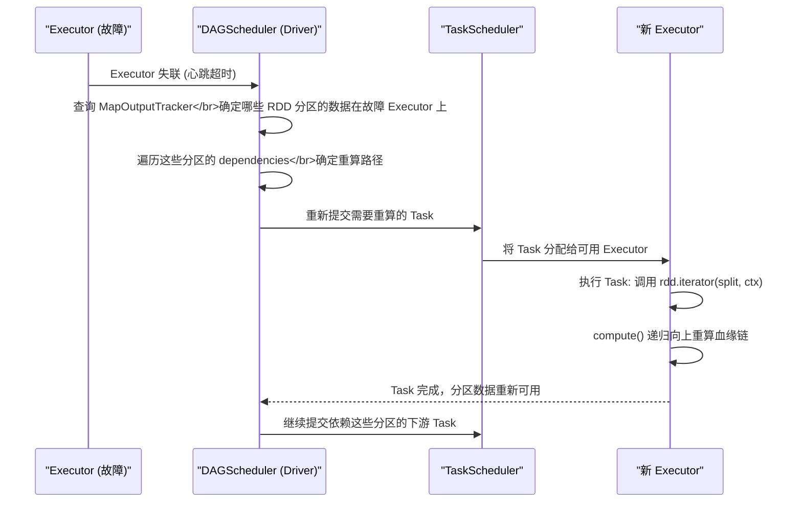
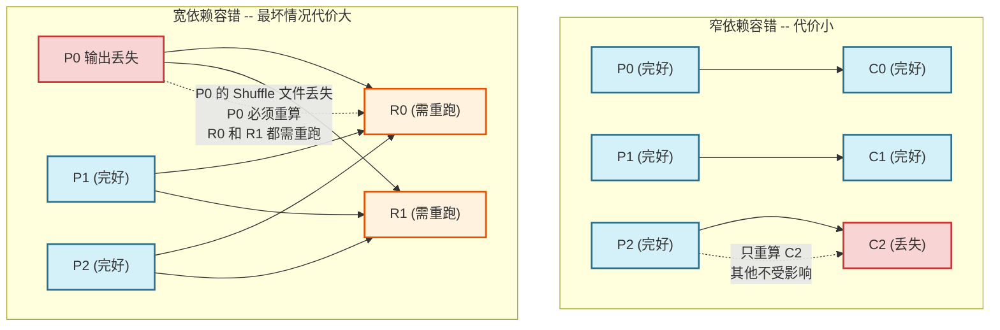

# 05 血缘（Lineage）与容错：以计算重构换取存储可靠性的权衡艺术

> [!abstract] 摘要
> 在分布式系统的设计空间里，容错永远是核心命题之一。传统方案——无论是 HDFS 的三副本，还是数据库的 WAL 日志——都以"记录状态快照"为基础。Spark RDD 则提出了一条截然不同的路径：**不保存任何数据副本，只保存"如何从源数据重新计算出这份数据"的指令链**，即血缘（Lineage）。这一设计在内存计算场景下极其高效，但也有其边界条件——当血缘链过长或跨越宽依赖时，重算代价会急剧上升。本文将系统推导 Lineage 容错的完整机制：为什么不需要副本？窄依赖和宽依赖在容错时的代价差异有多大？Checkpoint 如何截断血缘链？`cache`、`persist` 与 `checkpoint` 三者的本质差异是什么？最终落到生产实践：如何在迭代型计算中设计合理的容错策略。

---

## 第 1 章 从第一性原理推导：为什么 RDD 不需要副本？

### 1.1 副本容错的本质与代价

理解 RDD 血缘容错的价值，必须先真正理解副本容错的成本结构。

HDFS 的三副本策略是大数据生态中最常见的容错方案：每份数据在集群中存储三份，当某个节点故障时，直接从另外两个副本读取。这个方案的优点是显而易见的：故障恢复极快，只需重定向 I/O 即可。

但其代价同样显著：
- **存储放大 3 倍**：100TB 的用户数据需要 300TB 的实际存储空间
- **写入带宽放大 3 倍**：每次写入都需要在网络上传输 3 份数据
- **副本同步延迟**：在写入第一副本后、第三副本完成前，存在短暂的"不一致窗口"

这在持久化存储层（HDFS）是合理的，因为数据一旦写入就长期驻留，副本成本被摊薄到了整个数据生命周期。

### 1.2 中间计算结果的特殊性

但 RDD 表示的是**计算的中间结果**，其特点与持久化数据截然不同：

- **生命周期极短**：中间 RDD 往往只在一次 Job 内有意义，Job 结束后就应该被回收
- **产生速度极快**：在内存计算模式下，一个 100GB 的 RDD 分区可能在几秒内从上游 RDD 计算出来
- **天然不可变**：RDD 一旦创建就不会被修改，这意味着"重算"得到的结果与原始结果完全一致

**关键洞察**：如果重算一份中间数据所需的时间远小于从网络恢复副本所需的时间，那么副本策略就是浪费。对于内存中的计算结果，这个条件往往成立。

Spark RDD 论文中给出了这样的量化分析：集群内存读写速度约 10 GB/s，而网络带宽约 1 GB/s。对于一个 10GB 的 RDD 分区，从内存重算需要约 1 秒，而通过网络传输一个副本需要约 10 秒。**在这种情况下，重算比副本快 10 倍。**

### 1.3 RDD 血缘容错的四个前提条件

RDD 血缘容错能够成立，依赖于四个前提：

1. **数据不可变性（Immutability）**：RDD 一旦创建就不会被修改，因此"重算"得到的结果与原始结果严格相同，不存在"重算结果与原始结果不一致"的问题
2. **确定性（Determinism）**：相同输入、相同算子逻辑，必须产生相同输出。若算子中包含随机数、当前时间戳等非确定性因素，重算结果会不同，血缘容错语义就被破坏了
3. **血缘记录完整性**：从数据源到当前 RDD 的每一步 Transformation 都必须被记录在 `dependencies` 中，一个也不能丢失
4. **数据源可重新访问**：血缘链的根节点（通常是 HDFS 文件）在节点故障后仍然可以访问。若数据源本身也不可靠，血缘容错就失去了起点

> [!warning] 非确定性算子的风险
> 在 `map` 算子中使用 `Random.nextInt()` 或 `System.currentTimeMillis()` 等非确定性调用，会破坏血缘容错的语义正确性。重算时得到不同的结果，可能导致难以察觉的数据错误。
> 广播变量（`broadcast`）的内容在重算时必须与原始值相同，若广播变量对应的外部资源（如配置文件、模型文件）在故障期间被修改，重算结果同样不可信。

---

## 第 2 章 血缘的物理结构：它存储在哪里？存储了什么？

### 2.1 Lineage 不是一个独立的数据结构

很多文章在介绍血缘时，会画出一张独立的"血缘图"，让人以为 Spark 维护了一个单独的血缘数据库。实际上，**Lineage 就是 RDD 对象之间的引用关系本身**，它天然嵌套在 RDD 的 `dependencies` 字段中，不需要额外的存储结构。

每个 RDD 对象持有一个 `Seq[Dependency[_]]` 列表，每个 `Dependency` 对象持有指向父 RDD 的引用，父 RDD 又持有其 `dependencies`，如此递归，构成了一张从末端 RDD 到数据源的完整有向图。

```scala
// 血缘的物理载体就是 RDD 对象的 dependencies 字段
class MapPartitionsRDD[U, T](...) extends RDD[U](...) {
  // deps 是构造时传入的父 RDD 引用列表
  // 这就是血缘链的一个节点
  override def getDependencies: Seq[Dependency[_]] = {
    List(new OneToOneDependency(prev))  // prev 是父 RDD 对象的引用
  }
}
```

**血缘图的物理形态**：Driver JVM 堆内存中，由 RDD 对象的引用链构成的对象图。这个图从 Action 作用的末端 RDD 出发，沿 `dependencies` 引用逐层向上，最终到达数据源 RDD（如 `HadoopRDD`）。

### 2.2 血缘中记录了什么信息？

血缘链中每个节点（RDD 对象）携带的关键信息：

| 信息 | 存储位置 | 作用 |
| :--- | :--- | :--- |
| **RDD 类型** | 对象类型（如 `MapPartitionsRDD`） | 决定 `compute` 方法的实现 |
| **父 RDD 引用** | `dependencies` 字段 | 构成血缘链的边 |
| **用户函数** | 闭包字段（如 `MapPartitionsRDD.f`） | 重算时执行的转换逻辑 |
| **分区信息** | `partitions_` 字段（缓存） | 确定重算的目标分区范围 |
| **Partitioner** | `partitioner` 字段 | 宽依赖时确定数据路由规则 |

**血缘中不包含**：任何实际的数据字节、任何对数据的物理位置指针（除了数据源 RDD 的位置信息）。

### 2.3 故障恢复的执行流程

当某个 Executor 故障导致若干 RDD 分区丢失时，`DAGScheduler` 的容错流程如下：



整个过程的关键点：**DAGScheduler 不需要协调全局状态，只需要针对丢失的具体分区重新提交 Task**。这是分区级容错的精华——失败边界被精确地控制在最小范围内。

---

## 第 3 章 窄依赖 vs 宽依赖：容错代价的量化分析

### 3.1 窄依赖的容错：精确、独立、快速

在全窄依赖的 Stage 中（如 `filter → map → flatMap` 的链路），容错代价是最低的。

**场景**：Stage 有 100 个 Task，第 47 号 Task 所在的 Executor 在 Task 运行到一半时崩溃。

**恢复步骤**：
1. DAGScheduler 检测到 Task 47 失败
2. 查询血缘：Task 47 对应的分区 47，依赖 `FilteredRDD.P47 → HadoopRDD.P47`（HDFS Block 47）
3. 向 TaskScheduler 重新提交 Task 47，分配到另一个可用 Executor
4. 新 Executor 从 HDFS Block 47 重新读取数据，执行 filter + map + flatMap，Task 47 完成

**关键特性**：
- 其他 99 个 Task 完全不受影响，继续正常执行
- 重算只涉及 1 个分区的数据，代价极小
- 重算路径确定（`getParents` 精确返回依赖的父分区序号），不需要任何全局协调

### 3.2 宽依赖的容错：代价随场景剧烈变化

宽依赖（Shuffle）的容错代价取决于**故障发生在 Shuffle 的哪个阶段**：

**情形 A：Shuffle Read 阶段的下游 Task 失败**

下游 Stage 的某个 Reduce Task 失败，但上游所有 Map Task 的 Shuffle 文件仍然完好。

恢复步骤：只需重新提交失败的 Reduce Task，从已有的 Shuffle 文件重新读取数据。

代价：极低，与窄依赖容错相当。

**情形 B：Shuffle Write 阶段的上游 Task 失败**（Shuffle 文件未写完）

上游 Stage 正在执行，某个 Map Task 失败，其 Shuffle 文件不完整或不存在。

恢复步骤：重新提交失败的 Map Task，等待 Shuffle 文件重新写出后，再启动下游 Task。

代价：中等，只需重算一个 Map Task 分区的数据。

**情形 C：上游 Executor 崩溃，Shuffle 文件全部丢失**（最坏情况）

整个 ShuffleMapStage 已经完成，ResultStage 已经启动并有若干 Task 在执行时，存储 Shuffle 文件的节点崩溃。

此时 Shuffle 文件无法访问，已经完成的 Reduce Task 无法从该节点读取分区数据。

恢复步骤：
1. 正在运行的依赖该节点数据的 Reduce Task 全部标记失败
2. DAGScheduler 重新提交整个（或部分）ShuffleMapStage，重新生成 Shuffle 文件
3. 等待 ShuffleMapStage 完成后，重新提交失败的 Reduce Task

代价：极高。若上游 Stage 计算耗时 30 分钟，则需要再等待 30 分钟才能继续。且已经完成的下游 Task 中，依赖该节点数据的部分也必须重跑。



### 3.3 容错代价的数学模型

设 Stage 有 $N$ 个 Map Task，每个 Task 执行时间为 $t$，Reduce Task 数为 $M$：

| 故障类型 | 重算代价 | 说明 |
| :--- | :--- | :--- |
| 窄依赖单 Task 失败 | $O(t)$ | 只重算 1 个 Task |
| 宽依赖 Reduce Task 失败（文件完好） | $O(t)$ | 只重算 1 个 Reduce Task |
| 宽依赖 Map 端 Shuffle 文件丢失 | $O(N \cdot t)$ | 需要重跑整个 ShuffleMapStage |
| 多级宽依赖最终节点丢失 | $O(k \cdot N \cdot t)$ | 需要逐级重跑 k 个 ShuffleMapStage |

这个代价模型清晰地说明了为什么在多级 Shuffle 的复杂作业中，**必须在关键 Shuffle 点做 Checkpoint**：一次节点故障可能触发指数级别的重算。

---

## 第 4 章 Checkpoint：截断血缘链的手术刀

### 4.1 什么情况下血缘容错会"失效"？

血缘容错基于一个隐含假设：重算成本可以接受。但以下两种情况会让这个假设失效：

**情况一：血缘链过长**

典型场景是迭代型机器学习算法。以 K-Means 为例，每轮迭代在上一轮 RDD 基础上增加若干 Transformation：

```
第 1 轮：HadoopRDD → FilterRDD → MapRDD_1
第 2 轮：... → MapRDD_2
...
第 100 轮：... → MapRDD_100
```

到第 100 轮时，末端 RDD 的血缘链长度达到数百层。此时：
- 一个 JVM 调用栈帧（stack frame）大约占用几 KB，几百层嵌套的 `compute` 递归调用可能触发 `StackOverflowError`
- 若末端分区故障，需要从第 1 轮的 HDFS 数据开始重算 100 轮，代价极高

**情况二：宽依赖 Shuffle 文件不可恢复**

Spark 默认只保留最近一批 Shuffle 文件（由 `spark.shuffle.service.enabled` 和相关配置控制）。如果存储 Shuffle 文件的 Executor 崩溃，上游 Stage 的 Shuffle 文件全部丢失，就需要重跑整个 Stage。在多级 Shuffle 的场景下，代价可能是整个作业执行时间的数倍。

### 4.2 Checkpoint 的工作机制

`rdd.checkpoint()` 的完整工作流程：

**调用阶段（Transformation 时）**：
1. `rdd.checkpoint()` 仅标记该 RDD 需要 checkpoint，不立即触发计算
2. 内部设置 `rdd.checkpointData = Some(new ReliableRDDCheckpointData(rdd))`

**执行阶段（Action 触发后）**：
1. 正常 Job 执行完成（RDD 数据已经在 Executor 端计算出来）
2. DAGScheduler 检测到有 RDD 被标记为需要 checkpoint
3. 额外触发一个新 Job：`rdd.doCheckpoint()`，将 RDD 的每个分区数据**写入 HDFS checkpoint 目录**
4. 写入完成后，调用 `rdd.markCheckpointed()`，**截断血缘链**

**截断效果**：
```scala
// markCheckpointed() 执行后：
// rdd.dependencies 被清空
// rdd 的父 RDD 变为 CheckpointRDD（指向 HDFS 上的 checkpoint 文件）
// 原来的血缘链（上游所有 RDD 对象）变为不可达，被 GC 回收
```

从此以后，任何对该 RDD 的重算都直接从 HDFS checkpoint 文件读取，不再需要追溯任何上游血缘。

### 4.3 Checkpoint 的一个重要细节：为什么要先 cache 再 checkpoint？

官方建议：**在调用 `checkpoint()` 之前先调用 `cache()`**。

```scala
val rdd = expensiveRDD.cache()  // 先 cache
rdd.checkpoint()                // 再 checkpoint
rdd.count()                     // 触发 Action，完成 checkpoint
```

原因：`checkpoint()` 会触发一个额外的 Job 来写入 HDFS。这个 Job 需要重新计算 RDD 的所有分区数据。如果没有 `cache()`，这意味着**整个上游血缘链要被重新执行一遍**——即正常 Job 执行一遍，checkpoint Job 又执行一遍，总共执行两遍。

如果先 `cache()`，checkpoint Job 可以直接从内存中的 cache 数据写入 HDFS，无需重新计算，大幅减少 checkpoint 的时间成本。

---

## 第 5 章 三位一体的精确对比：cache、persist 与 checkpoint

### 5.1 cache 和 persist 的本质

`cache()` 是 `persist(StorageLevel.MEMORY_AND_DISK)` 的别名。`persist` 允许用户指定存储级别：

| StorageLevel | 含义 |
| :--- | :--- |
| `MEMORY_ONLY` | 只存内存，满了就丢弃（需要时重算） |
| `MEMORY_AND_DISK` | 内存满了 Spill 到本地磁盘（`cache()` 的默认） |
| `MEMORY_ONLY_SER` | 内存中以序列化字节存储（省内存，费 CPU） |
| `DISK_ONLY` | 只存本地磁盘 |
| `OFF_HEAP` | 堆外内存（Tungsten 内存管理） |

**persist 的血缘不截断**：即使数据存在内存中，RDD 的 `dependencies` 字段仍然保持完整。当 Executor 崩溃导致缓存丢失时，Spark 仍然可以通过血缘重算。这是 `persist` 与 `checkpoint` 的根本区别。

### 5.2 三者的完整对比

| 维度 | cache / persist | checkpoint |
| :--- | :--- | :--- |
| **存储位置** | Executor 内存 / 本地磁盘 | HDFS（或其他可靠存储） |
| **存储可靠性** | 低（Executor 崩溃则丢失） | 高（HDFS 三副本保障） |
| **血缘关系** | **保留**（可重算） | **截断**（不可重算，直接读文件） |
| **数据生命周期** | 随 Application 结束消失 | 永久存在（需手动清理） |
| **写入代价** | 低（内存直接缓存，无额外 Job） | 高（需要额外一个 Job 写 HDFS） |
| **读取速度** | 快（内存级别） | 慢（HDFS I/O） |
| **跨 Application 共享** | 不支持 | 支持（同一 checkpoint 目录可被多个 App 读取） |
| **适用场景** | 多次 Action 复用中间结果 | 长血缘截断、Streaming 状态持久化 |

### 5.3 生产中的组合使用策略

**策略一：迭代计算中的定期 checkpoint**

```scala
sc.setCheckpointDir("hdfs://namenode/spark-checkpoints/job-xxx/")

var model = initialRDD
for (iter <- 1 to 100) {
  model = updateModel(model)  // 每轮迭代追加 Transformation
  
  if (iter % 10 == 0) {       // 每 10 轮 checkpoint 一次
    model = model.cache()     // 先 cache（确保 checkpoint Job 快速完成）
    model.checkpoint()        // 标记 checkpoint
    model.count()             // 触发 checkpoint 写入（等待完成）
    // checkpoint 完成后，model 的血缘链被截断
    // 上游 90 层 RDD 对象变为不可达，被 GC 回收
    // Driver 内存压力大幅下降
  }
}
```

**策略二：Shuffle 密集型作业的关键中间结果保护**

```scala
// 多路 Join + 多级 Shuffle 的场景
val joinResult = rdd1.join(rdd2).join(rdd3)  // 两次 Shuffle
joinResult.cache()       // 缓存到内存，避免后续多次 Action 重复 Shuffle
joinResult.checkpoint()  // 持久化到 HDFS，防止 Executor 崩溃导致 Shuffle 雪崩
joinResult.count()       // 触发执行

// 后续 Action 都从 checkpoint 文件或内存 cache 读取
val result1 = joinResult.filter(condition1).count()
val result2 = joinResult.filter(condition2).collect()
```

---

## 第 6 章 Spark Streaming 中的血缘容错挑战

Spark Streaming 是血缘容错压力最大的场景，值得单独讨论。

### 6.1 为什么 Streaming 必须使用 Checkpoint？

在 Spark Streaming 中，每个 batch 的 DStream 计算依赖上一个 batch 的状态（对于有状态操作如 `updateStateByKey`）。这意味着血缘链随着 batch 的增加而持续增长：

```
Batch 1: [Input RDD_1] → [State RDD_1]
Batch 2: [Input RDD_2] → [State RDD_1] → [State RDD_2]
...
Batch N: [Input RDD_N] → [State RDD_1] → ... → [State RDD_N]
```

当 Batch N 运行时，如果 `State RDD_1` 的数据丢失，Spark 需要重算从 Batch 1 开始的所有历史数据——这在生产系统中是不可接受的。

因此 Spark Streaming 要求**必须开启 Checkpoint**，定期将 DStream 的状态持久化到 HDFS，截断历史血缘链。这是 Spark Streaming 与纯批处理 Spark 在容错策略上最显著的差异。

### 6.2 Checkpoint 间隔的选择

在 Streaming 中，checkpoint 间隔（`ssc.checkpoint(interval)`）是一个关键调优参数：

- **间隔过短**：checkpoint 写 HDFS 的开销占总 batch 时间的比例过高，影响实时性
- **间隔过长**：故障恢复时需要重播的历史数据量过多，恢复时间过长

**经验法则**：checkpoint 间隔 = batch 间隔 × 5 到 10 倍。即每处理 5-10 个 batch 做一次 checkpoint。

---

## 第 7 章 总结

RDD 的血缘容错机制是分布式内存计算领域的经典设计，它的核心权衡是：**用重算代替副本，以计算的廉价性换取存储的经济性**。

这套机制在以下场景下工作得非常好：
- 血缘链较短（Stage 内部，算子链深度 < 几十层）
- 全窄依赖 Stage（容错精确、代价小）
- 数据源可靠（如 HDFS，保障了重算的起点）

在以下场景需要主动介入（通过 Checkpoint）：
- 迭代计算导致血缘链持续增长
- 多级宽依赖（Shuffle 文件丢失的连锁代价难以接受）
- Spark Streaming 的有状态计算

在 **[[06 RDD 迭代器模型：流水线计算（Pipeline）与内存迭代器的实现深度分析|下一篇文章]]** 中，我们将从容错的"宏观层"回到计算的"微观层"，深入 Task 内部的 Iterator 执行模型，理解数据是如何以"流"的形态在单个 Task 内部流转的。

---

> [!note] 思考题
> 1. 假设你的 Spark 作业有 5 个 Stage（每个 Stage 之间都是宽依赖），每个 Stage 执行时间约 10 分钟。当第 5 个 Stage 执行到一半时，第 2 个 Stage 的 Shuffle 文件所在 Executor 崩溃。Spark 需要重跑哪些 Stage？总共需要等待多长时间？如果在第 2 个 Stage 完成后做了 Checkpoint，情况会有什么不同？
> 2. `rdd.checkpoint()` 触发的额外 Job 与原始 Job 相比，执行的是完全相同的计算吗？如果原始 Job 中有随机性（如采样），checkpoint Job 得到的数据与原始 Job 一致吗？这会导致什么问题？
> 3. 为什么 `MEMORY_ONLY` 级别的 `persist` 在内存不足时选择"丢弃"而非"Spill 到磁盘"？丢弃后如何恢复？这与 `MEMORY_AND_DISK` 的语义差异有什么实际影响？
