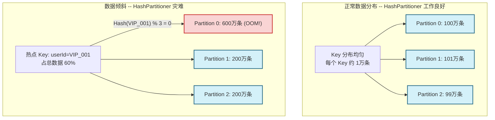

# 07 分区器（Partitioner）：分布式数据布局的数学逻辑与数据倾斜攻坚

> [!abstract] 摘要
> 在分布式计算中，"数据分布在哪里"往往比"计算逻辑是什么"更能决定作业的生死。**分区器（Partitioner）** 是 Spark 控制数据在集群节点间物理排布的核心组件——它不仅决定了 Shuffle 过程中每条记录的"去向"，更是宽依赖能否被降级为窄依赖的决定性因素，以及解决**数据倾斜（Data Skew）**这一头号性能杀手的核心工具。本文将系统推导分区器的设计逻辑：为什么需要确定性的分区映射 → `HashPartitioner` 的数学实现与固有缺陷 → `RangePartitioner` 如何通过两阶段采样解决全局有序问题 → 如何通过自定义分区器对付数据倾斜 → 以及预分区（Pre-Partitioning）如何消除重复 Shuffle。

---

## 第 1 章 分布式数据布局的核心命题：相同 Key 必须在同一个节点

### 1.1 从一个思想实验出发

考虑这样一个场景：你有 10 亿条用户行为日志，需要统计每个用户的总点击次数（`reduceByKey`）。这些日志分散在集群的 100 个节点上，每个节点有若干个分区的数据。

现在面临一个基本问题：**用户 A 的行为记录可能分散在任意几个节点上，如何才能把用户 A 的所有记录聚合在一起？**

有两种可能的方案：

**方案一：全量广播**
每个节点将自己的数据广播给所有其他节点，每个节点持有全量数据后本地聚合。代价：网络传输量 = 数据总量 × 节点数 = 极其昂贵，完全不可行。

**方案二：确定性路由**
建立一个所有节点都认可的映射规则：$f(\text{userId}) \rightarrow \text{partitionId}$。用户 A 的所有记录，无论在哪个节点产生，都通过这个映射函数计算出相同的目标分区，被路由到同一个节点聚合。

**分区器（Partitioner）就是方案二中的 $f$ 函数。**

### 1.2 分区器的两个核心性质

**确定性（Determinism）**：相同的 Key 必须永远映射到相同的分区序号。无论在哪台机器上调用 `partitioner.getPartition(key)`，返回值必须相同。这是分布式聚合正确性的数学保障。

**均匀性（Uniformity）**：理想情况下，每个分区接收到的记录数量应该大致相同，使得每个 Task 的工作量均衡。均匀性的破坏（即数据倾斜）是生产中最常见的性能问题来源。

这两个性质存在内在张力：实现确定性很容易（哈希即可），但在 Key 分布不均匀时，确定性的哈希映射会导致严重的不均匀性。分区器的设计本质上是在这两个目标之间寻找最优平衡点。

### 1.3 Partitioner 的接口定义

Spark 中所有分区器都继承自 `Partitioner` 抽象类：

```scala
abstract class Partitioner extends Serializable {
  def numPartitions: Int           // 分区总数（即下游 Stage 的 Task 数量）
  def getPartition(key: Any): Int  // 给定一个 Key，返回它的目标分区序号 [0, numPartitions)
}
```

接口极其简洁，但 `getPartition` 的实现细节决定了整个 Shuffle 的数据分布特性。

---

## 第 2 章 HashPartitioner：默认选择背后的数学基础与致命缺陷

### 2.1 数学实现

`HashPartitioner` 是 Spark 中最广泛使用的分区策略，其逻辑为：

$$\text{partition} = \text{nonNegativeMod}(\text{key.hashCode()},\ \text{numPartitions})$$

其中 `nonNegativeMod` 的实现如下：

```scala
def nonNegativeMod(x: Int, mod: Int): Int = {
  val rawMod = x % mod
  rawMod + (if (rawMod < 0) mod else 0)
  // 处理 hashCode 为负数的情况（Java hashCode 可以为负）
  // 直接 Math.abs(hashCode) % mod 有潜在 bug：Integer.MIN_VALUE 取绝对值仍是负数
}
```

这个设计处理了一个 Java 特有的陷阱：`Integer.MIN_VALUE` 的绝对值在 Java 中仍然是 `Integer.MIN_VALUE`（溢出），使用 `nonNegativeMod` 则完全规避了这个问题。

### 2.2 HashPartitioner 的适用条件

Hash 分区器在以下条件下工作良好：
- Key 的 `hashCode` 分布相对均匀（即不同 Key 的 hashCode 在 $[0, \text{MAX\_INT}]$ 上均匀分布）
- 没有"热点 Key"（单个 Key 的记录数量远多于平均值）
- Key 的数量远多于分区数（避免碰撞导致的不均匀）

对于标准类型（`String`, `Int`, `Long`），Java 的 `hashCode` 实现已经足够均匀，Hash 分区器在大多数通用场景下表现良好。

### 2.3 HashPartitioner 的致命缺陷：数据倾斜

当 Key 的分布严重不均匀时，Hash 分区器会将热点 Key 的所有数据集中到一个分区，导致**数据倾斜（Data Skew）**。

典型场景：

- **业务型热点**：电商大促期间，某个爆款商品 ID 的浏览记录占总记录的 30%，所有这些记录被 Hash 到同一个分区
- **空值/默认值聚集**：数据质量问题导致大量记录的 Key 为 `null` 或空字符串（`null.hashCode() = 0`，全部路由到分区 0）
- **用户行为分布不均**：少数高活跃用户的操作记录远多于普通用户

数据倾斜的后果：
- 某个 Task 处理的数据量是其他 Task 的数十倍甚至数百倍
- 整个 Stage 的完成时间取决于那个"长尾 Task"，其他 Task 早早完成后只能空等
- 严重时，倾斜的 Task 因为数据量超出 Executor 内存容量而 OOM 崩溃，触发任务重试，形成恶性循环



---

## 第 3 章 RangePartitioner：为全局有序而生的采样艺术

### 3.1 为什么需要 RangePartitioner？

`sortByKey()` 要求输出结果全局有序（分区 0 中所有记录的 Key 都小于分区 1 中所有记录的 Key）。Hash 分区器完全无法实现这一点——哈希函数打乱了 Key 的自然顺序。

实现全局有序需要**范围分区（Range Partitioning）**：将 Key 的取值空间划分为 $N$ 个连续区间，每个分区对应一个区间，分区内记录按 Key 排序：

$$(-\infty, b_1], (b_1, b_2], ..., (b_{N-2}, b_{N-1}], (b_{N-1}, +\infty)$$

### 3.2 核心挑战：如何确定边界点 $b_1, ..., b_{N-1}$？

确定边界点的目标是：**每个区间包含大致相同数量的记录**，即让每个 Partition Task 的工作量均衡。

这个问题的难点在于：在开始排序之前，我们不知道数据的分布（密度函数）。如果直接均匀划分 Key 的数值范围（如整数 $[0, 10^9]$ 分为 10 段，每段 $10^8$），在 Key 分布极不均匀时（如大量数据集中在 $[0, 100]$），会产生严重的分区不均。

**解决方案：先采样，估算分布，再划分边界。**

### 3.3 RangePartitioner 的两阶段实现

**阶段一：水库采样（Reservoir Sampling）**

`RangePartitioner` 在构造时会触发一次额外的 Action，对父 RDD 进行随机采样：

```scala
// RangePartitioner 构造函数（简化）
class RangePartitioner[K: Ordering: ClassTag, V](
    partitions: Int,
    rdd: RDD[_ <: Product2[K, V]],
    ascending: Boolean = true,
    samplePointsPerPartitionHint: Int = 20
) extends Partitioner {

  // 构造时触发采样 Job
  private var rangeBounds: Array[K] = {
    if (partitions <= 1) Array.empty
    else {
      // 采样目标数量 = 每分区采样点数 × 分区总数
      val sampleSize = math.min(samplePointsPerPartitionHint.toDouble * partitions, 1e6)
      
      // 每个分区的采样比例
      val sampleSizePerPartition = math.ceil(3.0 * sampleSize / rdd.partitions.size).toInt
      
      // 触发采样 Job：对每个分区进行水库采样
      val (numItems, sketched) = RangePartitioner.sketch(rdd.map(_._1), sampleSizePerPartition)
      
      // 根据采样结果，使用加权算法确定边界点
      RangePartitioner.determineBounds(candidates, math.min(partitions, candidates.size))
    }
  }

  override def getPartition(key: Any): Int = {
    // 对 rangeBounds 进行二分搜索，确定 key 落在哪个区间
    val ordering = implicitly[Ordering[K]]
    val k = key.asInstanceOf[K]
    var lo = 0; var hi = rangeBounds.length - 1
    while (lo < hi) {
      val mid = (lo + hi) >>> 1
      val cmp = ordering.compare(k, rangeBounds(mid))
      if (cmp < 0) hi = mid
      else if (cmp > 0) lo = mid + 1
      else return mid  // 精确命中边界点
    }
    if (ascending) lo else rangeBounds.length - lo
  }
}
```

**阶段二：加权边界确定（Weighted Bounds Determination）**

采样完成后，`determineBounds` 方法根据每个分区的数据量（即权重）计算最终的边界点。对于数据量特别大的分区，会分配更多的边界点（即更细的划分粒度），确保每个输出分区的预期数据量均衡。

> [!info] 采样的代价与收益
> 采样会触发一次额外的 Job（在正式 `sortByKey` 执行之前），这意味着数据会被读取和计算**两次**。对于从 HDFS 读取的大文件，这个开销是不可忽视的。
>
> **优化建议**：如果父 RDD 已经 `cache()` 到内存，采样 Job 直接从内存读取，代价极低。因此在使用 `sortByKey` 前，建议先 `cache()` 父 RDD（若内存允许）。
>
> **采样的统计精度**：`samplePointsPerPartitionHint = 20` 意味着每个分区平均采样 20 个点。总体上，1000 个分区的 `sortByKey` 会采样约 20,000 个点。通过加权算法，这已经足够估算出相对准确的边界点，使各分区数据量偏差在 ±20% 以内。

---

## 第 4 章 Partitioner 相等性：消除 Shuffle 的隐藏武器

### 4.1 什么是 Partitioner 相等性？

当两个 RDD 使用**完全相同的 Partitioner**（`partitioner.equals()` 返回 `true`）时，对它们进行 `join` 或 `cogroup` 操作，Spark 可以将宽依赖优化为窄依赖，完全跳过 Shuffle。

`HashPartitioner.equals()` 的实现：
```scala
override def equals(other: Any): Boolean = other match {
  case h: HashPartitioner => h.numPartitions == numPartitions
  // 只要分区数相同，就认为是"相同"的 HashPartitioner
  case _ => false
}
```

这个简单的相等性检查，是 Spark 中一个极其重要的优化触发点。

### 4.2 预分区（Pre-Partitioning）策略

预分区是指：在第一次 Shuffle 时将 RDD 分区到目标格式，`cache()` 结果，后续所有操作都复用这个分区结果。

```scala
val p = new HashPartitioner(200)

// 第一步：预分区 + 缓存（只 Shuffle 一次）
val userRDD = rawUserRDD
  .map(parseUser)
  .partitionBy(p)   // 触发一次 Shuffle，按 userId 分区
  .cache()          // 缓存，防止重算

val orderRDD = rawOrderRDD
  .map(parseOrder)
  .partitionBy(p)   // 按 userId 分区（与 userRDD 相同的分区器）
  .cache()

// 后续所有 join 操作：零 Shuffle！
// 因为两个 RDD 的 partitioner.equals() == true
val todayJoin = userRDD.join(orderRDD.filter(_.date == today))
val weeklyJoin = userRDD.join(orderRDD.filter(_.date >= lastWeek))
val monthlyJoin = userRDD.join(orderRDD.filter(_.date >= lastMonth))
```

**为什么预分区后的 join 是窄依赖？**

`userRDD.join(orderRDD)` 在内部是 `userRDD.cogroup(orderRDD).flatMap(...)`。`cogroup` 创建的是 `CoGroupedRDD`，它在构造时检查两个父 RDD 的 Partitioner：
- 若两个父 RDD 有相同的 Partitioner：`CoGroupedRDD` 对每个父 RDD 使用 `NarrowDependency`（分区 $i$ 只依赖父 RDD 的分区 $i$），不触发 Shuffle
- 若分区器不同或不存在：`CoGroupedRDD` 使用 `ShuffleDependency`，触发 Shuffle

预分区策略在**反复 Join 同一个维度表**的场景下尤其有价值。例如广告系统中，每次更新广告效果都需要 Join 用户画像表（数十 GB），通过预分区，一次 Shuffle 换取后续数十次 Join 的零 Shuffle，是极高性价比的优化。

---

## 第 5 章 数据倾斜攻坚：从诊断到根治

### 5.1 数据倾斜的诊断方法

**方法一：Spark UI Task 执行时间对比**
在 Spark UI 的 Stage 详情页，查看各 Task 的执行时间分布。如果存在"长尾 Task"（少数 Task 执行时间是中位数的数倍甚至数十倍），通常是数据倾斜的信号。

**方法二：查看 Task 处理的数据量**
Spark UI 中的 "Input Size / Records" 列展示每个 Task 处理的数据量。数据倾斜时，长尾 Task 的数据量会显著大于其他 Task。

**方法三：分析 Key 分布**
```scala
// 对 Key 分布进行采样分析
rdd.map(r => (r.key, 1))
   .reduceByKey(_ + _)
   .sortBy(-_._2)       // 按 count 降序
   .take(20)             // 取 Top 20 热点 Key
   .foreach(println)
```

### 5.2 解决方案一：加盐（Salt Key）处理热点 Key

加盐是处理热点 Key 倾斜最通用的方案。核心思路是：**将一个热点 Key 拆分为多个"加盐 Key"，强制打散到多个分区，然后在聚合后合并结果**。

```scala
val SALT_FACTOR = 10  // 将热点 Key 打散到 10 个分区

// Map 阶段：加盐
val saltedRDD = rdd.map { (key, value) =>
  if (isHotKey(key)) {
    // 热点 Key 随机加盐，打散到 SALT_FACTOR 个分区
    val salt = Random.nextInt(SALT_FACTOR)
    ((key, salt), value)
  } else {
    ((key, 0), value)  // 非热点 Key 不加盐
  }
}

// 第一次 reduceByKey：局部聚合（按加盐 Key）
val partialResult = saltedRDD.reduceByKey(combineFunc)

// 去盐：恢复原始 Key
val desaltedRDD = partialResult.map { case ((key, _), value) => (key, value) }

// 第二次 reduceByKey：全局聚合（按原始 Key）
val finalResult = desaltedRDD.reduceByKey(mergeFunc)
```

**代价**：需要两次 `reduceByKey`（即两次 Shuffle），且聚合逻辑需要可分步执行（局部聚合 + 全局合并，即需要满足结合律）。

**适用场景**：适用于可分步聚合的操作（求和、计数、最大值/最小值），不适用于需要全量数据的操作（如精确去重、中位数计算）。

### 5.3 解决方案二：广播 Join（Broadcast Join）

当 Join 的一方数据量较小时（通常 < 数百 MB），可以将小表广播到所有 Executor，避免 Shuffle：

```scala
// 小表广播
val smallTableBroadcast = sc.broadcast(smallRDD.collectAsMap())

// 大表中的每条记录直接查广播变量，无需 Shuffle
val result = largeRDD.mapPartitions { iter =>
  val smallTable = smallTableBroadcast.value
  iter.flatMap { (key, value) =>
    smallTable.get(key).map { smallValue =>
      (key, (value, smallValue))
    }
  }
}
```

这是将宽依赖（Join 产生的 Shuffle）转化为窄依赖的极端优化，代价是广播变量占用每个 Executor 的内存。Spark SQL 会自动识别小表并开启 `BroadcastHashJoin`（由 `spark.sql.autoBroadcastJoinThreshold` 控制，默认 10MB）。

### 5.4 解决方案三：自定义分区器

当你对数据分布有先验知识时，可以实现自定义分区器，将倾斜的 Key 均匀分配：

```scala
// 自定义分区器：对已知热点 Key 进行特殊处理
class AntiSkewPartitioner(numParts: Int, hotKeys: Set[String], saltFactor: Int)
    extends Partitioner {
  
  override def numPartitions: Int = numParts
  
  override def getPartition(key: Any): Int = key match {
    case k: String if hotKeys.contains(k) =>
      // 热点 Key：通过随机盐值打散
      (k.hashCode + Random.nextInt(saltFactor)).abs % numPartitions
    case k =>
      // 普通 Key：正常哈希
      nonNegativeMod(k.hashCode, numPartitions)
  }
}
```

> [!warning] 自定义分区器使用 Random 会破坏确定性
> 上面的例子中，热点 Key 使用 `Random.nextInt` 意味着每次调用 `getPartition` 的结果都不同，破坏了分区器的确定性原则。
>
> **正确做法**：预先确定每个热点 Key 的"盐值分配方案"（如将 Key 字符串 hash 后取不同模数），而非运行时随机。在 Map 阶段显式修改 Key（如拼接盐值后缀），让 HashPartitioner 自然路由。

---

## 第 6 章 分区数调优：并行度与开销的平衡

### 6.1 分区数对作业性能的双向影响

**分区数过少**：
- 每个 Task 处理的数据量过大，可能 OOM
- 并行度不足，CPU 利用率低
- Shuffle Write 时单个 Shuffle 文件过大，写入慢

**分区数过多**：
- 大量小 Task，调度开销显著（每个 Task 需要序列化、RPC、线程分配）
- 产生大量小 Shuffle 文件（N 个 Map Task × M 个 Reduce Task = N×M 个文件，但 Sort Shuffle 已优化为 2N 个）
- 最终输出大量小文件到 HDFS，后续读取效率差

**经验法则**：目标分区大小在 **128MB ~ 512MB** 之间。对于 100GB 的数据，分区数建议在 200 ~ 800 之间。

### 6.2 动态调整分区数

```scala
// 减少分区（推荐在 Shuffle 后数据量大幅减少时使用）
rdd.coalesce(n)                    // 无 Shuffle，合并相邻分区（只能减少）
rdd.repartition(n)                 // 有 Shuffle，均匀重分布（可增可减）

// 增加分区（必须用 repartition，coalesce 无法增加分区数）
rdd.repartition(n)

// SQL/DataFrame 层：
spark.conf.set("spark.sql.shuffle.partitions", "400")  // 控制 Shuffle 后的分区数
// Spark 3.x 自适应查询执行（AQE）可以动态调整分区数：
spark.conf.set("spark.sql.adaptive.enabled", "true")
spark.conf.set("spark.sql.adaptive.coalescePartitions.enabled", "true")
```

---

## 第 7 章 总结

分区器是 Spark 分布式数据布局的"指挥棒"，也是理解 Shuffle 性能的核心钥匙：

- **HashPartitioner**：简单高效，适合 Key 均匀分布的通用场景，但面对热点 Key 时毫无抵抗力
- **RangePartitioner**：通过两阶段采样实现数据量均衡的范围分区，是全局排序的唯一选择，但有采样代价
- **Partitioner 相等性**：预分区 + 缓存策略可以将多次 Join 的 Shuffle 开销降至一次，是 Join 密集型作业的首选优化
- **数据倾斜**：加盐、广播 Join、自定义分区器是三大核心解法，需根据业务特点选择
- **分区数调优**：128MB ~ 512MB 每分区是经验范围，Spark 3.x 的 AQE 可以自动处理部分场景

在 **[[08 缓存与持久化：StorageLevel 策略、BlockManager 协作与堆外内存实践|下一篇文章]]** 中，我们将探讨如何利用缓存机制锁住经过精心布局的数据，深入 BlockManager 的协作机制，以及堆外内存如何彻底消除 GC 压力。

---

> [!note] 思考题
> 1. `rdd.map(r => (newKey(r.key), r.value)).partitionBy(p)` 与 `rdd.partitionBy(p).map(r => (newKey(r.key), r.value))` 两种写法，哪种会在后续 `reduceByKey` 时触发 Shuffle？为什么？
> 2. `RangePartitioner` 在构造时会触发额外的采样 Job。如果父 RDD 已经有 `HashPartitioner`（即数据已经按 Hash 分区），采样结果能代表真实的数据分布吗？为什么？
> 3. 假设你的 Join 数据集有 1% 的 Key 占了 80% 的数据量（严重的幂律分布）。加盐方案需要两次 Shuffle，广播 Join 要求小表能放进内存。如果两者都不适用（大表大 + 严重倾斜），你会怎么设计解决方案？
