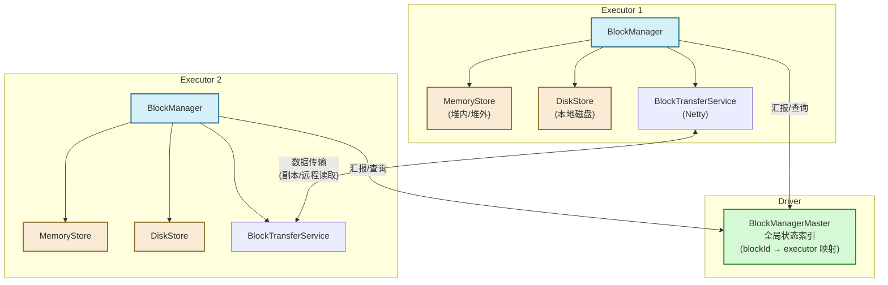

# 08 缓存与持久化：StorageLevel 策略、BlockManager 协作与堆外内存实践

> [!abstract] 摘要
> 在 Spark 的性能调优体系中，缓存（Caching）是回报最高的手段之一：一行 `cache()` 代码，在迭代型计算中可以带来数倍乃至数十倍的性能提升。但很多工程师对缓存的理解停留在"调用 `cache()` 就行"的层面，而不理解其背后的工作机制。本文将系统深入：`cache()` 调用后数据实际存储在哪里？`StorageLevel` 的各个选项意味着什么权衡？`BlockManager` 如何在分布式环境中协调多个 Executor 的缓存状态？内存不足时缓存如何被逐出（Eviction）？Spark 的统一内存管理模型如何在执行内存和存储内存之间动态调配？以及堆外内存（Off-heap）为何能从根本上消除 GC 停顿的威胁。

---

## 第 1 章 为什么缓存是分布式迭代计算的核心优化手段

### 1.1 从血缘重算到缓存复用的性能跨越

在没有缓存的情况下，Spark 的执行模型是：**每次 Action 都从数据源开始，沿血缘链重新计算所需的所有数据**。这在单次 Action 的场景下没有问题，但在以下场景中代价极高：

**场景一：交互式分析中的多次 Action**
```scala
val cleanData = rawRDD.filter(isValid).map(parseRecord)

val totalCount = cleanData.count()           // Action 1：从 HDFS 重算
val errorCount = cleanData.filter(isError).count()  // Action 2：再次从 HDFS 重算
val topErrors = cleanData.filter(isError).take(10)   // Action 3：第三次从 HDFS 重算
```
如果 `rawRDD` 是一个 HDFS 文件（1TB），每次 Action 都触发一次完整的 HDFS 读取 + filter + map，三次 Action 共读取 3TB 数据。

**场景二：机器学习的迭代计算**
```scala
val trainingData = sc.textFile("hdfs://data.txt").map(parseFeatures).cache()
var weights = initialWeights

for (i <- 1 to 100) {
  val gradient = trainingData.map(computeGradient(_, weights)).reduce(add)
  weights = weights - gradient * learningRate
}
```
没有 `cache()`，100 次迭代 = 100 次 HDFS 读取。加上 `cache()` 后，只有第一次迭代触发 HDFS 读取（同时将数据缓存到内存），后续 99 次迭代直接从内存读取，性能提升接近 100 倍（假设 HDFS I/O 是瓶颈）。

### 1.2 缓存不截断血缘链

一个重要的认知纠正：**调用 `cache()` 不会截断 RDD 的血缘链**。这与 `checkpoint()` 有本质区别。

缓存只是在血缘链上打一个"锚点"：当某个 Task 需要某个分区数据时，先检查 BlockManager 是否有缓存——有则直接用，没有则沿血缘链重算并将结果缓存。如果因为内存压力导致缓存被逐出，系统仍然可以通过血缘重算恢复数据。

这意味着：**缓存是一种优化手段（Performance Optimization），而非容错手段（Fault Tolerance）**。对于需要绝对可靠性的场景，缓存必须与 `checkpoint` 配合使用。

---

## 第 2 章 StorageLevel 的深度解析：每个选项背后的工程权衡

### 2.1 StorageLevel 的三个维度

`StorageLevel` 由三个独立的布尔维度组合而成：

- **存储位置**：`useDisk`（本地磁盘）、`useMemory`（JVM 堆内存）、`useOffHeap`（堆外内存）
- **序列化**：`deserialized`（以 Java 对象形式存储）vs 序列化（以字节数组形式存储）
- **副本数**：`replication`（1 = 无副本，2 = 保留一份额外副本在另一个 Executor 上）

```scala
// StorageLevel 的内部表示
class StorageLevel private(
    private var _useDisk: Boolean,
    private var _useMemory: Boolean,
    private var _useOffHeap: Boolean,
    private var _deserialized: Boolean,
    private var _replication: Int = 1
)
```

### 2.2 各 StorageLevel 的特性与适用场景

| StorageLevel | 存储位置 | 序列化 | 副本 | 内存开销 | 速度 | 适用场景 |
| :--- | :--- | :--- | :--- | :--- | :--- | :--- |
| `MEMORY_ONLY` | 内存 | 否（Java 对象） | 1 | 最高 | 最快 | 数据量小，CPU 资源充裕 |
| `MEMORY_ONLY_SER` | 内存 | 是（字节数组） | 1 | 低 | 较快 | 数据量中等，GC 压力需控制 |
| `MEMORY_AND_DISK` | 内存 + 磁盘 | 否/是 | 1 | 中 | 中 | 数据量超过内存，接受磁盘 I/O |
| `MEMORY_AND_DISK_SER` | 内存 + 磁盘 | 是 | 1 | 低 | 中 | 大数据量，平衡内存和速度 |
| `DISK_ONLY` | 磁盘 | 是 | 1 | 极低 | 慢 | 内存极度不足，重算成本高 |
| `MEMORY_ONLY_2` | 内存 | 否 | 2 | 最高×2 | 最快 | 关键数据，要求不重算 |
| `OFF_HEAP` | 堆外 | 是 | 1 | 低（无GC） | 快 | 超大规模作业，消除 GC 停顿 |

### 2.3 MEMORY_ONLY 与 MEMORY_ONLY_SER 的深度对比

这是最常见的选择困境，理解背后的权衡需要了解 JVM 对象内存布局：

**MEMORY_ONLY（存储为 Java 对象）**

一个 `(String key, Long value)` 的 Tuple，在 Java 对象模型中的实际内存占用：

```
Tuple2 对象头：            16 bytes (JVM 对象头)
Tuple2._1 引用：           8 bytes  (64位JVM上的对象引用)
Tuple2._2 引用：           8 bytes
String 对象头：            16 bytes
String.value char[] 引用： 8 bytes
char[] 对象头：            16 bytes
char[] 实际数据 (10字符):  20 bytes (每个 char 2 bytes)
Long 包装对象头：          16 bytes
Long 实际值：              8 bytes
---
总计：约 116 bytes（实际数据只有 ~30 bytes，开销约 4倍）
```

**MEMORY_ONLY_SER（存储为序列化字节数组）**

使用 Kryo 序列化同一个 Tuple，实际字节数约为 15-25 bytes，内存占用约为 MEMORY_ONLY 的 1/5 到 1/4。

**权衡的核心**：
- `MEMORY_ONLY`：读取时直接使用，无序列化/反序列化 CPU 开销，但内存占用大，GC 频繁
- `MEMORY_ONLY_SER`：读取时需要反序列化（增加 CPU 开销），但内存占用小 3-5 倍，GC 压力极低

**实践建议**：在大多数生产场景下，`MEMORY_ONLY_SER` + Kryo 序列化 是更好的默认选择。对于内存充裕且计算密集的场景，可以考虑 `MEMORY_ONLY`。

> [!tip] 开启 Kryo 序列化
> ```scala
> val conf = new SparkConf()
> conf.set("spark.serializer", "org.apache.spark.serializer.KryoSerializer")
> conf.set("spark.kryo.registrationRequired", "false")  // 不强制注册（方便但序列化略慢）
> // 对性能敏感的场景，注册常用类：
> conf.registerKryoClasses(Array(classOf[MyRecord], classOf[MyKey]))
> ```

---

## 第 3 章 BlockManager：分布式缓存的神经中枢

### 3.1 BlockManager 的架构位置

每个 Executor 和 Driver 上都运行着一个 `BlockManager` 实例。`BlockManager` 是 Spark 存储层的统一抽象，负责管理：
- **缓存的 RDD 数据块**（通过 `persist()`/`cache()` 触发）
- **广播变量（Broadcast Variables）**的本地副本
- **Shuffle 中间数据**（Shuffle Write 的输出文件位置）
- **Task 的序列化结果**（ResultTask 的输出）

Driver 端运行着 `BlockManagerMaster`，负责维护集群内所有 `BlockManager` 的状态索引（哪台机器上有哪些数据块）。每个 Executor 的 `BlockManager` 在注册时和状态变化时向 `BlockManagerMaster` 汇报。



### 3.2 数据块的读取流程

当一个 Task 需要某个 RDD 分区的数据时，执行路径如下：

```
Task.iterator(split, context)
  → RDD.getOrCompute(split, context)
    → SparkEnv.blockManager.getOrElseUpdate(blockId, storageLevel, ...)
      → 步骤1: 检查本地 MemoryStore（最快）
          如果命中 → 直接返回 Iterator
      → 步骤2: 检查本地 DiskStore
          如果命中 → 从磁盘读取，反序列化，返回
      → 步骤3: 向 BlockManagerMaster 查询哪台 Executor 有该 Block
          如果找到远程节点 → 通过 BlockTransferService 网络拉取
      → 步骤4: 全部未命中 → 调用 RDD.compute() 重新计算
          计算完成后，将结果存入 MemoryStore（或 DiskStore）
          向 BlockManagerMaster 汇报新的 Block 位置
```

### 3.3 BlockId 的命名规则

每个缓存的数据块都有一个全局唯一的 `BlockId`，格式为：`rdd_<rddId>_<partitionId>`。例如，RDD ID 为 5 的第 3 个分区，其 BlockId 为 `rdd_5_3`。

这个命名规则使得 `BlockManagerMaster` 可以通过 BlockId 快速定位到某个分区的缓存位置，无需扫描所有 Executor 的状态。

---

## 第 4 章 统一内存管理：执行内存与存储内存的动态博弈

### 4.1 Spark 1.6 之前的静态内存划分

在 Spark 1.6 之前，执行内存（用于 Shuffle、Sort、Aggregation）和存储内存（用于 RDD Cache）是静态划分的：

```
JVM Heap (总内存)
├── 系统预留区 (Reserved): ~300MB
├── 存储区 (Storage): 60% × (总内存 - 预留)
│   └── 用于 RDD Cache、广播变量
└── 执行区 (Execution): 20% × (总内存 - 预留)
    └── 用于 Shuffle、Sort、Aggregation
    (剩余 20% 用于用户代码)
```

**静态划分的问题**：内存利用率低。当执行区不足（Shuffle OOM）时，即使存储区有大量空闲内存也无法使用；反之亦然。

### 4.2 统一内存管理（Spark 1.6+）

Spark 1.6 引入了统一内存管理（`UnifiedMemoryManager`），将执行内存和存储内存合并为一个共享内存池：

```
JVM Heap (总内存)
├── 系统预留区: 300MB（固定）
└── 统一内存池: (总内存 - 300MB) × spark.memory.fraction（默认 0.6）
    ├── 存储内存区: 统一池 × spark.memory.storageFraction（默认 0.5）
    │   └── 这是存储区的"保底线"，低于此值时 Cache 不会被逐出
    └── 执行内存区: 统一池的剩余部分（动态扩展）
```

**关键特性**：执行内存和存储内存都可以动态"借用"对方的空闲空间。

**执行内存向存储区借用**（如 Shuffle Sort 需要大量内存）：
- 若存储区有空闲，执行区可以占用这些空间
- 若存储区当前占用超过了"保底线"，执行区可以**驱逐（Evict）**存储区超出保底线部分的 Cache Block，将腾出的空间用于执行

**存储内存向执行区借用**（如 Cache 了大量数据）：
- 若执行区有空闲，存储区可以缓存更多数据
- 但若执行区后来需要这部分空间，存储区必须腾出（通过 Evict Cache Block）

> [!warning] Cache 不是永久保证
> 在统一内存管理下，**已缓存的 RDD Block 可能随时被执行内存驱逐**。这意味着 `cache()` 只是一个"尽力而为"（best-effort）的优化，不提供任何数据存在性保证。
>
> 被驱逐的 Block 在下次被访问时，Spark 会通过血缘重算或从 DiskStore 恢复（若 StorageLevel 包含磁盘）。若 `StorageLevel = MEMORY_ONLY` 且被驱逐，则完全依赖血缘重算。

### 4.3 Cache 逐出策略（Eviction Policy）

当存储内存不足以缓存新的 Block 时，`MemoryStore` 使用 **LRU（最近最少使用）** 策略选择被逐出的 Block：

```scala
// MemoryStore 的 evictBlocksToFreeSpace（简化）
private def evictBlocksToFreeSpace(
    blockId: Option[BlockId],
    space: Long,
    memoryMode: MemoryMode
): Long = {
  // 获取所有已缓存 Block，按 LRU 顺序（最久未访问的在前）排列
  val blocks = entries.synchronized { entries.entrySet().iterator() }
  
  var freedMemory = 0L
  while (blocks.hasNext && freedMemory < space) {
    val entry = blocks.next()
    val blockId = entry.getKey
    val memoryEntry = entry.getValue
    
    // 跳过正在被使用的 Block（有活跃的 Iterator 在消费中）
    if (memoryEntry.size > 0) {
      // 将 Block 从内存移出（丢弃或 Spill 到磁盘，取决于 StorageLevel）
      dropBlock(blockId, memoryEntry)
      freedMemory += memoryEntry.size
    }
  }
  freedMemory
}
```

**LRU 的含义**：最久没有被 Task 访问的 Block 优先被逐出。这符合"时间局部性"原则——最近被使用的数据更有可能在近期再次被使用。

---

## 第 5 章 堆外内存（Off-Heap Memory）：GC 压力的终极解法

### 5.1 JVM GC 与 Spark 的宿命对抗

Spark 基于 JVM 运行，天生受到 JVM 垃圾回收机制的影响。在大规模数据处理中，GC 停顿是导致 Stage 执行时间不稳定的主要原因之一：

**Executor 内存中的对象生命周期分布**：
- **短生命周期**：计算过程中产生的中间对象（map/filter 的临时记录），在 Young GC 中快速回收
- **长生命周期**：缓存的 RDD 分区数据（`MEMORY_ONLY` 存储为 Java 对象），占据 Old Gen，触发 Full GC

当 Executor 缓存了大量数据（Old Gen 占用率高），后续计算产生的中间对象来不及被 Young GC 回收就晋升到 Old Gen，最终触发 Full GC，导致整个 Executor 的所有 Task 暂停数秒甚至数十秒（Stop-The-World）。

这个停顿会被 TaskScheduler 视为心跳超时，触发任务重试，进一步加剧问题。

### 5.2 堆外内存的工作原理

堆外内存（Off-Heap Memory）通过 `sun.misc.Unsafe` API 直接向操作系统申请内存（相当于 C 的 `malloc`），这块内存：
- **不在 JVM 堆上**：不受 JVM GC 管辖，不会触发任何 GC 停顿
- **以序列化字节格式存储**：数据以二进制格式紧凑存储（相比 Java 对象更节省空间）
- **需要显式管理**：不像堆内存会被 GC 自动回收，堆外内存需要 Spark 内部代码在不再使用时显式释放

### 5.3 开启堆外内存

```scala
// spark-defaults.conf 或代码中设置
spark.memory.offHeap.enabled  = true
spark.memory.offHeap.size     = 10g  // 每个 Executor 的堆外内存上限
```

开启后，`StorageLevel.OFF_HEAP` 才可以使用：

```scala
rdd.persist(StorageLevel.OFF_HEAP)
```

### 5.4 Tungsten Project 与堆外内存的更大价值

堆外内存在 Spark 中的最重要应用并不是 RDD 的 `persist(OFF_HEAP)`，而是 **Tungsten Project** 对执行层的全面改造：

**Unsafe Row 格式**：Spark SQL/DataFrame 的每一行数据不再存储为 Java 对象，而是以紧凑的二进制格式（`UnsafeRow`）存储在堆外内存中：

```
UnsafeRow 内存布局（以 3 列为例）：
| 空值位图 (8 bytes) | 列1偏移+长度 (8 bytes) | 列2值 (8 bytes) | 列3偏移+长度 (8 bytes) | 变长数据区 |
```

这种格式的好处：
- **极低的内存开销**：没有 Java 对象头，每列只有数据本身的大小
- **CPU 缓存友好**：数据在内存中连续排列，Cache Line 命中率高
- **零 GC 压力**：所有数据在堆外，JVM 看不到这些数据
- **直接操作二进制**：排序、比较等操作可以直接在字节层面进行，无需反序列化

**全阶段代码生成（Whole-Stage Code Generation）** 与堆外内存配合，Spark SQL 可以生成类似手写 C 代码的执行效率——这是 DataFrame/Dataset 在很多场景下比等效的 RDD 代码快 2-10 倍的根本原因。

---

## 第 6 章 缓存的生命周期管理与生产最佳实践

### 6.1 缓存的触发时机

调用 `cache()` 或 `persist()` 是惰性的（Lazy），不立即触发数据写入缓存。数据实际被缓存发生在：
1. 第一次 Action 触发时，各分区在 Executor 端被计算出来后写入本地 `BlockManager`
2. 每个分区的缓存由最先执行该分区的 Task 负责写入，其他 Task 可以从 `BlockManagerMaster` 查询到该分区已被缓存

### 6.2 手动释放缓存

```scala
rdd.unpersist()          // 同步释放：等待所有 Block 被删除后返回
rdd.unpersist(blocking=false)  // 异步释放：立即返回，后台删除
```

**何时应该手动释放**：
- 大型 RDD 在当前阶段不再使用，且内存压力较高
- 在多个 Job 组成的 Pipeline 中，前一个 Job 的中间结果在后续 Job 中不再需要

**Spark 自动释放的情况**：
- Application 结束时，所有缓存自动释放
- 当存储内存不足时，LRU 策略自动逐出最久未使用的 Block

### 6.3 缓存效果的验证

在 Spark UI 的 "Storage" 标签页，可以查看：
- 已缓存的 RDD 列表（包含 RDD ID、名称）
- 每个 RDD 的缓存级别、占用内存/磁盘大小
- 已缓存的分区数 vs 总分区数（若部分分区被逐出，显示不完整）

```scala
// 代码中验证 RDD 是否已被缓存
println(rdd.name)                    // RDD 名称
println(rdd.storageLevel)            // 存储级别
println(rdd.id)                      // RDD ID（与 Spark UI 中对应）
```

### 6.4 生产最佳实践汇总

**实践一：多次使用的 RDD 一定要 cache**
```scala
// 反例：三次 Action 触发三次完整重算
val expensiveRDD = rawData.filter(...).map(...).join(...)
expensiveRDD.count()
expensiveRDD.take(10)
expensiveRDD.saveAsTextFile(...)

// 正例：只计算一次
val expensiveRDD = rawData.filter(...).map(...).join(...).cache()
expensiveRDD.count()
expensiveRDD.take(10)
expensiveRDD.saveAsTextFile(...)
```

**实践二：根据数据量和内存选择合适的 StorageLevel**
- 小数据集（< 可用内存 50%）：`MEMORY_ONLY`（读取最快）
- 中等数据集：`MEMORY_ONLY_SER` + Kryo（节省内存，GC 友好）
- 大数据集（内存放不下）：`MEMORY_AND_DISK_SER`（内存满了 Spill 磁盘）
- 关键数据（不能重算）：`MEMORY_ONLY_2`（双副本，容错性最高）

**实践三：checkpoint 前先 cache**
```scala
rdd.cache()
rdd.checkpoint()
rdd.count()  // 触发执行
// checkpoint 完成后，rdd 的血缘被截断，后续访问从 HDFS 读取
// 但如果 cache 仍有效，访问从内存读取（比 HDFS 快得多）
```

**实践四：迭代计算中注意 cache 失效**
```scala
var current = initialRDD.cache()
for (i <- 1 to 100) {
  val next = transform(current)
  next.cache()     // 缓存新 RDD
  next.count()     // 触发计算，确保 next 被缓存
  current.unpersist()  // 释放旧 RDD（否则所有迭代中间结果都在内存中积累）
  current = next
}
```

---

## 第 7 章 总结

缓存与持久化是 Spark 性能优化工具箱中最直接、回报最高的工具：

- **`cache()` 本质**：在血缘链上打锚点，首次计算后将结果存入 `BlockManager`，后续访问直接命中，跳过重算
- **`StorageLevel` 的本质**：在内存空间、CPU 开销（序列化/反序列化）和 GC 压力之间的三维权衡
- **`BlockManager` 的角色**：分布式缓存系统的协调者，维护数据块位置索引，提供本地/远程/重算三级降级读取
- **统一内存管理**：执行内存和存储内存动态共享，执行压力大时可驱逐 Cache Block，牺牲复用性换取执行的顺利完成
- **堆外内存**：从根本上消除大数据集缓存导致的 Full GC 停顿，是 Tungsten 性能优化的物质基础

在 **[[09 范式演进与回归：从 RDD 到 DataFrame & Dataset 的结构化跃迁|下一篇文章]]** 中，我们将跳出 RDD 的微观世界，看 Spark 如何在 RDD 之上构建起更高层的结构化 API，以及 RDD 在现代 Spark 架构中的真实地位与价值。

---

> [!note] 思考题
> 1. 为什么 `MEMORY_ONLY` 级别的 Block 在内存不足时被"丢弃"而非 Spill 到磁盘，但 `MEMORY_AND_DISK` 的 Block 却会 Spill？`MEMORY_ONLY` 也能 Spill 到磁盘，为什么 Spark 选择不这么设计？
> 2. 在统一内存管理下，如果一个 Executor 同时运行 5 个 Task（都在做 Shuffle Sort），存储内存中缓存的 RDD Block 会被逐出吗？逐出后这些 Task 如果需要被逐出 Block 的数据，会发生什么？
> 3. 广播变量（`sc.broadcast(value)`）也存储在 `BlockManager` 中。广播变量与 `cache()` 的数据在 `BlockManager` 中有什么本质区别？广播变量会被 LRU 逐出吗？
