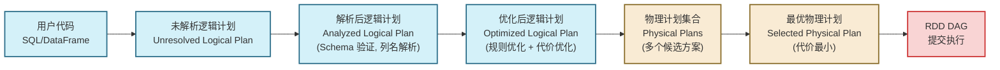

# 09 范式演进与回归：从 RDD 到 DataFrame & Dataset 的结构化跃迁

> [!abstract] 摘要
> 本专栏用八篇文章深入解析了 RDD 的方方面面：不可变性、五大属性、惰性求值、依赖分类、血缘容错、Iterator 模型、分区器、缓存机制。这一切构成了 Spark 的"地基"。本文是专栏的收尾篇，视角从微观回到宏观，回答一个重要问题：**既然 RDD 如此精妙，为什么 Spark 还要在其之上再构建 DataFrame 和 Dataset 这两套高层 API？RDD 的局限性究竟在哪里？** 本文将完整推导：RDD 的"黑盒"困境 → Project Tungsten 如何用二进制内存管理打破 JVM 限制 → Catalyst 优化器如何将用户代码转化为关系代数并进行优化 → DataFrame/Dataset 的 Encoder 机制 → 高层 API 的性能为何能超越等效的 RDD 代码 → 以及 RDD 在现代 Spark 架构中的真实定位与无可替代的价值。

---

## 第 1 章 RDD 的"黑盒"困境：优雅抽象的代价

### 1.1 RDD 对数据结构一无所知

RDD 是一个泛型容器：`RDD[T]` 中的 `T` 可以是任何类型——`String`、`Int`、自定义的 `case class`，甚至是一个 `Map[String, Any]`。这种设计给了用户极大的灵活性，但同时对 Spark 引擎造成了一个根本性的信息屏障。

当你执行：
```scala
rdd.filter(person => person.age > 18)
```

Spark 引擎看到的是：一个接受 `T` 返回 `Boolean` 的黑盒函数。引擎不知道：
- `T` 的内部结构是什么（有哪些字段，各自的类型）
- `person.age` 这个字段访问的语义是什么（是对年龄的过滤）
- 这个 filter 操作在数据管道中的位置是否可以被优化（比如是否可以下推到数据源）

这种"黑盒"特性直接导致了两大性能损失：

### 1.2 无法进行查询优化

数据库系统发展了几十年的查询优化技术，如谓词下推（Predicate Pushdown）、列裁剪（Column Pruning）、Join 重排序（Join Reordering）等，全部依赖于引擎能够"理解"查询的语义——即操作的是哪些列、过滤条件是什么、Join 的条件是什么。

在 RDD 模式下，这些优化一个都无法实施：
- **谓词下推**：若你从 Parquet 文件读取数据，只需要 `age > 18` 的行，理想情况下应该在读取 Parquet 文件时就过滤掉不需要的 Row Group。但 `rdd.filter(person => person.age > 18)` 的过滤条件是一个 Scala 函数，引擎无法分析其语义，只能先读取所有数据，再执行过滤。
- **列裁剪**：若你只需要 `name` 和 `age` 两列，理想情况下 Parquet 读取时应该只读这两列（Parquet 是列式存储，可以跳过不需要的列）。但引擎不知道你只需要这两列。

**量化对比**：对于一个有 100 列的宽表，只查询 2 列的场景：
- RDD 模式：读取 100 列全量数据，再在 `map` 中提取 2 列，无谓读取和传输了 98 列的数据
- DataFrame 模式：Catalyst 自动识别只需要 2 列，Parquet 读取时只读这 2 列，I/O 量减少 98%

### 1.3 Java 对象序列化的性能税

RDD 在 Shuffle 和缓存时，数据以 Java 对象形式存储和序列化：

**内存开销问题**（已在第 08 篇详细分析）：一个 10 字节的字符串 Key 在 JVM 中占用约 60-80 字节（对象头、字符数组对象、字符数据），有效载荷率不足 20%。

**序列化性能问题**：Java 序列化（ObjectOutputStream）需要反射分析对象结构，性能极差。即使使用 Kryo 序列化，也需要将对象转换为字节再转换回来，存在 CPU 开销。

**GC 压力问题**：大量 Java 对象在 JVM 堆上的创建和销毁，引发 Young GC，当对象晋升到 Old Gen 时触发 Full GC，导致 STW 停顿。

---

## 第 2 章 Project Tungsten：用工程手段突破 JVM 的天花板

Databricks 在 Spark 1.4 启动的 Project Tungsten 是 Spark 历史上最重要的性能工程项目之一，其核心目标是：**让 Spark 的执行效率逼近手写的 C/C++ 代码**。

### 2.1 二进制内存管理：抛弃 Java 对象模型

Tungsten 引入了 `UnsafeRow` 格式，用紧凑的二进制表示替代 Java 对象：

```
UnsafeRow 的内存布局（以 schema: (id: Long, name: String, age: Int) 为例）：

偏移量  长度    内容
0       8       空值位图（bit 0=id是否null, bit 1=name是否null, bit 2=age是否null）
8       8       id 的值（Long，固定8字节）
16      8       name 的偏移量+长度（高32位=偏移量，低32位=长度）
24      4       age 的值（Int，固定4字节）
28      4       对齐填充
32      ?       name 的实际字节数据（变长区）
```

与 Java 对象相比：
- **无对象头开销**：Java 对象头通常 12-16 字节，`UnsafeRow` 中每个"对象"没有额外头部
- **固定偏移量访问**：通过 `baseObject + fieldOffset` 直接用 `Unsafe.getLong/getInt` 访问字段值，比反射快几个数量级
- **内存连续性**：多行数据在内存中连续排列，CPU Cache Line 利用率高

```scala
// UnsafeRow 的字段访问（内部实现，非用户代码）
def getLong(ordinal: Int): Long = {
  // 直接通过偏移量访问内存，无反射，无类型检查
  Platform.getLong(baseObject, baseOffset + ordinal * 8L)
}
```

### 2.2 全阶段代码生成（Whole-Stage Code Generation）

在 RDD 的迭代器模型中，即使是简单的 `filter + map` 操作，也需要通过虚函数分发（`Iterator.next()`、`Iterator.hasNext()`）实现，每次调用都有函数调用开销和 JVM 字节码解释开销。

Tungsten 在运行时**动态生成 Java 源代码，并使用 Janino 编译器即时编译为字节码**，将整个 Stage 的所有操作合并为一个紧凑的 `while` 循环：

以 `filter + map + sum` 为例，生成的代码大致如下：

```java
// Spark 运行时动态生成的代码（示意）
public Object generate(Object[] references) {
  return new GeneratedIteratorForCodegenStage1(references);
}

final class GeneratedIteratorForCodegenStage1 {
  long sum = 0L;

  void processNext() {
    while (inputIterator.hasNext()) {
      InternalRow row = (InternalRow) inputIterator.next();
      long age = row.getLong(1);          // 直接按偏移量读取字段
      if (age > 18) {                     // filter 条件内联
        long value = row.getLong(2);      // 读取需要的字段
        sum += value;                     // sum 操作内联
      }
    }
  }
}
```

这段生成的代码：
- **消除了所有虚函数调用**：不再有 `Iterator.next()` 的虚函数分发
- **消除了装箱/拆箱**：`Long` 值直接操作，不包装为 `java.lang.Long` 对象
- **编译器可以内联优化**：JIT 编译器可以对这段简单的循环进行激进优化（SIMD 指令、寄存器分配优化等）

这使得 Spark SQL 的执行效率在简单查询场景下接近手写 Java 代码。

---

## 第 3 章 Catalyst 优化器：从用户代码到最优物理计划

### 3.1 Catalyst 的定位：查询优化器而非执行引擎

Catalyst 是 Spark SQL 的查询优化器，其职责是：接收用户写的 SQL 或 DataFrame/Dataset 代码，生成一个最优的物理执行计划（Physical Plan），然后将该物理计划转化为 RDD DAG 提交给 Spark 核心执行。

Catalyst 本身不执行任何数据操作，它只是在"纸上"推演如何最优地组织计算，然后将结论翻译成 RDD。

### 3.2 四阶段优化流程



**阶段一：解析（Analysis）**

将未解析的逻辑计划与 Catalog（元数据存储，包含表结构、列类型等）结合，解析所有列名和表名：
- 验证 `df.select("age")` 中的 `age` 是否存在
- 确定 `age` 的类型（如 `IntegerType`），用于后续类型推断
- 解析 `*` 通配符为具体的列列表

**阶段二：逻辑优化（Logical Optimization）**

Catalyst 应用一组基于规则（Rule-Based Optimization, RBO）的转换：

- **谓词下推（Predicate Pushdown）**：
  ```
  原始：Filter(age > 18, Scan(users))
  优化：Scan(users, predicate: age > 18)
  效果：Parquet/ORC 读取时直接过滤，减少 I/O
  ```

- **列裁剪（Column Pruning）**：
  ```
  原始：Project(name, Scan(users, columns: *))
  优化：Project(name, Scan(users, columns: name))
  效果：只读取需要的列，对列式存储格式效果显著
  ```

- **常量折叠（Constant Folding）**：
  ```
  原始：Filter(1 + 1 > 2, ...)
  优化：Filter(false, ...)  → 直接返回空结果
  ```

- **Join 重排序（Join Reorder）**（代价估算模型介入）：
  对于多表 Join，通过统计信息（行数、列基数）估算不同 Join 顺序的代价，选择最优顺序（通常先 Join 小表）。

**阶段三：物理计划生成**

对于同一个逻辑计划，可能有多种物理实现：
- Join 可以用 BroadcastHashJoin（小表广播）、SortMergeJoin（两表都大）、或 ShuffleHashJoin
- Aggregation 可以用 HashAggregation 或 SortAggregation

Catalyst 通过代价模型估算每种实现的开销，选择最优方案。

### 3.3 Catalyst 与 RDD 的关系

**最终生成的物理计划仍然翻译为 RDD DAG**。Catalyst 是"规划者"，RDD 是"执行者"。

```
df.filter($"age" > 18).groupBy($"city").agg(count("*"))

→ Catalyst 优化后的物理计划：
    HashAggregate(city, count)
      ← Exchange(HashPartitioning(city))   ← Shuffle（宽依赖）
        ← HashAggregate(city, partial_count)  ← Map 端预聚合
          ← Filter(age > 18)
            ← FileScan(users, columns: [city, age], predicate: age > 18)

→ 翻译为 RDD DAG：
    ShuffledRDD[4]
      ← MapPartitionsRDD[3]  (Map 端预聚合 + filter)
        ← HadoopRDD[0]       (FileScan)
```

Catalyst 生成的 `MapPartitionsRDD` 中，`compute` 函数是 Tungsten 代码生成器生成的 Java 代码，而非用户的 Lambda 函数——这就是为什么 DataFrame 操作的性能往往优于等效的 RDD 操作。

---

## 第 4 章 DataFrame 与 Dataset：两种抽象层次的权衡

### 4.1 三种 API 的本质差异

| 维度 | RDD[T] | DataFrame | Dataset[T] |
| :--- | :--- | :--- | :--- |
| **数据表示** | 强类型 Java/Scala 对象 | 无类型 `Row`（运行时类型） | 强类型 `case class`（编译时类型） |
| **Schema 感知** | 无（黑盒） | 有（`StructType` 描述列结构） | 有（通过 `Encoder` 描述） |
| **优化引擎** | 无 | Catalyst + Tungsten | Catalyst + Tungsten |
| **编译期安全** | 是（类型系统） | 否（列名拼写错误运行时报错） | 是（编译器检查列名和类型） |
| **序列化** | Java/Kryo | Tungsten（高效二进制） | Tungsten Encoder |
| **使用语言** | Scala/Java/Python/R | 所有语言 | 主要 Scala/Java |

### 4.2 Encoder：Dataset 的关键设计

`Encoder[T]` 是 Dataset API 的核心——它定义了如何在 JVM 对象（`T`）和 Spark 内部的 `UnsafeRow` 二进制格式之间互相转换：

```scala
// Encoder 的抽象（简化）
trait Encoder[T] extends Serializable {
  def schema: StructType          // 描述 T 的结构
  def clsTag: ClassTag[T]         // 运行时类型信息
  // 内部还包含序列化/反序列化的代码生成逻辑
}
```

对于 Scala `case class`，`Encoder` 由编译时宏（macro）自动生成：
```scala
case class Person(name: String, age: Int)
implicit val personEncoder = Encoders.product[Person]
// 编译器自动分析 Person 的字段，生成高效的 UnsafeRow ↔ Person 转换代码
```

**关键优化**：Dataset 在执行大多数操作时，数据始终以 `UnsafeRow` 格式在内存中存储，只有在用户代码需要访问字段时（如 `ds.filter(p => p.age > 18)`），才将 `UnsafeRow` 反序列化为 `Person` 对象。对于 Catalyst 可以理解的操作（如 `ds.filter($"age" > 18)`），全程保持 `UnsafeRow` 格式，避免任何 Java 对象的创建。

### 4.3 什么时候 Dataset 比等效 RDD 代码慢？

理解了上述优化机制，就能识别 Dataset 性能劣化的场景：

**使用 Lambda 函数**：
```scala
// 这个写法会绕过 Catalyst，退化为 RDD 风格执行
ds.filter(person => person.age > 18)  // Lambda：Catalyst 无法分析，需要反序列化为 Person 再调用 Lambda
// 等效但性能更好的写法：
ds.filter($"age" > 18)  // 列表达式：Catalyst 可以分析并下推
```

**复杂的 UDF（User Defined Function）**：
```scala
spark.udf.register("myFunc", (age: Int) => age > 18)
df.filter("myFunc(age)")
// UDF 对 Catalyst 仍然是黑盒，无法优化，且有反序列化开销
```

---

## 第 5 章 RDD 的真实定位：现代 Spark 架构中的"执行层基础"

### 5.1 RDD 是 Spark 所有 API 的物理执行载体

一个经常被忽视的事实：**无论你使用 SQL、DataFrame 还是 Dataset，最终执行的都是 RDD**。

Catalyst 的物理计划最终通过 `SparkPlan.execute()` 方法转化为 RDD：

```scala
// SparkPlan 基类
abstract class SparkPlan extends QueryPlan[SparkPlan] {
  // 每个 SparkPlan 节点都实现 doExecute()，返回 RDD[InternalRow]
  protected def doExecute(): RDD[InternalRow]
}

// 例如 FilterExec（对应 filter 操作）的实现：
case class FilterExec(condition: Expression, child: SparkPlan) extends UnaryExecNode {
  override protected def doExecute(): RDD[InternalRow] = {
    child.execute().mapPartitionsWithIndexInternal { (index, iter) =>
      // conditionFunction 是 Tungsten 代码生成器生成的函数
      val predicate = Predicate.create(condition, child.output)
      iter.filter { row => predicate.eval(row) }
    }
  }
}
```

这里返回的仍然是 `MapPartitionsRDD`，只不过 `compute` 函数是 Tungsten 生成的高效代码，而非用户的原始 Lambda。

### 5.2 RDD 的不可替代场景

在现代 Spark 开发实践中，以下场景 RDD API 是更合适甚至是唯一选择：

**场景一：非结构化数据处理**
```scala
// 处理二进制文件、图像数据、科学计算数据等
val imageRDD: RDD[Array[Byte]] = sc.binaryFiles("hdfs://images/").map(_._2.toArray())
// DataFrame 无法表达"一行 = 一张图片"的非结构化语义
```

**场景二：需要精确控制计算过程**
```scala
// 自定义 Partitioner、精确控制每个 Task 的数据分布
rdd.partitionBy(new CustomPartitioner(numPartitions, hotKeyMap))
// Catalyst 的物理规划对用户透明，无法注入自定义分区逻辑
```

**场景三：底层框架和库开发**
```scala
// GraphX（图计算库）基于 RDD 构建
// Spark Streaming 的低层 DStream 基于 RDD
// 开发自定义数据源时，通常需要实现到 RDD 层面
```

**场景四：迁移旧代码或与非结构化逻辑集成**
```scala
// 复杂的状态机逻辑，难以用声明式 SQL 表达
rdd.mapPartitions { iter =>
  val stateMachine = new ComplexStateMachine()
  iter.flatMap(stateMachine.process)  // 有状态的流式处理
}
```

### 5.3 三套 API 的选择策略

在实际工程中，三套 API 往往混合使用：

```
DataFrame/SQL                 Dataset[T]               RDD[T]
     │                            │                       │
结构化查询、ETL             类型安全的结构化操作      非结构化、底层控制
聚合统计、Join              机器学习特征工程          图计算、自定义算法
数据仓库操作                批量推理                  二进制处理
（Catalyst 优化最充分）      （类型安全 + 优化）       （最大灵活性）
```

**实践建议**：
1. **优先使用 DataFrame/SQL**：对结构化数据的绝大多数操作，DataFrame 的 Catalyst 优化（谓词下推、列裁剪、代价优化）会带来显著的性能提升，且代码简洁
2. **对类型安全有要求时使用 Dataset**：Scala 开发中，`Dataset[CaseClass]` 提供了编译期类型检查，减少运行时错误
3. **仅在必要时使用 RDD**：当遇到 DataFrame/Dataset 无法表达的逻辑，或需要精确底层控制时，切换到 RDD
4. **三套 API 可以互转**：`rdd.toDF()`, `df.rdd`, `ds.rdd` 等方法实现无缝切换，可以在同一个作业中混合使用

---

## 第 6 章 从 RDD 到 Spark 4.x 的演进轨迹

### 6.1 API 演进时间线

| 版本 | 重要变化 |
| :--- | :--- |
| Spark 1.0 | RDD API 稳定版本发布 |
| Spark 1.3 | DataFrame API 引入（从 SchemaRDD 演化） |
| Spark 1.4 | Project Tungsten 启动（堆外内存、代码生成） |
| Spark 1.6 | Dataset API 引入（强类型 + Encoder） |
| Spark 2.0 | DataFrame 统一为 `Dataset[Row]`，Encoder 成熟，引入 Structured Streaming |
| Spark 2.2 | Cost-Based Optimizer（代价优化）加入 Catalyst |
| Spark 3.0 | Adaptive Query Execution（AQE）正式发布（动态调整 Shuffle 分区数、动态 Join 策略） |
| Spark 3.2 | Pandas API on Spark，进一步降低数据科学使用门槛 |
| Spark 4.0 | Spark Connect（客户端/服务端分离），Python-first 方向 |

### 6.2 Adaptive Query Execution（AQE）：运行时的 Catalyst 优化

Spark 3.0 引入的 AQE 是 Catalyst 优化器的重要补充——它允许在**运行时**（而非计划期）根据实际数据的统计信息调整执行计划：

**动态调整 Shuffle 分区数**：
- 静态规划时 `spark.sql.shuffle.partitions = 200`
- AQE 在 Shuffle 完成后，根据实际输出数据量，自动合并过小的分区
- 避免了大量空任务或极小任务的调度开销

**动态 Join 策略调整**：
- 静态规划时，由于缺乏精确的表大小信息，可能选择了 SortMergeJoin
- AQE 在 Shuffle 完成后，发现某张表实际只有 5MB，自动切换为 BroadcastHashJoin
- 消除了一次不必要的 Shuffle

**动态倾斜处理（Skew Join Optimization）**：
- AQE 检测到某个 Shuffle 分区数据量异常大（倾斜）
- 自动将该分区拆分为多个子分区，并行处理
- 无需用户手动加盐处理数据倾斜

```scala
// 开启 AQE
spark.conf.set("spark.sql.adaptive.enabled", "true")
spark.conf.set("spark.sql.adaptive.coalescePartitions.enabled", "true")
spark.conf.set("spark.sql.adaptive.skewJoin.enabled", "true")
```

---

## 第 7 章 专栏总结：RDD 是理解 Spark 的根基

### 7.1 九篇文章构建的知识体系

回顾本专栏的完整逻辑链：

```
01. 什么是 RDD → 理解 Spark 相比 MapReduce 的根本突破
        ↓
02. 五大核心属性 → 理解 RDD 的"逻辑接口"本质
        ↓
03. 惰性求值与 DAG → 理解"为什么" Transformation 不立即执行
        ↓
04. 宽/窄依赖 → 理解 Stage 划分的物理机制和 Shuffle 代价
        ↓
05. 血缘与容错 → 理解"以计算换存储"的容错哲学及其边界
        ↓
06. Iterator 模型 → 理解数据在单个 Task 内的微观流动机制
        ↓
07. 分区器 → 理解数据在集群间的宏观分布与数据倾斜
        ↓
08. 缓存与持久化 → 理解如何在内存中"锁住"计算结果
        ↓
09. 范式演进 → 理解 RDD 的局限性与 DataFrame/Dataset 的工程突破
```

### 7.2 为什么深入理解 RDD 仍然必要？

在 Spark 4.x 的今天，绝大多数生产代码都在使用 DataFrame/SQL，直接操作 RDD 的场景越来越少。但以下几个理由说明 RDD 的深入理解仍然不可或缺：

**理由一：调优需要穿透抽象层**

当一个 DataFrame 作业出现性能问题时（数据倾斜、Shuffle 过多、GC 频繁），调优路径不可避免地需要穿透 DataFrame API，理解底层的 Stage 划分、Shuffle 行为和内存管理。而这些都是 RDD 层面的概念。

**理由二：理解执行计划需要 RDD 知识**

`df.explain(true)` 输出的物理执行计划中，`ShuffleExchange`、`MapPartitions`、`HashAggregate` 等算子，本质上都对应 RDD 层面的 `ShuffledRDD`、`MapPartitionsRDD` 等。没有 RDD 知识，执行计划就是一堆看不懂的术语。

**理由三：Spark 的核心设计哲学不会变**

无论 API 如何演进，分布式计算的本质不变：数据分区、任务并行、网络通信（Shuffle）、容错恢复。RDD 用最简洁的形式抽象了这些本质，理解 RDD 就是理解分布式计算的核心命题。

---

> [!info] 专栏参考文献
> - Zaharia, M., et al. "Resilient Distributed Datasets: A Fault-Tolerant Abstraction for In-Memory Cluster Computing." NSDI 2012. （RDD 的原始论文）
> - Armbrust, M., et al. "Spark SQL: Relational Data Processing in Spark." SIGMOD 2015. （DataFrame/Catalyst 的原始论文）
> - Armbrust, M., et al. "Scaling Spark in the Real World: Performance and Usability." VLDB 2015. （Tungsten Project）
> - Zaharia, M., et al. "Apache Spark: A Unified Engine for Big Data Processing." Communications of the ACM 2016.

---

> [!note] 思考题（专栏终极题）
> 1. 执行 `spark.read.parquet("hdfs://data/").filter($"age" > 18).select("name", "city").groupBy("city").count()` 时，Catalyst 会进行哪些优化？Parquet 文件实际读取了哪些列？生成的 RDD DAG 有几个 Stage？
> 2. 同样的 WordCount 逻辑，用 RDD 实现 vs 用 DataFrame 实现，在 100 亿行数据上性能差异可能有多大？差异的根本来源是什么？
> 3. Spark 的 AQE（自适应查询执行）本质上是对 Catalyst 的"运行时补丁"。它能解决静态计划的哪些核心缺陷？有哪些场景是 AQE 也无法优化的？
