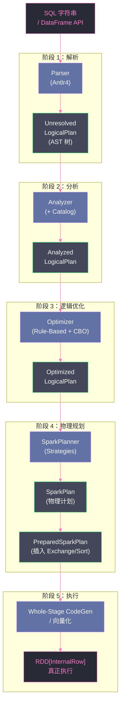

# 01 Spark SQL 全局架构：从 SQL 文本到 RDD 执行的完整旅程

## 摘要

大多数 Spark 从业者每天都在写 SQL 或 DataFrame 代码，却对背后发生的事情知之甚少——为什么同一个查询有时快有时慢？为什么加了一行 `filter` 性能反而提升了？为什么 Spark 会自动选择 Broadcast Join 而不是 Sort Merge Join？这些问题的答案都藏在 Spark SQL 引擎的执行管道里。本文以"一条 SQL 语句从输入到执行"为主线，系统拆解 Spark SQL 的五阶段处理管道：**解析（Parse）→ 分析（Analyze）→ 逻辑优化（Logical Optimize）→ 物理规划（Physical Plan）→ 代码生成与执行（CodeGen & Execute）**，以及 DataFrame / Dataset / SQL 三种 API 如何殊途同归地汇入同一个引擎。理解这条主线，是后续深入每个阶段（Catalyst 优化规则、CBO、AQE、CodeGen、向量化）的前提。

---

## 第 1 章 为什么需要一个"查询引擎"

### 1.1 从 RDD 到 SQL：一次重大的抽象跃迁

Spark 最初的编程模型是 RDD（Resilient Distributed Dataset）。用户直接操作 RDD，告诉 Spark "怎么做"：先 `filter`，再 `map`，再 `reduceByKey`——这是一种**命令式（Imperative）**编程模型。命令式模型的优点是灵活、精确，但有一个根本性的缺陷：**Spark 引擎对用户意图一无所知，无法优化**。

举一个具体例子。假设用户写了以下 RDD 代码：

```scala
val result = rdd
  .map(row => (row.userId, row.amount))
  .filter(_._2 > 100)
  .reduceByKey(_ + _)
```

Spark 必须严格按照这个顺序执行：先 map，再 filter，再 reduce。但实际上，如果先 filter 再 map，可以减少 map 处理的数据量，性能更好。Spark 完全不知道这一点，因为它看到的是一串函数调用，而不是"用户的意图"。

Spark SQL 引入了**声明式（Declarative）**编程模型：用户描述"要什么"（SELECT、FROM、WHERE、GROUP BY），而不是"怎么做"。引擎理解了用户的意图，就可以在背后做任意的优化——只要最终结果正确。

这个思路并不新鲜，关系型数据库（如 MySQL、PostgreSQL）几十年前就这样做了。Spark SQL 的创新在于：**将关系型数据库的查询优化技术（谓词下推、列裁剪、Join Reordering 等）引入了分布式大数据处理场景**，并在此基础上增加了分布式特有的优化（如 Broadcast Join、Shuffle 优化）。

### 1.2 DataFrame / Dataset / SQL：三种 API，一个引擎

Spark SQL 提供三种使用方式，但底层共享同一套执行引擎：

**SQL 字符串**：
```sql
spark.sql("SELECT userId, SUM(amount) FROM orders WHERE amount > 100 GROUP BY userId")
```

**DataFrame API**：
```scala
spark.read.table("orders")
  .filter($"amount" > 100)
  .groupBy("userId")
  .agg(sum("amount"))
```

**Dataset API（类型安全）**：
```scala
case class Order(userId: String, amount: Double)
spark.read.table("orders").as[Order]
  .filter(_.amount > 100)
  .groupByKey(_.userId)
  .mapGroups((userId, orders) => (userId, orders.map(_.amount).sum))
```

这三种方式最终都会生成同一种中间表示：**逻辑计划（Logical Plan）**。SQL 字符串通过解析器（Parser）转为逻辑计划；DataFrame API 的每个操作（`filter`、`groupBy`、`agg`）直接构建逻辑计划的一个节点；Dataset API 混合了类型化算子和 SQL 引擎。

一旦进入逻辑计划，三种 API 的执行路径完全相同：经历同样的优化规则、同样的物理规划、同样的代码生成。这就是为什么 DataFrame API 与 SQL 字符串的性能没有差异——它们是同一件事的两种写法。

> [!info] 核心概念
> 为什么 Dataset API（类型安全版）的某些操作比 DataFrame/SQL 慢？因为当用户用 lambda 函数操作 Dataset（如 `.filter(_.amount > 100)`），Spark 无法将这个 lambda 转为逻辑计划节点——它只是一段不透明的 JVM 代码。此时 Spark 退化为 RDD 执行模式，失去了 Catalyst 优化的所有收益。反之，如果用 Dataset 的 SQL 风格 API（如 `.filter($"amount" > 100)`），仍然走 Catalyst 路径，性能与 DataFrame/SQL 相同。

---

## 第 2 章 Spark SQL 的五阶段执行管道

Spark SQL 的查询处理分为五个阶段，每个阶段都将查询从一种表示形式转换为另一种表示形式：



### 2.1 阶段一：解析（Parse）

**解析**将 SQL 文本转为**抽象语法树（AST）**，再转为 Spark 的 **Unresolved LogicalPlan**（未分析的逻辑计划）。"Unresolved"是指：此时计划中的列名、表名都只是字符串标识符，尚未被解析为实际的数据类型或存储位置。

Spark SQL 使用 **[[Antlr4]]** 作为语法解析框架，语法规则定义在 `SqlBase.g4` 文件中（Spark 源码目录 `sql/catalyst/src/main/antlr4/`）。对于一条 SQL：

```sql
SELECT userId, SUM(amount) FROM orders WHERE amount > 100 GROUP BY userId
```

Parser 会生成如下逻辑计划树（伪代码表示）：

```
Aggregate [userId], [userId, sum(amount)]
└── Filter [amount > 100]
    └── UnresolvedRelation [orders]
```

注意：此时 `userId`、`amount` 都是 `UnresolvedAttribute`（未解析的属性），`orders` 是 `UnresolvedRelation`（未解析的表引用）。引擎还不知道 `orders` 表有哪些列、`amount` 是什么类型。

**DataFrame API 跳过解析阶段**：当用户调用 `df.filter($"amount" > 100)` 时，`$"amount" > 100` 直接构造一个 `Filter` 节点，并不需要 SQL 解析器。所以 DataFrame API 没有解析开销，直接进入分析阶段。

### 2.2 阶段二：分析（Analyze）

**分析**将 Unresolved LogicalPlan 中的"字符串引用"全部解析为"有类型的、有来源的"引用，产出 **Analyzed LogicalPlan**。

分析由 **Analyzer** 完成，它依赖 **Catalog**（元数据存储）来解析表名和列名：

- `UnresolvedRelation [orders]` → `orders` 表的 `LogicalRelation`（知道该表的存储位置、Schema、分区信息）
- `UnresolvedAttribute [amount]` → `orders.amount: DoubleType`（知道列的数据类型和来源表）
- `UnresolvedFunction [sum]` → `Sum(amount): DoubleType`（确认聚合函数及其返回类型）

Analyzer 的工作方式是通过**规则（Rule）**逐个解析树中的节点。每条规则是一个模式匹配和转换：遇到 `UnresolvedRelation`，就去 Catalog 查找；遇到 `UnresolvedAttribute`，就在当前作用域中解析其来源。规则被组织为多个**批次（Batch）**，每个批次内规则被反复应用直到计划不再变化（固定点迭代）。

**Catalog 是什么**：Catalog 是 Spark SQL 的元数据服务，存储数据库名、表名、列名与类型、分区信息、统计信息等。默认使用内存 Catalog（`SessionCatalog`），在生产中通常对接外部 Hive Metastore 或 AWS Glue 等。

> [!note] 设计哲学
> 将"解析"与"分析"分为两个阶段，是 Catalyst 设计的重要决策。好处在于：解析是纯语法层面的（不依赖任何运行时状态），分析是语义层面的（依赖 Catalog）。两个阶段分离后，可以对解析结果做缓存（相同 SQL 的 AST 可以复用），也使得错误诊断更清晰（"表不存在"是分析错误，"语法错误"是解析错误）。

### 2.3 阶段三：逻辑优化（Logical Optimize）

**逻辑优化**对 Analyzed LogicalPlan 施加一系列等价变换，产出 **Optimized LogicalPlan**。

优化由 **Optimizer** 完成，同样基于规则体系（**Rule-Based Optimizer，RBO**）和代价模型（**Cost-Based Optimizer，CBO**）：

**RBO 规则示例（第 03 篇详解）**：
- **谓词下推（Predicate Pushdown）**：将 Filter 节点移到尽量靠近数据源的位置，提早减少数据量
- **列裁剪（Column Pruning）**：删除查询中未使用的列，减少数据传输量
- **常量折叠（Constant Folding）**：将 `1 + 2` 直接计算为 `3`，不留到执行时
- **空值传播（Null Propagation）**：`null + x` = `null`，可以简化表达式

**CBO 优化示例（第 04 篇详解）**：
- **Join Reordering**：根据各表的统计信息（行数、列 NDV 等），调整多表 Join 的执行顺序，优先 Join 小表

以一个具体例子感受优化的效果：

```sql
SELECT a.id, b.name
FROM large_table a
JOIN small_table b ON a.fk = b.id
WHERE a.ts > '2024-01-01'
  AND b.name LIKE 'active%'
```

**优化前的逻辑计划**：
```
Project [a.id, b.name]
└── Filter [a.ts > '2024-01-01' AND b.name LIKE 'active%']
    └── Join [a.fk = b.id]
        ├── Scan [large_table]
        └── Scan [small_table]
```

**优化后的逻辑计划**（谓词下推后）：
```
Project [a.id, b.name]
└── Join [a.fk = b.id]
    ├── Filter [a.ts > '2024-01-01']
    │   └── Scan [large_table]（只扫 id, fk, ts 列）
    └── Filter [b.name LIKE 'active%']
        └── Scan [small_table]（只扫 id, name 列）
```

Filter 被下推到 Join 之前各自的数据源处，减少了 Join 处理的数据量；列裁剪后只读取需要的列。这两个优化共同作用，可能将数据扫描量减少 90% 以上。

### 2.4 阶段四：物理规划（Physical Plan）

**物理规划**将抽象的逻辑计划翻译为可以执行的物理算子（`SparkPlan`），需要做出两类决策：

**决策一：选择具体的算子实现**

逻辑计划中的 `Join` 节点是抽象的，物理计划必须选择一个具体的 Join 实现：
- `BroadcastHashJoinExec`：将小表广播到所有 Executor，用 HashMap 做 probe
- `SortMergeJoinExec`：两端都排序后做归并，适合大表与大表
- `ShuffledHashJoinExec`：将一侧构建 HashMap，另一侧探测
- `BroadcastNestedLoopJoinExec`：嵌套循环，用于非等值 Join
- `CartesianProductExec`：笛卡尔积

选择哪种 Join 策略，取决于表的大小、是否有等值 Join 条件、是否开启 AQE 等因素（第 05 篇详解）。

**决策二：插入数据交换节点（Exchange）**

物理计划中需要插入 `ShuffleExchangeExec`（Shuffle）和 `SortExec`（排序）节点，确保上下游算子的数据分区方式兼容（如 SortMerge Join 要求两侧数据按 Join Key 分区且有序）。

**`EnsureRequirements` 规则**：这是一个在物理计划层面运行的规则，检查每个物理算子对其子节点的数据分区和排序要求（`requiredChildDistribution`、`requiredChildOrdering`），如果不满足，自动插入 `Exchange` 或 `Sort`。这也是为什么有时用户加一个 `groupBy` 就引入了一次 Shuffle，而两个相邻的 `groupBy`（相同 Key）只有一次 Shuffle——引擎识别到分区已满足，跳过了第二次 `Exchange`。

物理规划完成后，得到的是一棵 `SparkPlan` 树，其中每个节点都是一个具体的物理算子。

### 2.5 阶段五：代码生成与执行（CodeGen & Execute）

**代码生成**是 Spark SQL 性能的关键所在。物理计划树最终通过两种方式转化为可执行代码：

**Whole-Stage CodeGen（第 07 篇详解）**：将整棵物理计划子树（多个算子）融合成一段 JVM 字节码，消灭算子之间的虚方法调用开销（Volcano 迭代器模型的"调用税"）。

**向量化执行（第 08 篇详解）**：以列为单位批量处理数据（`ColumnarBatch`），替代逐行处理（`InternalRow`），利用 CPU 的 SIMD 指令集并行处理多行数据。

最终，物理计划通过 `execute()` 方法转化为 `RDD[InternalRow]`（或 `RDD[ColumnarBatch]`），提交给 Spark 的调度系统（[[DAGScheduler]]、[[TaskScheduler]]）执行。

---

## 第 3 章 三种 API 的内部差异

### 3.1 SQL 字符串的路径

```scala
val result = spark.sql("""
  SELECT userId, SUM(amount) as total
  FROM orders
  WHERE amount > 100
  GROUP BY userId
""")
```

**完整路径**：
1. `spark.sql()` 调用 `SessionState.sqlParser.parsePlan(sql)` → `Unresolved LogicalPlan`
2. 经过 Analyzer → Analyzed LogicalPlan
3. 经过 Optimizer → Optimized LogicalPlan
4. 经过 SparkPlanner → SparkPlan（物理计划）
5. `EnsureRequirements` 插入 Exchange/Sort
6. `WholeStageCodegenExec` 包装物理计划
7. 调用 `plan.execute()` → `RDD[InternalRow]`

### 3.2 DataFrame API 的路径

DataFrame 的每个操作对应逻辑计划的一个节点构建：

```scala
val df = spark.read.table("orders")   // LogicalRelation
  .filter($"amount" > 100)           // Filter(amount > 100, LogicalRelation)
  .groupBy("userId")                 // 准备 Aggregate 的 groupingExprs
  .agg(sum("amount").as("total"))    // Aggregate([userId], [sum(amount)], Filter(...))
```

每次调用 `.filter()`、`.groupBy()`、`.agg()` 都只是在构建逻辑计划树，**没有任何实际计算**。直到调用 Action（如 `.show()`、`.write.save()`、`.count()`）时，才触发从 Analyzed LogicalPlan 开始的编译与执行流程。

**惰性求值（Lazy Evaluation）的价值**：惰性求值不只是"推迟执行"，更重要的是它使得在执行前能看到完整的查询计划，从而做整体优化（如将多个 `filter` 合并）。如果每个操作立即执行，就无法做跨操作的优化。

### 3.3 Dataset API 的两种模式

Dataset API 提供类型安全的访问，但有两种操作风格，性能差异显著：

**风格一：类 SQL 操作（走 Catalyst，高性能）**：
```scala
case class Order(userId: String, amount: Double)
val ds = spark.read.table("orders").as[Order]

// 这些操作仍然走 Catalyst 优化器
ds.filter($"amount" > 100)
  .groupBy($"userId")
  .agg(sum($"amount"))
```

**风格二：函数式操作（退化为 RDD，丧失优化）**：
```scala
// 这些操作中的 lambda 无法被 Catalyst 优化
ds.filter(order => order.amount > 100)  // lambda，退化为 RDD
  .map(order => (order.userId, order.amount))  // lambda，退化为 RDD
```

当使用 lambda 函数时，Spark 无法将其转为逻辑计划节点，必须将 Dataset 中的 `InternalRow` 反序列化为 JVM 对象（如 `Order` case class），执行 lambda，再序列化回去。这个序列化/反序列化（Encoder 的 `deserialize`/`serialize`）带来了显著的 CPU 开销，比 SQL/DataFrame 慢 2-5 倍。

> [!warning] 生产避坑
> 在 Spark SQL 场景下，**优先使用 DataFrame API 或 SQL 字符串**，而不是 Dataset 的 lambda 风格 API。Dataset 的类型安全优势只在编译期检查上，运行时并无收益，反而因为 Encoder 序列化带来性能损耗。如果需要类型安全，建议只在最终结果收集到 Driver（`collectAsList`）时转为强类型，中间的所有转换都用 DataFrame API 或 SQL 完成。

---

## 第 4 章 QueryExecution：管道的控制器

`QueryExecution` 是 Spark SQL 执行管道的核心控制器，封装了从 Analyzed LogicalPlan 到最终 RDD 的全部转化步骤。每个 DataFrame / SQL 查询都对应一个 `QueryExecution` 实例。

```scala
// 通过 DataFrame 的 queryExecution 属性可以查看每个阶段的计划
val df = spark.sql("SELECT userId, SUM(amount) FROM orders GROUP BY userId")

// 查看各阶段的计划（用于调试和调优）
println(df.queryExecution.logical)           // Analyzed LogicalPlan
println(df.queryExecution.optimizedPlan)     // Optimized LogicalPlan
println(df.queryExecution.sparkPlan)         // 未插入 Exchange 的物理计划
println(df.queryExecution.executedPlan)      // 最终物理计划（已插入 Exchange/Sort）

// EXPLAIN 命令等价于查看 executedPlan
df.explain(extended = true)
// 输出 Analyzed → Optimized → Physical 三个阶段的完整计划
```

**`QueryExecution` 的惰性属性**：`logical`、`optimizedPlan`、`executedPlan` 都是 `lazy val`，只在第一次访问时计算，后续访问直接返回缓存的结果。这确保了对同一个 DataFrame 多次调用 `queryExecution.executedPlan` 只编译一次。

**`QueryExecution.preparations` 规则链**：在物理计划（`sparkPlan`）转为最终执行计划（`executedPlan`）的过程中，有一批"准备"规则依次应用：

1. `EnsureRequirements`：插入 Exchange 和 Sort
2. `CollapseCodegenStages`：将多个算子合并为 `WholeStageCodegenExec`
3. `ReuseExchange`：复用相同 Exchange 节点（避免重复 Shuffle）
4. `ReuseSubquery`：复用相同子查询（避免重复计算）

---

## 第 5 章 TreeNode：Catalyst 的核心数据结构

### 5.1 为什么一切都是树

Catalyst 的查询优化本质上是**对树进行等价变换**。逻辑计划、物理计划、表达式，都是 `TreeNode` 的子类，构成树型结构。

`TreeNode[T]` 是 Catalyst 所有 AST 节点的基类，提供：
- `children: Seq[T]`：子节点列表
- `transform(rule: PartialFunction[TreeNode, TreeNode])`：后序遍历应用规则
- `transformUp`、`transformDown`：控制遍历方向

**规则（Rule）的本质**：一条优化规则就是一个 `PartialFunction`，接受一个树节点，返回等价但更优的树节点（或者原样返回，表示该规则不适用于此节点）：

```scala
// 谓词下推规则的简化伪代码
object PushPredicateThroughJoin extends Rule[LogicalPlan] {
  def apply(plan: LogicalPlan): LogicalPlan = plan.transform {
    case Filter(condition, Join(left, right, joinType, joinCondition)) =>
      // 分析 condition 中哪些谓词只涉及 left 的列，哪些只涉及 right 的列
      val (leftConditions, rightConditions, commonConditions) =
        splitConjunctivePredicates(condition, left, right)
      // 将各自的谓词下推到对应的子树
      val newLeft = leftConditions.foldLeft(left)(Filter(_, _))
      val newRight = rightConditions.foldLeft(right)(Filter(_, _))
      val remainingFilter = commonConditions.reduceLeft(And)
      Filter(remainingFilter, Join(newLeft, newRight, joinType, joinCondition))
  }
}
```

### 5.2 Expression、LogicalPlan、SparkPlan 的继承体系

Catalyst 的树节点分三大类：

**Expression（表达式）**：计算值的节点，如 `Literal(42)`、`Add(a, b)`、`EqualTo(a, b)`、`Sum(amount)`。表达式嵌套在 Plan 节点内，描述"如何计算某个值"。

**LogicalPlan（逻辑计划）**：描述"要做什么操作"，与具体执行无关：`Filter`、`Project`、`Join`、`Aggregate`、`Sort`、`Limit` 等。

**SparkPlan（物理计划）**：描述"具体怎么执行"，与 Spark 的执行引擎绑定：`BroadcastHashJoinExec`、`SortMergeJoinExec`、`HashAggregateExec`、`SortExec`、`ShuffleExchangeExec` 等。

---

## 第 6 章 SparkSession：SQL 引擎的统一入口

### 6.1 SparkSession 的内部组件

`SparkSession` 是 Spark 2.0+ 的统一入口，内部封装了多个关键组件：

```scala
class SparkSession {
  val sparkContext: SparkContext              // 底层 RDD 执行引擎
  lazy val sessionState: SessionState        // SQL 引擎状态（每个 Session 独立）
  lazy val sharedState: SharedState          // 跨 Session 共享状态（Catalog、缓存）
}

class SessionState {
  val catalog: SessionCatalog               // 元数据管理
  val sqlParser: ParserInterface            // SQL 解析器
  val analyzer: Analyzer                   // 分析器
  val optimizer: Optimizer                 // 优化器
  val planner: SparkPlanner                // 物理规划器
  val conf: SQLConf                        // SQL 配置（spark.sql.* 参数）
}
```

**Session 隔离性**：每个 `SparkSession` 有独立的 `sessionState`，意味着不同 Session 的配置（`spark.sql.shuffle.partitions` 等）、临时表、UDF 相互隔离。但底层的 `SparkContext`（负责调度和执行）是共享的——不同 Session 的作业会共享同一个 Executor 池。

### 6.2 通过 `explain` 命令观察执行管道

`explain` 是理解 Spark SQL 执行计划的最重要工具，第 11 篇将详解如何读懂执行计划。此处先介绍基本用法：

```scala
df.explain()                          // 只显示物理计划
df.explain(extended = true)           // 显示 Parsed → Analyzed → Optimized → Physical
df.explain("formatted")               // Spark 3.0+，格式化的物理计划（更易读）
df.explain("cost")                    // 带有代价估算的物理计划（CBO 信息）
df.explain("codegen")                 // 显示生成的 Java 代码（CodeGen 调试）
```

**通过 `EXPLAIN` SQL 命令等价操作**：
```sql
EXPLAIN EXTENDED SELECT userId, SUM(amount) FROM orders GROUP BY userId;
EXPLAIN FORMATTED SELECT userId, SUM(amount) FROM orders GROUP BY userId;
```

---

## 小结

Spark SQL 的五阶段执行管道是整个专栏的基础骨架：

- **解析（Parse）**：SQL 文本 → Unresolved LogicalPlan（AST 树，列/表名未解析）
- **分析（Analyze）**：对接 Catalog，解析列类型与来源 → Analyzed LogicalPlan
- **逻辑优化（Optimize）**：RBO 规则 + CBO 代价模型 → Optimized LogicalPlan（谓词下推、列裁剪等）
- **物理规划（Physical Plan）**：选择算子实现（如 Join 策略）+ 插入 Exchange/Sort → SparkPlan
- **执行（Execute）**：Whole-Stage CodeGen / 向量化 → RDD 提交调度系统

DataFrame/Dataset/SQL 三种 API 汇入同一管道，区别仅在于进入管道的"入口"不同。Dataset 的 lambda 风格操作绕过 Catalyst，退化为 RDD 执行，应尽量避免。

下一篇（第 02 篇）将深入阶段一和阶段二，讲解 Antlr4 Parser 的工作原理、`Unresolved LogicalPlan` 的树型结构、Analyzer 的 Resolution 规则体系，以及 Catalog 与 Hive Metastore 的集成方式。

---

> [!note] 思考题
> 1. Spark SQL 的五阶段执行管道中，哪个阶段是"不可跳过"的，哪些阶段可以被 AQE 在运行时重做？这种分层设计对错误处理意味着什么？
> 2. DataFrame API 和 SQL 字符串最终殊途同归，都转化为同一棵 LogicalPlan 树。那么 Dataset 的强类型检查是在哪个阶段失去的？什么情况下类型安全会在编译期而非运行期失效？
> 3. `QueryExecution` 的 `analyzed`、`optimized`、`sparkPlan` 字段都是惰性求值的。如果在生产代码中频繁调用 `df.queryExecution.optimizedPlan.toString`，会有什么隐患？

## 参考资料

- [Deep Dive into Spark SQL's Catalyst Optimizer（Databricks Blog, 2015）](https://www.databricks.com/blog/2015/04/13/deep-dive-into-spark-sqls-catalyst-optimizer.html)
- [What is the Catalyst Optimizer（Databricks Glossary）](https://www.databricks.com/glossary/catalyst-optimizer)
- Michael Armbrust 等：Spark SQL: Relational Data Processing in Spark（SIGMOD 2015）
- Apache Spark 源码：`org.apache.spark.sql.SparkSession`
- Apache Spark 源码：`org.apache.spark.sql.execution.QueryExecution`
- Apache Spark 源码：`org.apache.spark.sql.catalyst.optimizer.Optimizer`
