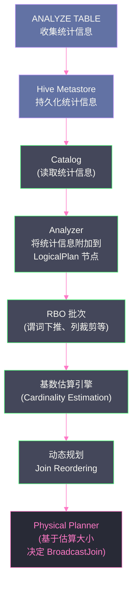

# 04 CBO 代价模型：统计信息驱动的执行计划选择

## 摘要

Rule-Based Optimizer（RBO）的局限性在于：它只看查询的"结构"，不看数据的"规模"。两张表做 Join，RBO 不知道哪张更大，无法决定哪张应该作为 Build 端（构建 Hash Table），哪张应该 Broadcast。当三张以上的表连接时，RBO 更是无从判断连接顺序——不同连接顺序的中间结果大小可能相差千倍。这就是 **Cost-Based Optimizer（CBO，基于代价的优化器）** 要解决的问题：通过收集表和列的**统计信息**（行数、列 NDV、最大/最小值、直方图），建立代价估算模型，量化不同执行计划的"代价"（CPU、I/O、内存），自动选择代价最低的计划。本文系统讲解 CBO 的工作原理：统计信息的收集机制（`ANALYZE TABLE`）、列直方图的构建与使用、各类算子的基数估算公式、Join Reordering 的动态规划算法，以及 CBO 在生产中的失效场景与应对策略。

---

## 第 1 章 RBO 的天花板：规则解决不了的问题

### 1.1 Join 顺序的代价差异

考虑一个三表 Join 场景：

```sql
SELECT a.id, b.name, c.value
FROM fact_table a          -- 10 亿行
JOIN dim_user b ON a.uid = b.id   -- 100 万行
JOIN dim_region c ON a.region = c.id  -- 200 行
```

不同连接顺序的中间结果规模：

**顺序一**：`fact_table JOIN dim_user` 先执行
- 中间结果：10 亿行（假设大部分用户存在，过滤效果弱）
- 再与 `dim_region`（200 行）连接：中间结果仍约 10 亿行
- 总 Shuffle 数据量：~20 亿行

**顺序二**：`fact_table JOIN dim_region` 先执行
- `dim_region` 只有 200 行，可以 Broadcast → **无 Shuffle**
- 再与 `dim_user`（100 万行）连接：`dim_user` 也可以 Broadcast（若 < 阈值）→ 无 Shuffle
- 总 Shuffle 数据量：**0 行**（全 Broadcast Join）

两种顺序的性能差距可能是 100 倍以上。RBO 没有任何规则能感知这种差异——它看不到"200 行"和"10 亿行"的区别。CBO 就是为了填补这个空白而生的。

### 1.2 统计信息是 CBO 的血液

CBO 的决策依赖**统计信息**：

- **表级统计**：行数（`rowCount`）、数据大小（`sizeInBytes`，字节）
- **列级统计**：不同值数（NDV，Number of Distinct Values）、最大值、最小值、NULL 值比例、直方图（Histogram）

这些信息是 CBO 估算执行计划代价的数据基础。没有统计信息，CBO 就像盲人摸象——要么用默认假设（通常是悲观估计），要么回退到 RBO 行为。

---

## 第 2 章 统计信息的收集：ANALYZE TABLE

### 2.1 手动收集：ANALYZE TABLE 命令

Spark SQL 提供 `ANALYZE TABLE` 命令来收集统计信息并将其持久化到 Hive Metastore：

```sql
-- 收集表级统计（行数 + 数据大小）
ANALYZE TABLE orders COMPUTE STATISTICS;

-- 同时收集列级统计（指定列）
ANALYZE TABLE orders COMPUTE STATISTICS FOR COLUMNS userId, amount, ts;

-- 对所有列收集统计（谨慎：列多时耗时较长）
ANALYZE TABLE orders COMPUTE STATISTICS FOR ALL COLUMNS;

-- 收集分区表的分区统计
ANALYZE TABLE events PARTITION (dt='2024-01-15') COMPUTE STATISTICS;

-- 收集所有分区的统计
ANALYZE TABLE events PARTITION (dt) COMPUTE STATISTICS;
```

**ANALYZE TABLE 的执行过程**：

1. 扫描全表，计算行数和字节数（表级统计）
2. 对每个指定列，计算：NDV（使用 HyperLogLog 近似算法）、MIN、MAX、NULL 计数
3. 如果配置了直方图收集（`spark.sql.statistics.histogram.enabled=true`），额外构建列直方图
4. 将结果写入 Hive Metastore（`CatalogStatistics`），下次查询时 Analyzer/Optimizer 可以读取

**执行代价**：`ANALYZE TABLE` 需要全表扫描，对大表（TB 级）可能需要数分钟到数小时。因此通常在 ETL 写入完成后异步触发，而不是每次查询前都重新收集。

### 2.2 自动统计更新（AUTO ANALYZE）

Spark 本身不提供后台自动 ANALYZE 机制，但 Delta Lake 在每次写入后会自动更新行数和文件大小统计（但不更新列级统计）。部分云平台（如 Azure Databricks、AWS EMR）提供了基于 Auto Optimize 的自动统计更新。

对于没有自动更新的场景，生产中通常在每日 ETL 完成后，由调度系统触发 `ANALYZE TABLE` 命令。

### 2.3 通过代码动态生成统计信息

在 DataFrame API 中可以编程式触发统计收集：

```scala
// 触发统计收集（等价于 ANALYZE TABLE）
spark.sql("ANALYZE TABLE orders COMPUTE STATISTICS FOR COLUMNS userId, amount")

// 查看已收集的统计信息
spark.sql("DESCRIBE EXTENDED orders").show(100, truncate = false)
// 在输出中找到 Statistics 行，如：
// Statistics  2880000000 bytes, 100000000 rows
```

---

## 第 3 章 直方图：列分布的精细画像

### 3.1 为什么 NDV 不够用

列级统计中，NDV（不同值数）是过滤效果估算的基础：

```
过滤后的行数 ≈ 总行数 × (1 / NDV)  （等值过滤 col = 'xxx' 的简单估算）
```

但 NDV 假设每个值的频率相同（均匀分布），现实数据往往严重倾斜：

```
userId 列：NDV = 1000 万
- 普通用户：每人平均 100 条记录
- 机器人账号 'bot-001'：有 5000 万条记录（占总数据量 50%）
```

`WHERE userId = 'bot-001'` 的实际过滤效果：返回总行数的 50%（非常差）
`WHERE userId = 'normal-user'` 的实际过滤效果：返回总行数的 0.001%（非常好）

基于 NDV 的均匀假设，两个过滤条件会给出相同的估算（约 0.0001%），严重低估了 `bot-001` 的结果规模。

**直方图（Histogram）** 解决这个问题：它记录列值的分布，使估算器能区分高频值和低频值。

### 3.2 直方图的两种类型

**类型一：等宽直方图（Equi-Width Histogram）**

将列的值域 `[MIN, MAX]` 均匀分为 N 个桶（bucket），每个桶统计落在该区间内的行数：

```
amount 列，MIN=0，MAX=10000，N=10 个桶：
桶 1: [0, 1000)   → 50 万行
桶 2: [1000, 2000) → 200 万行
桶 3: [2000, 3000) → 300 万行
...
```

等宽直方图的问题：数据倾斜时，某些桶内有大量数据而其他桶几乎为空，估算精度差。

**类型二：等高直方图（Equi-Height / Equi-Depth Histogram）**

将数据行均匀分配到 N 个桶，每个桶包含相同数量的行，桶的宽度（值域范围）根据数据分布自适应：

```
amount 列，总 100 万行，N=10 个桶，每桶 10 万行：
桶 1: [0, 500)      → 10 万行（低金额分布密集，桶宽度小）
桶 2: [500, 1200)   → 10 万行
桶 3: [1200, 2500)  → 10 万行
...
桶 10: [5000, 10000) → 10 万行（高金额分布稀疏，桶宽度大）
```

等高直方图能更精确地描述数据分布，对倾斜数据的估算更准确。**Spark CBO 使用等高直方图**（通过 `spark.sql.statistics.histogram.enabled=true` 开启，桶数由 `spark.sql.statistics.histogram.numBins` 控制，默认 254）。

### 3.3 直方图驱动的过滤估算

有了直方图，对范围查询 `amount BETWEEN 1000 AND 3000` 的行数估算变得精确：

```
直接累加 [1000, 3000) 区间内的直方图桶（可能涉及部分桶，用线性插值）
→ 精确估算该区间内的行数

与仅靠 NDV 的估算相比，误差可以从 10x 降低到 1.5x
```

对于等值过滤 `userId = 'bot-001'`，如果 'bot-001' 在直方图的某个桶中占比很高，估算器可以识别出这是一个高频值，而不是使用均匀分布假设。

---

## 第 4 章 基数估算：算子的代价如何计算

### 4.1 基数（Cardinality）的定义

在查询优化中，**基数（Cardinality）** 是指一个中间结果的行数。基数估算是 CBO 的核心技术：对于每个逻辑计划节点，估算其输出的行数和字节数，作为上层节点代价计算的输入。

### 4.2 各类算子的基数估算

**Filter 算子的选择率估算**

```
输出行数 = 输入行数 × selectivity（选择率）
```

选择率的计算因条件类型而异：

| 条件类型 | 选择率计算方式 |
|---------|-------------|
| `col = value` | `1 / NDV(col)`（均匀分布假设） |
| `col = value`（有直方图） | 从直方图查找该 value 所在桶的密度 |
| `col BETWEEN low AND high` | `(high - low) / (MAX - MIN)`（线性）或直方图累加 |
| `col > value` | `(MAX - value) / (MAX - MIN)` |
| `col IS NULL` | `nullCount / totalCount` |
| `cond1 AND cond2` | `selectivity(cond1) × selectivity(cond2)`（独立假设） |
| `cond1 OR cond2` | `1 - (1 - sel1) × (1 - sel2)` |

**AND 的独立假设问题**：当多个条件之间有相关性时，独立假设会导致低估。例如 `city = 'Shanghai' AND province = 'Shanghai'`——两个条件高度相关（上海市就在上海省），独立假设会将选择率乘以两次，低估约 50%。这是 CBO 的固有局限。

**Join 算子的基数估算**

对于等值 Inner Join `a JOIN b ON a.key = b.key`：

```
输出行数 ≈ rowCount(a) × rowCount(b) / max(NDV(a.key), NDV(b.key))
```

推导逻辑：假设 `key` 的 NDV 为 K，则 a 中每个 key 值平均有 `rowCount(a)/K` 行，b 中每个 key 值平均有 `rowCount(b)/K` 行。两者匹配后，每个 key 贡献 `rowCount(a)/K × rowCount(b)/K` 行，共 K 个 key，总计 `rowCount(a) × rowCount(b) / K` 行（取两者 NDV 的最大值，因为 Join 受约束更多的那侧限制）。

**Aggregate 算子的基数估算**

`GROUP BY col1, col2` 的输出行数 = 不同 `(col1, col2)` 组合的数量：

```
输出行数 ≈ min(rowCount(input), NDV(col1) × NDV(col2))
```

取 `min` 是因为输出行数不可能超过输入行数，也不可能超过 GROUP BY key 的理论组合数。

---

## 第 5 章 Join Reordering：CBO 最重要的优化

### 5.1 问题规模：N 张表的连接顺序

对于 N 张表的 Join，可能的连接顺序数是卡特兰数（Catalan Number），增长极快：

| N（表数） | 左深树连接顺序数 |
|---------|--------------|
| 3 | 12 |
| 4 | 120 |
| 5 | 1680 |
| 8 | 17,297,280 |
| 12 | > 1 万亿 |

枚举所有可能顺序并计算代价，在 N > 8 时就已经不可行（时间复杂度爆炸）。CBO 使用**动态规划（Dynamic Programming）**来高效搜索最优顺序。

### 5.2 开启 Join Reordering

```properties
# 开启 CBO（默认 false，必须主动开启）
spark.sql.cbo.enabled=true

# 开启 Join Reordering（需要 CBO 开启）
spark.sql.cbo.joinReorder.enabled=true

# 最大参与 Reorder 的表数（默认 12）
spark.sql.cbo.joinReorder.dp.threshold=12
```

同时，参与 Join Reorder 的所有表**必须有统计信息**，否则 CBO 回退到 RBO 的默认顺序（按 SQL 书写顺序）：

```sql
-- 先为所有表收集统计信息
ANALYZE TABLE fact_table COMPUTE STATISTICS FOR COLUMNS uid, region, ts;
ANALYZE TABLE dim_user COMPUTE STATISTICS FOR COLUMNS id, name;
ANALYZE TABLE dim_region COMPUTE STATISTICS FOR COLUMNS id, value;
```

### 5.3 动态规划的 Join Reordering 算法

CBO 的 `CostBasedJoinReorder` 规则使用 **Selinger 风格的动态规划算法**（来自经典的 System R 查询优化器）：

**核心思路**：用 DP 找最优的 Left-Deep Tree（左深树，即每次 Join 的右侧都是一张原始表，不是中间结果）。

**状态定义**：`dp[S]` = 连接表集合 S 的最优计划（代价最小的左深树）

**状态转移**：对于集合 S 中的每张表 t，`dp[S] = min(cost(dp[S-{t}] JOIN t))` 对所有 t 取最小

**算法步骤（简化）**：

```
初始化：dp[{t}] = Scan(t)  for each table t

for size = 2 to N:
  for each subset S of size 'size':
    for each table t in S:
      left = dp[S - {t}]         // 左侧：其余表的最优计划
      right = Scan(t)            // 右侧：单张原始表
      cost = estimateCost(left JOIN right)
      dp[S] = min(dp[S], cost)   // 选代价最小的方案

最终答案：dp[{all tables}]
```

**代价函数**：`cost(left JOIN right) = cost(left) + cost(right) + buildCost + probeCost`

- `buildCost`：构建 Join 的 Hash Table 或 Shuffle 的代价（正比于较小侧的行数 × 字节数）
- `probeCost`：探测 Hash Table 或合并的代价（正比于较大侧的行数）

### 5.4 Join Reordering 的实际效果

以之前的三表 Join 为例：

```sql
SELECT a.id, b.name, c.value
FROM fact_table a          -- 10 亿行
JOIN dim_user b ON a.uid = b.id   -- 100 万行
JOIN dim_region c ON a.region = c.id  -- 200 行
```

**没有 CBO 时**（按 SQL 顺序）：
```
(fact_table JOIN dim_user) JOIN dim_region
代价：10 亿 × 100 万 的 SortMerge Shuffle + 10 亿 × 200 的 Broadcast
```

**CBO Join Reordering 后**：
```
DP 计算所有顺序的代价：
  - fact_table JOIN dim_region（200 行可 Broadcast，代价极低）→ 结果约 10 亿行
  - (fact_table JOIN dim_region) JOIN dim_user（100 万行可 Broadcast，代价极低）→ 最终结果

最优顺序：先 Broadcast dim_region，再 Broadcast dim_user
代价：2 次 Broadcast，0 次 Shuffle
```

实际性能差距：在数亿行数据规模下，从 20 分钟降到 2 分钟是完全可能的。

---

## 第 6 章 CBO 与统计信息的联动：完整流程

### 6.1 CBO 决策的完整链路



### 6.2 统计信息如何传播到 Physical Planner

CBO 的影响不仅限于 Join Reordering，还影响物理规划阶段的 Join 策略选择。`SparkPlanner` 在将 `Join` 逻辑节点转化为物理算子时，依赖 `Statistics.sizeInBytes` 来决定是否 Broadcast：

```scala
// SparkStrategies.JoinSelection 中的简化逻辑
object JoinSelection extends Strategy {
  def apply(plan: LogicalPlan): Seq[SparkPlan] = plan match {
    case Join(left, right, joinType, condition, hint) =>
      val leftSize = left.stats.sizeInBytes   // 来自 CBO 的统计估算
      val rightSize = right.stats.sizeInBytes
      val threshold = conf.autoBroadcastJoinThreshold  // 默认 10MB
      
      if (canBroadcast(right, rightSize, threshold)) {
        Seq(BroadcastHashJoinExec(...))
      } else if (canBroadcast(left, leftSize, threshold)) {
        Seq(BroadcastHashJoinExec(...))  // Broadcast 左表
      } else {
        Seq(SortMergeJoinExec(...))  // 两侧都太大，用 SortMerge
      }
  }
}
```

如果没有统计信息，`left.stats.sizeInBytes` 默认为一个很大的值（通常是 `Long.MaxValue / 2`），导致 Spark 认为表很大，不选择 Broadcast，即使实际表只有几 MB。

---

## 第 7 章 CBO 的边界与失效场景

### 7.1 统计信息过时

最常见的 CBO 失效场景：**统计信息收集后，表数据发生了大幅变化，但没有重新收集**。

```
场景：每日 ETL，每天新增 500 万行
上次 ANALYZE TABLE：1 个月前，当时 1000 万行
当前实际行数：2.5 亿行（增长了 25 倍）
CBO 的认知：仍然是 1000 万行
```

后果：CBO 认为表很小，选择了 Broadcast Join；实际上表已经很大，Broadcast 导致 Executor OOM 或序列化超时。

**解决方案**：
1. 建立定期 `ANALYZE TABLE` 机制（每次 ETL 写入后触发）
2. 配置合理的 Broadcast 阈值，即使统计信息不准，也不会 Broadcast 过大的表：
   ```properties
   spark.sql.autoBroadcastJoinThreshold=50m  # 不要设置超过 100MB
   ```
3. 使用 Delta Lake：每次写入自动更新行数和文件大小统计

### 7.2 数据倾斜导致均匀分布假设失效

CBO 的基数估算基于**列值均匀分布假设**（即使有直方图，在桶内仍是均匀假设）。对于极度倾斜的数据，估算误差可能很大。

```
userId 列 NDV = 1000 万
但 10% 的 userId 贡献了 90% 的数据量

CBO 估算 WHERE userId IN (top_10_users)：
  选择率 ≈ 10 / 1000万 = 0.0001% → 极少行
  
实际结果：90% 的数据 → CBO 低估了 90 万倍
```

**解决方案**：
- 为高倾斜列收集并开启直方图（`spark.sql.statistics.histogram.enabled=true`）
- 生产中对已知倾斜的列，通过 `HINT` 手动指定 Join 策略（第 11 篇详解）

### 7.3 复杂表达式导致 NDV 传播误差

当 Filter 条件是复杂表达式（非简单的列与常量比较）时，CBO 的 NDV 传播可能引入大误差：

```sql
-- 简单条件：CBO 估算精确
WHERE userId = '123456'  -- NDV 计算直接适用

-- 复杂条件：CBO 估算粗糙
WHERE UPPER(userId) = 'A123456'  -- 函数调用后 NDV 难以估算
WHERE userId LIKE '%abc%'        -- 模糊匹配选择率估算不准
WHERE json_value(meta, '$.type') = 'order'  -- 嵌套函数，NDV 无从估算
```

对于函数表达式，CBO 通常回退到默认选择率（如 `0.33` 或 `1/NDV`），可能严重失准。

### 7.4 实时/流处理场景

Structured Streaming 的有状态查询本质上是增量查询，Spark 无法在查询开始前知道状态的大小（状态随时间增长）。CBO 对流处理几乎无效，Join 策略主要靠 AQE 的运行时感知（第 06 篇详解）。

### 7.5 CBO 的生产建议

| 场景 | 建议 |
|------|------|
| **星型模型（事实表 + 多维表）** | 为所有维表收集统计并开启 CBO，收益显著 |
| **多表 Join（>3 张）** | 强烈建议开启 CBO + Join Reordering |
| **高基数列的等值 Join** | 配合直方图，CBO 对选择率估算更准 |
| **数据每日增量大** | 每次 ETL 后 `ANALYZE TABLE`，避免统计信息过时 |
| **复杂 UDF / 函数** | CBO 估算不准，依赖 AQE 运行时矫正 |
| **已知倾斜的 Join** | 不要完全依赖 CBO，配合 `HINT` 或 AQE Skew Join |

---

## 第 8 章 观察 CBO 的效果

### 8.1 查看 CBO 统计信息

```sql
-- 查看表的统计信息
DESCRIBE EXTENDED orders;
-- 在输出中找到 Statistics 部分：
-- Statistics    2880000000 bytes, 100000000 rows

-- 查看列的统计信息
DESCRIBE EXTENDED orders userId;
-- 输出：
-- col_name              userId
-- data_type             string
-- distinct_count        9876543   ← NDV
-- min                   A000001
-- max                   Z999999
-- num_nulls             0
-- avg_col_len           8.5
-- max_col_len           15
```

### 8.2 通过 EXPLAIN COST 观察代价估算

```sql
EXPLAIN COST
SELECT a.id, b.name
FROM fact_table a JOIN dim_user b ON a.uid = b.id
WHERE a.ts > '2024-01-01';
```

输出中每个节点会带上统计估算（`sizeInBytes`、`rowCount`），可以验证 CBO 的估算是否合理：

```
== Optimized Logical Plan ==
Join Inner, (a.uid = b.id)
:- Statistics(sizeInBytes=1024.0 MiB, rowCount=80000000)
:  +- Filter (ts > 2024-01-01)
:     +- Relation orders [...]   Statistics(sizeInBytes=10.0 GiB, rowCount=1000000000)
+- Relation dim_user [...]       Statistics(sizeInBytes=50.0 MiB, rowCount=1000000)
```

如果某个节点的 `rowCount` 是 `None`（未知），说明该节点的输入没有统计信息，CBO 无法准确估算。

---

## 小结

CBO 是 RBO 的重要补充，解决了"规则无法量化代价"的问题：

- **统计信息来源**：`ANALYZE TABLE` 手动触发，持久化到 Hive Metastore；Delta Lake 可以自动更新部分统计
- **两类统计**：表级统计（行数、大小）用于 Join 策略选择；列级统计（NDV、直方图）用于基数估算和选择率计算
- **直方图**：等高直方图描述列值分布，解决均匀分布假设对倾斜数据的估算失准问题
- **基数估算**：Filter 用选择率公式，Join 用 `rowCount(a) × rowCount(b) / max(NDV)` 公式，Aggregate 用 NDV 乘积公式
- **Join Reordering**：动态规划算法，在 O(2^N × N) 时间内找到最优连接顺序；多表 Join 场景收益最大
- **CBO 失效场景**：统计信息过时（最常见）、极度数据倾斜、复杂函数表达式、流处理场景

第 05 篇将从逻辑计划进入物理计划，深度讲解 `SparkPlanner` 如何将逻辑 `Join` 转化为五种物理 Join 策略，每种策略的适用条件、内存开销、Shuffle 代价，以及 `Bucket Join` 如何彻底消除 Shuffle。

---

## 参考资料

- [Spark 3.0 - AQE 浅析 (Adaptive Query Execution)（CSDN）](https://blog.csdn.net/zyzzxycj/article/details/106469572)
- [Apache Spark 自适应查询优化深度实践及改进（nowjava.com）](https://nowjava.com/article/44188)
- Selinger P G 等：Access path selection in a relational database management system（SIGMOD 1979）——动态规划 Join Reordering 的原始论文
- Apache Spark 源码：`org.apache.spark.sql.catalyst.plans.logical.Statistics`
- Apache Spark 源码：`org.apache.spark.sql.catalyst.optimizer.CostBasedJoinReorder`
- Apache Spark 源码：`org.apache.spark.sql.execution.stats.EstimationUtils`
- Apache Spark 官方文档：Cost-Based Optimizer Framework
