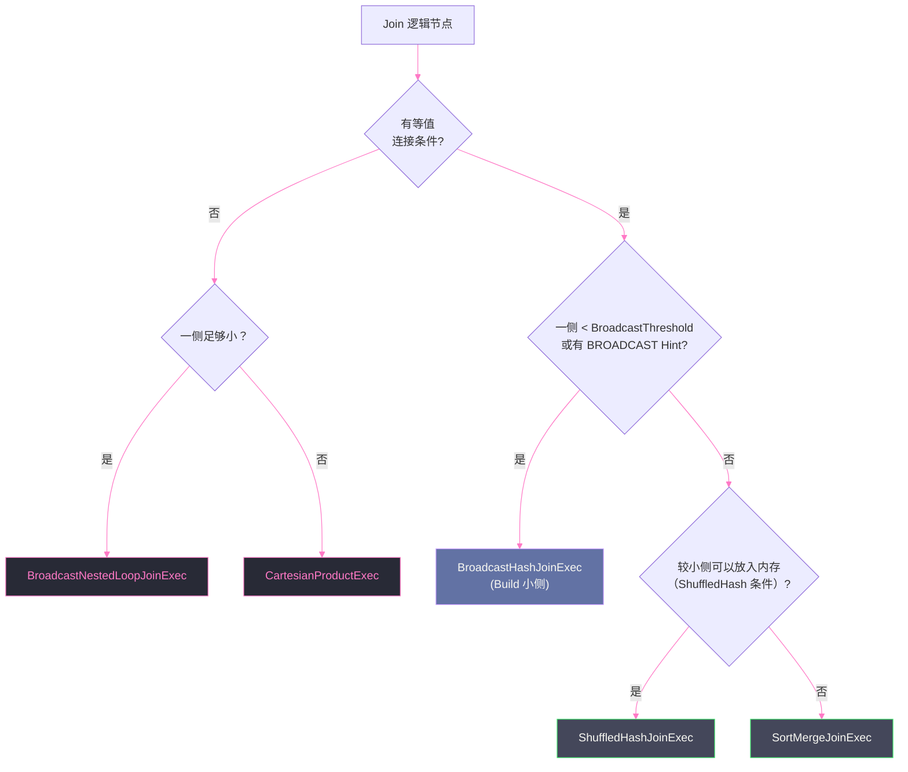

# 05 Physical Planning：从逻辑计划到物理算子的策略选择

## 摘要

逻辑计划描述"做什么"，物理计划描述"怎么做"。从 Optimized LogicalPlan 到最终可执行的 SparkPlan，需要经历一个关键的翻译阶段——**Physical Planning（物理规划）**。这个阶段最核心的决策是：对于逻辑计划中每一个 `Join` 节点，选择哪一种物理实现？Spark 提供五种 Join 策略：`BroadcastHashJoin`、`ShuffledHashJoin`、`SortMergeJoin`、`BroadcastNestedLoopJoin`、`CartesianProduct`，它们在适用条件、内存开销、是否触发 Shuffle、处理 NULL 的方式上各不相同。选错一个 Join 策略，可能将分钟级的查询变为小时级，也可能将毫秒级查询变成 OOM。本文系统讲解 Physical Planner 的工作机制（`SparkStrategy` + `SparkPlanner`）、五种 Join 策略的内部算法与选择逻辑、`EnsureRequirements` 如何自动插入 Exchange 和 Sort、以及 Bucket Join 如何通过预排序彻底消除 Join 时的 Shuffle。

---

## 第 1 章 Physical Planning 的角色与边界

### 1.1 逻辑计划与物理计划的本质区别

**逻辑计划（LogicalPlan）** 是与执行引擎无关的抽象描述：
- `Join(left, right, Inner, a.id = b.id)` 只表达"对 a 和 b 做等值内连接"，不涉及任何具体实现细节
- `Aggregate([userId], [sum(amount)])` 只表达"按 userId 分组求和"，不说明用 HashAggregation 还是 SortAggregation

**物理计划（SparkPlan）** 是与 Spark 执行引擎紧密耦合的具体实现：
- `BroadcastHashJoinExec`：将右表 Broadcast 到所有 Executor，用 HashMap probe 左表
- `SortMergeJoinExec`：两侧数据都按 Join Key 排序后做归并连接
- `HashAggregateExec`：用 HashMap 做聚合，一次扫描完成（需要内存足够放下所有 key）
- `SortAggregateExec`：先对数据按 GROUP BY key 排序，再顺序扫描合并（内存友好但慢）

物理计划的选择直接决定了作业的性能特征：执行时间、内存压力、是否触发 Shuffle、数据本地性……这些在逻辑计划层面都无从体现。

### 1.2 Physical Planning 的输入与输出

**输入**：`Optimized LogicalPlan`（经过 RBO + CBO 优化后的逻辑计划）

**输出**：`SparkPlan`（可执行物理计划，每个节点对应一个 `SparkPlan` 子类实例）

Physical Planning 由 `SparkPlanner` 执行，它内部维护一个 **`Strategy`（策略）列表**，每个 Strategy 是一个将 `LogicalPlan` 模式匹配到 `SparkPlan` 的偏函数。`SparkPlanner` 依次尝试每个 Strategy，直到某个 Strategy 成功翻译当前节点。

---

## 第 2 章 SparkStrategy：物理规划的翻译机制

### 2.1 Strategy 的工作方式

每个 `Strategy` 是一个 `GenericStrategy[SparkPlan]`，核心方法：

```scala
abstract class GenericStrategy[PhysicalPlan] {
  def apply(plan: LogicalPlan): Seq[PhysicalPlan]
  // 返回空 Seq 表示本 Strategy 不处理此节点
  // 返回 Seq(plan) 表示翻译成功
}
```

`SparkPlanner` 内置的 Strategy 列表（简化）：

1. **`PythonEvals`**：处理 Python UDF/Pandas UDF
2. **`FileSourceStrategy`**：将 `LogicalRelation`（文件扫描）翻译为 `FileSourceScanExec`
3. **`HiveTableScans`**：将 `HiveTableRelation` 翻译为 `HiveTableScanExec`
4. **`DataSourceV2Strategy`**：处理 DataSource V2 接口的扫描
5. **`JoinSelection`**：将 `Join` 翻译为五种物理 Join 策略之一（**最关键**）
6. **`Aggregation`**：将 `Aggregate` 翻译为 `HashAggregateExec` 或 `SortAggregateExec`
7. **`BasicOperators`**：处理 `Project`、`Filter`、`Sort`、`Limit` 等基础算子

`SparkPlanner.plan()` 方法对 LogicalPlan 树做递归后序遍历，每个节点依次尝试所有 Strategy，第一个匹配成功的结果被采用。

### 2.2 SparkPlanner 的扩展机制

用户可以通过 `SparkSessionExtensions` 注入自定义 Strategy，在内置 Strategy 之前或之后运行：

```scala
val spark = SparkSession.builder()
  .withExtensions { ext =>
    ext.injectPlannerStrategy(_ => MyCustomStrategy)
  }
  .getOrCreate()
```

这是实现自定义物理算子（如针对特定数据源的向量化扫描）的标准方式。

---

## 第 3 章 五种 Join 策略深度解析

`JoinSelection` Strategy 是 Physical Planning 中最复杂的部分，负责将逻辑 `Join` 节点翻译为五种物理实现之一。选择逻辑基于：两侧数据大小（来自 CBO 统计或 AQE 运行时统计）、Join 类型（Inner/Left/Right/Full Outer 等）、是否有等值条件、Hint 声明。



### 3.1 BroadcastHashJoin（广播哈希连接）

**是什么**：将一侧（通常是较小的表，称为"Build 端"）的数据广播（序列化后发送）到所有 Executor，在每个 Executor 上构建一个 HashMap；另一侧（"Probe 端"）在本地与 HashMap 做 probe，无需 Shuffle。

**为什么出现**：对于大表与小表的 Join，如果强制两侧都 Shuffle，小表的 Shuffle 代价是纯浪费——小表数据完全可以在每个 Executor 上本地缓存（HashMap 放内存），省去整个 Shuffle 阶段。

**不这样会怎样**：使用 SortMergeJoin 代替 BroadcastHashJoin，对两侧都触发 Shuffle（按 Join Key 重分区），对于小表 × 大表的 Join，Shuffle 开销远大于 Broadcast 开销，通常慢 5-20 倍。

**在 Spark 中如何落地**：

1. **Driver 阶段**：`BroadcastExchangeExec` 在 Driver 端触发小表的全量收集（`collect()`）
2. **Broadcast 阶段**：Driver 将收集到的数据序列化为 Broadcast 变量（`sc.broadcast(hashedRelation)`），通过 BitTorrent 协议（Spark 的 TorrentBroadcast）分发到所有 Executor
3. **Probe 阶段**：每个 Executor 上，大表的 Task 在本地与 Broadcast 的 HashMap 做 probe，无 Shuffle

```
物理计划结构：
BroadcastHashJoinExec(buildSide=right, joinKeys=[a.id = b.id])
├── FileScan(large_table)                          ← Probe 端（不 Shuffle）
└── BroadcastExchangeExec                          ← Build 端（Broadcast）
    └── FileScan(small_table)
```

**触发条件**：
```properties
# 默认 10MB，小于此阈值自动 Broadcast
spark.sql.autoBroadcastJoinThreshold=10485760  # 10MB

# 或通过 Hint 强制指定
SELECT /*+ BROADCAST(b) */ * FROM a JOIN b ON a.id = b.id
```

**边界与反例**：
- Broadcast 数据量受 Driver 内存限制（收集全量数据到 Driver）和 Executor 内存限制（每个 Executor 都持有一份完整 HashMap）
- Full Outer Join 无法使用 BroadcastHashJoin（需要保留两侧所有不匹配的行，用 HashMap probe 无法实现）
- 广播变量有大小上限（`spark.broadcast.blockSize` 相关，通常 8GB 以内可靠）

> [!warning] 生产避坑
> 如果统计信息过时导致 CBO 错误判断表大小，一张实际 5GB 的表被误认为 5MB，会触发 Broadcast，导致 Driver OOM（收集 5GB 数据到 Driver 内存）或 Executor OOM（每个 Executor 内存 + HashMap 5GB）。应设置合理的 `autoBroadcastJoinThreshold`（生产建议不超过 100MB），并保持统计信息更新。

### 3.2 ShuffledHashJoin（Shuffle 哈希连接）

**是什么**：两侧数据都按 Join Key 做 Shuffle（重分区），确保相同 Key 的数据落到同一个分区；在每个分区内，将较小侧构建 HashMap，较大侧做 probe。

**与 BroadcastHashJoin 的区别**：两者都用 HashMap，区别在于 BroadcastHashJoin 把 HashMap 广播到所有 Executor（无 Shuffle），ShuffledHashJoin 让两侧都 Shuffle 到同一分区再建 HashMap（有 Shuffle，但 HashMap 只在单分区内）。

**为什么有了 BroadcastHashJoin 和 SortMergeJoin 还需要 ShuffledHashJoin？**

在以下场景，ShuffledHashJoin 比两者都好：
- 一侧在 Shuffle 后每个分区较小（可以放入内存构建 HashMap），另一侧很大
- 不需要排序（比 SortMergeJoin 少一个排序步骤），比 BroadcastHashJoin 的 Driver 收集代价小

**触发条件**：
- 开启 `spark.sql.join.preferSortMergeJoin=false`（默认 true，开启后优先 SortMergeJoin）
- 两侧数据经 Shuffle 后每个分区可以放入 Executor 内存
- 或通过 Hint：`/*+ SHUFFLE_HASH(b) */`

**Spark 3.x 中的地位**：ShuffledHashJoin 默认处于低优先级（被 `preferSortMergeJoin` 配置压制），主要由 AQE 在运行时动态启用（当某个 Stage 完成后，发现一侧数据量比静态估算小得多，AQE 将 SortMergeJoin 降级为 ShuffledHashJoin）。

### 3.3 SortMergeJoin（排序归并连接）

**是什么**：两侧数据都按 Join Key 做 Shuffle（重分区）且排序，然后每个分区内做归并连接（类似归并排序中的 Merge 步骤）。

**为什么是默认策略**：SortMergeJoin 是 Spark SQL 对大表 × 大表场景的首选策略，原因是：
1. **内存安全**：不需要将整个分区的数据放入 HashMap，只需要维护两个排好序的迭代器，内存开销极低
2. **可 Spill**：如果内存不足，SortMergeJoin 的排序阶段可以 Spill 到磁盘（利用 [[ExternalSorter]]），不会 OOM
3. **输出有序**：结果天然按 Join Key 有序，后续如果有 ORDER BY Join Key 的操作，可以省略排序

**代价**：比 BroadcastHashJoin 多 2 次 Shuffle（两侧都需 Shuffle）+ 2 次排序。在大数据量场景下，这是无法避免的代价。

**内部算法**：

对每个 Shuffle 分区（假设分区 P），两侧的数据都已按 Join Key 排序：
```
Left 分区 P（已排序）: [key=1, key=3, key=3, key=5, key=7, ...]
Right 分区 P（已排序）: [key=2, key=3, key=4, key=5, key=5, ...]

归并过程（双指针）：
  - key=1（左）：右侧无匹配，Inner Join 跳过
  - key=2（右）：左侧无匹配，Inner Join 跳过
  - key=3（左3×右1）：输出2行（3,3的笛卡尔积）
  - key=4（右）：左侧无匹配
  - key=5（左1×右2）：输出2行
  ...
```

**触发条件**：
- 两侧大小均超过 `autoBroadcastJoinThreshold`，且开启 `preferSortMergeJoin=true`（默认）
- 有等值连接条件（必须，否则无法按 Key 排序分区）
- 或通过 Hint：`/*+ MERGE(b) */`

**SortMergeJoin 对于大量重复 Key 的性能问题**：

当 Join Key 存在大量重复值（数据倾斜）时，SortMergeJoin 的归并过程会产生笛卡尔积——左侧 1000 万条 `key=hot` 与右侧 500 万条 `key=hot` 产生 5000 亿行中间结果。这是 SortMergeJoin 最严重的性能陷阱，需要配合 AQE Skew Join 或手动 Salting 解决（第 10 篇详解）。

### 3.4 BroadcastNestedLoopJoin（广播嵌套循环连接）

**是什么**：将一侧（较小侧）广播到所有 Executor，另一侧的每一行与广播数据逐行比对（嵌套循环）。

**什么时候用**：仅在以下两种情况之一触发：
1. **没有等值连接条件**（如 `a.x > b.y`、`a.range @> b.point` 等非等值 Join）
2. **Full Outer Join 且一侧足够小**

**代价**：时间复杂度 O(M × N)，M 和 N 分别是两侧的行数。只适合小 × 大（较小侧被广播后，本地嵌套循环），禁止用于大 × 大（会产生天文数字的操作次数）。

> [!warning] 生产避坑
> 当 SQL 中存在非等值 Join 条件（如范围 Join：`a.start <= b.ts AND b.ts < a.end`），Spark 会选择 BroadcastNestedLoopJoin（如果一侧足够小）或 CartesianProduct。如果两侧都很大，查询会变成真正的笛卡尔积，运行时间可能是数天。遇到范围 Join 性能问题，应考虑将其改写为等值 Join（如将时间范围离散化为分钟级 key），或使用专门的时间序列库。

### 3.5 CartesianProduct（笛卡尔积）

**是什么**：两侧数据不做任何 Shuffle，对每对 (左行, 右行) 都输出（全量叉积）。

**触发条件**：
- 没有任何连接条件（`FROM a, b` 没有 WHERE 指定连接条件）
- 非等值 Join 且两侧都太大，无法 Broadcast

**后果**：如果左侧 M 行、右侧 N 行，输出 M × N 行。对于百万行 × 百万行，结果是 1 万亿行——几乎不可能完成。

**合法使用场景极少**：真正需要笛卡尔积的业务场景几乎不存在（通常是 SQL 写错了忘记写 JOIN 条件）。

---

## 第 4 章 Join 策略的选择矩阵

| 策略 | 等值条件 | 触发条件 | Shuffle | 内存需求 | 适用规模 |
|------|---------|---------|---------|---------|---------|
| `BroadcastHashJoin` | 必须 | 一侧 < Broadcast 阈值 | **无** | Build 端全量进内存（每 Executor） | 大 × 小 |
| `ShuffledHashJoin` | 必须 | Shuffle 后分区可放入内存 | 有（两侧） | Shuffle 后分区进内存 | 中 × 小/中 |
| `SortMergeJoin` | 必须 | 默认（两侧都大） | 有（两侧） | 低（可 Spill） | 大 × 大 |
| `BroadcastNestedLoopJoin` | 不要求 | 无等值条件 且 一侧小 | **无** | Build 端全量进内存（每 Executor） | 大 × 极小 |
| `CartesianProduct` | 不要求 | 无等值条件 且 两侧都大 | 有 | 极高 | 理论禁用 |

### 4.1 通过 Hint 手动干预 Join 策略

当 CBO 统计信息不准确，或业务场景需要手动指定时，可通过 Hint 覆盖自动选择：

```sql
-- 强制 Broadcast right 侧
SELECT /*+ BROADCAST(b) */ * FROM a JOIN b ON a.id = b.id;

-- 强制 Merge（SortMergeJoin）
SELECT /*+ MERGE(b) */ * FROM a JOIN b ON a.id = b.id;

-- 强制 ShuffleHash
SELECT /*+ SHUFFLE_HASH(b) */ * FROM a JOIN b ON a.id = b.id;

-- 强制禁用 Broadcast（对于统计信息不准确的情况）
SELECT /*+ NO_BROADCAST_HASH(b) */ * FROM a JOIN b ON a.id = b.id;
```

在 DataFrame API 中等价写法：

```scala
import org.apache.spark.sql.functions.broadcast

// 强制 Broadcast right 侧
val result = largeDF.join(broadcast(smallDF), "userId")
```

---

## 第 5 章 EnsureRequirements：自动插入 Exchange 和 Sort

### 5.1 为什么需要 EnsureRequirements

物理规划完成后，得到的 SparkPlan 树中，相邻算子对数据的分布方式（Partitioning）和排序方式（Ordering）可能不兼容。

以 SortMergeJoin 为例：
- `SortMergeJoinExec` 要求两侧数据都按 Join Key `HashPartitioned` 分区，且在每个分区内按 Join Key 排序
- 上游的 `FileScanExec` 输出的数据是随机分布的（`UnknownPartitioning`），没有任何排序

如果不在中间插入 Shuffle 和 Sort，SortMergeJoin 的归并逻辑会得到错误结果（无序数据无法归并）。

`EnsureRequirements` 规则在整棵物理计划树上做一次遍历，检查每对 `(父节点对子节点的要求, 子节点实际的输出特性)` 是否兼容，若不兼容则自动插入 `ShuffleExchangeExec` 或 `SortExec`。

### 5.2 Partitioning 与 Distribution 的核心概念

每个 `SparkPlan` 节点都声明：
- `outputPartitioning`：自己输出的分区方式（`HashPartitioning`、`RangePartitioning`、`SinglePartition`、`UnknownPartitioning`）
- `requiredChildDistribution`：对每个子节点的分区要求（`HashClusteredDistribution`、`AllTuples`、`UnspecifiedDistribution`）
- `requiredChildOrdering`：对每个子节点的排序要求

**`HashClusteredDistribution(keys)`**：要求数据按指定 keys 做 Hash 分区，相同 key 的数据在同一分区。`SortMergeJoinExec` 对两侧都要求此分布，且要求同样的分区数（`spark.sql.shuffle.partitions`）。

**`AllTuples`**：要求所有数据在单个分区中（如 `CollectLimitExec`，用于 `LIMIT` 操作时收集结果到 Driver）。

### 5.3 Exchange 的类型

`EnsureRequirements` 插入的 `Exchange` 节点有两种：

**`ShuffleExchangeExec`**：将数据按新的分区方式重分布（Shuffle）。这是代价最高的操作，触发一轮 Map + Reduce 阶段，数据必须序列化、写磁盘、网络传输。

**`BroadcastExchangeExec`**：将数据广播到所有 Executor。在 `BroadcastHashJoinExec` 的 Build 端使用。

### 5.4 Exchange 的复用（ReuseExchange）

当查询中有多个节点需要对同一数据做相同的 Shuffle，`ReuseExchange` 规则检测并复用已有的 Exchange 输出，避免重复 Shuffle：

```sql
-- 两个聚合都基于相同的 Shuffle（按 userId 分区）
SELECT userId, SUM(amount) FROM orders GROUP BY userId
UNION ALL
SELECT userId, COUNT(*) FROM orders GROUP BY userId
```

如果不复用，两个 `GROUP BY userId` 分别触发一次 Shuffle。复用后，两个聚合共享同一次 Shuffle 的输出，节省一半 Shuffle 代价。

---

## 第 6 章 Bucket Join：彻底消除 Shuffle

### 6.1 Bucket Join 是什么

**分桶（Bucketing）** 是一种表的物理组织方式：写入数据时，按指定列（Bucket Key）做 Hash，将数据预先分配到固定数量的桶（Bucket）中，每个桶是一组文件，桶内数据按 Bucket Key 排序。

当两张表按**相同的 Bucket Key、相同的桶数**分桶时，对这两张表做 Join，两侧相同 Bucket Key 的数据天然在相同的桶号文件中。Spark 可以直接让 Executor 读取对应桶号的文件，跳过整个 Shuffle 阶段——这就是 **Bucket Join**。

**为什么 Bucket Join 能消除 Shuffle？**

SortMergeJoin 需要 Shuffle 的原因：不同 Executor 上的数据可能包含相同的 Join Key，必须通过 Shuffle 将相同 Key 的数据聚集到同一 Executor。

Bucket Join 的数据在写入时就已经按 Bucket Key 分好了——相同 Key 的数据在写入时就被路由到相同的桶号。读取时，Executor 只需读取"自己负责的桶号"对应的文件，已经天然满足"相同 Key 在同一 Executor"的条件，无需再做 Shuffle。

### 6.2 如何创建分桶表

```sql
-- 创建分桶表（Spark/Hive）
CREATE TABLE orders_bucketed (
  userId STRING,
  orderId STRING,
  amount DOUBLE,
  ts TIMESTAMP
)
CLUSTERED BY (userId) INTO 256 BUCKETS
SORTED BY (userId)
STORED AS PARQUET;

-- 写入数据（写入时自动按 Bucket Key 分桶排序）
INSERT INTO orders_bucketed
SELECT * FROM orders;
```

```scala
// DataFrame API 写入分桶表
df.write
  .bucketBy(256, "userId")   // 256 个桶，按 userId 分桶
  .sortBy("userId")          // 桶内按 userId 排序（Bucket Join 要求）
  .saveAsTable("orders_bucketed")
```

### 6.3 Bucket Join 的触发条件

两张表 Join 时，同时满足以下条件，Spark 自动使用 Bucket Join：

1. **相同的 Bucket Key**：Join 条件中的列与两张表的 Bucket Key 完全匹配
2. **相同的桶数**：两张表的桶数相同（或一张是另一张的整数倍）
3. **Bucket 元数据可读**：Spark 能从 Catalog 读取两张表的分桶信息
4. **开启 Bucket Join**：`spark.sql.sources.bucketing.enabled=true`（默认 true）

```sql
-- 两张分桶表 Join（均按 userId 分 256 桶）
-- 触发 Bucket Join，无 Shuffle
SELECT a.orderId, b.name
FROM orders_bucketed a
JOIN users_bucketed b ON a.userId = b.userId;
```

执行计划中不会出现 `ShuffleExchangeExec`，可以通过 `EXPLAIN` 验证：

```
== Physical Plan ==
*(3) SortMergeJoin [userId#1], [userId#2], Inner
:- *(1) Sort [userId#1 ASC]          ← 无 ShuffleExchange，直接读文件后排序
:  +- *(1) FileScan parquet orders_bucketed[...]
+- *(2) Sort [userId#2 ASC]
   +- *(2) FileScan parquet users_bucketed[...]
```

### 6.4 Bucket Join 的代价与边界

**代价**：
- 写入时有额外的分桶排序开销（写入速度略慢，约 10-30%）
- 必须在建表时预先规划桶数和桶键，无法动态调整

**边界**：
- **桶数不匹配**：如果一张 256 桶，另一张 128 桶，Spark 会对 256 桶的表做一次额外 Shuffle（重分区为 128 桶）——部分消除 Shuffle，但仍有一侧需要 Shuffle
- **Write Path 的局限**：Spark 的 Delta Lake 写入不直接支持分桶（Delta Lake 有自己的 Z-Order 机制），分桶主要用于 Parquet/ORC 的 Hive 表
- **桶数选择**：桶数应与集群的并行度匹配，且是 2 的幂次（如 256、512）；桶数过小（如 4）会导致每个文件太大，失去分桶的优势

> [!note] 设计哲学
> Bucket Join 是"以写入时的额外代价，换取查询时的 Shuffle 消除"的典型工程权衡。对于高频访问的大表 Join（如每天都要把 10 亿行事实表与 1000 万行用户表 Join），分桶一次写入的代价很快被多次查询省下的 Shuffle 代价所弥补。典型的生产场景：数据仓库中的星型模型事实表与最大的维表之间的分桶 Join，每次 ETL 节省数十分钟 Shuffle 时间。

---

## 第 7 章 Aggregate 的物理规划

物理规划不只是 Join 的选择，`Aggregate` 算子也有两种物理实现，选择不当同样影响性能。

### 7.1 HashAggregateExec（哈希聚合）

**原理**：使用 HashMap 来存储聚合状态，key 是 GROUP BY 列，value 是聚合中间值（如 `sum`、`count`）。只需一趟扫描输入数据，对每行做 map lookup + update。

**优势**：O(1) 的更新代价，速度快（比 Sort + 顺序扫描快约 2-5 倍）。

**限制**：所有 GROUP BY key 的中间聚合状态必须同时放入内存。如果 key 的 NDV 很大（如 1 亿个不同用户），HashMap 会很大，可能 OOM。

**如何判断是否使用**：如果聚合函数支持部分聚合（`PartialAggregate`，大多数内置聚合函数都支持），且 GROUP BY key 的 NDV 不超过 `spark.sql.aggregate.fastHashMap.enabled`（默认启用）的阈值，就使用 `HashAggregateExec`。

**两阶段 Hash Aggregation**：Spark 的 HashAggregation 实际上分两阶段：
1. **Partial Aggregation（局部聚合）**：每个 Task 在 Shuffle 前先对本地数据做局部聚合，减少 Shuffle 数据量（如将 10 万条 `key=A` 的行聚合为一条 `(A, sum=X, count=Y)`）
2. **Final Aggregation（最终聚合）**：Shuffle 后，每个分区内对相同 key 的局部聚合结果做最终合并

### 7.2 SortAggregateExec（排序聚合）

**原理**：先将数据按 GROUP BY key 排序，再顺序扫描，对相邻的相同 key 做累计聚合。

**优势**：内存友好（只需维护当前 key 的聚合状态），不会 OOM。

**缺点**：需要完整排序输入数据，比 HashAggregation 慢。

**触发场景**：
- 聚合函数不支持 Partial Aggregation（如某些 UDAF）
- GROUP BY key 的数据类型不支持 HashMap（如复杂类型 `Array`、`Map`）
- 开启了 `spark.sql.execution.sortBasedAggregationThreshold`（内存不足时 Spill）

---

## 小结

Physical Planning 是从"说清楚要什么"到"告诉引擎怎么做"的关键跨越：

- **SparkPlanner + Strategy 体系**：多个 Strategy 依次尝试翻译每个 LogicalPlan 节点，`JoinSelection` 是最复杂的 Strategy
- **五种 Join 策略的优先级**：`BroadcastHashJoin`（最快，无 Shuffle）> `ShuffledHashJoin`（有 Shuffle，无排序）> `SortMergeJoin`（有 Shuffle + 排序，最安全）> `BroadcastNestedLoopJoin`（非等值）> `CartesianProduct`（绝对回避）
- **EnsureRequirements**：自动在物理计划中插入 `ShuffleExchangeExec` 和 `SortExec`，确保相邻算子的数据分布兼容；`ReuseExchange` 复用相同 Shuffle，避免重复开销
- **Bucket Join**：写入时分桶排序，查询时彻底消除 Shuffle，是高频大表 Join 的最佳优化手段

第 06 篇将进入 AQE（Adaptive Query Execution）的世界：静态物理规划的根本局限是"在执行前基于估算做决策"，AQE 通过在运行时收集真实统计，动态修正物理计划——动态分区合并、动态 Join 策略切换、Skew Join 自动优化，是 Spark 3.0 最重要的性能特性之一。

---

> [!note] 思考题
> 1. BroadcastHashJoin 要求至少一张表能够被广播到所有 Executor。如果广播阈值设置过大（比如 10GB），会导致哪些连锁问题？Driver 内存、Executor 内存以及网络传输分别会受到什么影响？
> 2. `EnsureRequirements` 规则会在需要时自动插入 `Exchange`（Shuffle）算子。如果两个 DataFrame 已经用相同的方式分区，`ReuseExchange` 能复用同一次 Shuffle 的结果——但这个复用是有条件的。在哪些情况下 `ReuseExchange` 会失效，导致相同数据被 Shuffle 两次？
> 3. Bucket Join 可以彻底消除 Shuffle，但它要求参与 Join 的两张表具有完全相同的分桶列、分桶数和排序列。在实际生产中，分桶表的维护成本很高，有哪些常见操作会"悄悄破坏"分桶属性，导致 Bucket Join 退化为普通 SortMergeJoin？

## 参考资料

- Apache Spark 源码：`org.apache.spark.sql.execution.SparkPlanner`
- Apache Spark 源码：`org.apache.spark.sql.execution.SparkStrategies.JoinSelection`
- Apache Spark 源码：`org.apache.spark.sql.execution.joins`（各 Join 算子实现）
- Apache Spark 源码：`org.apache.spark.sql.execution.exchange.EnsureRequirements`
- [Deep Dive into Spark SQL's Catalyst Optimizer（Databricks Blog）](https://www.databricks.com/blog/2015/04/13/deep-dive-into-spark-sqls-catalyst-optimizer.html)
- Spark 官方文档：Performance Tuning - Bucketing
- Spark 官方文档：Hints
