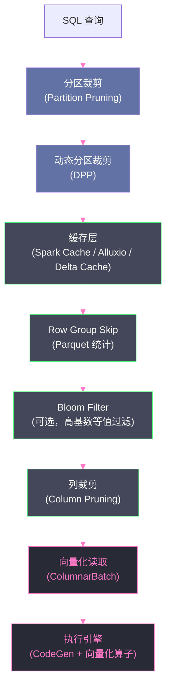

# 09 数据源与 IO 优化：让数据少读、快读、不重读

## 摘要

在大规模数据处理中，计算优化（CodeGen、向量化）往往只是"锦上添花"——如果数据读取本身效率低下，再快的 CPU 执行引擎也无从发挥。**磁盘 I/O 和网络 I/O 是分布式查询的第一性能瓶颈**，优化目标只有三个字：**少读**（通过分区裁剪、谓词下推减少扫描量）、**快读**（通过列式格式、压缩、向量化读取提升读取效率）、**不重读**（通过缓存、物化视图避免重复扫描）。本文系统讲解 Spark SQL 在数据源层面的全套优化机制：Parquet 与 ORC 的内部结构（Row Group、Column Chunk、Page、统计信息）如何支撑 Skip 优化；动态分区裁剪（Dynamic Partition Pruning）如何在运行时根据一侧 Join 的结果过滤另一侧的分区；DataSource V2 的 Filter Pushdown 接口如何让存储层感知查询谓词；小文件问题的根因与合并策略；以及 Spark 的多层缓存机制（`cache()`、Alluxio、Delta Lake Cache）的适用场景与代价。

---

## 第 1 章 文件格式的 I/O 效率基础

### 1.1 行式 vs 列式：不只是存储格式的选择

选择数据格式是影响 Spark SQL 查询性能最"前置"的决策——它决定了最坏情况下 I/O 的绝对下限。

**行式格式（CSV、JSON、Avro）**：数据按行存储，每行包含所有列的值。

优势：写入友好（追加一行就是追加一段数据），行级事务自然。

劣势：读取时必须扫描所有列（无论查询只用几列），无法对单列做压缩优化，无法跳过不需要的列——CPU 读了大量不需要的数据。

典型灾难：一张 1000 列的宽表，查询只涉及 5 列。行式格式必须读取全部 1000 列，然后丢弃 995 列。

**列式格式（Parquet、ORC）**：数据按列存储，同一列的所有值连续存储。

优势：
1. **列裁剪**：读取时只读查询涉及的列，其余列完全不触磁盘（I/O 减少 90%+ 对宽表）
2. **高压缩率**：同列数据类型相同、值域相近，压缩效率远高于行式（Snappy 压缩后 Parquet 通常比 CSV 小 5-10 倍）
3. **统计信息内嵌**：每列存储 MIN/MAX/NULL_COUNT，Parquet 阅读器可以跳过不满足谓词的 Row Group（谓词下推到文件内部）
4. **编码优化**：对 Dictionary 高频值、连续整数、时间序列等都有专用高效编码

**生产建议**：除了必须保持原始格式的场景（如 Kafka 消费的原始日志），内部存储一律使用 Parquet 或 ORC。

### 1.2 Parquet 的内部分层结构

理解 Parquet 的结构是理解所有 Skip 优化的前提：

```
Parquet 文件
├── Row Group 0（默认 128MB）          ← 行组（存储若干行的所有列）
│   ├── Column Chunk: userId            ← 列块（一列在一个 Row Group 内的所有数据）
│   │   ├── Page 0（默认 1MB）           ← 页（Column Chunk 的最小 I/O 单元）
│   │   │   ├── Page Header（含 MIN/MAX）
│   │   │   └── Encoded Data（RLE/Dictionary/Delta 编码）
│   │   ├── Page 1
│   │   └── ...
│   ├── Column Chunk: amount
│   │   └── ...
│   └── Row Group Metadata（含每列 MIN/MAX/NULL_COUNT）  ← Skip 依据
├── Row Group 1
│   └── ...
└── File Footer（所有 Row Group 的元数据汇总）  ← Spark 先读 Footer
```

**三级统计信息**：
- **文件级**：File Footer 汇总所有 Row Group 的统计
- **Row Group 级**：每列的 MIN/MAX/NULL_COUNT（Spark 读取后用于 Row Group Skip）
- **Page 级**（Parquet 2.0+）：每个 Page 的 MIN/MAX（更细粒度 Skip）

---

## 第 2 章 分区裁剪：最强力的 I/O 减少手段

### 2.1 静态分区裁剪

**分区表（Partitioned Table）** 将数据按某列（分区键）的值组织为不同的目录：

```
/warehouse/events/
    dt=2024-01-14/
        part-00000.parquet
        part-00001.parquet
    dt=2024-01-15/
        part-00000.parquet
    dt=2024-01-16/
        ...
```

查询 `WHERE dt = '2024-01-15'` 时，Spark 只读取 `dt=2024-01-15/` 目录，完全跳过其他所有日期的文件——这是**静态分区裁剪**，发生在执行计划生成阶段（Analyzer 阶段，已知过滤条件是常量）。

```sql
-- 静态分区裁剪：dt='2024-01-15' 是常量，直接过滤
SELECT userId, amount FROM events WHERE dt = '2024-01-15';

-- 静态多分区裁剪
SELECT userId, amount FROM events WHERE dt BETWEEN '2024-01-10' AND '2024-01-15';
-- 只读取 6 天的目录，跳过其他所有分区
```

**分区列设计原则**：
- 选择查询中经常出现在 `WHERE` 子句的列作为分区键
- 分区键的 NDV（不同值数）不宜过大（如按用户 ID 分区可能产生数亿个目录，元数据管理成本极高）
- 最常见的分区键：日期（`dt`）、区域（`region`）、业务线（`biz_type`）
- 分区目录数一般建议不超过 10 万个（HDFS NameNode 元数据压力）

### 2.2 动态分区裁剪（Dynamic Partition Pruning，DPP）

静态分区裁剪只能处理常量过滤条件。但生产中大量查询的分区条件来自另一张表的 Join 结果：

```sql
-- 经典星型模型查询：过滤条件来自维表
SELECT e.userId, SUM(e.amount)
FROM events e
JOIN dim_date d ON e.dt = d.date_id
WHERE d.quarter = 'Q1' AND d.year = 2024
GROUP BY e.userId;
```

问题：`events` 表应该只读取 `dt` 在 2024 年 Q1（2024-01-01 至 2024-03-31）的分区，但这个范围在 SQL 执行前不是常量——它取决于 `dim_date` 表中 `quarter='Q1' AND year=2024` 的结果。

**没有 DPP 时**：Spark 需要全量扫描 `events` 表（读取全年甚至多年数据），然后与 `dim_date` 做 Join，再过滤不满足条件的行。

**DPP 的解决方案**：在运行时，先执行 `dim_date` 侧的过滤（获得满足 `Q1+2024` 的 `date_id` 集合），然后将这个集合作为**动态分区过滤器**注入到 `events` 表的扫描中。

**DPP 的触发条件**：
1. Join 的一侧（维表）有过滤条件，另一侧（事实表）是分区表
2. Join 条件是事实表的分区键与维表某列的等值比较
3. 维表侧的过滤后结果足够小（可以构建 Broadcast 变量用于动态过滤）
4. `spark.sql.optimizer.dynamicPartitionPruning.enabled=true`（默认 true）

**DPP 在执行计划中的体现**：

```
== Physical Plan ==
*(3) HashAggregate(keys=[userId], functions=[sum(amount)])
+- Exchange hashpartitioning(userId, 200)
   +- *(2) HashAggregate(keys=[userId], functions=[partial_sum(amount)])
      +- *(2) BroadcastHashJoinExec [dt], [date_id], Inner, BuildRight
         :- *(2) FileScan parquet events[userId,amount,dt]
         :  PushedFilters: [IsNotNull(dt)]
         :  PartitionFilters: [dynamicpruningexpression(dt IN subquery#123)]  ← DPP！
         +- BroadcastExchangeExec
            +- *(1) Filter (quarter=Q1 AND year=2024)
               +- *(1) FileScan parquet dim_date[date_id,quarter,year]
```

`dynamicpruningexpression(dt IN subquery#123)` 就是 DPP 注入的动态分区过滤器。`events` 表只会读取匹配的分区目录，大幅减少 I/O。

**DPP 的实现机制**：

Spark 将 `dim_date` 侧的过滤结果作为一个子查询（`InSubquery`），并在 `FileScan` 中将其添加为 `partitionFilters`。执行时，在读取 `events` 的分区列表之前，先执行这个子查询得到有效的 `date_id` 集合，再用这个集合过滤分区目录——只列出并读取匹配分区的文件。

> [!note] 设计哲学
> DPP 可以理解为"把 Broadcast 从数据层面提升到了分区元数据层面"。普通 BroadcastHashJoin 广播小表数据用于行级过滤；DPP 广播小表数据用于分区目录级过滤，效果更早、成本更低——不需要读取文件内容就能跳过整个分区目录。

---

## 第 3 章 谓词下推：让存储层做过滤

### 3.1 Spark 的谓词下推层次

谓词下推（Predicate Pushdown）有三个层次，效果依次递减但各有意义：

**层次一：Parquet Row Group 级 Skip（文件内部）**

Parquet 的每个 Row Group 存储了每列的 MIN/MAX 值。当 Spark 读取 Parquet 时，先读取 File Footer 的元数据，对每个 Row Group 检查过滤条件：

```
过滤条件：amount > 5000
Row Group 0 的 amount 列：MIN=10, MAX=4800
  → 4800 < 5000，该 Row Group 完全不满足条件 → 跳过，不读取任何 Page
  
Row Group 1 的 amount 列：MIN=100, MAX=99999
  → MAX=99999 > 5000，可能有满足条件的行 → 读取并过滤
```

**效果量化**：对于时序数据（amount 随时间递增），Row Group Skip 可以跳过 90%+ 的数据，等效于"没有分区键的分区裁剪"。

**层次二：Bloom Filter（Parquet 2.0+ 可选，ORC 原生支持）**

Bloom Filter 是一种概率性数据结构，可以快速判断一个值**是否不在某个集合中**（零误报率的反向判断）。Parquet 支持为高基数列（如 `userId`、`orderId`）构建 Bloom Filter：

```sql
-- 查询：WHERE userId = 'specific_user_abc'

无 Bloom Filter：必须读取 Row Group，扫描 userId 列，找到/找不到该值
有 Bloom Filter：在读取前先查询 Bloom Filter
  → 如果 Bloom Filter 确认不存在：直接跳过整个 Row Group（零 I/O）
  → 如果 Bloom Filter 可能存在（有误报率）：读取 Row Group 后过滤
```

Bloom Filter 对**点查询**（等值过滤）效果最好，对范围查询无效。

**层次三：DataSource 接口的谓词下推（DataSource V2）**

对于外部数据源（如 HBase、Cassandra、Elasticsearch），Spark 的 DataSource V2 接口定义了 `SupportsPushDownFilters` 接口，让数据源实现自己的谓词推导。

```scala
// DataSource V2 谓词下推接口
trait SupportsPushDownFilters {
  // 告诉 Spark 哪些 Filter 被数据源接受（会在数据源层执行）
  def pushFilters(filters: Array[Filter]): Array[Filter]
  
  // 返回已接受的 Filters（用于执行计划展示）
  def pushedFilters(): Array[Filter]
}
```

Cassandra 的 Spark 连接器实现此接口后，`WHERE partition_key = 'xxx'` 会被下推到 Cassandra 的分区键查询，直接走 Cassandra 的索引，无需全表扫描。

### 3.2 谓词下推的局限

**限制一：函数表达式无法下推**

```sql
-- 这个谓词可以下推（列与常量比较）
WHERE amount > 100

-- 这个谓词不能下推（函数调用）
WHERE UPPER(category) = 'FOOD'
WHERE DATE_TRUNC('month', ts) = '2024-01-01'
```

函数调用后的值在文件存储的 MIN/MAX 统计中找不到对应，无法做 Row Group Skip。

**限制二：OR 条件的下推限制**

```sql
-- AND 可以下推（两个条件都要满足，更严格）
WHERE amount > 100 AND category = 'food'

-- OR 通常不能下推（任一条件满足就保留，下推后可能错误丢弃数据）
WHERE amount > 100 OR category = 'food'
```

**限制三：Null 值的特殊处理**

MIN/MAX 统计不包含 NULL 值。如果过滤条件涉及 NULL（如 `IS NULL`、`IS NOT NULL`），只有 `NULL_COUNT` 统计才能用于 Skip，而 Parquet 的 Row Group 统计包含 `NULL_COUNT`，支持 `IS NULL` 的 Skip（当 `NULL_COUNT=0` 时，跳过 `WHERE col IS NULL` 的 Row Group）。

---

## 第 4 章 小文件问题：I/O 效率的隐形杀手

### 4.1 小文件的危害

**小文件（Small Files）** 指文件大小远小于 HDFS Block Size（通常 128MB）的文件。在大数据场景下，小文件问题是 I/O 性能的重要杀手：

**HDFS NameNode 元数据压力**：HDFS NameNode 在内存中维护每个文件的元数据，每个文件约占用 150 字节内存。10 亿个小文件需要 150GB 内存，远超普通 NameNode 配置。更严重的是，大量小文件的 `ls`、`open` 操作会给 NameNode 带来极高的 RPC 负载。

**Spark Task 调度开销**：每个文件通常产生一个 InputSplit，每个 InputSplit 对应一个 Task。1000 万个 1KB 的小文件 = 1000 万个 Task，Task 调度开销（Driver 端 DAGScheduler + TaskScheduler）远大于每个 Task 的实际计算时间。

**磁盘寻道开销**：机械磁盘（HDD）的随机寻道时间约 5-10ms。读取 1000 个 1MB 文件的总寻道时间 ≈ 5-10 秒，而同样 1GB 数据在一个大文件中的顺序读取只需要不到 1 秒。

### 4.2 小文件的产生原因

**原因一：Spark Shuffle 分区数过多**

默认 `spark.sql.shuffle.partitions=200`，每个分区写一个文件。如果数据量只有 10MB，200 个 50KB 的小文件就产生了。

**原因二：流式写入（Structured Streaming）**

每个微批次结束后写入一批文件。如果 trigger 间隔是 30 秒，一天产生 2880 批次，每批次写 N 个文件，累积下来文件数量极多。

**原因三：分区列 NDV 过高**

按 `dt + hour + userId` 三级分区，如果有 1000 万用户，每天产生 `1000 万 × 24` 个分区目录，每个目录内可能只有几条记录。

### 4.3 小文件合并策略

**策略一：写入时控制分区数**

```sql
-- 方法一：显式 repartition 控制输出文件数
SELECT * FROM large_table DISTRIBUTE BY CAST(RAND() * 200 AS INT);
-- 等价的 DataFrame API：
df.repartition(200).write.parquet(path)

-- 方法二：coalesce（减少分区，不触发 full shuffle）
df.coalesce(50).write.parquet(path)

-- 方法三：通过 spark.sql.files.maxRecordsPerFile 限制单文件行数
spark.conf.set("spark.sql.files.maxRecordsPerFile", 1000000)
```

**策略二：事后合并（Compaction）**

对于已经产生小文件的历史数据，定期运行 Compaction 作业：

```python
# 读取小文件分区，重写为合理大小的大文件
def compact_partition(dt: str, target_files: int):
    df = spark.read.parquet(f"/warehouse/events/dt={dt}")
    df.repartition(target_files).write \
        .mode("overwrite") \
        .parquet(f"/warehouse/events/dt={dt}")

# 对近 7 天的分区做 Compaction
for dt in last_7_days:
    compact_partition(dt, target_files=10)
```

**策略三：Delta Lake 的自动 Optimize**

如果使用 [[Delta Lake]]，可以启用自动 Compaction：

```python
# Delta Lake 自动 Optimize（写入时自动合并小文件）
spark.conf.set("spark.databricks.delta.optimizeWrite.enabled", "true")

# 或手动 Optimize
spark.sql("OPTIMIZE events WHERE dt >= '2024-01-01'")
```

> [!warning] 生产避坑
> 小文件合并的代价是写放大（读取所有小文件，重新写入大文件）。对于频繁更新的热分区，合并时机需要谨慎——在写入高峰期做合并会与正常写入争抢资源。建议在低峰期（如凌晨 3-5 点）调度 Compaction 任务，只对"已稳定"（不再有新数据写入）的历史分区做合并。

---

## 第 5 章 数据缓存：让热点数据不重读

### 5.1 Spark 的内存缓存（cache/persist）

对于在一次查询中被多次访问的数据（如多次 JOIN 的维表、迭代算法的中间结果），`cache()` 或 `persist()` 可以将数据存储在内存中，避免重复读取和重复计算：

```python
# 缓存维表（多个 Join 都用到）
dim_user_df = spark.table("dim_user").cache()
dim_user_df.count()  # 触发 cache 物化（Spark 的 cache 是 lazy 的！）

# 多个查询复用缓存
result1 = fact_df.join(dim_user_df, "userId")
result2 = fact_df2.join(dim_user_df, "userId")
```

**`cache()` vs `persist()`**：`cache()` 等价于 `persist(StorageLevel.MEMORY_AND_DISK_SER)`，自动溢出到磁盘。`persist()` 允许指定存储级别：

| 存储级别 | 含义 | 适用场景 |
|---------|------|---------|
| `MEMORY_ONLY` | 只在内存（JVM 对象格式） | 数据量小，内存充足，重复使用频繁 |
| `MEMORY_AND_DISK` | 内存溢出到磁盘 | 数据量中等，不希望重新计算 |
| `MEMORY_ONLY_SER` | 内存（序列化格式，节省空间） | 内存敏感，可接受反序列化开销 |
| `OFF_HEAP` | 堆外内存 | 避免 GC 影响，需要配置堆外内存大小 |
| `DISK_ONLY` | 只在磁盘 | 数据量大，主要避免重复的网络传输 |

**`cache()` 的陷阱**：

```python
# 常见错误：cache 后没有 Action 触发物化
df = spark.table("large_table").filter("dt='2024-01-15'").cache()
# 此时 df 还没有被物化！下次查询 df 时才会物化

# 正确做法：cache 后立即触发 Action
df.count()  # 或 df.first()
# 现在 df 已经被物化到内存/磁盘
```

**另一个陷阱：cache 对 DPP 的干扰**

如果将维表 `cache()` 后再做 DPP（Dynamic Partition Pruning），DPP 的 Broadcast 子查询会改走缓存读取，但部分版本的 Spark 在这个路径上存在 DPP 失效的问题（SPARK-37167 等）。生产中建议测试验证 DPP 是否仍然生效。

### 5.2 Spark SQL 的表级缓存（CACHE TABLE）

除了 DataFrame API，也可以用 SQL 命令缓存表：

```sql
-- 缓存整张表
CACHE TABLE dim_user;

-- 带条件缓存（只缓存满足条件的部分）
CACHE TABLE dim_user_active AS SELECT * FROM dim_user WHERE is_active = 1;

-- 取消缓存
UNCACHE TABLE dim_user;

-- 查看当前缓存了哪些表
SHOW TABLES IN spark_catalog WHERE isTemporary = false;
```

`CACHE TABLE` 是同步的（执行完后数据立即在内存中），而 `DataFrame.cache()` 是异步懒执行的。

### 5.3 Alluxio：分布式内存文件系统

**[[Alluxio]]**（原名 Tachyon）是一个分布式内存文件系统，可以作为 Spark 与 HDFS/S3 之间的缓存层：

```
Spark → Alluxio（内存层）→ HDFS/S3（持久层）
```

**Alluxio 的优势**：
- **跨 Spark 作业共享缓存**：Spark 内置 cache 只在单个 SparkContext 内有效；Alluxio 的缓存对所有使用该 Alluxio 集群的 Spark 作业可见
- **内存文件系统语义**：Spark 以读取普通文件的方式读取 Alluxio（`alluxio://...` 路径），无需修改代码
- **预热（Warm-up）**：可以提前将热点数据加载到 Alluxio，确保关键时间段的查询全部走内存

**适用场景**：数仓中有固定的热点表（如近 7 天的事实表），每天被数百个查询访问。使用 Alluxio 将这些表预热到内存，所有查询都走 Alluxio 内存，彻底消除 HDFS 读取的网络和磁盘 I/O。

### 5.4 Delta Lake 的 Delta Cache

[[Delta Lake]] 提供了一种 SSD 级别的磁盘缓存（Delta Cache），将从远端对象存储（S3、GCS、ADLS）读取的 Parquet 文件缓存到本地 SSD：

```properties
# 开启 Delta Cache（Databricks 环境）
spark.databricks.io.cache.enabled=true
spark.databricks.io.cache.maxDiskUsage=200g  # 每个节点最大缓存 200GB
```

对于云存储（S3 等）的场景，从 S3 读取数据的网络带宽有限（通常几百 MB/s），而本地 SSD 可以达到 GB/s 级别。Delta Cache 将热点数据从 S3 缓存到 SSD，后续读取速度提升 5-20 倍。

---

## 第 6 章 DataSource V2：统一的数据源优化接口

### 6.1 DataSource V1 的局限

Spark 1.x 的 DataSource V1 接口将数据源优化能力限制在两个方向：谓词下推（`PrunedFilteredScan`）和列裁剪（`PrunedScan`）。扩展性差，无法表达更丰富的优化能力（如聚合下推、LIMIT 下推、分区信息传递）。

### 6.2 DataSource V2 的优化接口体系

Spark 2.3+ 引入的 DataSource V2 提供了一套完整的 Connector API，允许数据源声明自己支持哪些优化：

```scala
// 支持谓词下推
trait SupportsPushDownFilters extends ScanBuilder {
  def pushFilters(filters: Array[Filter]): Array[Filter]
  def pushedFilters(): Array[Filter]
}

// 支持列裁剪
trait SupportsPushDownRequiredColumns extends ScanBuilder {
  def pruneColumns(requiredSchema: StructType): Unit
}

// 支持聚合下推（SUM、COUNT 等下推到数据源执行）
trait SupportsPushDownAggregates extends ScanBuilder {
  def pushAggregation(aggregation: Aggregation): Boolean
}

// 支持 LIMIT 下推（数据源层限制返回行数）
trait SupportsPushDownLimit extends ScanBuilder {
  def pushLimit(limit: Int): Boolean
}

// 支持分区信息传递（用于 Bucket Join 等）
trait SupportsReportPartitioning extends Table {
  def outputPartitioning(): Partitioning
}
```

**实际效果（以 Kafka 读取为例）**：

```sql
SELECT key, value FROM kafka_table
WHERE partition = 3 AND offset BETWEEN 1000 AND 2000
LIMIT 100;
```

实现了 `SupportsPushDownFilters` 和 `SupportsPushDownLimit` 的 Kafka Connector 可以将：
- `partition = 3` 下推为 Kafka 的分区订阅（只消费 partition 3）
- `offset BETWEEN 1000 AND 2000` 下推为 Kafka 的 offset 定位（不从头消费）
- `LIMIT 100` 下推为消费 100 条后停止

完全避免了读取无关数据再过滤的低效操作。

---

## 第 7 章 I/O 优化的综合策略

### 7.1 读取路径的优化分层



优化应从最上层（减少文件数）到最底层（提升单文件读取效率）依次进行：

1. **分区裁剪（Skip 目录）**：效果最强，完全不读取无关分区的任何文件
2. **动态分区裁剪（DPP）**：将 Join 条件转化为分区过滤，进一步减少 I/O
3. **缓存热点数据**：对频繁访问的表使用 Spark Cache 或 Alluxio
4. **Row Group Skip**：在文件内部跳过不满足 MIN/MAX 条件的 Row Group
5. **Bloom Filter**：对高基数列的点查做 Row Group 级 Skip
6. **列裁剪**：只读取查询涉及的列
7. **向量化读取**：以 ColumnarBatch 批量读取，避免列转行开销

### 7.2 生产 I/O 优化检查清单

| 检查项 | 配置/操作 | 预期收益 |
|-------|---------|---------|
| 是否使用列式格式 | 存储格式改为 Parquet/ORC | I/O 减少 50-90% |
| 是否有合理的分区键 | 常用过滤列作为分区键 | 跳过无关分区，I/O 减少 90%+ |
| 是否启用 DPP | `spark.sql.optimizer.dynamicPartitionPruning.enabled=true` | 星型模型查询 I/O 大幅减少 |
| 文件是否过小 | 合并目标 128-512MB/文件 | 减少 Task 数，降低调度开销 |
| Parquet 统计是否有效 | 避免频繁 append 打乱 MIN/MAX 范围 | Row Group Skip 生效 |
| 热点维表是否缓存 | `CACHE TABLE dim_xxx` 或 Alluxio | 消除重复读取开销 |
| 列裁剪是否生效 | `EXPLAIN` 查看 PushedFilters 和 schema | 确认不读多余列 |
| Arrow 是否开启 | `spark.sql.execution.arrow.pyspark.enabled=true` | Pandas UDF 性能提升 10x |

---

## 小结

数据源与 I/O 优化是 Spark SQL 性能的"第一道关卡"：

- **文件格式**：列式格式（Parquet/ORC）是高性能 Spark SQL 的必要前提，提供列裁剪、高压缩率、Row Group Skip 三重优势
- **分区裁剪**：静态分区裁剪（常量过滤条件）在执行计划生成阶段跳过无关目录；动态分区裁剪（DPP）在运行时根据 Join 维表过滤事实表分区，是星型模型查询的关键优化
- **谓词下推**：Parquet Row Group MIN/MAX Skip（自动）、Bloom Filter（需显式构建）、DataSource V2 Filter Pushdown（数据源实现）三层防线，让存储层尽早丢弃无效数据
- **小文件**：小文件问题同时伤害 NameNode、Task 调度、磁盘寻道三个维度，需要在写入时控制分区数并定期做 Compaction
- **缓存**：Spark Cache 适合单作业内的热点数据；Alluxio 适合跨作业共享热点数据；Delta Lake Cache 适合云存储场景的 SSD 加速

第 10 篇将深入数据倾斜问题的系统性解决方案：AQE Skew Join 自动处理了一部分倾斜场景，但极端倾斜、多层 Join 中的传播倾斜、GROUP BY 阶段的倾斜需要更多手段——Salting 技术、两阶段聚合、Broadcast 强制、倾斜数据隔离等。

---

## 参考资料

- Apache Parquet 官方文档：File Format
- [Dynamic Partition Pruning in Apache Spark 3.0（Databricks Blog）](https://www.databricks.com/blog/2020/04/30/faster-sql-queries-on-apache-spark-3-0.html)
- Apache Spark 源码：`org.apache.spark.sql.execution.FileSourceScanExec`
- Apache Spark 源码：`org.apache.spark.sql.execution.datasources.v2`
- Alluxio 官方文档：Spark Integration
- Delta Lake 官方文档：Delta Cache
- [File management in Delta Lake（Delta.io）](https://docs.delta.io/latest/best-practices.html#compact-files)
