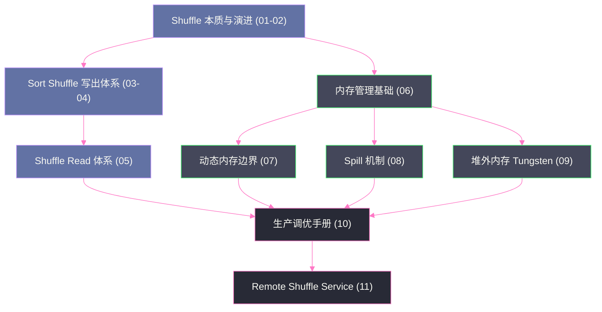

# Spark Shuffle 与内存管理机制深度解析

## 专栏简介

Shuffle 是分布式计算框架中代价最高的操作——它意味着数据必须跨越节点边界重新分布，涉及序列化、磁盘溢写、网络传输、反序列化等一系列开销。与此同时，内存管理决定了 Spark 在有限物理内存约束下究竟能跑多快、能跑多大的数据。这两件事深度耦合：Shuffle 的写出与读取全程依赖内存缓冲；内存不足会触发 Spill，Spill 又会引爆磁盘 I/O。

本专栏从「为什么」出发，循序渐进地拆解 Spark Shuffle 的演进历史、核心写出/读取流程、统一内存管理模型的设计哲学，以及生产环境的调优实战，最后延伸至当下最热门的 Remote Shuffle Service（RSS）架构。每篇文章均遵循**是什么 → 为什么出现 → 不这样会怎样 → 在 Spark 中如何落地 → 边界与反例**的逻辑展开。

---

## 技术地图

---

## 阅读路径建议

**路径一：快速通道（理解核心机制）**
→ 01 → 03 → 04 → 05 → 06 → 07

**路径二：完整通道（深入底层原理）**
→ 01 → 02 → 03 → 04 → 05 → 06 → 07 → 08 → 09 → 10 → 11

**路径三：生产运维（直接上手调优）**
→ 01（快速阅读）→ 06 → 07 → 08 → 10 → 11

---

## 篇目目录

| 序号 | 文章标题 | 核心主题 | 难度 |
|------|---------|---------|------|
| 01 | [[01 为什么 Shuffle 是分布式计算的命门]] | Shuffle 本质定义、代价来源、演进动因 | ⭐⭐ |
| 02 | [[02 Hash Shuffle 的设计与致命缺陷]] | Hash Shuffle 实现原理、文件数爆炸问题定量分析 | ⭐⭐⭐ |
| 03 | [[03 Sort Shuffle 的崛起：统一写出模型]] | SortShuffleManager 三种 Writer 策略与选择逻辑 | ⭐⭐⭐ |
| 04 | [[04 Shuffle Write 深度解剖：排序、合并与索引文件]] | ExternalSorter、Spill-Merge、双文件格式 | ⭐⭐⭐⭐ |
| 05 | [[05 Shuffle Read 深度解剖：拉取、聚合与排序]] | BlockStoreShuffleReader、MapOutputTracker、网络拉取 | ⭐⭐⭐⭐ |
| 06 | [[06 Spark 统一内存管理模型：为什么要统一]] | UnifiedMemoryManager 设计目标、堆内外空间划分 | ⭐⭐⭐ |
| 07 | [[07 Execution 与 Storage 的动态边界：弹性借还机制]] | 动态内存边界、借还规则的不对称性、eviction | ⭐⭐⭐⭐ |
| 08 | [[08 Spill 机制：内存撑不住时 Spark 怎么办]] | Spill 触发、DiskBlockManager、序列化格式与性能 | ⭐⭐⭐⭐ |
| 09 | [[09 堆外内存：Tungsten 的 Unsafe 内存世界]] | 绕过 JVM GC、Unsafe 直接内存、UnsafeShuffleWriter | ⭐⭐⭐⭐⭐ |
| 10 | [[10 生产调优手册：Shuffle 与内存的实战经验]] | 参数调优、OOM 诊断、数据倾斜、AQE 特性 | ⭐⭐⭐⭐ |
| 11 | [[11 Remote Shuffle Service：将 Shuffle 从 Executor 中解放出来]] | RSS 架构、Push-based Shuffle、Celeborn/Uniffle 对比 | ⭐⭐⭐⭐⭐ |

---

## 关键概念索引

- [[SortShuffleManager]] / [[HashShuffleManager]]
- [[ExternalSorter]] / [[ExternalAppendOnlyMap]]
- [[UnifiedMemoryManager]] / [[StaticMemoryManager]]
- [[MemoryPool]] / [[ExecutionMemoryPool]] / [[StorageMemoryPool]]
- [[BlockStoreShuffleReader]] / [[MapOutputTracker]]
- [[DiskBlockManager]] / [[DiskBlockObjectWriter]]
- [[UnsafeShuffleWriter]] / [[ShuffleExternalSorter]]
- [[Apache Celeborn]] / [[Apache Uniffle]]
- [[Tungsten]] / [[JVM GC]] / [[Page Cache]]

---

## 前置知识

阅读本专栏前，建议先了解：
- [[Spark RDD 核心原理]] — 理解 RDD 算子语义与宽依赖/窄依赖
- [[Spark 调度系统与执行模型]] — 理解 Stage 切分与 Task 执行机制
- [[JVM 内存模型基础]] — 理解堆内/堆外内存、GC 基本原理
