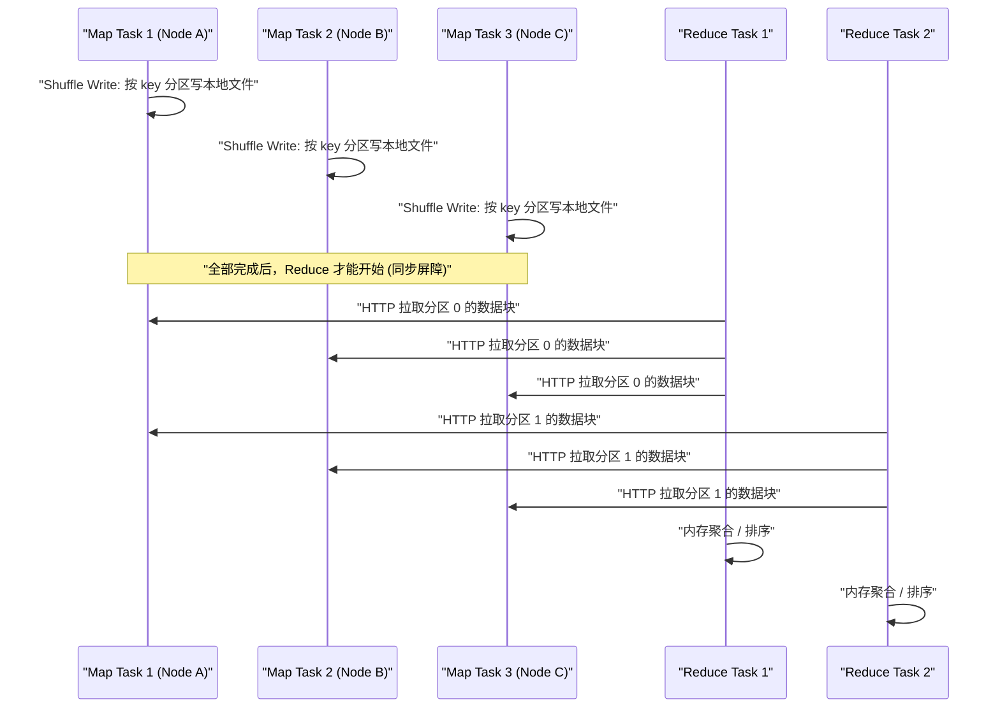
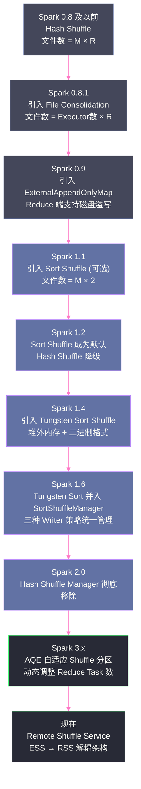

zo
# 01 为什么 Shuffle 是分布式计算的命门

## 摘要

在 Spark 的所有操作中，Shuffle 是代价最高、最难以控制、也最容易成为性能瓶颈的一类操作。它不是某个具体的 API，而是分布式计算中一个根本性的物理现象——当数据必须跨越分区边界重新分布时，Shuffle 就必然发生。本文从第一性原理出发，回答三个问题：Shuffle 的本质是什么？它的代价究竟来自哪里？Spark 为什么要在 Shuffle 机制上持续演进？通过对这三个问题的深度拆解，你将建立起一个贯穿整个专栏的认知底座。

---

## 第 1 章 从一个问题开始：数据为什么需要移动

### 1.1 分布式计算的基本假设

学习 Spark 的人往往很早就接触到一句话："移动计算而非移动数据"。这句话来自 [[Hadoop]] 时代的设计哲学，它的背后是一个朴素的直觉：网络传输比磁盘本地 I/O 慢，比内存计算更慢，因此应当尽量让计算任务调度到数据所在的节点上执行，而不是把数据搬到计算节点来。

这个直觉在绝大多数场景下都是对的。Spark 的数据本地性调度（[[Data Locality]]）正是这一哲学的工程实现——调度器会优先将 Task 分配给持有该分区数据的节点，依次按照 `PROCESS_LOCAL` → `NODE_LOCAL` → `RACK_LOCAL` → `ANY` 的优先级降级。

然而，"移动计算"这个原则有一个根本的前提：**数据的分布方式与计算的访问模式必须吻合**。

考虑一个最简单的场景：你有一张用户行为表，按用户 ID 做了哈希分区，分散在 100 个节点上。现在你需要计算每个城市的用户数——这需要按城市 ID 聚合，而城市 ID 的分布与用户 ID 的哈希分区毫无关系。来自同一城市的用户数据，此刻散落在 100 个不同的节点上。

**这就是 Shuffle 不可避免的根本原因**：当一个计算操作需要的数据聚合粒度，与数据在集群中的物理分布方式不一致时，数据就必须移动。无论你的框架多么先进，这个物理约束是绕不开的。

### 1.2 "移动数据"在什么时候不可避免

更精确地说，Shuffle 发生的条件是：**下游 Task 需要消费的输入数据，不能由单个上游 Task 的输出完整提供**。

在 [[Spark RDD]] 的世界里，这对应着「宽依赖」（Wide Dependency）的概念：一个下游分区需要来自多个上游分区的数据，而这些上游分区分属不同的 Task，运行在不同的节点上。

常见的触发 Shuffle 的算子包括：

| 算子类型 | 典型代表 | Shuffle 触发原因 |
|---------|---------|----------------|
| **重分区** | `repartition`, `coalesce`（增分区） | 数据需要按新的分区数重新分布 |
| **聚合** | `reduceByKey`, `groupByKey`, `aggregateByKey` | 相同 key 的数据必须汇聚到同一分区 |
| **排序** | `sortByKey`, `orderBy` | 全局有序需要数据的全局重排 |
| **连接** | `join`, `cogroup` | 两个 RDD/DataFrame 的相同 key 必须在同一分区才能 join |
| **集合运算** | `distinct`, `intersection` | 去重、交集需要将相同元素汇聚 |

注意，并非所有"看起来需要跨节点通信"的操作都会触发 Shuffle。`map`、`filter`、`flatMap` 这类算子每个输入分区独立处理，输出分区与输入分区一一对应，不涉及任何数据移动。`broadcast join` 则通过将小表广播到每个节点来规避 Shuffle。

理解这个分类的意义在于：**你可以主动选择算法来规避不必要的 Shuffle**。这是 Spark 调优中最高投资回报率的一类操作。

> [!note] 设计哲学
> Shuffle 是分布式系统中「局部性原理」失效的必然代价。局部性（Locality）是计算机系统性能的基础假设之一——无论是 CPU Cache 的时间局部性/空间局部性，还是分布式系统的数据本地性，其本质都是"尽量让计算和数据靠近"。Shuffle 恰恰是在局部性完全被打破时，系统不得不支付的"跨域通信税"。

---

## 第 2 章 Shuffle 的代价：一次全量数据的长征

### 2.1 Shuffle 的物理全景

当一个 Shuffle 操作发生时，Spark 将整个数据流程分成两个阶段，以一个明确的分界点隔开：

- **Shuffle Write（Map 侧）**：上游 Stage 的每个 Task 将自己的输出数据，按照目标分区规则（通常是对 key 哈希取模）进行分类，写出到本地磁盘文件。
- **Shuffle Read（Reduce 侧）**：下游 Stage 的每个 Task 通过网络，从所有上游 Task 的输出文件中拉取属于自己分区的数据块，然后在内存中进行聚合或排序。

这两个阶段之间有一道"屏障"（Barrier）：下游 Stage 的任何 Task 都必须等到上游 Stage 的**所有 Task 全部完成**后，才能开始 Shuffle Read。这个屏障是分布式系统中「同步点」（Synchronization Point）的典型体现，它直接导致了 Shuffle 的高延迟——哪怕只有一个上游 Task 因为数据倾斜而运行缓慢，整个下游 Stage 都必须等待。



### 2.2 Shuffle 代价的五个来源

理解了 Shuffle 的物理全景，它的高代价就一目了然了。

**代价一：磁盘 I/O（写端）**

Shuffle Write 阶段，Map Task 必须将数据写到本地磁盘，而不能仅仅留在内存中。原因很直接：如果 Map Task 写完就退出，其内存会被回收，而下游 Reduce Task 还没开始读。所以 Shuffle 数据必须持久化到磁盘，等待 Reduce Task 来拉取。

这意味着 Shuffle 数据至少会被写一次磁盘（Write 端）、读一次磁盘（Read 端），总计两次磁盘 I/O，完全打破了 Spark "in-memory computation" 的美好假设。

> [!warning] 生产避坑
> 很多工程师认为 Spark 就是纯内存计算，实际上只有不触发 Shuffle 的纯流水线计算才是纯内存的。一旦涉及 Shuffle，磁盘 I/O 就不可避免。当你的 Spark 作业慢到怀疑人生时，先看一眼 Spark UI 的 Stage 详情页里的 "Shuffle Write/Read" 指标，很可能问题就在这里。

**代价二：序列化与反序列化**

数据在内存中是 JVM 对象的形式，但要写入磁盘文件或通过网络传输，就必须先序列化成字节流，读取时再反序列化回对象。对于大数据量场景，这个过程的 CPU 开销相当可观。

Spark 支持 Java 原生序列化和 [[Kryo]] 序列化两种方式。Kryo 的速度约是 Java 序列化的 10 倍，生成的字节流也更小，对 Shuffle 性能的提升非常显著。这也是为什么 Spark 官方文档将 `spark.serializer=org.apache.spark.serializer.KryoSerializer` 列为最重要的性能参数之一。

**代价三：网络传输**

Reduce Task 通过 [[Netty]] 框架，以 HTTP 协议从远程节点拉取 Shuffle 数据块。在一个中等规模的作业中，一次 Shuffle 可能产生数 GB 甚至数十 GB 的网络流量，这对集群的网络带宽形成直接压力。

更糟糕的是，多个 Reduce Task 可能同时从同一个 Map Task 的输出文件中拉取数据，形成并发读取的热点。这也是 Shuffle 优化中需要重点关注的资源争用场景。

**代价四：内存压力（读端聚合）**

Reduce Task 拉取数据后，需要在内存中进行聚合操作（例如 `reduceByKey` 的累加）。当数据量远超可用内存时，就会触发 Spill，将内存中的中间结果溢写到磁盘，后续再合并。这引入了额外的磁盘 I/O，并且可能造成 OOM。

**代价五：同步等待（Barrier 效应）**

如前所述，下游 Stage 必须等待上游 Stage 全部完成。在一个有数百个 Task 的 Stage 中，只要有少数几个 Task 因为数据倾斜（[[Data Skew]]）、节点故障重试或 GC 停顿而运行缓慢，整个 Stage 的完成时间就会被拖长。这被称为"长尾任务"问题（Straggler Problem），是 Shuffle 优化中最难处理的问题之一。

### 2.3 一次 Shuffle 的全链路开销定量感知

为了建立量化感知，我们假设一个具体场景：

- 100 个 Map Task，每个 Task 产生 100MB 的 Shuffle 数据
- 100 个 Reduce Task，每个 Reduce Task 需要读取每个 Map Task 的 1MB 数据
- 集群网络带宽：10Gbps（约 1.25GB/s）

在这个场景下：

| 阶段 | 开销估算 |
|------|---------|
| **Shuffle Write 总量** | 100 × 100MB = 10GB 写磁盘 |
| **Shuffle Read 总量** | 100 × 100MB = 10GB 读磁盘 + 10GB 网络传输 |
| **总磁盘 I/O** | 20GB（写 10GB + 读 10GB） |
| **网络传输量** | 10GB |
| **最短网络时间** | 10GB ÷ 1.25GB/s ≈ 8 秒（理想情况） |
| **序列化/反序列化** | 视数据类型，约 5%-20% 的额外 CPU 开销 |

在真实集群中，由于磁盘 I/O 竞争、网络拥塞、序列化开销叠加，实际 Shuffle 时间往往比理论值高出 3-5 倍。这还不算数据倾斜带来的长尾效应。

---

## 第 3 章 Shuffle 的演进：Spark 如何一步步减轻这个代价

### 3.1 MapReduce 的 Shuffle 遗产

在理解 Spark Shuffle 的演进之前，有必要了解它的"祖先"——[[MapReduce]] 的 Shuffle 机制，因为 Spark 的早期实现深受其影响，甚至直接继承了它的很多问题。

MapReduce 的 Shuffle 流程如下：

1. **Map 端排序**：Map Task 在内存中使用一个固定大小的环形缓冲区（默认 100MB）收集输出。当缓冲区满 80% 时，触发 Spill：对缓冲区内的数据按 key 排序（使用 `combiner` 做局部聚合），然后写入临时磁盘文件。Map Task 结束时，将所有临时文件合并成一个有序文件，并生成索引文件。

2. **Reduce 端拉取**：Reduce Task 从 `JobTracker`（后来是 `ApplicationMaster`）查询 Map Task 完成情况，然后并发地通过 HTTP 从各个节点拉取属于自己分区的数据。拉取的数据先写入内存，内存不足则 Spill 到磁盘。最终对所有拉取的数据做归并排序，得到按 key 排序的最终输入。

MapReduce 的这个设计有一个重要特点：**Map 端强制排序**。每个 Map Task 的输出文件是按 key 有序的，每个 Reduce Task 拿到的数据块也是有序的，最终通过归并排序得到全局有序的输入。这个设计使得 `reduce()` 函数可以按 key 顺序处理数据，适合很多算法模式。

但这也带来了问题：**不是所有计算都需要排序**。如果你只是想做一个简单的 `wordCount`，对单词出现顺序没有任何要求，但 MapReduce 仍然强制排序，白白消耗了大量 CPU 和内存。

### 3.2 Spark 1.x：Hash Shuffle 的野蛮生长

Spark 的早期版本（0.x 到 1.x 初期）采用了一个看似更聪明的方案：**Hash Shuffle**。

其设计思路很直接：既然 MapReduce 的排序没有必要，那就不排序。Map Task 直接按照目标分区的哈希值，将数据写入对应的文件。如果有 R 个 Reduce Task，那么每个 Map Task 就写出 R 个文件，每个文件对应一个 Reduce Task。

这个设计的优点是**实现简单、没有排序开销**。对于小规模集群，它工作得很好。

但当集群规模扩大，问题就暴露出来了。

假设有 M 个 Map Task 和 R 个 Reduce Task，整个 Shuffle 过程产生的文件数是 **M × R**。这看起来是一个简单的乘法，但在真实集群中，这个数字可以大到触目惊心：

- 1000 个 Map Task × 1000 个 Reduce Task = **100 万个文件**

100 万个小文件意味着什么？

- **文件系统元数据压力**：每创建一个文件，操作系统都要在文件系统中维护一个 inode。100 万个文件会消耗大量 inode，在某些文件系统配置下甚至会耗尽 inode，导致无法创建新文件。
- **小文件读写低效**：每次 Reduce Task 拉取数据，都要打开一个文件，读完后关闭。对于磁盘来说，随机小 I/O 的效率远低于顺序大 I/O。
- **OS 文件描述符限制**：每个打开的文件都消耗一个文件描述符（File Descriptor）。Linux 默认的 fd 上限是 1024，即使调大也有上限。100 万个文件的并发访问很容易触发 "Too many open files" 错误。
- **节点内存压力**：Map Task 需要同时维持 R 个写缓冲区（每个文件一个），当 R 很大时，内存压力极大。

这个问题在 Spark 0.8.1 中通过引入 **File Consolidation（文件合并）** 机制做了一定程度的缓解：同一个 Executor 上串行执行的 Map Task，可以复用同一组文件，而不是每个 Task 单独创建。这将文件数从 `M × R` 降低到 `E × R`（E 为 Executor 数）。但问题没有根本解决——R 依然是乘数，当 Reduce Task 数量增大时，文件数仍然不可控。

> [!info] 核心概念
> **为什么文件数是问题的核心？**
> 在分布式系统中，"文件"不仅仅是一个数据容器，它还承载着元数据（大小、位置、权限）、OS 缓存（Page Cache）、文件描述符等系统资源。大量小文件会导致元数据服务成为瓶颈、缓存命中率下降、随机 I/O 放大等一系列连锁问题。这是 Hadoop 生态中"小文件问题"的通病，Spark Hash Shuffle 不过是这个通病在 Shuffle 场景下的具体表现。

### 3.3 Spark 1.1：Sort Shuffle 登场

Spark 1.1 引入了 **Sort Shuffle**，借鉴了 MapReduce 的思路，但加入了 Spark 自己的改进。

Sort Shuffle 的核心思想：**每个 Map Task 的所有输出，合并写入一个数据文件，同时生成一个索引文件记录每个分区的偏移量**。

这一个改变，将文件数从 `M × R` 降低到了 `M × 2`（每个 Map Task 一个数据文件 + 一个索引文件）。无论 Reduce Task 数 R 有多大，Map 端的文件数都只与 Map Task 数成正比。

这个改变有多大？在前面的例子里（1000 Map Tasks，1000 Reduce Tasks）：
- Hash Shuffle：1,000,000 个文件
- Sort Shuffle：2,000 个文件

文件数减少了 **500 倍**。

代价是什么？Map Task 在写出数据时，需要对所有输出数据按目标分区 ID 排序（不一定按 key 排序），以便能将同一分区的数据连续写入文件。这个排序有额外的 CPU 开销，但相比文件数爆炸问题，这个代价完全值得。

Spark 1.2 将 Sort Shuffle 设为默认行为，Hash Shuffle 逐渐退出历史舞台（在 Spark 2.0 中被彻底移除）。

### 3.4 Tungsten 计划：更深层的优化

Spark 1.4 引入了 **[[Tungsten]]** 项目，这是对 Shuffle 乃至整个 Spark 执行引擎的一次底层重构。Tungsten 的核心切入点是：**JVM 对象模型对大数据处理来说开销太大**。

一个 Java `String` 对象，假设其内容是 "hello"，在 JVM 堆内存中占用的空间远超 5 个字节——它还包含对象头（16 字节）、char 数组对象头（16 字节）、以及 char 数组本身（10 字节，每个 char 占 2 字节），总计约 56 字节，是字符串实际内容的 11 倍。

Tungsten 通过 `sun.misc.Unsafe` 直接管理堆外内存，以紧凑的二进制格式存储数据，绕过 JVM 的对象模型和 GC 机制。这为 Shuffle 的 Write 端带来了显著的内存效率提升，我们将在第 09 篇中深入剖析。

### 3.5 演进时间线全览



---

## 第 4 章 Shuffle 在 Spark 架构中的位置

### 4.1 Stage 边界与 Shuffle 的关系

在 [[Spark 调度系统]] 中，DAGScheduler 负责将一个 Job 的 RDD 计算图（DAG）切分成多个 Stage。切分的依据正是：**宽依赖就是 Stage 的边界**。

每一个宽依赖（即 Shuffle 依赖）都会导致 DAGScheduler 在该处划出一条 Stage 边界，前一个 Stage 的 Task 执行 Shuffle Write，后一个 Stage 的 Task 执行 Shuffle Read。这就是为什么在 Spark UI 中，你总能在 Stage 的起点看到 "Shuffle Read" 指标，在 Stage 的终点看到 "Shuffle Write" 指标。

理解这一点对于读懂 Spark UI 非常重要：

- **Shuffle Write Size**：该 Stage 所有 Task 写出的 Shuffle 数据总量。如果这个数字很大，说明下游 Stage 会有大量网络传输。
- **Shuffle Read Size**：该 Stage 所有 Task 读入的 Shuffle 数据总量。正常情况下，一个 Stage 的 Shuffle Read Size 应该等于其上游 Stage 的 Shuffle Write Size。
- **Shuffle Spill (Memory)**：Reduce 端在内存中缓冲的数据量，超过这个数字后触发 Spill。
- **Shuffle Spill (Disk)**：Spill 到磁盘的数据量。如果这个数字很大，说明 Executor 内存配置不足，或者数据倾斜导致某些 Task 的数据量远超预期。

### 4.2 ShuffleManager：Shuffle 的门面接口

Spark 将 Shuffle 的所有实现细节封装在 `ShuffleManager` 接口后面。这个接口非常简洁，核心只有三个方法：

```scala
// org.apache.spark.shuffle.ShuffleManager
trait ShuffleManager {
  // 注册一个 Shuffle（返回 ShuffleHandle，携带分区信息等元数据）
  def registerShuffle[K, V, C](shuffleId: Int, dependency: ShuffleDependency[K, V, C]): ShuffleHandle

  // 根据 ShuffleHandle 返回对应的 ShuffleWriter（由 Map Task 调用）
  def getWriter[K, V](handle: ShuffleHandle, mapId: Long, context: TaskContext,
                      metrics: ShuffleWriteMetricsReporter): ShuffleWriter[K, V]

  // 根据参数返回对应的 ShuffleReader（由 Reduce Task 调用）
  def getReader[K, C](handle: ShuffleHandle, startMapIndex: Int, endMapIndex: Int,
                      startPartition: Int, endPartition: Int, context: TaskContext,
                      metrics: ShuffleReadMetricsReporter): ShuffleReader[K, C]
}
```

当前 Spark 唯一内置的实现是 `SortShuffleManager`。通过这个接口，理论上也可以接入外部的 Remote Shuffle Service（RSS）实现，这正是第 11 篇要介绍的内容。

`ShuffleManager` 在 `SparkEnv` 初始化时被创建，通过 `spark.shuffle.manager` 参数配置（默认值 `sort`）。这也是 RSS 接入 Spark 的插件化入口之一。

### 4.3 Shuffle 与内存管理的耦合

本专栏的主题是"Shuffle 与内存管理"，这并非两个独立的话题，而是深度耦合的。

在 Shuffle Write 阶段，数据在写入磁盘之前，先在内存中的 `PartitionedPairBuffer` 或 `PartitionedAppendOnlyMap` 中缓冲和排序。当内存中缓冲的数据量超过阈值时，触发 Spill，将数据写入临时文件。

在 Shuffle Read 阶段，拉取到的数据在 `ExternalAppendOnlyMap`（用于聚合）或 `ExternalSorter`（用于排序）中处理，同样面临内存不足时 Spill 的问题。

这些内存的使用，都由 [[UnifiedMemoryManager]]（统一内存管理器）统一调度。Shuffle 需要的内存从 Execution Memory 池中分配；如果 Execution Memory 不足，需要向 Storage Memory 借用。这个借还机制的设计细节，直接决定了 Spark 在内存受限场景下的稳定性。

理解了这个耦合关系，你才能真正明白：为什么 OOM 经常在 Shuffle 阶段发生？为什么调大 `spark.memory.fraction` 有时能解决 OOM 但有时反而更糟？为什么某些作业反复 Spill 但就是不 OOM？这些问题的答案，都深藏在 Shuffle 与内存管理的交互机制中。

---

## 第 5 章 Shuffle 是可以被优化的：但要找到正确的切入点

### 5.1 两类优化策略

Shuffle 优化有两个层面：

**第一层：避免 Shuffle**
这是投资回报率最高的优化。如果一个 Shuffle 本来就可以避免，那么无论你把 Shuffle 实现得多高效，都不如根本不执行 Shuffle。

典型手段：
- **Broadcast Join**：当一个表足够小时，将其广播到所有节点，避免大表的 Shuffle
- **Bucket Join**：预先按相同的分区方式对多个表分桶存储，消除 join 时的 Shuffle
- **使用窄依赖算子替代宽依赖算子**：例如用 `mapPartitions` + 局部聚合替代 `groupByKey`
- **预分区**：如果后续有多个操作需要按同一个 key 分区，一次 `repartition` 可以避免多次 Shuffle

**第二层：让 Shuffle 更高效**
当 Shuffle 无法避免时，通过参数调优和架构改进减少其代价。

典型手段：
- **增大 Map 端缓冲区**：减少 Spill 次数，`spark.shuffle.file.buffer`
- **启用 Kryo 序列化**：减少序列化时间和字节体积
- **调整 Reduce 端并发**：适当的分区数避免过多小 Task 或过少大 Task
- **启用 AQE**：让 Spark 3.x 的自适应查询执行自动优化 Shuffle 分区数
- **部署 RSS**：彻底重构 Shuffle 的存储和传输架构

### 5.2 理解"数据倾斜"为什么是 Shuffle 独有的问题

数据倾斜（[[Data Skew]]）是 Shuffle 性能问题中最棘手的一类，它不是参数调优能解决的，需要算法层面的干预。

倾斜的根本原因是：**数据的实际分布不均匀，而 Shuffle 的分区规则恰好将大量数据集中到少数分区**。

最经典的场景是 `groupByKey` 或 `join` 操作：假设你有一张用户行为表，其中 80% 的行为来自"匿名用户"（user_id = null）。当你按 user_id 做 `groupByKey` 时，处理 null 的那个 Reduce Task 会收到全量数据的 80%，而其他 Task 只分到 20%。这个 Reduce Task 会远远慢于其他 Task，成为整个 Stage 的长尾，导致 Stage 的完成时间等于最慢那个 Task 的时间。

解决方案通常是：
- 对倾斜 key 加随机前缀，打散数据，再做局部聚合后去除前缀做最终聚合
- 对 join 的倾斜 key 单独处理，其余 key 正常 join，最后 union
- 在 Spark 3.x 中，AQE 的 Skew Join 优化可以自动将倾斜分区进一步切分

### 5.3 本文与专栏后续文章的关系

本文建立的认知框架，是理解后续所有文章的基础：

- **第 02 篇**将从工程实现的角度，深入剖析 Hash Shuffle 的源码级设计与缺陷
- **第 03-04 篇**将全面解析 Sort Shuffle 的三种 Writer 策略和写出流程
- **第 05 篇**将深入 Shuffle Read 的拉取、聚合与排序机制
- **第 06-09 篇**将系统性拆解 Spark 的内存管理架构，解释 Shuffle 如何使用和争夺内存
- **第 10 篇**将把前面的理论转化为可操作的生产调优手册
- **第 11 篇**将介绍 Remote Shuffle Service 这一彻底改变 Shuffle 架构的新方向

---

## 第 6 章 一个思想实验：如果没有 Shuffle，会怎样

### 6.1 假设世界：纯分区本地计算

假设我们设计一个"无 Shuffle"的分布式计算系统。为了避免任何跨节点数据移动，我们要求：**所有计算操作的访问模式，必须与数据的物理分布方式严格对齐**。

这意味着：
- 你必须在数据写入时就决定所有未来的查询模式
- 如果要支持按用户 ID 查询，数据就按用户 ID 分区
- 如果要支持按城市查询，数据就需要再按城市分区存储一份
- 如果要支持 join，两张表就必须预先按相同的 key 分区

这不是虚构的——这正是 **OLAP 列式存储**（如 [[ClickHouse]]、[[Doris]]）的设计思路：通过精心设计的分区键和排序键，让常见查询模式尽量命中本地数据，避免跨节点扫描。ClickHouse 的 `Distributed Table` + `Local Table` 架构、Doris 的 `Bucket Shuffle Join`，都是这一思路的工程实践。

但这个思路的局限性也很明显：**它牺牲了通用性，换取特定访问模式下的极致性能**。当访问模式改变，或者查询需求超出了预先设计的访问模式时，就必须全量扫描或建立新的物化视图。

### 6.2 Shuffle 的本质价值：计算的通用性

Spark 之所以接受 Shuffle 的高代价，是因为它需要提供**通用的计算能力**。你不需要在读入数据时就预知所有的查询模式，你可以随时写出任意的转换和聚合逻辑，Spark 会在运行时处理所有的数据重分布。

这种通用性是有代价的，代价就是 Shuffle 的开销。这也解释了为什么 OLAP 系统不能完全替代 Spark——OLAP 系统在固定查询模式下更快，但在通用数据处理场景下，Spark 的灵活性是无可替代的。

> [!note] 设计哲学
> **没有免费的午餐（No Free Lunch）**：通用性与性能之间永远存在张力。Shuffle 是通用性的必要代价，而优化 Shuffle 的本质，是在保持通用性的前提下，尽量减少这个代价。理解了这个根本矛盾，你就理解了 Spark 整个 Shuffle 演进史的驱动力。

---

## 小结

本文从第一性原理出发，建立了理解 Spark Shuffle 的完整认知框架：

- **Shuffle 的本质**：当计算访问模式与数据物理分布不对齐时，数据必须跨节点移动，这是分布式计算中不可避免的物理约束
- **Shuffle 的代价**：磁盘 I/O（写端 + 读端两次）、序列化、网络传输、读端聚合内存压力、同步屏障带来的长尾效应——五类开销叠加
- **Shuffle 的演进**：从 Hash Shuffle 的文件数爆炸，到 Sort Shuffle 的统一写出模型，再到 Tungsten 的堆外内存优化，Spark 在每个版本都在持续减轻 Shuffle 的代价
- **Shuffle 与内存的耦合**：Shuffle 的 Write/Read 两端都深度依赖内存管理，理解内存管理才能理解 Shuffle 的行为边界

接下来，第 02 篇将带你进入 Hash Shuffle 的源码层面，深入理解文件数爆炸问题的量化规模，以及 File Consolidation 优化为什么只是治标不治本。

---

> [!note] 思考题
> 1. Shuffle 的五类代价（序列化、磁盘 I/O、网络传输、反序列化、内存压力）中，在不同的集群规模下，哪类代价最容易成为瓶颈？在千节点规模的集群与十节点规模的集群上，Shuffle 的主要瓶颈往往不同——为什么？
> 2. Spark 提供了 `reduceByKey` 和 `groupByKey` 两个算子，前者在 Map 端做局部聚合（Combine），后者不做。`reduceByKey` 之所以性能更好，不仅因为减少了网络传输量，还因为它改变了 Shuffle 的哪些底层行为？在什么情况下两者的结果会不一致？
> 3. 宽依赖是 Shuffle 的充要条件吗？`coalesce`（不 shuffle 版本）是一个宽依赖操作，但它不产生 Shuffle。这说明 Shuffle 与宽依赖之间的关系是什么？DAGScheduler 划分 Stage 的真正依据是什么？

## 参考资料

- [Spark Architecture: Shuffle](https://0x0fff.com/spark-architecture-shuffle/) — 深度解析 Spark Shuffle 架构
- [Optimizing Shuffle Performance in Spark (UC Berkeley, 2013)](https://people.eecs.berkeley.edu/~kubitron/courses/cs262a-F13/projects/reports/project16_report.pdf) — Spark Shuffle 优化的学术研究
- Apache Spark 官方文档 [Shuffle Behavior](https://spark.apache.org/docs/latest/configuration.html#shuffle-behavior)
- [[MapReduce]] — Google MapReduce 论文（Jeffrey Dean & Sanjay Ghemawat, 2004）
