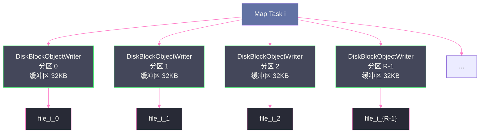
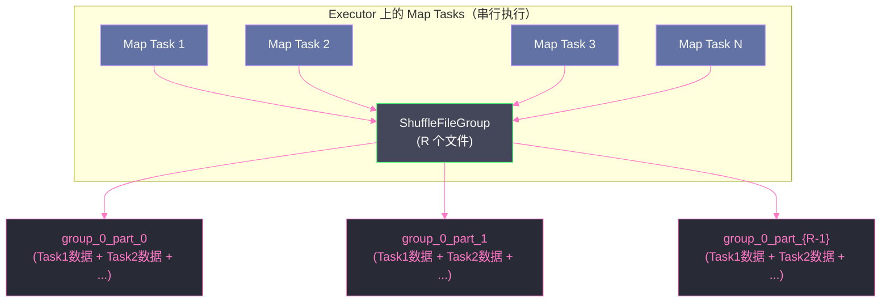

# 02 Hash Shuffle 的设计与致命缺陷

## 摘要

Hash Shuffle 是 Spark 最初的 Shuffle 实现方案，其设计思路简洁直接：每个 Map Task 按目标分区的哈希值将数据分散写入对应文件，Reduce Task 各取所需。这个方案在小规模集群上运行良好，但随着集群规模扩大，它的致命缺陷逐渐暴露——以 M × R 爆炸式增长的海量小文件，使集群的文件系统、操作系统资源和 JVM 内存同时承压。本文深入剖析 Hash Shuffle 的实现细节、File Consolidation 优化的工作原理及其局限性，揭示为什么这一方案最终被彻底放弃，以及它的失败为 Sort Shuffle 的设计提供了哪些关键教训。

---

## 第 1 章 Hash Shuffle 的设计哲学：反对"不必要的排序"

### 1.1 从 MapReduce 的排序说起

在第 01 篇中我们提到，[[MapReduce]] 的 Shuffle 强制对 Map 端输出进行排序。这个设计是有历史原因的：MapReduce 最初是为 Google 内部的大规模日志处理和网页索引构建而设计的，这些任务的 Reduce 函数天然需要按 key 有序地处理输入。全局排序让 Reduce 函数可以顺序地消费数据，而不需要在内存中维护一个巨大的哈希表来等待所有相同 key 的数据到齐。

然而，Spark 的应用场景远比 MapReduce 广泛。当你用 `rdd.count()` 统计行数，或者用 `rdd.map(f)` 做纯变换时，根本不需要 Shuffle。当你用 `reduceByKey` 做单词计数时，你需要的只是"把相同 key 的数据聚集到一个地方"，而不需要这些数据在聚集后还按 key 排好序。

排序的代价是真实的：它需要消耗 CPU 进行比较操作，需要内存来维护排序缓冲区（环形缓冲区），需要在缓冲区满时 Spill 并在最后做合并排序。对于一个不需要有序输入的 `reduceByKey` 来说，这些代价完全是浪费。

Spark 早期团队的判断是：**大多数 Spark 作业不需要有序的 Shuffle 输出**。那么何不省掉排序，直接按哈希分组写文件？这就是 Hash Shuffle 的出发点。

> [!note] 设计哲学
> Hash Shuffle 的核心主张是"按需付费"（Pay for What You Use）：如果你的计算不需要排序，就不应该承担排序的代价。这个主张本身是正确的，但 Hash Shuffle 的实现方式引入了另一个更严重的代价——小文件爆炸。理解这个取舍的失败，是理解 Sort Shuffle 设计动机的关键。

### 1.2 Hash Shuffle 的基本架构

Hash Shuffle 的核心逻辑非常简单，用伪代码描述如下：

```
对于每个 Map Task i（共 M 个）：
    创建 R 个输出文件：file_i_0, file_i_1, ..., file_i_{R-1}
    
    对于输入中的每条记录 (key, value)：
        partitionId = hash(key) % R
        将 (key, value) 序列化后追加写入 file_i_{partitionId}
    
    关闭所有 R 个文件
    
对于每个 Reduce Task j：
    从所有 M 个 Map Task 的输出中读取 file_0_j, file_1_j, ..., file_{M-1}_j
    对读取到的数据进行聚合
```

这个逻辑的优点是**零排序开销**：每条记录只做一次哈希运算，直接写入对应的文件，完全没有排序操作。

在 Spark 的实现中，这个逻辑对应两个核心类：

- **`HashShuffleManager`**：Shuffle 的顶层管理器，负责创建 Writer 和 Reader
- **`HashShuffleWriter`**：Map Task 的写出器，持有 R 个文件句柄，将数据路由到对应文件
- **`FileShuffleBlockResolver`**：负责管理 Shuffle 文件的路径映射，将 `(shuffleId, mapId, reduceId)` 三元组解析为具体的文件路径

### 1.3 HashShuffleWriter 的内存结构

`HashShuffleWriter` 在写出数据时，为每个目标分区维护一个独立的 `DiskBlockObjectWriter`。`DiskBlockObjectWriter` 并不是直接写磁盘的——它在内部维护了一个缓冲区（`java.io.BufferedOutputStream`，默认缓冲区大小由 `spark.shuffle.file.buffer` 控制，默认 32KB），当缓冲区满时才批量 flush 到磁盘。

这个设计带来了一个隐患：**每个 Map Task 同时持有 R 个打开的文件和对应的缓冲区**。当 R（Reduce Task 数量）很大时，单个 Map Task 消耗的内存就是 R × 32KB。

考虑一个中等规模的作业：R = 1000，每个 Map Task 的内存占用就是 1000 × 32KB = 32MB，仅用于维护写缓冲区。在一个 Executor 上同时运行 4 个 Task，就是 128MB 的写缓冲区内存。这还没算数据本身的内存占用。



---

## 第 2 章 文件数爆炸：M × R 的定量分析

### 2.1 文件数的数学推导

在 Hash Shuffle 中，每个 Map Task 产生 R 个文件，M 个 Map Task 共产生 **M × R** 个文件。这是一个简单的乘法，但其量级在真实集群中往往超出直觉。

我们来做一个具体的量化分析：

| 集群规模 | Map Tasks (M) | Reduce Tasks (R) | 文件总数 (M × R) |
|---------|--------------|-----------------|----------------|
| 小型（开发测试） | 100 | 100 | 10,000 |
| 中型（生产初期） | 500 | 500 | 250,000 |
| 大型（成熟生产） | 1,000 | 1,000 | **1,000,000** |
| 超大型 | 5,000 | 2,000 | **10,000,000** |

100 万到 1000 万个文件——这不是一个抽象的数字，而是会在每次 Shuffle 操作后残留在集群磁盘上的真实文件数量。我们来分析这些文件会带来哪些具体问题。

### 2.2 问题一：文件系统 inode 耗尽

每个文件在文件系统中对应一个 **inode**（Index Node，索引节点）。inode 存储了文件的元数据：文件大小、创建时间、修改时间、权限、数据块的磁盘位置等。**inode 的总数在文件系统格式化时就被确定了，是有上限的。**

Linux ext4 文件系统默认每 16KB 的磁盘空间分配一个 inode。对于一块 1TB 的磁盘，大约有 6400 万个 inode。这个数字看起来很大，但如果集群产生了 1000 万个 Shuffle 临时文件，加上其他系统文件，inode 资源会快速消耗。

更严重的是，inode 耗尽的错误信息非常迷惑性：当 inode 用完时，即使磁盘还有大量剩余空间，也无法创建新文件，操作系统会抛出 `No space left on device` 错误。这个错误与磁盘空间不足的报错一模一样，让很多工程师在排查时浪费了大量时间去检查磁盘使用率，却找不到问题所在。

> [!warning] 生产避坑
> 如果你的集群在 Shuffle 密集的作业运行后出现 `No space left on device` 错误，但 `df -h` 显示磁盘空间充足，请立刻运行 `df -i` 检查 inode 使用率。inode 耗尽是 Hash Shuffle 时代最常见的故障之一，即使在今天的 Sort Shuffle 下，如果 Spill 文件过多也可能触发同样的问题。

### 2.3 问题二：操作系统文件描述符限制

每个打开的文件都消耗一个**文件描述符**（File Descriptor，FD）。Linux 对每个进程的文件描述符数量有限制，通过 `ulimit -n` 查看，默认通常是 1024 或 4096。

在 Hash Shuffle 的 Reduce 阶段，每个 Reduce Task 需要从 M 个 Map Task 的输出中读取数据，也就是需要同时打开 M 个文件。当 M = 1000 时，单个 Reduce Task 就需要 1000 个文件描述符。如果一个 Executor 上有 4 个 Reduce Task 并发运行，就需要 4000 个文件描述符，轻松超过默认的 1024 上限。

超过文件描述符限制时，系统抛出 `Too many open files` 错误，Task 失败，触发重试，重试失败，作业崩溃。

虽然可以通过 `ulimit -n 65536` 调大限制来缓解这个问题，但这只是治标。真正的问题在于 Hash Shuffle 的设计迫使系统同时打开大量文件，这是一个结构性缺陷。

### 2.4 问题三：小文件的随机 I/O 惩罚

Hash Shuffle 产生的文件绝大多数都是**小文件**。这里的"小"是相对而言的——在一个 Map Task 输出 100MB 数据、分给 1000 个 Reduce Task 的场景下，每个文件平均只有 100KB。

磁盘的顺序读写速度远高于随机读写速度，这在机械硬盘（HDD）上尤为显著，但在固态硬盘（SSD）上也存在差异。更重要的是，每次打开和关闭文件都有系统调用开销（`open`、`read`、`close` 各需要一次内核态切换），对于 100KB 的小文件，这个固定开销占比极高。

从 [[Page Cache]] 的角度看，小文件也是不友好的：每次读取一个 100KB 的文件，操作系统至少需要加载几个内存页（每页 4KB），但如果这个文件很快被读取完毕就再也不会访问，这几个内存页很快就会被置换出去，缓存完全白费。

### 2.5 问题四：网络连接爆炸

在 Shuffle Read 阶段，Reduce Task 需要从各个 Map Task 所在节点拉取数据。每次拉取都是一个 HTTP 请求，意味着一次 [[TCP]] 连接的建立和关闭（或连接复用）。

在 Hash Shuffle 中，如果有 M 个 Map Task 分布在 N 个节点上，每个 Reduce Task 最坏情况下需要与 N 个节点各建立若干连接，拉取各节点上所有 Map Task 的对应分区文件。当 M 和 N 都很大时，并发的 HTTP 连接数会急剧增加，给网络带宽和连接管理带来巨大压力。

---

## 第 3 章 File Consolidation：一次有益但不彻底的优化

### 3.1 Consolidation 的核心思想

Spark 0.8.1 引入了 **File Consolidation（文件合并）** 机制，作为对 Hash Shuffle 文件数问题的第一次优化。

Consolidation 的核心观察是：在同一个 Executor 上，Map Task 是**串行执行**的（在核数有限的情况下）。Task 1 完成后，Task 2 才开始。Task 1 写出的文件在 Task 2 运行时处于"等待被读取"的状态，不再需要写入。

那么，Task 2 能不能复用 Task 1 创建的文件，把自己的数据**追加**到同一组文件的末尾？

这就是 Consolidation 的思路：**将一个 Executor 上所有串行执行的 Map Task 的输出，合并写入同一组文件**。

具体来说，Consolidation 引入了 **`ShuffleFileGroup`** 的概念：一个 ShuffleFileGroup 包含 R 个文件，对应 R 个 Reduce 分区。一个 Executor 上的所有 Map Task 共享同一个 ShuffleFileGroup（或者按照 CPU 核数分配多个 Group），每个 Task 将数据追加到对应的文件中。



### 3.2 Consolidation 的文件数计算

引入 Consolidation 后，文件数的计算方式发生了变化。设集群中有 E 个 Executor，每个 Executor 的 CPU 核数为 C（即并发运行的 Task 数），则：

- 每个 Executor 创建 C 个 ShuffleFileGroup（每个核对应一组）
- 每个 ShuffleFileGroup 包含 R 个文件
- 文件总数 = **E × C × R**

与原来的 M × R 相比，E × C 通常远小于 M（因为 M = E × C × 每核串行执行的 Task 轮数），所以文件数有了显著降低。

以具体数字举例：

| 配置 | M（Map Tasks） | R（Reduce Tasks） | E（Executors） | C（Cores/Executor） | 原始文件数 | Consolidation 后 |
|------|--------------|-----------------|--------------|---------------------|-----------|-----------------|
| 场景一 | 1,000 | 1,000 | 10 | 4 | 1,000,000 | 40,000 |
| 场景二 | 5,000 | 2,000 | 20 | 8 | 10,000,000 | 320,000 |

文件数确实大幅减少了——从百万量级降到了数万量级，改善了约 25-30 倍。这在 Spark 0.8.x 到 1.1.x 时代显著提升了集群在大规模任务下的稳定性。

### 3.3 Consolidation 的三个致命局限

然而，File Consolidation 没有解决 Hash Shuffle 的根本问题，它只是把问题推迟暴露了。

**局限一：R 依然是乘数**

Consolidation 后的文件数是 E × C × R，R（Reduce Task 数）仍然出现在乘法中。当 R 很大时（比如一个需要 10,000 个分区的 Shuffle），即使 E × C 很小，文件数依然可观。

更关键的是，**R 完全由用户决定**，而用户往往倾向于将 R 设大以避免数据倾斜或提高并行度。在 Hash Shuffle 时代，每次有人把 `spark.default.parallelism` 从 200 调到 2000，文件数就直接翻 10 倍，系统稳定性随之急剧下降。

**局限二：并发 Task 的内存问题没有解决**

虽然串行 Task 可以复用 ShuffleFileGroup，但**并发 Task 不能共享**——每个并发 Task 仍然需要维护 R 个独立的写缓冲区。一个 Executor 上 C 个并发 Task 同时运行，内存占用是 C × R × 缓冲区大小，这个问题完全没有改善。

**局限三：Reduce 端读取路径复杂化**

在没有 Consolidation 的 Hash Shuffle 中，每个 (mapId, reduceId) 对应一个独立文件，Reduce Task 通过 (mapId, reduceId) 直接定位文件并读取，逻辑简单。

引入 Consolidation 后，多个 Map Task 的数据被合并写入同一个文件，Reduce Task 在读取时必须知道自己的数据在文件中的**偏移量**（offset）和长度（length），才能正确读取属于自己的部分。`FileShuffleBlockResolver` 必须维护一个复杂的偏移量索引，每次读取前都要查询这个索引。虽然这个索引的维护开销不大，但它增加了系统的复杂度。

### 3.4 Consolidation 无法解决的根本矛盾

Consolidation 是一个局部优化，但它没有触碰 Hash Shuffle 的根本设计——**每个 Reduce 分区对应一个独立的文件（或文件段）**。只要保持这个设计，R 就永远是文件数的乘数，文件数就永远随 R 的增大而线性增长。

要真正解决这个问题，需要一个完全不同的思路：**能否让每个 Map Task 只写出一个文件，同时让所有 Reduce Task 都能从这一个文件中读到自己的数据？**

答案是可以的，这正是 Sort Shuffle 的核心思路。但要实现"一个文件对应所有分区"，就必须引入某种方式来标记每条数据的目标分区——而最自然的方式就是**排序**：把所有数据按目标分区 ID 排序后写入文件，同一分区的数据就会连续存放，通过一个额外的索引文件记录每个分区的起止偏移量，Reduce Task 就能精确定位并读取自己的数据。

这就是 Hash Shuffle 失败留下的最重要教训：**要减少文件数，就必须合并写出；要实现合并写出并保持可索引，就必须引入排序或某种等价的有序化操作**。Spark 最终接受了这个代价，在 1.1 版本引入了 Sort Shuffle。

---

## 第 4 章 Hash Shuffle 的遗留：为什么它的思想并没有消亡

### 4.1 BypassMergeSortShuffleWriter 的前世今生

Hash Shuffle 被移除了，但它的核心思想——"在 R 较小时，不排序直接按分区哈希写文件更高效"——并没有被完全否定。

在 Sort Shuffle 中，有一种特殊情况：当 Reduce Task 数量 R 很小（默认阈值 `spark.shuffle.sort.bypassMergeThreshold = 200`），且 Map 端不需要做聚合（`mapSideCombine = false`）时，Spark 会选择使用 **`BypassMergeSortShuffleWriter`**，而不是标准的排序写出路径。

`BypassMergeSortShuffleWriter` 的行为和 Hash Shuffle 极其相似：
1. 为每个 Reduce 分区创建一个临时文件
2. 将数据按分区哈希直接写入对应临时文件（无排序）
3. 所有数据写完后，将所有临时文件**合并拼接**成一个最终的数据文件
4. 生成索引文件，记录每个分区在最终文件中的偏移量

注意步骤 3 的关键不同：`BypassMergeSortShuffleWriter` 最终会把 R 个临时文件合并成 1 个文件（和 Sort Shuffle 一样），所以最终落盘的文件数是 `M × 2`（数据文件 + 索引文件），完全符合 Sort Shuffle 的文件数标准。

这个设计完美地继承了 Hash Shuffle "无排序开销"的优点，同时规避了"文件数爆炸"的缺陷——代价是 Map Task 结束时需要一次文件合并操作（读取 R 个临时文件，合并写入 1 个最终文件），但当 R 较小时，这个代价完全可以接受。

> [!info] 核心概念
> `BypassMergeSortShuffleWriter` 是 Hash Shuffle 哲学在 Sort Shuffle 框架内的一次"复活"——它证明了"无排序的哈希写出"在 R 较小时依然是最优策略，Sort Shuffle 并没有一刀切地强制排序，而是根据场景做了智能选择。这种"分场景策略"的设计思路，在工程实践中极具参考价值。

### 4.2 Hash Shuffle 失败的本质教训

回顾 Hash Shuffle 的完整生命周期，它的失败可以归结为一个根本性的设计错误：**在设计时只优化了局部（单个 Task 的处理开销），而忽视了全局（整个集群的资源开销）**。

单个 Map Task 写出 R 个文件，这个操作本身很高效——无排序，无 Spill，直接写出。但当这个操作在 M 个 Task 上并行执行时，M × R 个文件的系统级代价就完全压倒了单 Task 级别的效率收益。

这是分布式系统设计中一个反复出现的陷阱：**局部最优不等于全局最优**。一个在单机视角下看起来非常合理的设计，在集群视角下可能是灾难性的。

Hadoop MapReduce 的强制排序看起来是"不必要的开销"，但它隐含了一个全局约束：每个 Map Task 只产生一个有序文件，这保证了文件数与 M 成线性关系，而不是与 M × R 成乘法关系。Hash Shuffle 抛弃了这个约束，换来了单 Task 的效率提升，却付出了文件数爆炸的全局代价。

---

## 第 5 章 Hash Shuffle 的量化性能剖析

### 5.1 小文件写入的 I/O 放大效应

为了量化 Hash Shuffle 的小文件问题，我们来做一个具体的 I/O 分析。

假设一个 Map Task 处理 1GB 的输入数据，产生 1GB 的 Shuffle 输出，分给 1000 个 Reduce Task。在 Hash Shuffle 下：

- 每个 Reduce 分区的文件大小约为 1GB / 1000 = **1MB**
- 每个文件的写入需要：`open` 系统调用 → 若干次 `write` 系统调用 → `close` 系统调用
- 缓冲区大小 32KB，每个 1MB 的文件需要约 32 次 `write` 系统调用
- 1000 个文件，共 32,000 次 `write` 系统调用 + 1000 次 `open` + 1000 次 `close`

对比一下如果这 1GB 数据写入单个文件：
- 1 次 `open`
- 约 32,000 次 `write`（同样的数据量）
- 1 次 `close`

系统调用次数几乎相同（`write` 次数相同），但 `open`/`close` 的次数差了 1000 倍。每次 `open` 和 `close` 不仅有系统调用开销，还会涉及文件系统元数据的更新（创建/删除 inode 条目、更新目录项），这些操作通常需要写磁盘日志（journal），在 ext4 等日志文件系统下，元数据写入是同步的，代价相当高昂。

### 5.2 读端的并发竞争问题

Hash Shuffle 的另一个性能隐患在读端。在 Shuffle Read 阶段，同一个节点上可能有大量 Reduce Task 同时从相同的 Map Task 输出文件中读取数据。

以极端情况为例：1000 个 Reduce Task 同时启动（实际中受 Executor 并发限制，但可以有多个 Executor 同时读），都需要读取节点 A 上某个 Map Task 的输出文件。这意味着：

- 节点 A 的 Shuffle Server（`ExternalShuffleService` 或直接由 Executor 提供）需要同时处理 1000 个文件读取请求
- 每个请求读取一个小文件（1MB），磁盘面临 1000 个并发随机 I/O
- 对于 HDD 来说，随机 I/O 的吞吐量约为顺序 I/O 的 1/100 到 1/1000

这种并发随机小文件读取，是 Hash Shuffle 在大集群下网络传输阶段性能低下的重要原因。

### 5.3 内存压力的量化

前面提到每个 Map Task 需要维护 R 个写缓冲区（每个 32KB），这个内存压力在大 R 情况下相当可观：

| R（Reduce Tasks） | 单 Task 缓冲区内存 | 8 核 Executor（8 并发 Task）内存 |
|------------------|-----------------|---------------------------------|
| 200 | 6.25MB | 50MB |
| 500 | 15.6MB | 125MB |
| 1000 | 31.25MB | 250MB |
| 2000 | 62.5MB | 500MB |

在 Spark 的内存管理中，Shuffle 写缓冲区占用的是 Executor JVM 堆内存，与 Task 执行内存（Execution Memory）共享同一个内存池。当 R 很大时，光是维护写缓冲区就消耗了大量本可用于数据处理的内存，进一步增加了 GC 压力和 OOM 风险。

---

## 第 6 章 历史评价：Hash Shuffle 的功过是非

### 6.1 它在当时是合理的

公平地说，Hash Shuffle 在它诞生的时代（Spark 0.7-0.8，约 2012-2013 年）是一个合理的设计选择。那个时代：

- 典型的 Spark 集群规模是几十台到一两百台机器
- 作业的并行度（分区数）通常在几百量级
- Spark 的核心竞争力是"比 MapReduce 更快"，去掉不必要的排序确实能带来可观的性能提升
- 社区对 Hash Shuffle 在大规模下的问题还没有充分的生产数据

在这个规模下，M × R 的文件数是可接受的，Hash Shuffle 的无排序优势是真实有效的。

### 6.2 它失败于规模化

Hash Shuffle 的问题随着 Spark 应用规模的扩大而逐渐暴露。2013-2014 年，越来越多的公司开始在数百台乃至数千台机器的集群上运行 Spark，作业的并行度也随之提升到数千量级。这时，M × R 的文件数爆炸就成了无法回避的工程难题。

阿里巴巴、LinkedIn、Databricks 等公司的工程师都在这个时期报告了大规模 Hash Shuffle 的稳定性问题，这些来自生产环境的反馈加速了 Sort Shuffle 的引入和 Hash Shuffle 的淘汰。

### 6.3 它留下了正确的问题意识

尽管 Hash Shuffle 最终被淘汰，但它留下了一个非常重要的问题意识：**Shuffle 的排序操作并非总是必要的，应该根据实际需求决定是否排序**。

这个问题意识在 Sort Shuffle 的设计中得到了很好的继承：
- `BypassMergeSortShuffleWriter`：R 小时跳过排序
- `UnsafeShuffleWriter`：不需要 key 有序时使用基数排序替代比较排序
- Spark 的聚合操作：`reduceByKey` 不需要有序结果，使用基于哈希的聚合而不是排序聚合

这些设计都体现了"按需付费"的原则——只有在真正需要有序输出时才做排序，这一原则来自对 Hash Shuffle 失败教训的深刻反思。

---

## 小结

Hash Shuffle 的历史提供了一个完整的工程反思案例：

- **设计初衷**：通过去掉不必要的排序，提升 Shuffle 的单 Task 处理效率，这个动机是正确的
- **核心缺陷**：每个 Map Task 为每个 Reduce 分区创建独立文件，导致 M × R 的文件数随集群规模指数级增长
- **File Consolidation 的局限**：将文件数从 M × R 降到 E × C × R，有所改善但 R 依然是乘数，治标不治本
- **根本矛盾**：要控制文件数，必须合并写出；要合并写出并保持可寻址，必须引入排序或等价的有序化机制
- **留下的遗产**：BypassMergeSortShuffleWriter 继承了"小 R 时无排序更优"的思想，证明了哈希分组在适当场景下仍然有价值

下一篇，我们将进入 Sort Shuffle 的内部，深入解析它是如何用"一个数据文件 + 一个索引文件"的结构，彻底解决了文件数爆炸问题，以及它在这个约束下如何巧妙地支持三种不同的写出策略。

---

> [!note] 思考题
> 1. Hash Shuffle 产生 `M × R` 个文件（M 为 Mapper 数，R 为 Reducer 数）。Consolidated Hash Shuffle 优化将文件数降低到 `Core × R`。这个优化的核心假设是什么？在什么情况下 Consolidated Hash Shuffle 也会遇到文件数爆炸的问题？
> 2. Hash Shuffle 不排序，直接按 partitionId 哈希分桶写文件。这在 Reducer 端做聚合（如 `groupByKey`）时意味着需要用 HashMap 在内存中积累同一 Key 的所有数据。相比 Sort Shuffle 的合并排序方式，Hash Shuffle 的 Reducer 端在处理大数据集时有哪些具体的内存风险？
> 3. Spark 1.6 之后默认切换到 Sort Shuffle，Hash Shuffle 被彻底移除（Spark 2.0）。但 Hash Shuffle "不排序"的思路并未消失——`BypassMergeSortShuffleWriter` 在小 Reducer 数时依然使用类 Hash Shuffle 的多文件写出方式，只是最后做了一次文件合并。为什么"最后合并"能解决 Hash Shuffle 的根本问题？

## 参考资料

- [彻底搞懂 Spark 的 Shuffle 过程（shuffle write）](https://zhuanlan.zhihu.com/p/55954840)
- [Shuffle 过程 | Apache Spark 的设计与实现](https://spark-internals.books.yourtion.com/markdown/4-shuffleDetails.html)
- Apache Spark 源码：`org.apache.spark.shuffle.hash.HashShuffleManager`（已在 Spark 2.0 移除）
- Apache Spark 源码：`org.apache.spark.shuffle.sort.BypassMergeSortShuffleWriter`
