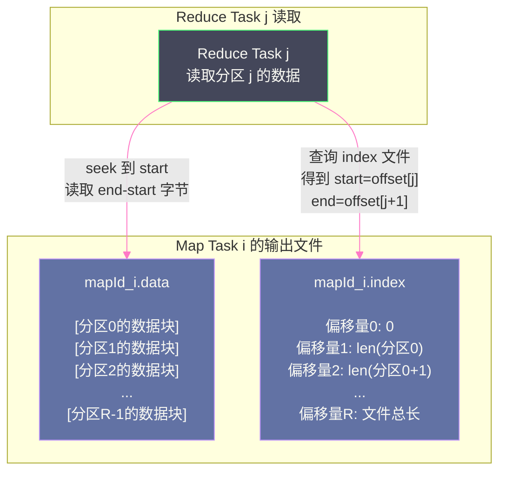
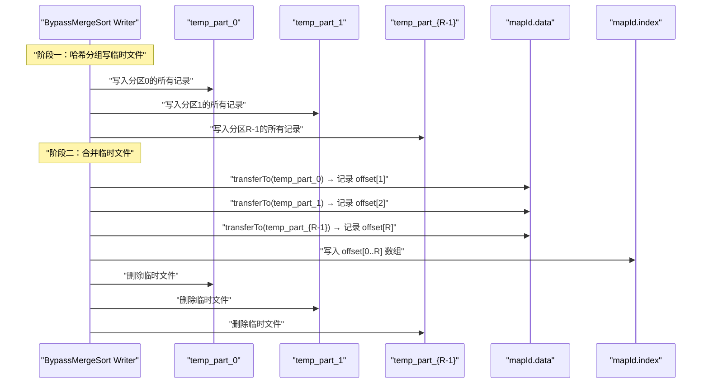
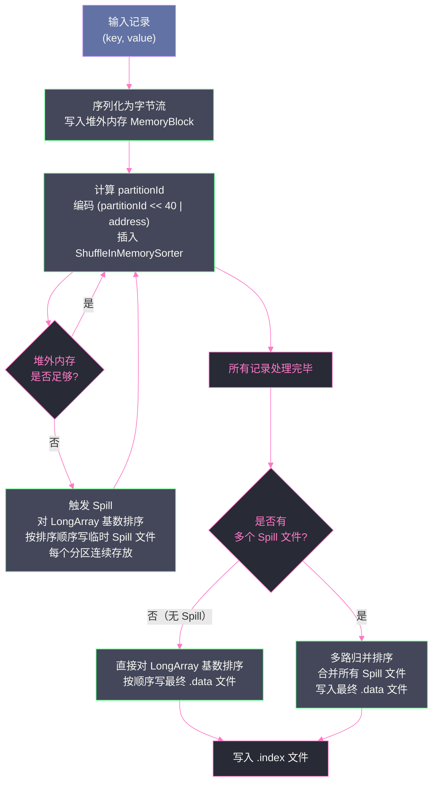
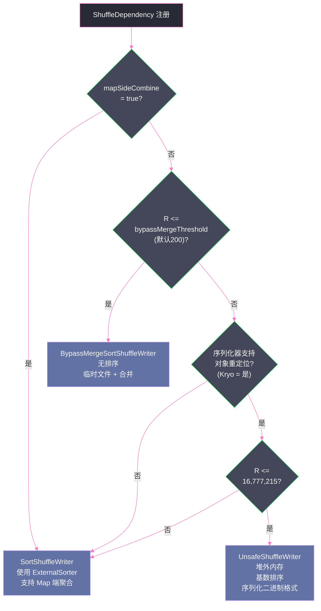

# 03 Sort Shuffle 的崛起：统一写出模型

## 摘要

Sort Shuffle 的出现是对 Hash Shuffle "文件数爆炸"问题的根本性回应。它用一个极其简洁的思路解决了核心矛盾：**每个 Map Task 只写出一个数据文件和一个索引文件**，将文件数从 M × R 降至 M × 2。然而，在这个统一的外壳下，`SortShuffleManager` 内部藏着三种截然不同的写出策略：当 Reduce 分区数较小且不需要 Map 端聚合时，使用 `BypassMergeSortShuffleWriter` 的无排序哈希分组路径；当数据不需要 key 排序且分区数不超过 16M 时，使用 `UnsafeShuffleWriter` 的堆外内存排序路径；其余情况则使用 `SortShuffleWriter` 的基于 `ExternalSorter` 的通用路径。本文深入解析这三种策略的设计动机、适用条件和核心机制，以及 `SortShuffleManager` 如何在运行时做出智能选择。

---

## 第 1 章 统一写出模型：一个约束，三种实现

### 1.1 Sort Shuffle 的核心约束

从第 02 篇的分析中，我们得出了一个关键结论：要控制文件数，每个 Map Task 就必须只写出一个文件；要让 Reduce Task 能从这一个文件中找到自己的数据，就必须对数据做某种**有序化处理**，使同一分区的数据在文件中连续存放，并通过索引文件记录每个分区的起止偏移量。

这就是 Sort Shuffle 的核心约束，也是其名称中"Sort"的来源——以某种形式的"排序"（或等价的有序化操作）换取文件数的大幅减少。

但"排序"并非铁板一块。根据计算需求的不同，"有序化"的程度也不同：

- **最弱的有序化需求**：数据只需要按**分区 ID** 聚组（同一分区的数据放在一起），分区内部的数据顺序无所谓。这是大多数聚合操作（`reduceByKey`、`groupByKey`）的需求。
- **较强的有序化需求**：数据需要按**分区 ID + key** 排序，分区内部的数据也按 key 有序。这是 `sortByKey` 等需要有序输出的操作的需求。

Sort Shuffle 的三种 Writer 策略，本质上就是在不同的约束条件下，用**代价最低的有序化方式**满足上述需求。

### 1.2 `.data` 文件 + `.index` 文件：统一的存储格式

无论采用哪种 Writer 策略，Sort Shuffle 最终产生的文件格式是统一的：

**数据文件（`.data`）**：将所有 R 个分区的数据按分区 ID 从小到大顺序拼接，每个分区的数据块连续存放。文件路径格式为：`{shuffleId}/{mapId}.data`。

**索引文件（`.index`）**：包含 R+1 个 Long 型偏移量值，记录每个分区在数据文件中的起始位置。第 0 个值是 0（文件开头），第 i 个值是分区 i 数据块在文件中的结束位置（也是分区 i+1 的起始位置）。通过相邻两个偏移量的差值，可以计算每个分区的数据长度。文件路径格式为：`{shuffleId}/{mapId}.index`。



这个格式设计非常精妙：
- **Reduce Task 的读取代价极低**：只需一次 index 文件读取（定位偏移量），然后对 data 文件做一次顺序读取，没有任何随机 I/O。
- **文件数完全受控**：无论 R 有多大，每个 Map Task 始终只有 2 个文件，总文件数是 `M × 2`。
- **支持随机访问**：Reduce Task j 可以直接跳转到自己数据的起始位置，不需要扫描整个文件。

### 1.3 SortShuffleManager 的 Writer 选择逻辑

`SortShuffleManager` 在 `registerShuffle` 阶段（而非 `getWriter` 阶段）就决定了使用哪种 `ShuffleHandle`，进而决定了 Writer 类型。这个决策基于三个维度的判断：

```scala
// org.apache.spark.shuffle.sort.SortShuffleManager
override def registerShuffle[K, V, C](
    shuffleId: Int,
    dependency: ShuffleDependency[K, V, C]): ShuffleHandle = {

  // 条件一：检查是否满足 Bypass 条件
  // 需要同时满足：无 Map 端聚合 + 分区数 <= bypassMergeThreshold
  if (SortShuffleWriter.shouldBypassMergeSort(dependency.partitioner.numPartitions,
      dependency.mapSideCombine, conf)) {
    new BypassMergeSortShuffleHandle[K, V](shuffleId, dependency)

  // 条件二：检查是否满足 Unsafe 条件
  // 需要同时满足：序列化器支持对象重定位 + 无 Map 端聚合 + 分区数 <= MAX_SHUFFLE_OUTPUT_PARTITIONS_FOR_SERIALIZED_MODE
  } else if (canUseSerializedShuffle(dependency)) {
    new SerializedShuffleHandle[K, V](shuffleId, dependency)

  // 条件三：默认使用标准 SortShuffleWriter
  } else {
    new BaseShuffleHandle(shuffleId, dependency)
  }
}
```

三种 Handle 对应三种 Writer，选择优先级从高到低：`BypassMergeSortShuffleWriter` → `UnsafeShuffleWriter` → `SortShuffleWriter`。

下表是三种策略的完整对比：

| 维度 | BypassMergeSortShuffleWriter | UnsafeShuffleWriter | SortShuffleWriter |
|------|------------------------------|--------------------|--------------------|
| **触发条件** | 无 Map 端聚合 + R ≤ 200（可配） | 无 Map 端聚合 + 序列化支持重定位 + R ≤ 16M | 其他所有情况 |
| **内存数据结构** | 无（直接写文件） | `ShuffleInMemorySorter`（堆外） | `PartitionedAppendOnlyMap` 或 `PartitionedPairBuffer` |
| **排序方式** | 无排序 | 按分区 ID 基数排序 | 按分区 ID (+ key) 比较排序 |
| **序列化时机** | 写临时文件时序列化 | 立即序列化（写入堆外内存） | 写 Spill 文件或最终合并时序列化 |
| **Spill 支持** | 无（临时文件即最终文件） | 支持（堆外内存满时 Spill） | 支持（内存数据结构满时 Spill） |
| **Map 端聚合** | 不支持 | 不支持 | 支持 |
| **输出有序性** | 按分区 ID 有序（分区内无序） | 按分区 ID 有序（分区内无序） | 按分区 ID + key 有序（如需要） |

---

## 第 2 章 BypassMergeSortShuffleWriter：无排序的极简路径

### 2.1 设计动机：为什么小 R 时不需要排序

在第 02 篇中，我们介绍了 File Consolidation——它允许同一 Executor 上的 Map Task 复用文件。`BypassMergeSortShuffleWriter` 可以看作是这一思想在 Sort Shuffle 框架内的"合法重生"：在 R 较小的情况下，为每个分区创建一个临时文件，写完后再合并成一个最终文件。

为什么限制 R 必须较小（默认 ≤ 200）？因为这个策略的内存消耗与 R 成正比——每个分区需要一个 `DiskBlockObjectWriter`（含 32KB 缓冲区）。当 R = 200 时，单个 Task 的写缓冲区内存约为 6MB，完全可以接受；但如果 R = 10,000，就需要 312MB 的写缓冲区，这会对 Executor 的内存造成巨大压力。

不需要 Map 端聚合（`mapSideCombine = false`）的限制也很自然：如果需要 Map 端聚合，就需要在内存中维护一个按 key 分组的聚合状态（比如 `PartitionedAppendOnlyMap`），这已经超出了 `BypassMergeSortShuffleWriter` 的设计范围。

### 2.2 执行流程详解

`BypassMergeSortShuffleWriter` 的执行分为两个阶段：

**阶段一：哈希分组写临时文件**

对每个输入记录 `(key, value)`：
1. 计算 `partitionId = partitioner.getPartition(key)`
2. 将 `(key, value)` 序列化后写入 `partitionWriters[partitionId]` 对应的 `DiskBlockObjectWriter`

这个过程完全没有排序，和 Hash Shuffle 的 `HashShuffleWriter` 一模一样。所有记录处理完毕后，每个分区对应一个临时文件（路径格式：`temp_shuffle_{uuid}`）。

**阶段二：合并临时文件，生成最终文件**

所有分区的临时文件写完后，执行合并：
1. 创建最终的 `.data` 文件
2. 按分区 ID 从 0 到 R-1，依次将每个临时文件的内容追加拷贝（`transferTo`，利用操作系统的零拷贝能力）到 `.data` 文件
3. 记录每个分区在 `.data` 文件中的偏移量
4. 将偏移量数组写入 `.index` 文件
5. 删除所有临时文件



### 2.3 零拷贝合并：transferTo 的性能优势

合并阶段使用的 `transferTo` 是 Java NIO 的 `FileChannel.transferTo` 方法，它底层调用了操作系统的 `sendfile` 系统调用（或类似机制）。这个方法的特点是**零拷贝**：数据直接在内核空间从源文件传输到目标文件，不需要先拷贝到 JVM 的用户态内存，再从用户态内存写入目标文件。

传统文件拷贝的数据路径：磁盘 → 内核页缓存 → 用户态内存 → 内核页缓存 → 磁盘（4次数据拷贝，2次内核态/用户态切换）。

`transferTo` 的数据路径：磁盘 → 内核页缓存 → 磁盘（2次数据拷贝，0次内核态/用户态切换，在现代内核上甚至可以做到 DMA 直传）。

对于 `BypassMergeSortShuffleWriter` 来说，合并阶段需要将 R 个临时文件依次拷贝到最终文件。如果 R = 200，每个临时文件平均 5MB（Map Task 总输出 1GB 的情况），合并阶段就需要拷贝 1GB 数据。零拷贝在这里的性能优势非常显著——它不仅减少了 CPU 开销，还减少了 JVM 堆内存的压力（不需要分配大块的拷贝缓冲区）。

> [!info] 核心概念
> **零拷贝（Zero-Copy）** 是操作系统层面的优化技术，通过让数据在内核空间直接流转（不经过用户态内存），减少数据拷贝次数和系统调用开销。在 Spark 的 Shuffle 场景中，大量的文件合并操作如果不使用零拷贝，会消耗大量 CPU 和 JVM 内存。`FileChannel.transferTo` 是 Java 中利用零拷贝的标准方式，Spark 的 Shuffle 文件合并和网络传输都大量使用了这个机制。

### 2.4 BypassMergeSortShuffleWriter 的适用边界

**最适合的场景**：
- R 较小（≤ 200）的 `groupByKey`、`join`、`repartition` 操作
- 数据无需 Map 端聚合的任意重分区操作
- 数据量不大，内存充足，不担心临时文件占用磁盘空间

**不适合的场景**：
- 需要 Map 端聚合（`reduceByKey`、`aggregateByKey` with `mapSideCombine`）——必须使用 `SortShuffleWriter`
- R 很大（> 200）——临时文件数和写缓冲区内存压力过大，应该使用 `UnsafeShuffleWriter` 或 `SortShuffleWriter`

---

## 第 3 章 UnsafeShuffleWriter：绕过 JVM 的极速路径

### 3.1 为什么需要一个"Unsafe"的 Writer

`BypassMergeSortShuffleWriter` 的限制是 R ≤ 200。当 R 更大时，如果数据依然不需要 Map 端聚合，也不需要 key 有序输出，能否有一个比 `SortShuffleWriter` 更高效的实现？

`UnsafeShuffleWriter`（在早期也叫做 Tungsten-Sort Writer）就是为这个场景设计的。它的核心优化思路来自 [[Tungsten]] 项目的两个关键洞察：

**洞察一：JVM 对象模型对排序来说太昂贵**

`SortShuffleWriter` 在内存中维护的是一个 `PartitionedPairBuffer`——一个存储 `(partitionId, key, value)` Java 对象的数组。每个对象都有 JVM 对象头开销（16 字节），对象引用在 64 位 JVM 下占 8 字节，加上实际数据内容，一条记录的内存占用可能是其原始数据大小的 3-5 倍。对这些对象做比较排序（Merge Sort），还需要频繁地跟随指针访问，缓存命中率极差。

**洞察二：如果只按分区 ID 排序，不需要比较 key**

当不需要 key 有序输出时，排序的目标只是让同一分区的记录聚集在一起——这只需要按 `partitionId`（一个整数）排序，完全不需要访问 key 的内容。

如果我们能把所有记录先序列化成二进制格式，然后只记录每条序列化记录的**内存地址**和**分区 ID**，就可以只对这个 `(partitionId, memoryAddress)` 的轻量级索引数组做排序，完全不需要移动实际的序列化数据。排序完成后，按排序后的顺序依次读取每条序列化记录写出到文件即可。

这就是 `UnsafeShuffleWriter` 的核心思路：**先序列化，再对序列化数据的引用排序，最后顺序写出**。

### 3.2 关键数据结构：ShuffleInMemorySorter

`UnsafeShuffleWriter` 的核心数据结构是 `ShuffleInMemorySorter`。它维护一个 `LongArray`（`long[]` 型数组），每个元素存储一条记录的**编码指针**：

```
高 24 位：partitionId（分区 ID）
低 40 位：recordAddress（记录的堆外内存地址，Unsafe 指针）
```

注意，这两部分被编码进一个 `long` 值中！这个编码设计非常精妙：
- 整个排序键就是这个 `long` 值本身，无需任何比较器（`Comparator`）——直接比较 `long` 值大小就等效于"先按 partitionId 排序，partitionId 相同时按地址排序"
- `LongArray` 是一个紧凑的基本类型数组，完全没有 JVM 对象头开销，CPU 缓存友好
- 由于 partitionId 占高 24 位，排序结果天然是先按 partitionId、再按地址排列，满足"同分区数据聚集"的需求

> [!info] 核心概念
> **高 24 位存 partitionId 的限制**：由于 partitionId 只有 24 位，最大值为 2^24 - 1 = 16,777,215，这就是 `UnsafeShuffleWriter` 的分区数上限（约 1600 万）。虽然这个上限在实践中极少触及，但它是 `UnsafeShuffleWriter` 触发条件之一，理解这个设计有助于理解为什么会有这个约束。

### 3.3 序列化器支持对象重定位的要求

`UnsafeShuffleWriter` 要求序列化器必须支持**对象重定位**（Serializer Relocation），即序列化器能够将一个已经序列化的对象字节流，**不反序列化直接拷贝**到另一个内存位置，而不破坏其语义。

为什么需要这个条件？在 `UnsafeShuffleWriter` 的合并阶段，需要将多个 Spill 文件的内容合并成最终的 `.data` 文件。合并时，Spill 文件中的序列化记录需要被读取并追加到最终文件。如果序列化器不支持重定位（例如序列化内容中包含了绝对内存地址），就无法安全地做这种直接字节拷贝。

Java 原生序列化不支持重定位（因为 Java 对象流可能包含类型信息和引用关系），但 [[Kryo]] 序列化天然支持重定位（序列化结果是纯数据字节流，不含内存地址）。这也是为什么生产环境几乎所有 Spark 集群都配置了 Kryo 序列化器——它不仅更快、更紧凑，还解锁了 `UnsafeShuffleWriter` 的使用。

### 3.4 UnsafeShuffleWriter 的完整执行流程



**排序算法的选择**：`ShuffleInMemorySorter` 使用**基数排序**（Radix Sort）对 `LongArray` 排序，而不是传统的比较排序（如 TimSort）。基数排序的时间复杂度是 O(n × k)（k 是位数），对于固定位宽的整数（这里是 64 位 `long`），比 O(n log n) 的比较排序更快，且完全不需要比较器对象，进一步减少了 GC 压力。

### 3.5 UnsafeShuffleWriter 与 SortShuffleWriter 的性能对比

为什么说 `UnsafeShuffleWriter` 比 `SortShuffleWriter` 更快？从以下几个维度量化：

**内存效率**：`SortShuffleWriter` 的 `PartitionedPairBuffer` 存储的是 Java 对象引用，每条记录有对象头开销 + 引用开销；`UnsafeShuffleWriter` 的 `LongArray` 每条记录只有 8 字节（一个 `long`），序列化数据在堆外内存以紧凑格式存储，内存使用量约减少 50%-70%。

**排序速度**：比较排序的最优时间复杂度是 O(n log n)，每次比较需要访问 key 对象（可能有缓存 miss）；`UnsafeShuffleWriter` 的基数排序是 O(n)，且全部在紧凑的 `LongArray` 上操作，缓存命中率极高。

**GC 压力**：`SortShuffleWriter` 的内存操作全在 JVM 堆上，大量对象的创建和销毁会给 [[JVM GC]] 带来显著压力，可能导致 GC 停顿影响 Task 执行；`UnsafeShuffleWriter` 的主要内存操作在堆外，几乎不触发 GC。

---

## 第 4 章 SortShuffleWriter：通用路径的万能选手

### 4.1 什么情况下必须用 SortShuffleWriter

当以下任一条件成立时，只能使用 `SortShuffleWriter`：
1. **需要 Map 端聚合**：`dependency.mapSideCombine = true`，即使用了 `reduceByKey`、`aggregateByKey`、`combineByKey` 等带有 Map 端合并器的算子
2. **R 超过 16,777,215**：超过了 `UnsafeShuffleWriter` 的分区数上限（实践中极少遇到）
3. **序列化器不支持对象重定位**：使用了 Java 原生序列化

可以看出，在配置了 Kryo 序列化器、且 R 不极端的情况下，`SortShuffleWriter` 主要服务于**有 Map 端聚合需求**的场景。这也是它与前两种 Writer 最本质的差异。

### 4.2 ExternalSorter：SortShuffleWriter 的核心引擎

`SortShuffleWriter` 将所有实际工作委托给 `ExternalSorter` 完成。`ExternalSorter` 是 Sort Shuffle 中最复杂也最核心的组件，第 04 篇会对其做专门的深度解析。这里只介绍其工作模式的概要。

`ExternalSorter` 有两种内部数据结构，根据是否需要聚合来选择：

**有聚合时**：使用 `PartitionedAppendOnlyMap`——一个按 `(partitionId, key)` 组合键存储聚合值的哈希映射。当新记录到来时，直接在 Map 中更新对应 key 的聚合值（如累加），天然实现了 Map 端的局部聚合。

**无聚合时**（但 R > 16M 或序列化器不支持重定位而无法用 UnsafeShuffleWriter）：使用 `PartitionedPairBuffer`——一个简单的 `(partitionId, key, value)` 三元组数组，按插入顺序存储，不做任何聚合。

两种数据结构都有一个共同的行为：当内存不足时，触发 **Spill**——将内存中当前的数据按 `(partitionId, key)` 排序后写入临时磁盘文件，然后清空内存继续接收新数据。Map Task 结束时，进行最终的 **Merge**——将所有 Spill 临时文件和内存中剩余数据进行多路归并排序，生成最终的 `.data` 文件和 `.index` 文件。

### 4.3 为什么 Map 端聚合对文件格式没有影响

有一个常见的误解：有 Map 端聚合的 Shuffle 和没有聚合的 Shuffle，写出的文件格式不同。实际上它们的文件格式完全相同，都是 `.data` + `.index` 双文件格式。

Map 端聚合的"聚合"发生在内存数据结构（`PartitionedAppendOnlyMap`）中，是写出文件之前的内存操作。聚合的结果是：写入文件的记录数量减少了（相同 key 被合并为一条记录），但文件格式没有任何变化。

这意味着，对 Reduce Task 来说，它完全不需要知道 Map Task 是否做了 Map 端聚合——它只需要按照标准的 `.index` + `.data` 格式读取数据即可。Map 端聚合只是一个优化手段，减少了 Shuffle 的数据量（更少的数据需要写磁盘和传输网络），但不影响协议层面的兼容性。

---

## 第 5 章 三种 Writer 的参数调优指南

### 5.1 关键参数汇总

理解了三种 Writer 的选择逻辑，就能对症下药地调整参数：

| 参数 | 默认值 | 影响的 Writer | 含义与调优建议 |
|------|--------|-------------|--------------|
| `spark.shuffle.sort.bypassMergeThreshold` | 200 | BypassMergeSort | Reduce 分区数的 Bypass 阈值。如果集群内存充足、典型作业的 R 在 200-500 之间，可以适当调大以跳过排序 |
| `spark.shuffle.file.buffer` | 32KB | 所有 Writer | 写缓冲区大小。在内存充足时调大（如 64KB-128KB）可减少 flush 次数，但 BypassMergeSort 的内存消耗与 R × buffer_size 成正比 |
| `spark.shuffle.spill.compress` | true | SortShuffle / Unsafe | 是否压缩 Spill 文件。启用压缩减少磁盘 I/O 和空间占用，代价是 CPU 开销 |
| `spark.shuffle.compress` | true | 所有 Writer | 是否压缩最终的 Shuffle 数据文件。建议保持开启，网络传输收益明显 |
| `spark.shuffle.unsafe.fastMergeEnabled` | true | UnsafeShuffleWriter | 是否在合并时使用快速路径（直接字节拷贝，不反序列化）。依赖序列化器支持重定位，Kryo 下应保持开启 |
| `spark.serializer` | Java | 影响 Unsafe 触发 | 强烈建议设置为 `org.apache.spark.serializer.KryoSerializer`，解锁 UnsafeShuffleWriter |

### 5.2 如何在 Spark UI 中判断当前使用了哪种 Writer

Spark UI 没有直接显示"使用了哪种 ShuffleWriter"的信息，但可以通过间接指标判断：

- **Shuffle Spill (Memory)**：`SortShuffleWriter` 和 `UnsafeShuffleWriter` 都会 Spill，`BypassMergeSortShuffleWriter` 不会 Spill（它没有内存数据结构）。如果 "Shuffle Spill (Memory)" 为 0，且 "Shuffle Write" 指标正常，通常说明使用了 `BypassMergeSortShuffleWriter`。
- **Task Metrics 中的 Serialization Time**：`UnsafeShuffleWriter` 在写入时立即序列化，序列化时间分散在整个 Task 执行过程中；`SortShuffleWriter` 的序列化集中在 Spill 和最终 Merge 阶段。

更可靠的判断方式是查看 **Executor 日志**中的 DEBUG 级别日志（需要调整日志级别），`SortShuffleManager.getWriter` 方法会记录选择了哪种 ShuffleHandle。

> [!warning] 生产避坑
> 生产环境中，如果你发现一个 `groupByKey` 或 `join` 作业（理应触发 `BypassMergeSortShuffleWriter`）的 Task 出现了大量 Shuffle Spill，说明这个作业实际上走了 `SortShuffleWriter` 路径。可能的原因：分区数 R 超过了 `bypassMergeThreshold`（默认 200），或者算子被框架识别为需要 Map 端聚合（某些 DataFrame 操作会自动插入聚合器）。此时应检查 `explain()` 的物理计划，确认 Shuffle 的实际实现路径。

### 5.3 一张决策树厘清三种 Writer



---

## 第 6 章 统一写出模型的工程价值

### 6.1 对文件数的根本控制

Sort Shuffle 统一写出模型的最直接价值是文件数的彻底受控。将文件数从 M × R 降至 M × 2，意味着：

- **文件系统元数据压力线性降低**：从百万量级降到数千量级
- **inode 耗尽问题消失**：文件数与 R 完全解耦
- **文件描述符压力大幅降低**：Reduce Task 不再需要为每个 Map Task 的每个分区维护一个 FD
- **读取 I/O 从随机变顺序**：每个 Reduce Task 只需对每个 Map Task 做一次顺序读取（seek 到起始偏移量，然后顺序读 N 字节），不再是 N 次随机小文件读取

### 6.2 "统一格式"带来的系统级好处

三种 Writer 虽然写出机制各不相同，但最终产物完全一致（`.data` + `.index` 双文件）。这个"统一格式"的好处远不止文件数控制：

**独立的 ExternalShuffleService**：由于文件格式统一，可以在节点上运行独立的 `ExternalShuffleService`（ESS）守护进程，专门负责 Shuffle 文件的服务。Executor 完成写出后即可退出（或被回收），Reduce Task 的 Shuffle Read 请求由 ESS 处理，不再依赖写出 Executor 的存活。这是 Dynamic Resource Allocation（动态资源分配）功能的基础——没有统一格式的 ESS，Executor 就无法在 Shuffle 完成前被回收。

**格式版本化与演进**：统一格式使得 Shuffle 存储层可以独立演进。例如，未来可以在不改变 Writer/Reader 接口的情况下，切换到更高效的文件格式（如列式存储的 Shuffle 块），只要格式升级在 `IndexShuffleBlockResolver` 层处理即可。

**Remote Shuffle Service 的基础**：第 11 篇将介绍的 RSS，本质上是将"写 `.data`/`.index` 到本地磁盘"改为"写到远程的 RSS 服务"。这个改造之所以相对干净，就是因为 Sort Shuffle 的统一格式提供了一个清晰的边界：只需改变 `IndexShuffleBlockResolver` 的存储目标，Writer 和 Reader 的主体逻辑不需要大幅修改。

### 6.3 三种 Writer 并存的哲学

三种 Writer 并存，并通过运行时条件选择最优路径，体现了 Spark 在性能与通用性之间寻求平衡的工程哲学：

- **`BypassMergeSortShuffleWriter`**：极致简单，代价最低，但场景最受限（小 R + 无聚合）
- **`UnsafeShuffleWriter`**：性能最优（堆外内存 + 基数排序 + 零 GC），但需要 Kryo 且不支持聚合
- **`SortShuffleWriter`**：最通用，支持任意场景，但性能相对较低

这三种策略形成了一个"快慢通道"体系：Spark 首先尝试走最快的通道，条件不满足时逐级降到更通用但更慢的通道。这种"分层降级"的设计模式在高性能系统中极为常见——Nginx 的事件处理（epoll → poll → select）、Linux 的内存分配（SLAB → SLUB → kmalloc）都有类似的思路。

---

## 小结

Sort Shuffle 的统一写出模型，是 Spark Shuffle 演进中最重要的架构决策之一：

- **统一约束**：每个 Map Task 只写一个 `.data` 文件和一个 `.index` 文件，将文件数从 M × R 降至 M × 2
- **三种策略**：`BypassMergeSortShuffleWriter`（无排序，小 R）→ `UnsafeShuffleWriter`（堆外基数排序，大 R 无聚合）→ `SortShuffleWriter`（通用，支持聚合）
- **选择逻辑**：在 `registerShuffle` 阶段根据 `mapSideCombine`、`numPartitions` 和序列化器能力三个维度决定
- **工程价值**：统一格式支撑了 ExternalShuffleService 和 Dynamic Resource Allocation，也为 Remote Shuffle Service 奠定了基础

第 04 篇将深入 Shuffle Write 的最核心组件——`ExternalSorter`，解析其 Spill 触发机制、Spill 文件格式和最终 Merge 的完整流程。

---

> [!note] 思考题
> 1. Sort Shuffle 的"统一写出模型"要求每个 Mapper 最终只产生一个 `.data` 文件和一个 `.index` 文件。这个"统一"是如何实现的？如果一个 Mapper 在写出过程中发生了多次 Spill（溢写到磁盘），最终的单文件是通过什么机制合并的？
> 2. `SortShuffleManager` 会根据条件选择三种 Writer：`BypassMergeSortShuffleWriter`、`UnsafeShuffleWriter`、`SortShuffleWriter`。其中 `UnsafeShuffleWriter` 要求 Serializer 支持对象重定位（`supportsRelocationOfSerializedObjects`）。这个条件为什么存在？如果不满足这个条件强行用 Unsafe 路径会有什么问题？
> 3. Sort Shuffle 在 Map 端对数据按 `(partitionId, key)` 排序。这个排序对 Reducer 端的行为有什么影响？在 `reduceByKey` 场景下，Reducer 是否还需要在内存中维护一个完整的 HashMap？

## 参考资料

- [Spark Shuffle 机制详细源码解析](https://www.cnblogs.com/jordan95225/p/13967000.html)
- [Spark UnsafeShuffleWriter 原理](https://zhmin.github.io/posts/spark-unsafe-shuffle-writer/)
- Apache Spark 源码：`org.apache.spark.shuffle.sort.SortShuffleManager`
- Apache Spark 源码：`org.apache.spark.shuffle.sort.BypassMergeSortShuffleWriter`
- Apache Spark 源码：`org.apache.spark.shuffle.sort.UnsafeShuffleWriter`
