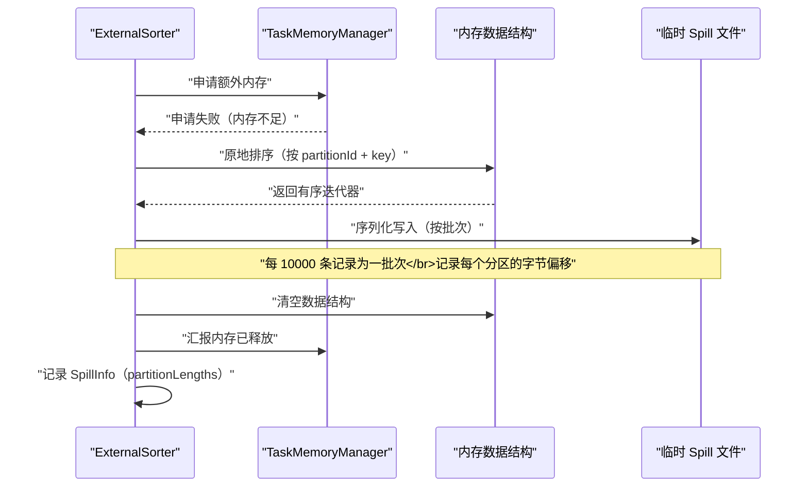
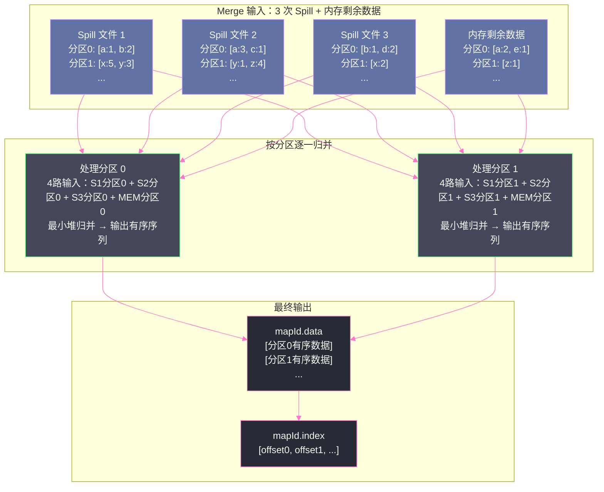
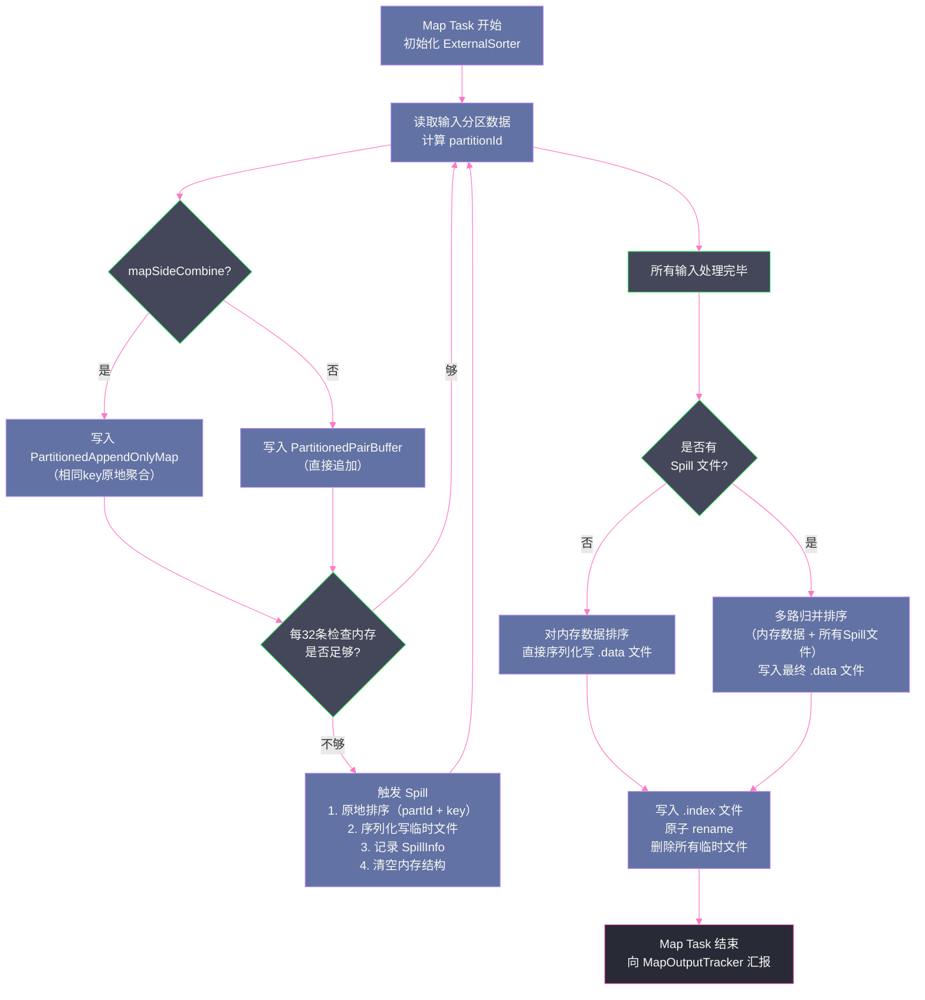

# 04 Shuffle Write 深度解剖：排序、合并与索引文件

## 摘要

`SortShuffleWriter` 的核心引擎是 `ExternalSorter`——它负责在内存中维护数据、在内存不足时将数据溢写（Spill）到磁盘临时文件、在 Map Task 结束时将所有 Spill 文件与内存剩余数据进行多路归并排序，最终生成一个有序的 `.data` 数据文件和对应的 `.index` 索引文件。本文从 `ExternalSorter` 的两种内存数据结构出发，深入剖析其内存估算机制、Spill 触发逻辑、Spill 文件的序列化格式，以及多路归并的实现细节，揭示 Shuffle Write 阶段"排序 → 溢写 → 合并"这条完整流水线背后的工程实现。

---

## 第 1 章 ExternalSorter 的两种内存数据结构

### 1.1 为什么需要两种数据结构

`ExternalSorter` 面对两类截然不同的计算需求：

**第一类：有 Map 端聚合（mapSideCombine = true）**

典型算子：`reduceByKey`、`aggregateByKey`、`combineByKey`。这类算子需要在 Map 端对相同 key 的数据做局部合并，减少 Shuffle 传输的数据量。例如 `reduceByKey(_ + _)` 中，如果同一 Map Task 处理了 1000 条 `("hello", 1)` 记录，理想情况下只需输出一条 `("hello", 1000)` 到 Shuffle 文件，而不是 1000 条。

这类场景需要一个能**随机访问**（按 key 查找并更新聚合值）的数据结构，天然对应哈希映射。

**第二类：无 Map 端聚合（mapSideCombine = false）**

典型算子：`groupByKey`（不做聚合）、`sortByKey`、`repartition`。这类算子只需要将数据按目标分区 ID 有序组织，不需要在 Map 端合并任何数据。

这类场景不需要随机访问，只需按顺序追加记录，对应一个简单的追加缓冲区。

`ExternalSorter` 根据 `mapSideCombine` 标志选择不同的内存数据结构：
- **有聚合** → `PartitionedAppendOnlyMap`
- **无聚合** → `PartitionedPairBuffer`

### 1.2 PartitionedAppendOnlyMap：哈希 + 排序的二合一结构

`PartitionedAppendOnlyMap` 是一个专为 Spark 设计的开放寻址哈希表，继承自 `AppendOnlyMap`。它的 key 是 `(partitionId, userKey)` 的二元组，value 是聚合后的结果值。

**开放寻址哈希表**（Open Addressing Hash Table）与 Java 标准库的 `HashMap` 的本质区别在于：
- `HashMap` 使用链表（Java 8 后升级为红黑树）解决哈希冲突，每个桶可以挂载多个节点，节点是独立的堆对象（`Entry`）
- `AppendOnlyMap` 使用**线性探测**解决冲突，所有数据存储在一个连续的 `Object[]` 数组中，`data[2*i]` 存 key，`data[2*i+1]` 存 value，没有任何额外的堆对象

这个设计的好处是显著的：
1. **内存布局紧凑**：一个数组而非分散的对象网络，大大减少了 [[JVM GC]] 的对象追踪开销
2. **缓存友好**：CPU 访问连续内存比访问散列的堆对象快得多（缓存行预取有效）
3. **无对象头开销**：每条记录不需要额外的 `Entry` 对象（无 16 字节对象头 × N 条记录）

```scala
// AppendOnlyMap 的核心 update 方法（简化逻辑）
// key: (partitionId, userKey)，updateFunc: 聚合函数
def changeValue(key: K, updateFunc: (Boolean, V) => V): V = {
  // 计算初始槽位
  var pos = rehash(key.hashCode) & mask
  var i = 1
  while (true) {
    val curKey = data(2 * pos)
    if (curKey == null) {
      // 空槽位：插入新记录
      val newValue = updateFunc(false, null.asInstanceOf[V])
      data(2 * pos) = key
      data(2 * pos + 1) = newValue.asInstanceOf[AnyRef]
      incrementSize()    // 检查是否需要扩容
      return newValue
    } else if (curKey == key) {
      // 找到相同 key：执行聚合更新
      val newValue = updateFunc(true, data(2 * pos + 1).asInstanceOf[V])
      data(2 * pos + 1) = newValue.asInstanceOf[AnyRef]
      return newValue
    } else {
      // 线性探测：移到下一个槽位
      pos = (pos + i) & mask
      i += 1
    }
  }
}
```

`PartitionedAppendOnlyMap` 在 `AppendOnlyMap` 基础上，增加了**排序输出**的能力：当需要 Spill 或最终输出时，调用 `destructiveSortedWritablePartitionedIterator` 方法，对内部 `data` 数组执行原地排序（按 `(partitionId, key)` 排序），然后返回一个有序迭代器。"Destructive"（破坏性）的含义是：排序后 Map 不再支持插入，只能迭代输出——这正是 Spill 所需要的行为。

### 1.3 PartitionedPairBuffer：极简的有序追加缓冲区

`PartitionedPairBuffer` 是一个更简单的结构：内部维护一个 `Object[]` 数组，每次 `insert` 时将 `(partitionId, key)` 存入 `data[2*i]`，将 `value` 存入 `data[2*i+1]`，简单追加。不做任何去重或聚合。

当需要 Spill 或输出时，对数组执行排序（同样按 `(partitionId, key)` 排序），然后顺序输出。

`PartitionedPairBuffer` 的扩容策略与 `PartitionedAppendOnlyMap` 类似：当已用空间超过容量的 70% 时，按 2 倍扩容。每次扩容需要创建新数组并拷贝数据，这是一次 GC 压力较大的操作，但由于 Spill 机制的存在，单次 Buffer 积累的数据量有上限，扩容次数有限。

### 1.4 两种结构的内存占用对比

| 维度 | PartitionedAppendOnlyMap | PartitionedPairBuffer |
|------|-------------------------|----------------------|
| **存储模型** | 开放寻址哈希表 | 简单数组 |
| **每条记录占用** | 2 个 Object 引用（key + value） | 2 个 Object 引用（(partId,key) + value） |
| **额外开销** | 哈希表需要约 30% 空槽（负载因子限制） | 无额外空槽 |
| **Map 端聚合** | 支持（相同 key 原地更新） | 不支持（只追加） |
| **有序输出** | 原地排序后迭代 | 原地排序后迭代 |
| **典型使用场景** | reduceByKey, aggregateByKey | groupByKey, repartition |

---

## 第 2 章 内存估算：Spill 触发的前提

### 2.1 为什么内存估算是难题

触发 Spill 的前提是知道"当前内存快用完了"。但在 JVM 中，精确知道一个数据结构占用了多少内存是一件非常困难的事——JVM 的堆内存管理是不透明的，对象的实际大小受对象头、对齐填充、引用大小等因素影响，且不同 JVM 实现（Oracle HotSpot、OpenJ9 等）还有差异。

Spark 不使用 `Runtime.getRuntime.freeMemory()` 来判断内存使用量（这个方法返回的是整个 JVM 进程的剩余堆内存，受 GC 时机影响，不稳定），而是**自己追踪每个数据结构的大小变化**。

### 2.2 基于采样的增量估算

`ExternalSorter` 的内存估算采用了一个聪明的"增量采样"策略：

1. **基线测量**：当数据结构（`PartitionedAppendOnlyMap` 或 `PartitionedPairBuffer`）的元素数量达到某个采样点时，调用 `SizeEstimator.estimate()` 做一次全量的精确估算，得到当前内存大小的基线值。

2. **增量推算**：在两次精确估算之间，记录新插入的元素数量。用"平均每个元素增加的字节数"来估算新插入数据带来的内存增量。计算公式为：
   ```
   估算大小 = 上次精确估算值 + (新增元素数 × 平均每元素字节数)
   平均每元素字节数 = (当前精确估算值 - 上次精确估算值) / 上次到本次的元素增量
   ```

3. **动态调整采样频率**：采样间隔从 1（初始）开始，每次精确估算后翻倍。这样随着数据结构增大，精确估算的频率逐渐降低（避免频繁的全量估算影响性能），但估算准确性通过增量推算来维持。

### 2.3 内存申请与 Spill 的决策链

每插入 `SPILL_CHECK_INTERVAL`（默认 32）条记录，`ExternalSorter` 执行一次内存检查，逻辑如下：

```
1. 估算当前数据结构的内存大小 estimatedSize
2. 向 TaskMemoryManager 申请额外内存（如果 estimatedSize 超过当前已分配内存）
3. 如果申请失败（内存不足）：
   → 触发 Spill，将内存数据写入临时磁盘文件
   → 清空内存数据结构，释放内存
4. 如果申请成功：继续插入数据
```

这个过程中，内存的实际分配和回收由 `TaskMemoryManager` 统一管理（第 06-07 篇会详细讲解）。`ExternalSorter` 实现了 `MemoryConsumer` 接口，这意味着当其他内存消费者需要内存时，`TaskMemoryManager` 可以通过回调 `ExternalSorter.spill()` 方法，强制它把内存数据 Spill 到磁盘，腾出内存给其他消费者。

> [!info] 核心概念
> **MemoryConsumer 接口**是 Spark 内存管理体系中的关键抽象。凡是会消耗 Execution Memory 的组件（`ExternalSorter`、`ExternalAppendOnlyMap`、`UnsafeShuffleWriter` 等）都实现这个接口，并向 `TaskMemoryManager` 注册。当系统内存紧张时，`TaskMemoryManager` 可以按优先级回调某些消费者的 `spill()` 方法，触发其将内存数据外化到磁盘，从而实现跨组件的协同内存管理。这是 Spark 内存管理体系"可溢写"的基础机制。

---

## 第 3 章 Spill：将内存数据外化到磁盘

### 3.1 Spill 的触发时机

Spill 有两个触发路径：

**路径一：主动 Spill（内存申请失败）**

如 2.3 节所述，当 `ExternalSorter` 向 `TaskMemoryManager` 申请内存失败时，自己主动触发 Spill。这是最常见的触发路径。

**路径二：被动 Spill（被其他 MemoryConsumer 驱逐）**

当 Task 中的另一个内存消费者（例如同一 Task 内的另一个 `ExternalSorter` 实例，或者 `HashAggregateExec` 的聚合缓冲区）申请内存时，如果整个 Task 的 Execution Memory 已经耗尽，`TaskMemoryManager` 会找到当前占用内存最多的 `MemoryConsumer`，回调其 `spill()` 方法，强制它释放内存。

被动 Spill 的特点是**不可预测**：即使 `ExternalSorter` 的内存在自己看来还够用，也可能突然被要求 Spill。这种机制保证了 Task 内多个内存消费者能够互相协调，避免某一个消费者独占内存导致其他消费者 OOM。

### 3.2 Spill 的执行步骤

当 Spill 被触发时，`ExternalSorter.spill()` 执行以下步骤：

**步骤一：对内存数据结构进行排序**

- 如果是 `PartitionedAppendOnlyMap`：调用 `destructiveSortedWritablePartitionedIterator(comparator)`，按 `(partitionId, key)` 对内部数组原地排序，返回有序迭代器
- 如果是 `PartitionedPairBuffer`：调用 `partitionedDestructiveSortedIterator(comparator)`，同样原地排序，返回有序迭代器

排序键是 `(partitionId, key)` 的组合，其中 partitionId 优先（确保同分区数据连续），key 次之（在分区内有序，便于后续 Merge 时高效归并）。

**步骤二：序列化写入临时磁盘文件**

创建一个临时文件（通过 `DiskBlockManager.createTempShuffleBlock()`），用 `DiskBlockObjectWriter` 将有序迭代器中的数据序列化写入。

为了提高磁盘 I/O 效率，写入时按**批次（Batch）** 进行序列化：默认每 10,000 条记录作为一个批次，写入一个序列化流（`ObjectOutputStream` 或 Kryo 序列化流）。每个批次结束时调用 `flush`，将缓冲区数据写入磁盘。

批次边界信息记录在 Spill 文件的**文件头**中，这对后续的 Merge 阶段很重要：在 Merge 时可以快速跳过批次边界，不需要读取每条记录来判断边界。

**步骤三：记录分区信息**

Spill 文件写完后，记录这个文件中每个分区的数据长度（字节数）。这些信息存在 `SpillInfo` 对象的 `partitionLengths` 数组中，在 Merge 阶段用于快速定位每个分区的数据范围，而不必全量扫描文件。

**步骤四：清空内存数据结构，释放内存**

- 如果是 `PartitionedAppendOnlyMap`：创建一个新的空 Map 替换原来的
- 如果是 `PartitionedPairBuffer`：清空数组

向 `TaskMemoryManager` 汇报内存已释放，可用于后续的内存分配。



### 3.3 Spill 文件的内部格式

理解 Spill 文件的格式，有助于理解后续 Merge 阶段的实现。

一个 Spill 文件包含多个连续的**分区数据块**，按 partitionId 从 0 到 R-1 排列。每个分区数据块由若干个**序列化批次（Serialized Batch）** 组成：

```
[Spill 文件结构]
┌─────────────────────────────────┐
│ 分区 0 的数据块                   │
│   ├── [批次头: 批次记录数]         │
│   ├── [记录1: 序列化 (key, val)]  │
│   ├── [记录2: 序列化 (key, val)]  │
│   ├── ...（最多 10000 条）         │
│   ├── [批次头: 批次记录数]         │
│   └── [记录N: 序列化 (key, val)]  │
├─────────────────────────────────┤
│ 分区 1 的数据块                   │
│   └── ...                       │
├─────────────────────────────────┤
│ ...                             │
├─────────────────────────────────┤
│ 分区 R-1 的数据块                 │
└─────────────────────────────────┘
```

每个分区数据块内，同一分区的所有记录按 key 排序后连续存放。这个有序性对 Merge 阶段非常重要：当多个 Spill 文件同时读取同一分区数据时，每个文件内该分区的数据是有序的，可以做高效的多路归并，而不需要先读入全部数据再排序。

> [!note] 设计哲学
> **分区内有序性是归并排序效率的关键**。多路归并排序（K-way Merge Sort）的核心假设是：每条输入流内的数据已经有序。如果 Spill 时不保持分区内有序性，Merge 阶段就必须先读入所有数据再全量排序，内存开销和时间开销都会大幅增加。Spark 在 Spill 时就做了分区内排序，使 Merge 阶段能以 O(n log K) 的代价（n 为总记录数，K 为 Spill 文件数）完成多路归并，而不是 O(n log n) 的全量排序。

---

## 第 4 章 Merge：将 Spill 文件与内存数据合并

### 4.1 什么情况下需要 Merge

当 Map Task 的所有输入数据处理完毕，`ExternalSorter.writePartitionedMapOutput()` 被调用，进入最终的写出阶段。此时有两种情况：

**情况一：没有发生任何 Spill**

内存中的数据就是全部数据。只需对内存数据结构排序，然后序列化写入最终的 `.data` 文件，同时记录每个分区的偏移量，写入 `.index` 文件。这是最理想的情况，没有任何磁盘 Merge 开销。

**情况二：发生了一次或多次 Spill**

内存中可能还有最后一批未 Spill 的数据，磁盘上有若干个 Spill 临时文件。需要将这些来源的数据进行**多路归并排序**（K-Way Merge Sort），生成最终的有序输出。

注意"若干个 Spill 文件"的范围：每次 Spill 产生一个临时文件，如果 Task 发生了 10 次 Spill，就有 10 个临时文件需要合并（加上内存中剩余数据共 11 路）。

### 4.2 多路归并的实现：最小堆

多路归并的经典实现是**最小堆（Min-Heap）**：维护一个大小为 K（K 路输入流数）的堆，每个堆元素是某路输入流的当前最小值。每次从堆顶取出全局最小值，然后从对应输入流拉取下一个值放入堆，直到所有输入流都耗尽。

`ExternalSorter` 的多路归并略有不同：它按**分区**逐个处理，而不是对所有数据全局归并。对于分区 j，从每个 Spill 文件中找到分区 j 对应的数据块（利用 `SpillInfo.partitionLengths` 快速定位），以及内存中 partitionId = j 的记录，形成 K 路有序输入流，做多路归并排序，将结果写入最终 `.data` 文件的第 j 个数据块。



### 4.3 聚合在 Merge 中的特殊处理

当 `mapSideCombine = true` 时，Merge 阶段除了做多路归并排序，还需要对相同 key 的值做最终聚合——因为多个 Spill 文件中可能包含相同 key 的局部聚合值，需要合并成最终聚合值。

举例：`reduceByKey(_ + _)` 操作，某个 key "hello" 在 3 次 Spill 中分别有聚合值 100、200、300（各自是 Spill 前的局部聚合结果），在 Merge 阶段需要将这三个值合并为 600。

这个最终聚合发生在从 Spill 文件读取数据后，将多路输入流的相同 key 值合并时——通过 `mergeCombiners` 函数（由算子的 `ShuffleDependency` 提供）对相同 key 的值做归约。

> [!warning] 生产避坑
> `groupByKey` 和 `reduceByKey` 在功能上类似，但在内存和 Spill 行为上有本质差异：
> - `groupByKey`：`mapSideCombine = false`，Map 端不聚合，每条记录完整写入 Spill 文件，Reduce 端拿到的是所有原始值的列表。如果某个 key 有 100 万条记录，Reduce Task 需要在内存中维护这 100 万条记录。
> - `reduceByKey`：`mapSideCombine = true`，Map 端聚合，相同 key 在 Spill 前合并为一个聚合值，Spill 文件中每个 key 只有一条聚合记录。这大幅减少了 Spill 文件的大小和 Reduce 端的内存压力。
>
> 因此，**能用 `reduceByKey` 的场景绝对不要用 `groupByKey`**，这是 Spark 中最常见的性能调优建议之一，背后正是这个内存与 Spill 行为的差异。

### 4.4 快速 Merge 路径：无聚合时的优化

当 `mapSideCombine = false` 且需要 key 排序时，Merge 阶段的最终合并可以使用一个**快速路径**：由于 Spill 文件中的每个分区数据块已经按 key 有序，多路归并可以直接输出有序结果，无需任何聚合计算，只做记录的合并和写出。

更进一步，在 `ExternalSorter` 检测到不需要 key 有序（`ordering = None`，典型场景是 `groupByKey` 只按分区 ID 分组）时，可以完全跳过 key 层面的排序，直接将各路输入按分区 ID 拼接：

```
对于分区 j：
    直接将 Spill1的分区j块 + Spill2的分区j块 + ... + 内存分区j 拼接写出
    无需对 key 排序，因为下游 Reduce Task 不需要有序输入
```

这种"按分区拼接"而非"按 key 归并"的方式，比完整的多路归并排序快得多——它只需要 O(n) 的拷贝操作，而不是 O(n log K) 的归并操作。

---

## 第 5 章 索引文件的写入：.index 文件格式详解

### 5.1 索引文件的结构

`.index` 文件是 Sort Shuffle 中一个极其简洁但至关重要的元数据文件。它的内容非常简单：**R+1 个 long 型整数**，记录每个分区在 `.data` 文件中的结束偏移量（累计）。

具体格式：
```
index[0] = 0                          // 分区 0 的起始位置（文件开头）
index[1] = len(分区0)                  // 分区 0 的结束位置 = 分区 1 的起始位置
index[2] = len(分区0) + len(分区1)     // 分区 1 的结束位置 = 分区 2 的起始位置
...
index[R] = 文件总长度                  // 分区 R-1 的结束位置
```

Reduce Task 读取分区 j 时，只需：
1. 读取 `index[j]` 得到起始偏移量 `start`
2. 读取 `index[j+1]` 得到结束偏移量 `end`
3. 在 `.data` 文件中 `seek(start)` 后读取 `end - start` 字节

`.index` 文件的大小固定为 `(R+1) × 8` 字节（每个 long 8 字节）。即使 R = 10,000，索引文件也只有约 80KB，可以轻松放入操作系统的[[Page Cache]] 中。这意味着多个 Reduce Task 并发读取同一个 Map Task 的输出时，索引查找几乎没有磁盘 I/O 开销。

### 5.2 写入索引文件的时机

索引文件在 Merge 阶段的最后一步写入。写入过程非常简单：

```scala
// IndexShuffleBlockResolver.writeIndexFileAndCommit（简化）
def writeIndexFileAndCommit(shuffleId: Int, mapId: Long,
                             lengths: Array[Long], dataTmp: File): Unit = {
  val indexFile = getIndexFile(shuffleId, mapId)
  val indexTmp = Utils.tempFileWith(indexFile)
  
  // 写入 R+1 个 long 值
  val out = new DataOutputStream(new FileOutputStream(indexTmp))
  var offset = 0L
  out.writeLong(offset)                    // index[0] = 0
  for (length <- lengths) {
    offset += length
    out.writeLong(offset)                  // index[i] = 累积偏移量
  }
  out.close()
  
  // 原子重命名（避免读取到写了一半的文件）
  indexTmp.renameTo(indexFile)
  dataTmp.renameTo(getDataFile(shuffleId, mapId))
}
```

注意这里的**原子性保证**：索引文件和数据文件都先写入临时文件（`.tmp`），完全写完后再通过 `rename` 操作原子地替换为最终文件名。这保证了 Reduce Task 在读取时，不会读到只写了一半的数据文件或索引文件——要么文件不存在（Task 还没写完），要么文件完整可用（已经 commit）。

---

## 第 6 章 Shuffle Write 的完整流水线总览

### 6.1 从 Map Task 视角看 Shuffle Write

将以上所有环节串联起来，一个使用 `SortShuffleWriter` 的 Map Task 的 Shuffle Write 流水线如下：



### 6.2 性能关键路径分析

从这条流水线可以识别出几个性能关键点：

**关键点一：Spill 频率**

每次 Spill 都会产生磁盘写操作和 Merge 时的磁盘读操作。Spill 越多，磁盘 I/O 越大，Merge 代价越高。减少 Spill 的核心手段是增大 Execution Memory（通过 `spark.executor.memory` 或 `spark.memory.fraction`），但这必须在整体内存约束下权衡。

**关键点二：Merge 的 I/O 放大**

每次 Spill 产生一个临时文件，Merge 时需要读取所有临时文件。如果发生了 K 次 Spill，Merge 的 I/O 量约等于 K 倍的原始数据量（每次 Spill 写一遍，Merge 时读一遍）。极端情况下，一个处理 10GB 数据、Spill 了 10 次的 Map Task，Merge 需要读取 100GB 的临时数据。

**关键点三：序列化/反序列化开销**

Spill 时序列化、Merge 时反序列化（如果需要聚合则必须反序列化；如果只是无聚合的字节拼接可以跳过）。使用 Kryo 比 Java 序列化快 5-10 倍，生产环境务必配置。

**关键点四：排序算法的复杂度**

内存数据结构的排序是 O(n log n)。对于 `PartitionedAppendOnlyMap`，排序在 Spill 时原地进行，每次 Spill 只排序当时内存中的数据（不是全量数据），所以每次排序的 n 是受控的。但 Merge 阶段的多路归并是 O(n log K)，K 是 Spill 文件数。K 越大，Merge 越慢。

### 6.3 针对 Shuffle Write 的调优要点

**调优一：增大 Execution Memory 减少 Spill**
```
spark.executor.memory=8g
spark.memory.fraction=0.6          # 60% 用于执行内存+存储内存
spark.memory.storageFraction=0.5   # 执行内存和存储内存各 50%
```

**调优二：开启 Kryo 序列化**
```
spark.serializer=org.apache.spark.serializer.KryoSerializer
spark.kryo.registrationRequired=false
```

**调优三：调整 Shuffle 写缓冲区**
```
spark.shuffle.file.buffer=64k   # 默认 32k，适当调大减少 flush 次数
```

**调优四：使用 reduceByKey 替代 groupByKey**

这是最高效的 Shuffle Write 优化——通过 Map 端聚合减少数据量，直接减少 Spill 文件大小和 Merge 代价。

**调优五：控制 Spill 文件的压缩**
```
spark.shuffle.spill.compress=true   # 开启压缩减少磁盘 I/O，以 CPU 换 I/O
spark.io.compression.codec=lz4     # LZ4 压缩速度最快，推荐
```

---

## 第 7 章 从 Spark UI 读懂 Shuffle Write 行为

### 7.1 关键指标解读

在 Spark UI 的 Stage 详情页中，与 Shuffle Write 相关的指标包括：

| 指标 | 含义 | 异常信号 |
|------|------|---------|
| **Shuffle Write Size** | 所有 Map Task 写出的总字节数 | 极大（>50GB per Stage）说明 Shuffle 数据量巨大，考虑减少 Shuffle |
| **Shuffle Write Records** | 写出的总记录数 | |
| **Shuffle Spill (Memory)** | 触发 Spill 时内存中的数据量 | 非零说明发生了 Spill，较大说明内存严重不足 |
| **Shuffle Spill (Disk)** | Spill 到磁盘的总数据量 | 远大于 Shuffle Write Size 说明 Spill 严重，发生了大量 I/O 放大 |

**特别注意**：`Shuffle Spill (Disk)` 可能远大于 `Shuffle Write Size`，这是因为 Spill 到磁盘的数据是**未压缩的序列化数据**（Spill 时可能没有压缩），而最终 `.data` 文件是压缩的。另外，多次 Spill 的中间文件在 Merge 完成后会被删除，但它们的写入量已经计入 Spill 指标。

### 7.2 Task 级别的异常诊断

在 Stage 详情的 Tasks 列表中，如果某个 Task 的 `Shuffle Spill (Disk)` 远大于其他 Task，通常说明这个 Task 处理的数据量远多于其他 Task——这是**数据倾斜**的典型信号。

数据倾斜的诊断步骤：
1. 在 Stage 详情页，按 `Duration` 或 `Shuffle Spill (Disk)` 降序排列 Tasks
2. 找到处于长尾的 Task，查看其 `Input Size / Records`
3. 如果某个 Task 的 Records 是其他 Task 的数十倍，高度怀疑是数据倾斜
4. 打印倾斜 Task 对应分区的数据分布（可通过 `rdd.glom().map(_.length).collect()` 查看各分区大小）

> [!warning] 生产避坑
> Shuffle Spill 本身不是灾难——它是 Spark 的正常降级机制，防止 OOM 的"安全阀"。真正有问题的是**极度频繁的 Spill**（大量 I/O 放大，磁盘成为瓶颈）或**Spill 后依然 OOM**（数据量太大，即使 Spill 也无法容纳当前处理的数据批次）。前者调大内存或优化数据量，后者需要增大分区数减小每个 Task 的数据量。

---

## 小结

Shuffle Write 的核心流水线是：**插入内存数据结构 → 内存估算 → 超限 Spill → Map Task 结束时 Merge → 写出 `.data` + `.index`**。

- **`PartitionedAppendOnlyMap`** 和 **`PartitionedPairBuffer`** 分别对应有聚合/无聚合的两种内存数据结构，都基于紧凑的数组设计，缓存友好
- **Spill 触发**有主动和被动两种路径，都通过 `MemoryConsumer` 接口与 `TaskMemoryManager` 协调
- **Spill 文件格式**是按分区有序的序列化批次流，分区内按 key 有序，便于 Merge 阶段的多路归并
- **Merge 阶段**根据是否有聚合、是否需要 key 有序，选择全量多路归并排序或快速分区拼接
- **`.index` 文件**是 `(R+1) × 8` 字节的紧凑偏移量数组，支持 O(1) 的分区定位

下一篇将从 Reduce Task 的视角，解析 Shuffle Read 的拉取、聚合与排序全流程。

---

## 参考资料

- [Spark SortShuffleWriter 原理](https://zhmin.github.io/posts/spark-shuffle-sort-writer-2/)
- [深入理解 Spark Shuffle](https://justdodt.github.io/2019/07/21/深入理解-Spark-Shuffle/)
- Apache Spark 源码：`org.apache.spark.util.collection.ExternalSorter`
- Apache Spark 源码：`org.apache.spark.util.collection.PartitionedAppendOnlyMap`
- Apache Spark 源码：`org.apache.spark.shuffle.IndexShuffleBlockResolver`
