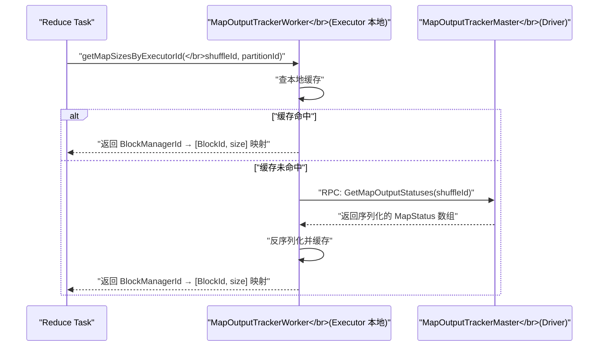
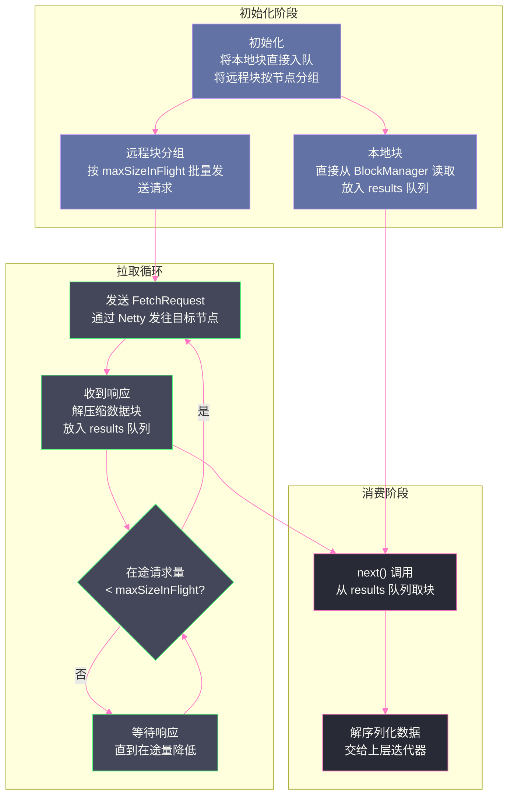
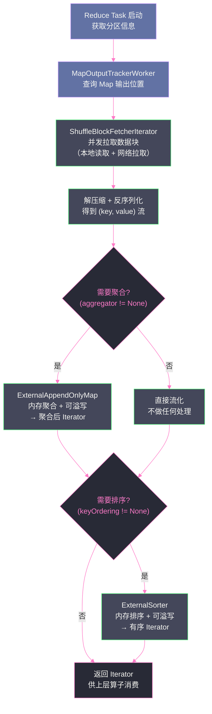
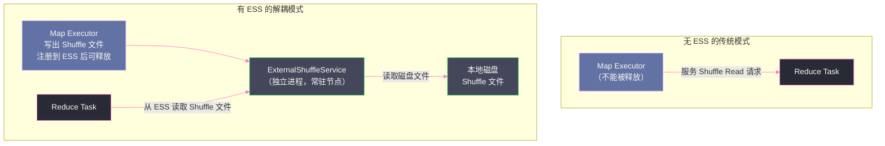
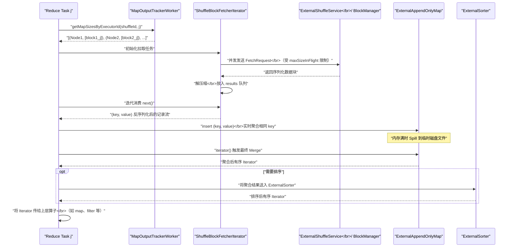

# 05 Shuffle Read 深度解剖：拉取、聚合与排序

## 摘要

Shuffle Read 是 Spark Shuffle 的"下半场"——当上游 Stage 的所有 Map Task 完成写出后，下游 Stage 的 Reduce Task 开始工作：向 `MapOutputTracker` 查询数据位置，通过 [[Netty]] 网络框架从各节点拉取数据块，然后在内存中进行聚合或排序，最终生成 Reduce 操作的输入。这个过程看似简单，但涉及复杂的并发控制、网络重试、内存协调和多种聚合模式。本文从 `BlockStoreShuffleReader` 出发，逐层剖析 Shuffle Read 的位置感知协议、网络拉取机制、`ExternalAppendOnlyMap` 聚合引擎和排序路径，揭示 Reduce 端的完整数据流动轨迹。

---

## 第 1 章 Shuffle Read 的起点：Reduce Task 从哪里知道数据在哪

### 1.1 MapOutputTracker：分布式"快递追踪系统"

在第 04 篇中，我们看到 Map Task 写出 `.data` 和 `.index` 文件后，最后一步是"向 `MapOutputTracker` 汇报"。`MapOutputTracker` 正是 Shuffle Read 的信息入口——它记录着每个 Map Task 的输出数据在哪个节点上、有多大，是 Shuffle 的"快递追踪系统"。

`MapOutputTracker` 有两个角色：

**`MapOutputTrackerMaster`（运行在 Driver 上）**：集中维护所有 Shuffle 的 Map 输出位置信息（`mapStatuses`）。每当一个 Map Task 完成，TaskScheduler 会通知 Driver，Driver 调用 `MapOutputTrackerMaster.registerMapOutput()` 将该 Task 的输出位置（`MapStatus`）注册进来。`MapStatus` 包含：
- `location`：该 Map Task 运行的节点（`BlockManagerId`，含 host、port）
- `partitionSizes`：该 Map Task 对每个 Reduce 分区输出的数据字节数（压缩编码存储以节省内存）

**`MapOutputTrackerWorker`（运行在每个 Executor 上）**：缓存从 Driver 获取的 Map 输出信息。当一个 Reduce Task 需要知道 Map 输出位置时，它先查本地缓存，缓存未命中时向 Driver 的 `MapOutputTrackerMaster` 发起 RPC 请求获取，并将结果缓存供后续查询。

这个设计的关键优化是**批量查询和本地缓存**：一个 Executor 上可能同时运行多个 Reduce Task，它们需要相同 Shuffle 的 Map 输出信息。通过缓存机制，只需要一次 Driver 往返即可服务同一 Executor 上的所有 Reduce Task，大幅减少了 Driver 的负载。



### 1.2 getMapSizesByExecutorId：构建 Fetch 任务列表

`MapOutputTrackerWorker.getMapSizesByExecutorId()` 返回的数据结构是：
```
Iterator[(BlockManagerId, Seq[(BlockId, Long, Int)])]
```
- 外层是按节点（`BlockManagerId`）分组
- 内层每个元素是 `(BlockId, 大小字节数, Map 任务索引)`

这个数据结构的设计反映了一个重要的优化思路：**将同一节点的所有数据块批量拉取，而不是逐块拉取**。如果有 M 个 Map Task 分布在 N 个节点上，Reduce Task 需要从这 N 个节点拉取数据，每个节点上可能有 M/N 个 Map Task 的输出。通过按节点分组，可以将发给同一节点的拉取请求合并成一个批次，减少网络往返次数。

### 1.3 本地块与远程块的分离

在构建 Fetch 任务列表时，`BlockStoreShuffleReader` 会区分两类数据块：

**本地块（Local Blocks）**：当前 Executor 上已有的 Map Task 输出（同一 Executor 上有 Map Task 运行时）。本地块可以直接从 `BlockManager` 的本地文件系统读取，无需网络传输。

**远程块（Remote Blocks）**：位于其他节点上的 Map Task 输出，需要通过网络拉取。

这个区分非常重要：**本地块的读取代价远低于远程块**（无网络延迟、无序列化/反序列化开销），应尽量优先使用本地块。在 Spark 的 Task 调度中，如果某个 Reduce Task 被调度到拥有大量本地 Map 输出的节点上，就能显著降低网络传输量。这就是 Shuffle Read 阶段的"数据本地性"。

---

## 第 2 章 网络拉取：ShuffleBlockFetcherIterator 的并发控制

### 2.1 为什么需要专门的 FetcherIterator

Shuffle Read 的网络拉取面临三个相互矛盾的需求：

1. **高吞吐**：尽量并发拉取，充分利用网络带宽
2. **低内存**：不能一次性把所有数据拉到内存（可能超过 Executor 内存上限）
3. **高可靠**：网络请求可能失败，需要重试机制

`ShuffleBlockFetcherIterator` 是专门解决这三个需求的组件。它实现了 `Iterator` 接口，按需（lazy）拉取数据块，上层代码每调用一次 `next()`，就消费一个已拉取的数据块。

### 2.2 并发请求的限制机制

`ShuffleBlockFetcherIterator` 用两个参数控制并发：

**`spark.reducer.maxSizeInFlight`（默认 48MB）**：在途（in-flight）的远程拉取请求的总字节数上限。即所有已发出但尚未收到响应的请求，其请求的数据总量不超过 48MB。这个限制防止 Reduce Task 一次性发出太多大请求，耗尽网络缓冲区或接收缓冲区内存。

**`spark.reducer.maxReqsInFlight`（默认 Int.MaxValue）**：同时在途的请求数上限。通常不需要修改，主要靠 `maxSizeInFlight` 控制。

**`spark.reducer.maxBlocksInFlightPerAddress`（默认 Int.MaxValue）**：对同一节点的最大并发请求块数。当某个节点有大量小块时，这个参数防止因为向同一节点发出大量小请求而造成该节点的 I/O 压力。

这三个参数共同构成了 Fetch 的"流量控制阀"，实现了一个类似 [[TCP]] 拥塞控制的机制：确保在途请求量不超过系统容量，避免内存溢出。

### 2.3 拉取流程的状态机

`ShuffleBlockFetcherIterator` 内部维护了一个生产者-消费者结构：

**生产者（后台线程）**：持续发出 Fetch 请求，将拉取到的数据块放入 `results` 队列

**消费者（调用 `next()` 的线程）**：从 `results` 队列取出数据块，向上层迭代器提供数据



### 2.4 Fetch 失败的重试机制

网络请求失败是 Shuffle Read 中不可避免的情况——目标节点可能宕机、网络可能抖动、目标 Executor 可能被 GC 停顿。`ShuffleBlockFetcherIterator` 提供了自动重试机制：

当一个 Fetch 请求失败时：
1. 等待 `spark.shuffle.io.retryWait`（默认 5 秒）
2. 重新发起同一批 Fetch 请求
3. 最多重试 `spark.shuffle.io.maxRetries`（默认 3 次）

重试机制对于生产环境非常重要。在一个运行时间较长的 Spark 作业中，发生网络超时或节点临时不可达是常见的情况，如果没有重试机制，这些瞬时故障就会导致整个 Stage 失败，触发昂贵的 Stage 重算。

> [!warning] 生产避坑
> 当 Spark 日志中出现大量 `FetchFailedException: Failed to connect to ...` 错误，并伴随 Stage 重试时，通常不是真正的节点宕机，而是**GC 停顿**导致目标节点响应超时。排查步骤：
> 1. 检查目标节点的 Executor GC 日志（`-verbose:gc`），看是否有长时间的 Full GC
> 2. 检查 Shuffle 数据量是否异常大，导致单个 Task 的 Execution Memory 不足，频繁 GC
> 3. 调大 `spark.shuffle.io.retryWait` 和 `spark.shuffle.io.maxRetries`，给慢节点更多恢复时间
> 4. 根本解决方案：增大 Executor 内存，减少 GC 频率

### 2.5 推测执行对 Shuffle Read 的影响

Spark 的推测执行（Speculative Execution）机制会在某个 Task 运行时间远超同 Stage 其他 Task 时，在另一个节点上启动一个"备份任务"（Speculative Task）。对于 Shuffle Write 来说，如果原始 Task 和推测任务都写出了数据，需要能正确处理——这由 `MapOutputTracker` 保证：当且仅当一个 Task 的 Map 输出被成功注册后，才会被 Reduce Task 拉取，推测任务的结果在原始任务成功时会被忽略。

---

## 第 3 章 ExternalAppendOnlyMap：Reduce 端聚合引擎

### 3.1 为什么 Reduce 端还需要聚合

在第 04 篇中，我们看到 Map 端已经做了局部聚合（当 `mapSideCombine = true` 时）。那么 Reduce 端为什么还需要聚合？

原因有两个：

**原因一：Map 端聚合只是局部聚合**。每个 Map Task 独立地在本地对相同 key 做了局部合并，但不同 Map Task 之间同一 key 的值没有合并。例如，"hello" 这个单词在 Map Task 1 的局部聚合结果是 500，在 Map Task 2 的局部聚合结果是 300，Reduce Task 拉取后还需要将这两个值合并为最终的 800。

**原因二：当 `mapSideCombine = false` 时**（`groupByKey` 等），Map 端不做任何聚合，所有原始记录都写入 Shuffle 文件，Reduce 端需要从头做完整的聚合。

Reduce 端的聚合由 `ExternalAppendOnlyMap` 完成。

### 3.2 ExternalAppendOnlyMap 与 ExternalSorter 的关系

`ExternalAppendOnlyMap` 和第 04 篇中的 `ExternalSorter` 有相似的架构：都使用内存中的数据结构（`AppendOnlyMap`），都在内存不足时 Spill 到磁盘，都在最后进行 Merge。

但它们有本质区别：

| 维度 | ExternalSorter（Shuffle Write） | ExternalAppendOnlyMap（Shuffle Read） |
|------|--------------------------------|--------------------------------------|
| **主要目的** | 将数据有序组织并写出 | 对 key 进行聚合 |
| **输出** | 有序的 Shuffle 文件（.data + .index） | 聚合后的 Iterator，供后续算子消费 |
| **Merge 触发** | Map Task 结束，固定触发一次 | 在 `iterator()` 被调用时触发 |
| **输出要求** | 按分区 ID 有序（必须） | 不要求有序（聚合结果是无序的） |
| **设计侧重** | 写出效率（磁盘格式、批次序列化） | 聚合效率（内存 Map 的原地更新） |

### 3.3 ExternalAppendOnlyMap 的工作机制

`ExternalAppendOnlyMap` 的核心数据结构同样是 `AppendOnlyMap`，但使用方式略有不同：

**插入阶段**：对于每条输入记录 `(key, value)`：
1. 在 `AppendOnlyMap` 中查找 key
2. 如果 key 存在：调用 `mergeValue(existingValue, value)` 更新聚合值
3. 如果 key 不存在：调用 `createCombiner(value)` 创建初始聚合值，插入 Map

这个过程在内存中完成，相同 key 的多个值被实时合并，保持 Map 中每个 key 只有一条记录。

**Spill 阶段**：当内存不足时，将 `AppendOnlyMap` 中的数据按 key 排序（注意这里只按 key 排序，不区分 partitionId——因为 `ExternalAppendOnlyMap` 处理的是单个分区的数据），序列化写入临时文件。

**Merge 阶段（`iterator()` 调用时）**：如果有 Spill 文件，进行多路归并：
- 每个 Spill 文件作为一路有序输入
- 内存中的 `AppendOnlyMap` 排序后作为最后一路输入
- 使用最小堆归并，对相同 key 调用 `mergeCombiners()` 做最终聚合
- 返回聚合完成的有序 `Iterator`

> [!info] 核心概念
> `ExternalAppendOnlyMap` 的 Spill 与 `ExternalSorter` 的 Spill 有一个微妙差异：`ExternalSorter` 在有聚合时使用 `PartitionedAppendOnlyMap`，Spill 前就对相同 key 做了局部合并；而 `ExternalAppendOnlyMap` 本身就是一个聚合结构，其 Spill 文件中每个 key 已经是局部聚合值了，不是原始记录。所以 Merge 阶段对相同 key 调用的是 `mergeCombiners()`（合并两个聚合值），而不是 `mergeValue()`（将原始值加入聚合）。理解这个区别是读懂 `Aggregator` 三个函数（`createCombiner`、`mergeValue`、`mergeCombiners`）语义的关键。

---

## 第 4 章 Shuffle Read 的排序路径

### 4.1 什么时候需要在 Reduce 端排序

并非所有 Shuffle 操作都需要在 Reduce 端对结果排序。根据上层算子的需求，`BlockStoreShuffleReader` 对 Fetch 到的数据有三种处理路径：

**路径一：只聚合，不排序**

典型算子：`reduceByKey`、`aggregateByKey`。结果是每个 key 的聚合值，key 之间不要求有序。使用 `ExternalAppendOnlyMap` 完成聚合，返回无序的聚合 Iterator。

**路径二：不聚合，不排序**

典型算子：`groupByKey`（Map 端 `mapSideCombine = false`）、`repartition`。数据只是被重新分区，不需要在 Reduce 端做任何处理，直接将 Fetch 到的数据流化给上层算子。

注意：虽然 `groupByKey` 的结果看起来是"按 key 分组"，但这个分组是通过 Shuffle 分区实现的（相同 key 的记录被路由到同一个 Reduce Task），Reduce Task 内部并不需要额外的分组操作——`ExternalSorter` 在 Map 端写出时已经保证了同一 key 的记录在同一个 Reduce 分区中。

**路径三：排序**

典型算子：`sortByKey`、需要全局有序的 `orderBy`。需要在 Reduce 端对所有拉取到的数据按 key 排序。这通常使用 `ExternalSorter`（与 Write 端相同的组件）来完成，只是在 Read 端使用它的"只排序不聚合"模式。

### 4.2 排序与聚合的组合

有些算子同时需要聚合和排序，例如 `sortBy(func)` 之前的 `reduceByKey`。在这种情况下：
1. 先用 `ExternalAppendOnlyMap` 完成聚合
2. 将聚合结果写入 `ExternalSorter` 排序

这是两个独立的阶段，都可能发生 Spill，都消耗 Execution Memory。这也是为什么复杂的 SQL 查询（多个聚合 + 排序）更容易触发 OOM——每个阶段都在争用有限的 Execution Memory。

### 4.3 BlockStoreShuffleReader 的完整流水线



---

## 第 5 章 Shuffle Read 的内存管理与 ExternalShuffleService

### 5.1 Fetch Buffer：网络数据的临时驻留

拉取到的网络数据在被反序列化之前，需要在内存中短暂驻留。`ShuffleBlockFetcherIterator` 使用 **Soft Buffer**（通过 `spark.reducer.maxSizeInFlight` 控制）来管理这部分内存。

Soft Buffer 是"软引用"内存，不从 `TaskMemoryManager` 申请，而是直接在 JVM 堆上分配。当 JVM 内存压力大时，GC 会优先回收软引用持有的对象（Soft Reference 在 JVM 内存不足时可以被 GC 清理，而不像强引用那样必须等到 GC Root 不可达才回收）。

这意味着 `maxSizeInFlight = 48MB` 是一个近似上限，而不是硬性限制——在内存压力大时，GC 可能提前清理缓冲中的数据块，触发重新拉取。

### 5.2 ExternalShuffleService：解耦 Executor 生命周期

**`ExternalShuffleService`（ESS）** 是一个运行在每个 Worker 节点上的独立服务（不属于任何 Executor），专门负责服务 Shuffle 文件的读取请求。

**为什么需要 ESS？**

考虑这样一个场景：Spark 启用了 Dynamic Resource Allocation（动态资源分配），允许在作业运行过程中释放空闲的 Executor 来节省集群资源。Map Stage 完成后，Map Task 所在的 Executor 理论上可以被释放——但 Reduce Task 还需要读取这些 Executor 上的 Shuffle 文件！

没有 ESS 时，Executor 不能被释放，因为 Shuffle 文件还需要通过 Executor 的 `BlockManager` 服务来读取。这导致 Dynamic Resource Allocation 的效果大打折扣。

有了 ESS 后，Shuffle 文件的服务职责从 Executor 的 `BlockManager` 转移到了独立的 `ExternalShuffleService`：
- Map Task 写出 Shuffle 文件后，向 ESS 注册文件路径信息
- Reduce Task 的 Fetch 请求直接发往 ESS，而不是 Executor 的 `BlockManager`
- Map Task 所在的 Executor 可以被安全地释放，其写出的 Shuffle 文件继续由 ESS 服务



> [!info] 核心概念
> `ExternalShuffleService` 的引入是 Sort Shuffle 统一文件格式带来的红利之一。因为 Shuffle 文件格式是标准的 `.data` + `.index`，ESS 只需实现一个标准的文件读取服务，就能服务所有 Executor 写出的 Shuffle 数据。如果文件格式因 Writer 策略不同而各异，ESS 的实现复杂度会大幅增加。

### 5.3 Shuffle Read 的 Execution Memory 争用

`ExternalAppendOnlyMap` 和 `ExternalSorter`（Reduce 端）都实现了 `MemoryConsumer` 接口，从 `TaskMemoryManager` 申请 Execution Memory。

在 Reduce Task 的执行过程中，Execution Memory 的争用可能来自：
1. **Read 端聚合**（`ExternalAppendOnlyMap`）：边拉取边聚合，持续增长
2. **Read 端排序**（`ExternalSorter`）：聚合完成后的排序阶段
3. **同一 Executor 上其他 Task** 的内存需求

当内存不足时，`TaskMemoryManager` 会强制 `ExternalAppendOnlyMap` 或 `ExternalSorter` Spill，将聚合中间结果写入磁盘，腾出内存。这个 Spill 会产生额外的磁盘 I/O，降低 Shuffle Read 的效率。

---

## 第 6 章 Shuffle Read 的性能陷阱与调优

### 6.1 Reduce 端数据倾斜的特殊表现

与 Map 端数据倾斜（某些 Map Task 处理数据量远多于其他）相比，Reduce 端数据倾斜有其特殊性：

Reduce Task j 需要拉取所有 M 个 Map Task 的第 j 个分区的数据。如果某个 key（比如 "null" 或 "default"）在所有 Map Task 中都非常频繁，那么这个 key 被哈希到的分区 j 的 Reduce Task，就需要处理远多于其他 Reduce Task 的数据量。

这种倾斜会导致：
- 该 Reduce Task 的 Shuffle Read 时间远长于其他 Task
- 该 Reduce Task 可能触发大量 `ExternalAppendOnlyMap` Spill
- 整个 Stage 的完成时间等于这个最慢的 Reduce Task

> [!warning] 生产避坑
> Reduce 端数据倾斜最棘手的地方在于：**即使 Map 端看起来没有倾斜，Reduce 端也可能倾斜**。原因是 Map 端的 Shuffle Write 通常不显示分区大小分布（只显示总大小），而 Reduce 端的倾斜在 Task 级别的 `Shuffle Read Size` 差异中才会暴露。
> 
> 诊断方法：在 Stage 详情页，按 `Shuffle Read Size` 降序排列 Tasks，查看最大值与中位数的比值。如果某个 Task 的 Shuffle Read Size 是中位数的 10 倍以上，高度怀疑是数据倾斜。此时需要查看导致倾斜的 key 分布，考虑对热点 key 做单独处理（加随机后缀、Salting 技术）。

### 6.2 maxSizeInFlight 的调优

`spark.reducer.maxSizeInFlight`（默认 48MB）控制并发拉取的数据量。这个参数的调优是一个权衡：

- **调大**（如 96MB）：更多数据可以并行拉取，提升网络利用率，但增加了 JVM 堆内存压力（Fetch Buffer 是堆内内存）
- **调小**（如 24MB）：减少内存压力，但并发拉取能力下降，可能导致网络带宽利用率低

调优建议：当 Executor 内存充足（比如每个 Executor 分配了 16GB+）且 Shuffle 数据量大时，可以适当调大；当 Executor 内存较小（4GB 以下）时，应保持默认或适当调小。

### 6.3 关键参数汇总

| 参数 | 默认值 | 调优方向 |
|------|--------|---------|
| `spark.reducer.maxSizeInFlight` | 48MB | 内存充足时调大（提升并发拉取） |
| `spark.reducer.maxReqsInFlight` | Int.MaxValue | 通常不需要修改 |
| `spark.reducer.maxBlocksInFlightPerAddress` | Int.MaxValue | 当某节点 I/O 成为瓶颈时限制 |
| `spark.shuffle.io.maxRetries` | 3 | 网络不稳定时调大（如 5-10） |
| `spark.shuffle.io.retryWait` | 5s | 出现 GC 导致超时时调大（如 15s） |
| `spark.shuffle.sort.useRadixSort` | true | 保持默认，基数排序比较排序更快 |
| `spark.shuffle.service.enabled` | false | 启用 Dynamic Resource Allocation 时必须设为 true |

### 6.4 从 Spark UI 读懂 Shuffle Read 行为

Reduce 端的关键 Spark UI 指标：

| 指标 | 位置 | 含义 |
|------|------|------|
| **Shuffle Read Size** | Stage → Tasks → Shuffle Read Size | 每个 Reduce Task 读取的数据量，差异大说明数据倾斜 |
| **Shuffle Read Time** | Stage → Tasks → Shuffle Read Time | 网络拉取时间，过长说明网络瓶颈或 Map Task 写出慢 |
| **Fetch Wait Time** | Task Metrics | 等待网络响应的时间，过长说明网络延迟高或目标节点响应慢 |
| **Shuffle Remote Reads** | Stage Summary | 远程拉取的数据量，与 Local Reads 的比值反映数据本地性 |
| **Shuffle Spill (Memory/Disk)** | Stage Summary | Reduce 端聚合或排序时的 Spill 情况 |

---

## 第 7 章 Shuffle Read 全链路：一张图看懂完整流程

一个 Reduce Task 从启动到产出最终结果的完整流程：



---

## 小结

Shuffle Read 是 Spark 分布式计算中最复杂的阶段之一，涉及分布式元数据协议、并发网络拉取、内存聚合和排序多个子系统的协同：

- **`MapOutputTracker`**：分布式"快递追踪系统"，通过 Driver 集中维护、Executor 本地缓存的架构，高效地为 Reduce Task 提供 Map 输出位置信息
- **`ShuffleBlockFetcherIterator`**：通过 `maxSizeInFlight` 流量控制实现高吞吐低内存的并发拉取，自动区分本地块与远程块，内置重试机制应对网络故障
- **`ExternalAppendOnlyMap`**：Reduce 端聚合引擎，基于 `AppendOnlyMap` 实现内存聚合，支持 Spill 应对大数据量场景
- **`ExternalShuffleService`**：解耦 Executor 生命周期与 Shuffle 文件服务，支持 Dynamic Resource Allocation
- **排序路径**：在需要有序输出时，通过 `ExternalSorter` 在 Reduce 端完成最终排序

理解了 Shuffle Write（第 04 篇）和 Shuffle Read（本篇）的完整机制，下面我们进入内存管理的核心——从第 06 篇开始，深入剖析 Spark 统一内存管理模型的设计哲学和实现细节。

---

## 参考资料

- [Shuffle reading in Apache Spark SQL](https://www.waitingforcode.com/apache-spark-sql/shuffle-reading-apache-spark-sql/read)
- [SparkInternals: Shuffle Details](https://github.com/JerryLead/SparkInternals/blob/master/markdown/4-shuffleDetails.md)
- Apache Spark 源码：`org.apache.spark.shuffle.BlockStoreShuffleReader`
- Apache Spark 源码：`org.apache.spark.storage.ShuffleBlockFetcherIterator`
- Apache Spark 源码：`org.apache.spark.MapOutputTrackerMaster`
- Apache Spark 源码：`org.apache.spark.util.collection.ExternalAppendOnlyMap`
