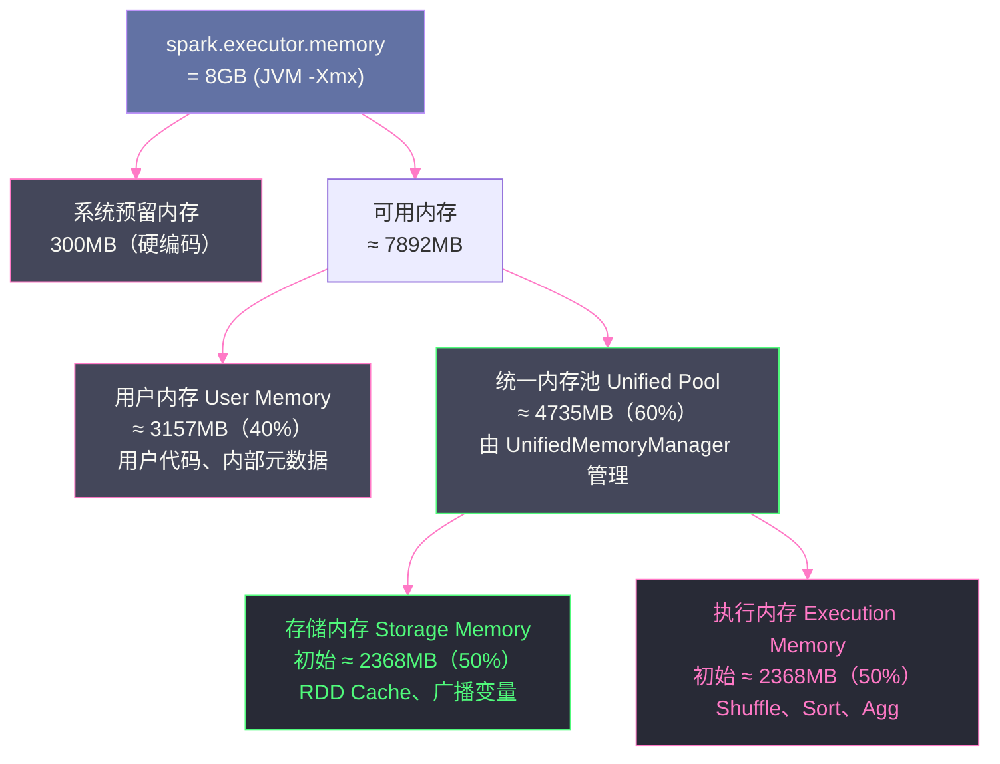
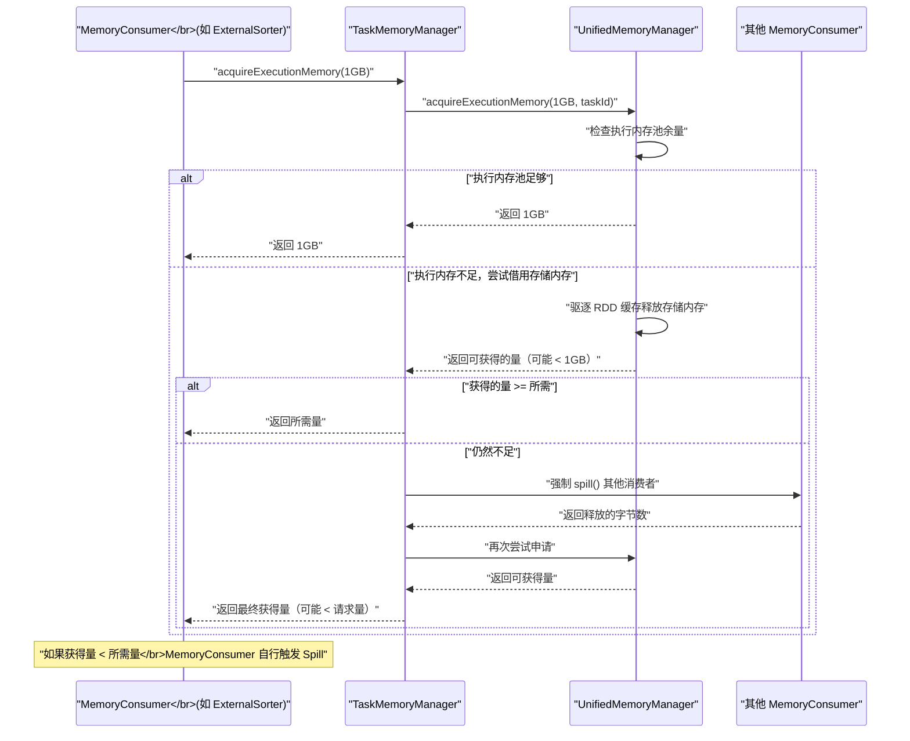

# 06 Spark 统一内存管理模型

## 摘要

Spark 的内存管理经历了从"静态分区"到"动态统一"的演进。1.6 版本之前，`StaticMemoryManager` 将 Executor 内存硬性切分为执行内存、存储内存和用户内存三块，各自固定，互不借用，导致频繁的资源浪费和 OOM。1.6 版本引入的 `UnifiedMemoryManager` 打破了这堵墙——执行内存和存储内存共享同一个内存池，可以根据实际负载动态调节边界。本文从 JVM 内存模型出发，解析 Spark Executor 的完整内存空间划分，深入剖析 `UnifiedMemoryManager` 的内存池结构、`MemoryMode`（堆内/堆外）的设计逻辑，以及 `TaskMemoryManager` 如何在单个 Task 级别精细化地管理 Execution Memory 的申请与释放。

---

## 第 1 章 为什么内存管理如此重要

### 1.1 Spark 内存使用的多重用途

在前几篇中，我们已经多次看到"内存不足触发 Spill"的描述。这个"内存"指的是什么？在 Spark Executor 进程中，内存被用于以下多种目的，它们相互竞争同一块物理资源：

**执行内存（Execution Memory）**：用于 Shuffle、Sort、Aggregation 等算子在执行过程中的临时数据存储。`ExternalSorter`、`ExternalAppendOnlyMap`、`UnsafeShuffleWriter` 等都从这里申请内存。这块内存是"临时性"的——Task 执行完毕后释放。

**存储内存（Storage Memory）**：用于缓存 RDD 分区、广播变量（Broadcast Variable）等持久化数据。`BlockManager` 管理这块内存。这块内存是"持久性"的——数据显式 unpersist 或被驱逐前一直占用。

**用户内存（User Memory）**：用于用户自定义数据结构（比如在 `mapPartitions` 中创建的大型集合）和 Spark 内部的某些元数据。这块内存 Spark 不做主动管理，是"自由区"。

**系统预留内存（Reserved Memory）**：为 Spark 框架自身运行保留的内存（Spark 内部对象、Driver 端元数据等）。

如果这些内存用途之间没有合理的协调机制，就会出现两类典型问题：
- **资源浪费**：某一类内存长期闲置，而另一类内存严重不足，频繁触发 Spill 或 OOM
- **内存争夺**：多个内存使用方同时增长，互不让步，最终某一方触发 OOM

这正是 Spark 内存管理机制要解决的核心问题。

### 1.2 StaticMemoryManager 的历史局限

在 Spark 1.6 之前，内存管理由 `StaticMemoryManager` 负责，采用**静态分区**策略：

```
Executor JVM 总堆内存
├── Reserved (预留，约 300MB)
├── Storage Memory = (总内存 - Reserved) × spark.storage.memoryFraction (默认 0.6)
│   └── 其中 Unroll (展开) = Storage × spark.storage.unrollFraction (默认 0.2)
├── Execution Memory = (总内存 - Reserved) × spark.shuffle.memoryFraction (默认 0.2)
└── User Memory = 剩余部分
```

以 8GB Executor 内存为例：
- Storage Memory ≈ 4.7GB（8GB × 0.6）
- Execution Memory ≈ 1.57GB（8GB × 0.2）
- User Memory ≈ 1.43GB

这个静态分配的问题非常明显：

**问题一：比例无法适应所有作业**。有些作业以计算为主（大量 Shuffle、聚合），几乎不缓存 RDD，此时 4.7GB 的 Storage Memory 完全浪费，而 1.57GB 的 Execution Memory 严重不足，频繁触发 Spill。反过来，缓存大量 RDD 的作业，则 Storage Memory 不够用。

**问题二：需要人工调参，且调参困难**。不同作业、不同阶段的最优比例不同，用户需要根据经验调整 `spark.storage.memoryFraction` 和 `spark.shuffle.memoryFraction`，但这两个参数的效果在运行前很难预判。

**问题三：比例相加不等于 1**。Storage(0.6) + Execution(0.2) + Reserved(约 0.03) = 0.83，剩余约 17% 作为 User Memory，且每块内存独立计账，任意一块超出就报 OOM，即使整体内存利用率只有 70%。

> [!note] 设计哲学
> `StaticMemoryManager` 的失败源于一个根本性的假设错误：**作业对不同类型内存的需求在时间维度上是固定的**。现实中，一个 Spark 作业的不同 Stage 可能有截然不同的内存需求模式——Stage 1 大量 Shuffle 需要执行内存，Stage 2 缓存中间结果需要存储内存。静态分区无法应对这种动态变化。

---

## 第 2 章 Executor 内存的完整空间划分

### 2.1 从 spark.executor.memory 到可用内存

`spark.executor.memory` 设置的是 Executor JVM 进程的堆内存上限（即 `-Xmx` 参数）。但这并不是 Spark 可以自由使用的全部内存——中间有几层扣减：

**第一层扣减：系统预留内存（Reserved Memory）**

固定预留 **300MB**（在源码中硬编码，不可配置），供 Spark 框架内部的核心对象使用（如 `SparkContext`、`BlockManager`、各种元数据结构）。这 300MB 不参与任何内存池管理。

**第二层扣减：用户内存（User Memory）**

```
User Memory = (spark.executor.memory - Reserved) × (1 - spark.memory.fraction)
```

`spark.memory.fraction` 默认 0.6（Spark 1.6）或 0.75（Spark 2.0+），表示 Spark 管理的内存池占可用内存的比例。剩余的 `1 - spark.memory.fraction` 部分就是 User Memory，供用户代码和 Spark 内部元数据使用。

**第三层：统一内存池（Unified Memory Pool）**

```
Unified Memory Pool = (spark.executor.memory - Reserved) × spark.memory.fraction
```

这块内存由 `UnifiedMemoryManager` 统一管理，动态分配给 Execution Memory 和 Storage Memory。

以 8GB Executor 内存（`spark.memory.fraction = 0.6`）为例：
```
Reserved:     300MB（固定）
User Memory:  (8192MB - 300MB) × 0.4 ≈ 3157MB
Unified Pool: (8192MB - 300MB) × 0.6 ≈ 4735MB
    ├── 初始 Storage: 4735MB × 0.5 ≈ 2368MB（spark.memory.storageFraction = 0.5）
    └── 初始 Execution: 4735MB × 0.5 ≈ 2368MB
```



### 2.2 spark.memory.fraction 的历史变化

这个参数在不同版本中有变化，背后反映了 Spark 团队对内存使用模式的认知演进：

| Spark 版本 | spark.memory.fraction 默认值 | 原因 |
|-----------|----------------------------|------|
| 1.6 | 0.75 | 较激进，假设大部分作业能充分利用统一内存池 |
| 2.0 | 0.6 | 调保守，为 User Memory 预留更多空间，减少因用户代码分配大对象导致的 OOM |
| 3.x | 0.6 | 保持 2.0 的保守设置 |

`spark.memory.fraction` 降低意味着 User Memory 增大——这是因为 Spark 2.0 引入了大量新特性（Project Tungsten、DataFrame API 等），内部代码也会分配更多 User Memory 级别的对象，需要给这部分预留更多空间。

### 2.3 堆外内存（Off-Heap Memory）

除了 JVM 堆内内存，`UnifiedMemoryManager` 还可以管理堆外内存（Off-Heap Memory）。堆外内存通过 Java 的 `Unsafe` API 直接向操作系统申请，不受 JVM GC 管理。

启用堆外内存：
```
spark.memory.offHeap.enabled = true
spark.memory.offHeap.size = 4g  # 堆外内存大小
```

堆外内存有独立的统一内存池，同样分为 Execution Memory 和 Storage Memory 两部分，动态边界规则与堆内相同。

为什么需要堆外内存？两个核心原因：

**原因一：避免 GC 停顿**。大量数据在 JVM 堆上反复分配和释放，会产生严重的 GC 压力，甚至触发几秒到几十秒的 Full GC 停顿，导致 Task 执行卡顿、Shuffle Fetch 超时等问题。堆外内存完全不受 GC 影响，生命周期由程序显式控制，彻底消除了 GC 对内存密集型操作的干扰。

**原因二：更紧凑的内存布局**。JVM 对象有对象头开销（16 字节）、引用开销（8 字节）和对齐填充。对于大量小对象（如 Shuffle 的 `(key, value)` 对），这些开销可能比数据本身还大。堆外内存以原始字节方式存储序列化数据，完全没有这些额外开销，内存利用率更高。

> [!warning] 生产避坑
> 开启堆外内存时，`spark.executor.memory` 设置的是 JVM 堆内存，`spark.memory.offHeap.size` 设置的是堆外内存，两者相加才是 Executor 进程的实际物理内存消耗。在 [[Hadoop YARN]] 集群上，Container 的内存上限（`yarn.nodemanager.resource.memory-mb` 和每个 Container 的内存）必须能容纳两者之和，否则会被 YARN 的 OOM Killer 杀死。常见配置错误：设了大堆外内存但没有相应增大 YARN Container 内存限制，导致 Executor 进程频繁被 Kill。

---

## 第 3 章 UnifiedMemoryManager：动态边界的实现

### 3.1 内存池的数据结构

`UnifiedMemoryManager` 维护四个内存池（`MemoryPool`）：

1. **`onHeapStorageMemoryPool`**：堆内存储内存池
2. **`onHeapExecutionMemoryPool`**：堆内执行内存池
3. **`offHeapStorageMemoryPool`**：堆外存储内存池
4. **`offHeapExecutionMemoryPool`**：堆外执行内存池

每个 `MemoryPool` 只是一个计数器——它追踪的是"当前已分配出去的字节数"（`_memoryUsed`）和"总容量"（`_poolSize`），并不真正持有内存。真正的内存分配由各 `MemoryConsumer` 通过 `TaskMemoryManager` 自行完成（在堆内 JVM 内存中是对象分配，在堆外是 `Unsafe.allocateMemory()`）。

`MemoryPool` 的核心方法：
- `acquireMemory(numBytes)` → 返回实际获取到的字节数（可能小于请求量）
- `releaseMemory(numBytes)` → 释放指定字节
- `memoryUsed` → 查询当前使用量
- `memoryFree` → 查询剩余量

### 3.2 acquireExecutionMemory：执行内存的申请逻辑

当一个 `MemoryConsumer`（如 `ExternalSorter`）需要内存时，调用 `TaskMemoryManager.acquireExecutionMemory(numBytes, consumer)`，最终调用到 `UnifiedMemoryManager.acquireExecutionMemory(numBytes, taskAttemptId, memoryMode)`。

这个方法的逻辑是整个内存管理模型的核心，分为三步（第 07 篇会深入讲解执行/存储内存的互相借用）：

**步骤一：尝试从执行内存池直接获取**

如果执行内存池还有足够空间，直接分配，返回成功。

**步骤二：从存储内存借用**

如果执行内存池不足，尝试驱逐存储内存中可以被驱逐的缓存数据（通过 `StorageMemoryPool.shrinkPoolToFreeSpace()`），将腾出的空间并入执行内存池，再尝试分配。

**步骤三：各 Task 公平竞争**

`UnifiedMemoryManager` 还实现了跨 Task 的公平内存分配：单个 Task 最多获得 `Execution Memory Pool / 活跃 Task 数` 的内存，防止某个 Task 独占所有执行内存，饿死其他 Task。

### 3.3 acquireStorageMemory：存储内存的申请逻辑

当 `BlockManager` 需要缓存一个 RDD 分区时，调用 `UnifiedMemoryManager.acquireStorageMemory(blockId, numBytes, memoryMode)`。

申请逻辑：

**步骤一：尝试从存储内存池直接获取**

**步骤二：从执行内存借用**

如果存储内存池不足，检查执行内存池是否有空闲（未被 Task 申请的部分），如果有，则从执行内存池借用空闲部分给存储内存池。

**关键约束**：存储内存**只能借用空闲的执行内存**——如果执行内存已全部被 Task 占用，存储内存不能强制驱逐执行内存（因为执行内存是 Task 正在使用的，强制释放会导致 Task 失败）。而执行内存可以驱逐存储内存（通过驱逐 RDD 缓存），因为缓存数据是可以重新计算的（这正是 RDD 血缘机制的价值）。

这个不对称性是 UnifiedMemoryManager 设计的精髓之一：**执行内存优先于存储内存**——当两者竞争有限内存时，确保计算任务（执行）不因缓存（存储）而失败。

---

## 第 4 章 TaskMemoryManager：单 Task 内存的精细化管理

### 4.1 为什么需要 TaskMemoryManager

`UnifiedMemoryManager` 管理的是 Executor 级别的内存池，处理的是跨 Task 的内存竞争。但在单个 Task 内部，同样可能有多个内存消费者（比如一个 Task 内有多个 `ExternalSorter` 实例，或者有 `ExternalSorter` + `HashAggregateExec` 同时运行）。

`TaskMemoryManager` 是单个 Task 内部的内存管理层，负责：
1. 代理 `MemoryConsumer` 向 `UnifiedMemoryManager` 申请/释放内存
2. 追踪 Task 内各个 `MemoryConsumer` 的内存使用量
3. 当 Task 内某消费者申请内存失败时，尝试让 Task 内其他消费者 Spill，腾出内存
4. Task 结束时，确保所有内存被正确释放（即使 Task 因异常退出）

### 4.2 MemoryConsumer 接口

实现 `MemoryConsumer` 接口的组件必须提供以下能力：

```scala
abstract class MemoryConsumer(taskMemoryManager: TaskMemoryManager, 
                               pageSize: Long,
                               mode: MemoryMode) {
  // 必须实现：当被要求 Spill 时，释放内存并返回实际释放的字节数
  // 如果无法 Spill，返回 0
  abstract def spill(size: Long, trigger: MemoryConsumer): Long
  
  // 申请内存（通过 TaskMemoryManager）
  protected def acquireMemory(required: Long): Long = {
    taskMemoryManager.acquireExecutionMemory(required, this)
  }
  
  // 释放内存（通过 TaskMemoryManager）
  protected def freeMemory(size: Long): Unit = {
    taskMemoryManager.releaseExecutionMemory(size, this)
  }
}
```

`spill()` 方法是 `MemoryConsumer` 最关键的接口。当 `TaskMemoryManager` 判断需要释放内存时（某个消费者申请内存但 Task 整体内存不足），它会找到内存占用最多的其他消费者，调用其 `spill()` 方法，要求它将内存数据写入磁盘并释放内存。

当前主要的 `MemoryConsumer` 实现：

| 消费者 | 使用场景 | Spill 行为 |
|--------|---------|-----------|
| `ExternalSorter` | Shuffle Write、Sort | 将 PartitionedAppendOnlyMap 或 PartitionedPairBuffer 序列化写临时文件 |
| `ExternalAppendOnlyMap` | Shuffle Read 聚合 | 将 AppendOnlyMap 序列化写临时文件 |
| `UnsafeShuffleWriter` 内的 `ShuffleInMemorySorter` | UnsafeShuffleWriter | 将堆外序列化数据按分区写 Spill 文件 |
| `BytesToBytesMap` | HashAggregateExec（Tungsten） | 将聚合 Map 写临时文件 |

### 4.3 内存申请的完整链路



### 4.4 内存 Page 管理

`TaskMemoryManager` 对堆外内存采用了**页（Page）管理**机制，这是 Tungsten 项目的一个重要特性。

在堆外内存模式下，内存不是一字节一字节地申请，而是以**固定大小的 Page**（默认 64MB，通过 `spark.buffer.pageSize` 配置）为单位申请。每个 Page 对应一块连续的堆外内存。

页管理的好处：
1. **减少 `Unsafe.allocateMemory()` 调用次数**：每次操作系统内存分配都有开销，以 Page 为单位批量申请更高效
2. **统一地址编码**：每条记录的堆外地址用 64 位整数编码：高 13 位是 Page 号，低 51 位是 Page 内偏移量。这个编码方式在 `UnsafeShuffleWriter` 的 `ShuffleInMemorySorter` 中大量使用（高 24 位存 partitionId，低 40 位存地址）

```
64位堆外地址编码：
┌─────────────────┬──────────────────────────────────────────┐
│  高 13 位 PageNum │          低 51 位 OffsetInPage           │
└─────────────────┴──────────────────────────────────────────┘
最大支持 2^13 = 8192 个 Page
每个 Page 最大 2^51 字节（远超实际内存大小，足够用）
```

---

## 第 5 章 静态管理与统一管理的对比

### 5.1 两种模式的全方位对比

| 维度 | StaticMemoryManager（1.6 前） | UnifiedMemoryManager（1.6 后，默认） |
|------|------------------------------|--------------------------------------|
| **执行/存储边界** | 硬性固定，不可借用 | 动态调节，可互相借用 |
| **配置复杂度** | 需要手动调 `memoryFraction` | 只需配置 `spark.memory.fraction` 一个参数 |
| **内存利用率** | 低（两类内存互不借用，经常一方空闲一方不足） | 高（空闲内存可被另一方借用） |
| **适应性** | 差（固定比例无法适应动态变化的作业需求） | 好（自动适应 Shuffle 密集型或缓存密集型负载） |
| **执行内存公平性** | 无 Task 间公平保障 | `UnifiedMemoryManager` 限制单 Task 最大执行内存，防止饥饿 |
| **堆外内存支持** | 不支持 | 完整支持（独立的堆外内存池） |
| **是否仍支持** | 是（通过 `spark.memory.useLegacyMode = true` 启用） | 是（默认） |

### 5.2 什么情况下还应该用 StaticMemoryManager

`StaticMemoryManager` 在今天基本没有实际使用价值，保留它主要是为了兼容老版本的迁移路径。在极少数场景下，如果你的作业内存模式极其固定（完全已知执行内存和存储内存各占多少），且不需要动态调整，使用 `StaticMemoryManager` 可以避免 `UnifiedMemoryManager` 的动态调整开销（虽然这个开销极小，可以忽略）。

实际上，没有任何理由在生产环境中使用 `StaticMemoryManager`，除非你在做 Spark 内存管理机制的比对实验。

---

## 第 6 章 内存管理的监控与诊断

### 6.1 从 Spark UI 读懂内存状态

**Executors 页面**提供了每个 Executor 的内存使用汇总：
- **Storage Memory**：已使用的存储内存量 / 总存储内存量。注意这里显示的是 `storageMemoryUsed / maxOnHeapStorageMemory`，动态边界下 maxOnHeapStorageMemory 是动态变化的
- **RDD Blocks**：已缓存的 RDD 分区数

**Environment 页面**可以确认当前使用的 `MemoryManager` 类型和所有内存相关配置参数。

**Stage 页面 → Task Metrics**：
- **Peak Execution Memory**：Task 执行过程中的峰值执行内存使用量。这个指标非常有价值——如果它接近 `Execution Memory Pool Size / 并发 Task 数`，说明 Task 已经在内存极限边缘运行，很容易触发 Spill

### 6.2 Executor 日志中的内存诊断关键词

当 Executor 发生内存相关问题时，日志中会出现以下关键词：

| 关键词 | 含义 | 对应问题 |
|--------|------|---------|
| `Spilling data to disk` | `ExternalSorter`/`ExternalAppendOnlyMap` 触发 Spill | 内存不足，考虑增大 Executor 内存 |
| `ExecutorLostFailure` + `java.lang.OutOfMemoryError: Java heap space` | JVM 堆内存耗尽 | 内存严重不足或内存泄漏 |
| `Container is running beyond physical memory limits` | YARN Container 总内存超出限制 | 堆外内存配置未同步增大 YARN Container 上限 |
| `Failed to allocate a page` | 堆外 Page 申请失败 | 堆外内存不足 |
| `Unable to acquire X bytes of memory` | 内存申请失败，触发 Spill | 执行内存不足 |

> [!warning] 生产避坑
> `java.lang.OutOfMemoryError: Java heap space` 的来源并不总是 Execution Memory 或 Storage Memory 溢出。有时是 User Memory 区域的代码问题：比如用户在 `mapPartitions` 中创建了一个容纳整个分区数据的 `List`，或者使用了第三方库（如某些 JDBC 驱动）大量分配堆内对象。这类 OOM 超出了 Spark 内存管理的控制范围，需要通过 JVM 堆转储（Heap Dump）分析具体的内存占用来源。常用命令：`jmap -dump:format=b,file=heap.hprof <pid>`，然后用 Eclipse MAT 分析。

### 6.3 内存相关核心参数汇总

| 参数 | 默认值 | 含义 |
|------|--------|------|
| `spark.executor.memory` | 1g | Executor JVM 堆内存 |
| `spark.memory.fraction` | 0.6 | 统一内存池占可用内存的比例 |
| `spark.memory.storageFraction` | 0.5 | 存储内存在统一内存池中的初始比例（动态边界） |
| `spark.memory.offHeap.enabled` | false | 是否启用堆外内存 |
| `spark.memory.offHeap.size` | 0 | 堆外内存大小 |
| `spark.memory.useLegacyMode` | false | 是否使用 StaticMemoryManager |
| `spark.buffer.pageSize` | 自动计算 | 堆外内存 Page 大小（默认 64MB） |
| `spark.executor.memoryOverhead` | max(executorMemory×0.1, 384MB) | Executor 的 JVM 堆外系统内存（Non-JVM）开销，用于 YARN Container 上限计算 |

---

## 小结

Spark 统一内存管理模型的本质是：**用动态边界替代静态分区，让内存资源随负载自适应调配**。

- **`StaticMemoryManager`** 的固定分区导致资源浪费，是 Spark 1.6 之前的历史产物
- **`UnifiedMemoryManager`** 的四个内存池（堆内/堆外 × 执行/存储）共享同一容量，通过动态借用机制适应不同负载
- **Executor 内存划分**：从 `spark.executor.memory` 到统一内存池，经过系统预留（300MB）和用户内存（1 - `spark.memory.fraction`）两层扣减
- **`TaskMemoryManager`** 是 Task 内部的内存代理，负责协调多个 `MemoryConsumer`，在内存紧张时触发 Spill 级联
- **堆内与堆外**：堆外内存消除 GC 压力，提升内存利用率，是 Tungsten 项目的核心特性

第 07 篇将深入执行内存与存储内存的动态边界机制——借用的具体规则、驱逐的触发条件，以及这套机制在极端场景下的边界与反例。

---

## 参考资料

- [Spark 统一内存管理：UnifiedMemoryManager](https://blog.csdn.net/aijiudu/article/details/78032663)
- [Spark Executor 内存管理](http://arganzheng.life/spark-executor-memory-management.html)
- Apache Spark 源码：`org.apache.spark.memory.UnifiedMemoryManager`
- Apache Spark 源码：`org.apache.spark.memory.TaskMemoryManager`
- Apache Spark 源码：`org.apache.spark.memory.MemoryConsumer`
- [Project Tungsten: Bringing Apache Spark Closer to Bare Metal](https://databricks.com/blog/2015/04/28/project-tungsten-bringing-spark-closer-to-bare-metal.html)
