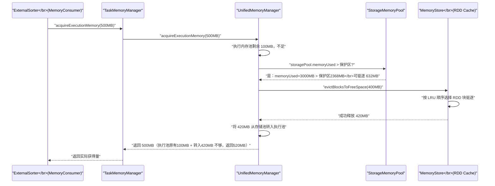

# 07 Execution 与 Storage 的动态边界

## 摘要

`UnifiedMemoryManager` 最核心的设计是执行内存（Execution Memory）与存储内存（Storage Memory）之间的**动态边界**机制。两者共享同一个内存池，在运行时通过互相借用来适应负载变化。但"动态"背后隐藏着严格的不对称规则：执行内存可以主动驱逐存储内存（强制淘汰 RDD 缓存），而存储内存只能借用空闲的执行内存，不能强制驱逐正在使用的执行内存。本文深入剖析这套借用与驱逐机制的完整逻辑链路，揭示 `spark.memory.storageFraction` 的真实语义（它不是固定边界，而是"存储内存的保护下限"），并通过多个典型场景推演，帮助你理解在不同负载组合下内存边界的实际行为。

---

## 第 1 章 为什么边界必须是动态的

### 1.1 静态边界的两类浪费

在 `StaticMemoryManager` 时代，执行内存和存储内存的边界是硬性的、固定的。这造成了两类典型的资源浪费，每一类都非常常见：

**第一类：Shuffle 密集型作业中存储内存大量闲置**

想象一个 ETL 作业：从 HDFS 读取 1TB 原始数据，经过多次 Shuffle（join、groupBy、sort），最终写入结果。这个作业几乎不需要缓存任何 RDD（数据只经过一次，不重复使用），存储内存从头到尾接近空置。但是，Shuffle 密集的多阶段 Merge Sort 需要大量执行内存来存储 `ExternalSorter` 的中间数据——执行内存严重不足，频繁触发 Spill。

此时，大量闲置的存储内存就在旁边"看热闹"，却无法参与救援。

**第二类：缓存密集型作业中执行内存大量闲置**

另一个场景：一个机器学习训练作业，将训练数据集 `persist(MEMORY_ONLY)` 后反复迭代（每次迭代都是轻量级的 map 操作，无 Shuffle）。数据缓存需要大量存储内存，但每次迭代的执行内存消耗极小。

此时，大量闲置的执行内存"守着空房子"，而存储内存因为放不下完整的训练集，不得不将部分 RDD 分区 drop 掉（触发 StorageLevel 降级或直接丢弃），导致每次迭代都要重新从磁盘读取被丢弃的分区，性能下降严重。

`UnifiedMemoryManager` 的动态边界正是为了解决这两类浪费——让内存资源随实际负载流动，而不是静态固化在某一侧。

### 1.2 动态边界的设计原则

动态借用需要遵循一些基本原则，否则会带来新的问题：

**原则一：执行内存具有更高优先级**

Shuffle、Sort、Aggregation 等执行操作是当前计算任务的核心，不能中途中断。如果执行内存不足，必须有强制手段腾出空间——驱逐 RDD 缓存是可行的，因为 RDD 可以通过重新计算恢复（这正是 Lineage 血缘机制的价值），但正在执行的 Shuffle 中间状态无法简单重建。

**原则二：存储内存有保护下限**

如果存储内存完全没有保护，执行内存可以将其压榨到零，所有 RDD 缓存都会被驱逐。这会导致依赖 RDD Cache 的迭代式算法（机器学习、图计算）性能急剧退化。`spark.memory.storageFraction` 参数定义了存储内存的"保护区"——在这个边界之上的缓存数据，执行内存**不能**驱逐。

**原则三：空闲资源可以自由借用**

如果执行内存完全空闲（没有 Task 在运行），存储内存可以借用这部分空间；反之亦然。借用是临时性的——当原始"所有者"需要时，借用者必须归还（对于存储内存借用执行内存的情况，归还方式是驱逐缓存；对于执行内存借用存储内存的情况，归还方式是执行内存直接占用该空间）。

---

## 第 2 章 storageFraction 的真实语义

### 2.1 常见的误解

许多 Spark 用户对 `spark.memory.storageFraction`（默认 0.5）的理解是：存储内存和执行内存各占统一内存池的 50%，这是一个固定的分割线。

这个理解是**不准确的**。

`spark.memory.storageFraction` 定义的是**存储内存的保护下限**，而不是存储内存的固定上限。它的精确语义是：

**存储内存的保护区 = 统一内存池 × `spark.memory.storageFraction`**

在保护区之内的缓存数据（即当存储内存已用量 ≤ 保护区大小时），**执行内存无法强制驱逐**。只有当存储内存的已用量超过保护区大小时，执行内存才能驱逐超出部分。

这意味着：
- 存储内存可以使用超过保护区大小的空间（借用空闲的执行内存）
- 但超出保护区的那部分缓存，随时可能被执行内存驱逐
- 保护区之内的缓存，只要内存足够，就不会被执行内存驱逐

> [!info] 核心概念
> `spark.memory.storageFraction = 0.5` 的直白含义是：**存储内存永远保有至少 50% 的统一内存池**（除非存储本身主动释放）。执行内存可以使用超过 50% 的统一内存池，但前提是存储内存已用量不超过 50%（即存储内存有空闲）。这是一个"下限保护"，而不是"固定分割"。

### 2.2 storageFraction 与 memoryFraction 的组合效果

`spark.memory.storageFraction` 决定的是存储内存的保护区大小：

```
存储内存保护区 = (spark.executor.memory - 300MB) × spark.memory.fraction × spark.memory.storageFraction
```

以 8GB Executor（`memory.fraction = 0.6`, `storageFraction = 0.5`）为例：
- 统一内存池 ≈ 4735MB
- 存储内存保护区 ≈ 2368MB
- 执行内存最大可占用 ≈ 4735MB（理论上限，当存储内存完全空闲时）
- 存储内存最大可占用 ≈ 4735MB（理论上限，当执行内存完全空闲时）

两者都可以使用几乎全部的统一内存池——关键在于谁先占用。

---

## 第 3 章 借用机制的完整逻辑

### 3.1 执行内存借用存储内存：驱逐 RDD 缓存

当执行内存申请失败（池内空间不足）时，`UnifiedMemoryManager.acquireExecutionMemory()` 会尝试从存储内存借用空间。借用的方式是**驱逐可驱逐的 RDD 缓存**。

"可驱逐"的判断条件：存储内存当前已用量超过了保护区大小（`storageFraction` 设定的下限）。如果存储内存已用量恰好等于或低于保护区，执行内存不能强制驱逐任何缓存。

驱逐的执行由 `MemoryStore.evictBlocksToFreeSpace()` 完成：
1. 按照 LRU（Least Recently Used，最近最少使用）顺序选择待驱逐的 RDD 分区块
2. 将选中的块从 `MemoryStore` 中移除（内存释放）
3. 如果块的 `StorageLevel` 包含磁盘（如 `MEMORY_AND_DISK`），先将块写入磁盘再释放内存；否则直接丢弃（下次访问时重新计算）
4. 将释放的内存空间从存储内存池转移给执行内存池



### 3.2 存储内存借用执行内存：占用空闲区

当 `BlockManager` 需要缓存一个新的 RDD 分区，但存储内存池空间不足时，`UnifiedMemoryManager.acquireStorageMemory()` 会尝试借用执行内存的**空闲部分**（即执行内存池的已分配容量减去已使用量的差值）。

关键约束：**存储内存只能借用空闲的执行内存，不能强制驱逐正在被 Task 使用的执行内存**。

这个约束的合理性在于：
- 执行内存是 Task 的活跃工作区，强制夺走会导致 Task 立即失败（`OutOfMemoryError` 或数据不一致）
- 相比之下，驱逐存储内存只是让 RDD 缓存失效，下次访问时重新计算，代价可控

```scala
// UnifiedMemoryManager.acquireStorageMemory 核心逻辑（简化）
override def acquireStorageMemory(blockId: BlockId, numBytes: Long, memoryMode: MemoryMode): Boolean = {
  val (executionPool, storagePool, maxMemory) = memoryMode match {
    case MemoryMode.ON_HEAP => 
      (onHeapExecutionMemoryPool, onHeapStorageMemoryPool, maxOnHeapMemory)
    case MemoryMode.OFF_HEAP => 
      (offHeapExecutionMemoryPool, offHeapStorageMemoryPool, maxOffHeapMemory)
  }

  // 存储内存申请不能超过总内存上限
  if (numBytes > maxMemory) return false

  // 存储池当前剩余量
  val storagePoolFree = storagePool.memoryFree
  
  // 如果存储池不足，尝试借用执行内存的空闲部分
  if (numBytes > storagePoolFree) {
    val memoryBorrowedFromExecution = Math.min(
      executionPool.memoryFree,          // 执行内存的空闲量（未被任何 Task 申请）
      numBytes - storagePoolFree         // 需要借用的量
    )
    // 将执行池的空闲部分转移给存储池
    executionPool.decrementPoolSize(memoryBorrowedFromExecution)
    storagePool.incrementPoolSize(memoryBorrowedFromExecution)
  }
  
  // 最终尝试从存储池分配
  storagePool.acquireMemory(blockId, numBytes)
}
```

### 3.3 执行内存归还被借用的空间

当存储内存借用了执行内存的空闲区后，如果后续有 Task 开始运行并需要执行内存，会发生什么？

此时执行内存池的"实际容量"（`_poolSize`）已经被减小了（对应被存储内存借走的部分）。Task 申请内存时会发现执行内存池容量不足，触发第 06 篇中描述的三步申请逻辑：

1. 尝试从执行内存池直接获取 → 不足
2. 尝试驱逐存储内存 → 如果存储内存已用量 > 保护区，驱逐超出部分

第二步中，驱逐存储内存的操作会将被借用的空间"收回"：
- `MemoryStore.evictBlocksToFreeSpace()` 驱逐 LRU 缓存块
- 存储池缩小，对应的空间转回执行池
- 执行 Task 拿到所需内存

这个过程是**自动的、透明的**——不需要 Task 主动向存储内存"要回"空间，`UnifiedMemoryManager` 在驱逐存储块的同时自动调整两个池的 `_poolSize`。

> [!note] 设计哲学
> 动态边界的本质是一个**零和游戏**：执行内存和存储内存的容量之和永远等于统一内存池的总量。所谓"借用"，不过是在同一个总量内，两个池的 `_poolSize` 计数器的此消彼长。`_poolSize` 的调整（增减）与真实内存的物理分配/释放是**解耦的**——计数器的调整仅影响后续申请的"可用上限"，不直接移动任何字节的数据。真正的内存释放（缓存块驱逐）和分配（Task 的 Unsafe 申请）是由各自的消费者独立完成的。

---

## 第 4 章 典型场景推演

通过几个具体场景来直观感受动态边界的行为，数字以 8GB Executor（统一内存池 ≈ 4735MB，保护区 ≈ 2368MB）为例。

### 4.1 场景一：执行内存逼近满载，逐步驱逐缓存

**初始状态**：
- 已缓存 3000MB RDD 数据（存储内存已用 3000MB，其中 2368MB 在保护区内，632MB 超出保护区）
- 执行内存已用 500MB（有 4735MB - 3000MB - 500MB = 1235MB 空闲）

**发生**：一个大型 Shuffle Sort 开始，需要 2000MB 执行内存

**动态边界响应**：
1. 执行内存池剩余 1235MB，不足 2000MB
2. 检查存储内存是否可驱逐：`storageMemoryUsed(3000MB) > 保护区(2368MB)`，可驱逐 632MB
3. 驱逐 632MB 的 LRU RDD 缓存，释放到执行内存池
4. 执行内存池现有 1235MB + 632MB = 1867MB，仍不足 2000MB
5. 再次检查：`storageMemoryUsed(2368MB) = 保护区(2368MB)`，不可再驱逐
6. 执行内存只能获得 1867MB，无法满足 2000MB 的全量请求
7. `ExternalSorter` 收到 1867MB（小于请求量），触发更频繁的 Spill

**结论**：存储内存保护区有效保护了 2368MB 的 RDD 缓存不被驱逐，代价是执行内存无法得到全量内存，触发额外 Spill。

### 4.2 场景二：无缓存时执行内存独享全部资源

**初始状态**：
- 无任何 RDD 缓存（存储内存已用 0MB）
- 执行内存已用 0MB

**发生**：大型 Shuffle 需要 4000MB 执行内存

**动态边界响应**：
1. 执行内存池初始容量 = 统一池 × (1 - storageFraction) = 4735 × 0.5 = 2368MB
2. 申请 4000MB，超出执行池容量
3. 尝试驱逐存储内存：`storageMemoryUsed(0MB) ≤ 保护区(2368MB)`，**无可驱逐内容**
4. 但存储内存有空闲（storagePool.memoryFree = 2368MB），执行内存可以"借用"...

等等，这里有个微妙点：**执行内存从存储内存借用的方向**，实际上是通过驱逐缓存来实现的，而不是直接移动 poolSize。当存储内存完全空闲时，存储内存没有任何可驱逐的块，但存储内存池的 `_poolSize` 仍然是 2368MB——执行内存无法通过"驱逐"来拿到这块空间。

然而，在 `UnifiedMemoryManager` 的实现中，执行内存实际上**可以**使用超过自己初始 poolSize 的空间，只要总量不超过统一内存池：

```scala
// 执行内存申请的总量上限不是 executionPool._poolSize，
// 而是 maxMemory（统一内存池总量） - storagePool.memoryUsed
val maxExecutionMemory = maxMemory - storagePool.memoryUsed
```

当存储内存已用量为 0 时，`maxExecutionMemory = 4735MB - 0MB = 4735MB`，执行内存可以申请到几乎全部的统一内存池！

**结论**：没有 RDD 缓存时，执行内存可以扩展到几乎整个统一内存池，不受 `storageFraction` 限制。这就是"动态"的威力——单纯的 Shuffle 计算作业能充分利用所有可用内存。

### 4.3 场景三：存储内存借用执行内存空闲区

**初始状态**：
- 存储内存已用 1000MB（低于保护区 2368MB）
- 执行内存空闲（没有 Task 运行）

**发生**：`persist()` 操作需要缓存新的 RDD 分区，需要 2000MB

**动态边界响应**：
1. 存储内存池剩余 = `_poolSize`(2368MB) - `_used`(1000MB) = 1368MB，不足 2000MB
2. 尝试借用执行内存空闲区：`executionPool.memoryFree = _poolSize(2368MB) - _used(0MB) = 2368MB`
3. 需要借用 = 2000MB - 1368MB = 632MB，执行池有足够空闲
4. 从执行池转移 632MB 给存储池：`executionPool._poolSize -= 632MB`，`storagePool._poolSize += 632MB`
5. 存储池现有容量 3000MB，可以容纳新的 2000MB 缓存
6. 缓存成功，存储内存总计已用 3000MB（超过保护区 2368MB 的部分是借来的）

**关键后续**：如果此时有 Task 开始运行需要执行内存：
- 执行池 `_poolSize` 只剩 1736MB
- Task 申请执行内存，池内不足，触发驱逐存储内存
- `storageMemoryUsed(3000MB) > 保护区(2368MB)`，可驱逐 632MB
- 驱逐后，执行池恢复到 2368MB，Task 获得所需内存

**结论**：存储内存借用的执行内存是"临时"的，一旦有 Task 需要执行内存，借用部分会被驱逐归还。

### 4.4 场景四：存储内存无法借用（执行内存已满载）

**初始状态**：
- 执行内存已用 2000MB（Task 正在运行）
- 存储内存已用 1000MB

**发生**：`persist()` 操作需要缓存 1000MB

**动态边界响应**：
1. 存储内存池剩余 1368MB，足够 1000MB
2. 直接从存储池分配，缓存成功

**另一个发生**：`persist()` 需要缓存 2000MB（存储池只剩 1368MB）

**动态边界响应**：
1. 存储内存池剩余 1368MB，不足 2000MB
2. 尝试借用执行内存空闲：`executionPool.memoryFree = 2368MB - 2000MB = 368MB`，空闲量不足 632MB（需要借 2000-1368=632MB）
3. 只能借到 368MB，存储池扩展到 2736MB
4. 存储池实际只能缓存 2736MB - 1000MB(已用) = 1736MB，而不是所需的 2000MB
5. 缓存失败（缓存不了完整的 2000MB 分区）——具体行为取决于 StorageLevel：
   - `MEMORY_ONLY`：该分区不被缓存，直接丢弃
   - `MEMORY_AND_DISK`：写入磁盘，内存中不保存

**结论**：当执行内存已满载时，存储内存无法获得足够空间，大分区缓存会失败或降级。

---

## 第 5 章 动态边界的设计权衡与边界案例

### 5.1 执行优先的设计导致的缓存抖动

执行内存优先（可以驱逐存储内存）的设计在某些场景下会引起缓存抖动（Cache Thrashing）问题：

**场景**：一个迭代式机器学习作业，每轮迭代都 cache 训练数据（约 2.5GB），然后进行 Shuffle（需要约 2GB 执行内存）。统一内存池 4.7GB，保护区 2.35GB。

- 迭代开始：缓存 2.5GB 训练数据，存储内存用 2.5GB（超出保护区 150MB）
- Shuffle 阶段：执行内存需要 2GB，当前执行内存池 = 4.7 - 2.5 = 2.2GB（不足 2GB？不对，还需要计算保护区驱逐...）
- 实际：执行内存可驱逐超出保护区的 150MB，获得执行内存池 = 2.2 + 0.15 = 2.35GB，勉强够 2GB
- 如果 Shuffle 数据量增大到 2.4GB：驱逐 150MB 后仍不足，被迫使用 2.35GB，更频繁 Spill

**缓解方案**：
1. 调大 `spark.executor.memory`，增大总内存
2. 调大 `spark.memory.storageFraction`（如 0.6），给存储内存更多保护空间
3. 使用 `MEMORY_AND_DISK` 而非 `MEMORY_ONLY`，让被驱逐的缓存 fall back 到磁盘而不是丢失
4. 考虑启用堆外内存，将 Shuffle 执行内存挪到堆外，与堆内的存储内存不再竞争

### 5.2 storageFraction 调优的方向判断

| 作业特征 | 推荐的 storageFraction 方向 |
|---------|---------------------------|
| 无 RDD 缓存、大量 Shuffle | 调小（如 0.3）：减少存储保护区，给执行内存更大空间 |
| 大量 RDD 缓存、轻量计算 | 调大（如 0.6-0.7）：给缓存更多保护区，防止被执行驱逐 |
| 混合负载（既有 Shuffle 又有缓存） | 保持默认（0.5），让动态机制自适应 |
| 迭代式机器学习（每轮都需重用缓存） | 调大（如 0.6）+ 使用 `MEMORY_AND_DISK`，保护缓存不被驱逐 |

> [!warning] 生产避坑
> 调小 `storageFraction` 并不直接增大执行内存的"最小保证量"——它减少的是存储内存的保护区，使得执行内存在需要时可以驱逐更多缓存。但如果根本没有缓存数据，调小 `storageFraction` 对执行内存没有任何改善。真正能增大执行内存的方式是：减少存储内存的实际占用（少 cache 数据），或者增大 `spark.executor.memory`（扩大总池）。

### 5.3 动态边界不能解决的问题

动态边界机制虽然大幅提升了内存利用率，但它不是万能的。以下情况仍然会导致 OOM：

**问题一：User Memory 区域的膨胀**

用户代码在 `mapPartitions` 中创建大型数据结构（如 `HashMap`、`Array`），这些对象分配在 JVM 堆上，位于 User Memory 区域，Spark 不做任何管理。当 User Memory 膨胀时，会直接压缩 JVM 堆的剩余空间，即使统一内存池看起来还有空余，实际的 JVM 堆可用量也可能已经不足，触发 GC 甚至 OOM。

**问题二：单个 Task 的峰值需求超过可用量**

动态边界只能在多个 Task 之间调配，但单个 Task 内的峰值内存需求是固定的。如果一个 Task 处理的数据分区特别大（数据倾斜），它的 `ExternalSorter` 需要大量内存，即使系统努力驱逐所有可驱逐的缓存，也可能无法满足需求。此时唯一的出路是增加分区数（减小每个 Task 的数据量）。

**问题三：Execution Memory 的 Task 间公平性失衡**

在极端情况下，如果某个 Task 大量申请内存并持有不释放（比如一个很慢的 Task 持续占用大量 `ExternalSorter` 内存），其他 Task 的执行内存申请可能长期被压缩。`UnifiedMemoryManager` 的 Task 公平分配机制（单 Task 最多 1/N 的执行内存）可以缓解但不能完全解决这个问题。

---

## 第 6 章 RDD 缓存的存储内存管理细节

### 6.1 MemoryStore 的块管理

`MemoryStore` 是 `BlockManager` 中负责内存级缓存的组件。它维护一个 `LinkedHashMap<BlockId, MemoryEntry>`（基于访问顺序，即 LRU 顺序），每个 `MemoryEntry` 对应一个缓存块。

**缓存块的三种存储形式**：

1. **`DeserializedMemoryEntry`**：将 RDD 分区数据以 Java 对象数组形式（`Array[T]`）存在内存中，访问时无需反序列化，速度最快。对应 `StorageLevel.MEMORY_ONLY` 或 `MEMORY_AND_DISK`。

2. **`SerializedMemoryEntry`**：将 RDD 分区数据以序列化字节流（`ByteBuffer`）形式存在内存中，占用空间更小（序列化后通常比对象占用小），但访问时需要反序列化。对应 `StorageLevel.MEMORY_ONLY_SER` 等。

3. 磁盘存储（不在 MemoryStore 中）：`StorageLevel.DISK_ONLY` 等仅磁盘级别，完全不使用 MemoryStore。

### 6.2 Unroll：缓存前的"试探"机制

将一个 RDD 分区放入内存缓存之前，Spark 需要先"展开"（Unroll）这个分区——即将 RDD 的迭代器（Iterator）转化为具体的数组，才能放入 `MemoryStore`。但在展开完成之前，不知道展开后需要多少内存。

为了解决这个"先有鸡还是先有蛋"的问题，`MemoryStore` 实现了一个**渐进式 Unroll + 内存申请**机制：

1. 开始展开，申请一小块初始内存（约 1MB）
2. 迭代地消费 RDD 的 Iterator，将每个元素放入数组
3. 每隔 `MemoryStore.UNROLL_MEMORY_CHECK_PERIOD`（默认 16 个元素）估算一次当前已用内存
4. 如果估算大小超过当前已申请的内存，向 `MemoryManager` 申请更多内存
5. 如果申请失败（内存不足），Unroll 失败：
   - 如果 `StorageLevel` 包含磁盘，将分区写入磁盘存储
   - 否则，缓存失败，该分区不被缓存

这个渐进式机制避免了"提前预分配大块内存"的浪费，也避免了 Unroll 到一半内存不足导致的不完整缓存状态。

> [!info] 核心概念
> Unroll 内存申请的量来自存储内存池，但 Unroll 过程中申请的内存和最终缓存块占用的内存记账方式不同：Unroll 过程中的内存是"临时性"的（`unrollMemoryMap` 中追踪），Unroll 完成后转化为正式的缓存块内存。如果多个 Task 同时 Unroll 同一个 RDD 分区（竞态），只有一个会成功缓存，其余的 Unroll 内存会被释放。

---

## 小结

执行内存与存储内存的动态边界，是 `UnifiedMemoryManager` 最精妙也最容易被误解的设计：

- **`storageFraction` 是保护下限**，不是固定分割线。存储内存的已用量低于保护区时，执行内存无法驱逐；高于保护区时，执行内存可以驱逐超出部分
- **借用规则不对称**：执行内存可驱逐存储内存（通过 `MemoryStore.evictBlocksToFreeSpace()`），存储内存只能借用空闲的执行内存
- **四个典型场景**：无缓存时执行内存独享全池；有缓存时按保护区规则驱逐；执行空闲时存储内存自由扩展；执行满载时存储内存扩展受限
- **动态边界的局限**：无法管理 User Memory，无法解决单 Task 数据倾斜，无法完全避免 Task 间内存竞争
- **RDD Unroll 机制**：渐进式申请内存，避免预分配浪费，失败时按 StorageLevel 降级到磁盘或直接放弃

第 08 篇将深入 Spill 机制的全貌——不仅是触发条件，还包括 Spill 文件的生命周期管理、Spill 的性能代价量化，以及各种场景下如何通过参数调整减少不必要的 Spill。

---

## 参考资料

- [Spark 统一内存管理：UnifiedMemoryManager](https://blog.csdn.net/aijiudu/article/details/78032663)
- [Deep Dive into Spark Memory Management](https://luminousmen.substack.com/p/deep-dive-into-spark-memory-management)
- Apache Spark 源码：`org.apache.spark.memory.UnifiedMemoryManager`
- Apache Spark 源码：`org.apache.spark.storage.memory.MemoryStore`
- [Project Tungsten: Bringing Apache Spark Closer to Bare Metal](https://databricks.com/blog/2015/04/28/project-tungsten-bringing-spark-closer-to-bare-metal.html)
