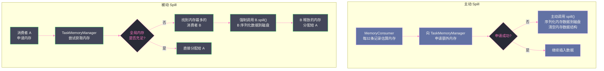

# 08 Spill 机制：从内存到磁盘的安全阀

## 摘要

Spill（溢写）是 Spark 在内存不足时的核心降级机制——当执行内存无法容纳所有中间数据时，将部分数据序列化写入磁盘临时文件，腾出内存继续处理，最终在任务结束时通过多路归并合并所有 Spill 文件。Spill 是 Spark "超越物理内存限制"能力的来源，也是生产环境中最常见的性能瓶颈之一。本文系统梳理 Spill 的全貌：触发的两条路径（主动与被动）、参与 Spill 的各类组件及其行为差异、Spill 文件的生命周期管理、磁盘 I/O 放大效应的量化分析，以及从配置参数、算子选择、数据分布三个维度减少 Spill 的实战调优。

---

## 第 1 章 Spill 的本质：一个必要的设计妥协

### 1.1 为什么 Spill 是必要的

在一个纯内存的理想世界里，所有中间数据都在内存中完成计算，完全没有磁盘 I/O，性能最优。但现实是：集群的物理内存是有限的，而数据的规模几乎是无限的。当处理 TB 级别的数据时，即使是几十 GB 内存的大机器也可能无法一次性容纳所有中间结果。

面对这个矛盾，有两种选择：

**选择一：失败**——当内存不足时，抛出 `OutOfMemoryError`，让用户手动增加内存或减小数据量。这是许多早期 MapReduce 框架的处理方式，代价是极差的用户体验。

**选择二：降级**——当内存不足时，将部分数据写到磁盘，用磁盘 I/O 换取内存空间，继续处理。磁盘比内存慢 100-1000 倍，但降级后的作业至少能完成，而不是崩溃。

Spark 选择了第二种——Spill 就是这个降级机制。Spill 不是 Bug，不是错误，而是一个**有意识的设计权衡**：牺牲部分性能来换取作业的可靠完成。

> [!note] 设计哲学
> Spill 体现了分布式计算系统设计中"优雅降级"（Graceful Degradation）的思想：在资源受限时，系统不是直接崩溃，而是切换到一个更慢但仍然可用的工作模式。这与操作系统的虚拟内存（将物理内存不足时的页面换到磁盘）、数据库的外排序（Sort-Merge Join 在内存不足时借助临时文件）本质上是相同的思路。

### 1.2 Spill 的代价是什么

Spill 不是免费的。每次 Spill 都会产生以下代价：

**代价一：磁盘写入 I/O**

Spill 时，内存中的数据被序列化后写入临时磁盘文件。序列化本身需要 CPU 时间，磁盘写入需要 I/O 带宽。如果 Spill 频繁，磁盘很快就会成为瓶颈——特别是在使用机械硬盘（HDD）的节点上，磁盘随机写入速度通常只有 100MB/s 左右。

**代价二：磁盘读取 I/O（Merge 时）**

Spill 的临时文件在 Task 结束时需要被 Merge（多路归并），这需要将所有 Spill 文件从磁盘读回内存。如果发生了 K 次 Spill，Merge 需要读取约 K × (单次 Spill 量) 的数据——这是写入量的 K 倍。再加上 Merge 后写出最终结果文件，总的磁盘 I/O 是原始数据量的 **2K + 1 倍**（K 次写、K 次读、1 次最终写）。

**代价三：序列化/反序列化开销**

Spill 文件中的数据是序列化格式，Merge 时需要反序列化（如果需要聚合）。使用 Java 序列化时，序列化/反序列化的 CPU 开销可能占 Task 总时间的 20-40%。使用 [[Kryo]] 可以将这个开销降低到 5-10%。

**代价四：JVM GC 压力**

虽然 Spill 的目的是释放内存，但 Spill 操作本身（序列化、数组排序）会短暂地分配大量临时对象，触发 Young GC。频繁 Spill 会导致 GC 频率增加，进一步拖慢 Task 执行速度。

**量化示例**：

一个处理 10GB 数据的 Map Task，如果发生 5 次 Spill（每次 2GB），Merge 阶段需要：
- 读取 5 × 2GB = 10GB 临时 Spill 文件
- 写出 1 × 10GB 最终数据文件
- 总磁盘 I/O：Spill 写 10GB + Merge 读 10GB + 最终写 10GB = **30GB**

而如果内存充足，只需最终写出 10GB，磁盘 I/O 减少 **3 倍**。

---

## 第 2 章 Spill 的两条触发路径

### 2.1 主动 Spill：MemoryConsumer 自我感知

第一条路径是 `MemoryConsumer` 在申请内存失败时**主动**触发 Spill。以 `ExternalSorter` 为例，每插入 `SPILL_CHECK_INTERVAL`（32）条记录后：

1. 估算当前数据结构大小 `estimatedSize`
2. 向 `TaskMemoryManager` 申请 `estimatedSize - currentlyAllocated` 的额外内存
3. `TaskMemoryManager` 尝试从 `UnifiedMemoryManager` 获取内存（包括驱逐 RDD 缓存）
4. 如果返回的内存量不足，`ExternalSorter` 认定内存不足，**主动调用 `spill()`**

主动 Spill 的特点是**可预测**——`ExternalSorter` 知道自己要 Spill，可以选择在当前内存数据结构达到某个合适大小时执行，而不是在最后一刻被迫。

### 2.2 被动 Spill：TaskMemoryManager 强制驱逐

第二条路径是 `TaskMemoryManager` 在另一个内存消费者申请内存时，**被动地**要求某个消费者 Spill。

场景：Task 内部有两个并发的内存消费者（例如 SQL 执行计划中的 `HashAggregateExec` 和一个嵌套的 `ExternalSorter`）。消费者 A 申请内存，但 Task 整体 Execution Memory 已用完：

1. `TaskMemoryManager` 收到 A 的内存申请
2. 向 `UnifiedMemoryManager` 申请，失败（全局执行内存已耗尽，驱逐 RDD 缓存也不够）
3. `TaskMemoryManager` 遍历 Task 内所有已注册的 `MemoryConsumer`，找到内存占用最多的消费者 B
4. 调用 B 的 `spill()` 方法，强制其将内存数据写入磁盘
5. B 释放内存后，`TaskMemoryManager` 用这块内存满足 A 的申请

被动 Spill 的特点是**不可预测**——B 在被动 Spill 时，自身的计算状态可能处于"半途中"，必须能够安全地将当前状态序列化到磁盘。这也是为什么 `MemoryConsumer` 必须实现 `spill()` 方法的原因——系统需要保证任何内存消费者在任何时刻都可以被安全地要求 Spill。



---

## 第 3 章 各组件的 Spill 行为详解

### 3.1 ExternalSorter 的 Spill

`ExternalSorter` 的 Spill 已在第 04 篇中详细介绍。这里补充几个关键细节：

**Spill 时的排序是必要的吗？**

是的。Spill 文件中的数据必须按 `(partitionId, key)` 排序，原因是 Merge 阶段的多路归并排序依赖"每路输入已有序"这个前提。如果 Spill 时不排序，Merge 时就必须全量重排，内存需求和时间代价都会大幅增加。

虽然排序增加了 Spill 时的 CPU 开销（O(n log n)），但这个代价在 Merge 时会以 O(n log K) 的更低代价得到回报——因为有序归并比无序全排快得多（K 是 Spill 文件数，通常远小于 n）。

**Spill 阈值与内存估算的关系**

`ExternalSorter` 并不是精确地在"内存刚好用完"时触发 Spill——它通过内存估算和向 `TaskMemoryManager` 申请来间接判断。内存估算存在误差（基于采样，不是精确测量），加上申请内存的延迟，实际 Spill 时数据结构的大小可能略超出理论限制。这个超出部分通常被 JVM 堆的剩余空间吸收，不会立即导致 OOM。

**多次 Spill 与单次大 Spill 的权衡**

频繁的小 Spill（每次 Spill 少量数据）vs 偶尔的大 Spill（每次 Spill 大量数据）——哪种更好？

一般而言，**少次大 Spill 优于多次小 Spill**：
- 每次 Spill 都有固定开销（文件创建、元数据写入），少次 Spill 减少了这个固定开销
- Merge 的代价与 Spill 文件数 K 成正比（O(n log K)），K 越小越好
- 每次 Spill 后内存被清空，清空时触发的 GC 开销也随频率增加

### 3.2 ExternalAppendOnlyMap 的 Spill

`ExternalAppendOnlyMap`（Shuffle Read 端聚合）的 Spill 与 `ExternalSorter` 类似，但有一个重要差异：

`ExternalSorter` 的 Spill 数据按 `(partitionId, key)` 排序，因为它服务于多分区的输出；`ExternalAppendOnlyMap` 服务于单个 Reduce 分区，其 Spill 数据只按 `key` 排序（无 partitionId 维度）。

另一个差异是聚合值的处理：`ExternalAppendOnlyMap` 的 `AppendOnlyMap` 中存储的已经是聚合值（不是原始值），Spill 文件中每个 key 只有一条聚合记录。Merge 时对相同 key 调用 `mergeCombiners()`，而不是 `mergeValue()`。

### 3.3 UnsafeShuffleWriter 中的 Spill

`UnsafeShuffleWriter` 的内存数据结构是 `ShuffleInMemorySorter`（堆外内存），其 Spill 行为与基于 JVM 堆的 Spill 有以下差异：

**堆外内存的 Spill 触发**：通过 `ShuffleInMemorySorter.hasSpaceForAnotherRecord()` 检查 `LongArray` 是否已满（当已用条目数超过 70% 的 `LongArray` 容量时），或者 `TaskMemoryManager` 请求 `ShuffleInMemorySorter.spill()`。

**序列化数据已就绪**：`UnsafeShuffleWriter` 的数据在插入时就已经序列化到堆外内存（`MemoryBlock`），Spill 时只需要将 `LongArray` 排序后，按顺序将对应的堆外内存块写入磁盘，不需要额外的序列化步骤。这是 `UnsafeShuffleWriter` 比 `SortShuffleWriter` 更快的原因之一——Spill 时的序列化代价已经在数据插入时分摊了。

**Spill 文件格式**：`UnsafeShuffleWriter` 的 Spill 文件存储的是原始序列化字节，不需要反序列化就能直接合并（通过 `FileChannel.transferTo()` 零拷贝拼接）。这使得 Merge 阶段非常高效，代价只有磁盘 I/O，没有 CPU 的序列化/反序列化开销。

### 3.4 BytesToBytesMap 的 Spill（Tungsten 哈希聚合）

`BytesToBytesMap` 是 Tungsten 项目中用于 SQL 引擎的高性能哈希映射，服务于 `HashAggregateExec`（SQL 的聚合算子）。它将 key-value 数据以序列化字节的形式存储在堆外内存中，完全绕过 JVM 对象模型。

当 `BytesToBytesMap` 内存不足时，它的 Spill 行为是将哈希表内所有数据按 key 的哈希值写入临时文件（类似 `ExternalSorter` 的 Spill 格式），然后在最终阶段进行多路归并。

需要注意的是：`BytesToBytesMap` 的 Spill 实际上是将 SQL 的哈希聚合降级为排序聚合——Spill 后的多路归并相当于外排序（`ExternalSorter`），性能会显著下降。这就是为什么 SQL 的 `HashAggregateExec` 在内存不足时会自动切换到 `SortAggregateExec` 的原因。

---

## 第 4 章 Spill 文件的生命周期

### 4.1 临时文件的创建

所有 Spill 临时文件通过 `BlockManager.diskBlockManager.createTempShuffleBlock()` 创建，路径格式为：

```
${spark.local.dir}/blockmgr-{uuid}/temp_shuffle_{uuid}
```

- `spark.local.dir`：Spark 的本地工作目录，默认是 `/tmp`（Java 临时目录），生产环境应配置为专用的 SSD 目录
- 每个 Spill 文件都有全局唯一的 UUID，避免多个 Task 并发 Spill 时文件名冲突

每个 Spill 文件对应一个 `SpillInfo` 对象，记录：
- 文件路径（`File`）
- 每个分区在文件中的字节长度数组（`partitionLengths`）
- 对应的 `BlockId`

### 4.2 文件的追加写入（DiskBlockObjectWriter）

Spill 写入通过 `DiskBlockObjectWriter` 完成，它封装了以下层次的 I/O：

```
DiskBlockObjectWriter
  └── FileOutputStream（Java NIO 文件输出流）
        └── BufferedOutputStream（32KB 写缓冲区）
              └── CompressionOutputStream（可选，LZ4/Snappy/Zstd 压缩）
                    └── SerializationStream（Kryo 或 Java 序列化流）
```

每一层都有其作用：
- **BufferedOutputStream**：批量写入，减少系统调用次数（从每条记录一次 write 降低到每 32KB 一次 write）
- **CompressionOutputStream**：压缩数据减少磁盘占用和写入 I/O（以 CPU 换 I/O）
- **SerializationStream**：将 Java 对象转化为字节流

### 4.3 Merge 后的清理

Task 完成 Merge（生成最终的 `.data` 和 `.index` 文件）后，所有临时 Spill 文件立即被删除。这个清理发生在 `ExternalSorter.deleteSpillFiles()` 中，在最终 Merge 方法的 `finally` 块中执行，确保即使 Merge 过程中发生异常，临时文件也能被清理，不会造成磁盘泄漏。

> [!warning] 生产避坑
> 如果 Task 因 OOM 或其他异常而崩溃，`finally` 块中的清理可能未能执行（JVM 崩溃时 finally 不保证执行）。此时临时 Spill 文件会残留在 `spark.local.dir` 目录下，随着时间积累可能撑满磁盘。生产环境中应该定期清理 `spark.local.dir` 下的 `temp_shuffle_*` 文件，或者配置 Spark 的清理策略（`spark.cleaner.*` 相关参数）。监控 `spark.local.dir` 的磁盘使用量也是重要的运维手段。

### 4.4 spark.local.dir 的重要性

`spark.local.dir` 是 Shuffle 临时文件和 Spill 文件的存放目录，对性能有决定性影响：

- **IOPS**：磁盘的随机 I/O 能力决定了 Spill 的速度。SSD 的 IOPS 通常比 HDD 高 10-100 倍，Spill 密集型作业在 SSD 节点上的速度会显著更快
- **吞吐量**：顺序写入速度影响大 Spill 文件的写出速度，NVMe SSD 可达 3GB/s+，而 HDD 通常只有 100-200MB/s
- **多目录配置**：可以配置多个目录（逗号分隔），Spark 会以轮询方式在多个目录间分配文件，充分利用多块磁盘的并行 I/O 能力

```
# 使用多块 SSD 的最优配置示例
spark.local.dir=/data1/spark-tmp,/data2/spark-tmp,/data3/spark-tmp,/data4/spark-tmp
```

---

## 第 5 章 Spill 的量化分析：I/O 放大因子

### 5.1 I/O 放大因子的计算

**定义**：I/O 放大因子 = 总磁盘 I/O 量 / 原始数据量

对于一个发生了 K 次 Spill 的 Task，假设每次 Spill 量为 `S`，总数据量为 `N = K × S`（简化假设每次 Spill 量相等）：

```
Spill 写入量   = K × S = N
Merge 读取量   = K × S = N（每个 Spill 文件读一遍）
最终写出量     = N（写出最终 .data 文件）
总磁盘 I/O     = N + N + N = 3N

I/O 放大因子   = 3N / N = 3（最基础情况）
```

但如果有压缩（`spark.shuffle.spill.compress = true`），Spill 文件是压缩格式，大小约为原始大小的 30-60%（取决于数据压缩率）：

```
Spill 写入量（压缩）= 0.5N（假设压缩率 50%）
Merge 读取量（压缩）= 0.5N
最终写出量（压缩）  = 0.5N（最终 .data 文件也压缩）
总磁盘 I/O          = 0.5N + 0.5N + 0.5N = 1.5N

I/O 放大因子（压缩）≈ 1.5
```

开启压缩后，磁盘 I/O 量可以减少一半——代价是额外的 CPU 开销。在 CPU 资源充足、磁盘是瓶颈的场景下，开启压缩是明显有利的选择。

### 5.2 多级 Spill 的级联效应

如果 Task 在 Merge 过程中也发生了 Spill（即 Merge 阶段需要合并太多 Spill 文件，所需内存超出可用量），会产生"二级 Spill"：

原始 Spill → Merge（多路归并部分文件）→ 写出 Merge 结果（二级 Spill 文件）→ 最终 Merge

此时 I/O 放大因子会更高。实践中应避免发生二级 Spill——通过增大内存确保 Merge 阶段不需要再 Spill。一个简单的判断标准：如果 `Shuffle Spill (Disk)` 远大于 `Shuffle Write Size`，说明可能发生了多级 Spill 或 I/O 放大非常严重。

### 5.3 不同 Task 规模的 Spill 代价对比

| Task 输入大小 | 内存 | Spill 次数 | 总磁盘 I/O | I/O 放大因子 |
|-------------|------|----------|----------|------------|
| 1GB | 2GB（足够） | 0 | 0.5GB（仅最终写，含压缩） | 0.5x |
| 1GB | 500MB（不足） | 2次×500MB | 1GB+1GB+0.5GB=2.5GB | 2.5x |
| 10GB | 2GB（严重不足） | 8次×1.25GB | 10+10+5=25GB | 2.5x |
| 10GB | 200MB（极度不足） | 50次 | 极高 | 10x+ |

从这个表可以看出：**Spill 次数越多，I/O 放大越严重**。减少 Spill 频率（增大内存）是最直接有效的性能优化手段。

---

## 第 6 章 减少 Spill 的三维调优

### 6.1 第一维：增大可用内存

**增大 Executor 内存**

```
spark.executor.memory=16g  # 从默认 4g 调大
```

这是最直接的方式，但受制于集群资源上限。在 YARN 环境下，还需要同步调整 `spark.executor.memoryOverhead`（默认为 `max(executorMemory × 0.1, 384MB)`），确保 YARN Container 上限足够。

**调整内存分区比例**

对于 Shuffle 密集型作业（几乎不缓存 RDD）：
```
spark.memory.fraction=0.75        # 给统一内存池更多空间
spark.memory.storageFraction=0.2  # 存储内存保护区减小，给执行内存更多空间
```

对于迭代式机器学习（大量 RDD 缓存 + 轻量计算）：
```
spark.memory.fraction=0.6
spark.memory.storageFraction=0.7  # 增大存储保护区，防止缓存被频繁驱逐
```

**开启堆外内存**

```
spark.memory.offHeap.enabled=true
spark.memory.offHeap.size=8g     # 堆外 8GB 专用于执行内存
```

堆外内存的优势是不参与 GC，在 Shuffle/Spill 密集场景下可以显著减少 GC 停顿，间接减少因 GC 暂停导致的内存估算不准确（GC 后内存"突然增大"可能导致不必要的 Spill）。

### 6.2 第二维：减少单 Task 的数据量

**增加 Shuffle 分区数**

```
spark.sql.shuffle.partitions=400  # 默认 200，增大分区数减小每个 Task 的数据量
```

将一个处理 1GB 数据的 Task 拆成处理 500MB 数据的两个 Task，每个 Task 的峰值内存需求减半，触发 Spill 的可能性大幅降低。

注意：分区数过大也有代价——每个 Spark Task 有调度开销（约 1-10ms），大量小 Task 的调度开销不可忽视。经验法则：每个 Task 的输入数据量在 128MB-512MB 之间，分区数以"总数据量 / 每分区大小"估算。

**使用 Map 端聚合减少数据量**

对于 `groupByKey + reduce` 模式，替换为 `reduceByKey` 或 `aggregateByKey`：

```scala
// 低效（不做 Map 端聚合，Shuffle 数据量大，容易 Spill）
rdd.groupByKey().mapValues(_.sum)

// 高效（Map 端聚合，Shuffle 数据量减少，Spill 减少）
rdd.reduceByKey(_ + _)
```

Map 端聚合可以将 Shuffle 的数据量减少 10 倍到 100 倍（取决于聚合比例），是减少 Shuffle Spill 最有效的算法层优化。

**广播小表替代 Shuffle Join**

```scala
// 有 Shuffle 的 Join（大表 join 小表时，小表参与 Shuffle，可能触发 Spill）
bigRDD.join(smallRDD)

// 无 Shuffle 的 Broadcast Join（小表广播，大表无需 Shuffle）
import org.apache.spark.sql.functions.broadcast
bigDF.join(broadcast(smallDF), "key")
```

当一侧表较小（通常 < `spark.sql.autoBroadcastJoinThreshold`，默认 10MB），Spark SQL 会自动选择 Broadcast Join，完全消除该 Join 的 Shuffle 和 Spill。

### 6.3 第三维：优化 Spill 本身的效率

即使 Spill 无法完全避免，也可以通过配置减少每次 Spill 的代价：

**使用高性能序列化器**

```
spark.serializer=org.apache.spark.serializer.KryoSerializer
```

Kryo 序列化比 Java 序列化快 5-10 倍，内存占用减少 30-50%。更小的序列化数据量意味着更少的 Spill 量，更小的临时文件，更快的 Merge。

**开启 Spill 压缩**

```
spark.shuffle.spill.compress=true   # 已是默认值
spark.io.compression.codec=lz4     # LZ4 是最佳平衡点：速度快、压缩率可观
```

LZ4 的压缩速度在单核上可达 500-600MB/s，几乎不增加 CPU 开销，同时将 Spill 文件大小减少 40-60%。

**增大 Spill 缓冲区**

```
spark.shuffle.file.buffer=64k  # 默认 32k，调大减少 flush 次数
```

更大的写缓冲区意味着更少的系统调用次数，在磁盘 I/O 带宽受限时效果显著。

**配置高性能本地磁盘**

```
spark.local.dir=/data/nvme0/spark-tmp,/data/nvme1/spark-tmp
```

使用 NVMe SSD 而非 HDD，Spill 写入速度提升 10-30 倍。多目录配置充分利用多块磁盘的并行能力。

---

## 第 7 章 Spill 的监控与生产诊断

### 7.1 关键监控指标

**Spark UI 中的 Spill 指标**：

| 指标 | 位置 | 含义 |
|------|------|------|
| **Shuffle Spill (Memory)** | Stage → Summary Metrics | 触发 Spill 时内存中的数据量总和（所有 Task 的 Spill 前内存） |
| **Shuffle Spill (Disk)** | Stage → Summary Metrics | 写入磁盘的 Spill 总量（压缩后字节数） |
| **Peak Execution Memory** | Stage → Tasks | 每个 Task 的峰值执行内存，接近上限说明内存紧张 |

**Spill 严重程度的判断**：
- `Spill (Disk) / Shuffle Write Size > 2`：发生了中等程度的 Spill（I/O 放大 2 倍以上）
- `Spill (Disk) / Shuffle Write Size > 5`：Spill 严重，磁盘 I/O 已成为主要瓶颈
- `Spill (Disk) = 0 但 Task 很慢`：可能是内存紧张导致频繁 GC，需要查看 GC 时间

### 7.2 从 Executor 日志中识别 Spill

在 Executor 的日志中，Spill 会产生以下关键记录：

```
INFO ExternalSorter: Thread 12 spilling in-memory map of 524.3 MB to disk (1 time so far)
INFO ExternalSorter: Thread 12 spilling in-memory map of 512.1 MB to disk (2 times so far)
...
INFO ExternalSorter: Merge sort time: 15.3 s
```

日志中的 `spilling in-memory map of X MB to disk (Y times so far)` 直接告诉你：
- 每次 Spill 时内存中有多少数据（帮助估算 Execution Memory 是否充足）
- 总共 Spill 了多少次（Y 越大，Merge 越慢）

如果 `Y > 10`，基本可以确认磁盘 I/O 已经成为该 Task 的主要瓶颈，必须增加内存或减小 Task 数据量。

### 7.3 磁盘空间监控的重要性

Spill 文件是临时性的，但在 Task 执行期间会长期占用磁盘空间。一个极端案例：100 个 Task 同时运行，每个 Task Spill 了 10GB 数据（10 次 × 1GB），那么 Spill 文件最大瞬时占用为 100 × 10GB = **1TB**（如果所有 Spill 文件还没有被 Merge 清理）。

在 `spark.local.dir` 指向的磁盘上，必须预留足够的空间。经验法则：预留空间不少于 **单个 Executor 的内存 × 并发 Task 数 × 压缩比的倒数 × 2**（2 倍为安全系数）。

对于 8GB 内存、4 核（4 并发 Task）、LZ4 压缩（约 50% 压缩率）的 Executor：
```
预留 = 8GB × 4 × 2 × 2 = 128GB
```

这个计算告诉我们：在内存密集型 Shuffle 作业中，**本地磁盘空间远比人们通常认为的重要**。`spark.local.dir` 目录的磁盘被撑满，会导致 Spill 写入失败，进而导致 Task OOM。

---

## 小结

Spill 机制是 Spark 在性能与可靠性之间寻求平衡的典型设计：

- **本质**：用磁盘 I/O 换内存空间，让作业能在有限内存中处理超出内存容量的数据
- **两条触发路径**：主动 Spill（内存申请失败时自行触发）和被动 Spill（TaskMemoryManager 强制驱逐）
- **各组件差异**：`ExternalSorter`（写时排序）、`ExternalAppendOnlyMap`（只按 key 排序）、`UnsafeShuffleWriter`（无需重新序列化）、`BytesToBytesMap`（触发降级为排序聚合）
- **I/O 放大**：K 次 Spill 导致约 3 倍的磁盘 I/O 放大（未压缩），开启 LZ4 压缩可减半
- **三维调优**：增大内存（最直接）、减少单 Task 数据量（最有效的算法优化）、优化 Spill 效率（配置层调优）
- **监控**：`Shuffle Spill (Disk) / Shuffle Write Size` 是 Spill 严重程度的核心指标

第 09 篇将进入 Tungsten 项目的堆外内存世界，深入解析 `UnsafeRow`、`MemoryBlock` 和堆外内存分配器的实现细节，以及为什么绕过 JVM 对象模型能带来如此显著的性能提升。

---

> [!note] 思考题
> 1. Spill 触发有两条路径：`MemoryConsumer` 主动感知内存不足后自我 Spill，以及 `TaskMemoryManager` 强制驱逐其他 Consumer。在一个有 4 个并发 Task 的 Executor 上，如果 Task A 的内存申请触发了对 Task B 的强制驱逐，Task B 被 Spill 后它的执行是否会受到影响？Task B 是否能感知到自己被驱逐了？
> 2. 频繁 Spill 的核心危害是写放大（Write Amplification）——数据被反复写入磁盘再读回内存。在一个拥有 100GB 数据的 Shuffle 作业中，如果每次 Spill 只能写出 1GB，触发了 100 次 Spill，最终归并时的 I/O 总量大约是多少？有没有办法减少 Spill 次数而不增加内存用量？
> 3. Spill 生成的临时文件写在 `spark.local.dir` 指定的本地目录下。如果本地磁盘写满（磁盘 100% 占用），Spill 失败会导致什么后果？Spark 是否有机制在多个本地磁盘之间做负载均衡，以避免单盘写满？

## 参考资料

- [浅析 Spark Shuffle 内存使用](https://tech.youzan.com/spark_memory_1/)
- [Spark 性能调优：Spill 内存溢出](https://blog.csdn.net/lssilu/article/details/145065474)
- Apache Spark 源码：`org.apache.spark.util.collection.ExternalSorter`
- Apache Spark 源码：`org.apache.spark.memory.TaskMemoryManager`
- Apache Spark 源码：`org.apache.spark.storage.DiskBlockObjectWriter`
- [Project Tungsten: Bringing Apache Spark Closer to Bare Metal](https://databricks.com/blog/2015/04/28/project-tungsten-bringing-spark-closer-to-bare-metal.html)
