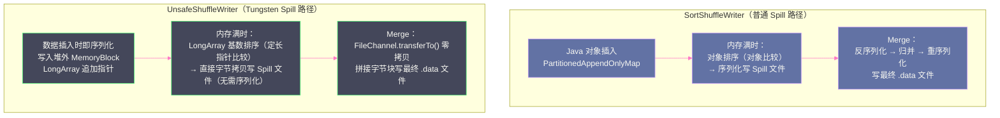

# 09 堆外内存与 Tungsten Unsafe 内存世界

## 摘要

Project Tungsten 是 Spark 历史上最深刻的底层性能重构，其核心理念是：**绕过 JVM 对象模型，直接用二进制内存操作替代 Java 对象操作**。通过 `sun.misc.Unsafe` API，Tungsten 实现了手动内存管理——堆外内存分配、紧凑的二进制行格式 `UnsafeRow`、以内存页（`MemoryBlock`）为单位的批量分配，以及基于 CPU 缓存行友好的数据布局。这套体系在 Shuffle 中的关键应用是 `UnsafeShuffleWriter`，它在序列化和排序两个最耗性能的环节做了根本性优化：数据插入时即序列化，排序时操作的是定长指针而非变长对象，从而将 Shuffle Write 的 CPU 和内存开销降低到接近 C++ 的水平。本文从 JVM 对象模型的局限出发，系统讲解 Tungsten 的内存抽象层次、`UnsafeRow` 的二进制布局，以及 `UnsafeShuffleWriter` 在内存中的完整工作流程。

---

## 第 1 章 JVM 对象模型：Tungsten 诞生的背景

### 1.1 JVM 对象的三重开销

在理解 Tungsten 的价值之前，必须先理解 JVM 对象模型对性能的影响。在 Java/Scala 中，一个普通对象在内存中的布局如下：

**开销一：对象头（Object Header）**

每个 Java 对象都有 12-16 字节的对象头，包含：
- **Mark Word**（8 字节）：存储对象的哈希码、锁状态信息、GC 年龄标记
- **Klass Word**（4 字节，开启指针压缩时）：指向类元数据（Class metadata）的指针

这意味着一个只存储一个 `int`（4 字节）的 `Integer` 对象，实际在内存中占用 12（对象头）+ 4（int 字段）+ 4（对齐填充）= **20 字节**，比原始数据大 5 倍。

**开销二：对齐填充（Alignment Padding）**

[[JVM]] 要求每个对象的大小必须是 8 字节的整数倍（64 位 JVM，开启指针压缩时）。即使对象的有效数据只有 5 字节，也会被填充到 8 字节。这种填充在大量小对象场景下造成显著的内存浪费。

**开销三：引用开销（Reference Overhead）**

Java 中的对象不能直接嵌套（不像 C++ 的结构体内嵌），只能通过引用（指针）关联。每个引用在 64 位 JVM 开启压缩指针时占 4 字节，未压缩时占 8 字节。

**实际影响**：一个 Spark `Row` 对象，假设有 5 列（1个 int，2个 long，2个 String）：
```
JVM 对象布局（使用引用）：
- Row 对象头:       16 字节
- Array 引用:        4 字节 → 指向 Object[] 数组
- Object[] 对象头:  16 字节
- Object[] 内容:    5 × 4 字节 = 20 字节 (5 个引用)
- Integer 对象:     16 字节 × 1 = 16 字节
- Long 对象:        24 字节 × 2 = 48 字节
- String 对象:      40+ 字节 × 2 = 80+ 字节
总计: 约 200+ 字节

实际数据量:
- 1 个 int:   4 字节
- 2 个 long: 16 字节
- 2 个 String (各 10 字符): 40 字节
实际数据:    60 字节

内存放大倍数: 200 / 60 ≈ 3.3 倍
```

这种内存放大在处理数亿行数据时，意味着需要 3 倍多的物理内存，同时 GC 需要追踪数亿个对象节点，GC 停顿时间急剧增加。

### 1.2 GC 是 Spark 性能的隐形杀手

GC 对 Spark 性能的影响是系统性的：

**影响一：GC 停顿直接延迟 Task 执行**

[[JVM GC]] 的 Stop-The-World（STW）停顿会暂停 Task 的所有线程。在处理大量数据的 Spark Task 中，Young GC 可能每隔几秒触发一次（每次停顿 10-100ms），Full GC 可能每隔几分钟触发（每次停顿 1-30 秒）。对于一个运行 10 分钟的 Task，GC 时间可能占总时间的 10-30%。

**影响二：GC 停顿触发 Shuffle Fetch 超时**

当 Reducer 节点上的 Executor 发生 Full GC 时，Map 端 Executor 发来的 Fetch 请求无法被处理，如果停顿超过 `spark.shuffle.io.connectionTimeout`（默认 120 秒），Fetch 请求超时，触发 FetchFailedException，整个 Stage 需要重试——这是生产中 Stage 失败最常见的原因之一。

**影响三：GC 增大内存估算误差**

第 04 篇中提到，`ExternalSorter` 通过采样估算内存使用量。GC 后内存使用量会突然降低（GC 清理了大量临时对象），导致估算值偏低，延迟 Spill 触发，使得实际内存使用量超出预期后 OOM。

### 1.3 Tungsten 的解题思路

Tungsten（2014 年 Spark 1.4 开始，全称"Project Tungsten"）的核心洞察是：

**问题根源**：Spark 把太多的时间花在了 JVM 对象管理、GC 和序列化上，而不是真正的计算上。在某些 Benchmark 中，JVM 开销占 Spark 总 CPU 时间的 70% 以上。

**解题方向**：用 C/C++ 程序员管理内存的方式来管理 Spark 的内存——手动分配、手动释放、直接操作内存字节，完全绕过 JVM 的对象系统和 GC。

Tungsten 分三个方向推进：
1. **内存管理与二进制处理**：用堆外内存替代 JVM 堆对象，引入 `UnsafeRow` 等二进制数据格式
2. **缓存友好的计算**：利用 CPU 的 L1/L2 Cache，设计缓存行对齐的数据结构
3. **代码生成（Code Generation/WSCG）**：通过运行时生成字节码，消除虚函数调用和解释器开销

本篇聚焦第一个方向——内存管理与 `UnsafeRow`，以及它在 Shuffle 中的直接应用 `UnsafeShuffleWriter`。

---

## 第 2 章 sun.misc.Unsafe：Java 的"后门 API"

### 2.1 Unsafe 是什么

`sun.misc.Unsafe`（在 Java 9+ 中改为 `jdk.internal.misc.Unsafe`）是 Java 标准库中一个非公开的、仅供 JDK 内部使用的底层 API，提供了直接操作内存的能力：

- **堆外内存分配**：`Unsafe.allocateMemory(size)` 直接向操作系统申请内存，返回内存地址（long 型指针）；`Unsafe.freeMemory(address)` 释放内存
- **任意内存读写**：`Unsafe.putLong(address, value)` 向指定地址写入 8 字节；`Unsafe.getLong(address)` 从指定地址读取 8 字节
- **对象字段偏移量**：`Unsafe.objectFieldOffset(field)` 获取对象字段在对象内存布局中的偏移量，可以绕过访问控制直接读写字段
- **CAS 操作**：`Unsafe.compareAndSwapLong()` 等原子操作，是 Java `AtomicLong` 等并发类的底层实现

Spark 通过反射获取 `Unsafe` 实例（因为它的构造函数是私有的），封装在 `org.apache.spark.unsafe.Platform` 中，屏蔽了不同 JVM 实现之间的差异。

### 2.2 Unsafe 为什么危险

`Unsafe` 的名字暗示了它的风险：

1. **不受 GC 保护**：通过 `allocateMemory()` 分配的堆外内存，GC 完全不知道它的存在。如果程序员忘记调用 `freeMemory()`，内存就会泄漏，且泄漏的内存不会在 JVM 进程结束时自动回收（实际上会，但只有在 JVM 进程退出时才能被 OS 回收）。

2. **越界访问不报错**：访问一个非法地址（已释放的内存、超出分配范围的地址），不会抛出 `ArrayIndexOutOfBoundsException`，而是直接读/写到无关内存，可能导致数据损坏或 JVM Crash（SIGSEGV）。

3. **类型安全被绕过**：可以用 `putInt()` 向只该放 `long` 的位置写入数据，JVM 不做任何检查。

尽管如此，Spark/Tungsten 接受了这些风险，因为收益（内存效率和 GC 消除）足以抵消风险——前提是代码中对内存的分配和释放有严格的会计管理（这正是 `TaskMemoryManager` 和 `MemoryConsumer` 的职责）。

> [!warning] 生产避坑
> 如果 Spark 日志中出现 `SIGSEGV` 或 `SIGBUS` 信号导致的 JVM Crash，并且 crash 发生在 Tungsten 相关的代码路径（堆栈中有 `sun.misc.Unsafe` 或 `Platform`），通常是以下原因之一：
> 1. 堆外内存在某处被重复释放（double free）
> 2. 程序 Bug 导致越界写入（buffer overflow）
> 3. 极少数情况下是硬件内存故障（ECC 纠错内存错误）
>
> 区分方式：检查是否只在特定节点上 Crash（硬件问题），还是所有节点都 Crash（代码 Bug）。

---

## 第 3 章 MemoryBlock：Tungsten 的内存抽象单元

### 3.1 MemoryBlock 是什么

`MemoryBlock` 是 Tungsten 对一块连续内存区域的抽象，类似 C 中的 `(void* ptr, size_t length)` 组合。它有两种形态：

**堆内 MemoryBlock（On-Heap）**：底层是一个 `byte[]` 数组，内存由 JVM 管理，受 GC 影响。访问时通过 `Unsafe.getByte(array, offset + BYTE_ARRAY_BASE_OFFSET)` 读写——其中 `BYTE_ARRAY_BASE_OFFSET` 是 JVM 中 byte 数组第一个元素的固定偏移量（通常是 16）。

**堆外 MemoryBlock（Off-Heap）**：底层是一个通过 `Unsafe.allocateMemory()` 分配的原始内存地址（`long` 型）。访问时通过 `Unsafe.getByte(null, address + offset)` 读写——`obj` 参数为 `null` 时，`Unsafe` 将第二个参数视为绝对地址。

`MemoryBlock` 的关键设计是**统一接口**：无论是堆内还是堆外，上层代码通过同一套 `Platform.get/put` 方法访问数据，不需要知道底层是哪种存储形式。

```java
// MemoryBlock 的核心字段（简化）
public class MemoryBlock {
    @Nullable
    public final Object obj;   // 堆内：byte[] 数组；堆外：null
    public final long offset;  // 堆内：数组内偏移；堆外：绝对地址
    private final long length; // 块大小（字节）
    
    // 创建堆外 MemoryBlock（由 Unsafe.allocateMemory() 分配）
    public static MemoryBlock fromLongArray(final long[] array) {
        return new MemoryBlock(array, Platform.LONG_ARRAY_OFFSET, array.length * 8L);
    }
}
```

### 3.2 MemoryBlock 的 Page 分配

在 `TaskMemoryManager` 中，堆外内存以固定大小的 `MemoryBlock`（Page）为单位分配，默认 64MB：

```
TaskMemoryManager
  └── pageTable: MemoryBlock[8192]   // 最多 8192 个 Page
        ├── Page 0: MemoryBlock(null, 0x7f8c000, 64MB)   // 第一个堆外 Page
        ├── Page 1: MemoryBlock(null, 0x7f8c400, 64MB)
        └── ...
```

每个 `MemoryBlock`（Page）分配后会记录在 `pageTable` 数组中，页号（Page Number）就是数组下标（0-8191）。

这个设计允许 Tungsten 用一个 64 位 `long` 编码任意一条记录的位置：

```
64 位地址编码：
┌──────────────────────┬────────────────────────────────────────────┐
│  高 13 位 (Page 号)  │  低 51 位 (Page 内字节偏移量)              │
└──────────────────────┴────────────────────────────────────────────┘
```

有了这个编码方案，`UnsafeShuffleWriter` 的 `ShuffleInMemorySorter` 只需要一个 `long[]` 数组，就能表示所有记录的位置，实现 O(n log n) 的基数排序。

---

## 第 4 章 UnsafeRow：行数据的二进制极简格式

### 4.1 传统行格式的问题

在 Tungsten 之前，Spark SQL 的行数据以 `Row`/`InternalRow` 的形式存储，每一行是一个 JVM 对象，其中每个字段是另一个 JVM 对象（`Integer`、`Long`、`String` 等）。这种设计有两个核心问题：

**问题一：内存开销巨大**，如第 1 章所分析，对象头和引用开销导致 3-5 倍的内存放大。

**问题二：每次访问都需要对象追踪**，访问一行的第 3 个字段需要：对象解引用 → 数组解引用 → 字段对象解引用，每一步都可能造成 CPU 缓存 Miss（因为对象分散在堆上不同位置）。

### 4.2 UnsafeRow 的二进制布局

`UnsafeRow` 将一行数据存储在**连续的内存字节序列**中，格式如下：

```
UnsafeRow 内存布局（N 列）：

┌─────────────────────────────────┐
│ Null Bitset                      │
│ (ceil(N/64) × 8 字节)           │  ← 每一位表示对应列是否为 null
├─────────────────────────────────┤
│ 固定长度值区域（Fixed-Length Area）│
│ 每列占 8 字节（64 位）            │  ← int/long/double 直接存值
│                                 │  ← String/Array 存偏移量+长度
├─────────────────────────────────┤
│ 可变长度值区域（Variable-Length） │
│ String 和 Array 的实际字节数据   │  ← UTF-8 编码的字符串等
└─────────────────────────────────┘
```

**Null Bitset（空值位图）**：每列对应一个 bit，bit = 1 表示该列为 null，bit = 0 表示非 null。访问任意列的 null 状态只需一次位操作（O(1)）。

**固定长度值区域**：每列固定占 8 字节（64 位）。对于 `int`、`long`、`double` 等定长类型，直接将值存入这 8 字节；对于 `String`、`Array`、`Map` 等变长类型，存储的是`(偏移量:32位, 长度:32位)` 的组合，指向可变长度值区域中的实际数据。

**可变长度值区域**：紧随固定长度区域之后，存放所有变长字段的实际字节数据，按列序顺次排列。

这个布局的精妙之处：
- 访问固定长度列（`int`、`long`）：`base + 8*(columnIndex) + nullBitsetSize`——一次计算，直接读取，**O(1) 且缓存友好**
- 访问变长列（`String`）：读固定区域的 `(offset, length)` → 再读 `base + offset` 处的数据——**两次访问，但都在连续内存中**
- 整行数据是一块连续字节，可以直接 `memcpy` 到磁盘或网络缓冲区，**无需序列化**

### 4.3 与传统 Row 的对比

| 维度 | 传统 Java/Scala Row | UnsafeRow |
|------|-------------------|-----------|
| **存储形式** | JVM 对象树（分散的堆对象） | 连续字节序列（一块内存） |
| **每列访问** | 多次对象解引用，可能多次 Cache Miss | 计算内存偏移量，直接读取，Cache 友好 |
| **内存开销** | 3-5 倍放大（对象头 + 引用） | 接近原始数据大小（轻微对齐开销） |
| **null 判断** | `if (obj == null)` | 位操作：`(nullBitset >> columnIndex) & 1` |
| **序列化** | 需要递归序列化每个字段对象 | 直接 `memcpy`，无需序列化 |
| **GC 影响** | 每个字段对象都是 GC Root，GC 负担重 | 堆外存储时完全不受 GC 影响 |
| **适用场景** | 用户代码（RDD API） | SQL 引擎内部（DataFrame/Dataset） |

> [!info] 核心概念
> `UnsafeRow` 的"Unsafe"来自它底层使用 `sun.misc.Unsafe` 直接操作内存。当你在 Spark SQL 中使用 DataFrame/Dataset API 时，所有 SQL 算子（Filter、Project、Join、Aggregate 等）在内部操作的都是 `UnsafeRow`，而不是普通的 `Row` 对象。这是 DataFrame 比 RDD 快的核心原因之一——不仅有 Catalyst 优化器的查询重写，还有 Tungsten 带来的内存和 CPU 效率提升。只有在调用 `collect()`、`map()` 等触发用户代码执行的地方，`UnsafeRow` 才会被反序列化为用户可见的 `Row` 对象。

---

## 第 5 章 UnsafeShuffleWriter：Shuffle 中的 Tungsten 实践

### 5.1 UnsafeShuffleWriter 的适用条件

`UnsafeShuffleWriter` 是 Sort Shuffle 中专门为 Tungsten 设计的 Writer，其使用条件（第 03 篇已提及）：

1. 没有 Map 端聚合（`mapSideCombine = false`）——因为 `UnsafeShuffleWriter` 存储的是序列化字节，不支持在内存中对相同 key 做聚合
2. 序列化器支持重定向（`serializer.supportsRelocationOfSerializedObjects = true`）——即序列化后的字节可以被移动，移动后仍然合法（Kryo 和 Java 序列化都满足）
3. 分区数不超过 `MAX_SHUFFLE_OUTPUT_PARTITIONS_FOR_SERIALIZED_SORT`（16,777,216）

满足这三个条件时，Spark 自动选择 `UnsafeShuffleWriter`，性能优于 `SortShuffleWriter`。

### 5.2 ShuffleInMemorySorter：核心排序结构

`UnsafeShuffleWriter` 的内存数据结构是 `ShuffleInMemorySorter`，它的核心是一个 `LongArray`（堆外内存中的 `long[]` 数组）。

**数据插入流程**：

1. 对每条输入记录 `(key, value)` 进行序列化，将序列化字节写入当前的 `MemoryBlock`（Page）中
2. 在 `LongArray` 中追加一条 64 位记录指针：高 24 位存 `partitionId`，低 40 位存该记录在 Page 中的地址编码

```
LongArray 中每个元素的编码：
┌──────────────────────────┬────────────────────────────────────────┐
│  高 24 位 (partitionId)  │  低 40 位 (Page 内记录地址)            │
└──────────────────────────┴────────────────────────────────────────┘
```

这样，`LongArray` 中的每个 `long` 值就是一个指向序列化记录的"标记指针"，包含了 partitionId 信息（用于排序）和记录位置（用于定位实际数据）。

**内存布局示意**：

```
Page 0 (MemoryBlock, 64MB)：
┌─────────────────────────────────────────────┐
│ 记录 0 的序列化字节 [长度:4B][数据:NB]         │
│ 记录 1 的序列化字节 [长度:4B][数据:NB]         │
│ 记录 2 的序列化字节 [长度:4B][数据:NB]         │
│ ...                                         │
└─────────────────────────────────────────────┘

LongArray（排序数组）：
┌─────────────────────┬──────────────────────┐
│ (partId=2, addr=P0) │ (partId=0, addr=P0+offset1) │
│ (partId=1, addr=P0+offset2) │ ...          │
└──────────────────────────────────────────────┘
```

### 5.3 基数排序：比较排序的高效替代

`ShuffleInMemorySorter` 使用**基数排序（Radix Sort）**而非比较排序（如快排）对 `LongArray` 排序。

**为什么用基数排序？**

比较排序（快排、归并排序）的复杂度是 O(n log n)。对于 n = 1,000,000 条记录，O(n log n) ≈ 2,000,000 次比较。

基数排序的复杂度是 O(n × k)，其中 k 是"排序键的位数"。`LongArray` 中每个元素的排序键是高 24 位的 `partitionId`（最多 16M 分区），基数排序只需扫描 24 位，每次处理 8 位（按字节），共 3 轮扫描。

对于 n = 1,000,000：
- 比较排序：约 2,000,000 次比较 + 随机访问
- 基数排序：3 次 O(n) 的线性扫描，每次扫描访问连续内存

基数排序的另一个优势是**缓存友好**：每轮扫描都是对 `LongArray` 的线性遍历，CPU 预取器可以有效预取下一个 cache line，几乎没有 Cache Miss。而比较排序的随机访问模式在大数组上会造成大量 L2/L3 Cache Miss。

在 Spark 的 Benchmark 中，对 1 亿条记录的 `LongArray` 做基数排序，比快排快约 **3 倍**。

### 5.4 Spill 时的效率优势

`UnsafeShuffleWriter` 的 Spill 与 `SortShuffleWriter` 有本质不同：

**`SortShuffleWriter`（普通模式）**：
1. 对 `PartitionedAppendOnlyMap`/`PartitionedPairBuffer` 排序
2. **反序列化**当前内存中的 Java 对象（因为 `AppendOnlyMap` 存的是原始对象）
3. 序列化成字节写入 Spill 文件

**`UnsafeShuffleWriter`（Tungsten 模式）**：
1. 对 `LongArray` 按 partitionId 基数排序（操作的是定长 long 指针，比对象排序快得多）
2. 遍历排序后的 `LongArray`，通过地址编码找到 Page 中的序列化字节
3. **直接将序列化字节拷贝到 Spill 文件**（无需序列化，数据插入时已序列化）

关键优势：**Spill 时没有序列化开销**。序列化是 Shuffle 中 CPU 开销最大的操作之一，`UnsafeShuffleWriter` 通过"插入时序列化"将这个开销分散到数据写入阶段，Spill 时只需字节拷贝（`memcpy`），速度接近内存带宽上限。

### 5.5 Merge 阶段的零拷贝合并

Merge 阶段（`UnsafeShuffleWriter.mergeSpills()`）同样有 Tungsten 的效率优化：

对于每个分区 j，将所有 Spill 文件中分区 j 的数据块顺次拼接到最终 `.data` 文件中。这个拼接不需要反序列化，直接通过 `FileChannel.transferTo()` 实现**零拷贝（Zero-Copy）**文件合并：

```
transferTo() 的工作原理：
  数据从 Spill 文件 → OS 页缓存 → 最终 .data 文件
  全程在内核态完成，不需要将数据拷贝到用户态（JVM 堆）
  避免了 JVM 堆内存的额外占用，也避免了用户态/内核态的上下文切换
```

与 `SortShuffleWriter` 的 Merge（需要反序列化 → 可选聚合 → 重新序列化）相比，`UnsafeShuffleWriter` 的 Merge 代价极低——本质上只是文件的字节级别拼接，CPU 开销接近零，瓶颈纯粹是磁盘 I/O 带宽。



---

## 第 6 章 Tungsten 在 Shuffle 中的综合收益

### 6.1 性能提升的量化

根据 Databricks 2015 年发布的 Project Tungsten 博客和后续 Benchmark：

| 操作 | 普通模式 | Tungsten 模式 | 提升幅度 |
|------|---------|--------------|---------|
| **内存占用（相同数据集）** | 基准 | 约 50-70% | 减少 30-50% |
| **排序速度（100M 记录）** | 基准 | 约 3-5x | 提升 3-5 倍 |
| **Spill 写入速度** | 基准 | 约 2-3x | 提升 2-3 倍 |
| **Merge 速度** | 基准 | 约 5-10x | 提升 5-10 倍（零拷贝 vs 反序列化+重序列化） |
| **GC 时间** | 基准 | 接近 0（堆外） | 减少 90%+ |

### 6.2 使用 UnsafeShuffleWriter 的配置要点

`UnsafeShuffleWriter` 的选择是自动的（满足条件时 Spark 自动选用），但有几个配置影响其效果：

**序列化器选择**（必须配置）：
```
spark.serializer=org.apache.spark.serializer.KryoSerializer
```
Java 序列化也支持 `UnsafeShuffleWriter`（满足 `supportsRelocationOfSerializedObjects`），但 Kryo 的序列化速度和紧凑性更好，效果更优。

**堆外内存启用**（推荐配置）：
```
spark.memory.offHeap.enabled=true
spark.memory.offHeap.size=4g
```
`UnsafeShuffleWriter` 的 `MemoryBlock`（Page）默认在堆内分配（`byte[]` 数组）。启用堆外内存后，Page 分配在堆外，彻底消除 Page 数据对 GC 的影响。

**Page 大小调整**：
```
spark.buffer.pageSize=64m  # 默认 64MB，通常不需要修改
```
Page 过小导致 Page 数量过多，管理开销增大；Page 过大在内存紧张时分配失败概率增加。64MB 是经过 Databricks 生产验证的合理默认值。

### 6.3 边界案例：UnsafeShuffleWriter 不适用的情况

`UnsafeShuffleWriter` 有明确的不适用场景：

**不适用一：需要 Map 端聚合**

`reduceByKey`、`aggregateByKey` 等算子需要在 Map 端对相同 key 合并，而 `UnsafeShuffleWriter` 存储的是序列化字节，无法在不反序列化的情况下合并两个值。此时强制使用 `SortShuffleWriter`（利用 `PartitionedAppendOnlyMap`）。

**不适用二：分区数极多（>16M）**

`LongArray` 中每条记录用 24 位存 partitionId，最多支持 2^24 = 16,777,216 个分区。超过这个限制时，退回 `SortShuffleWriter`。实践中，分区数超过 10 万已经很少见，这个限制几乎不触发。

**不适用三：自定义序列化器不支持对象重定位**

某些自定义序列化器在序列化时在字节流中嵌入了绝对地址（如指针），这样的序列化结果不能被移动（移动后绝对地址失效）。此时 `supportsRelocationOfSerializedObjects = false`，退回 `SortShuffleWriter`。标准的 Kryo 和 Java 序列化都是位置无关的，满足条件。

---

## 第 7 章 Tungsten 的局限与 Java 21 的新格局

### 7.1 Tungsten 的维护成本

Tungsten 的代价是显著增加了代码复杂度：

- `sun.misc.Unsafe` 是非公开 API，在不同 JVM 版本中行为可能有细微差异
- Java 9 模块系统（JPMS）默认禁止访问 JDK 内部 API（包括 `Unsafe`），Spark 需要通过 `--add-opens` JVM 参数绕过这个限制
- 堆外内存的手动管理需要严格的生命周期会计，一旦出错（内存泄漏、double free），排查成本极高

### 7.2 Java 21 的 Vector API 与 Panama 项目

Java 的 [[Panama 项目]]（JEP 442 等）正在提供官方的堆外内存 API（`MemorySegment`、`Arena`）和 SIMD 向量化 API（`VectorAPI`），这些将是 `sun.misc.Unsafe` 的合法替代：

- `MemorySegment`：官方的堆外内存分配和访问 API，与 Unsafe 相比更安全（有边界检查选项）
- `VectorAPI`：允许 Java 程序利用 CPU 的 SIMD 指令并行处理多个数据

未来的 Spark 版本可能逐步迁移到这些官方 API，在保持 Tungsten 性能优势的同时，摆脱对 `sun.misc.Unsafe` 的依赖。

> [!note] 设计哲学
> Tungsten 的本质是："在 JVM 生态内，用 C 的方式管理内存"。这是一个不得已而为之的设计——如果 JVM 本身的 GC 和对象模型足够高效，就不需要 Tungsten 这样的"绕过层"。未来 Java 的改进（Panama、Valhalla 中的值类型等）有望从语言层面解决这些问题，使 Spark 的代码可以恢复到更简洁、更符合 JVM 惯例的实现方式。

---

## 小结

Tungsten 项目从 JVM 对象模型的根本局限出发，用三个关键工具重塑了 Spark 的内存效率：

- **`sun.misc.Unsafe`**：JVM 的"后门"，允许直接分配和操作堆外内存，完全绕过 GC
- **`MemoryBlock`**：堆内/堆外内存的统一抽象，以 Page 为单位管理，配合 64 位地址编码支持高效的内存寻址
- **`UnsafeRow`**：二进制行格式，Null Bitset + 固定区域 + 可变区域的三段结构，缓存友好，可 `memcpy` 直接传输
- **`UnsafeShuffleWriter`**：Tungsten 在 Shuffle 中的落地——插入即序列化、`LongArray` 基数排序、Spill 时字节拷贝、Merge 时零拷贝，在 CPU 和 I/O 两个维度都大幅优于普通 `SortShuffleWriter`

理解 Tungsten 不仅是理解 Spark 性能的关键，也是理解现代大数据计算引擎在"应用层内存管理"这条道路上走了多远、付出了多少代价的一个窗口。

第 10 篇将综合前九篇的所有知识，提供一份系统性的生产调优手册——从 Executor 内存配置到 Shuffle 参数，从 Spill 防治到数据倾斜应对，给出可以直接落地的调优策略。

---

## 参考资料

- [Project Tungsten: Bringing Apache Spark Closer to Bare Metal](https://databricks.com/blog/2015/04/28/project-tungsten-bringing-spark-closer-to-bare-metal.html)
- [Project Tungsten On Spark - 内存设计](https://blog.csdn.net/qq_28680977/article/details/109960303)
- [Spark UnsafeRow 解析](https://blog.csdn.net/zhixingheyi_tian/article/details/124322109)
- Apache Spark 源码：`org.apache.spark.unsafe.memory.MemoryBlock`
- Apache Spark 源码：`org.apache.spark.sql.catalyst.expressions.UnsafeRow`
- Apache Spark 源码：`org.apache.spark.shuffle.sort.UnsafeShuffleWriter`
- Apache Spark 源码：`org.apache.spark.shuffle.sort.ShuffleInMemorySorter`
