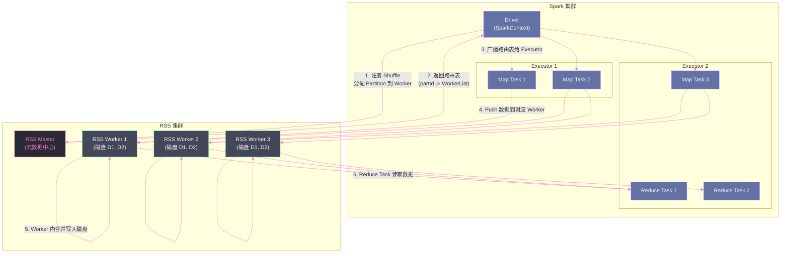

# 11 Remote Shuffle Service：解耦计算与 Shuffle 存储

## 摘要

传统的 Sort Shuffle 将 Shuffle 数据写在 Executor 所在节点的本地磁盘上，形成了"计算节点即存储节点"的强耦合架构。这个设计在规模化场景下暴露出三类核心矛盾：本地磁盘成为资源瓶颈、Executor 生命周期影响 Shuffle 数据可用性、容器化/云原生部署下本地磁盘难以高效利用。Remote Shuffle Service（RSS）将 Shuffle 的写入与读取职责从 Executor 中剥离，交由独立的集中式服务处理，实现计算与中间存储的解耦。本文系统讲解 RSS 出现的动因、Push-based Shuffle 的核心工作原理、业界主流方案（Apache Celeborn、Uber RSS、LinkedIn Magnet）的架构对比，以及在生产中引入 RSS 的收益、代价与适用边界。

---

## 第 1 章 传统 Shuffle 的三类瓶颈

### 1.1 本地磁盘：计算节点的"隐藏债务"

Sort Shuffle 的工作模式是：Map Task 将 Shuffle 数据写到 Executor 所在节点的本地磁盘（`spark.local.dir`），Reduce Task 通过网络从这些节点拉取数据。这个设计的隐含前提是：**每个计算节点都有足够的本地磁盘容量和 I/O 能力**。

在小规模集群（几十台节点，每节点 1TB+ 本地 SSD）时，这个前提通常成立。但随着集群规模扩大、业务数据量增长，以下问题开始凸显：

**问题一：本地磁盘容量不均衡**

某些节点上运行了大量写 Shuffle 数据的 Task（宽依赖算子），而另一些节点几乎没有写入。本地磁盘容量分配与计算负载不匹配，个别节点磁盘打满，导致整个作业挂起。

**问题二：本地磁盘 I/O 竞争**

同一节点上同时运行多个 Executor（或一个 Executor 的多个并发 Task），这些 Task 同时向本地磁盘写 Shuffle 数据，磁盘 I/O 带宽被多个并发写争抢，实际写入速度远低于磁盘标称带宽。在机械硬盘节点上，大量随机写更会让问题恶化。

**问题三：磁盘故障率随规模线性增长**

一个 1000 节点的集群，假设每块磁盘的年故障率是 1%，那么每年预期磁盘故障数 = 1000 × 磁盘数/节点 × 1%，很可能每天都有磁盘故障。磁盘故障导致该节点上所有 Map Task 的 Shuffle 文件丢失，触发大量 Stage 重算，作业延迟急剧增加。

### 1.2 Executor 生命周期与 Shuffle 数据可用性的耦合

在标准 Sort Shuffle 中，Shuffle 文件由 Map Task 写出并留在 Executor 进程所在节点。如果这个 Executor 因为任何原因（OOM、GC 超时被 YARN Kill、节点宕机）而退出，其上的所有 Shuffle 文件都面临不可访问的风险。

尽管 `ExternalShuffleService`（ESS）通过在节点上独立运行的守护进程来服务 Shuffle 文件，将文件可用性与 Executor 生命周期解耦，但 ESS 本身仍然依赖节点本地磁盘，无法解决磁盘容量不均衡和大规模故障的问题。

### 1.3 云原生与容器化环境的挑战

在 [[Kubernetes]] 上运行 Spark（Spark on K8s）已经成为大量互联网公司的标准部署方式。K8s 的 Pod 是临时性的、无状态的——Pod 可以在任意节点调度，随时被驱逐重新调度到另一个节点。

这与传统 Shuffle 的"本地磁盘"假设直接冲突：

- Pod 被驱逐后，本地磁盘数据丢失（除非挂载 PersistentVolume，但这会大幅增加调度复杂性）
- 动态伸缩（Scale In/Out）时，缩容的节点上可能有未被读取完的 Shuffle 数据
- 远程存储（如 S3、HDFS）延迟比本地磁盘高 10-100 倍，直接用远程存储替代本地磁盘代价极高

这三类矛盾共同指向一个方向：**Shuffle 中间数据需要一个专门的、独立于计算节点的存储服务**——这正是 RSS 的定位。

---

## 第 2 章 RSS 的核心设计：Push-based Shuffle

### 2.1 Pull-based vs Push-based：两种数据流向

理解 RSS 的关键是理解它与传统 Pull-based Shuffle 的根本差异。

**传统 Pull-based Shuffle（Sort Shuffle）**：
1. Map Task 将所有 Reduce 分区的数据写入本地磁盘（一个 `.data` 文件 + 一个 `.index` 文件）
2. Reduce Task 从各个 Map 节点主动**拉取（Pull）**属于自己分区的数据
3. 网络连接数 = M（Map 节点数）× R（Reduce Task 数）

**Push-based Shuffle（RSS）**：
1. Map Task 将数据**推送（Push）**到 RSS 集群的多个 Worker 节点
2. RSS Worker 接收并聚合来自多个 Map Task 的数据，按 Reduce 分区写入
3. Reduce Task 从 RSS Worker 读取已聚合好的数据

Push-based 的关键优势在于：**Map Task 的写出和 Reduce Task 的读取在 RSS 侧都是顺序 I/O**，而非 Pull-based 的随机 I/O（每个 Reduce 对应每个 Map 文件中的一段随机区间）。

顺序 I/O 比随机 I/O 快 10-100 倍（HDD 上差距更大），这是 RSS 的核心性能来源。

### 2.2 RSS 的整体架构

以 Apache Celeborn（原阿里巴巴 RSS 项目）为例，RSS 的整体架构如下：



**RSS Master（元数据中心）**：
- 管理所有 RSS Worker 的注册与健康状态
- 接受 Spark Driver 的 Shuffle 注册请求，根据 Worker 负载分配每个 Partition 由哪些 Worker 负责
- 维护 Partition → Worker 的路由表，供 Map/Reduce Task 查询

**RSS Worker（数据节点）**：
- 接收 Map Task 推送的序列化数据，按 (ShuffleId, PartitionId) 缓存在内存缓冲区
- 当缓冲区达到阈值（默认 256MB 一个文件），将缓冲区数据批量顺序写入磁盘
- 为 Reduce Task 提供数据读取服务

**Spark 侧的适配层**：
- 替换 Spark 默认的 `ShuffleManager`（`org.apache.spark.shuffle.CelebornShuffleManager`）
- Map Task 的写出逻辑变为：序列化数据 → 批量推送到 RSS Worker（通过 Netty）
- Reduce Task 的读取逻辑变为：从 RSS Worker 拉取对应 Partition 的数据

### 2.3 Push 过程的细节：数据如何从 Map 到 Worker

Map Task 不是逐条推送数据，而是以 **Batch（批）** 为单位：

1. Map Task 在本地内存中维护一个按 PartitionId 分组的缓冲区（`PushBuffer`）
2. 当缓冲区达到一定大小（如 64KB）或者 Task 即将结束时，将缓冲区中的数据批量推送到对应的 RSS Worker
3. 推送使用 Netty 异步 I/O，Map Task 不需要等待 Worker 确认即可继续处理下一条记录（通过信用量/流控机制避免压垮 Worker）
4. Worker 收到推送数据后，将数据按 PartitionId 聚合写入内存缓冲区，积累到一定量后顺序写入磁盘

这个 Push 过程的关键设计是**流式写出**——Map Task 不需要等所有数据处理完再写出（类似于 Bypass Shuffle），而是边处理边 Push，减少了 Map Task 的内存峰值需求。

> [!info] 核心概念
> RSS 的 Push-based 模式在 Worker 侧实现了"写时合并"——来自多个 Map Task 的同一 Partition 数据在 Worker 上被聚合写入同一个文件。Reduce Task 读取时，只需要从少数几个 Worker 顺序读取，而不需要从所有 M 个 Map 节点各读一段。这将 Reduce 阶段的 I/O 模式从"M 路小随机读"转变为"少数几路大顺序读"，这是 RSS 在 Reduce 侧的核心性能提升。

---

## 第 3 章 业界主流 RSS 方案对比

### 3.1 方案全景

自 2018 年以来，各大互联网公司先后开发了自己的 RSS 方案，并陆续开源：

| 方案 | 来源公司 | 开源时间 | 当前状态 |
|------|---------|---------|---------|
| **Apache Celeborn** | 阿里巴巴 | 2022 年进入 Apache 孵化 | Apache 顶级项目（2024年） |
| **Apache Uniffle** | 腾讯 | 2021 年开源 | Apache 顶级项目 |
| **Uber RSS** | Uber | 2020 年开源 | GitHub 维护 |
| **LinkedIn Magnet** | LinkedIn | 2021 年（贡献给 Spark 社区） | 已合入 Spark 3.2+ |
| **Riffle** | Facebook | 内部使用，部分思想开源 | 未全面开源 |

### 3.2 Apache Celeborn：推式写入的集大成者

**架构特点**：

Celeborn 的设计哲学是**最大化写入吞吐量**。核心手段是：

- **分级写入**：数据首先写入 RSS Worker 的**堆外内存**（Off-Heap Buffer），当内存缓冲区满时，批量顺序写到磁盘。这与 Spark Executor 的 Spill 机制类似，但因为 Worker 专门服务 Shuffle 写入（不干其他事），内存可以全部用于缓冲，写入效率极高
- **自适应副本**：每个 Partition 可以配置写入多个 Worker（默认副本数为 1，可配置为 2）。当一个 Worker 写入失败时，自动切换到副本 Worker，提高可靠性
- **流控（Backpressure）**：基于信用量（Credit）的流控协议，防止 Map Task 推送速度超过 Worker 处理速度，避免 Worker 内存被压垮

**与 Spark 集成方式**：

```xml
<!-- spark-defaults.conf -->
spark.shuffle.manager=org.apache.celeborn.client.spark.CelebornShuffleManager
spark.celeborn.master.endpoints=rss-master1:9097,rss-master2:9097
spark.celeborn.storage.hdfs.dir=hdfs://nameservice/celeborn  <!-- 可选：HDFS 冷存储 -->
```

**性能数据（Celeborn 官方 Benchmark）**：
- TPC-DS 100 Scale：比 ESS Shuffle 快 **30%**
- 大规模数据倾斜场景：快 **2-3 倍**（因为 Worker 侧合并消除了热点节点的磁盘 I/O 竞争）
- 稳定性：在 Executor 频繁 Preemption 的场景（Spot 实例）下，Shuffle 成功率提升显著

### 3.3 LinkedIn Magnet：与 Spark 深度集成的保守派

LinkedIn Magnet 的设计目标更为保守：**在最小改动 Spark 核心代码的前提下，通过 ESS 扩展实现 Push-based Shuffle**。

**架构特点**：

Magnet 保留了传统 Sort Shuffle 的写出格式（`.data` + `.index`），在此基础上增加了 Push 阶段：

1. Map Task 写出本地 `.data` 文件（与原始 Sort Shuffle 相同）
2. 额外启动一个后台线程，将 `.data` 文件中各分区的数据按分区推送到远程的 ESS 节点
3. ESS 节点将接收到的数据合并写入"Merged"文件
4. Reduce Task 优先从"Merged"文件读取（顺序读，更快），如果 Merged 文件不完整（Push 失败），回退到从原始 Map 节点 Pull

这个"写两份，读合并"的设计保证了**向后兼容和失败回退**——即使 Push 阶段完全失败，作业仍然可以通过传统 Pull-based 方式完成，只是少了性能提升。

Magnet 已作为 `spark.shuffle.push.enabled=true` 合入 Spark 3.2，是目前 Spark 生态中唯一官方支持的 RSS 方案。

**Magnet 的局限**：
- 仍然依赖本地磁盘（先写本地再 Push），无法完全解决磁盘容量问题
- 额外的 Push 阶段增加了网络开销（所有数据被传输两次：写本地 + Push 到 ESS）
- 在磁盘非常紧张的场景下效果有限

### 3.4 Apache Uniffle：通用性第一的多框架支持

Uniffle（腾讯）的设计目标是**跨框架通用**——同一套 RSS 服务同时支持 Spark、Flink、MapReduce，各框架通过不同的 Client 库接入。

**架构特点**：

- 支持多种存储后端：本地磁盘（高性能，临时存储）、HDFS（高可靠，冷数据）、对象存储（S3/OSS）
- 分层存储：数据先写到 RSS Worker 本地磁盘（热存储），超过保留时间后自动 Tier 到 HDFS/S3（冷存储）
- Coordinator 节点（类似 Celeborn 的 Master）负责 Worker 管理和流量均衡

Uniffle 的多框架支持特性使其特别适合"Spark + Flink 混合部署"的大数据平台，只需维护一套 RSS 集群。

### 3.5 三方案核心差异对比

| 维度 | Apache Celeborn | LinkedIn Magnet | Apache Uniffle |
|------|----------------|-----------------|----------------|
| **Shuffle 模式** | 纯 Push（无本地写） | Push + 本地写（双写） | 纯 Push（无本地写） |
| **失败回退** | 有（副本机制） | 有（回退 Pull-based） | 有（副本机制） |
| **与 Spark 集成** | 替换 ShuffleManager | 原生支持（3.2+） | 替换 ShuffleManager |
| **多框架支持** | Spark、Flink | 仅 Spark | Spark、Flink、MR |
| **存储后端** | 本地磁盘（+可选 HDFS） | 本地磁盘 | 本地磁盘+HDFS+S3 |
| **生产成熟度** | 高（阿里双 11 验证） | 中（LinkedIn 内部） | 高（腾讯大规模验证） |
| **社区活跃度** | Apache 顶级项目，活跃 | 已并入 Spark，维护中 | Apache 顶级项目，活跃 |

---

## 第 4 章 RSS 的性能本质与代价

### 4.1 为什么 RSS 更快：四个维度

**维度一：Write 侧 I/O 模式改善**

传统 Sort Shuffle：Map Task 写出 `.data` 文件，写入模式是顺序写（好），但文件数 = M，本地磁盘并发 I/O 高。

RSS（以 Celeborn 为例）：Map Task Push 数据到 Worker，Worker 将多个 Map 的数据追加写入同一个文件（按 PartitionId），写入依然是顺序写，但 I/O 分散到多个 Worker 节点，**单节点磁盘 I/O 压力大幅降低**。

**维度二：Read 侧 I/O 模式改善**

传统 Sort Shuffle：Reduce Task 从 M 个 Map 节点各读一段（M 次网络连接 + M 次小随机读），网络连接数 = M × R 量级（M=Map 数，R=Reduce 数）。

RSS：Reduce Task 只需从少数几个 Worker 节点顺序读取（Worker 侧已按 Partition 合并），网络连接数大幅减少，读 I/O 变为顺序大块读。

**维度三：本地磁盘压力解除**

Executor 节点的本地磁盘不再需要存储 Shuffle 数据，完全释放给 OS [[Page Cache]] 和 Spill 文件使用。磁盘 I/O 竞争消失，Task 的计算性能（非 Shuffle 部分）也得到提升。

**维度四：避免 Shuffle Fetch 触发 Stage 重算**

RSS 集群独立于 Executor，Executor 崩溃不影响 RSS Worker 上的 Shuffle 数据。Reduce Task 可以从 RSS 读取即使对应的 Map Executor 已经死亡。这减少了因 FetchFailedException 触发的 Stage 重算，直接提升端到端作业稳定性。

### 4.2 RSS 的代价

RSS 不是免费的，引入它需要接受以下代价：

**代价一：额外的网络 I/O（双向传输）**

Map Task 需要将数据通过网络传输到 RSS Worker（传输一次），Reduce Task 再从 RSS Worker 读取（传输第二次）。传统 Shuffle 中 Map 写本地磁盘是零网络开销。

因此，对于**网络带宽紧张**的集群，RSS 可能不会带来性能提升，甚至可能更慢。RSS 适合磁盘 I/O 是瓶颈、但网络带宽充足的集群（云上场景，网络通常比磁盘充裕得多）。

**代价二：RSS 集群的运维成本**

需要额外部署、监控、运维一套 RSS 集群（Master + Worker 节点），增加了基础设施复杂度。Master 的高可用需要额外配置（通常是主备或多 Master Raft 选举）。

**代价三：延迟可能增加（轻量级作业）**

对于数据量小、Shuffle 数据可以完全在 Executor 内存中处理的作业，RSS 的额外网络 RTT 和序列化开销可能导致延迟反而高于传统 Sort Shuffle。RSS 的优势主要体现在**大数据量**场景（单 Shuffle 超过数百 GB）。

**代价四：数据一致性复杂度**

RSS 必须处理 Map Task 重试（同一 Partition 可能被两个 Task 写两次）、Worker 故障（部分数据未持久化）等复杂场景，需要在 Master 侧维护幂等性和数据完整性，实现难度高于本地磁盘写入。

---

## 第 5 章 RSS 的适用场景与决策框架

### 5.1 什么情况应该引入 RSS

以下场景是 RSS 的"甜蜜区"，引入收益最大：

**场景一：Shuffle 数据量大（单 Stage > 500GB）**

当单个 Shuffle Stage 的写出数据量超过几百 GB 时，本地磁盘容量和 I/O 带宽往往成为真实瓶颈，RSS 的分散化存储和合并读取优势最为突出。

**场景二：Spark on Kubernetes（无可靠本地磁盘）**

K8s Pod 的本地存储是临时性的，容器重启即丢失。RSS 提供了一个持久化的、独立于 Pod 生命周期的 Shuffle 存储，是 Spark on K8s 的最佳搭配。

**场景三：使用 Spot/Preemptible 实例（Executor 经常被抢占）**

云厂商的竞价实例成本低但不稳定，Executor 随时可能被终止。传统 Shuffle 下，Executor 被 Kill 导致 Stage 重算，严重时作业无法完成。RSS 将 Shuffle 数据持久化到独立服务，Executor 被 Kill 不影响已写出的 Shuffle 数据，大幅提升 Spot 实例场景下的作业稳定性。

**场景四：大量作业共享集群（Shuffle 磁盘争抢严重）**

在多租户集群中，不同用户的作业同时进行 Shuffle，本地磁盘被多个作业共同竞争。RSS 将 Shuffle I/O 集中到专用的 Worker 节点，隔离了不同作业之间的磁盘 I/O 竞争。

### 5.2 什么情况不适合引入 RSS

- **数据量较小（< 100GB Shuffle）**：网络开销和 RSS 调用开销可能超过收益
- **网络带宽是瓶颈**（而不是磁盘）：RSS 增加了网络传输量，网络受限集群雪上加霜
- **本地磁盘性能已经很好**（如 NVMe SSD RAID）：优化空间有限，引入 RSS 的运维成本难以摊薄
- **团队没有能力运维额外的基础设施**：RSS 集群的稳定性直接影响所有依赖它的 Spark 作业

### 5.3 引入 RSS 的渐进式策略

不建议直接将所有 Spark 作业切换到 RSS，而是渐进式验证：

**第一步**：选择一批 Shuffle 数据量大（> 1TB）、经常因 Shuffle 失败而重算的大型作业，作为"试点"切换到 RSS，对比切换前后的作业完成时间和稳定性

**第二步**：在 Spark 配置中增加 RSS 路由规则，按数据量阈值自动决定是否使用 RSS：
```
# 可以在 Driver 侧通过自定义 ShuffleManager 工厂来实现路由
# 例如：数据量 < 10GB 用原生 Sort Shuffle，>= 10GB 用 RSS
```

**第三步**：全量切换所有大数据量作业，保留传统 Sort Shuffle 作为回退选项（Magnet 的双写模式内置了这个回退能力）

> [!note] 设计哲学
> RSS 的出现代表了大数据架构从"存算一体"向"存算分离"演进的趋势。这与云数据仓库（如 Snowflake、Databricks Delta Lake）的核心理念一致——计算和存储独立扩展、独立定价、独立演进。Shuffle 数据是大数据计算中最"重"的中间态，将它从计算节点剥离，是大数据架构云原生化的关键一步。

---

## 第 6 章 在生产中使用 Apache Celeborn 的实践要点

### 6.1 集群规划

RSS Worker 节点的关键参数：

**内存**：RSS Worker 使用内存缓冲 Map Task Push 来的数据，内存越大，缓冲区越大，批量写磁盘的频率越低，写 I/O 效率越高。生产建议每个 Worker 配置 **32GB-128GB 内存**，其中 60-80% 用于 Celeborn 数据缓冲。

**磁盘**：推荐使用 **NVMe SSD**，每个 Worker 挂载 4-8 块磁盘，配置多目录（Celeborn 自动并行利用多块磁盘）。每块 Worker 磁盘容量建议 = (并发 Spark 作业数 × 平均单作业 Shuffle 数据量) / Worker 数 × 1.5（安全系数）。

**网络**：RSS Worker 是网络密集型节点，建议配置 **25Gbps 或 100Gbps** 网卡（与 Spark Executor 节点同一网段，低延迟）。

**规模建议**（中等规模集群）：
- 1000 核 / 5TB 内存 Spark 集群 → 建议 20-30 个 RSS Worker 节点（每节点 128GB 内存，4 × 1.9TB NVMe SSD）

### 6.2 关键配置参数

```properties
# Spark 侧配置
spark.shuffle.manager=org.apache.celeborn.client.spark.CelebornShuffleManager
spark.celeborn.master.endpoints=master1:9097,master2:9097,master3:9097

# Push 批大小：较大的 batch 减少网络往返次数
spark.celeborn.client.push.buffer.initial.size=64k
spark.celeborn.client.push.buffer.max.size=256k

# 最大并发 Push 线程数（每个 Executor）
spark.celeborn.client.push.maxReqs=32

# 副本数（0=无副本，1=写两份，生产建议1）
spark.celeborn.storage.replica=1

# Worker 侧内存分配（Worker 配置文件）
celeborn.worker.directMemoryRatioForReadBuffer=0.1
celeborn.worker.directMemoryRatioToResume=0.5
celeborn.worker.directMemoryRatioForShuffleStorage=0.6
```

### 6.3 监控与告警

RSS Worker 的关键监控指标：

| 指标 | 含义 | 告警阈值 |
|------|------|---------|
| **push_data_latency_p99** | P99 Push 延迟（ms） | > 200ms |
| **disk_usage_ratio** | 磁盘使用率 | > 85% |
| **direct_memory_usage_ratio** | 堆外内存使用率 | > 90% |
| **fetch_chunk_latency_p99** | P99 Read 延迟（ms） | > 500ms |
| **connection_count** | 当前连接数 | 接近最大值 |

RSS Master 的关键监控：
- Master 是否存活（主从切换是否正常）
- 注册到 Master 的 Worker 数量（Worker 掉线告警）

---

## 小结

RSS 是 Spark Shuffle 架构演进中最重要的一步——将 Shuffle 的中间存储从 Executor 本地磁盘搬迁到独立的集中式服务，实现了计算与存储的彻底解耦：

- **传统痛点**：本地磁盘容量/I/O 瓶颈、Executor 生命周期与 Shuffle 数据耦合、云原生环境下本地磁盘不可靠
- **Push-based Shuffle**：Map Task 将数据 Push 到 RSS Worker，Worker 侧合并写入，Reduce Task 顺序读取——从写端和读端两个方向将 I/O 模式从"随机"转变为"顺序"
- **主流方案各有侧重**：Celeborn 追求最高 Push 吞吐、Magnet 注重 Spark 原生集成与失败回退、Uniffle 面向多框架通用
- **引入 RSS 的适用场景**：大 Shuffle 数据量（>500GB）、Spark on K8s、Spot 实例、多租户磁盘争抢——而不是所有场景
- **代价不可忽视**：额外网络 I/O、运维复杂度增加、轻量级作业可能反而变慢

至此，"Spark Shuffle 与内存管理机制深度解析"专栏的 11 篇文章全部完成。本专栏从 Shuffle 的本质痛点出发，经历 Hash Shuffle 的设计缺陷、Sort Shuffle 的统一写出、Write/Read 的机制细节、三代内存管理模型、动态边界与 Spill、Tungsten 的二进制内存世界、生产调优方法论，最终落脚到 RSS 这一面向未来的架构演进。

---

> [!note] 思考题
> 1. Push-based Shuffle 要求 Map Task 在写出完成后主动将数据"推送"到 RSS Server。与传统 Pull-based Shuffle（Reducer 主动拉取）相比，Push 模式在 RSS Server 宕机时的容错处理有何不同？如果 RSS Server 在 Map 阶段写出途中宕机，Spark 如何保证数据完整性？
> 2. RSS 将 Shuffle 数据存储在独立服务中，使得 Spark 的 Executor 可以实现真正的无状态化（Stateless Executor）。这对动态资源分配（Dynamic Resource Allocation）有什么深远影响？传统模式下 DRA 为什么不能在 Shuffle 写出后立即释放 Executor？
> 3. 不同的 RSS 实现（Celeborn、Uniffle、Cosco 等）在 Server 端的数据管理策略有所不同。有的按 PartitionId 分文件存储，有的按 MapId 分文件存储。这两种策略在 Reduce 端的随机读性能和顺序读性能上有什么差异？在 Reducer 数量极大（10000+）的场景下，哪种策略更有优势？

## 参考资料

- [Apache Celeborn 官方文档](https://celeborn.apache.org/)
- [Apache Uniffle 官方文档](https://uniffle.apache.org/)
- [Uber RSS GitHub](https://github.com/uber/RemoteShuffleService)
- [LinkedIn Magnet 论文：Magnet: Push-based Shuffle Service for Large-scale Data Processing](https://engineering.linkedin.com/blog/2020/introducing-magnet)
- [Apache Celeborn — Shuffle Service for Spark (Dev Genius)](https://blog.devgenius.io/apache-celeborn-shuffle-service-for-spark-32f599c858e5)
- [Spark 3.2 Push-based Shuffle 官方文档](https://spark.apache.org/docs/latest/push-based-shuffle.html)
