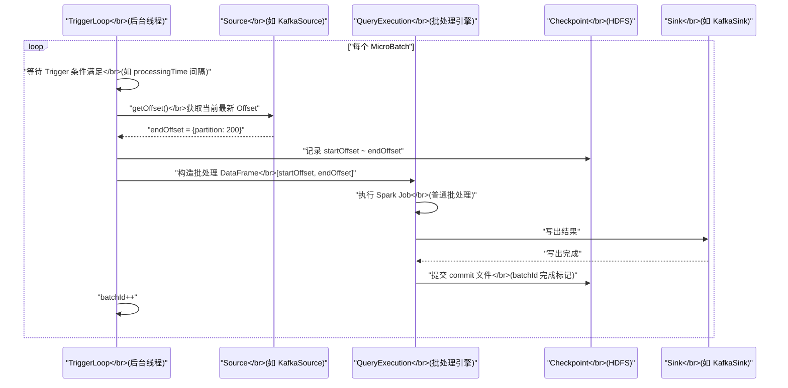

# 01 微批执行模型：MicroBatch 与 Continuous Processing 的本质差异

## 摘要

Structured Streaming 是 Spark 2.0 引入的统一流批处理框架，其核心设计理念是"**将流处理问题建模为对无界表（Unbounded Table）的增量查询**"。但这个优雅的抽象背后，执行引擎的实现方式对延迟、吞吐量、Exactly-once 语义的保证有着根本性的影响。Structured Streaming 提供两种执行模式：**MicroBatch（微批）** 是默认模式，以固定时间间隔为单位将流数据切分为一批批处理，延迟通常在秒级；**Continuous Processing（连续处理）** 是 Spark 2.3 引入的实验性模式，通过长期运行的 Task 实现毫秒级延迟，但功能受限。理解两种模式的内在机制——MicroBatch 的触发循环、QueryExecution 复用、Epoch 提交；Continuous 的 Record-level Checkpoint、Epoch 标记——不仅帮助选择正确的执行模式，更是深刻理解 Structured Streaming 一切行为（状态管理、Watermark 推进、Exactly-once）的前提。

---

## 第 1 章 流处理的挑战：为什么不能直接用批处理解决

### 1.1 无界数据与有界数据的根本差异

批处理（Batch Processing）的前提是数据是**有界的（Bounded）**：作业开始时，所有数据已经存在，可以一次性扫描完成。Spark 的 RDD / DataFrame 批处理模型天然适合这种场景——`sparkContext.textFile("hdfs://path")` 在执行时读取的是确定的、完整的数据集。

流处理面对的是**无界数据（Unbounded Data）**：数据不断产生，永无止境。用户行为事件流、传感器数据流、金融交易流，都是每时每刻持续涌入的。

这带来了批处理无法直接回答的问题：

**问题一：何时"完成"一次计算？**

批处理中，Job 完成就意味着处理完了所有数据。流处理中，永远没有"所有数据都到齐"的时刻——作业必须持续运行，对每条新到达的数据做出响应。

**问题二：如何处理乱序数据？**

网络延迟、重试机制、多 Source 合并，都可能导致事件到达的顺序与它们真实发生的顺序不一致。一条 10:00:00 产生的事件可能在 10:00:30 才到达处理系统。批处理不存在"晚到的数据"——数据全部存在磁盘上，按任何顺序扫描都能得到正确结果。流处理必须显式处理乱序。

**问题三：如何保证 Exactly-once 语义？**

批处理失败重试很简单——重新跑一遍，覆盖输出。流处理中，如果处理了一半失败，重新从头开始会导致部分数据被重复处理（如重复写入数据库）；但如果不从头，则会丢失部分数据。保证 Exactly-once 需要精细的 Checkpoint 和输出幂等性设计。

### 1.2 Structured Streaming 的核心抽象：无界表

Structured Streaming 用一个统一的概念回答了"如何表达流处理"的问题：**将输入数据流建模为一张持续增长的无界表（Unbounded Table）**。

```
时刻 T=0: 表有 0 行（空表）
时刻 T=1: Kafka 来了 100 条消息，表现在有 100 行
时刻 T=2: 又来了 150 条消息，表现在有 250 行
...
```

用户在这张无界表上写查询（就像写普通的批处理 SQL 或 DataFrame 代码），系统负责将这个查询转化为持续的增量执行：每当有新数据到来，就基于新增的行更新查询结果。

```python
# 用批处理的写法，定义流处理查询
from pyspark.sql import SparkSession
from pyspark.sql.functions import col, window

spark = SparkSession.builder.getOrCreate()

# 从 Kafka 读取（无界表）
events = spark.readStream \
    .format("kafka") \
    .option("kafka.bootstrap.servers", "broker:9092") \
    .option("subscribe", "user-events") \
    .load()

# 写流查询（与批处理写法几乎相同）
result = events \
    .selectExpr("CAST(value AS STRING) as event_json") \
    .filter(col("event_json").contains("purchase"))

# 启动流查询，将结果写到控制台
query = result.writeStream \
    .format("console") \
    .start()
```

这个抽象的优雅之处在于：用户不需要显式管理状态、Offset、重试逻辑——这些都由 Structured Streaming 的执行引擎在底层处理。

---

## 第 2 章 MicroBatch 执行模型：流处理的"分治"思想

### 2.1 MicroBatch 是什么，为什么出现

**MicroBatch（微批）** 是 Structured Streaming 的默认执行模式：将持续的数据流按**时间间隔**切分为一个个小批次（Micro Batch），每个批次作为一个独立的批处理 Spark Job 执行，批次完成后触发下一批次。

**为什么选择微批而不是真正的逐条流式处理？**

这是一个刻意的工程权衡，根源在于 Spark 的执行模型：

1. **复用成熟的批处理引擎**：Spark 的调度、容错、内存管理、CodeGen 都是为批处理优化的。微批模式直接复用这套已经极度优化的引擎，每个 Micro Batch 就是一个普通的 Spark Job，无需重写调度器。

2. **Exactly-once 更容易实现**：批处理的幂等重试（失败重跑）天然适合 Exactly-once 语义。微批模式只需要保证每个批次的 Offset 范围有记录（Checkpoint），重试时重新处理相同 Offset 范围的数据，结合幂等 Sink，就实现了端到端 Exactly-once。

3. **吞吐量更高**：逐条处理每条记录需要为每条记录触发调度、任务提交等开销；微批模式将成千上万条记录合并为一个批次一次性处理，摊薄了调度开销，吞吐量显著更高。

**代价**：微批模式的最小延迟不能低于一个批次的处理时间（通常 100ms-数秒）。如果需要毫秒级延迟，微批无法满足。

### 2.2 MicroBatch 的执行循环

MicroBatch 模式的执行入口是 `MicroBatchExecution`（继承自 `StreamExecution`），它维护一个**无限循环的触发循环（Trigger Loop）**：



**触发循环的关键步骤**：

**Step 1：等待 Trigger**

根据 Trigger 类型决定等待时机：
- `ProcessingTime("10 seconds")`：等满 10 秒（从上一批次完成时计时）
- `Once()`：只执行一批，执行完退出
- `AvailableNow()`（Spark 3.3+）：处理当前所有可用数据，分多批完成后退出

**Step 2：确定批次的 Offset 范围**

调用 Source 的 `latestOffset()` 接口（DataSource V2）或 `getOffset()` 接口（V1），获取当前时刻 Source 的最新 Offset。

```
batchId=5 的 Offset 范围：
  startOffset = {partition-0: 100, partition-1: 80}  （上一批次的 endOffset）
  endOffset   = {partition-0: 150, partition-1: 120}  （当前获取的最新 Offset）
  本批次处理：partition-0 的 100~150，partition-1 的 80~120
```

**Step 3：写 Offset 日志（WAL 语义）**

将本批次的 Offset 范围写入 Checkpoint 目录的 `offsets/` 目录：`$checkpointDir/offsets/5`。这是"先记录再执行"的 WAL 思想——即使批次执行失败，下次重启时知道该批次的 Offset 范围，可以重新执行相同范围的数据。

**Step 4：构造并执行批处理 Job**

将 `[startOffset, endOffset]` 参数传入 Source，Source 据此生成一个确定边界的批处理 DataFrame（相当于 `spark.read.format("kafka").option("startingOffsets",...).option("endingOffsets",...)...`）。然后将这个 DataFrame 传入用户定义的流查询逻辑，生成 Optimized LogicalPlan，走完整的 SparkPlan → Job 提交路径，与普通批处理完全相同。

**Step 5：写 Commit 日志**

批次执行成功后，写入 `$checkpointDir/commits/5` 文件，标记 batchId=5 已完成。如果写 Commit 前崩溃，下次重启会重新执行 batchId=5；如果写 Commit 后崩溃，下次重启会跳过 batchId=5 直接从 batchId=6 开始。

### 2.3 QueryExecution 的增量复用

MicroBatch 的一个重要优化：**每次批次不重新解析和优化整个查询**，而是复用上一批次生成的物理计划，只更新 Source 的 Offset 范围。

具体来说，`MicroBatchExecution` 在第一个批次时完整走一遍 Parsing → Analysis → Optimization → Planning；从第二个批次开始，只替换 Source 节点中的 `startOffset`/`endOffset` 参数（通过一个特殊的 `ReplacePlanWithBatch` 操作），其他物理计划不变，复用之前的优化结果。

这个优化对于高频批次（如 1 秒间隔）非常重要——如果每次都重新规划，Driver 端的 Catalyst 开销就会成为瓶颈。

---

## 第 3 章 Continuous Processing：毫秒级延迟的代价

### 3.1 Continuous Processing 是什么

**Continuous Processing（连续处理）** 是 Spark 2.3 引入的实验性执行模式，通过长期运行的 Task（不在每个批次结束时停止）实现毫秒级延迟：

```python
# 使用 Continuous Processing（实验性，Spark 2.3+）
query = result.writeStream \
    .format("kafka") \
    .trigger(continuous="1 second")  # 每 1 秒做一次 Checkpoint（而不是每秒新建批次）
    .start()
```

**关键区别**：MicroBatch 中，每个 Micro Batch 对应一组短暂的 Spark Task（批次完成后 Task 结束）；Continuous Processing 中，Task 是**长期运行（Long-running）**的，每个 Task 持续读取 Source 并实时处理，Task 的生命周期等于整个流查询的生命周期（除非故障重启）。

### 3.2 Continuous Processing 的 Epoch 机制

Continuous Processing 不能用 MicroBatch 的"先写 Offset WAL，再执行，再写 Commit"模式——因为 Task 是持续运行的，没有批次边界。它用 **Epoch（纪元）** 替代批次作为 Checkpoint 边界：

**Epoch 的工作原理**：

1. Driver 定期（由 `continuous="1 second"` 的参数决定）向所有正在运行的 Task 发送一个 **Epoch 标记**（本质是一个插入 Source 输出流的特殊消息）
2. 每个 Task 收到 Epoch 标记时，向 Driver 报告自己当前处理到的 Offset（"我处理到了 partition-X 的 offset-Y"）
3. Driver 收集所有 Task 的报告，确认所有 Task 都越过了当前 Epoch 标记后，将这些 Offset 写入 Checkpoint
4. Sink 也按 Epoch 边界提交输出（每个 Epoch 内的输出是一个原子提交单位）

**容错机制**：Task 失败时，从最近一次完整提交的 Epoch 的 Offset 重新启动 Task，重新处理该 Epoch 内的数据。

### 3.3 Continuous Processing 的局限

尽管 Continuous Processing 实现了毫秒级延迟（理论上每条记录处理完后立即写出，无需等待批次结束），但有严重的功能限制：

| 功能 | MicroBatch | Continuous Processing |
|-----|-----------|----------------------|
| 聚合（GROUP BY） | **支持** | **不支持** |
| 有状态操作（mapGroupsWithState） | **支持** | **不支持** |
| 窗口函数 | **支持** | **不支持** |
| 流-流 Join | **支持** | **不支持** |
| Watermark | **支持** | **不支持** |
| 无状态操作（filter/map/select） | 支持 | 支持 |
| Kafka Source/Sink | 支持 | 支持（有限） |
| 延迟目标 | 秒级 | **毫秒级** |

**不支持聚合和有状态操作的根本原因**：聚合和状态操作需要跨多条记录维护共享状态（如 HashMap 或 RocksDB State Store）。MicroBatch 中，整个批次完成后才更新状态，State Store 的并发访问问题简单；Continuous Processing 中多个 Task 并发运行且状态随时在变化，需要分布式状态的并发控制，实现极其复杂，Spark 尚未完成这部分实现。

> [!warning] 生产避坑
> Continuous Processing 在 Spark 3.x 仍标注为"实验性（Experimental）"，不建议在生产环境使用。生产场景中需要毫秒级延迟时，考虑使用 Apache Flink（原生流处理，天然支持有状态操作的毫秒级延迟）或将 Structured Streaming 的批次间隔调到 100ms（MicroBatch 模式的延迟下限约为 50-200ms）。

---

## 第 4 章 MicroBatch 的延迟分析：批次间隔不等于端到端延迟

### 4.1 端到端延迟的组成

很多工程师误以为"Trigger 设置为 `processingTime("5 seconds")`，端到端延迟就是 5 秒"。实际上端到端延迟（从事件产生到写出结果）远不止这些：

```
端到端延迟 = Source 延迟（数据在 Kafka 中的滞留时间）
           + 触发等待时间（当前批次等待 Trigger 的时间）
           + 批次执行时间（Spark Job 运行时间，包括调度+计算+写出）
           + Sink 延迟（写出到下游可见的时间）
```

以 `processingTime("5 seconds")` 为例：

- 事件在 10:00:00 产生，10:00:01 写入 Kafka
- 当前批次的触发时间是 10:00:05（等待了 4 秒）
- 批次执行时间 3 秒（10:00:05 到 10:00:08）
- 写出到 Kafka 下游可见：10:00:08

**端到端延迟 = 8 - 0 = 8 秒**，但批次间隔只有 5 秒。

**最优情况（事件在批次刚开始时到达）**：延迟 ≈ 批次间隔 + 批次执行时间

**最差情况（事件在批次刚结束时到达，需等待下一批次）**：延迟 ≈ 批次间隔 × 2 + 批次执行时间

### 4.2 降低延迟的几个方向

**方向一：减小批次间隔**

```python
# 100ms 间隔的微批（最低实用延迟约 200-500ms）
query = df.writeStream \
    .trigger(processingTime="100 milliseconds") \
    .format("kafka") \
    .start()
```

批次间隔越小，等待时间越短，延迟越低。但批次间隔 < 批次执行时间时，Spark 会出现"背压"——上一批未完成时下一批已触发，系统陷入积压状态。

**方向二：优化批次执行时间**

- 开启 AQE 减少不必要的 Shuffle
- 调整 `maxOffsetsPerTrigger`（Kafka Source）控制每批处理的数据量
- 确保 State Store 访问高效（RocksDB vs HDFS）

**方向三：使用 `AvailableNow` 触发器**（Spark 3.3+，非实时场景）

`AvailableNow` 不是为低延迟设计的，而是为"处理完所有积压数据后退出"的定时批量场景：

```python
# 处理到目前为止 Kafka 中的所有积压数据，完成后退出（不持续监听）
query = df.writeStream \
    .trigger(availableNow=True) \
    .format("parquet") \
    .start()
query.awaitTermination()
```

---

## 第 5 章 MicroBatch 的状态恢复：Checkpoint 目录结构

### 5.1 Checkpoint 目录的完整结构

理解 MicroBatch 的执行模型，必须了解 Checkpoint 目录：

```
$checkpointDir/
├── metadata                 ← 流查询的唯一 ID（UUID），确保恢复时匹配正确的查询
├── offsets/                 ← Offset WAL（每个 batchId 一个文件）
│   ├── 0                    ← batchId=0 的 startOffset~endOffset
│   ├── 1
│   └── ...
├── commits/                 ← 已完成的 batchId 标记
│   ├── 0                    ← batchId=0 已完成
│   ├── 1
│   └── ...
├── sources/                 ← Source 级别的额外状态（如 Kafka 的元数据）
│   └── 0/
│       └── ...
└── state/                   ← 有状态算子的 State Store 数据
    └── 0/                   ← operatorId=0 的状态
        ├── 0/               ← partitionId=0 的状态文件
        │   ├── 1.delta      ← batchId=1 的增量状态
        │   ├── 2.delta
        │   └── ...
        └── ...
```

### 5.2 故障恢复的决策逻辑

当流查询重启时，`MicroBatchExecution` 从 Checkpoint 目录确定恢复点：

```
Step 1: 读取 offsets/ 目录，找到最大的 batchId = N
Step 2: 检查 commits/ 目录是否有 batchId = N 的 commit 文件
  - 如果有（N 已完成）：从 batchId = N+1 开始
    → 读取 startOffset = offsets/N 中的 endOffset
    → 获取最新 endOffset，执行 batchId = N+1
    
  - 如果没有（N 未完成，执行到一半崩溃）：重新执行 batchId = N
    → 读取 offsets/N 中的 startOffset 和 endOffset
    → 重新执行相同 Offset 范围的数据（幂等重试）
```

这个两阶段（先写 offset WAL，再写 commit）的设计保证了 At-least-once 的数据处理语义：任何崩溃点都不会导致数据丢失（可能重复处理，配合幂等 Sink 实现 Exactly-once）。

---

## 第 6 章 两种模式的选择矩阵

| 维度 | MicroBatch（默认） | Continuous Processing（实验性） |
|-----|------------------|-------------------------------|
| **最低延迟** | ~100ms（调小批次间隔） | ~毫秒级 |
| **吞吐量** | **高**（批量处理） | 中（逐记录处理） |
| **Exactly-once** | **支持**（成熟稳定） | 支持（有限场景） |
| **有状态操作** | **完整支持** | 不支持 |
| **聚合/窗口** | **完整支持** | 不支持 |
| **生产就绪** | **是** | 否（实验性） |
| **调试难度** | 低（批处理思维） | 高 |
| **适用场景** | **绝大多数生产场景** | 只需 filter/map 且要求毫秒级延迟 |

> [!note] 设计哲学
> Structured Streaming 选择 MicroBatch 作为默认模式，是"工程现实主义"的体现：90% 的流处理需求（聚合统计、Join 维表、有状态检测）只需要秒级延迟，MicroBatch 完全胜任；而将成熟的批处理引擎直接复用，带来的工程红利（成熟稳定、极高吞吐、完整功能集、一致性保证）远超为毫秒级延迟重写整个引擎的代价。真正需要毫秒级延迟且功能复杂的场景，Flink 是更合适的选择。

---

## 小结

- **MicroBatch**：Structured Streaming 的默认执行模式，将数据流按时间切分为小批次，每批次是一个普通 Spark Job；复用批处理引擎带来高吞吐、完整功能集、成熟 Exactly-once；延迟下限约 100ms
- **触发循环**：等待 Trigger → 获取 Offset → 写 Offset WAL → 执行 Job → 写 Commit，两阶段提交保证故障可恢复
- **QueryExecution 复用**：第一批完整规划，后续批次只替换 Source Offset，复用物理计划，降低 Driver 规划开销
- **Continuous Processing**：长期运行 Task + Epoch 机制实现毫秒级延迟，但不支持聚合/状态/窗口，仍是实验性功能
- **端到端延迟**：= Source 延迟 + 触发等待 + 批次执行 + Sink 延迟，批次间隔只是其中一项

第 02 篇将深入 Source 与 Sink：Kafka Source 如何通过 Offset 管理保证精确一次语义、DataSource V2 的流式读写接口设计，以及不同 Sink（Kafka、File、ForeachBatch）的 Exactly-once 保证等级差异。

---

> [!note] 思考题
> 1. MicroBatch 模型将流处理分解为一系列小批次，每个批次都是一次完整的 Spark 批处理作业。这个设计决策带来了"至少一次"到"精确一次"语义的实现基础——但 MicroBatch 的批次边界本身就意味着最低延迟受限于触发间隔。Continuous Processing 模式声称可以实现毫秒级延迟，它的底层机制与 MicroBatch 有什么本质不同？为什么 Continuous 模式目前只支持有限的算子？
> 2. Structured Streaming 的"无界表"抽象将流数据建模为一张不断追加新行的表。这个抽象对开发者友好，但在引擎内部，"表"并不真实存在——每个 MicroBatch 处理的是 Source 的一个增量 Offset 区间。当流作业重启时，它如何知道从哪个 Offset 恢复？如果 Checkpoint 损坏，有什么恢复手段？
> 3. MicroBatch 的每个批次都会复用上一批次的 `QueryExecution` 增量计划。如果在两次批次之间，Kafka Topic 的分区数发生了变化（动态扩分区），当前批次的执行计划是否能自动感知？Source 的 Schema 变更会怎样影响正在运行的流作业？

## 参考资料

- Apache Spark 官方文档：Structured Streaming Programming Guide
- Apache Spark 源码：`org.apache.spark.sql.execution.streaming.MicroBatchExecution`
- Apache Spark 源码：`org.apache.spark.sql.execution.streaming.continuous.ContinuousExecution`
- [Structured Streaming: A Declarative API for Real-Time Applications in Apache Spark（Databricks Blog 2016）](https://www.databricks.com/blog/2016/07/28/structured-streaming-in-apache-spark.html)
- Armbrust M 等：Structured Streaming: A Declarative API for Real-Time Applications in Apache Spark（SIGMOD 2018）
