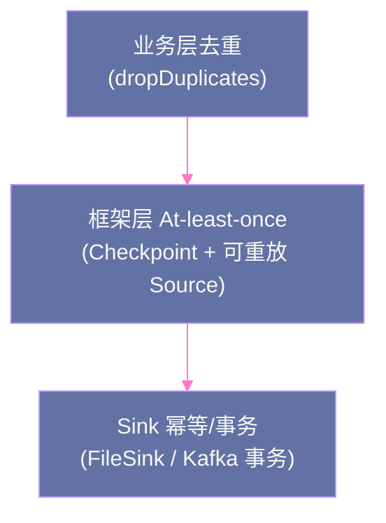

# 09 dropDuplicates 与精确去重：Exactly-once 的应用层保障

## 摘要

Exactly-once 语义在 Structured Streaming 的框架层面由 Checkpoint + 幂等 Sink 保证，但在**应用层**，业务数据本身可能存在重复——Kafka 消息因 Producer 重试产生重复、上游 ETL 管道因失败重发、客户端网络超时重试等。这些重复不是 Structured Streaming 框架引入的，框架无法自动处理。`dropDuplicates` 是 Structured Streaming 提供的流式去重算子，通过在 State Store 中维护已见过的 Key 集合，对每条到来的记录判断是否已处理过——重复则丢弃，首次出现则保留。但去重状态不能无限增长（见过的 Key 永远记录 → OOM），与 Watermark 结合的 `dropDuplicates(cols, withEventTimeOrder=True)` 实现了**有界去重**：只在 Watermark 覆盖的时间窗口内去重，过期的 Key 状态自动清理。本文深度讲解 `dropDuplicates` 的 State 存储模型、有界与无界去重的区别、与 Watermark 的精确交互，以及在多层架构中构建端到端 Exactly-once 保障的完整方案。

---

## 第 1 章 流处理中的数据重复根因

### 1.1 框架级重复 vs 业务级重复

**框架级重复**（Structured Streaming 负责处理）：由 Structured Streaming 自身的失败重试机制引入——一个 MicroBatch 执行到一半失败，Spark 从 Checkpoint 重新执行该批次，Sink 可能收到重复写入。Spark 通过 Checkpoint 的两阶段提交 + 幂等 Sink 解决这类重复（见第 02 篇）。

**业务级重复**（应用层负责处理，`dropDuplicates` 的用武之地）：数据在进入 Spark 之前就已经重复了：

**场景一：Kafka Producer 重试**

Producer 发送消息后网络超时，未收到 ACK，触发重试发送——Broker 端实际已收到原始消息，重试产生了重复消息。虽然 Kafka 的 Idempotent Producer 可以在单会话内去重，但多会话（如 Producer 重启）仍可能产生重复。

**场景二：上游 ETL 管道的幂等重发**

上游数据管道（如 Flink、Lambda 等）因失败重启时，从某个 Checkpoint 重新发送数据，可能重发部分已处理的消息。

**场景三：移动端事件的重试上报**

移动 App 在弱网环境下，同一事件可能多次上报（用户点击了一次，但 App 因为没收到确认而多次发送）。

这些重复消息对于 Spark 的 Kafka Source 而言是正常的、不同 Offset 的独立消息，Spark 不会自动识别并去重——需要应用层用 `dropDuplicates` 处理。

---

## 第 2 章 dropDuplicates 的工作机制

### 2.1 基础用法

```python
# 基于单列去重
deduplicated = events.dropDuplicates(["eventId"])

# 基于多列组合去重
deduplicated = events.dropDuplicates(["userId", "eventType", "event_time"])

# 与 Watermark 结合（有界去重，推荐生产使用）
deduplicated = events \
    .withWatermark("event_time", "10 minutes") \
    .dropDuplicates(["eventId"])

query = deduplicated.writeStream \
    .outputMode("append") \
    .format("parquet") \
    .start()
```

### 2.2 State Store 中的去重存储

`dropDuplicates` 在 State Store 中维护一个 **Key → 首次出现时间** 的映射：

```
State Store 存储：
  Key: "event-001"  → Value: {firstSeenTime: 10:00:05}
  Key: "event-002"  → Value: {firstSeenTime: 10:00:07}
  Key: "event-003"  → Value: {firstSeenTime: 10:02:30}
  ...
```

每条新到达的记录：
1. 提取去重 Key（如 `eventId`）
2. 在 State Store 中查找是否已存在
3. **已存在** → 丢弃该记录（重复）
4. **不存在** → 写入 State Store，保留该记录（首次出现）

### 2.3 无界去重的 State 爆炸问题

**没有 Watermark 的 `dropDuplicates`**：State Store 中的 Key 集合单调递增，永不清理——因为理论上任何时候都可能来一条 `eventId="event-001"` 的重复消息，Spark 不知道何时可以安全丢弃这个 Key 的状态。

```
一个月运行后：
  State Store 中累积了 30天 × 100万条/天 = 3000万个 eventId
  每个 eventId 记录约 50 字节 → State 大小 = 1.5GB
  半年后 → 9GB → OOM
```

这是**无界去重**的根本问题：不配合 Watermark，去重状态永远增长。

---

## 第 3 章 有界去重：Watermark 控制状态清理

### 3.1 Watermark 如何限制去重范围

当 `dropDuplicates` 与 `withWatermark` 配合使用时，Spark 会在 Watermark 推进时自动清理 State Store 中"过期"的 eventId：

```
配置：withWatermark("event_time", "10 minutes").dropDuplicates(["eventId"])

当前 Watermark = 10:20:00

清理条件：eventId 对应的 firstSeenTime < Watermark
  → firstSeenTime < 10:20:00 的 eventId 从 State Store 中删除

理解：如果一条 event_time=10:05 的重复消息现在到来：
  10:05 <= 10:20 (Watermark) → 该消息被认为是"迟到数据"，直接丢弃
  → 不需要再在 State Store 中保留 event_time=10:05 的 eventId
  → 可以安全清理
```

**有界去重的去重保证范围**：在 `[Watermark - 延迟阈值, ∞)` 时间范围内保证去重。超出 Watermark 的极晚迟到重复消息会被丢弃（但这本身就应该被丢弃，因为它们的事件时间已经过期）。

### 3.2 去重 State 大小的计算

有界去重的 State 大小是**有限且稳定**的：

```
State 大小 ≈ Watermark 延迟阈值内的去重 Key 数量
           = 延迟阈值时间窗口 × 数据速率 × Key 大小

例：延迟阈值=10分钟，数据速率=10万条/分钟，Key=UUID(36字节)
  State 大小 ≈ 10 × 10万 × 50字节 = 50MB（稳定，不随时间增长）
```

这使得有界去重的 State 占用是可预测和可控的。

> [!warning] 生产避坑
> `dropDuplicates` 与 `withWatermark` 的调用顺序很重要：**必须先调用 `withWatermark`，再调用 `dropDuplicates`**。反序（先 `dropDuplicates` 后 `withWatermark`）在某些 Spark 版本中不会报错，但 Watermark 不会与去重 State 关联，State 仍会无限增长。

---

## 第 4 章 端到端 Exactly-once 的完整方案

### 4.1 三层 Exactly-once 保障模型

完整的端到端 Exactly-once 需要三层协同：



**层一（业务层去重）**：`dropDuplicates` 消除上游数据管道引入的业务级重复，确保进入 Spark 处理的每条记录在业务语义上是唯一的。

**层二（框架层 At-least-once）**：Checkpoint 机制保证任何失败后从正确 Offset 重试，不丢失数据（可能重复处理，由层一和层三处理）。

**层三（Sink 幂等）**：FileSink 的两阶段提交、KafkaSink 的事务写入、ForeachBatch 的手动幂等逻辑，确保框架重试不会导致输出重复。

### 4.2 实战：Kafka → 去重 → Delta Lake 的 Exactly-once 管道

```python
from pyspark.sql.functions import col, from_json
from pyspark.sql.types import StructType, StringType, DoubleType, TimestampType

# 定义 Schema
schema = StructType() \
    .add("eventId", StringType()) \
    .add("userId", StringType()) \
    .add("amount", DoubleType()) \
    .add("event_time", TimestampType())

# 读取 Kafka
raw = spark.readStream \
    .format("kafka") \
    .option("kafka.bootstrap.servers", "broker:9092") \
    .option("subscribe", "payment-events") \
    .option("startingOffsets", "earliest") \
    .load()

# 解析 JSON
events = raw.select(
    from_json(col("value").cast("string"), schema).alias("data")
).select("data.*")

# 有界去重（Watermark=10分钟，去重窗口=10分钟）
deduped = events \
    .withWatermark("event_time", "10 minutes") \
    .dropDuplicates(["eventId"])

# 写入 Delta Lake（天然幂等：Delta Lake 事务保证）
query = deduped.writeStream \
    .outputMode("append") \
    .format("delta") \
    .option("checkpointLocation", "s3://bucket/ckpt/payment-dedup/") \
    .option("path", "s3://bucket/data/payments/") \
    .trigger(processingTime="30 seconds") \
    .start()
```

---

## 小结

`dropDuplicates` 是流处理端到端 Exactly-once 的应用层最后一道防线：

- **无界去重**（不带 Watermark）：State 无限增长，不适合生产；仅用于数据量极小的测试场景
- **有界去重**（带 Watermark）：State 大小稳定（= Watermark 窗口 × 数据速率 × Key 大小），Watermark 推进时自动清理过期 Key；**生产标准做法**
- **调用顺序**：`withWatermark` 必须先于 `dropDuplicates` 调用
- **三层 Exactly-once**：业务去重（dropDuplicates）+ 框架 At-least-once（Checkpoint）+ Sink 幂等，三层协同构建完整保障

第 10 篇讲解流批一体查询：Streaming DataFrame 与 Static DataFrame 如何在同一个查询中混合使用，以及流-批 Join 的语义限制。

---

> [!note] 思考题
> 1. `dropDuplicates` 依赖 State Store 记录已见过的唯一 Key。在高基数 Key（如全局唯一的事件 ID）场景下，State Store 的大小会线性增长，最终导致 OOM。结合 Watermark 的有界去重是解决方案，但 Watermark 的时间窗口必须大于 Source 端的最大可能重复时间范围。如果这个时间范围无法准确估计（比如上游系统可能在任意时间重放历史数据），有界去重是否还有效？
> 2. Spark 的框架级"精确一次"语义（通过 Checkpoint + 幂等写入）与 `dropDuplicates` 提供的应用层去重是两个独立的保障层。如果 Sink 本身不支持幂等写入（比如追加型文件系统），框架级的"至少一次"加上应用层的 `dropDuplicates` 能否组合出端到端的精确一次语义？存在什么漏洞？
> 3. `dropDuplicates` 的 State Store 在 Checkpoint 中持久化。如果 Checkpoint 目录损坏导致 State 丢失，重启后的流作业无法感知历史上已处理过的 Key，会产生重复输出。在这种灾难恢复场景下，如何在业务层面补偿这种"去重状态丢失"带来的数据重复？

## 参考资料

- Apache Spark 官方文档：Structured Streaming - Deduplication
- Apache Spark 源码：`org.apache.spark.sql.execution.streaming.DeduplicateExec`
- [Exactly-Once Fault-Tolerance Guarantees for Apache Kafka's Producer（Confluent Blog）](https://www.confluent.io/blog/exactly-once-semantics-are-possible-heres-how-apache-kafka-does-it/)
