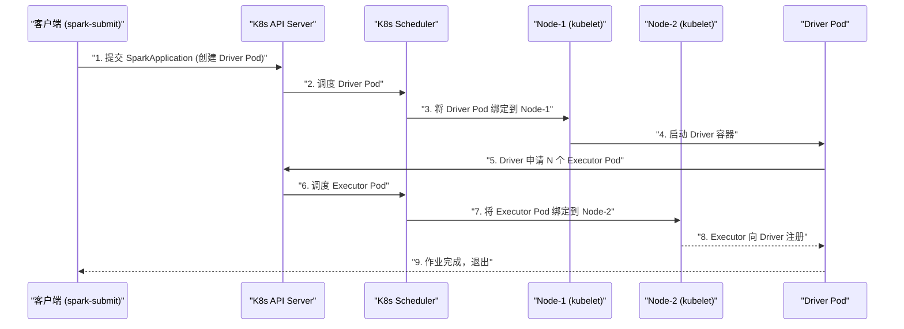

# 01 Spark on K8s 架构全景：与 YARN 模式的本质差异

## 摘要

Spark on Kubernetes 是 Spark 2.3（2018 年）正式引入的原生 K8s 调度后端，允许 Spark 将 Driver 和每个 Executor 作为独立的 [[Kubernetes]] Pod 运行，由 K8s 调度器统一管理资源。相比主导大数据集群十余年的 [[Hadoop YARN]] 模式，Spark on K8s 并非简单的"部署环境替换"，而是在资源调度模型、容器化运行环境、存储访问方式、故障恢复机制等多个维度都有根本性的架构差异。理解这些差异，是正确配置和调优 Spark on K8s 的前提。本文系统对比两种模式的架构，深度分析 Spark on K8s 的 Driver Pod 创建流程、Executor Pod 动态申请机制、K8s Scheduler 与 YARN ResourceManager 的调度语义差异，以及 K8s 原生的标签选择、亲和性调度如何影响 Spark 任务的资源分配。

---

## 第 1 章 YARN 模式回顾：以 AM/Container 为核心

### 1.1 YARN 的资源抽象模型

[[Hadoop YARN]] 将集群资源抽象为**容器（Container）**：每个 Container 是一组 CPU 和内存的配额（如 `4 vCores, 8GB`），由 ResourceManager 统一管理和分配。

**YARN 模式下 Spark 的运行流程**：

```
1. spark-submit → 向 YARN ResourceManager 提交应用
2. RM 在某个 NodeManager 上启动 ApplicationMaster（AM）Container
3. AM 进程就是 Spark Driver（在 cluster 模式下）
4. Driver 向 RM 申请 N 个 Executor Container
5. RM 在各 NodeManager 上启动 Executor Container
6. Executor 向 Driver 注册，接受 Task 分配
7. 作业完成后，AM 通知 RM 释放所有 Container
```

**YARN 的核心特点**：

- **长期运行的 NodeManager**：每个节点运行一个 NodeManager 守护进程，持续汇报资源；Container 在 NodeManager 内部以子进程方式运行
- **中心化的 ResourceManager**：全局唯一，管理整个集群的资源配额和 Container 分配
- **数据本地性调度**：RM 了解 HDFS 数据块的位置（通过 JobHistoryServer），可以优先将 Container 调度到数据所在节点（DATA_LOCAL → RACK_LOCAL → ANY）
- **资源是固定分配的**：一旦 Container 申请了 `4 vCores, 8GB`，这些资源在 Container 存活期间一直被占用，不论实际使用量

---

## 第 2 章 Spark on K8s 的架构模型

### 2.1 K8s 资源抽象：Pod 取代 Container

在 Kubernetes 中，最小的部署单位是 **[[Kubernetes Pod|Pod]]**（而不是容器）。一个 Pod 包含一个或多个容器，共享网络命名空间（同一 Pod 内的容器用 `localhost` 互通）和存储卷。

Spark on K8s 的映射关系：

| YARN 概念 | K8s 对应概念 |
|---------|-----------|
| ApplicationMaster Container | Driver Pod |
| Executor Container | Executor Pod |
| NodeManager | kubelet（每节点运行） |
| ResourceManager | kube-apiserver + kube-scheduler |
| Container 资源配额 | Pod 的 `resources.requests` 和 `resources.limits` |
| 队列（Queue） | Namespace + ResourceQuota |
| 数据本地性 | Node Affinity / Pod Affinity |

### 2.2 Spark on K8s 的启动流程



**详细流程说明**：

**步骤一：`spark-submit` 创建 Driver Pod**

```bash
spark-submit \
  --master k8s://https://k8s-api:6443 \
  --deploy-mode cluster \
  --conf spark.kubernetes.container.image=my-spark:3.3.0 \
  --conf spark.kubernetes.namespace=spark-ns \
  --conf spark.kubernetes.authenticate.driver.serviceAccountName=spark-sa \
  --conf spark.executor.instances=10 \
  --class com.example.MySparkApp \
  local:///opt/spark/jars/my-app.jar
```

`spark-submit` 本质上是调用 K8s API（`POST /apis/v1/namespaces/spark-ns/pods`）创建一个 Driver Pod。创建完成后，`spark-submit` 进程可以退出（`--deploy-mode cluster`），Driver 独立运行在 K8s 中。

**步骤二：Driver 启动后申请 Executor Pod**

Driver 进程内的 `KubernetesClusterSchedulerBackend` 组件（`org.apache.spark.scheduler.cluster.k8s`）负责与 K8s API 交互，为每个需要的 Executor 创建 Pod：

```
KubernetesClusterSchedulerBackend.start()
  → ExecutorPodsAllocator.start()
    → 根据 spark.executor.instances 或 DRA 的需求，
      调用 K8s API 创建 Executor Pod
    → 持续监听 Executor Pod 的状态（Watch API）
    → Executor Pod Ready 后，Executor JVM 向 Driver 发起 RPC 注册
```

### 2.3 两种模式的架构差异对比

| 维度 | YARN 模式 | K8s 模式 |
|-----|---------|---------|
| **资源单元** | Container（虚拟化 CPU+内存配额） | Pod（Linux 容器，cgroup 隔离） |
| **调度器** | YARN ResourceManager（专为 MR/Spark 设计）| K8s Scheduler（通用调度器，不了解 Spark 语义） |
| **数据本地性** | 原生支持（RM 了解 HDFS 数据位置） | 需要手动配置 Node Affinity，或依赖远程存储（S3/HDFS） |
| **资源隔离** | Container 进程级隔离（同节点上多个 JVM）| Pod 级 Linux 容器隔离（cgroup + namespace） |
| **网络** | Container 共享宿主机网络（或 YARN 分配端口）| 每个 Pod 有独立 IP（K8s CNI 分配） |
| **存储** | 本地磁盘（YARN Container 的工作目录）| 需要显式挂载 PVC 或 HostPath |
| **弹性伸缩** | Dynamic Allocation（向 RM 申请/释放 Container）| Dynamic Allocation（创建/删除 Executor Pod） |
| **作业提交** | `spark-submit --master yarn` | `spark-submit --master k8s://...` |
| **监控/日志** | YARN ResourceManager UI | K8s Dashboard / `kubectl logs` / 集成日志系统 |
| **队列与多租户** | YARN 队列（Capacity/Fair Scheduler）| K8s Namespace + ResourceQuota + PriorityClass |

---

## 第 3 章 K8s 调度器与 YARN 调度器的语义差异

### 3.1 YARN 调度器的 Spark 感知能力

YARN 的 Capacity Scheduler 和 Fair Scheduler 是专为大数据作业设计的，理解 Spark 的资源需求：

- **资源预留（Reservation）**：当某个队列申请的 Container 因资源不足暂时无法满足时，RM 可以预留该节点，等待其上运行的 Container 完成后立即分配
- **本地性优化**：RM 知道每个任务偏好哪个节点（数据本地性），在满足本地性的节点上优先分配 Container
- **队列优先级**：多队列共享集群资源，RM 根据队列权重和使用量进行资源仲裁

### 3.2 K8s Scheduler 的通用调度逻辑

K8s 的默认调度器（`kube-scheduler`）是**通用调度器**，不了解 Spark 的业务语义：

1. **过滤（Filter）**：找出所有满足 Pod 资源需求（`requests.cpu`、`requests.memory`）和约束（Node Affinity、Taints/Tolerations、PVC 可用性）的节点
2. **打分（Score）**：对候选节点打分（基于资源利用率均衡、Pod 亲和性等），选出最高分节点
3. **绑定（Bind）**：将 Pod 绑定到选定节点

**K8s Scheduler 对 Spark 的影响**：

- **无 Gang Scheduling 原生支持**：默认 K8s Scheduler 不保证所有 Executor Pod 同时调度（可能部分 Pod 调度成功，部分因资源不足 Pending）→ 资源碎片，作业等待时间长；需要 [[Volcano]] 或 [[Apache Yunikorn]] 等扩展调度器提供 Gang Scheduling（第 08 篇详述）
- **无数据本地性调度**：K8s Scheduler 不知道 HDFS 数据块位置，Executor 被调度到的节点可能没有本地数据；在对象存储（S3/OSS）场景下这不是问题（数据在远端，本地性无意义），但在 HDFS 场景下会引入额外的网络 I/O
- **资源 requests vs limits 的语义**：K8s 调度基于 `resources.requests`（保证值）而非 `resources.limits`（上限）；Spark Executor 通常将 `requests = limits`（QoS Class: Guaranteed），避免被 K8s 的 OOM Killer 以低优先级杀掉

### 3.3 resources.requests 与 resources.limits 的配置原则

```yaml
# Executor Pod 的资源配置（Spark 自动生成）
resources:
  requests:
    cpu: "2"         # 调度保证值（K8s Scheduler 基于此值调度）
    memory: "4Gi"    # 调度保证值
  limits:
    cpu: "2"         # 上限（建议与 requests 相同）
    memory: "5Gi"    # 上限 = executor.memory + memoryOverhead
                     # 超过 limits.memory → OOMKilled
```

**Spark 相关配置与 K8s 资源的映射**：

```
spark.executor.memory=4g        → resources.requests.memory=4g
spark.executor.memoryOverhead=1g → 追加到 limits.memory（总计 5g）
spark.executor.cores=2          → resources.requests.cpu=2
spark.kubernetes.executor.request.cores=2 → 显式设置 requests.cpu（覆盖默认）
spark.kubernetes.executor.limit.cores=2   → 显式设置 limits.cpu
```

> [!warning] 生产避坑
> **不要把 `limits.memory` 设置得远大于 `requests.memory`**（如 requests=4Gi，limits=16Gi）。这会导致 K8s 以为这个 Pod 只需要 4Gi 内存，在 4Gi 剩余内存的节点上调度成功，但 Pod 运行时实际使用了更多内存，节点内存超出，K8s OOM Killer 开始杀 Pod（可能杀掉其他无辜 Pod）。建议 Spark 作业的 `requests = limits`（Guaranteed QoS），或至多 `limits = requests × 1.2`。

---

## 第 4 章 Client 模式 vs Cluster 模式

### 4.1 两种部署模式的差异

**Cluster 模式**（生产推荐）：

```
spark-submit → 创建 Driver Pod → spark-submit 进程退出
Driver Pod 独立运行在 K8s 中，Driver 申请 Executor Pod
作业完成后，Driver Pod 进入 Completed 状态
```

- spark-submit 客户端不需要与 Driver 保持连接
- Driver Pod 的日志和状态可以通过 K8s API 查询
- 适合 CI/CD 流水线、Airflow 触发等无人值守场景

**Client 模式**（调试用）：

```
spark-submit → Driver 在 spark-submit 所在机器（本地）运行
Driver 向 K8s 申请 Executor Pod
Driver 本地进程退出 → 作业终止（Executor Pod 被清理）
```

- Driver 运行在本地，可以直接看到 Driver 日志（stdout）
- Driver 的 IP 必须对 K8s 内的 Executor Pod 可达（跨网络问题复杂）
- 适合本地开发调试，不适合生产

### 4.2 Client 模式的网络挑战

Client 模式下，Driver 在 K8s 集群外（本地机器），Executor Pod 在 K8s 集群内。Executor 需要回连 Driver（发送心跳、请求 Task），这要求：

1. Driver 机器的 IP 对 K8s Pod 网络可达
2. Driver 开放的端口（默认 `spark.driver.port=4040`）不被防火墙拦截

在典型的企业环境（K8s 集群在云端，开发者在本地），这个网络通路往往不存在。推荐的解决方案是使用 `kubectl port-forward` 建立隧道，或直接用 Cluster 模式 + `kubectl logs` 查看日志。

---

## 小结

Spark on K8s 的核心架构特点：

- **Driver 是 K8s Pod**，由 `spark-submit` 调用 K8s API 创建，Cluster 模式下 `spark-submit` 退出后 Driver 独立运行
- **Executor 是 K8s Pod**，由 Driver 内的 `KubernetesClusterSchedulerBackend` 动态创建和删除
- **K8s Scheduler 是通用调度器**，不了解 Spark 语义（无数据本地性、无 Gang Scheduling）；生产中需要 Volcano/Yunikorn 补齐 Gang Scheduling 能力
- **资源配置**：`requests = limits`（Guaranteed QoS）是生产推荐，避免 OOM Killer 误杀
- **与 YARN 最大差异**：存储（无 HDFS 本地性）、网络（每 Pod 独立 IP）、多租户（Namespace/ResourceQuota 替代 YARN 队列）

第 02 篇将深入 Spark 镜像构建：官方 `spark-docker` 工具的使用、Dockerfile 层次设计（基础层/依赖层/应用层）、Python 环境管理（`conda env`、`requirements.txt`）、大 JAR 的分层缓存优化，以及私有镜像仓库的推拉配置。

---

> [!note] 思考题
> 1. Spark on YARN 中，ApplicationMaster 扮演了 Spark Driver 的容器，而 ResourceManager 负责资源调度。Spark on K8s 中，Driver 直接作为一个 Pod 运行，K8s 的 kube-scheduler 负责调度。这两种模式在 Driver 失败时的恢复行为有什么根本差异？YARN 能自动重启 AM，K8s 默认能做到吗？
> 2. Spark on K8s 使用 `client` 模式时，Driver 在提交机器上本地运行，而 Executor 在 K8s 集群中运行。这会导致 Driver 和 Executor 之间的网络通信必须跨越集群外部。在什么网络环境下，`client` 模式是不可行的？`cluster` 模式下 Driver Pod 的网络地址又如何被外部的 `spark-submit` 进程获知？
> 3. K8s 的调度器是通用的容器调度器，不理解 Spark 作业的内部结构（如 Stage 依赖关系）。YARN 的 Capacity Scheduler 也不理解 Spark，但 YARN 有队列管理和资源保证机制。在多租户场景下，Spark on K8s 如何实现等价于 YARN 队列的资源隔离？Namespace + ResourceQuota 的组合能完全替代 YARN 队列吗？

## 参考资料

- Apache Spark 官方文档：Running Spark on Kubernetes
- [Kubernetes Scheduler](https://kubernetes.io/docs/concepts/scheduling-eviction/kube-scheduler/)
- Apache Spark 源码：`org.apache.spark.scheduler.cluster.k8s.KubernetesClusterSchedulerBackend`
- [Running Apache Spark on Kubernetes（Google Cloud Blog, 2018）](https://cloud.google.com/blog/products/containers-kubernetes/kubernetes-best-practices-running-apache-spark-with-kubernetes)
