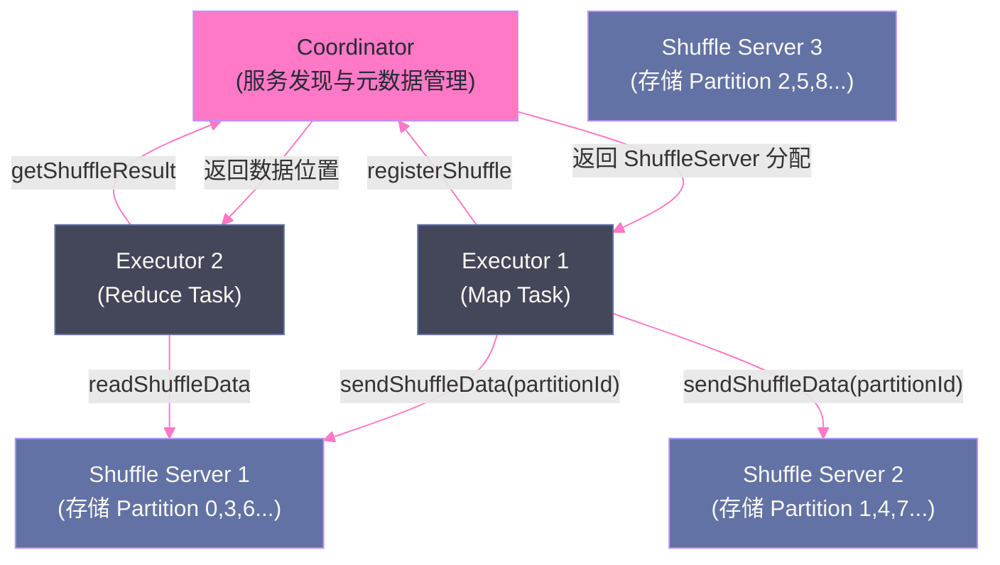

# 06 存储与 Shuffle：PVC、HostPath 与 Remote Shuffle Service

## 摘要

Shuffle 是 Spark 计算的核心 I/O 路径，也是 Spark on Kubernetes 落地中最棘手的工程挑战之一。在 YARN 模式下，Shuffle 数据写到 Executor 进程所在节点的本地磁盘，External Shuffle Service（ESS）以独立守护进程运行在每个 NodeManager 上，使 Executor 完成 Map 任务后即可释放（Reduce 任务通过 ESS 读取 Shuffle 数据）——动态资源分配因此得以高效运作。而在 K8s 模式中，不存在"持续运行在每个节点上的守护进程"这一概念（K8s 的 Pod 是短暂的），ESS 的部署模型在 K8s 下天然不适配。本文系统讲解 Shuffle 文件在 K8s 中的三种存储方案（emptyDir 临时存储、HostPath 持久化、PVC 网络存储），分析各方案的局限，以及 **Remote Shuffle Service（RSS）**——以 Apache Uniffle 为代表的云原生 Shuffle 解决方案——如何从根本上解耦 Shuffle 数据与 Executor Pod 生命周期，使 K8s 上的动态资源分配真正高效。

---

## 第 1 章 Shuffle 在 K8s 上的根本挑战

### 1.1 YARN 模式的 Shuffle 为什么顺畅

在 YARN 集群中，每个节点持续运行 NodeManager 守护进程，Spark 的 External Shuffle Service（ESS）作为 NodeManager 的辅助服务（AuxiliaryService）常驻在每个节点上：

```
YARN 节点架构：
  NodeManager（守护进程，永远运行）
    └── External Shuffle Service（ESS，NodeManager 的插件）
         └── 监听端口 7337，提供 Shuffle 数据读取服务

Spark Executor（临时 Container，完成任务后退出）
    → Map Task 将 Shuffle 数据写到节点本地磁盘
    → Executor Container 完成任务，动态分配释放此 Container
    → Reduce Task 通过 ESS 读取该节点磁盘上的 Shuffle 数据
       （不需要 Executor 进程还在运行，ESS 代劳了文件服务）
```

**关键设计**：ESS 是独立于 Executor 的长期进程，Executor 可以"先退出"而 Shuffle 数据依然可访问。这使得动态资源分配（DRA）的缩容操作（删除空闲 Executor）是安全的。

### 1.2 K8s 模式的 Shuffle 困境

K8s 没有"长期运行在每个节点上的 Spark 守护进程"——每个节点上只有 kubelet，Spark 不能在 kubelet 内嵌入 ESS 服务。

**没有 ESS 时，Shuffle 数据的命运与 Pod 绑定**：

```
K8s Executor Pod（Map Task 完成后）：
  Shuffle 数据在 Pod 的临时存储（emptyDir 或 HostPath）中
  如果 DRA 删除此 Executor Pod → Pod 删除 → 临时存储清理 → Shuffle 数据消失
  → Reduce Task 读取失败 → Task 失败 → Stage 重试
```

这就是为什么第 04 篇提到，K8s 模式的 DRA 必须开启 `shuffleTracking.enabled=true`——Driver 跟踪哪些 Executor 还有未被读取的 Shuffle 数据，不允许提前释放这些 Executor。但这带来了新问题：有 Shuffle 数据的 Executor 必须一直存活到所有 Reduce Task 完成，DRA 的缩容能力大打折扣。

---

## 第 2 章 三种本地 Shuffle 存储方案

### 2.1 方案一：emptyDir（默认，最简单）

K8s Pod 的 `emptyDir` 卷是 Pod 生命周期内的临时存储，Pod 删除后自动清理。Spark on K8s 默认将 Shuffle 数据写到 `emptyDir`（`/tmp` 目录，通常映射到节点的 `/var/lib/kubelet/pods/<pod-id>/volumes/`）。

```yaml
# Executor Pod Spec 中的 emptyDir 挂载（Spark 自动配置）
volumes:
  - name: spark-local-dir-1
    emptyDir: {}
containers:
  - name: executor
    volumeMounts:
      - mountPath: /var/data/spark-work
        name: spark-local-dir-1
env:
  - name: SPARK_LOCAL_DIRS
    value: /var/data/spark-work
```

**emptyDir 的问题**：
- **容量限制**：默认 `emptyDir` 与节点根文件系统共享空间（`/var/lib/kubelet/`），K8s 可以配置 `sizeLimit`，但超出后 Pod 会被驱逐
- **性能**：读写性能等同于节点根磁盘，通常是 HDD 或云盘（不是 SSD）
- **数据与 Pod 绑定**：Pod 删除则数据消失（DRA 缩容风险）

**适用场景**：小型作业、Shuffle 数据量小（< 10GB）、不开启 DRA 的固定 Executor 场景。

### 2.2 方案二：HostPath（性能最好，运维最复杂）

`HostPath` 将节点的本地目录挂载到 Pod，Pod 删除后目录依然存在（不自动清理）。如果节点配备了高速 NVMe SSD，HostPath 可以提供最佳的 Shuffle I/O 性能：

```yaml
# 使用 HostPath 挂载节点 SSD
volumes:
  - name: spark-shuffle-ssd
    hostPath:
      path: /mnt/nvme-ssd/spark-shuffle   # 节点上的 NVMe SSD 路径
      type: DirectoryOrCreate
containers:
  - name: executor
    volumeMounts:
      - mountPath: /var/data/spark-shuffle
        name: spark-shuffle-ssd
```

**HostPath 的问题**：

**问题一：手动清理**。Pod 删除后，`/mnt/nvme-ssd/spark-shuffle/` 下的 Shuffle 文件不自动清理，会逐渐占满节点磁盘。需要独立的清理 Job（或 DaemonSet）定期清理过期的 Shuffle 目录。

**问题二：节点亲和性**。Reduce Task 需要到对应节点读取 Shuffle 数据，如果 Executor Pod 被调度到其他节点，就无法直接访问 HostPath 数据（本地磁盘不跨节点）——这不是问题，因为 Executor 在写入 Shuffle 时就在对应节点，Reduce Task 通过网络 RPC 向 Map Task 的 Executor 请求数据，不直接访问 HostPath。

**问题三：安全性**。`HostPath` 给了 Pod 对节点文件系统的直接访问权，存在安全风险，生产中通常需要 PodSecurityPolicy（或 OPA Gatekeeper）限制 HostPath 的使用路径。

**适用场景**：追求极致 Shuffle 性能（如大规模 Join 或 Sort 作业），节点有专用 SSD 分区，有清理机制。

### 2.3 方案三：PVC（网络存储，适合混合云）

通过 PersistentVolumeClaim（PVC）将网络存储（NFS、Ceph RBD、云厂商存储）挂载到 Executor Pod，Shuffle 数据写到网络存储卷：

```yaml
# 为每个 Executor 动态申请 PVC
# 需要 StorageClass 支持动态 Provisioning
spark.kubernetes.executor.volumes.persistentVolumeClaim.shuffle-dir.mount.path=/var/data/shuffle
spark.kubernetes.executor.volumes.persistentVolumeClaim.shuffle-dir.mount.readOnly=false
spark.kubernetes.executor.volumes.persistentVolumeClaim.shuffle-dir.options.claimName=OnDemand
spark.kubernetes.executor.volumes.persistentVolumeClaim.shuffle-dir.options.storageClass=fast-ssd
spark.kubernetes.executor.volumes.persistentVolumeClaim.shuffle-dir.options.sizeLimit=100Gi
```

**PVC 的问题**：

- **创建延迟**：每个 Executor Pod 启动时需要先 Provision 和 Bind PVC，增加 Executor 启动时间（云盘创建通常需要 10-30 秒）
- **网络 I/O**：网络存储的 IOPS 和吞吐量远低于本地 NVMe SSD，大规模 Shuffle 下性能差距明显
- **成本**：云盘按容量收费，大量 Executor 同时使用大 PVC 成本高

**适用场景**：需要跨节点共享存储或 Executor Pod 可以迁移节点的特殊场景。实际上，PVC 方案在 Shuffle 场景中极少使用——性能差、启动慢、成本高。

---

## 第 3 章 Remote Shuffle Service：从根本上解耦 Shuffle 与 Pod

### 3.1 RSS 的设计思路

上面三种方案都有一个共同问题：**Shuffle 数据的存储生命周期与 Executor Pod 的生命周期耦合**。

**Remote Shuffle Service（RSS）** 的核心思路是：将 Shuffle 数据从 Executor 本地存储剥离出去，存储到**独立部署的 Shuffle Service 集群**中。Executor 只负责计算，Shuffle 数据的存储和服务由 RSS 负责：

```
传统 Shuffle：
  Executor（Map Task）→ 写到本地磁盘 → Executor（Reduce Task）通过网络读取

RSS Shuffle：
  Executor（Map Task）→ 推送到 RSS Server → RSS Server 存储在自己的内存/磁盘
  Executor（Reduce Task）→ 从 RSS Server 读取（Executor 无需知道数据在哪个节点）
```

**RSS 带来的关键改变**：

- Executor 完成 Map Task 后，Shuffle 数据已经在 RSS Server，不再需要这个 Executor 进程存活
- DRA 可以自由删除完成 Map Task 的 Executor（不用 `shuffleTracking` 阻止缩容）
- Executor Pod 可以自由迁移节点（因为 Shuffle 数据在 RSS，不在节点本地磁盘）

### 3.2 Apache Uniffle：K8s 原生 RSS 实现

**Apache Uniffle**（原名 Firestorm，2022 年贡献给 Apache 基金会）是目前最活跃的开源 RSS 实现，原生支持 K8s 部署。

**Uniffle 的架构**：



**核心组件**：

- **Coordinator**：服务注册与发现中心，管理 Shuffle Server 的健康状态和负载均衡；Executor 提交作业时向 Coordinator 注册 Shuffle，获取数据应写往哪些 Shuffle Server
- **Shuffle Server**：实际存储 Shuffle 数据，支持内存 + 磁盘的二级存储（热数据在内存，冷数据 Spill 到磁盘）；多个 Shuffle Server 分担负载，一个 Partition 的数据可以写到多个 Server（副本策略，提高可靠性）

### 3.3 在 K8s 上部署 Uniffle

```yaml
# Coordinator Deployment
apiVersion: apps/v1
kind: Deployment
metadata:
  name: rss-coordinator
  namespace: spark-ns
spec:
  replicas: 2     # 两副本，高可用
  selector:
    matchLabels:
      app: rss-coordinator
  template:
    spec:
      containers:
        - name: coordinator
          image: apache/uniffle:0.8.0
          command: ["bin/start-coordinator.sh"]
          ports:
            - containerPort: 19999   # gRPC 端口
            - containerPort: 20001   # HTTP UI 端口
          env:
            - name: RSS_COORDINATOR_CONF_DIR
              value: /conf
          volumeMounts:
            - name: coordinator-conf
              mountPath: /conf
      volumes:
        - name: coordinator-conf
          configMap:
            name: rss-coordinator-conf

---
# Shuffle Server DaemonSet（每个节点部署一个，利用节点本地 SSD）
apiVersion: apps/v1
kind: DaemonSet
metadata:
  name: rss-shuffle-server
  namespace: spark-ns
spec:
  selector:
    matchLabels:
      app: rss-shuffle-server
  template:
    spec:
      nodeSelector:
        node-type: shuffle-ssd    # 只部署到有 SSD 标签的节点
      containers:
        - name: shuffle-server
          image: apache/uniffle:0.8.0
          command: ["bin/start-shuffle-server.sh"]
          resources:
            requests:
              cpu: "4"
              memory: "16Gi"
            limits:
              cpu: "8"
              memory: "32Gi"
          volumeMounts:
            - name: shuffle-data
              mountPath: /data/rss
      volumes:
        - name: shuffle-data
          hostPath:
            path: /mnt/nvme-ssd/rss-data   # 使用节点 NVMe SSD
            type: DirectoryOrCreate
```

### 3.4 Spark 配置接入 Uniffle

```python
# spark-submit 配置使用 Uniffle RSS
spark-submit \
  --conf spark.shuffle.manager=org.apache.uniffle.client.impl.driver.RssShuffleManager \
  --conf spark.rss.coordinator.quorum=rss-coordinator-svc.spark-ns:19999 \
  --conf spark.rss.writer.buffer.size=64m \
  --conf spark.rss.client.send.threadPool.size=10 \
  --conf spark.rss.client.retry.max=3 \
  # 开启动态资源分配（RSS 解耦后 DRA 真正高效）
  --conf spark.dynamicAllocation.enabled=true \
  --conf spark.dynamicAllocation.shuffleTracking.enabled=false \  # RSS 模式下不需要
  --conf spark.dynamicAllocation.maxExecutors=200 \
  ...
```

**关键变化**：使用 RSS 后，`shuffleTracking.enabled` 可以设置为 `false`——因为 Shuffle 数据不在 Executor 本地，删除 Executor 不会丢失 Shuffle 数据，DRA 的缩容完全自由。

---

## 第 4 章 方案选型指南

| 维度 | emptyDir | HostPath | PVC（网络存储）| Remote Shuffle Service |
|-----|---------|---------|--------------|----------------------|
| **Shuffle 性能** | 中（受节点磁盘限制）| 高（本地 SSD）| 低（网络延迟）| 中高（RSS 内存 + SSD）|
| **DRA 支持** | 受限（需 shuffleTracking）| 受限 | 受限 | **完全支持**（解耦）|
| **部署复杂度** | 低（默认）| 中（需清理策略）| 中 | 高（独立集群）|
| **运维成本** | 低 | 中 | 中 | 高 |
| **适用规模** | 小（< 100GB Shuffle）| 中（< 1TB）| 小 | **大规模**（TB 级 Shuffle）|
| **故障影响** | Executor OOM → 重算 | 节点宕机 → 重算 | 存储故障 → 重算 | RSS Server 故障 → 重算（有副本则不重算）|
| **生产推荐** | 测试/小规模 | 中等规模 | 不推荐 | **大规模生产** |

**选型建议**：

- **日均 Shuffle 数据 < 100GB，无 DRA 需求**：emptyDir 即可，简单零配置
- **大规模 Shuffle（> 1TB），节点有 NVMe SSD，需要 DRA**：部署 RSS（Apache Uniffle 或 Magnet），彻底解决 Shuffle 与 Pod 生命周期耦合问题
- **云环境，无固定节点，纯对象存储**：使用 Spark 3.3+ 的 `spark.shuffle.sort.io.plugin.class=RssShuffleDataIo`，将 Shuffle 数据写到 S3（性能差但无运维负担）

---

## 小结

K8s 上的 Shuffle 存储是 Spark on K8s 落地的最大工程挑战，核心矛盾是 **Shuffle 数据生命周期与 Executor Pod 生命周期的耦合**：

- **emptyDir**：默认方案，简单但容量有限，不支持高效 DRA
- **HostPath**：利用节点 SSD 提供高性能，需要手动清理机制
- **PVC**：网络存储，启动慢、性能差，生产中不推荐用于 Shuffle
- **Remote Shuffle Service（Apache Uniffle）**：彻底解耦 Shuffle 与 Executor，使 DRA 真正高效；适合大规模生产场景；部署复杂度高，需要独立的 RSS 集群

第 07 篇深入 Spark Operator：SparkApplication CRD 的完整结构、Operator 如何管理 Driver/Executor Pod 的生命周期（重试、状态监控）、与 Argo Workflow 集成实现有向无环图（DAG）的作业编排。

---

> [!note] 思考题
> 1. `emptyDir` 是 Spark on K8s 最简单的 Shuffle 存储方案，数据存储在 Pod 的临时目录中，Pod 销毁后数据随之消失。这意味着 Executor Pod 一旦被 K8s 强制删除（如节点压力驱逐），Shuffle 数据就永久丢失，相关的 Stage 必须完整重试。在 Spot 实例场景下，Executor 被抢占的概率远高于普通实例，`emptyDir` 方案导致的重试频率会有多高？
> 2. `HostPath` 将节点的本地磁盘直接挂载给 Pod，提供最接近 YARN 的磁盘性能。但 `HostPath` 有严重的安全隐患——恶意或有 bug 的应用可能通过 `HostPath` 访问宿主机的任意文件（如 `/etc/passwd`）。生产环境如何在使用 `HostPath` 获取性能的同时，通过 K8s SecurityContext 和 Node 权限限制最小化安全风险？
> 3. Remote Shuffle Service（RSS）在 K8s 环境下通常作为 DaemonSet 部署在每个节点上，或者作为独立的 StatefulSet 部署。两种部署模式在高可用性、网络延迟和运维复杂度上有什么差异？如果 RSS 的某个节点宕机，已经写入该节点的 Shuffle 数据如何恢复？

## 参考资料

- Apache Uniffle 官方文档：[https://uniffle.apache.org/](https://uniffle.apache.org/)
- Apache Spark 官方文档：Running Spark on Kubernetes - Storage
- [Remote Shuffle Service at LinkedIn - Magnet（VLDB 2021）](https://engineering.linkedin.com/blog/2020/introducing-magnet)
- [Apache Uniffle: Cloud-Native Remote Shuffle Service（Apache Blog）](https://blogs.apache.org/foundation/entry/the-apache-software-foundation-announces87)
