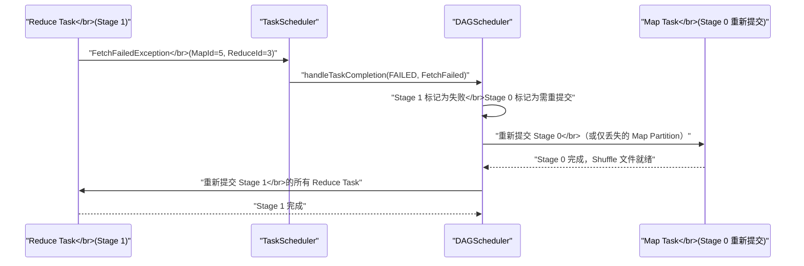

# 01 RDD Lineage 血缘容错：分布式计算的重建之道

## 摘要

Spark 的容错核心是一个极其优雅的设计：不依赖数据副本，不依赖操作日志，而是依靠**记录数据的"来历"（Lineage 血缘）来重建丢失的数据**。一旦某个 RDD 分区因为节点宕机而丢失，Spark 可以沿着 Lineage 追溯其祖先，重新执行那些 Transformation 操作来恢复数据，而不需要付出写磁盘或网络传输的额外代价。但这套机制并非没有代价：窄依赖与宽依赖之间巨大的重算代价差异，决定了哪些算子可以被"便宜地"容错，哪些会因为一次故障而付出极高的重算代价。本文从分布式系统容错的根本矛盾出发，系统剖析 Lineage 的数据结构、两类依赖的本质差异、DAGScheduler 的分区失败恢复流程，以及 Lineage 容错的适用边界与失效场景。

---

## 第 1 章 分布式系统容错的根本矛盾

### 1.1 失败是常态，不是例外

在单机程序中，"节点失败"是一个罕见的边界情况。但在分布式计算系统中，随着参与计算的节点数量增加，失败反而变成了统计意义上的必然事件。

一个简单的概率计算：假设单节点的年故障率是 1%（非常健壮的机器），在一个 1000 节点的集群上，每年预期故障节点数 ≈ 10 台，折合到每天约 0.03 次故障事件。这意味着：只要集群运行超过一个月，就几乎必然经历至少一次节点故障。

对于一个在这 1000 台节点上运行 3 小时的 Spark 作业，节点故障并不是"可能发生"的意外，而是概率上接近确定性的事件。**如何在不中断整个作业的前提下处理局部失败**，是分布式计算框架必须回答的根本问题。

### 1.2 容错的两种经典思路

面对节点失败，工业界有两类经典的容错策略：

**策略一：数据副本（Replication）**

将每一份数据存 N 份副本（N ≥ 2），任意 N-1 个节点失败都不影响数据可用性。这是 [[HDFS]] 的默认策略（3 副本）、Kafka 的 ISR 机制的基础，也是关系数据库高可用的核心手段。

副本策略的优点是**恢复速度快**——数据已经在别处存好了，失败后立即切换到副本即可。代价是**存储放大**——3 副本意味着 3 倍存储开销，加上副本同步的网络带宽消耗，在数据密集型计算中代价极高。

对于 Spark 这样的计算框架来说，中间数据量通常与输入数据量同量级（甚至更大），全量复制每个 RDD 的代价几乎无法接受。

**策略二：操作日志（Write-Ahead Log / Redo Log）**

不复制数据，而是记录每一个对数据的修改操作。恢复时回放日志，重建数据。这是数据库 WAL 的经典设计（[[MySQL]] binlog、InnoDB redo log），也是 Structured Streaming 的 WAL 机制的来源。

日志策略的代价是**写放大**——每次数据修改都要先写日志，增加了延迟和 I/O 量。对于 Spark 的批处理场景（一个算子可以处理数亿条记录），记录每条记录的操作日志会产生天文数字级别的日志量。

**Spark 的第三条路：Lineage 血缘重算**

Spark 选择了一条不同的路：不复制数据，不记录细粒度操作日志，而是记录**粗粒度的 Transformation 操作本身**——即"这个 RDD 是由哪个 RDD 经过什么操作得到的"。

当某个 RDD 的分区数据丢失时，Spark 不需要从副本恢复，也不需要回放日志，而是**重新执行产生这个分区的那条 Transformation 链**——因为 Transformation 是纯函数（对相同输入总产生相同输出），只要上游的数据还在，就能确定性地重建下游的数据。

> [!note] 设计哲学
> Lineage 容错的本质是将"容错状态的存储代价"转化为"容错时的重算代价"。在失败率低的场景下，大多数数据不需要被恢复，因此"不存储就没有代价"——只有当真正发生故障时，才付出重算的代价。这是一个关于期望代价的理性决策：重算代价 × 故障概率 < 副本存储代价，在大多数批处理场景下这个不等式成立。

---

## 第 2 章 RDD Lineage 的数据结构

### 2.1 RDD 是什么

**RDD（Resilient Distributed Dataset，弹性分布式数据集）** 是 Spark 的核心数据抽象。"弹性"（Resilient）正是指它的容错能力：即使部分分区丢失，也能通过 Lineage 重新计算恢复，因此称为"弹性"。

每个 RDD 在逻辑上是一个分区的集合，每个分区包含一组数据记录。但 RDD 本身并不存储数据——它存储的是"如何计算数据"的元数据：

```scala
// RDD 的五大核心属性（org.apache.spark.rdd.RDD 的抽象方法）

// 1. 分区列表：该 RDD 有多少个分区
def getPartitions: Array[Partition]

// 2. 依赖列表：该 RDD 依赖哪些父 RDD（Lineage 的核心）
def getDependencies: Seq[Dependency[_]]

// 3. 计算函数：给定一个分区，如何计算出该分区的数据
def compute(split: Partition, context: TaskContext): Iterator[T]

// 4. 分区器（可选）：键值类型 RDD 的分区策略（如 HashPartitioner）
val partitioner: Option[Partitioner]

// 5. 首选位置（可选）：每个分区优先在哪些节点上计算（数据本地性）
def getPreferredLocations(split: Partition): Seq[String]
```

其中第 2 个属性 `getDependencies` 就是 Lineage 的核心——它定义了这个 RDD 与其父 RDD 之间的依赖关系，构成了有向无环图（DAG）。

### 2.2 Dependency：Lineage 的连接节点

`Dependency[T]` 是 Spark 中表示 RDD 依赖关系的抽象类，有两个主要子类：

**`NarrowDependency[T]`（窄依赖）**：子 RDD 的每个分区最多依赖父 RDD 的有限个分区（通常是 1 个或固定的几个）。

**`ShuffleDependency[K, V, C]`（宽依赖/Shuffle 依赖）**：子 RDD 的每个分区可能依赖父 RDD 的**所有**分区（通过 Shuffle）。

窄依赖还细分为：
- **`OneToOneDependency`**：1 对 1 依赖，如 `map`、`filter`、`flatMap`——子 RDD 的分区 i 只依赖父 RDD 的分区 i
- **`RangeDependency`**：范围依赖，如 `union`——子 RDD 的连续分区范围对应父 RDD 的某个分区范围

这两类依赖的差异，是理解 Lineage 容错代价的关键。

### 2.3 从算子到 Lineage DAG

每次调用 `map`、`filter`、`reduceByKey` 等 Transformation，Spark 都会创建一个新的 RDD，并在新 RDD 的 `dependencies` 中记录对父 RDD 的依赖。多次 Transformation 形成一条链，整体构成一个 DAG（有向无环图）：

```
sc.textFile("hdfs://data.txt")     ← 输入 RDD（HadoopRDD）
  .flatMap(_.split(" "))           ← MapPartitionsRDD（依赖 HadoopRDD，OneToOne）
  .map((_, 1))                     ← MapPartitionsRDD（依赖 上一个，OneToOne）
  .reduceByKey(_ + _)              ← ShuffledRDD（依赖 上一个，ShuffleDependency）
  .saveAsTextFile("hdfs://out/")   ← Action，触发执行
```

这条链就是这个作业的完整 Lineage。每个 RDD 对象中都保存着指向其父 RDD 的引用，只要 Driver 进程不退出，这个 DAG 就永远存在于内存中——即使数据分区因为节点宕机而丢失，Lineage 本身不会丢失，因此随时可以根据它重新计算任何丢失的分区。

---

## 第 3 章 窄依赖 vs 宽依赖：容错代价的根本差异

### 3.1 窄依赖：精准恢复的理想情况

窄依赖的核心特征是：**父分区和子分区之间存在确定性的一对一映射关系**。子 RDD 的分区 i 丢失，只需要重算父 RDD 的分区 i，不影响父 RDD 的任何其他分区，也不影响子 RDD 的其他分区。

以 `filter` 为例：

```
父 RDD（3 个分区）:
  Partition 0: [1, 2, 3, 4, 5]
  Partition 1: [6, 7, 8, 9, 10]  ← 节点宕机，这个分区丢失
  Partition 2: [11, 12, 13]

子 RDD = 父 RDD.filter(_ % 2 == 0):
  Partition 0: [2, 4]             ← 不受影响，不需要重算
  Partition 1: [6, 8, 10]        ← 丢失，需要重算
  Partition 2: [12]              ← 不受影响，不需要重算

恢复动作：
  仅重新计算 Partition 1 所在节点上的计算
  重算代价 = 处理父 Partition 1 的数据量（1/3 的数据）
  不影响其他 2 个分区的数据
```

**窄依赖容错的关键特性**：
1. **局部性**：一个分区丢失，最多引发一个"重算链"，且这条链是确定性的单路径
2. **并发性**：重算可以与其他 Task 并发进行，不阻塞整体进度
3. **代价与数据量成正比**：重算代价 = 丢失分区的数据量 / 总数据量（线性关系）

正是这种局部性和确定性，使窄依赖的容错代价极低——在一个有 1000 个分区的 RDD 中，一个分区丢失，重算代价只有 1/1000。

### 3.2 宽依赖：代价高昂的全局关联

宽依赖（`ShuffleDependency`）的情况截然不同。子 RDD 的每个分区依赖父 RDD 的**所有**分区（通过哈希或范围分区写出到不同的 Shuffle 文件，再被子 RDD 读取）。

以 `reduceByKey` 为例：

```
父 RDD（M 个 Map 分区）:
  Partition 0: [(a,1), (b,2), (c,1)]
  Partition 1: [(a,3), (b,1), (d,2)]  ← Map 节点宕机，Shuffle 文件丢失
  Partition 2: [(a,2), (c,3), (d,1)]

Shuffle 后子 RDD（R 个 Reduce 分区）:
  Partition 0: [(a, 1+3+2), (d, 2+1)]  ← 需要来自全部 M 个父分区的贡献
  Partition 1: [(b, 2+1), (c, 1+3)]   ← 同上
  
若 父 Partition 1 的 Shuffle 文件丢失：
  子 RDD 的 所有 R 个分区都无法完整计算
  恢复动作：重新运行 父 Partition 1 的 Map Task
  重算代价 = 父 Partition 1 的完整数据量（与正常计算代价相同）
  但更严重的是：Stage 级别的 FetchFailedException 可能触发整个 Stage 重试
```

**宽依赖容错的关键特性**：
1. **全局关联**：父分区的 Shuffle 文件丢失，影响子 RDD 的**所有**分区
2. **不可部分恢复**：无法只恢复受影响的子分区，因为无法确定哪些子分区依赖了丢失的父数据
3. **可能引发 Stage 重试**：当 Shuffle 文件丢失时，Reducer Task 抛出 `FetchFailedException`，`DAGScheduler` 通常会重试整个 Map Stage（而不仅仅是丢失的那个 Map Partition）

这就是宽依赖容错代价高的根本原因：**一个父分区的故障，通过 Shuffle 关联，扩散到子 Stage 的所有分区**。

### 3.3 依赖类型与算子的对应关系

| 算子 | 依赖类型 | 容错代价 |
|------|---------|---------|
| `map` | OneToOneDependency | 极低（单分区重算） |
| `filter` | OneToOneDependency | 极低 |
| `flatMap` | OneToOneDependency | 极低 |
| `union` | RangeDependency | 极低 |
| `mapPartitions` | OneToOneDependency | 极低 |
| `coalesce`（无 shuffle） | RangeDependency | 极低 |
| `reduceByKey` | ShuffleDependency | 高（Map Stage 可能整体重试） |
| `groupByKey` | ShuffleDependency | 高 |
| `join`（两侧均 shuffle） | ShuffleDependency × 2 | 高 |
| `sortByKey` | ShuffleDependency | 高 |
| `repartition` | ShuffleDependency | 高 |
| `groupBy` | ShuffleDependency | 高 |

> [!warning] 生产避坑
> 宽依赖（Shuffle）不仅是性能瓶颈（第 01-11 篇 Shuffle 专栏的主题），也是容错代价的瓶颈。一个包含多个 Shuffle Stage 的长链作业，每个 Shuffle 边界都是一个"容错成本放大点"——越靠后的 Stage 发生故障，需要回溯重算的祖先链越长。这是为什么在关键 Shuffle 前合理设置 Checkpoint 非常重要（第 03 篇将详细讲解）。

---

## 第 4 章 DAGScheduler 的分区失败恢复流程

### 4.1 故障感知：从 Task 失败到分区丢失的上报链

Spark 的调度层次是：`DAGScheduler` → `TaskScheduler` → `Executor`。当一个 Executor 上的 Task 失败时，失败信号从 Executor 上报，经过以下链路到达 `DAGScheduler`：

1. **Executor 侧**：Task 抛出异常（如 `OutOfMemoryError`、`IOException`），Executor 捕获异常并向 Driver 的 `TaskScheduler` 发送 `StatusUpdate(FAILED)` 消息

2. **TaskScheduler 侧**：`TaskSchedulerImpl` 收到失败状态后，根据失败类型决定是否重试（Task 级别重试，默认最多 4 次），然后将结果告知 `DAGScheduler`

3. **DAGScheduler 侧**：`DAGScheduler.handleTaskCompletion()` 处理 Task 失败事件。关键的判断节点在这里：
   - 如果是 `FetchFailedException`（Shuffle Fetch 失败，表示上游的 Shuffle 数据不可访问）：将失败的 Stage 和其上游 Map Stage 标记为需要重新提交
   - 如果是普通的 Task 失败（节点宕机、OOM 等）：仅重新提交失败的 Task（如果在重试上限内）

### 4.2 窄依赖失败的恢复路径

对于窄依赖链上的 Task 失败，`DAGScheduler` 的恢复是精细的：

**场景**：一个 3 Stage 作业（`Stage 0 → Stage 1 → Stage 2`，均为窄依赖），`Stage 1` 中的第 3 个 Task（处理分区 2）因为节点宕机失败。

**恢复流程**：
1. `TaskScheduler` 检测到 `Stage 1, Partition 2` 的 Task 失败
2. 第一次失败：`TaskScheduler` 立即在另一个节点上重新提交这个 Task（Task 级别重试）
3. 重新提交的 Task 执行 `stage1.rdd.compute(partition2, ctx)`
4. 由于 `Stage 1` 的输入来自 `Stage 0`（窄依赖，每个分区独立），重新计算 `Partition 2` 不需要 `Stage 0` 的其他分区
5. 如果 `Stage 0` 的 `Partition 2` 的数据已经被缓存（或 `Stage 0` 输出的 Shuffle 文件仍存在），则直接读取；否则递归重算 `Stage 0` 的 `Partition 2`

**关键机制：Task 重试 vs Stage 重试**

`spark.task.maxFailures`（默认 4）控制同一个 Task 的最大重试次数。每次 Task 失败，`TaskScheduler` 先做 Task 级别重试（换一个节点执行），只有超过 `maxFailures` 次才报告给 `DAGScheduler` 做 Stage 级别处理。

对于窄依赖，**绝大多数故障在 Task 级别重试时就能恢复**——换一个节点重跑同一个 Task，成功的概率很高，整个 Stage 感知不到这次失败。

### 4.3 宽依赖失败（Shuffle FetchFailure）的恢复路径

宽依赖失败的恢复更加复杂，因为涉及跨 Stage 的数据依赖。

**场景**：`Stage 0`（Map Stage）→ Shuffle → `Stage 1`（Reduce Stage）。`Stage 0` 中的某个节点宕机，其上的 Shuffle 文件丢失。`Stage 1` 的 Reduce Task 尝试 Fetch 时失败，抛出 `FetchFailedException`。

**恢复流程**：

1. **Reduce Task 抛出 FetchFailedException**：这是一个特殊的异常，携带了失败的 `(MapId, ReduceId)` 信息——即"我尝试从哪个 Map 输出 Fetch 数据失败了"。

2. **TaskScheduler 上报 FetchFailure**：`TaskScheduler` 将 `FetchFailedException` 上报给 `DAGScheduler`，标注这不是普通的 Task 失败，而是上游 Shuffle 数据不可达。

3. **DAGScheduler 的处理**：
   - 将当前的 Reduce Stage（`Stage 1`）标记为失败
   - 将对应的 Map Stage（`Stage 0`）标记为**需要重新提交**（即使 `Stage 0` 之前已经成功完成）
   - 重新提交 `Stage 0` 中所有 Shuffle 文件已丢失的 Map Partition（在实现上，为了简单性，通常重新提交整个 `Stage 0`）

4. **Stage 0 重算完成后**，重新提交 `Stage 1`，Reduce Task 从新的 Shuffle 文件重新 Fetch。



### 4.4 Stage 重试上限与作业失败

`spark.stage.maxConsecutiveAttempts`（默认 4）控制同一个 Stage 的最大连续失败重试次数。如果一个 Stage 连续失败超过这个次数（通常意味着系统性问题，而非偶发节点故障），`DAGScheduler` 会放弃整个作业，Job 失败。

同时，`spark.task.maxFailures`（默认 4）也对单个 Task 的重试次数有上限。注意这两个参数的作用层次不同：
- `maxFailures`：单个 Task 分区的最大重试次数（Task 级别）
- `maxConsecutiveAttempts`：整个 Stage 的最大连续失败次数（Stage 级别，通常由 `FetchFailure` 触发）

---

## 第 5 章 Lineage 容错的代价估算与边界

### 5.1 重算代价的公式化估算

Lineage 容错的实际代价取决于以下因素：

**情形一：窄依赖链中的单分区丢失**

```
重算代价 = Σ(祖先链中每个 Stage 的单分区计算时间)
         ≈ (作业总时间 / 平均分区数) × 祖先 Stage 数
```

对于一个 100 个 Stage（全部窄依赖）、每 Stage 1000 个分区的作业，单分区丢失的重算代价约为总作业时间的 1/1000 × 100 = 0.1%——几乎可以忽略。

**情形二：宽依赖后的 Map Stage 节点宕机**

```
重算代价 = 重新提交的 Map Stage 的完整计算时间
         + Reduce Stage 中所有已计算分区的重算时间
         ≈ 整个作业到该 Stage 的已消耗时间
```

在极端情况下（长链作业、最后一个 Stage 失败），重算代价可以接近整个作业已消耗的全部时间。

**情形三：多个分区同时丢失（节点宕机）**

节点宕机通常导致该节点上**所有**正在运行的 Task 失败，而不是单个。如果一个节点同时承载了多个 Stage 的不同分区，批量失败会触发多条重算链，可能引发级联的 Stage 重试，代价比单分区丢失高出数倍。

### 5.2 Lineage 的深度问题

Lineage 深度（从当前 RDD 追溯到数据源所经过的 Transformation 步数）直接影响重算代价：

**浅 Lineage**（< 10 个 Transformation）：重算速度快，容错代价低，基本不需要额外手段

**深 Lineage**（> 50 个 Transformation）：如果在深层发生故障，需要从头重算整条链，代价可能与整个作业的执行时间相当。**这是 Checkpoint 机制存在的最直接动机**——通过在中间点截断 Lineage，将"从头到尾的重算"变为"从最近的 Checkpoint 开始的重算"（第 03 篇详解）。

典型的深 Lineage 场景：
- 机器学习训练的迭代算法（每次迭代产生 10-20 个新 RDD，100 次迭代后 Lineage 达到数百层）
- 复杂的 ETL 管道（几十个 `join`、`filter`、`map` 算子串联）
- Streaming 应用（每个微批次都在上一个微批次的 RDD 基础上添加操作）

### 5.3 Lineage 容错的根本失效场景

Lineage 容错在以下场景下会完全失效：

**失效场景一：输入数据源不可重放**

Lineage 重算的前提是可以重新读取输入数据。如果输入数据来自：
- 已经被删除或覆盖的文件
- 非幂等的外部接口（如每次读取返回不同数据的 REST API）
- 已经消费并 commit 的 Kafka Topic（Consumer Group 的 offset 已推进）

则 Lineage 重算无法保证结果的正确性（可能读到不同的数据，产生不同的结果）。

**失效场景二：Lineage 中包含非确定性操作**

如果 Transformation 链中包含非确定性操作（如依赖当前时间戳、随机数生成器），重算会产生与原始计算不同的结果。对于纯计算型作业这通常不是问题，但对于依赖 `spark.randomSeed` 等的机器学习算法，需要格外注意。

**失效场景三：Driver 进程崩溃**

Lineage DAG 存储在 Driver 的内存中（`DAGScheduler` 维护的 Stage 和 RDD 对象）。如果 Driver 进程崩溃，Lineage 元数据也随之丢失，无法恢复任何 Task。这就是为什么 Driver 的高可用（`spark.deploy.recoveryMode=ZOOKEEPER`）是生产环境的必要配置，以及为什么 Structured Streaming 的 Checkpoint 必须持久化到可靠存储（HDFS）而不是本地磁盘。

**失效场景四：跨 Shuffle 边界的远距离重算**

当作业有多个 Shuffle Stage，且靠后的 Stage 发生故障时，如果 Spark 决定重新提交整个 Stage 链（而不仅仅是失败的那一个），会引发"级联重算"——重算量可能是原始作业数据量的数倍。在极端情况下，反复的故障和重算会导致作业永远无法完成（Livelock）。

> [!info] 核心概念
> Lineage 容错是一种**乐观容错策略**——它假设故障是罕见的，因此选择"不预防、出了再修"的方式，将容错代价降到零（没有故障时）。与悲观策略（每步都备份）相比，乐观策略在故障率低的场景下效率极高，但在故障频繁（如 Spot 实例大量被抢占）的场景下，代价会急剧增加。这正是需要 Checkpoint（截断 Lineage 降低重算代价）和 WAL（精确一次语义）等补充机制的根本原因。

---

## 第 6 章 Lineage 在生产中的正确使用

### 6.1 利用 RDD.toDebugString 可视化 Lineage

在 Spark Shell 或代码中，可以通过 `rdd.toDebugString` 打印 RDD 的完整 Lineage 树：

```scala
val rdd = sc.textFile("hdfs://data/")
  .flatMap(_.split(" "))
  .map((_, 1))
  .reduceByKey(_ + _)

println(rdd.toDebugString)
```

输出格式如下（缩进表示依赖深度，`ShuffledRDD` 表示 Shuffle 边界）：

```
(200) ShuffledRDD[3] at reduceByKey at <console>:25 []
 +-(1) MapPartitionsRDD[2] at map at <console>:24 []
    |  MapPartitionsRDD[1] at flatMap at <console>:23 []
    |  hdfs://data/ MapPartitionsRDD[0] at textFile at <console>:22 []
    |  HadoopRDD[0] at textFile at <console>:22 []
```

这个调试工具对于以下分析非常有价值：
- 确认算子的依赖类型（窄 vs 宽）
- 识别是否有意外的 Shuffle（如本来以为是窄依赖的算子实际上触发了 Shuffle）
- 确认 Checkpoint 切断 Lineage 后的效果（Checkpoint 后的 RDD 的 Lineage 应该从 Checkpoint 节点开始，而非从数据源）

### 6.2 什么时候 Lineage 足够，什么时候需要 Checkpoint

**只用 Lineage 即可**（不需要 Checkpoint）的条件：
1. Lineage 深度 < 10-20 个 Stage
2. 作业不包含迭代算法（每次迭代不会加深 Lineage）
3. 输入数据可重放（HDFS 文件、可 seek 的数据源）
4. 故障率较低（节点稳定，非 Spot 实例场景）

**需要 Checkpoint 的条件**（任意一条满足即需要）：
1. Lineage 深度 > 20 个 Stage（如机器学习迭代训练）
2. 包含宽依赖，且宽依赖前的计算代价极高（一旦 Map Stage 失败，重算代价无法承受）
3. 输入数据不可重放（如 Kafka 消费后 offset 推进，无法回拨）
4. 需要精确一次语义（如 Structured Streaming 的端到端精确一次）

---

## 小结

RDD Lineage 容错是 Spark 分布式容错体系的基石：

- **本质**：记录"如何产生数据"（粗粒度 Transformation 操作）而非"数据本身"或"每步操作日志"，用重算代价替代存储代价
- **两类依赖的差异**：窄依赖（OneToOne/Range）的容错是局部的、廉价的；宽依赖（Shuffle）的容错是全局的、昂贵的——一个 Map 分区故障，可能触发整个 Map Stage 的重算
- **恢复流程**：Task 失败 → TaskScheduler 重试（最多 4 次） → `FetchFailedException` → DAGScheduler 回滚并重提交 Map Stage → Reduce Stage 重新执行
- **适用边界**：Lineage 对输入数据可重放性、Lineage 深度、Driver 高可用都有隐性依赖；在这些条件不满足时，需要 Checkpoint 等补充机制
- **生产实践**：用 `toDebugString` 诊断 Lineage 深度和 Shuffle 边界；对深 Lineage 的迭代算法和宽依赖前的昂贵计算设置 Checkpoint

第 02 篇将深入 Task 与 Stage 的多级重试机制——不仅包括正常的重试逻辑，还包括推测执行（Speculative Execution）如何在不等待失败的情况下提前应对"慢 Task"问题，以及 `FetchFailedException` 的完整处理链路。

---

## 参考资料

- [Spark 容错机制（博客园）](https://www.cnblogs.com/duanxz/p/6329675.html)
- [Spark RDD 容错原理及四大核心要点](https://www.cnblogs.com/xiaoyh/p/11070549.html)
- [Matei Zaharia 等：Resilient Distributed Datasets: A Fault-Tolerant Abstraction for In-Memory Cluster Computing (NSDI 2012)](https://www.usenix.org/system/files/conference/nsdi12/nsdi12-final138.pdf)
- Apache Spark 源码：`org.apache.spark.scheduler.DAGScheduler`
- Apache Spark 源码：`org.apache.spark.rdd.RDD`
- Apache Spark 源码：`org.apache.spark.Dependency`
