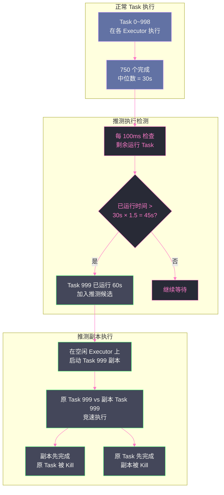

# 02 Task 与 Stage 的多级重试机制

## 摘要

Spark 的调度容错体系是一套严格分层的防御机制。最底层是 **Task 级别重试**（换一个节点重跑同一个分区），中间层是**推测执行（Speculative Execution）**（不等失败，对"慢 Task"提前启动副本），最上层是 **Stage 级别回滚**（当 Shuffle 数据不可达时，回退上游 Stage 重新产出 Shuffle 文件）。这三层机制分别应对三类不同的失败模式：节点故障（Task 硬失败）、性能异常（Task 软失败/慢任务）、数据不可达（Shuffle Fetch 失败）。理解这三层机制的触发条件、判断逻辑和相互关系，是诊断 Spark 作业不稳定、任务重试风暴、Stage 反复失败等生产问题的前提。本文系统梳理 `TaskSchedulerImpl`、`TaskSetManager`、`DAGScheduler` 的核心代码路径，以及生产中的参数调优建议。

---

## 第 1 章 为什么需要多级重试

### 1.1 单层重试的局限

如果只有一层容错——"Task 失败就重跑"——在现实中会遭遇以下困境：

**困境一：Task 重跑无法解决数据不可达**

`FetchFailedException` 不是因为 Reduce Task 自身出问题，而是因为它要读取的 Shuffle 数据不见了（Map 节点宕机）。无论 Reduce Task 在多少个不同节点上重跑，结果都是一样的失败——因为问题的根源在上游 Map Stage，而不在 Reduce Task 本身。

单纯的 Task 级重试对这类问题束手无策，必须回退到 Map Stage 重新产出数据，才能让 Reduce Task 成功。这就需要 **Stage 级别的感知和回滚**。

**困境二：慢 Task 不失败，普通重试没有触发点**

在一个 1000 个 Task 的 Stage 中，某个 Task 因为所在节点磁盘写入变慢，运行时间是其他 Task 的 5 倍。这个 Task 不会抛出异常，不会"失败"——它只是很慢。

普通的失败重试逻辑无法处理这种情况，因为没有失败事件可以触发重试。整个 Stage 必须等待这个最慢的 Task 完成，所有其他 999 个已完成的 Task 只能空等，集群资源白白浪费。这是**推测执行**（Speculative Execution）的价值所在。

**困境三：重试风暴导致集群雪崩**

如果不加控制，一个节点宕机可能导致该节点上所有 Task 同时失败，触发大量重试请求同时涌向其他节点。重试的 Task 占用资源，正常的新 Task 得不到资源，整个集群陷入"重试挤压正常任务"的恶性循环。

多级重试体系通过明确的重试上限（`spark.task.maxFailures`）和 Stage 级别的失败计数（`spark.stage.maxConsecutiveAttempts`）防止这种雪崩。

### 1.2 调度组件的职责边界

在深入各机制之前，先明确三个核心组件的分工：

**`DAGScheduler`（DAG 调度器）**：高层调度器，负责将 RDD DAG 切分成 Stage，管理 Stage 的依赖关系，监控 Stage 级别的成功/失败，处理 `FetchFailedException` 触发的 Stage 回滚。`DAGScheduler` 处理的是**数据依赖层面**的问题——"哪个 Stage 的输出丢失了？"

**`TaskScheduler`（Task 调度器）**：底层调度器（实现类为 `TaskSchedulerImpl`），负责将 `DAGScheduler` 提交的 `TaskSet` 分发给各个 Executor，监控 Task 的执行状态，处理 Task 级别的失败重试和推测执行。`TaskScheduler` 处理的是**执行层面**的问题——"这个分区的 Task 在哪里运行？运行失败了怎么办？"

**`TaskSetManager`**：`TaskScheduler` 为每个 `TaskSet`（一个 Stage 的所有 Task 构成一个 TaskSet）创建的管理对象，维护该 TaskSet 中每个 Task 的运行状态（待运行/运行中/成功/失败）、重试次数、推测执行候选列表。它是 Task 重试和推测执行的实际决策者。

---

## 第 2 章 Task 级别重试：第一道防线

### 2.1 Task 失败的类型

并非所有 Task 失败都值得重试。`TaskSchedulerImpl` 在处理失败的 Task 时，首先区分失败类型：

**可重试的失败（Retriable Failures）**：
- 节点宕机（Executor 失联）
- 普通的运行时异常（`NullPointerException`、`IOException`、临时性 OOM）
- Task 被 YARN 或 K8s 抢占（Preemption）

这些失败通常是偶发性的，换一个节点重跑很可能成功。

**不可重试的失败（Non-Retriable / Fatal Failures）**：
- `TaskKilledException`：Task 被主动 Kill（如 Driver 调用 `sc.cancelJob()`）
- `FetchFailedException`：Shuffle Fetch 失败（这是特殊情况，不走 Task 级重试，直接上报给 `DAGScheduler` 处理）
- 用户代码中显式抛出的 `SparkException` 带有特定标记

### 2.2 重试决策流程

当一个 Task 失败时，`TaskSetManager.handleFailedTask()` 方法执行如下判断：

```
Task 失败事件到达 TaskSetManager
  │
  ├─ 是 FetchFailedException？
  │   └─ 是 → 上报给 DAGScheduler，不做 Task 级重试（走 Stage 回滚路径）
  │
  ├─ 是不可重试失败（Kill 等）？
  │   └─ 是 → 标记 TaskSet 为失败，上报 DAGScheduler 放弃整个 Stage
  │
  └─ 是可重试失败？
      ├─ 该 Task 的失败次数 < spark.task.maxFailures（默认4）？
      │   └─ 是 → 重新加入待调度队列，换一个节点重新提交
      └─ 否 → 该 Task 已达最大重试次数，上报 DAGScheduler 中止作业
```

**关键参数：`spark.task.maxFailures`（默认 4）**

这个参数的语义是：**同一个 Task（同一个分区的计算）最多允许运行失败 4 次**，第 5 次失败时放弃该 Task，整个作业失败。

注意：这里"4 次"是总失败次数，包括第一次失败在内。因此实际上允许 **3 次重试**（第 1 次失败 + 3 次重试 = 4 次尝试）。

> [!warning] 生产避坑
> `spark.task.maxFailures` 是 Task 级别的参数，与推测执行的副本 Task 无关。如果一个 Task 在节点 A 失败 1 次，推测执行在节点 B 启动了副本但也失败了 1 次，这两次失败都累加到同一个"分区"的失败计数器上。在节点大量故障的场景（如云上 Spot 实例被批量回收），`maxFailures=4` 可能很快被耗尽，导致作业失败。此时应适当调大：`spark.task.maxFailures=10`。

### 2.3 重试的调度策略：数据本地性降级

Task 重试时，`TaskScheduler` 不是随机选择一个可用节点，而是遵循**数据本地性（Data Locality）**优先原则，按以下优先级依次尝试：

1. **PROCESS_LOCAL**：数据已在目标 Executor 的内存或磁盘缓存中（最高优先级）
2. **NODE_LOCAL**：数据在目标节点上（HDFS 本地副本或 Executor 已缓存）
3. **NO_PREF**：数据无本地性偏好（如从远端 S3 读取）
4. **RACK_LOCAL**：数据在同一机架的其他节点上
5. **ANY**：任意节点（最低优先级，当高优先级等待超时后降级）

每个优先级都有等待超时时间（`spark.locality.wait` 系列参数，默认 3 秒）。如果等待高优先级节点超时，则降级到下一个优先级。

对于 Task 重试，如果原来的节点宕机（数据本地性丧失），`TaskScheduler` 会在等待本地性超时后，将 Task 调度到 ANY 节点执行。

---

## 第 3 章 推测执行：不等失败的主动防御

### 3.1 慢 Task 问题的本质

在大型 Spark 作业中，"慢 Task"（Straggler Task）是比"失败 Task"更常见的性能杀手。一个 Stage 的完成时间取决于最慢的那个 Task，哪怕只有 0.1% 的 Task 运行极慢，也会让整个 Stage 等待。

慢 Task 的常见成因：
- **硬件问题**：节点磁盘写入变慢（磁盘坏道、RAID 降级）、网络带宽被其他进程占用
- **数据倾斜**：某个分区的数据量远超其他分区（详见 Shuffle 专栏第 03 章）
- **GC 停顿**：某个 Executor 频繁 Full GC，Task 线程被暂停
- **资源争抢**：同一节点上运行了其他重负载进程（如 HDFS DataNode 的大量 I/O）

### 3.2 推测执行的工作原理

推测执行（Speculative Execution）的核心思路：**在一个运行中的 Task 被判定为"可疑地慢"时，在另一个节点上同时启动该 Task 的副本（Speculative Task），哪个先完成就用哪个的结果，另一个被 Kill 掉**。

**开启方式**：
```
spark.speculation=true       # 开启推测执行（默认 false）
spark.speculation.interval=100ms  # 检查间隔（默认100ms）
spark.speculation.multiplier=1.5  # 慢 Task 判定倍数（默认1.5）
spark.speculation.quantile=0.75   # 参考完成比例（默认0.75）
```

**判定逻辑（`TaskSetManager.checkSpeculatableTasks()`）**：

每隔 `spark.speculation.interval`（100ms），`TaskSetManager` 执行一次推测检查：

1. 统计当前 TaskSet 中已完成 Task 的数量。如果完成比例 < `spark.speculation.quantile`（默认 0.75），则跳过检查——推测执行需要有足够多的"参考样本"（已完成的 Task 的运行时间）才能做出可靠的"慢"判断

2. 计算已完成 Task 的**运行时间中位数**（Median Duration）

3. 对于所有仍在运行中的 Task，判断其已运行时间是否 > `中位数 × spark.speculation.multiplier`（默认 1.5 倍）

4. 如果满足条件，且该 Task 还没有启动过推测副本，则将其加入推测候选列表，等待下一个资源空闲的 Executor 来执行

**示例**：一个 TaskSet 有 1000 个 Task：
- 当前已完成 750 个（≥75%，满足检查条件）
- 已完成 Task 的运行时间中位数 = 30 秒
- 判定阈值 = 30 × 1.5 = 45 秒
- 已运行超过 45 秒但还未完成的 Task → 启动推测副本



### 3.3 推测执行的代价与风险

推测执行不是免费的：

**代价一：额外的资源占用**

每个推测副本需要占用一个 Executor 的 CPU 和内存。在集群资源紧张时，启动大量推测副本会抢占正常 Task 的资源，可能导致整体吞吐量下降。

**代价二：非幂等写操作的风险**

如果 Task 包含写操作（如写 HDFS、写 Kafka），原 Task 和推测副本 Task 可能同时写出数据，导致数据重复。

Spark 通过 **Task Attempt ID（`attemptNumber`）** 来区分同一分区的不同尝试。支持推测执行的输出格式（如 Parquet、ORC）会在文件名中嵌入 attemptId，最终 commit 时只保留先完成的那个 Task 的文件。

但对于不支持幂等写的自定义 Sink（如直接写 MySQL 的 `foreachPartition`），推测执行可能导致数据重复写入。**此时应关闭推测执行或在写操作中实现幂等性**。

**代价三：误判慢 Task 为需要推测的 Task**

数据倾斜导致的慢 Task 不是"偶发的慢"，而是"必然的慢"（该分区就是有更多数据）。在这种情况下，推测副本依然要处理同样多的数据，与原 Task 同样慢，推测执行只是多消耗了一份资源，没有加速效果。

对于数据倾斜场景，正确的解法是消除倾斜（Salting、Broadcast Join），而不是依赖推测执行。

> [!info] 核心概念
> 推测执行（Speculative Execution）的设计灵感来自 Google MapReduce 论文（2004 年）中的"Backup Task"机制。原始论文中提到，当一个 MapReduce 作业接近完成时，启动剩余 Task 的"备份副本"，使整体完成时间从"最慢 Task 的时间"缩短为"第二慢 Task 的时间"。Spark 的 Speculative Execution 是这一思想的直接继承，但增加了"完成比例门槛"和"倍数判定"两个精细化条件，以避免过于激进地启动副本。

---

## 第 4 章 Stage 级别重试：FetchFailedException 的完整处理链路

### 4.1 FetchFailedException 是什么

`FetchFailedException` 是 Spark 容错体系中最特殊的一类异常，因为它不是由当前 Task 本身的错误引起的，而是由**上游 Stage 的输出不可达**引起的。

当 Reduce Task 的 `ShuffleBlockFetcherIterator` 尝试从 Map 节点拉取 Shuffle 数据时，经过 `spark.shuffle.io.maxRetries`（默认 3）次重试后仍然失败，就会抛出 `FetchFailedException`，携带如下信息：
- `shuffleId`：哪个 Shuffle
- `mapId`：哪个 Map Task 的输出不可达
- `reduceId`：当前 Reduce Task 的分区号
- `message`：具体失败原因（连接拒绝、超时等）

**关键设计决定**：`FetchFailedException` 不走 Task 级别重试路径，而是直接上报给 `DAGScheduler`。原因是：重试同一个 Reduce Task 无法解决问题，因为 Map 端的数据已经不在了。

### 4.2 DAGScheduler 的 FetchFailure 处理

`DAGScheduler.handleTaskCompletion()` 中对 `FetchFailedException` 的处理逻辑（简化版）：

```
收到 FetchFailedException(shuffleId, mapId, reduceId)
  │
  ├─ 找到对应的 ShuffleMapStage（上游 Map Stage）
  ├─ 将该 ShuffleMapStage 标记为 output locations lost
  │   （即：mapId 对应的 Map Task 输出位置无效）
  │
  ├─ 将当前的 Reduce Stage 标记为失败（需要重新提交）
  │
  ├─ 检查 ShuffleMapStage 的重试次数
  │   ├─ < spark.stage.maxConsecutiveAttempts（默认4）→ 重新提交 ShuffleMapStage
  │   └─ ≥ 上限 → 放弃作业，Job 失败
  │
  └─ ShuffleMapStage 完成后，重新提交 Reduce Stage
```

**为什么通常是重提整个 Map Stage，而不仅仅是失败的那个 Map Partition？**

从理论上说，只需要重新计算丢失的 Map Partition（`mapId` 指向的那一个），其他 Map Partition 的 Shuffle 文件还在。但 Spark 在实现上选择了一个相对保守的策略：

1. 当节点宕机时，通常不只有一个 Map Partition 丢失——该节点上所有 Map Task 的 Shuffle 文件都不可访问。逐个判断哪些 Partition 丢失的代价反而比整体重提高。

2. `MapOutputTracker`（维护所有 Map Task 输出位置的注册表）会将宕机节点上的所有 Map 输出标记为无效，触发对整个 Stage 的重提。

3. Spark 3.x 通过**Push-based Shuffle（RSS）**（见 Shuffle 专栏第 11 篇）在一定程度上缓解了这个问题——Shuffle 数据存在独立的 RSS Worker 上，不随节点宕机而丢失。

### 4.3 Stage 重试的限制：maxConsecutiveAttempts

`spark.stage.maxConsecutiveAttempts`（默认 4）控制同一个 Stage 的最大**连续**失败重试次数。注意"连续"这个关键词：

- 如果 Stage A 失败了 3 次，第 4 次成功，计数器重置为 0
- 如果 Stage A 连续失败了 4 次，不再重试，整个 Job 失败

"连续失败"通常意味着系统性问题，而不是偶发故障——例如：
- 某个 Stage 所需的特定资源始终不可用
- 作业逻辑本身有 Bug，每次运行到相同位置都失败
- 数据损坏，导致特定分区的计算总是失败

在这些情况下，继续重试没有意义，`maxConsecutiveAttempts` 是防止无效重试消耗集群资源的安全阀。

> [!warning] 生产避坑
> 在集群节点频繁宕机（如使用大量 Spot 实例被批量回收）的场景中，`spark.stage.maxConsecutiveAttempts=4` 可能太保守。当一个 Stage 重试 4 次期间，节点宕机反复发生，第 4 次重试的 Shuffle 数据再次丢失，整个 Job 失败。  
> 应对策略：  
> 1. 调大 `spark.stage.maxConsecutiveAttempts=10`  
> 2. 启用 ExternalShuffleService（ESS）或 RSS，使 Shuffle 数据不随 Executor 生命周期消失  
> 3. 在宽依赖前设置 RDD Checkpoint，使上游计算结果持久化到 HDFS，即使 Executor 崩溃也不需要重算

---

## 第 5 章 三层机制的协作与优先级

### 5.1 三层机制的调用链

三层容错机制在调用链上有清晰的优先级：

```
Task 失败事件
   │
   ▼
TaskSetManager.handleFailedTask()
   │
   ├─ 是 FetchFailedException？
   │   └─ 直接上报 DAGScheduler（跳过 Task 重试）
   │       └─ DAGScheduler.handleTaskCompletion()
   │           └─ 触发 Stage 级回滚
   │
   └─ 是普通失败？
       ├─ 失败次数 < maxFailures？
       │   └─ 加入重试队列（Task 级重试）
       │
       └─ 失败次数 ≥ maxFailures？
           └─ 上报 DAGScheduler → Job 失败

（并行运行，独立于失败处理）
TaskSetManager.checkSpeculatableTasks()（每 100ms）
   └─ 对慢 Task 启动推测副本（不等失败，主动触发）
```

### 5.2 三层机制应对不同场景的效果

| 失败场景 | 触发机制 | 恢复路径 | 用户可见影响 |
|---------|---------|---------|------------|
| **单节点偶发宕机** | Task 重试 | 换节点重跑失败 Task | 轻微延迟（通常 < 1 分钟） |
| **节点磁盘变慢（Task 不失败但极慢）** | 推测执行 | 副本先完成，慢 Task 被 Kill | Stage 时间缩短 |
| **Map 节点宕机（Shuffle 文件丢失）** | Stage 回滚 | Map Stage 重算 + Reduce Stage 重算 | 显著延迟（分钟级到十分钟级） |
| **网络抖动（Shuffle Fetch 超时）** | Task 重试（FetchRetry） + Stage 回滚 | 先在 Task 层重试 Fetch，超过 `maxRetries` 后触发 Stage 回滚 | 取决于重试次数和等待时间 |
| **数据倾斜（某 Task 极慢）** | 推测执行（无效！）| 副本同样慢，无法加速 | 倾斜 Task 仍然是瓶颈 |
| **Executor OOM** | Task 重试 | 换节点重跑 | 轻微延迟；若反复 OOM 则 Job 失败 |

### 5.3 推测执行与 Task 重试的互斥处理

一个 Task 可以同时有"正在重试的 Task"和"推测副本 Task"在运行。`TaskSetManager` 通过 **Task Attempt（任务尝试）** 来区分同一分区的不同运行实例：

- 原始 Task：`attemptNumber = 0`
- 第 1 次重试：`attemptNumber = 1`
- 推测副本：`attemptNumber = 1`（与第 1 次重试共享编号）或 `attemptNumber = 2`（视具体情况）

当某个 Attempt 完成时，`TaskSetManager` 会：
1. 将该分区标记为已完成（成功）
2. 向所有其他仍在运行的同分区 Attempt 发送 Kill 信号
3. 通知 `DAGScheduler` 该 Task 成功

这确保同一分区的数据只被处理一次，结果的确定性不受并发执行的影响（前提是 Task 的计算是确定性的——相同输入、相同输出）。

---

## 第 6 章 关键参数与生产调优

### 6.1 Task 重试相关参数

| 参数 | 默认值 | 说明 | 调优建议 |
|------|--------|------|---------|
| `spark.task.maxFailures` | 4 | 同一分区 Task 的最大失败次数（含第一次） | Spot 实例场景调大到 8-10 |
| `spark.blacklist.enabled` | false | 是否开启节点/Executor 黑名单 | 节点频繁失败时开启 |
| `spark.blacklist.task.maxTaskAttemptsPerExecutor` | 1 | 某 Executor 上同一 Task 的最大失败次数 | 默认合理 |
| `spark.blacklist.task.maxTaskAttemptsPerNode` | 2 | 某 Node 上同一 Task 的最大失败次数 | 默认合理 |
| `spark.locality.wait` | 3s | 等待数据本地性的总超时时间 | 数据本地性要求不强时可调小到 1s |

### 6.2 推测执行相关参数

| 参数 | 默认值 | 说明 | 调优建议 |
|------|--------|------|---------|
| `spark.speculation` | false | 是否开启推测执行 | 生产环境建议开启（除非有非幂等写） |
| `spark.speculation.interval` | 100ms | 推测检查间隔 | 默认合理；长 Task 场景可调大到 1s |
| `spark.speculation.multiplier` | 1.5 | 判定"慢"的倍数阈值 | Task 时间差异较大时调大到 2-3 |
| `spark.speculation.quantile` | 0.75 | 启用推测检查所需的完成比例 | 作业末尾慢 Task 多时调小到 0.5 |

**推测执行的适用场景**：

开启推测执行能显著改善性能的场景：
- 硬件异常导致的偶发慢节点（非数据倾斜）
- 大量小 Task（Task 数 >> Executor 数），某几个 Task 慢不会导致严重数据倾斜，但会拖慢整体进度
- 批量 ETL 作业，对完成时间敏感，对资源成本不敏感

不建议开启推测执行的场景：
- 有非幂等写操作（`foreachPartition` 写 MySQL、写 Kafka 非事务模式等）
- 严重数据倾斜（推测执行无效，只浪费资源）
- 资源非常紧张的集群（推测副本会加剧资源争抢）

### 6.3 Stage 重试相关参数

| 参数 | 默认值 | 说明 | 调优建议 |
|------|--------|------|---------|
| `spark.stage.maxConsecutiveAttempts` | 4 | Stage 最大连续失败重试次数 | 节点不稳定时调大到 8-10 |
| `spark.shuffle.io.maxRetries` | 3 | Shuffle Fetch 最大重试次数 | 网络不稳定时调大到 10 |
| `spark.shuffle.io.retryWait` | 5s | Shuffle Fetch 重试等待时间 | GC 导致超时时调大到 30s |

### 6.4 诊断慢 Task 和重试风暴的方法

**在 Spark UI 诊断**：

1. **Stages 页面 → Task 时间分布**：查看 `Max / P75 / Median` 的比值，Max/Median > 3 说明有显著慢 Task

2. **Task 详情页的 `Attempt` 列**：同一 Task ID 出现多条记录（Attempt 0、1、2...）说明该 Task 发生了重试；如果有两个 `Attempt` 同时处于 Running 状态，说明推测执行已触发

3. **Executors 页面**：某个 Executor 的 `Failed Tasks` 计数异常高，说明该节点有问题，考虑手动将其加入黑名单或从集群摘除

**在日志中诊断**：

```
# Task 重试日志
WARN TaskSetManager: Lost task 5.0 in stage 2.0 (TID 25):
  java.io.IOException: ...
INFO TaskSetManager: Starting task 5.1 in stage 2.0 (TID 125, worker-3, ...

# 推测执行日志
INFO TaskSetManager: Starting speculative task 99.1 in stage 2.0 (TID 201, ...)

# Stage 回滚日志
INFO DAGScheduler: Resubmitting ShuffleMapStage 1 (map at ...) due to fetch failure
WARN DAGScheduler: Marking Stage 2 (reduce at ...) as failed due to a fetch failure from Stage 1
```

---

## 第 7 章 Executor 黑名单机制

### 7.1 黑名单的设计动机

Task 重试机制有一个隐患：如果一个节点本身有硬件问题（磁盘故障、内存 ECC 错误），发到这个节点的 Task 会反复失败，消耗大量重试资源。在极端情况下，一个"坏节点"会持续消耗整个集群的重试资源，严重拖慢整体进度。

**黑名单（Blacklist/Exclude）机制**是对这种场景的防御：当一个 Executor 或 Node 上的 Task 失败次数超过阈值，将其加入黑名单，后续 Task 不再调度到该 Executor/Node 上。

> [!info] 核心概念
> Spark 3.1+ 将"Blacklist"改名为"Exclude"（排除机制），相关参数从 `spark.blacklist.*` 统一改为 `spark.excludeOnFailure.*`，但含义相同。本文沿用"黑名单"这一习惯用语。

### 7.2 黑名单的层次

黑名单分两个粒度：

**Executor 黑名单**：某个 Executor 被加入黑名单后，新的 Task 不会调度到该 Executor（但该 Executor 本身还在运行，其他作业的 Task 不受影响）

**Node 黑名单**：某个节点上的所有 Executor 都被加入黑名单后，该节点整体被标记为不可用

黑名单有超时时间（`spark.blacklist.timeout`，默认 1 小时），超时后自动解除黑名单状态。

**关键参数**：
```
spark.blacklist.enabled=true
spark.blacklist.task.maxTaskAttemptsPerExecutor=1   # 同一 Task 在某 Executor 上最多失败1次
spark.blacklist.task.maxTaskAttemptsPerNode=2       # 同一 Task 在某 Node 上最多失败2次
spark.blacklist.stage.maxFailedTasksPerExecutor=2  # 某 Stage 中某 Executor 上最多失败2个 Task
spark.blacklist.application.maxFailedTasksPerExecutor=2  # 整个作业中某 Executor 上最多失败2个 Task
spark.blacklist.timeout=1h                         # 黑名单超时时间
```

---

## 小结

Spark 的三层容错机制协同工作，覆盖了分布式执行中的三类核心失败模式：

- **Task 重试**（`TaskSetManager`）：应对节点宕机、临时异常等硬失败。参数 `spark.task.maxFailures`（默认4）控制单分区的最大失败次数。失败换节点重跑，遵循数据本地性优先降级
- **推测执行**（`TaskSetManager.checkSpeculatableTasks`）：应对慢 Task 的软失败。每 100ms 检查，完成比例 ≥ 75% 且某 Task 运行时间 > 中位数 × 1.5 时启动副本。对数据倾斜无效，对非幂等写有风险
- **Stage 回滚**（`DAGScheduler`）：应对 `FetchFailedException`（Shuffle 数据不可达）。将 Map Stage 标记为需重提交，重算后重新提交 Reduce Stage。参数 `spark.stage.maxConsecutiveAttempts`（默认4）控制最大连续重试次数

三层机制优先级：`FetchFailedException` → Stage 回滚（最高优先级）；普通失败 → Task 重试；慢 Task → 推测执行（并行独立触发）。

第 03 篇将讲解 RDD Checkpoint 机制——当 Lineage 过深、宽依赖前计算代价极高，或 Driver 崩溃重启时需要恢复状态时，如何通过在 HDFS 上物化中间 RDD 来截断 Lineage，从根本上降低容错的重算代价。

---

> [!note] 思考题
> 1. Task 失败后，`TaskSetManager` 会将该 Task 重新加入调度队列进行重试。重试时的数据本地性策略会发生什么变化？如果原来可以做到 `NODE_LOCAL`（数据在本地），但原节点已经宕机，重试的 Task 会被调度到哪里？这对重试 Task 的执行时间有什么影响？
> 2. `spark.task.maxFailures` 默认为 4，即一个 Task 最多重试 4 次。如果超过这个次数，整个作业会以失败状态终止。但有些故障是瞬时的（如网络抖动），有些是持久的（如数据本身有问题导致 Task 始终 OOM）。如何区分这两类故障并设置合理的重试策略？有没有机制能跳过无法处理的"毒数据"分区？
> 3. 推测执行（Speculative Execution）会对慢 Task 启动一个"备份副本"，两者竞速完成。但推测执行假设 Task 是幂等的——相同输入总是产生相同输出且没有副作用。如果 Task 内部包含写外部系统的操作（如写数据库），推测执行可能导致重复写入。`spark.speculation` 的默认值是 `false`，在什么前提条件满足的情况下，才能安全地开启推测执行？

## 参考资料

- [Spark Scheduler 内部原理剖析（腾讯云）](https://cloud.tencent.com/developer/article/1004904)
- [Spark 推测执行详解（CSDN）](https://blog.csdn.net/littlePYR/article/details/104828121)
- [浅析 Spark 推测执行机制（Hackx's Blog）](https://untitled-life.github.io/blog/2019/04/30/a-brief-analysis-of-sparks-speculative-execution-mechanism/)
- [Spark 容错机制（liyichao.github.io）](https://liyichao.github.io/posts/spark-%E5%AE%B9%E9%94%99%E6%9C%BA%E5%88%B6.html)
- Apache Spark 源码：`org.apache.spark.scheduler.TaskSetManager`
- Apache Spark 源码：`org.apache.spark.scheduler.DAGScheduler`
- Apache Spark 源码：`org.apache.spark.scheduler.TaskSchedulerImpl`
