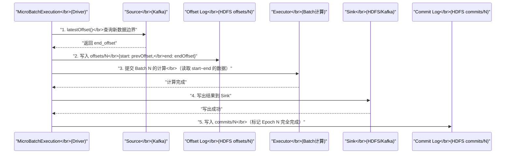

# 04 Structured Streaming 容错模型：Offset 与 Checkpoint

## 摘要

批处理的容错可以通过重跑作业来兜底——代价是时间，但结果是正确的。流处理的容错则复杂得多：数据在持续流入，每条消息只能被处理一次（Exactly-once），Driver 崩溃后必须能从断点续跑而不遗漏也不重复。Spark Structured Streaming 通过一套精心设计的双日志协议实现这一目标：**Offset Log**（记录"处理了哪些数据"）和 **Commit Log**（记录"哪些批次已成功写出"），配合 HDFS 上的 Checkpoint 目录，在 Driver 崩溃重启后完整还原流处理状态。本文系统讲解 Structured Streaming 的微批（Micro-batch）执行模型、Checkpoint 目录的完整结构、Offset 的持久化与提交语义、以及端到端精确一次语义（Exactly-once）的前提条件与边界。

---

## 第 1 章 从批处理到流处理：容错模型的根本转变

### 1.1 批处理容错的"兜底"优势

批处理（Spark Core / Spark SQL）的容错有一个强力的"兜底"手段：**如果作业失败，重跑一遍**。由于批处理的输入数据是静态的（HDFS 文件或数据库快照），只要输入不变，重跑的结果就是确定性正确的。代价只是时间，结果不会出现"数据重复处理"或"数据遗漏"。

这个"可重跑"的特性让批处理容错相对简单——我们在第 01-03 篇讨论的 Lineage 重算、Task 重试、Stage 回滚、Checkpoint，都建立在"输入可以反复读取"这个基本假设之上。

### 1.2 流处理打破了"可重跑"假设

流处理的数据源是持续流入的消息流（如 [[Kafka]]），没有"静态输入"的概念。这带来了三个新挑战：

**挑战一：数据只能消费一次（语义上）**

Kafka 的消费者在消费消息后推进 offset。如果 Driver 崩溃后简单地"从头重跑"，要么从 earliest offset 开始，造成大量数据重复处理；要么从 latest offset 开始，造成崩溃期间的数据被遗漏。

**挑战二：有状态计算的状态必须被持久化**

流处理通常包含有状态操作（如 `groupBy + count`、`window aggregation`、`deduplication`）。这些状态随着数据持续积累。Driver 崩溃后，必须能恢复到崩溃时的状态，而不是从空状态重新开始（那样会丢失所有历史聚合结果）。

**挑战三：Sink 写出可能重复**

崩溃可能发生在"数据已处理完毕"但"还没来得及记录已处理"的时刻。重启后，这批数据会被重新处理并再次写出到 Sink，导致重复。

这三个挑战的核心是同一个问题：**如何在 Driver 崩溃后，准确地知道"已经做了什么、还没做什么"**，从而实现无缝续跑。

### 1.3 Structured Streaming 的解题框架

Structured Streaming（2016 年 Spark 2.0 引入）用一个统一的框架解决上述问题：

**微批（Micro-batch）执行模型**：将无界的流式数据切分成一个个有界的小批次（Batch），每个 Batch 对应一个 Epoch（轮次编号，从 0 开始递增）。每个 Epoch 的处理就是一次标准的批处理 Spark 作业，可以应用批处理的所有容错机制。

**双日志持久化协议**：
- `Offset Log`（偏移量日志）：在处理 Epoch N 之前，将本次要处理的 offset 范围写入持久化日志（HDFS）。这确保了无论何时崩溃，都能知道"下一次应该从哪里开始处理"
- `Commit Log`（提交日志）：在 Epoch N 的结果成功写出到 Sink 之后，将 Epoch N 的 BatchId 写入提交日志。这确保了能区分"已完成写出的 Epoch"和"处理了但未写出的 Epoch"

两个日志配合，构成了一个简化的"两阶段提交"协议，是 Exactly-once 语义的核心保证。

---

## 第 2 章 微批执行模型：Epoch 与 Batch 的生命周期

### 2.1 Epoch 的完整生命周期

Structured Streaming 的核心执行逻辑在 `StreamExecution`（`MicroBatchExecution`）中。每个 Epoch 的处理分为以下严格有序的步骤：

**步骤 1：查询新数据（Source Polling）**

`MicroBatchExecution` 向所有 Source（如 Kafka Source、File Source）查询当前可读取的最新 offset（`latestOffset()`）。这决定了本次 Epoch 要处理哪些数据的上界。

**步骤 2：写入 Offset Log（关键：Before Processing）**

在任何实际数据处理开始之前，将本次 Epoch 的 `{start_offset → end_offset}` 范围写入 Checkpoint 目录下的 `offsets/N` 文件（N = 当前 Epoch 编号）。

**这个步骤的顺序极其关键**：先写 Offset Log，再处理数据。如果反过来，可能出现"数据处理完了但 Offset Log 没写"的情况，崩溃后重启会重复处理同样的数据。先写 Offset Log 确保了：即使在数据处理途中崩溃，重启后也能知道"应该处理这个 offset 范围"——最多是重做一遍，但不会遗漏。

**步骤 3：执行 Batch 计算**

以本次 Epoch 的 offset 范围为输入，执行 DataFrame/Dataset 计算逻辑（等价于一次批处理作业）。包括 Source 的数据读取、各种 Transformation、State Store 的更新（如果有有状态算子）。

**步骤 4：写出到 Sink**

将计算结果写出到配置的 Sink（Kafka、HDFS、Delta Lake 等）。

**步骤 5：写入 Commit Log（关键：After Sink Write）**

Sink 写出成功后，将当前 Epoch 编号写入 Checkpoint 目录下的 `commits/N` 文件。这标志着这个 Epoch 已经"完全完成"——数据处理完毕且已成功写出。



### 2.2 Checkpoint 目录的完整结构

`spark.sql.streaming.checkpointLocation` 指定的 Checkpoint 目录包含以下子目录：

```
hdfs://path/to/checkpoint/
├── metadata            ← 流查询的元数据（queryId、Spark 版本等）
├── offsets/            ← Offset Log（每个 Epoch 一个文件）
│   ├── 0               ← Epoch 0 处理的 offset 范围
│   ├── 1               ← Epoch 1 处理的 offset 范围
│   ├── 2
│   └── ...
├── commits/            ← Commit Log（每个成功完成的 Epoch 一个文件）
│   ├── 0               ← Epoch 0 已完全完成（含 Sink 写出）
│   ├── 1
│   └── ...
└── state/              ← State Store 数据（有状态算子的状态快照）
    ├── 0/              ← 算子 0 的状态
    │   ├── 0/          ← Partition 0 的状态文件
    │   └── 1/
    └── 1/              ← 算子 1 的状态
```

**`metadata` 文件**：存储流查询的唯一 ID（`queryId`，UUID 格式）。这个 ID 在 Sink 幂等性检查中起关键作用——Sink 通过 `(queryId, epochId)` 的组合来判断某次写入是否已经完成过。

**`offsets/` 目录**：每个文件记录对应 Epoch 的 offset 范围，格式是 JSON：
```json
{
  "batchId": 5,
  "sources": [{
    "description": "KafkaV2[...",
    "startOffset": {"topic-0": {"0": 1000, "1": 980}},
    "endOffset": {"topic-0": {"0": 1050, "1": 1025}}
  }]
}
```

**`commits/` 目录**：每个文件记录已完成的 Epoch 编号，格式非常简单（只有一行数字）。

**`state/` 目录**：State Store 的持久化数据，由 `HDFSBackedStateStore` 或 `RocksDBStateStore` 管理（第 06、07 篇详解）。

---

## 第 3 章 崩溃恢复：Driver 重启后如何确定"从哪里开始"

### 3.1 重启时的状态推断逻辑

当 Structured Streaming 应用重启时，`MicroBatchExecution.runActivatedStream()` 首先执行**状态推断**，通过读取 Checkpoint 目录确定下一个要处理的 Epoch：

```
重启时的状态推断：

1. 读取 offsets/ 目录，找到最大的 Epoch 编号 = N_max_offset
2. 读取 commits/ 目录，找到最大的 Epoch 编号 = N_max_commit

比较 N_max_offset 和 N_max_commit：

情形 A：N_max_offset == N_max_commit（例如都是 5）
  → Epoch 5 已完全完成（offset 写了，也 commit 了）
  → 下一个 Epoch = 6
  → 从 offset 5 的 endOffset 开始读取新数据

情形 B：N_max_offset > N_max_commit（例如 offset 最大是 6，commit 最大是 5）
  → Epoch 6 的 offset 已写入，但 commit 没有写
  → 可能情况：
    (a) 数据处理完成但 Sink 写出未完成（需要重做 Sink 写出）
    (b) 数据处理也未完成（需要从头重做 Epoch 6）
  → 重做 Epoch 6：读取 offsets/6 中记录的 offset 范围，重新处理
  → 幂等 Sink 需要去重（同一 epochId 的数据可能已经写过一次）
```

**情形 B 是 Exactly-once 语义的关键挑战点**：Epoch 6 的数据可能已经写出到 Sink（但 commit 没来得及写），重做时会再次写出。这就需要 Sink 的幂等性或事务支持来防止重复（第 05 篇详解）。

### 3.2 恢复后的 Source offset 推进

推断出需要从 Epoch 6 重新开始后，`MicroBatchExecution` 从 `offsets/6` 读取 Epoch 6 的 start_offset 和 end_offset，直接使用这个 offset 范围读取 Kafka（或其他 Source）的数据，而不是重新查询最新 offset。

这保证了恢复的**确定性**——不管重启发生在什么时候，只要 `offsets/6` 存在，Epoch 6 的输入数据就是确定的（同一个 Kafka topic 的同一段 offset 范围），因此计算结果也是确定的（相同输入 + 确定性计算 = 相同输出）。

> [!info] 核心概念
> 这就是为什么 Structured Streaming 要**绕过 Kafka Consumer Group 的 offset 管理**，自己用 Checkpoint 目录来记录和推进 offset。如果使用 Kafka 的 Consumer Group offset（`auto.commit.enable=true`），崩溃后 Kafka 的 offset 可能处于不一致状态——有的 partition 已 commit，有的没有。Structured Streaming 的 Offset Log 是统一的、原子的（一个文件写入的原子性由 HDFS 的写入语义保证），不存在跨 partition 的不一致问题。

---

## 第 4 章 端到端精确一次语义的前提条件

### 4.1 精确一次（Exactly-once）的正确定义

"精确一次"是流处理中最被滥用的词之一。在 Structured Streaming 的语境中，精确一次有明确的定义：

**从 Source 到 Sink，每条消息的处理结果在 Sink 中恰好出现一次。**

注意这个定义包含两层含义：
- **Source 侧**：每条消息都被读取并处理（不遗漏）
- **Sink 侧**：每条消息的处理结果只出现在最终输出中一次（不重复）

Structured Streaming 的 Checkpoint 机制保证了 Source 侧的不遗漏（通过 Offset Log 记录处理进度）。但 Sink 侧的不重复，则**取决于 Sink 自身是否支持幂等写入或事务写入**。

### 4.2 三类 Source 的可重放性要求

Exactly-once 要求 Source 必须是**可重放的（Replayable）**——即给定一个 offset 范围，可以反复读取相同的数据，且每次读取结果相同。

| Source 类型 | 可重放性 | Exactly-once 支持 |
|------------|---------|-----------------|
| **Kafka Source** | ✅ 是（Kafka 保留消息，可按 offset 重读） | ✅ 支持 |
| **File Source**（HDFS/S3） | ✅ 是（文件不变，可反复读） | ✅ 支持 |
| **Delta Lake Source** | ✅ 是（事务日志版本化） | ✅ 支持 |
| **Socket Source** | ❌ 否（实时 socket，无重放） | ❌ 不支持 |
| **Rate Source** | ⚠️ 仅用于测试 | ⚠️ 仅用于测试 |

不可重放的 Source（如 Socket Source）只能提供 At-least-once（至少一次）语义——崩溃后重启可能遗漏数据，因为无法回溯未消费的 socket 数据。

### 4.3 三类 Sink 的幂等性要求

即使 Source 可重放，如果 Sink 不支持幂等写入，重做 Epoch 时会产生重复数据：

| Sink 类型 | 幂等/事务支持 | Exactly-once 支持 |
|----------|------------|-----------------|
| **Kafka Sink**（Spark 3.0+） | ✅ 幂等写（Producer 幂等）或事务写 | ✅ 支持 |
| **File Sink**（HDFS） | ✅ 原子 rename（write-to-temp + rename） | ✅ 支持 |
| **Delta Lake Sink** | ✅ 事务写（基于版本化事务日志） | ✅ 支持 |
| **Foreach/ForeachBatch Sink** | ⚠️ 取决于用户实现 | ⚠️ 用户负责幂等性 |
| **Console Sink** | ❌ 不支持（仅用于调试） | ❌ 仅 At-least-once |
| **JDBC Sink** | ⚠️ 需要用户实现去重逻辑 | ⚠️ 用户负责 |

**File Sink 的幂等实现（write-to-temp + rename）**：

File Sink 写出时，先将每个分区的数据写入临时文件（`_part-0000.xxx.tmp`），所有分区写完后，一次性将临时文件 rename 为正式文件（`part-0000.xxx`）。HDFS 的 rename 操作是原子的（在同一文件系统内），因此要么全部 rename 成功（写出完整），要么全部失败（没有部分写出的中间状态）。

如果在 rename 完成后、Commit Log 写入前崩溃，重启后会重新尝试写出——但此时正式文件已存在，Spark 检测到后会跳过，只写入 Commit Log。

### 4.4 端到端 Exactly-once 的充要条件

**必要条件（Necessary Conditions）**：
1. Source 必须可重放（Kafka、File Source 均满足）
2. Sink 必须支持幂等写入或事务写入
3. Checkpoint 必须配置到可靠存储（HDFS）
4. 流处理计算逻辑必须是确定性的（相同 offset 范围的输入 → 相同输出）

**充分条件（Sufficient Conditions）**——满足以上所有必要条件，且：
5. 没有外部副作用（如调用第三方 API 发送邮件）
6. 没有非确定性函数（如 `current_timestamp()`、`rand()`）

> [!warning] 生产避坑
> `ForeachBatch` Sink 是最常用的自定义 Sink 方式，但它将幂等性责任完全转移给用户。常见的错误写法是直接 UPSERT 到 MySQL：如果 Epoch N 的数据在写入 MySQL 后、写入 Commit Log 前崩溃，重启后会再次写入 MySQL。如果是 INSERT（非 UPSERT），会产生重复行。正确做法是：在 MySQL 中用 `(queryId, epochId)` 作为唯一键做幂等性检查，或使用支持事务的 Delta Lake 作为中间层。

---

## 第 5 章 Checkpoint 目录的清理机制

### 5.1 为什么需要清理旧的 Checkpoint 文件

如果不清理，`offsets/` 和 `commits/` 目录下的文件数量会随着 Epoch 编号单调增长——一个运行 6 个月、每秒一个 Epoch 的流作业，会产生 1500 万个文件。HDFS NameNode 的内存是有限的，大量小文件会严重消耗 NameNode 的元数据空间，甚至导致 NameNode OOM。

### 5.2 自动清理机制

Structured Streaming 有内置的自动清理逻辑（`compactInterval` 和 `minVersionsToRetain`）：

**Offset Log 压缩（Compaction）**：当 `offsets/` 目录中的文件数量超过 `spark.sql.streaming.minBatchesToRetain`（默认 100）时，Structured Streaming 会将旧的 offset 文件合并（Compact）成一个压缩文件（`offsets/compact-N`），然后删除被合并的旧文件。

**Commit Log 清理**：类似的清理逻辑适用于 `commits/` 目录。

**State Store 清理**：State Store 保留最近若干个版本的快照（默认保留最近 2 个），旧版本会被自动清理。

**默认保留策略**：`spark.sql.streaming.minBatchesToRetain=100` 意味着至少保留最近 100 个 Epoch 的日志。这提供了足够的"回滚窗口"——即使需要从 100 个 Epoch 之前的状态恢复，也能找到足够的历史记录。

---

## 第 6 章 Checkpoint 与流查询变更的兼容性

### 6.1 哪些变更与 Checkpoint 兼容

Structured Streaming 的 Checkpoint 存储了流查询的执行状态。当修改查询逻辑后重启时，Spark 会检查新的查询逻辑是否与 Checkpoint 中保存的状态兼容：

**通常兼容的变更**：
- 增加或删除输出列（只要不影响有状态算子的状态 Schema）
- 修改无状态 Transformation（`filter`、`select`、无状态 `map`）
- 修改 Sink 配置（输出路径、格式参数）
- 调整微批触发间隔（`trigger`）

**通常不兼容的变更（会导致恢复失败）**：
- 修改有状态算子（`groupBy` 的 key 变了、`window` 的大小变了）——State Store 中保存的状态 Schema 与新代码期望的 Schema 不匹配
- 修改 Source 的 offset 解释方式（如更改 Kafka 的起始 offset）
- 更改 `queryId`（虽然通常不变，但如果重置 Checkpoint 会生成新 ID）

遇到不兼容的变更时，需要**删除旧 Checkpoint 目录并重新启动**（从最新数据开始，丢弃历史状态），或者**手动迁移 State Store 数据**（极少数情况下可行，通常不推荐）。

### 6.2 检查 Checkpoint 兼容性的方法

```scala
// 启动时检查 Checkpoint 兼容性（Spark 会自动检查，不兼容时抛出异常）
val query = spark.readStream
  .format("kafka")
  .option("kafka.bootstrap.servers", "broker:9092")
  .option("subscribe", "topic")
  .load()
  .writeStream
  .format("delta")
  .option("checkpointLocation", "hdfs://path/to/checkpoint")
  .start()
// 如果 Checkpoint 与当前查询逻辑不兼容，start() 会抛出
// AnalysisException: Detected incompatible evolution in streaming query plan
```

---

## 小结

Structured Streaming 的容错模型建立在三个支柱之上：

- **微批执行模型（Epoch/Batch）**：将流处理切分为一个个确定性的小批处理，每个 Epoch 有确定的输入（offset 范围）和确定的输出，为容错提供了"重做"的基础
- **双日志协议（Offset Log + Commit Log）**：先写 Offset Log（"我要处理这些数据"），处理完成写出后再写 Commit Log（"这些数据已完成"）。两者的差异决定了重启后需要从哪里恢复
- **Checkpoint 目录结构**：`offsets/`（处理进度）、`commits/`（完成进度）、`state/`（有状态计算的状态快照）、`metadata`（查询元数据）协同维护完整的恢复信息

端到端 Exactly-once 不仅依赖 Spark 的 Checkpoint 机制，还需要 **Source 可重放 + Sink 幂等/事务**的联合保证。Kafka Source 和 File/Delta Sink 是原生支持的组合；自定义 Sink 必须自行实现幂等性。

第 05 篇将深入 WAL（Write-Ahead Log）的设计哲学，以及 Sink 幂等性的具体实现机制——为什么 Kafka Sink 能做到 Exactly-once，JDBC Sink 为什么很难，以及 ForeachBatch 的正确幂等写法。

---

> [!note] 思考题
> 1. Structured Streaming 的 Checkpoint 目录包含三类文件：Offset Log（记录每批次的 Source Offset）、Commit Log（记录已提交的批次 ID）、State 文件（有状态算子的状态快照）。如果 Checkpoint 过程中 Driver 宕机（比如在写完 Offset Log 但还没写 Commit Log 时），重启后作业会从哪个批次恢复？会产生重复消费吗？
> 2. Checkpoint 文件会随着流作业运行时间增长而不断积累。Structured Streaming 会定期清理旧的 Checkpoint 文件（通过 `checkpointInterval` 控制保留的批次数量）。如果清理策略过于激进（只保留最近 1 个批次的 Checkpoint），在什么故障场景下会导致作业无法恢复？
> 3. 当 Spark 应用代码发生变更（如修改了 SQL 逻辑或新增了算子）后，能否直接从旧版本的 Checkpoint 恢复？Structured Streaming 对"Checkpoint 兼容性"有什么约束？哪些代码变更是 Checkpoint 兼容的，哪些会强制要求清空 Checkpoint 重新启动？

## 参考资料

- [How Spark Structured Streaming Recovers After Failures](https://www.canadiandataguy.com/p/how-spark-structured-streaming-recovers)
- [Fault tolerance in Apache Spark Structured Streaming](https://www.waitingforcode.com/apache-spark-structured-streaming/fault-tolerance-apache-spark-structured-streaming/read)
- [Apache Spark Structured Streaming and Kafka offsets management](https://www.waitingforcode.com/apache-spark-structured-streaming/apache-spark-structured-streaming-apache-kafka-offsets-management/read)
- [Spark Structured Streaming 官方文档：Fault Tolerance Semantics](https://spark.apache.org/docs/latest/structured-streaming-programming-guide.html#fault-tolerance-semantics)
- Apache Spark 源码：`org.apache.spark.sql.execution.streaming.MicroBatchExecution`
- Apache Spark 源码：`org.apache.spark.sql.execution.streaming.HDFSMetadataLog`
- Apache Spark 源码：`org.apache.spark.sql.execution.streaming.CommitLog`
