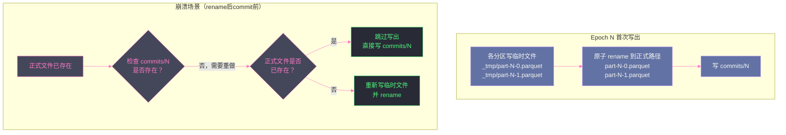

# 05 WAL 与幂等写出：Exactly-once 的两道保险

## 摘要

第 04 篇讲清楚了 Structured Streaming 用 Offset Log + Commit Log 双日志协议来记录处理进度，保证 Source 侧的不遗漏。但这只是 Exactly-once 的"前半段"——Driver 崩溃重启后，引擎知道从哪里开始，但如果崩溃发生在"数据已写出到 Sink、但 Commit Log 还没写入"的瞬间，重启后会对 Sink 进行重复写出，产生重复数据。本文聚焦"后半段"：Sink 侧如何保证幂等写出。核心是两类机制——**WAL（Write-Ahead Log）**（Spark Streaming 时代的旧方案）和**幂等/事务 Sink**（Structured Streaming 的现代方案）。通过剖析 File Sink 的原子 rename、Kafka Sink 的幂等生产者与事务生产者、Delta Lake Sink 的事务日志，以及 ForeachBatch 的正确幂等写法，建立一套完整的"Sink 幂等性设计"知识体系。

---

## 第 1 章 WAL：流处理容错的第一代方案

### 1.1 WAL 是什么，解决了什么问题

**Write-Ahead Log（预写日志，WAL）** 是数据库领域的经典容错技术：在对数据做任何修改之前，先将修改操作记录到一个持久化日志（WAL）中；即使修改过程中崩溃，重启后可以从 WAL 重放（Replay）操作，将数据恢复到崩溃前的状态。

在流处理领域，WAL 被引入 Spark Streaming（DStream 模式）用于解决以下问题：输入数据（如 Kafka 消息）一旦被消费，Kafka 的 offset 就推进了；如果在处理完数据但写出结果之前 Driver 崩溃，这批数据就丢失了（因为 Kafka offset 已经推进，下次不会重新消费）。

WAL 的解法：**在从 Kafka 读取数据后、处理数据之前，先将这批原始数据写入 HDFS 上的 WAL 文件**。崩溃重启后，即使 Kafka offset 已推进，也能从 WAL 中重放这批未完成处理的数据。

### 1.2 Spark Streaming（DStream）中的 WAL 实现

在 DStream 模式下，WAL 由 `WriteAheadLog` 接口及其默认实现 `FileBasedWriteAheadLog` 承担：

```
Kafka → ReceiverTracker
           ↓
     WAL（写入 HDFS: .../receivedData/）
           ↓
     数据处理（DStream 算子链）
           ↓
     输出结果（Output DStream）
```

**WAL 写入格式**：每个 Receiver 的每个批次数据被序列化后，追加写入 HDFS 上的一个 WAL 文件（文件名包含 `startTime-endTime`）。每个批次完成处理后，对应的 WAL 文件被标记为可清理。

**WAL 恢复流程**：Driver 重启后，`RecoveryPointObjectInputStream` 读取未完成处理的 WAL 文件，将其中的数据重新注入处理管道，保证这批数据被处理。

### 1.3 WAL 方案的代价与局限

WAL 在 DStream 时代发挥了重要作用，但它有明显的代价：

**代价一：写入延迟增加**

每批数据的处理必须等待 WAL 写入 HDFS 完成后才能开始。HDFS 写入（序列化 + 三副本同步写）通常需要几十到几百毫秒，这直接增加了每个微批的端到端延迟。

**代价二：双重写入开销**

数据先写 WAL（一次网络传输到 HDFS），再处理，处理完再写出到目标存储（又一次网络传输）。整个流程中数据被传输了至少两次，增加了网络 I/O 和存储开销。

**代价三：仅保证 At-least-once，不保证 Exactly-once**

WAL 保证了数据不丢失（At-least-once），但不能防止重复处理。如果 Driver 在"数据处理完毕 + 结果写出 + WAL 标记为已完成"这三个步骤中的任意位置崩溃，重启后可能重新处理同一批数据，导致结果写出重复。

正是这些局限，推动了 Structured Streaming 转向更简洁的 Offset Log + 幂等 Sink 方案，而不再依赖 WAL。

> [!note] 设计哲学
> Structured Streaming 实际上**不使用 WAL 来保护输入数据**。它依靠 Source 的可重放性（Kafka 的 offset 可以回溯）来代替 WAL——既然 Kafka 可以按 offset 重放任意历史数据，就不需要再额外写一份 WAL 副本。这使得 Structured Streaming 的写入路径更简洁，延迟更低，同时将 WAL 职责转移到 Source 层（Kafka 本身就是最好的 WAL）。

---

## 第 2 章 幂等性：消灭重复的根本手段

### 2.1 幂等性是什么，为什么是流处理的必需品

**幂等性（Idempotency）**：对同一个操作执行多次，结果与执行一次相同。

在数学上：`f(f(x)) = f(x)`

在 Sink 写出的语境中：**同一批数据写出两次（或多次），Sink 中的结果与写出一次相同**。

幂等性为什么对流处理如此重要？因为 Structured Streaming 的容错协议（先写 Offset Log，再处理，再写出，再写 Commit Log）在"写出后 Commit Log 写入前"崩溃时，必然会**重新写出**同一批数据。如果 Sink 不是幂等的，这次重写会产生重复数据。

**不这样会怎样（无幂等性的后果）**：

假设 Epoch 5 的数据处理完毕，写出到 MySQL（INSERT INTO table VALUES ...），写出成功。此时 Driver 崩溃，Commit Log 的 `commits/5` 未写入。

重启后：`offsets/5` 存在，`commits/5` 不存在，Spark 认为 Epoch 5 未完成，重新执行 Epoch 5 的所有步骤，包括再次写出到 MySQL。如果用的是普通 INSERT，MySQL 表中会出现两份 Epoch 5 的数据。

这就是为什么每一个 Sink 的实现者都需要认真回答：**"如果同一个 Epoch 的数据写出两次，我的 Sink 能正确处理吗？"**

### 2.2 两类幂等实现方案

**方案一：基于唯一键的 UPSERT（Upsert-based Idempotency）**

在 Sink 中以 `(queryId, epochId, partitionId)` 或业务主键为唯一键，写出操作使用 INSERT OR REPLACE（MySQL）/ MERGE（Hive/Delta Lake）/ PUT（KV Store）。第二次写出相同数据时，唯一键冲突，操作退化为"覆盖"而非"新增"，结果等同于只写了一次。

**方案二：基于事务的原子提交（Transaction-based Atomicity）**

将整个 Epoch 的写出包装在一个数据库事务中，用 `(queryId, epochId)` 作为事务标识符。写出前先检查该事务是否已提交（读取事务元数据表），如果已提交则跳过，如果未提交则执行写出并提交事务。这是 Delta Lake 和 Kafka 事务 Sink 的核心思路。

---

## 第 3 章 File Sink：原子 rename 的幂等实现

### 3.1 File Sink 的两阶段写出

File Sink（将流处理结果写入 HDFS / S3 文件）是 Structured Streaming 中最简单、最原生支持 Exactly-once 的 Sink。它的幂等实现基于文件系统的**原子 rename** 操作：

**阶段一：写临时文件**

每个分区的数据先写入临时文件（文件名含 `.tmp` 后缀，或写入 `_temporary/` 子目录）。临时文件的命名包含 `(epochId, partitionId, attemptId)`，确保不同 Epoch、不同分区的临时文件互不冲突。

**阶段二：原子 rename**

所有分区的临时文件都写完后，`FileStreamSink` 在 Driver 侧执行一次原子操作：将所有临时文件 rename 为正式文件。HDFS 的 `rename` 操作在同一命名空间内是原子的（要么全部 rename 成功，要么全部失败）。

**幂等性的保证**：如果在 rename 完成后、Commit Log 写入前崩溃，重启后重做 Epoch N 的写出。此时正式文件已存在，`FileStreamSink` 检测到文件已存在且内容与当前 Epoch 匹配，直接跳过写出，只补写 Commit Log。



### 3.2 S3 的 rename 问题

HDFS 的 rename 是真正的原子操作（修改 NameNode 的元数据，不涉及数据移动）。但 **AWS S3 没有原子 rename**——S3 的 rename 实际上是"复制 + 删除"两个步骤，不是原子的。

这导致 File Sink 在 S3 上写出时无法保证 Exactly-once——如果在复制完成但删除临时文件之前崩溃，会产生数据不一致。

解决方案：使用 **Delta Lake** 作为中间层，Delta Lake 基于自己的事务日志（`_delta_log/`）提供原子提交语义，不依赖底层存储的 rename 原子性，在 S3 上也能保证 Exactly-once。

---

## 第 4 章 Kafka Sink：从幂等生产者到事务生产者

### 4.1 Kafka Producer 的三种语义模式

Kafka 的生产者（Producer）有三种语义保证模式，对应不同的可靠性和性能取舍：

**At-most-once（至多一次）**：
- 配置：`acks=0` 或 `acks=1`，不重试
- 语义：Producer 发出消息后不等待确认；如果消息发送过程中网络断开，消息丢失，但不会重发
- 适用：允许丢数据、追求最低延迟的场景

**At-least-once（至少一次）**：
- 配置：`acks=all`，`retries > 0`
- 语义：Producer 重试直到确认消息被写入；网络抖动时可能发送重复消息
- 适用：不允许丢数据、可以接受少量重复的场景（大多数生产 Kafka 配置）

**Exactly-once（精确一次）**：
- 配置：`enable.idempotence=true`（幂等生产者）或 + `transactional.id`（事务生产者）
- 语义：每条消息在每个分区中恰好出现一次，既不丢失也不重复
- 适用：要求精确一次语义的流处理场景

### 4.2 幂等生产者（Idempotent Producer）

**幂等生产者**（Kafka 0.11+ 引入，`enable.idempotence=true`）的工作原理：

Kafka Broker 为每个 Producer 分配一个 **Producer ID（PID）**，Producer 发出的每条消息都携带 `(PID, SequenceNumber)`。Broker 在写入消息前，检查该 `(PID, SequenceNumber)` 是否已写入——如果已写入（说明是重复发送），丢弃这条消息，不写入；如果未写入，正常写入。

这保证了**单个 Producer Session 内**的幂等性：即使 Producer 因为网络超时重发了同一条消息，Broker 只会保留一份。

**局限**：PID 在 Producer 重启后会变化。如果 Spark Streaming 应用重启，新 Producer 有新的 PID，旧的重复消息去重逻辑不再有效。

### 4.3 事务生产者（Transactional Producer）：跨 Epoch 的 Exactly-once

为了解决 Producer 重启后 PID 变化的问题，Kafka 引入了**事务生产者**（`transactional.id`）：

- `transactional.id` 是一个**跨 Producer 实例持久化的唯一标识符**（由用户配置）
- Kafka Broker 为每个 `transactional.id` 维护一个 `ProducerEpoch`（类似版本号）
- 同一个 `transactional.id` 的新 Producer 实例（如应用重启后）会从 Broker 获取当前最新的 `ProducerEpoch`，并终止（Fence）仍在运行的旧 Producer 实例（通过抛出 `ProducerFencedException`）

**Spark Kafka Sink 的 Exactly-once 实现**（Spark 3.0+）：

```
Epoch N 写出流程：

1. 为 Epoch N 创建一个 Kafka 事务（transactional.id = {queryId}-{partitionId}）
2. 在事务中写出 Epoch N 的所有消息到 Kafka Topic
3. 提交事务（commitTransaction()）
4. 写 Commit Log（commits/N）

崩溃恢复流程：

重启后，对于未 Commit 的 Epoch N：
1. 创建新的 Kafka 事务实例（相同的 transactional.id）
2. 新实例从 Broker 获取最新 ProducerEpoch，Fence 掉旧实例
3. 检查旧事务是否已提交：
   - 如果已提交（消息已在 Kafka 中）→ 只写 Commit Log，不重复写消息
   - 如果未提交（旧事务被 abort）→ 重新在事务中写消息，提交事务，写 Commit Log
```

**Kafka 事务 Sink 的配置**：

```scala
val query = df.writeStream
  .format("kafka")
  .option("kafka.bootstrap.servers", "broker:9092")
  .option("topic", "output-topic")
  .option("kafka.enable.idempotence", "true")         // 开启幂等生产者
  .option("kafka.transactional.id", "my-app-tx-id")  // 开启事务生产者
  .option("checkpointLocation", "hdfs://path/to/ckpt")
  .start()
```

> [!warning] 生产避坑
> Kafka 事务 Sink 的 `transactional.id` 必须在多个 Spark Partition 之间保持唯一。Spark 自动在 `transactional.id` 后缀 `partition_index` 来区分不同分区的生产者。如果手动配置了 `transactional.id` 而没有考虑到分区数量，可能导致多个分区的 Producer 使用相同的 `transactional.id`，互相 Fence，写出失败。建议使用 Spark 的自动管理（Spark 3.0+ 的 `KafkaStreamingWrite` 自动处理 `transactional.id` 的分区感知）。

---

## 第 5 章 Delta Lake Sink：事务日志实现的 Exactly-once

### 5.1 Delta Lake 为什么天然适合 Exactly-once

[[Delta Lake]] 是 Databricks 开源的存储层，基于 Parquet 格式并增加了事务日志（`_delta_log/`）。它的事务语义使得 Exactly-once 的实现极为自然：

**Delta Lake 的事务提交协议**：
1. 每次写出操作对应一个 Delta 事务，事务有一个版本号（从 0 单调递增）
2. 写出完成前，新数据以 Parquet 临时文件形式存在
3. 写出完成时，在 `_delta_log/` 中写入一个 JSON commit 文件（`_delta_log/0000...N.json`），记录本次事务添加/删除的文件列表
4. `_delta_log/N.json` 的写入是原子的（HDFS / S3 的原子 PUT 操作），要么整个 commit 文件写入成功，要么不存在

**Exactly-once 的实现**：

Structured Streaming 写出到 Delta Lake 时，每个 Epoch 对应一个 Delta 事务，事务元数据中记录 `(queryId, epochId)`：

```json
// _delta_log/0000000000000000005.json（Epoch 5 的提交记录）
{
  "commitInfo": {
    "timestamp": 1700000000000,
    "operation": "STREAMING UPDATE",
    "operationParameters": {
      "outputMode": "Append",
      "queryId": "abc-def-123-456",
      "epochId": "5"
    }
  },
  "add": {"path": "part-00000-xxx.snappy.parquet", ...},
  "add": {"path": "part-00001-xxx.snappy.parquet", ...}
}
```

重启后，当 Structured Streaming 重做 Epoch 5 时，Delta Sink 写出前先检查 `_delta_log/` 中是否已存在 `queryId=abc-def-123-456, epochId=5` 的提交记录：

- **如果存在**：说明 Epoch 5 已经成功写入 Delta Lake，只需补写 Spark 的 `commits/5` Commit Log，不重复写数据
- **如果不存在**：正常写出，写入新的 Delta commit

这个机制使 Delta Lake 成为 Structured Streaming 的**首选 Sink**——无需额外配置，开箱即支持 Exactly-once。

---

## 第 6 章 ForeachBatch：自定义 Sink 的幂等写法

### 6.1 ForeachBatch 是什么

`foreachBatch` 是 Structured Streaming 提供的"逃生舱"——当内置的 Sink 不满足需求时，允许用户自定义每个 Epoch 的写出逻辑：

```scala
query.writeStream.foreachBatch { (batchDF: DataFrame, epochId: Long) =>
  // 用户自定义写出逻辑
  batchDF.write.jdbc(url, "table", connectionProperties)
}.start()
```

`foreachBatch` 的 `epochId` 参数就是 Epoch 编号，这是实现幂等性的关键——用户可以用 `epochId` 来判断当前批次是否已经写出过。

### 6.2 ForeachBatch 的三种幂等写法

**写法一：先删再插（Delete-then-Insert）**

在同一个事务中：先删除 `epochId = N` 的所有记录，再插入当前批次的数据。无论执行多少次，结果都是只有一份 Epoch N 的数据。

```scala
query.writeStream.foreachBatch { (batchDF: DataFrame, epochId: Long) =>
  batchDF.createOrReplaceTempView("updates")
  
  // 在同一个事务中执行（需要 JDBC 数据库支持事务）
  spark.sql(s"""
    DELETE FROM target_table WHERE epoch_id = $epochId
  """)
  spark.sql(s"""
    INSERT INTO target_table
    SELECT *, $epochId as epoch_id FROM updates
  """)
}.start()
```

**写法二：幂等 MERGE（UPSERT）**

以业务主键为唯一键，使用 MERGE/UPSERT 语义写出。重复写出时，相同主键的记录被覆盖（而非新增），不产生重复行。

```scala
query.writeStream.foreachBatch { (batchDF: DataFrame, epochId: Long) =>
  // 使用 Delta Lake 的 MERGE 语义（推荐）
  import io.delta.tables._
  
  val deltaTable = DeltaTable.forPath(spark, "/path/to/delta-table")
  deltaTable.as("target")
    .merge(
      batchDF.as("source"),
      "target.id = source.id"  // 以业务主键为合并条件
    )
    .whenMatched().updateAll()
    .whenNotMatched().insertAll()
    .execute()
}.start()
```

**写法三：基于 epochId 的幂等检查**

在写出前先检查该 `epochId` 是否已经写出过（查询一个专门的"写出记录表"），如果已写出则跳过。

```scala
query.writeStream.foreachBatch { (batchDF: DataFrame, epochId: Long) =>
  val conn = DriverManager.getConnection(jdbcUrl)
  
  // 检查 epoch 是否已完成
  val stmt = conn.prepareStatement(
    "SELECT count(*) FROM streaming_epoch_log WHERE query_id = ? AND epoch_id = ?"
  )
  stmt.setString(1, queryId)
  stmt.setLong(2, epochId)
  val rs = stmt.executeQuery()
  rs.next()
  val alreadyDone = rs.getInt(1) > 0
  
  if (!alreadyDone) {
    // 实际写出
    batchDF.write.mode("append").jdbc(jdbcUrl, "target_table", props)
    
    // 记录完成
    val logStmt = conn.prepareStatement(
      "INSERT INTO streaming_epoch_log (query_id, epoch_id) VALUES (?, ?)"
    )
    logStmt.setString(1, queryId)
    logStmt.setLong(2, epochId)
    logStmt.execute()
  }
  conn.close()
}.start()
```

> [!warning] 生产避坑
> 写法三中，"写出数据"和"记录完成"这两个步骤必须是原子的（在同一个数据库事务中）。如果数据写完了、`epoch_log` 插入前崩溃，重启后不会检测到"已写出"，会重复写出数据。使用 MySQL 时，应将两个操作放在 `START TRANSACTION ... COMMIT` 中，或使用支持原子 INSERT 的 `INSERT INTO ... ON DUPLICATE KEY UPDATE`。

---

## 第 7 章 实践：不同 Sink 的 Exactly-once 能力速查

### 7.1 常见 Sink 的语义保证矩阵

| Sink 类型 | 幂等机制 | Exactly-once 支持 | 前提条件 |
|----------|---------|-----------------|---------|
| **File Sink（HDFS）** | 原子 rename | ✅ 原生支持 | HDFS（S3 不支持原生 rename） |
| **File Sink（S3）** | 无原子 rename | ❌ At-least-once | 需要 Delta Lake 中间层 |
| **Delta Lake Sink** | 事务日志 + `(queryId, epochId)` | ✅ 原生支持 | 需要 Delta Lake 依赖 |
| **Kafka Sink（幂等生产者）** | PID + SequenceNumber | ✅ 单 Session | Producer 重启后 PID 变化 |
| **Kafka Sink（事务生产者）** | transactional.id + ProducerEpoch | ✅ 完整支持 | Spark 3.0+，需配置 `transactional.id` |
| **JDBC Sink（ForeachBatch）** | 用户实现 | ⚠️ 取决于实现 | 需要用户保证幂等性 |
| **Elasticsearch Sink** | `_id` 字段 UPSERT | ✅ 可实现 | 需要稳定的文档 ID |
| **HBase Sink** | Row Key Put 幂等 | ✅ 可实现 | HBase Put 天然幂等 |
| **Console Sink** | 无 | ❌ 仅 At-least-once | 仅用于调试 |

### 7.2 ForeachBatch 的 queryId 获取

`foreachBatch` 的回调只提供 `epochId`，没有直接提供 `queryId`。需要在 `writeStream.start()` 之后从 `StreamingQuery` 对象获取：

```scala
// 方式一：使用 StreamingQuery.id
val query = df.writeStream
  .foreachBatch { (df, epochId) =>
    // queryId 在外部声明后传入（闭包捕获）
    writeWithIdempotency(df, epochId, queryId)
  }
  .start()

val queryId = query.id.toString  // UUID，在 Checkpoint 中持久化，重启后不变

// 注意：query.id 与 query.runId 不同！
// query.id：每次 start 时如果 Checkpoint 存在，id 保持不变（持久化的唯一标识）
// query.runId：每次 start() 都会生成新的 runId
// 用于幂等性检查的应该是 query.id（不随重启变化）
```

---

## 小结

Exactly-once 语义是流处理的"圣杯"，需要 Source 可重放和 Sink 幂等/事务的联合保证：

- **WAL（DStream 时代）**：先写日志再处理的经典方案，代价是双写延迟和存储开销，只能保证 At-least-once。Structured Streaming 用 Source 可重放性替代了 WAL
- **File Sink 原子 rename**：HDFS 上天然支持，S3 需要 Delta Lake 补充
- **Kafka 事务生产者**：通过 `transactional.id` 和 `ProducerEpoch` 跨 Session 保证幂等，Spark 3.0+ 官方支持
- **Delta Lake 事务日志**：以 `(queryId, epochId)` 为事务标识，原子 commit，最简洁的 Exactly-once Sink
- **ForeachBatch 自定义 Sink**：三种幂等写法（Delete-then-Insert、UPSERT MERGE、epochId 检查表），必须保证"写出"和"记录完成"在同一事务中

第 06 篇将深入 Structured Streaming 有状态计算的核心——State Store，讲解 `HDFSBackedStateStore` 的内存数据结构（HashMap + delta）、快照写出机制、版本管理与回滚，以及有状态算子（`groupBy aggregation`、`deduplication`、`flatMapGroupsWithState`）如何与 State Store 交互。

---

> [!note] 思考题
> 1. WAL（Write-Ahead Log）通过在处理数据前先将数据记录到持久化日志来保证"至少一次"语义。但 WAL 引入了双倍的写放大（先写 WAL，再处理数据）。Spark Streaming（DStream）的 WAL 方案在高吞吐场景下会产生多大的额外 I/O 开销？Structured Streaming 为什么选择放弃 WAL 转而依赖 Source 的"可重放"特性？
> 2. 幂等写出要求"相同的输入写出相同的输出且不重复"。Kafka 作为 Sink 支持事务性写入（Kafka Transactions），可以实现精确一次语义。但 Kafka 事务有性能代价——事务性 Producer 的吞吐量比非事务性低约 20-30%。在什么业务场景下，这个性能代价是值得的，而在什么场景下"至少一次 + 下游幂等"是更好的权衡？
> 3. 文件系统 Sink（如写 HDFS 或 S3）通过"先写临时文件，成功后原子 rename"来实现幂等写出。但 S3 不支持真正的原子 rename（`rename` 在 S3 上是 copy + delete 操作），这破坏了幂等写出的原子性保证。在使用 S3 作为 Sink 时，Spark 和 Hadoop FileSystem 层是如何用变通手段解决这个问题的？这些手段在什么边界条件下会失效？

## 参考资料

- [Spark Structured Streaming Exactly-Once Guarantees（singdata.com）](https://www.singdata.com/trending/spark-structured-streaming-exactly-once-guarantees/)
- [Exactly Once Processing with Spark Structured Streaming（Medium）](https://sbanerjee01.medium.com/exactly-once-processing-with-spark-structured-streaming-f2a78f45a76a)
- [How does Structured Streaming ensure exactly-once for File Sink（StackOverflow）](https://stackoverflow.com/questions/57704664)
- [Spark 官方文档：Fault Tolerance Semantics](https://spark.apache.org/docs/3.5.1/structured-streaming-programming-guide.html#fault-tolerance-semantics)
- [Delta Lake 官方文档：Structured Streaming with Delta Lake](https://docs.delta.io/latest/delta-streaming.html)
- Apache Kafka 文档：Exactly-Once Semantics（KIP-98）
- Apache Spark 源码：`org.apache.spark.sql.kafka010.KafkaStreamingWrite`
- Apache Spark 源码：`org.apache.spark.sql.execution.streaming.FileStreamSink`
