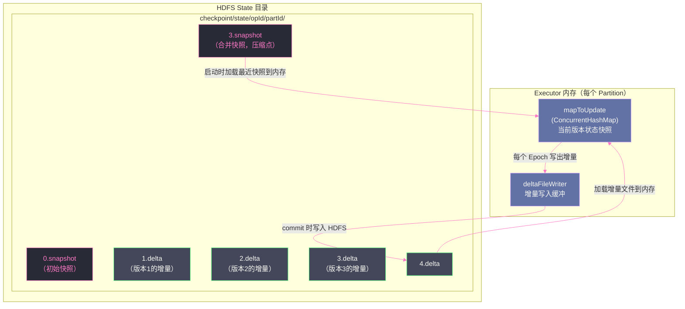

# 06 State Store 内幕：HDFSBackedStateStore 的读写路径

## 摘要

流处理中的"有状态"是什么意思？是指计算的结果不仅取决于当前微批次（Epoch）的数据，还取决于历史微批次积累的"记忆"——这份"记忆"就是 State（状态）。如果 Driver 崩溃，这份记忆必须能恢复，否则历史聚合数据全部丢失，流处理就毫无意义。Spark Structured Streaming 的有状态计算依赖 **State Store** 这一抽象层来管理状态的读写与持久化。State Store 的默认实现 `HDFSBackedStateStore` 采用了一套"内存 HashMap + HDFS 增量文件（Delta File）+ 定期快照（Snapshot）"的三层存储架构，在性能与可靠性之间取得了精心的平衡。本文深度解析这套架构的工作原理：每个微批次如何读写状态、增量文件如何写出到 HDFS、快照合并如何控制文件数量、版本管理如何支持故障回滚，以及哪些有状态算子使用了 State Store，它们与 State Store 交互的完整路径。

---

## 第 1 章 有状态计算的挑战：为什么状态管理如此复杂

### 1.1 无状态算子与有状态算子的本质区别

在 Structured Streaming 中，算子分为两大类：

**无状态算子（Stateless Operators）**：每个 Epoch 的计算完全独立，只依赖当前 Epoch 的输入数据，不依赖历史数据。`filter`、`select`、无聚合的 `map`、`flatMap` 都是无状态算子。这类算子的容错很简单——Epoch N 失败了，重跑 Epoch N 的输入数据即可，不需要知道 Epoch N-1 产生了什么。

**有状态算子（Stateful Operators）**：计算结果依赖当前 Epoch 输入 + 历史积累的状态。典型的有状态算子：

- **流聚合（Streaming Aggregation）**：`groupBy(...).count()` 需要记住"到目前为止每个 key 的计数是多少"
- **去重（Deduplication）**：`dropDuplicates("id")` 需要记住"哪些 id 已经见过了"
- **时间窗口聚合（Window Aggregation）**：`window(...).sum(...)` 需要记住每个窗口中各 key 的累计值
- **自定义有状态处理**：`mapGroupsWithState`、`flatMapGroupsWithState`，用户定义的任意 key → state 映射

有状态算子的容错要求远高于无状态算子：**不仅要保证当前 Epoch 的计算可以重做，还要保证历史状态的完整性**。如果 Driver 崩溃后丢失了所有历史状态，流聚合从零开始，去重功能失效（已去重的 id 重新出现），时间窗口聚合的历史数据全部归零——这等同于流处理应用完全失效。

### 1.2 状态数据的规模挑战

有状态算子的状态数据量随时间增长。一个去重应用如果处理的数据有 10 亿个唯一 id，State Store 需要记住这 10 亿个 id；一个按用户聚合的流聚合，如果用户数是 1 亿，State Store 需要维护 1 亿个 key 的聚合状态。

这带来两个挑战：

**内存挑战**：状态数据远超单个 Executor 的内存容量。如果状态全部放内存，Executor OOM 是迟早的事。

**持久化挑战**：每个微批次都可能修改大量状态（更新已有 key、新增新 key、删除过期 key）。如果每次都将全量状态写入 HDFS，I/O 开销巨大。

`HDFSBackedStateStore` 的设计必须同时应对这两个挑战：既要内存中快速读写，又要以最低代价将状态持久化到 HDFS。

---

## 第 2 章 HDFSBackedStateStore 的三层存储架构

### 2.1 总体架构概览

`HDFSBackedStateStore` 的存储架构分三层：



**第一层：内存 HashMap（`mapToUpdate`）**

每个 Executor 上、每个状态分区（`partitionId`）对应一个 `HDFSBackedStateStore` 实例，其核心是一个 `ConcurrentHashMap<UnsafeRow, UnsafeRow>`（key → value 的内存表）。这个 HashMap 维护的是**当前版本的完整状态快照**，支持 O(1) 的读写操作。

**第二层：HDFS 增量文件（Delta Files，`N.delta`）**

每个 Epoch（版本 N）的状态变更（新增、更新、删除的 key-value 对）被序列化后写入一个增量文件 `N.delta`。增量文件只记录变化量，而不是全量状态。

**第三层：HDFS 快照文件（Snapshot Files，`N.snapshot`）**

每隔若干个版本（默认每 200 个 delta），将当前内存 HashMap 的完整状态序列化，写入一个快照文件 `N.snapshot`。快照文件代替了之前所有 delta 文件的叠加效果，用于加速状态恢复（直接加载快照，不需要从头叠加所有 delta）。

### 2.2 状态文件的命名规则与目录结构

State Store 的文件存储在 Checkpoint 目录的 `state/` 子目录下，按**算子编号（operatorId）+ 分区编号（partitionId）**两级目录组织：

```
checkpoint/state/
├── 0/                      ← 第 0 个有状态算子（如 groupBy）
│   ├── 0/                  ← 分区 0 的状态
│   │   ├── 0.snapshot      ← 初始空快照（版本 0）
│   │   ├── 1.delta         ← 版本 1 的增量（Epoch 1 的状态变更）
│   │   ├── 2.delta
│   │   ├── ...
│   │   ├── 200.snapshot    ← 版本 200 的压缩快照
│   │   ├── 201.delta
│   │   └── ...
│   ├── 1/                  ← 分区 1 的状态
│   └── ...
└── 1/                      ← 第 1 个有状态算子（如 dropDuplicates）
    └── ...
```

**关键设计**：每个状态分区的文件独立管理。这意味着不同分区的状态版本可以独立推进——一个 Executor 崩溃只影响其负责的分区，不影响其他分区的状态。

---

## 第 3 章 每个 Epoch 的状态读写路径

### 3.1 状态读取：getStore(version)

在每个 Epoch 开始时，有状态算子通过 `StateStoreProvider.getStore(version)` 获取对应版本的 State Store：

```scala
// StateStoreProvider 的核心读取逻辑（简化）
def getStore(version: Long): StateStore = {
  // 1. 找到最近的快照版本（不超过 version 的最大快照）
  val snapshotVersion = findLatestSnapshotVersionBeforeOrEqual(version)
  
  // 2. 从 HDFS 加载快照文件到内存 HashMap
  val map = loadSnapshot(snapshotVersion)
  
  // 3. 依次加载 snapshotVersion+1 到 version 之间的所有 delta 文件
  for (v <- (snapshotVersion + 1) to version) {
    applyDelta(map, loadDelta(v))
  }
  
  // 4. 返回以该 HashMap 为基础的 StateStore 实例
  new HDFSBackedStateStore(version, map, ...)
}
```

**举例**：当前最近的快照是 `200.snapshot`，需要恢复到版本 215：
1. 加载 `200.snapshot` → 得到版本 200 的完整状态
2. 依次加载 `201.delta`、`202.delta`、...、`215.delta`，将每个增量应用到 HashMap 上
3. HashMap 中现在是版本 215 的完整状态

**性能分析**：快照到当前版本之间最多有 200 个 delta 文件（因为每 200 个 delta 合并一次快照），因此恢复时最多加载 200 个增量文件。每个 delta 文件只包含该版本的变更，通常远小于全量快照。这个设计将恢复时间控制在可接受范围内。

### 3.2 状态写入：put / remove

在 Epoch N 的计算过程中，有状态算子对 State Store 进行读写操作：

**读操作（get）**：直接从内存 HashMap 读取，O(1) 时间复杂度，不涉及任何 I/O。

```scala
// 获取某个 key 的当前状态
val currentState: UnsafeRow = store.get(keyRow)
```

**写操作（put）**：
1. 更新内存 HashMap（`mapToUpdate.put(key, value)`）
2. 同时将 `(key, value)` 序列化追加写入内存缓冲区（`deltaFileWriter`）——这是为 commit 时写出 HDFS 做准备

**删除操作（remove）**：
1. 从内存 HashMap 删除该 key（`mapToUpdate.remove(key)`）
2. 在 delta 文件缓冲中写入一条"删除标记"（tombstone）：`(key, null)` 表示该 key 已被删除

**为什么需要删除标记而不是真的删除？**

因为 delta 文件是追加写入的（Append-only），无法从已写入的文件中"撤销"一条记录。用 tombstone（墓碑标记）表示删除，在恢复时加载 delta 后，遇到 tombstone 就从 HashMap 中删除对应的 key。这是 [[LSM Tree]]（Log-Structured Merge Tree）风格的经典设计。

### 3.3 提交（commit）：将增量写入 HDFS

Epoch N 的计算完成后，调用 `store.commit()` 将本次的增量持久化到 HDFS：

```scala
// HDFSBackedStateStore.commit() 核心逻辑（简化）
def commit(): Long = {
  // 1. 将内存 deltaFileWriter 的缓冲数据写入 HDFS
  //    文件路径：checkpoint/state/{opId}/{partId}/{version}.delta
  val deltaFile = new Path(storeDir, s"$newVersion.delta")
  writeToHDFS(deltaFileBuffer, deltaFile)
  
  // 2. 更新当前版本号
  currentVersion = newVersion
  
  // 3. 判断是否需要做快照（每 snapshotInterval 个版本做一次）
  if (currentVersion % snapshotInterval == 0) {
    doSnapshot()  // 异步快照，不阻塞当前 Epoch
  }
  
  currentVersion
}
```

**commit 的时序保证**：`commit()` 完成（HDFS delta 文件写入成功）后，Structured Streaming 才会推进 Offset Log 和 Commit Log。这保证了：只要 Commit Log 中记录了 Epoch N 已完成，State Store 中对应版本的 delta 文件就一定已写入 HDFS。

**失败时的回滚（abort）**：如果 Epoch N 的计算中途失败（Task 失败、Executor 崩溃），`store.abort()` 被调用，内存 HashMap 回滚到版本 N-1 的状态，HDFS 上不会留下不完整的 delta 文件（因为 delta 文件的写入和 commit 是原子的——要么完整写入并 rename，要么不写）。

---

## 第 4 章 快照机制：控制文件数量与恢复代价

### 4.1 为什么需要快照

如果只有 delta 文件，没有快照，那么从状态版本 0 恢复到版本 10000，需要依次加载 10000 个 delta 文件。即使每个 delta 文件很小，加载 10000 个文件的 I/O 开销和元数据操作（NameNode 的 listStatus 等）也会非常慢，导致：
- 应用重启后状态恢复时间极长（分钟级甚至小时级）
- HDFS 上积累大量小文件，消耗 NameNode 元数据空间

快照解决这两个问题：定期将完整状态写入一个文件，之后的恢复从最近的快照开始，只需加载快照之后的少量 delta 文件。

### 4.2 快照的触发条件

`HDFSBackedStateStoreProvider` 维护一个 `snapshotInterval` 参数（通过 `spark.sql.streaming.stateStore.maintenanceInterval` 控制，默认 60 秒，触发机制实际上基于版本数）。

具体来说，每当 State Store 完成 `commit()` 后，如果当前版本号满足 `version % snapshotInterval == 0`（其中 `snapshotInterval` 默认对应每 200 个 delta），触发一次快照写入。

**快照写入过程**：
1. 遍历内存 HashMap 的所有 key-value 对
2. 将它们序列化写入临时文件（`checkpoint/state/{opId}/{partId}/{version}.snapshot.tmp`）
3. 写完后原子 rename 为正式快照文件（`{version}.snapshot`）

**快照是异步的**：为了不阻塞当前 Epoch 的执行，快照写入在一个后台线程（`MaintenanceTask`）中异步执行。这意味着快照可能比当前版本"落后"几个版本，但不影响正确性——恢复时只需加载最近的快照 + 之后的 delta 文件。

### 4.3 旧文件的清理

每次快照完成后，`MaintenanceTask` 会清理可以被合并的旧 delta 文件：

```
清理策略：
- 保留最近 minVersionsToRetain（默认 2）个快照版本
- 保留这些快照之后的所有 delta 文件
- 删除更旧的快照和 delta 文件
```

**举例**：`minVersionsToRetain=2`，当前有快照 200 和快照 400：
- 保留：`200.snapshot`、`201.delta`～`400.delta`、`400.snapshot`、`401.delta`～（当前最新）
- 删除：早于 `200.snapshot` 的所有文件

这确保了：即使最新快照损坏，仍然可以从前一个快照（如 `200.snapshot`）+ 之后的 delta 恢复到任意版本。

---

## 第 5 章 有状态算子与 State Store 的交互

### 5.1 流聚合（Streaming Aggregation）

`groupBy(...).agg(...)` 是最常见的有状态算子。在 Append 模式下，State Store 中每个 key 保存的是该 key 当前的聚合状态（如 `(key, count)` 或 `(key, sum)`）。

**每个 Epoch 的处理流程**：
1. 从 State Store 读取当前 Epoch 输入数据中涉及到的 key 的当前状态
2. 用当前 Epoch 的新数据更新状态（`state.count += newCount`）
3. 将更新后的状态写回 State Store（`store.put(key, newState)`）
4. 对于已过期的 key（基于 Watermark），从 State Store 删除并输出最终结果

**状态 Schema**：State Store 中的 key 和 value 都是 `UnsafeRow` 格式（Tungsten 的二进制格式）。key 是 `groupBy` 的列组合，value 是聚合状态（聚合函数的中间状态，如 `SumState`、`CountState`）。

### 5.2 去重（Deduplication）

`dropDuplicates("id")` 的 State Store 存储的是"已见过的 id 集合"。

**状态格式**：key = id 值，value = 占位符（通常是空 Row 或时间戳）

**每个 Epoch 的处理**：
1. 对当前 Epoch 的每条记录，检查其 id 是否在 State Store 中存在
2. 如果存在（已去重）：丢弃这条记录
3. 如果不存在（首次出现）：输出这条记录，并将 id 写入 State Store

**问题**：没有 TTL 的去重 State 会无限增长——每个新出现的 id 都会永久存在于 State Store 中。对于高基数（High Cardinality）的 id，State Store 很快会撑爆内存。这是为什么去重操作通常需要配合 Watermark 来设置 TTL（第 08 篇详解）。

### 5.3 mapGroupsWithState / flatMapGroupsWithState

这是 Structured Streaming 提供的最灵活的有状态算子，允许用户完全自定义状态的数据结构和状态转换逻辑：

```scala
case class UserState(lastSeen: Timestamp, count: Int)

def updateUserState(
  userId: String,
  events: Iterator[Event],
  state: GroupState[UserState]
): Unit = {
  // 读取当前状态
  val currentState = if (state.exists) state.get else UserState(null, 0)
  
  // 更新状态
  val newCount = currentState.count + events.size
  state.update(UserState(Timestamp.now(), newCount))
  
  // 设置超时（超时后自动删除状态）
  state.setTimeoutDuration("1 hour")
}

val query = events
  .groupByKey(_.userId)
  .mapGroupsWithState(GroupStateTimeout.ProcessingTimeTimeout)(updateUserState)
```

State Store 在这里存储的是 `(userId, UserState)` 映射，用户自定义的 `UserState` 被序列化（Kryo 或 Java 序列化）后存入 State Store 的 value 字段。

---

## 第 6 章 State Store 的内存管理与 OOM 风险

### 6.1 内存压力的来源

`HDFSBackedStateStore` 的内存消耗来自两部分：

**部分一：mapToUpdate（主 HashMap）**

`ConcurrentHashMap<UnsafeRow, UnsafeRow>` 存储全量状态。每个 key-value 对的内存占用 = UnsafeRow 的二进制大小 + HashMap Entry 的开销（约 64 字节）。

对于 1 亿个 key，每个 key-value 对平均 200 字节，内存消耗 = 1亿 × (200 + 64) = **约 25GB**。这远超典型 Executor 的内存（4-16GB）。

**部分二：delta 文件写入缓冲**

每个 Epoch 结束前，`deltaFileWriter` 缓冲本次的增量数据（所有 put/remove 操作的序列化结果）。对于高写入速率的场景，这个缓冲区可能占用大量内存。

### 6.2 OOM 的触发条件

当 State Store 的全量状态大小超过 Executor 的可用堆内存（`ExecutionMemory + StorageMemory` 之外的部分，因为 State Store 使用的是普通 JVM 堆）时，触发 OOM：

```
java.lang.OutOfMemoryError: GC overhead limit exceeded
```

或更常见的：

```
java.lang.OutOfMemoryError: Java heap space
  at org.apache.spark.sql.execution.streaming.state.HDFSBackedStateStore.put(...)
```

### 6.3 监控状态大小

通过 Spark UI 的 **Streaming** 页面（Structured Streaming 的 Statistics tab），可以看到 State Operator 的统计信息：

- **Number of Keys**：State Store 中当前 key 的总数
- **Memory used bytes**：State Store 占用的内存
- **Keys removed**：因 Watermark 或 TTL 删除的 key 数

当 **Memory used bytes** 持续增长且接近 Executor 内存上限时，应该：
1. 启用 Watermark 截断过期状态（第 08 篇）
2. 增大 Executor 内存
3. 切换到 RocksDB State Store（第 07 篇），将状态存到堆外内存和本地磁盘

> [!warning] 生产避坑
> `HDFSBackedStateStore` 的全量状态必须完整放入 JVM 堆内存。如果状态数据量超过堆大小，没有任何"溢出"机制——不像 Spark 的 ExternalSorter 可以 Spill 到磁盘，State Store 的溢出场景直接 OOM。在生产中，如果预估 State 大小超过 10GB，应直接选用 RocksDB State Store（它将状态存在堆外+本地磁盘，不受 JVM 堆大小限制）。

---

## 第 7 章 State Store 的版本管理与故障恢复

### 7.1 版本号与 Epoch 的对应关系

State Store 的版本号与 Structured Streaming 的 Epoch 编号一一对应：Epoch N 开始时，从版本 N-1 加载状态；Epoch N 完成后，将版本 N 的 delta 写入 HDFS。这确保了：

- **Epoch 编号 = 状态版本号**：任何时刻，Checkpoint 的 `offsets/N` 和 State Store 的版本 N 严格对应
- **崩溃后的状态恢复版本确定性**：重启后，`MicroBatchExecution` 确定需要重做 Epoch N，State Store 就加载版本 N-1（上一个成功完成的版本）作为初始状态

### 7.2 崩溃场景的状态一致性

**场景：Epoch N 的状态已写入（commit 成功），但 Commit Log 未写**

- State Store 中有 `N.delta`（版本 N 的增量已持久化）
- Structured Streaming 的 `commits/N` 文件不存在
- 重启后：重做 Epoch N（从版本 N-1 的状态开始，重新处理 `offsets/N` 的数据）
- **潜在问题**：如果 State Store 的 `N.delta` 已存在，`getStore(N-1)` 不会加载它（因为请求的是 N-1 版本），重做 Epoch N 后会写入新的 `N.delta`，覆盖旧的

这里有一个微妙的覆盖语义：旧的 `N.delta` 会被新的 `N.delta` 覆盖（因为 HDFS 写入时会 rename，覆盖已存在的文件）。由于计算是确定性的（相同的版本 N-1 状态 + 相同的 Epoch N 输入 → 相同的 Epoch N 输出），覆盖是安全的。

**场景：Epoch N 的状态写入失败（Executor 崩溃在 commit 之前）**

- State Store 中没有 `N.delta`（delta 写入一半但 rename 未完成，临时文件被 MaintenanceTask 清理）
- 重启后：重做 Epoch N，从版本 N-1 重新开始，写入新的 `N.delta`
- 一致性保证：临时写入的数据不可见（没有完成 rename），不会影响状态正确性

---

## 小结

`HDFSBackedStateStore` 的三层存储架构（内存 HashMap + HDFS delta + 定期 snapshot）是一套实用的工程方案：

- **内存 HashMap**：提供 O(1) 的状态读写，是每个 Epoch 高性能计算的基础
- **HDFS delta 文件（增量写出）**：每个 Epoch 只写出变化量（而非全量），大幅降低 HDFS 写入开销；tombstone 标记删除操作，保持 Append-only 写入
- **定期 snapshot（快照压缩）**：每 200 个 delta 合并一次全量快照，控制恢复时需要加载的 delta 文件数量，防止小文件爆炸
- **版本号 = Epoch 编号**：State Store 版本与 Offset Log/Commit Log 严格对齐，崩溃恢复时状态版本可确定性推断
- **OOM 风险**：全量状态必须放 JVM 堆，大状态场景（> 10GB）必须切换 RocksDB State Store

第 07 篇将讲解 RocksDB State Store——它如何通过 LSM Tree 和堆外内存彻底解决 `HDFSBackedStateStore` 的内存限制，以及引入的新权衡（读放大、压缩 CPU 开销、配置复杂性）。

---

## 参考资料

- [HDFSBackedStateStoreProvider 内部解析（Jacek Laskowski）](https://jaceklaskowski.gitbooks.io/spark-structured-streaming/content/spark-sql-streaming-HDFSBackedStateStoreProvider.html)
- [State Storage in Spark Structured Streaming（Medium）](https://polarpersonal.medium.com/state-storage-in-spark-structured-streaming-e5c8af7bf509)
- [StateStore in Apache Spark Structured Streaming（waitingforcode.com）](https://www.waitingforcode.com/apache-spark-structured-streaming/statestore-apache-spark-structured-streaming/read)
- Apache Spark 源码：`org.apache.spark.sql.execution.streaming.state.HDFSBackedStateStore`
- Apache Spark 源码：`org.apache.spark.sql.execution.streaming.state.HDFSBackedStateStoreProvider`
- Apache Spark 源码：`org.apache.spark.sql.execution.streaming.state.StateStoreProvider`
