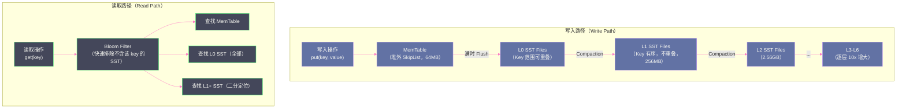

# 07 RocksDB State Store：为超大状态而生

## 摘要

`HDFSBackedStateStore` 将全量状态放在 JVM 堆内存中，这在状态规模较小（< 10GB）时工作良好，但面对"1 亿用户状态"、"7 天内所有事件的去重记录"这类大状态场景，JVM 堆直接 OOM。Spark 3.2 引入了基于 [[RocksDB]] 的 State Store 实现（`RocksDBStateStore`），它将状态数据存储在 **堆外内存（Off-Heap）+ 本地 NVMe 磁盘**上，彻底突破了 JVM 堆大小的限制。其底层是 Facebook 开源的 [[LSM Tree]] 存储引擎 RocksDB，专为高写入吞吐量和低延迟随机读写而设计。本文从 LSM Tree 的核心工作原理讲起，深入剖析 RocksDB State Store 如何集成 Spark 的状态管理接口、其 Changelog 机制如何高效同步状态到 HDFS、与 `HDFSBackedStateStore` 的多维度性能对比，以及生产中关键的配置参数和调优策略。

---

## 第 1 章 为什么需要 RocksDB State Store

### 1.1 HDFSBackedStateStore 的天花板

第 06 篇已经分析了 `HDFSBackedStateStore` 的核心局限：**全量状态必须完整放入 JVM 堆内存**。没有 Spill 机制，没有堆外扩展，状态大小的上限就是 Executor 堆内存大小。

对于典型的互联网规模业务场景：

- **用户行为去重**：7 天内所有活跃用户的 UUID，数量级 1 亿，每条 16 字节 UUID + HashMap Entry 开销约 80 字节 → 约 **8GB** 状态
- **设备级流聚合**：1000 万台 IoT 设备，每台设备保存 10 个指标的滑动窗口聚合 → 状态可能超过 **20GB**
- **实时 Session 分析**：同时在线用户 500 万，每个 Session 保存 100 字节状态 → **500MB**（这个还可以）

8GB、20GB 的状态放在 JVM 堆里，即使 Executor 内存配到 32GB，考虑到 [[JVM GC]] 的空间开销（至少 25% 的 GC 保留空间）、Execution Memory 的需求，可用于 State Store 的堆内存实际上相当紧张。而且，大堆内存的 GC 停顿（Full GC 可能暂停几秒到几十秒）会直接影响流处理的延迟稳定性。

### 1.2 理想的大状态存储应该具备什么特性

从第一性原理思考，一个能承载超大状态的存储方案需要：

1. **不受 JVM 堆大小限制**：状态应该能存储在堆外内存（DirectMemory）或本地磁盘上，当数据量超过内存时自动"溢出"到磁盘，而不是 OOM
2. **高效的随机读写**：流处理的状态操作是点读（get(key)）和点写（put(key, value)），需要低延迟的随机访问，而不仅仅是顺序扫描
3. **持久化到 HDFS**：Executor 本地磁盘不可靠（节点宕机后数据丢失），状态最终需要持久化到 HDFS，支持 Driver 重启后的状态恢复
4. **增量同步**：每个 Epoch 只有一部分状态被修改，同步时应该只传输变化量（Changelog），而不是全量快照

RocksDB 恰好满足了前两点：它是一个 LSM Tree 引擎，所有数据存在堆外内存和本地磁盘，支持高效随机读写。Spark 的 `RocksDBStateStore` 在 RocksDB 之上增加了 HDFS 持久化和增量 Changelog，满足后两点。

---

## 第 2 章 RocksDB 的核心存储模型：LSM Tree

### 2.1 LSM Tree 是什么，为什么出现

**LSM Tree（Log-Structured Merge Tree，日志结构合并树）** 是一种专为**写密集型工作负载**设计的数据结构，最早由 Patrick O'Neil 等人在 1996 年的论文中提出，被 [[LevelDB]]、RocksDB、[[Cassandra]]、[[HBase]] 等广泛采用。

传统的 B-Tree（如 [[MySQL]] InnoDB 的 B+ Tree）在随机写入时性能较差，因为每次写入都可能触发多个磁盘页面的随机 I/O（查找目标位置 + 修改数据 + 可能的页面分裂）。在 HDD 时代，随机 I/O 比顺序 I/O 慢 100 倍以上，B-Tree 的写入性能在高并发场景下成为瓶颈。

LSM Tree 的核心思想：**将随机写转化为顺序写**。所有写入操作首先写入内存中的有序结构（MemTable），积累到一定量后，批量**顺序**写入磁盘（SST 文件）。通过牺牲一定的读性能（读可能需要查多个层次的文件）和后台 Compaction 开销，换取极高的写入吞吐量。

**不这样会怎样（如果用 B-Tree 实现 State Store）**：

状态数据的写入模式是：每个 Epoch 随机更新大量 key（用户散列在各个 key 空间）。如果用 B-Tree，每次 `put(key, value)` 都可能导致 B-Tree 节点的随机读写（定位 key 的位置、更新节点、可能触发分裂），在 HDD 或高并发场景下性能下降严重。LSM Tree 将所有写入转化为内存操作 + 批量顺序刷盘，写入延迟稳定在微秒级。

### 2.2 RocksDB 的三层存储结构

RocksDB 的数据分布在三个层次，从热到冷依次是：

**第一层：MemTable（写入缓冲区，堆外内存）**

```
MemTable（Active）  ←── 所有新写入
MemTable（Immutable）←── 满了之后变为不可变，等待 Flush
```

MemTable 是一个在堆外内存（JNI 分配，不受 JVM GC 管理）中的有序结构（通常是 SkipList）。所有新的写入（put/delete）首先写入 Active MemTable。当 Active MemTable 大小超过阈值（`write_buffer_size`，默认 64MB），它被转为 Immutable MemTable，同时创建一个新的 Active MemTable 接受写入。Immutable MemTable 等待后台线程将其 Flush 到磁盘。

**第二层：L0 SST Files（新鲜的磁盘文件）**

Immutable MemTable 被后台线程 Flush 到磁盘，生成一个 **SST 文件**（Sorted String Table，已排序的不可变文件）。L0 层的 SST 文件之间 key 范围可以重叠（因为每个 MemTable Flush 都生成一个独立的 SST 文件）。

**第三层：L1-L6 SST Files（经过 Compaction 的有序层）**

后台 Compaction 线程将 L0 的 SST 文件与 L1 合并（排序合并，去除旧版本 key），生成 L1 的有序 SST 文件（L1 内 key 不重叠）。L1 → L2 → ... → L6 依次类推，每层大小是上一层的 10 倍（默认）。



### 2.3 读放大、写放大、空间放大：LSM Tree 的三角权衡

LSM Tree 的设计在三个维度上有内在的权衡（这是 RocksDB 论文中明确讨论的核心 Trade-off）：

**写放大（Write Amplification）**：一条数据在生命周期内被写到磁盘的次数。每次 Compaction 都会将数据从上层 SST 文件重新写到下层 SST 文件，一条数据可能被写 10-30 次。对于 NVMe SSD（有寿命限制，写入量影响寿命），写放大是重要的关注指标。

**读放大（Read Amplification）**：读一条数据最多需要查找的 SST 文件数。最坏情况：MemTable 中没有 → L0 的所有 SST 都没有（L0 key 范围重叠，需要查全部）→ L1 的一个 SST → L2 的一个 SST → ... 每层最多 1-2 个 SST，总查找数 = L0 文件数 + 层数。Bloom Filter 极大地减少了不必要的 SST 读取（对于不存在的 key，Bloom Filter 可以快速排除大部分 SST 文件）。

**空间放大（Space Amplification）**：存储的数据量与实际有效数据量的比值。旧版本的 key（被更新或删除的）在 Compaction 合并到下层之前会一直占用空间。空间放大通常是 1.1-2 倍。

RocksDB 的 Compaction 策略（Level Compaction、Universal Compaction）是在这三个维度上进行调节的核心旋钮。Spark 的 RocksDB State Store 默认使用 Level Compaction，在三个维度上取得较好的平衡。

---

## 第 3 章 RocksDB State Store 的架构

### 3.1 整体集成方式

`RocksDBStateStore`（Spark 3.2+）通过实现 `StateStore` 接口（与 `HDFSBackedStateStore` 相同的接口），替换底层存储引擎。对上层有状态算子（流聚合、去重等）完全透明——算子的代码无需任何修改，只需更改一个配置项：

```properties
spark.sql.streaming.stateStore.providerClass=org.apache.spark.sql.execution.streaming.state.RocksDBStateStoreProvider
```

或者使用简化配置（Spark 3.2+）：

```properties
spark.sql.streaming.stateStore.rocksdb.enabled=true
```

`RocksDBStateStore` 实例在 Executor 上运行，每个状态分区（`partitionId`）对应一个独立的 RocksDB 实例（存储在 `spark.local.dir` 指定的本地磁盘上）。

### 3.2 Changelog 机制：高效同步状态到 HDFS

RocksDB 将状态存在 Executor 本地磁盘，这是**不可靠的**——Executor 宕机后，本地磁盘数据可能不可访问（或 K8s Pod 重启后完全丢失）。因此，RocksDB State Store 需要将状态持久化到 HDFS。

**两种持久化方案的对比**：

**方案一：全量上传（Snapshot Upload）**

每个 Epoch 结束后，将整个 RocksDB 的数据（SST 文件）打包上传到 HDFS。代价：如果状态是 10GB，每个 Epoch（每隔 1-5 秒）就要上传 10GB 到 HDFS，网络带宽消耗极大，几乎不可行。

**方案二：Changelog 增量上传（Spark 3.2 默认方案）**

每个 Epoch 只将本次的状态变更（新增/更新/删除的 key-value 对）写入一个 **Changelog 文件**，上传到 HDFS。类似 `HDFSBackedStateStore` 的 delta 文件思路，但在 RocksDB 层面实现，直接从 RocksDB 的写入路径中截获变更。

```
HDFS State 目录（RocksDB Changelog 模式）：
checkpoint/state/{opId}/{partId}/
├── 0.changelog       ← Epoch 0 的状态变更
├── 1.changelog
├── ...
├── 200.snapshot/     ← 版本 200 的全量 RocksDB SST 快照（定期上传）
│   ├── CURRENT
│   ├── MANIFEST
│   ├── 000001.sst
│   └── ...
├── 201.changelog
└── ...
```

**Changelog 的优势**：
- 每个 Epoch 只上传变更量（通常远小于全量状态）
- 网络带宽消耗与状态更新速率成正比，而非与状态总量成正比
- 定期上传全量快照（每隔 `minDeltasForSnapshot` 个 Epoch，默认 200），确保恢复时不需要回放过长的 Changelog 链

### 3.3 状态恢复流程（Changelog 模式）

Executor 重启（或新 Executor 接管状态分区）时，RocksDB State Store 的恢复流程：

1. **找最近的全量快照**：在 HDFS 上扫描 `{partId}/` 目录，找到最近版本的 `.snapshot/` 目录（如 `200.snapshot/`）
2. **下载全量快照到本地磁盘**：将 HDFS 上的 SST 文件全部下载到 `spark.local.dir`，重建 RocksDB 实例
3. **回放 Changelog**：从 `201.changelog` 开始，依次回放到目标版本（如 `215.changelog`），将变更写入本地 RocksDB
4. **恢复完成**：本地 RocksDB 现在处于版本 215 的状态，可以继续服务有状态算子的请求

**恢复的 I/O 代价**：下载全量快照（如 10GB）需要较长时间（在带宽 100MB/s 的集群上约 1-2 分钟）。这是 RocksDB State Store 的一个劣势——状态恢复时间比 `HDFSBackedStateStore` 更长（后者只需加载最近 200 个 delta 文件）。

> [!note] 设计哲学
> RocksDB State Store 的本质是"用恢复时间（Recovery Time）换取运行时内存效率（Runtime Memory Efficiency）"。在正常运行时，状态在堆外内存和本地 NVMe 磁盘之间自动管理，不受 JVM 堆大小限制；但一旦需要恢复，下载全量快照的时间开销比 `HDFSBackedStateStore` 更大。这个权衡在**状态规模远超 JVM 堆大小**的场景下是值得的，但对于**小状态 + 需要极快恢复**的场景，`HDFSBackedStateStore` 反而更合适。

---

## 第 4 章 RocksDB State Store vs HDFSBackedStateStore：全维度对比

### 4.1 性能对比

| 维度 | HDFSBackedStateStore | RocksDB StateStore |
|------|---------------------|-------------------|
| **状态大小上限** | JVM 堆大小（通常 < 32GB） | 本地磁盘大小（通常 TB 级） |
| **读延迟（点读）** | O(1) HashMap，微秒级 | MemTable 命中时微秒级；需要查 SST 时毫秒级 |
| **写延迟（点写）** | O(1) HashMap，微秒级 | MemTable 写入，微秒级（通常不慢于 HashMap） |
| **GC 影响** | 大状态下 Full GC 停顿秒级 | 状态在堆外，GC 停顿极小 |
| **Epoch 结束持久化** | 写 HDFS delta 文件（增量） | 写 HDFS Changelog 文件（增量） |
| **恢复速度** | 快（最多加载 200 个小 delta） | 慢（需要下载 GB 级全量快照） |
| **内存占用** | 全量状态占用 JVM 堆 | MemTable 占用堆外内存（默认约 64MB/分区） |

### 4.2 适用场景对比

**选择 `HDFSBackedStateStore` 的场景**：
- 状态总量 < 4GB（远低于 JVM 堆大小）
- 对恢复速度有极高要求（故障后需要秒级恢复）
- 运行在 JVM 堆内存充足的 Executor 上

**选择 `RocksDB StateStore` 的场景**：
- 状态总量 > JVM 堆大小（10GB、100GB 甚至更大）
- 有大量 key 的去重场景（如 7 天内所有用户 ID 去重）
- 需要稳定低延迟（`HDFSBackedStateStore` 因 GC 停顿导致延迟抖动）
- Spark on Kubernetes，Pod 内存有严格限制，无法分配大堆

---

## 第 5 章 生产配置与调优

### 5.1 核心配置参数

```properties
# 启用 RocksDB State Store
spark.sql.streaming.stateStore.providerClass=\
  org.apache.spark.sql.execution.streaming.state.RocksDBStateStoreProvider

# RocksDB 本地存储目录（通常跟 spark.local.dir 一致，建议 NVMe SSD）
spark.sql.streaming.stateStore.rocksdb.localDir=/mnt/nvme/rocksdb-state

# MemTable 大小（单个 RocksDB 实例的写缓冲区，默认 64MB）
# 增大可以减少 Flush 频率，降低写放大，但增加内存占用
spark.sql.streaming.stateStore.rocksdb.writeBufferSizeMB=128

# 最大 MemTable 数量（Active + Immutable）
spark.sql.streaming.stateStore.rocksdb.maxWriteBufferNumber=4

# Block Cache 大小（用于缓存 SST 文件的 Block，减少磁盘读取，默认 8MB/实例）
# 对于读密集型状态（如 deduplication）适当增大
spark.sql.streaming.stateStore.rocksdb.blockCacheSizeMB=64

# Changelog 模式（推荐开启，仅上传增量变更）
spark.sql.streaming.stateStore.rocksdb.changelogCheckpointing.enabled=true

# 全量快照触发间隔（每 N 个 Epoch 上传一次全量快照）
spark.sql.streaming.stateStore.rocksdb.minDeltasForSnapshot=200

# Compaction 类型（Level Compaction 是默认值，适合大状态）
spark.sql.streaming.stateStore.rocksdb.compactOnCommit=false
```

### 5.2 内存规划

每个 RocksDB State Store 实例（每个状态分区）的堆外内存消耗：

```
单实例内存 = MemTable 大小 × maxWriteBufferNumber
           + Block Cache 大小
           + 其他 RocksDB 内部开销

= 128MB × 4 + 64MB + ~20MB
= ~596MB / 实例
```

一个 Executor 上有多少个状态分区？通常等于流查询的并行度（`spark.default.parallelism` 或 `spark.sql.shuffle.partitions`，默认 200）除以 Executor 数量。

如果有 200 个分区，100 个 Executor，则每个 Executor 上有 2 个 RocksDB 实例：
```
堆外内存消耗 = 2 × 596MB ≈ 1.2GB / Executor
```

配置 Executor 时，需要给堆外内存留足：
```properties
spark.executor.memoryOverhead=2g  # 或者用 spark.executor.memoryOverheadFactor
```

> [!warning] 生产避坑
> RocksDB State Store 的堆外内存消耗与**状态分区数**成正比。如果 `spark.sql.shuffle.partitions=1000`，且每个 Executor 承载 10 个分区，每个 Executor 的堆外内存消耗可能高达 6GB。在 K8s 上，Pod 的总内存限制（JVM 堆 + 堆外）必须涵盖这部分，否则 Pod 因 OOM 被 Kill（CGroupOOMKill）。常见误区：只给足了 `executor.memory`（JVM 堆），忽略了 `memoryOverhead`，导致 RocksDB 的堆外内存超出 Pod 限制。

### 5.3 本地磁盘 I/O 优化

RocksDB 的 Compaction 是 CPU 和 I/O 密集型操作，在高写入场景下可能与流处理的 Task 竞争磁盘 I/O。

**优化建议**：

1. **使用 NVMe SSD**：RocksDB 的读写性能对磁盘随机 I/O 延迟极为敏感，HDD（尤其是机械硬盘）上的性能可能下降 10 倍以上

2. **独立磁盘**：为 RocksDB State Store 配置独立的磁盘分区（不与 Shuffle 文件、HDFS DataNode 存储共享），避免 I/O 竞争

3. **限制 Compaction 速率**：通过 `rate_limiter_bytes_per_sec` 限制 Compaction 的 I/O 带宽，防止 Compaction 影响流处理 Task 的响应延迟

```properties
spark.sql.streaming.stateStore.rocksdb.rateLimitMbPerSec=100
```

### 5.4 监控 RocksDB State Store

通过 Spark UI 的 Structured Streaming 统计页面，可以看到 RocksDB State Store 的关键指标：

| 指标 | 含义 | 告警建议 |
|------|------|---------|
| `rocksdb.totalSstFilesSizeBytes` | SST 文件总大小（本地磁盘占用） | > 本地磁盘容量的 80% |
| `rocksdb.blockCacheHitRatio` | Block Cache 命中率 | < 80% 时考虑增大 Block Cache |
| `rocksdb.compactionTimeMs` | Compaction 耗时 | 持续超过微批间隔时考虑降低 Compaction 频率 |
| `rocksdb.memTableFlushCount` | MemTable Flush 次数 | 过频时考虑增大 `writeBufferSizeMB` |
| `stateStore.loadedKeys` | 当前加载的 key 数量 | 持续增长且无 TTL 时触发告警 |

---

## 第 6 章 RocksDB State Store 的局限与边界

### 6.1 恢复时间较长

如前所述，恢复时需要从 HDFS 下载全量快照（可能 GB 到 TB 级）。在大状态场景下，恢复时间可能达到数分钟，甚至数十分钟（取决于 HDFS 带宽和状态大小）。

**缓解策略**：增大 Changelog 快照间隔（`minDeltasForSnapshot`），同时确保 HDFS 带宽充足。对于极端大状态（> 100GB），应该接受"恢复需要几十分钟"这一现实，并在业务层面提前规划。

### 6.2 本地磁盘可靠性依赖

RocksDB 的数据存储在 Executor 本地磁盘。虽然最终状态会持久化到 HDFS（通过 Changelog + 定期快照），但如果本地磁盘在 Epoch 完成前（Changelog 上传前）损坏，当前 Epoch 的状态变更会丢失，需要从 HDFS 的上一个版本重新恢复并重做当前 Epoch。

在 Kubernetes 上，这个问题尤为突出——Pod 重启后本地磁盘完全丢失，每次 Pod 重启都需要从 HDFS 完整下载状态。对于运行在 Spot/Preemptible 节点上的流处理应用，频繁的 Pod 重启会导致大量时间花在状态恢复上，而不是实际的数据处理。

### 6.3 CPU 开销：Compaction 的代价

RocksDB 的后台 Compaction 会持续消耗 CPU。在高写入速率下（每秒写入大量状态变更），Compaction 可能占用 Executor 的 10-20% CPU，与流处理 Task 竞争计算资源，导致 Task 延迟增加。

**调优方向**：
- 增大 MemTable 和 L0 文件数量（允许更多数据积累后再 Compaction），降低 Compaction 频率，但增加读放大
- 使用 Universal Compaction（写放大更小，但空间放大更大），适合写密集型场景

---

## 小结

RocksDB State Store 是 Spark Structured Streaming 为超大状态场景提供的核心解决方案：

- **LSM Tree 引擎**：写入先到堆外 MemTable，批量 Flush 到 SST 文件，后台 Compaction 维持层次结构。高写入吞吐量 + 可接受的读延迟，且不占用 JVM 堆
- **Changelog 增量持久化**：每个 Epoch 只上传状态变更（Changelog），定期上传全量快照。网络传输量与状态更新速率成正比，而非与状态总量成正比
- **适用场景**：状态 > JVM 堆大小（10GB 以上）、需要 GC 延迟稳定、Spark on K8s 内存受限场景
- **局限**：恢复时间较长（需下载全量快照）、本地磁盘依赖、Compaction CPU 开销
- **关键配置**：`writeBufferSizeMB`、`blockCacheSizeMB`、`changelogCheckpointing.enabled`、`memoryOverhead`

第 08 篇将讲解状态过期与 TTL——在 State Store 中无限积累状态是内存炸弹，如何通过 Watermark 和 `GroupState TTL` 机制让过期状态自动清理，同时保证流处理语义的正确性。

---

## 参考资料

- [RocksDB 101: Optimizing stateful streaming in Apache Spark（AWS Blog）](https://aws.amazon.com/blogs/big-data/rocksdb-101-optimizing-stateful-streaming-in-apache-spark-with-amazon-emr-and-aws-glue/)
- [What's new in Apache Spark 3.2.0 - RocksDB state store（waitingforcode.com）](https://www.waitingforcode.com/apache-spark-structured-streaming/whats-new-apache-spark-3.2.0-rocksdb-state-store/read)
- [Introducing Apache Spark 3.2（Databricks Blog）](https://www.databricks.com/blog/2021/10/19/introducing-apache-spark-3-2.html)
- Dong, Huang 等：RocksDB: A Persistent Key-Value Store for Flash and RAM Storage（Facebook Engineering）
- Patrick O'Neil 等：The Log-Structured Merge-Tree（LSM-Tree）（1996）
- Apache Spark 源码：`org.apache.spark.sql.execution.streaming.state.RocksDBStateStoreProvider`
- Apache Spark 源码：`org.apache.spark.sql.execution.streaming.state.RocksDB`
