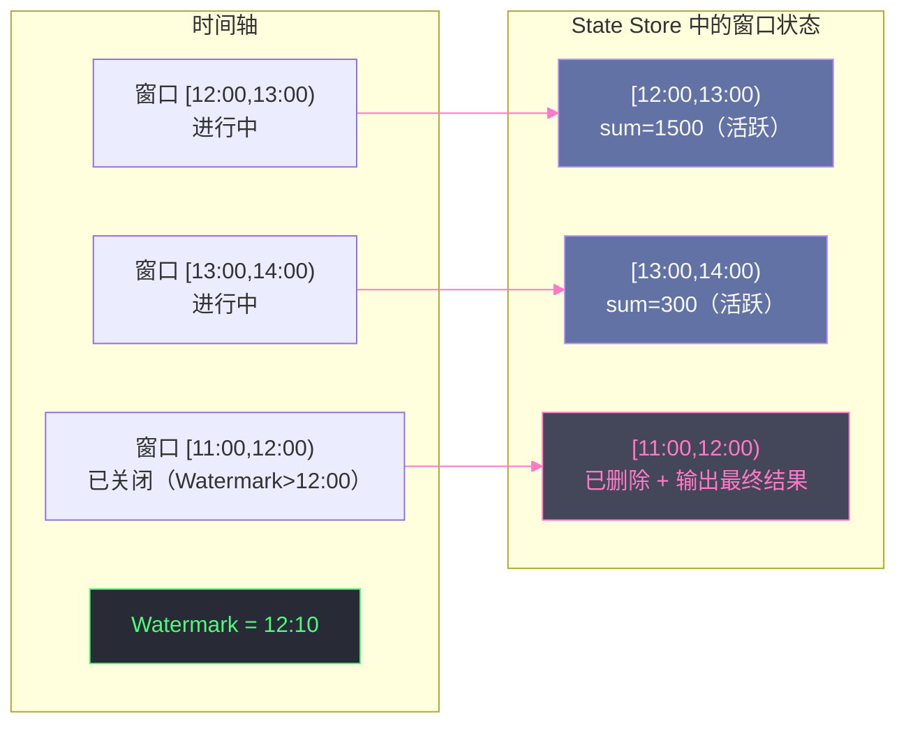

# 08 状态过期与 TTL：让 State Store 不再无限膨胀

## 摘要

State Store 中的状态如果从不清理，会随时间单调增长——无论是 `groupBy` 聚合的中间状态、`dropDuplicates` 记录的已见 id、还是 `mapGroupsWithState` 用户自定义的状态。在业务高峰期，一个运行了几个月的去重 State Store 可能积累了数十亿条记录，远超 Executor 内存上限，最终 OOM。状态过期机制的核心问题是：**什么时候可以安全地删除一条状态，而不影响计算的正确性？** 答案涉及两个维度：一是**时间语义**（处理时间 vs 事件时间，决定"时间"的含义）；二是**安全删除的判据**（Watermark 机制——只有当引擎确定不会再收到比某时间点更早的数据时，才能安全删除该时间点之前的状态）。本文系统讲解 Watermark 的本质与推进逻辑、它如何驱动不同有状态算子的状态清理、`GroupState TTL` 的两种超时模式（事件时间 vs 处理时间）、以及生产中常见的状态膨胀问题与诊断方法。

---

## 第 1 章 为什么状态不能无限增长

### 1.1 状态膨胀的必然性

有状态流处理的状态量，本质上与"历史上出现过的不同 key 的数量"成正比。以下几个典型场景说明这个问题：

**去重（dropDuplicates）**：State Store 需要记住"所有见过的事件 id"。如果每天有 1 亿条新事件，且事件 id 不重复，7 天后 State Store 中有 7 亿条记录。30 天后是 30 亿条。如果每条记录占 100 字节，30 亿条 = **300GB**，远超任何单机的内存。

**流聚合（Streaming Aggregation）**：`groupBy(userId).count()` 需要为每个历史出现过的 `userId` 维护一个计数器。如果用户总数是 1 亿，且所有用户的聚合状态都保留，State Store 就有 1 亿个 key。

**自定义状态（mapGroupsWithState）**：用户为每个 Session 维护一个状态对象（如最后活跃时间、会话中的事件列表）。已结束的 Session 如果状态从不清理，历史上所有 Session 的状态都会永远保留。

上述三类场景都会导致**状态无限膨胀**。对于 `HDFSBackedStateStore`，这意味着 JVM 堆 OOM；对于 `RocksDB StateStore`，这意味着本地磁盘被填满，同时 HDFS 上的 Checkpoint 文件也持续增长。

### 1.2 安全删除的核心挑战

删除状态看起来很简单，但实际上充满陷阱。核心问题是：**流处理的数据有延迟，某个 key 在很久没有出现后，可能突然又来了一条迟到的数据**。

举例：去重应用需要对事件 id 去重。事件 id `evt-12345` 在 2 小时前已经处理过，被记录在 State Store 中。如果 2 小时后从 State Store 中删除这条记录，此时又来了一条迟到的 `evt-12345`（网络延迟导致），去重逻辑找不到历史记录，会将其作为新事件输出——去重失效，产生重复数据。

因此，**不能基于"某 key 长时间未更新"这一简单条件来删除状态**，必须有一个全局性的判据："我可以确定，不会再收到早于时间 T 的数据"。只有在这个保证之下，才能安全删除"最后更新时间早于 T"的状态。

这个判据，就是 **Watermark**。

---

## 第 2 章 Watermark：流处理的时间边界

### 2.1 Watermark 是什么

**Watermark（水位线）** 是 Structured Streaming（以及 Apache Flink 等流处理引擎）中处理事件时间（Event Time）乱序数据的核心机制。它是引擎对"当前处理进度"的一个声明：

> "Watermark = T 意味着：引擎保证，所有事件时间早于 T 的数据，已经全部到达并被处理（或者即使还没到达，也会被视为迟到数据而丢弃）。"

换句话说，Watermark 是一道时间分界线：分界线之前的数据被认为"已经完整"，分界线之后的数据仍在到来。这道分界线的意义在于：它使引擎能够安全地**输出时间早于 Watermark 的聚合结果**，以及**清理时间早于 Watermark 的状态**——因为引擎已经保证不会再收到影响这些状态的新数据。

> [!info] 核心概念
> Watermark 的本质是对"乱序度（Out-of-orderness）"的一个有界假设。流处理系统不可能等待无限时间来确认某个时间段的数据是否完整（那样延迟无限大）。Watermark 用一个固定的"容忍延迟（Late Threshold）"来做假设：如果一条数据的事件时间比当前已见最大事件时间早超过 `threshold`，就认为这条数据是"极度迟到"的，不纳入计算。这是一个工程上的权衡：更大的 threshold → 更低的数据丢失风险，但更高的状态保留时间和输出延迟。

### 2.2 Watermark 的推进机制

**配置**：

```scala
val eventsWithWatermark = events
  .withWatermark("eventTime", "10 minutes")  // 容忍最多 10 分钟的迟到数据
```

**推进逻辑**（每个 Epoch 执行一次）：

```
每个 Epoch 开始时：
  1. 计算本次 Epoch 输入数据的最大事件时间 = maxEventTime
  2. 新 Watermark = max(当前 Watermark, maxEventTime - threshold)
     （取历史 Watermark 与当前计算结果的最大值，保证 Watermark 单调递增）
```

**举例（threshold = 10 分钟）**：

| Epoch | 本次最大事件时间 | 当前 Watermark |
|-------|--------------|--------------|
| 1 | 12:10 | max(0, 12:10 - 10min) = 12:00 |
| 2 | 12:15 | max(12:00, 12:15 - 10min) = 12:05 |
| 3 | 12:14（乱序） | max(12:05, 12:14 - 10min) = max(12:05, 12:04) = 12:05（不后退！） |
| 4 | 12:20 | max(12:05, 12:20 - 10min) = 12:10 |

**Watermark 单调递增**：Watermark 只会向前推进，不会后退。即使某个 Epoch 的数据都是历史数据（最大事件时间很小），Watermark 也不变（取 max）。这保证了状态清理的安全性——一旦某个 key 被清理（其时间早于 Watermark），不会出现 Watermark 回退后该 key 的新数据到来的情况。

### 2.3 Watermark 与事件时间窗口聚合

**窗口聚合的状态清理**：对于 `window(eventTime, "1 hour").groupBy(window).sum(value)`：

- 每个时间窗口（如 `[12:00, 13:00)`）在 State Store 中对应一个状态（该窗口目前的 sum）
- 当 Watermark 推进到 13:00 之后（即 `Watermark > window.end`），引擎确信不会再收到属于 `[12:00, 13:00)` 窗口的新数据
- 此时安全输出该窗口的最终结果，并从 State Store 中删除该窗口的状态



---

## 第 3 章 不同有状态算子的状态清理机制

### 3.1 dropDuplicates with Watermark

去重算子 `dropDuplicates(columns)` 需要配合 Watermark 才能安全清理状态。如果不配合 Watermark，状态永远不清理：

```scala
// 不安全：状态永远增长
df.dropDuplicates("id")

// 安全：Watermark 时间之前的 id 记录会被清理
df.withWatermark("eventTime", "7 days")
  .dropDuplicates("id", "eventTime")
  // 注意：dropDuplicates 必须包含 eventTime 列（Watermark 列）
```

**清理条件**：当某条去重记录（id + eventTime）的 eventTime 早于当前 Watermark 时，该记录从 State Store 中删除。

**重要限制**：`dropDuplicates` 去重是基于 Watermark 窗口的——只保证在 Watermark 窗口内的数据不重复。如果同一个 id 在 Watermark 之前出现了，被处理后状态删除；Watermark 之后又出现一次，会被视为新的不重复数据再次输出。对于需要全局去重（不依赖时间窗口）的场景，这是一个重要的语义边界。

### 3.2 流聚合（Append 模式）with Watermark

在 Append 输出模式下，流聚合必须配合 Watermark，否则 Spark 会报错（因为 Append 模式要求只输出"最终"的聚合结果，而没有 Watermark 就无法确定何时输出）：

```scala
// Append 模式下的窗口聚合（必须配 Watermark）
df.withWatermark("eventTime", "10 minutes")
  .groupBy(window($"eventTime", "1 hour"), $"userId")
  .count()
  .writeStream
  .outputMode("append")  // 只有当窗口关闭（Watermark 超过窗口结束时间）时才输出
  .start()
```

在 Update 模式下，可以不配 Watermark，但状态永远不清理：

```scala
// Update 模式（每次 Epoch 都更新并输出，但状态永远不清理）
df.groupBy($"userId")
  .count()
  .writeStream
  .outputMode("update")  // 每个 Epoch 输出更新的 key
  .start()
```

> [!warning] 生产避坑
> 在 Update 模式下不配 Watermark 的流聚合，是生产中最常见的 State Store OOM 来源之一。用户觉得"我只是做个 count，怎么可能 OOM？"——因为 `count` 需要为每个历史出现过的 `userId` 保留状态，而 `userId` 的数量随时间线性增长。解决方案：要么配 Watermark（允许老 key 的状态被清理）；要么改用批处理定期聚合（如果不需要实时增量聚合）；要么用有 TTL 的 `mapGroupsWithState`。

---

## 第 4 章 GroupState TTL：精细化的状态过期控制

### 4.1 GroupState TTL 是什么

`mapGroupsWithState` 和 `flatMapGroupsWithState` 提供了 `GroupState[S]` 接口，允许用户完全自定义每个 key 的状态更新逻辑。与 Watermark 的全局时间边界不同，**GroupState TTL** 允许对**每个 key 独立设置状态过期时间**（超时时间），更灵活地控制状态清理。

GroupState TTL 支持两种超时模式：

**处理时间超时（Processing Time Timeout）**：基于系统时钟。某个 key 的状态被最后一次更新后，如果在指定的处理时间内没有新数据到来，触发超时回调，用户可以在回调中清理该 key 的状态。

**事件时间超时（Event Time Timeout）**：基于 Watermark。某个 key 设置了一个事件时间 deadline，当 Watermark 推进到超过该 deadline 时，触发超时回调。

### 4.2 处理时间超时的使用

```scala
case class UserSession(lastSeen: Long, eventCount: Int)

def updateSession(
  userId: String,
  events: Iterator[UserEvent],
  state: GroupState[UserSession]
): Iterator[SessionResult] = {
  
  if (state.hasTimedOut) {
    // 超时回调：该 userId 在指定时间内没有新事件
    val finalSession = state.get
    state.remove()  // 删除状态，释放 State Store 空间
    return Iterator(SessionResult(userId, finalSession.eventCount, closed = true))
  }
  
  // 正常处理：更新状态
  val currentState = if (state.exists) state.get 
                     else UserSession(0, 0)
  val newEventCount = currentState.eventCount + events.size
  val newState = UserSession(System.currentTimeMillis(), newEventCount)
  state.update(newState)
  
  // 设置处理时间超时：30 分钟内没有新事件则触发 hasTimedOut
  state.setTimeoutDuration("30 minutes")
  
  Iterator.empty  // 不立即输出，等 Session 关闭时输出
}

val query = events
  .groupByKey(_.userId)
  .flatMapGroupsWithState(
    OutputMode.Append,
    GroupStateTimeout.ProcessingTimeTimeout  // 使用处理时间超时
  )(updateSession)
```

**处理时间超时的触发机制**：

`TaskSchedulerImpl` 中有一个定时线程（由 `spark.sql.streaming.groupState.timeout.processingTimeInterval` 控制，默认 10 秒），周期性地检查所有 GroupState 实例，对于超时的 key，在下一个 Epoch 中以 `hasTimedOut = true` 调用用户回调。

**使用处理时间超时的场景**：
- Session 分析：用户 30 分钟无活动则关闭 Session
- 机器状态监控：设备 5 分钟无心跳则报警并清理状态
- 任何需要"空闲超时"语义的场景

### 4.3 事件时间超时的使用

```scala
def updateStateWithEventTimeTimeout(
  deviceId: String,
  readings: Iterator[SensorReading],
  state: GroupState[DeviceState]
): Iterator[Alert] = {
  
  if (state.hasTimedOut) {
    // 事件时间超时：Watermark 已超过 deadline
    val oldState = state.get
    state.remove()
    return Iterator(Alert(deviceId, s"No data since ${oldState.lastSeen}, possible device failure"))
  }
  
  // 处理新数据
  val currentState = if (state.exists) state.get 
                     else DeviceState(0, 0.0)
  val latestReading = readings.maxBy(_.eventTime)
  val newState = DeviceState(latestReading.eventTime, latestReading.value)
  state.update(newState)
  
  // 设置事件时间超时：1 小时后（基于事件时间，配合 Watermark）
  state.setTimeoutTimestamp(latestReading.eventTime + 3600000L)  // 毫秒
  
  Iterator.empty
}

val query = readings
  .withWatermark("eventTime", "15 minutes")  // 事件时间超时必须配合 Watermark
  .groupByKey(_.deviceId)
  .flatMapGroupsWithState(
    OutputMode.Append,
    GroupStateTimeout.EventTimeTimeout  // 使用事件时间超时
  )(updateStateWithEventTimeTimeout)
```

**事件时间超时的触发机制**：

当 Epoch N 的 Watermark 推进到超过某个 key 设置的 `timeoutTimestamp`（通过 `state.setTimeoutTimestamp()` 设置），在下一个 Epoch 中，该 key 会以 `hasTimedOut = true` 被调用。

**事件时间超时 vs 处理时间超时的关键区别**：

| 维度 | 处理时间超时 | 事件时间超时 |
|------|------------|------------|
| **时间基准** | 系统时钟（挂钟时间） | 数据中的事件时间（Watermark 推进） |
| **是否需要 Watermark** | 不需要 | 必须配合 `withWatermark` |
| **结果确定性** | 依赖系统时钟，重跑结果可能不同 | 确定性（相同输入 → 相同输出） |
| **适用场景** | 实时 Session 管理、心跳监控 | 基于业务时间的状态过期、历史数据回放 |
| **历史数据处理** | ⚠️ 历史数据回放时超时会立即触发（系统时间 >> 数据时间） | ✅ 按数据的事件时间节奏触发，历史回放安全 |

> [!warning] 生产避坑
> 如果对历史数据做 Backfill（从历史 Kafka offset 重放），使用处理时间超时会导致所有 key 立刻超时（因为系统时间远大于历史数据的处理时间），大量状态被立即清理，产生错误结果。对于需要历史数据回放、重新计算的场景，**必须使用事件时间超时**，确保超时行为与数据的业务时间对齐，回放结果与实时处理结果一致。

---

## 第 5 章 Watermark 的语义边界与常见误区

### 5.1 Watermark 不是"精确"的，是"尽力"的

Watermark 是基于"数据最大延迟不超过 threshold"的假设工作的。如果现实中某些数据的延迟超过 threshold（极端迟到），这些数据会被 Structured Streaming **静默丢弃**（不参与计算），不会报错，也不会产生任何告警。

这意味着：设置过小的 Watermark threshold 会导致合法数据被丢弃（数据丢失），设置过大的 threshold 会导致状态保留时间过长（状态膨胀、输出延迟高）。如何选择合适的 threshold，需要分析数据源的延迟分布（P99 延迟）。

**生产实践**：使用 Spark UI 的 Streaming 统计页面，观察 `maxEventTime` 和当前 Watermark 的差值（即实际观测到的最大延迟），以此为基准设置 threshold。通常 threshold = P99 延迟 × 1.5 是合理的起点。

### 5.2 多 Source 场景下的 Watermark 取最小值

当流查询有多个 Source（如多个 Kafka Topic 的 Join），全局 Watermark 取所有 Source 的 Watermark 的**最小值**：

```
全局 Watermark = min(Source1 的 Watermark, Source2 的 Watermark, ...)
```

这是一个保守策略：只有当所有 Source 都确认"不会再来早于 T 的数据"时，全局 Watermark 才推进到 T。

**隐患**：如果某个 Source 长时间没有新数据（如一个 Kafka Topic 流量低谷期无数据），其 Watermark 停滞不前，导致全局 Watermark 也停滞，所有时间窗口和状态都无法被清理，State Store 持续膨胀。

**解决方案**：配置 `spark.sql.streaming.multipleWatermarkPolicy=max`（Spark 2.4+），改为取所有 Source Watermark 的**最大值**。这会牺牲某些极度延迟数据的处理（可能被丢弃），但避免了 State Store 因低流量 Source 而无法清理的问题。

### 5.3 Watermark 与输出模式的约束关系

不同的输出模式（Output Mode）对 Watermark 有不同的要求和限制：

| 输出模式 | Watermark 必须？ | 状态清理 | 适用场景 |
|--------|---------------|---------|---------|
| **Append** | 必须（时间窗口聚合）/ 不需要（无聚合） | 窗口关闭后清理 | 只输出最终结果（窗口完成后） |
| **Update** | 可选（有则清理，无则不清理） | 有 Watermark 时清理 | 每次更新都输出（实时仪表盘） |
| **Complete** | 不支持（Complete 输出全量，与清理语义矛盾） | 从不清理 | 全量输出（小状态场景） |

> [!info] 核心概念
> Complete 模式每次 Epoch 都输出所有 key 的当前状态（全量）。这意味着状态不能被清理——如果清理了某个 key 的状态，下一次 Epoch 就无法输出该 key，但 Complete 模式要求输出所有历史 key。因此，Complete 模式天然不支持状态清理，只适合状态量有限（如固定维度的实时 TOP-N）的场景。

---

## 第 6 章 生产中的状态膨胀诊断

### 6.1 State Store 大小的监控

**Spark UI 观察**：

Structured Streaming 的 Statistics 页面（Spark UI → Streaming 标签）显示：

- **Stateful Operators**：每个有状态算子的统计
  - `numRowsTotal`：State Store 中当前的 key 总数
  - `numRowsUpdated`：本次 Epoch 更新的 key 数
  - `numRowsRemoved`：本次 Epoch 删除（过期清理）的 key 数
  - `memoryUsedBytes`：State Store 占用的内存

**告警信号**：
- `numRowsTotal` 持续增长，`numRowsRemoved` 始终为 0 → State Store 没有任何清理，必然膨胀
- `memoryUsedBytes` 每隔几个 Epoch 就增长 → 写入速率 > 清理速率，净增长

**程序化监控**：

```scala
val query = df.writeStream.start()

// 通过 StreamingQueryListener 监控 State Store 大小
spark.streams.addListener(new StreamingQueryListener {
  override def onQueryProgress(event: QueryProgressEvent): Unit = {
    event.progress.stateOperators.foreach { stateOp =>
      val numKeys = stateOp.numRowsTotal
      val memBytes = stateOp.memoryUsedBytes
      
      if (numKeys > 100_000_000L) {  // 超过 1 亿 key 告警
        logger.warn(s"State Store keys: $numKeys, memory: ${memBytes / 1024 / 1024}MB")
      }
    }
  }
  // ... 其他方法
})
```

### 6.2 状态不清理的常见根因

**根因一：忘记配 Watermark**

```scala
// 问题：没有 withWatermark，状态永远不清理
df.groupBy(window($"ts", "1 hour")).count()

// 修复：加上 Watermark
df.withWatermark("ts", "30 minutes")
  .groupBy(window($"ts", "1 hour")).count()
```

**根因二：dropDuplicates 没有包含事件时间列**

```scala
// 问题：dropDuplicates 不含 eventTime，Watermark 无法驱动状态清理
df.withWatermark("eventTime", "7 days")
  .dropDuplicates("id")  // 没有 eventTime！

// 修复：包含 eventTime 列
df.withWatermark("eventTime", "7 days")
  .dropDuplicates("id", "eventTime")
```

**根因三：某个 Source 长期无数据导致全局 Watermark 停滞**

症状：Spark UI 显示 Watermark 长时间不推进，`numRowsRemoved` 为 0

修复：
```properties
spark.sql.streaming.multipleWatermarkPolicy=max
```

**根因四：mapGroupsWithState 没有调用 state.remove()**

```scala
// 问题：超时回调中忘记调用 state.remove()
if (state.hasTimedOut) {
  Iterator(result)  // 输出结果，但忘记删除状态！
}

// 修复：
if (state.hasTimedOut) {
  state.remove()  // 必须显式删除！
  Iterator(result)
}
```

---

## 小结

状态过期与 TTL 是有状态流处理能够长期稳定运行的关键保证：

- **Watermark**：流处理的时间边界，保证"Watermark 之前的数据已完整处理"。推进逻辑 = max(当前 Watermark, 本 Epoch 最大事件时间 - threshold)，单调递增
- **窗口聚合清理**：Watermark 超过窗口结束时间 → 输出窗口最终结果 + 删除窗口状态
- **dropDuplicates 清理**：需配合 Watermark，且 `dropDuplicates` 必须包含 Watermark 列；Watermark 之前的 id 记录被清理
- **GroupState 处理时间超时**：基于系统时钟的 key 级 TTL，适合实时 Session 管理，历史回放不安全
- **GroupState 事件时间超时**：基于 Watermark 推进的 key 级 TTL，确定性，历史回放安全
- **生产三大陷阱**：忘配 Watermark → 状态无限增长；多 Source 取 min → 低流量 Source 导致 Watermark 停滞；hasTimedOut 回调忘调 `state.remove()` → 超时但状态不删除

第 09 篇将把整个容错体系串联起来，用一个具体的故障场景（节点宕机 + Executor 崩溃 + Driver 重启）为主线，完整拆解 Spark 从故障检测到恢复完成的全链路流程，涵盖批处理和流处理两条恢复路径。

---

## 参考资料

- [Apache Spark Structured Streaming and Watermarks（waitingforcode.com）](https://www.waitingforcode.com/apache-spark-structured-streaming/apache-spark-structured-streaming-watermarks/read)
- [Spark Structured Streaming GroupState setTimeoutDuration（CSDN）](https://blog.csdn.net/zhouyan8603/article/details/77934754)
- [Spark 官方文档：Structured Streaming Programming Guide - Handling Late Data](https://spark.apache.org/docs/latest/structured-streaming-programming-guide.html#handling-late-data-and-watermarking)
- [Spark 官方文档：Arbitrary Stateful Operations](https://spark.apache.org/docs/latest/structured-streaming-programming-guide.html#arbitrary-stateful-operations)
- Apache Spark 源码：`org.apache.spark.sql.execution.streaming.WatermarkTracker`
- Apache Spark 源码：`org.apache.spark.sql.execution.streaming.GroupStateImpl`
- The Dataflow Model（Google, 2015）：事件时间处理和 Watermark 机制的原始论文
