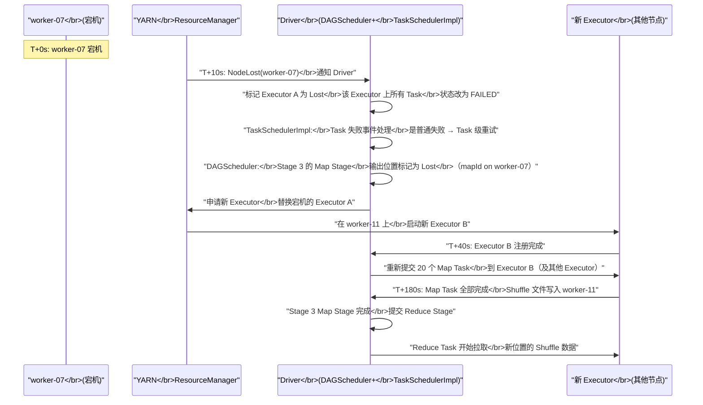

# 09 故障恢复全流程拆解：从宕机到续跑

## 摘要

前几篇文章分别介绍了 Spark 容错体系的各个组件：Lineage 容错、多级重试、Checkpoint、Structured Streaming 的 Offset Log + Commit Log 协议、State Store 的持久化机制。但这些机制在真实故障中是如何协同工作的？当一台节点在凌晨三点宕机，Spark 的哪个组件最先感知到？感知后触发了哪些后续动作？经历了几个步骤才最终恢复到正常计算状态？本文以两条故障主线为骨架：**批处理作业中 Executor 崩溃**与 **Structured Streaming Driver 重启**，将前述所有容错机制串联为一个完整的时序叙事，精确描述每个组件在故障恢复链路中的角色、响应时机、与其他组件的交互方式，以及从故障发生到恢复完成的端到端时延估算。

---

## 第 1 章 故障的感知：谁最先知道节点宕机了

### 1.1 Executor 与 Driver 的心跳机制

在 Spark 的架构中，Driver 通过**心跳（Heartbeat）**机制来感知 Executor 的存活状态。每个 Executor 内部有一个 `Heartbeater` 线程（默认每 10 秒一次），向 Driver 的 `HeartbeatReceiver` 发送心跳消息，携带：

- Executor 当前运行的 Task 的度量信息（CPU 使用率、GC 时间、Shuffle 读写字节数等）
- Executor 内存使用情况（用于 Driver 端的监控展示）

Driver 端的 `HeartbeatReceiver` 维护每个 Executor 的"最后心跳时间"。如果某个 Executor 超过 `spark.executor.heartbeatInterval × spark.network.timeoutInterval`（实际超时阈值约 `spark.network.timeout`，默认 120 秒）没有发送心跳，Driver 将其标记为失联（Lost）。

**心跳超时 ≠ 立即感知宕机**：节点物理宕机后，由于 TCP 连接需要通过超时机制才能检测到断开（不像 Socket 主动 Close 那样立即通知），Driver 需要等待心跳超时（默认 120 秒）才会确认 Executor 已经丢失。这 120 秒的"盲区"意味着：从节点实际宕机到 Spark 开始恢复，至少有 2 分钟的延迟。

> [!info] 核心概念
> 为什么 Spark 不用更短的心跳超时（比如 10 秒）来快速感知故障？因为短超时会导致**误判**：在高负载场景下，Executor 可能因为 Full GC 暂停（GC Stop-the-World 期间 JVM 暂停所有线程，包括心跳线程）或网络短暂抖动而漏发心跳，此时 Driver 如果判定其已死亡，会触发大量不必要的 Task 重试，增加系统开销。120 秒的超时是"快速感知"与"避免误判"之间的工程权衡。

### 1.2 YARN 的感知路径

在 [[YARN]] 集群上，故障感知还有另一条路径：[[YARN ResourceManager]] 通过 [[YARN NodeManager]] 的心跳感知节点宕机（YARN 的心跳间隔通常是 1 秒，超时约 10 秒）。当 NodeManager 心跳超时，ResourceManager 将该节点标记为 LOST，并通知所有在该节点上运行的应用（包括 Spark Driver）。

在 YARN 的这条路径下，Spark Driver 可能在 Executor 心跳超时之前（10 秒 vs 120 秒），就通过 YARN 的通知感知到节点宕机，从而更快速地触发 Executor 重新申请。

**两条路径的优先级**：在 YARN 模式下，Spark 通常先收到来自 YARN 的节点丢失通知（10 秒），再等待 Executor 心跳超时（120 秒），因此 YARN 路径更快。Spark on Kubernetes 下类似，Pod 失效后 K8s 的 Watch 机制可以快速通知 Spark。

---

## 第 2 章 批处理的故障恢复全流程

### 2.1 场景设定

以一个典型的批处理场景为例：一个 Spark SQL 作业，读取 HDFS 数据，经过多次聚合和 Join，将结果写回 HDFS。作业共 5 个 Stage，其中 Stage 3 是关键的宽依赖 Shuffle Stage（运行时间长、计算代价高）。

**故障场景**：Stage 3 的 Map 阶段正在运行，Executor A（承载 Stage 3 的 20 个 Map Task）所在的节点 `worker-07` 突然宕机。

### 2.2 故障恢复的时序拆解



**关键时间节点分析**：

- **T+0s → T+10s（10 秒）**：YARN 感知节点宕机并通知 Driver。在这 10 秒内，Driver 完全不知道发生了什么，仍在等待 Executor A 完成 Task。

- **T+10s → T+15s（5 秒）**：Driver 收到 YARN 通知，执行以下操作：
  1. `TaskSchedulerImpl` 将 Executor A 上所有运行中的 Task 标记为 FAILED（这 20 个 Map Task 全部失败）
  2. `MapOutputTracker` 删除 Executor A 上所有 Map Task 的输出位置注册信息（这些 Shuffle 文件已不可达）
  3. `DAGSchedulerEventProcessLoop` 收到 `ExecutorLost` 事件，将 Stage 3 的 `outputLocations` 标记为无效

- **T+15s → T+40s（25 秒）**：Driver 向 YARN 申请新的 Executor，YARN 调度并在其他节点上启动新 Container，JVM 启动，新 Executor B 注册到 Driver。

- **T+40s → T+180s（140 秒）**：重新提交 20 个 Map Task 到新 Executor B（以及其他可用的 Executor），Task 执行完成，Shuffle 文件写入新位置，更新 `MapOutputTracker`。

- **T+180s 以后**：Stage 3 的 Reduce Task 从新的 Shuffle 文件位置拉取数据，作业继续执行。

**总恢复时间**：约 3 分钟。其中大部分时间用于重新执行 Map Task（取决于 Task 本身的计算量），Spark 框架本身的感知和协调开销约 40 秒。

### 2.3 如果是 FetchFailedException 而非节点宕机

如果故障发生在 Reduce Stage 已经开始之后（Map Stage 已完成，Shuffle 文件已写入磁盘），此时节点宕机，则 Reduce Task 在拉取数据时会遭遇 `FetchFailedException`（而不是 Task 直接失败）。

这条路径与上面有所不同（参见第 02 篇详解）：

1. Reduce Task 在 `ShuffleBlockFetcherIterator` 中发现 Fetch 失败，重试 `spark.shuffle.io.maxRetries`（默认 3）次后，抛出 `FetchFailedException`
2. `TaskSetManager` 不做 Task 级重试，直接将 `FetchFailedException` 上报给 `DAGScheduler`
3. `DAGScheduler` 将整个 Map Stage 标记为需要重提交，同时将当前 Reduce Stage 标记为失败
4. Map Stage 和 Reduce Stage 均被重新提交，恢复流程与上面类似

**FetchFailedException 路径额外增加的等待时间**：每次 Fetch 重试等待 `spark.shuffle.io.retryWait`（默认 5 秒）× 3 次 = 15 秒。整体恢复时间比节点宕机直接被感知的路径略长。

### 2.4 Driver OOM 或 Driver 节点宕机

批处理场景下，**Driver 崩溃 = 作业失败**。在 YARN 上，Driver 以 ApplicationMaster 进程运行，如果 ApplicationMaster 崩溃，YARN 会尝试重启（`spark.yarn.maxAppAttempts`，默认 2），但重启后的 Driver 从零开始，所有 Executor 的运行状态、Shuffle 文件位置、已完成的 Stage 信息全部丢失——作业相当于重新开始。

**Checkpoint 在这里的价值（批处理场景）**：如果在某个高代价 Stage 之后的 RDD 上设置了 Checkpoint（第 03 篇），Driver 重启后，已 Checkpoint 的数据仍在 HDFS 上，不需要重算，只需从 Checkpoint 点继续执行。这是批处理 Driver 容错的唯一有效手段。

---

## 第 3 章 Structured Streaming 的故障恢复全流程

### 3.1 场景设定

一个 Structured Streaming 应用，从 Kafka 读取用户点击事件，做实时 Session 聚合（使用 `flatMapGroupsWithState`，基于事件时间超时），将结果写入 Delta Lake。该应用已运行 72 小时，State Store 中有 500 万个活跃 Session 状态。

**故障场景**：Epoch 8547 的计算过程中，Driver 进程因 OOM 崩溃（YARN 将其容器 Kill）。

### 3.2 Structured Streaming 故障恢复的时序拆解

**阶段一：感知与重启（T+0s → T+60s）**

- **T+0s**：Driver 进程 OOM 崩溃，YARN Container 退出
- **T+5s**：YARN ResourceManager 检测到 ApplicationMaster 异常退出，根据 `spark.yarn.maxAppAttempts=2`，决定重启 ApplicationMaster
- **T+60s**：新的 ApplicationMaster（Driver 进程）在某个 Worker 节点上启动完成，`SparkContext` 初始化，`StreamingQueryManager` 启动

**阶段二：状态推断（T+60s → T+65s）**

Driver 进入 `MicroBatchExecution.constructNextBatch()` 的恢复逻辑：

```
1. 读取 Checkpoint 的 metadata 文件 → 获取 queryId = "abc-123"
2. 读取 offsets/ 目录 → 找到最大 Epoch = 8547（offsets/8547 存在）
3. 读取 commits/ 目录 → 找到最大 Epoch = 8546（commits/8546 存在，commits/8547 不存在）
4. 结论：offsets/8547 存在但 commits/8547 不存在 → Epoch 8547 未完成，需要重做
5. 确定下一个要处理的 Epoch = 8547
6. 读取 offsets/8547 → 获取 Epoch 8547 的 Kafka offset 范围
   {topic: "clicks", partition0: 10000~10150, partition1: 9800~9950, ...}
```

**阶段三：申请 Executor（T+65s → T+90s）**

Driver 向 YARN 申请 Executor 资源（原来的 Executor 因 Driver 崩溃已全部被 YARN 回收）。YARN 在各 Worker 节点上重新启动 Executor，Executor 注册到新 Driver。

**阶段四：State Store 恢复（T+90s → T+210s，最耗时）**

当 Epoch 8547 的 Task 在 Executor 上启动时，有状态算子（`flatMapGroupsWithState`）需要加载 State Store：

```
使用 HDFSBackedStateStore：
  1. 找最近的快照：state/0/0/8400.snapshot（最近的 200 倍数快照）
  2. 从 HDFS 加载 8400.snapshot → 约 200MB，加载时间约 5 秒
  3. 依次应用 8401.delta 到 8546.delta（共 146 个 delta 文件）
  4. 内存 HashMap 中现在是版本 8546 的完整状态（500 万个 Session）
  5. 总 State Store 恢复时间：约 20-30 秒（每个分区）

使用 RocksDB StateStore：
  1. 找最近的全量快照：state/0/0/8400.snapshot/（SST 文件目录，约 1.5GB）
  2. 从 HDFS 下载全量 SST 文件到 Executor 本地磁盘
     带宽 100MB/s 时下载 1.5GB 需约 15 秒
  3. 应用 8401.changelog 到 8546.changelog（共 146 个 Changelog）
  4. 本地 RocksDB 恢复到版本 8546
  5. 总 State Store 恢复时间：约 30-60 秒（每个分区，取决于 HDFS 带宽）
```

**阶段五：重做 Epoch 8547（T+210s → T+240s）**

State Store 恢复完成后，Executor 开始处理 Epoch 8547：

1. 从 Kafka 重新读取 `offsets/8547` 中记录的 offset 范围（相同的数据）
2. 执行 `flatMapGroupsWithState` 的用户逻辑（更新各 Session 状态）
3. 将结果写出到 Delta Lake Sink
4. Delta Lake Sink 在写出前检查 `(queryId=abc-123, epochId=8547)` 是否已存在于事务日志
   - 如果不存在：正常写出，提交 Delta 事务
   - 如果存在（上次崩溃在 Delta 事务提交后但 Commit Log 写入前）：跳过写出
5. 写入 Commit Log（`commits/8547`）

**阶段六：恢复正常（T+240s 以后）**

Epoch 8547 完成，Epoch 8548 开始正常调度。流处理应用完全恢复正常。

**总恢复时间**：约 4 分钟。其中：
- Driver 重启 + Executor 申请：约 90 秒
- State Store 恢复：约 120 秒（最耗时，与状态规模成正比）
- 重做 Epoch 8547：约 30 秒

### 3.3 仅 Executor 崩溃（Driver 存活）的恢复路径

如果只是某个 Executor 崩溃（而不是 Driver），Structured Streaming 的恢复路径更简单：

1. Driver 的 `TaskSchedulerImpl` 感知 Executor 崩溃（心跳超时或 YARN 通知）
2. 当前 Epoch 的 Task（分配在崩溃 Executor 上的）被标记为 FAILED
3. `TaskSchedulerImpl` 将这些 Task 重新分配到其他存活的 Executor 上重试
4. 如果当前 Epoch 有 State Store 操作，State Store 的恢复在新 Executor 上执行（加载该分区的快照 + delta）
5. 当前 Epoch 的所有 Task 完成后，流处理继续推进到下一个 Epoch

在仅 Executor 崩溃的场景下，**Driver 的 Checkpoint 状态完全保留**（Offset Log、Commit Log 均在 Driver 侧或 HDFS 上，不受 Executor 崩溃影响）。恢复时间主要取决于受影响分区的 State Store 加载时间，通常比 Driver 崩溃快得多（无需重启整个应用，无需重新申请所有 Executor）。

---

## 第 4 章 不同故障类型的恢复路径速查

### 4.1 批处理故障类型与恢复路径

| 故障类型 | 感知时间 | 恢复机制 | 恢复后从哪里开始 | 典型恢复时间 |
|---------|---------|---------|--------------|------------|
| **Task 随机失败（非 Fetch）** | 立即（Executor 上报） | Task 级重试 | 同一分区，换节点重跑 | 秒级 |
| **Map 节点宕机（FetchFailed）** | 10s（YARN）或 120s（心跳） | Stage 回滚 | 重跑 Map Stage + Reduce Stage | 分钟级 |
| **Executor OOM** | 立即（JVM kill）| Task 重试 + 新 Executor | 失败 Task 换节点重跑 | 10-30 秒 |
| **Driver OOM（无 Checkpoint）** | YARN 检测 | YARN 重启 ApplicationMaster | 从头开始（整个作业重跑） | 作业全量时间 |
| **Driver OOM（有 Checkpoint）** | YARN 检测 | YARN 重启 + 读 Checkpoint | 从最近 Checkpoint 继续 | Checkpoint 后的计算量 |

### 4.2 Structured Streaming 故障类型与恢复路径

| 故障类型 | 感知时间 | 恢复机制 | 恢复后从哪里开始 | 数据语义 |
|---------|---------|---------|--------------|---------|
| **单 Task 失败** | 立即 | Task 级重试 | 重跑同一 Epoch 的失败分区 | Exactly-once（幂等 Sink） |
| **Executor 崩溃** | 10-120s | Task 重试 + 受影响分区 State Store 恢复 | 当前 Epoch 未完成部分 | Exactly-once |
| **Driver OOM** | YARN：5-10s | YARN 重启 Driver + 状态推断 | 从 `max(offsets/)` 开始重做 | Exactly-once（幂等 Sink） |
| **Driver OOM（无 Checkpoint）** | YARN：5-10s | YARN 重启，但无法找到状态 | **作业失败，无法恢复** | N/A |
| **Checkpoint 目录损坏** | 启动时发现 | 无法恢复，作业失败 | 需要手动处理 | N/A |

---

## 第 5 章 故障恢复的时间成本估算

### 5.1 影响恢复时间的关键因素

**因素一：故障感知延迟**

- YARN 节点心跳超时：约 10 秒（默认配置）
- Spark 心跳超时：120 秒（`spark.network.timeout`）
- 在 YARN 模式下，优先用 YARN 路径（10 秒），显著优于纯 Spark 心跳路径

**因素二：新 Executor 启动时间**

- JVM 启动 + Executor 初始化：15-30 秒
- 如果需要下载大量 JAR 文件（如依赖库）：可能额外增加 30-60 秒
- K8s 上 Pod 启动：取决于镜像大小和拉取速度，通常 30-120 秒

**因素三：State Store 恢复时间（Structured Streaming）**

- `HDFSBackedStateStore`：加载快照（大小取决于状态规模）+ 回放 delta（数量取决于快照间隔）
  - 典型：100MB 快照 + 200 个 10KB delta ≈ 5-10 秒/分区
- `RocksDB StateStore`：下载全量 SST 快照（取决于状态规模和 HDFS 带宽）
  - 典型：1GB 快照，带宽 100MB/s ≈ 10 秒/分区；10GB 快照 ≈ 100 秒/分区

**因素四：需要重做的计算量**

- 批处理：重跑失败的 Stage 的时间
- 流处理：重做当前 Epoch 的时间（通常较短）

### 5.2 优化恢复时间的工程手段

**手段一：缩短 Executor 启动时间**

- 使用预热的 Executor 池（YARN 上的 External Shuffle Service 保持进程存活，Spark on K8s 的 Dynamic Allocation 预保留若干 Pod）
- 将依赖 JAR 预分发到各节点（避免每次启动都下载），通过 HDFS 或节点本地缓存

**手段二：减少 State Store 恢复时间**

- 增加快照频率（减小 `snapshotInterval`）：更频繁的快照 → 恢复时回放的 delta 更少，但快照写入开销增加
- 合理设置 `minVersionsToRetain`：保留足够多的历史版本，防止在快照写入时恰好发生故障导致无快照可用
- 使用 RocksDB State Store 时，将 HDFS 带宽配置为高优先级（State Store 恢复是 I/O 密集型，需要 HDFS 带宽支持）

**手段三：避免需要重做大量工作**

- 流处理中缩短微批间隔（`trigger`）：Epoch 持续时间越短，重做的代价越小
- 批处理中合理设置 Checkpoint：在高代价 Stage 之后设置 Checkpoint，避免 Driver 重启后全量重跑

---

## 第 6 章 生产中的容错监控体系

### 6.1 关键监控指标

**Executor 层面**：

| 指标 | 含义 | 告警阈值建议 |
|------|------|------------|
| `executor.failedTasks` | Executor 上失败的 Task 数 | 单 Executor 每小时 > 100 |
| `executor.lostExecutors` | 丢失的 Executor 数 | > 5 个/小时（可能硬件问题） |
| `executor.gcTime` | GC 耗时比例 | > 10% of Task 时间（GC 过多） |

**Stage 层面**：

| 指标 | 含义 | 告警阈值建议 |
|------|------|------------|
| `stage.retries` | Stage 重试次数 | > 2 次（系统性问题） |
| `stage.fetchFailed` | FetchFailedException 次数 | > 0（Shuffle 数据丢失） |

**Structured Streaming 层面**：

| 指标 | 含义 | 告警阈值建议 |
|------|------|------------|
| `batchDuration` | 每个 Epoch 的处理时间 | > trigger 间隔 × 2（处理延迟积压） |
| `numInputRows` | 本 Epoch 输入行数 | 突然为 0（Source 无数据） |
| `stateOperators.numRowsTotal` | State Store key 总数 | 持续增长无上限 |
| `processingTimeLag` | 事件时间与处理时间的差值 | > Watermark threshold（数据延迟超限） |

### 6.2 故障恢复的可观测性

**Spark UI 中的故障信号**：

1. **Jobs 页面**：有 `FAILED` 状态的 Stage（橙色 / 红色）
2. **Stages 页面**：Task 的 `Attempt` 列出现 `1`、`2`（说明有重试）
3. **Executors 页面**：某个 Executor 的 `Status` 变为 `Dead`，或 `Failed Tasks` 计数异常
4. **Streaming 页面**：`batchDuration` 图中出现某个 Epoch 时间异常长（通常是故障恢复 Epoch）

**日志中的关键字**：

```
# Executor 丢失
WARN TaskSetManager: Lost task 5.0 in stage 3.0 (TID 205, worker-07, ...):
  ExecutorLostFailure (executor 3 exited caused by one of the running tasks)

# Stage 回滚
INFO DAGScheduler: Resubmitting ShuffleMapStage 3 (ShuffleMapStage ...due to fetch failure

# Structured Streaming 恢复
INFO MicroBatchExecution: Resuming at batch 8547 with committed offsets ...
INFO MicroBatchExecution: Starting new streaming query: batch 8547

# State Store 加载
INFO HDFSBackedStateStoreProvider: Retrieved version 8546 of HDFSStateStoreProvider
  for operatorStateInfo = [operatorId=0, queryRunId=abc-123, partitionId=15]
```

---

## 小结

两条故障恢复主线的要点：

**批处理 Executor 崩溃恢复链路**：
1. YARN 感知节点宕机（~10s）→ 2. TaskSchedulerImpl 标记 Task 失败，DAGScheduler 标记 Stage 需重提交 →  3. 申请新 Executor（~30s）→ 4. 重跑失败的 Stage（分钟级）→ 5. 继续下游 Stage
- 关键参数：`spark.task.maxFailures`（Task 重试上限）、`spark.stage.maxConsecutiveAttempts`（Stage 重试上限）
- Checkpoint 是 Driver 崩溃后批处理的唯一保险

**Structured Streaming Driver 崩溃恢复链路**：
1. YARN 重启 Driver（~60s）→ 2. 读 Checkpoint 推断需重做的 Epoch（秒级）→ 3. 申请 Executor（~30s）→ 4. State Store 恢复（最耗时，分钟级，与状态规模正比）→ 5. 重做 Epoch N（幂等 Sink 保证不重复）→ 6. 恢复正常
- 关键参数：`spark.network.timeout`（Executor 感知）、State Store 快照间隔（恢复速度）、`spark.yarn.maxAppAttempts`（Driver 重试次数）
- 双日志协议（Offset Log + Commit Log）是 Exactly-once 的基石

第 10 篇将把全专栏的所有知识点汇聚成一份实战手册：覆盖批处理 Task/Stage 失败、Shuffle Fetch 失败、Driver OOM、流处理 State Store OOM、Watermark 停滞等生产中最高频的容错问题，提供诊断信号 → 根因分析 → 调优参数的完整链路。

---

## 参考资料

- [Spark 容错机制（liyichao.github.io）](https://liyichao.github.io/posts/spark-%E5%AE%B9%E9%94%99%E6%9C%BA%E5%88%B6.html)
- [Spark Scheduler 内部原理剖析（腾讯云）](https://cloud.tencent.com/developer/article/1004904)
- Apache Spark 官方文档：Spark on YARN
- Apache Spark 源码：`org.apache.spark.scheduler.DAGScheduler.handleExecutorLost`
- Apache Spark 源码：`org.apache.spark.HeartbeatReceiver`
- Apache Spark 源码：`org.apache.spark.sql.execution.streaming.MicroBatchExecution`
- YARN ResourceManager 源码：`NodeManager Heartbeat` 处理逻辑
