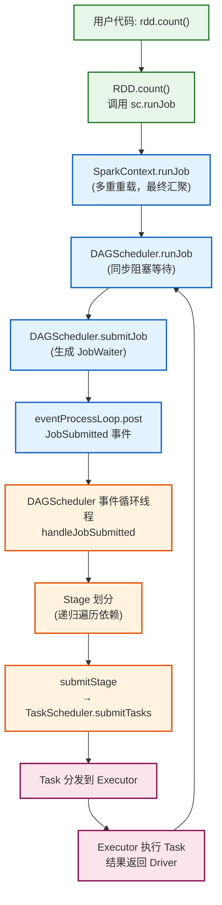
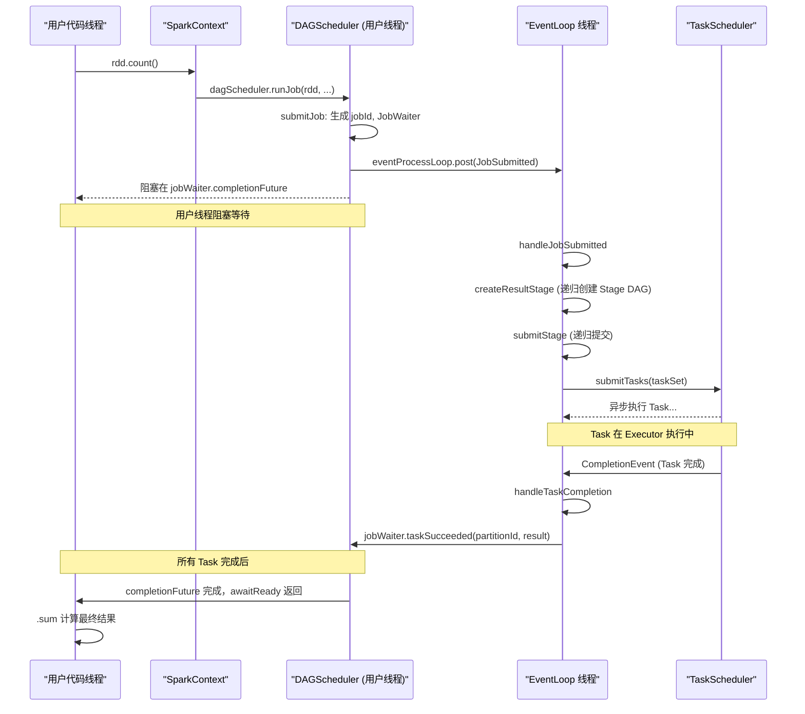

# 01 任务提交全链路：从用户代码到 RDD 动作的触发细节

> [!abstract] 摘要
> 一行 `rdd.count()` 在用户眼中不过是一个返回 Long 值的方法调用，但在 Spark 内部，它触发了一条跨越多个组件、涉及事件驱动架构、最终扩展到整个集群的精密协作链路。本文是调度系统专栏的开篇，将完整追踪这条链路的每一个环节：Action 算子如何成为"发令枪" → `SparkContext.runJob` 的多重重载设计背后的意图 → `DAGScheduler.submitJob` 如何将同步请求转化为异步事件 → 单线程事件循环（EventProcessLoop）为何是保证调度一致性的关键设计 → `handleJobSubmitted` 如何启动整个物理执行计划的构建。理解这一链路，是深入 Spark 调度系统的第一道门槛。

---

## 第 1 章 为什么任务提交是调度系统的核心入口？

### 1.1 从惰性执行到物理执行的跨越

Spark 的惰性求值（Lazy Evaluation）使得用户在编写 Transformation 算子时，集群完全静默——没有任何数据被读取，没有任何计算发生。这是 Spark 获得全局优化能力的代价：所有 Transformation 都被"欠着"，等待一个明确的"还债"信号。

这个信号，就是 **Action 算子**。

Action 算子（`count`、`collect`、`saveAsTextFile`、`foreach` 等）是 Spark 程序中"声明式逻辑"与"命令式执行"的分界线。在它被调用的那一刻，Spark 必须完成以下工作：
1. 从当前 RDD 向上遍历整个血缘图（Lineage DAG）
2. 确定哪些数据已经缓存、哪些需要重算
3. 将逻辑 DAG 切分为物理 Stage
4. 将每个 Stage 转化为 Task 集合
5. 将 Task 分发到集群中合适的 Executor 执行

所有这一切，都从一个方法调用开始：`SparkContext.runJob`。

### 1.2 任务提交链路的全局鸟瞰

在深入细节之前，先建立全局视图：



---

## 第 2 章 入口追踪：Action 算子的统一收敛

### 2.1 count() 的实现——极其简洁却意义深远

```scala
// org.apache.spark.rdd.RDD.scala
def count(): Long = sc.runJob(this, Utils.getIteratorSize _).sum
```

这一行代码包含了三个关键信息：
1. **`this`**：当前 RDD 对象，携带完整的血缘链（`dependencies` 字段指向父 RDD）
2. **`Utils.getIteratorSize _`**：每个 Task 在 Executor 端执行的函数——遍历分区 Iterator，统计元素数量
3. **`.sum`**：Driver 端汇聚各分区的统计结果

注意 `.sum` 是在 `runJob` 返回后才执行的——`runJob` 返回的是 `Array[Long]`（每个分区的计数），而 `.sum` 只是 Driver 端的一个简单数组操作。

### 2.2 不同 Action 算子的收敛方式

所有 Action 算子本质上都是"以不同方式消费 RDD 分区 Iterator 的函数"，它们的差异体现在：
- **消费方式**（统计数量 vs 收集数据 vs 写文件）
- **结果处理方式**（返回给 Driver vs 写入外部存储）
- **分区范围**（全部分区 vs 部分分区）

```scala
// collect()：收集所有分区数据到 Driver
def collect(): Array[T] = {
  val results = sc.runJob(this, (iter: Iterator[T]) => iter.toArray)
  Array.concat(results: _*)
}

// take(n)：只需要前 n 条，可能只处理前几个分区
def take(num: Int): Array[T] = {
  // 复杂逻辑：先尝试第一个分区，不够再扩展到更多分区
  // 利用惰性执行的短路优化，避免处理全部数据
  ...
}

// saveAsTextFile()：写入 HDFS/S3，Task 函数是写文件操作
def saveAsTextFile(path: String): Unit = {
  // 结果不需要返回 Driver，每个 Task 独立写一个文件
  this.map(x => (NullWritable.get(), new Text(x.toString)))
      .saveAsHadoopFile[TextOutputFormat[NullWritable, Text]](path)
}
```

### 2.3 SparkContext.runJob 的重载设计

`SparkContext` 提供了约 14 个 `runJob` 重载版本，最终全部收敛到这一个"终极重载"：

```scala
// org.apache.spark.SparkContext.scala
def runJob[T, U: ClassTag](
    rdd: RDD[T],
    func: (TaskContext, Iterator[T]) => U,  // Task 在 Executor 端执行的函数
    partitions: Seq[Int],                    // 需要执行的分区列表（可以是全部，也可以是部分）
    callSite: CallSite,                      // 调用栈信息，用于 UI 显示
    resultHandler: (Int, U) => Unit,         // 结果处理函数（分区索引, 结果值）
    properties: Properties                   // 调度属性（如公平调度池名）
): Unit = {
  if (stopped.get()) {
    throw new IllegalStateException("SparkContext has been shutdown")
  }
  val callSiteShortForm = callSite.shortForm
  val callSiteLongForm = callSite.longForm
  
  // 前置检查：分区范围是否合法
  if (partitions.nonEmpty) {
    val clsName = Utils.getFormattedClassName(rdd)
    logInfo(s"Starting job: $callSiteShortForm")
  }
  
  // 将任务交给 DAGScheduler
  dagScheduler.runJob(rdd, cleanedFunc, partitions, callSite, resultHandler,
    localProperties.get)
    
  // 进度追踪（用于 Spark UI）
  progressBar.foreach(_.finishAll())
  
  // rdd 检查点处理（若 rdd 标记了 checkpoint）
  rdd.doCheckpoint()
}
```

**设计意图分析**：`SparkContext.runJob` 本身不做任何实质性调度工作，它只完成：
1. 状态检查（SparkContext 是否已关闭）
2. 日志记录（方便 Spark UI 展示）
3. 将任务转交 `DAGScheduler`
4. 触发 Checkpoint（若有标记）

真正的调度逻辑完全在 `DAGScheduler` 中实现——这体现了 Spark 的职责分离设计原则。

---

## 第 3 章 同步与异步的边界：DAGScheduler.runJob 与 submitJob

### 3.1 runJob：阻塞等待的"同步门"

从 `SparkContext` 视角，`dagScheduler.runJob` 是一个**同步阻塞调用**——它会一直等待，直到所有指定分区的 Task 完成（或失败）才返回。

```scala
// org.apache.spark.scheduler.DAGScheduler.scala
def runJob[T, U](
    rdd: RDD[T],
    func: (TaskContext, Iterator[T]) => U,
    partitions: Seq[Int],
    callSite: CallSite,
    resultHandler: (Int, U) => Unit,
    properties: Properties): Unit = {
  val start = System.nanoTime
  
  // submitJob 立即返回一个 JobWaiter（不等待任务完成）
  val waiter = submitJob(rdd, func, partitions, callSite, resultHandler, properties)
  
  // 阻塞等待，直到 JobWaiter 收到所有分区完成或失败的通知
  ThreadUtils.awaitReady(waiter.completionFuture, Duration.Inf)
  
  waiter.completionFuture.value.get match {
    case scala.util.Success(_) =>
      logInfo("Job %d finished: %s, took %f s".format(
        waiter.jobId, callSite.shortForm, (System.nanoTime - start) / 1e9))
    case scala.util.Failure(exception) =>
      logInfo("Job %d failed: %s, took %f s".format(
        waiter.jobId, callSite.shortForm, (System.nanoTime - start) / 1e9))
      val callerStackTrace = Thread.currentThread().getStackTrace.tail
      exception.setStackTrace(exception.getStackTrace ++ callerStackTrace)
      throw exception
  }
}
```

**关键设计**：`runJob` 用 `ThreadUtils.awaitReady(waiter.completionFuture, Duration.Inf)` 阻塞当前线程（通常是用户代码所在的主线程），直到 Job 完成。这使得用户代码写起来像普通的同步函数调用，而不需要手动处理异步回调。

### 3.2 submitJob：将请求转化为异步事件

`submitJob` 是真正的"分水岭"：它不做任何调度工作，只是**将任务提交请求包装成一个事件，投递到异步事件队列中**。

```scala
def submitJob[T, U](
    rdd: RDD[T],
    func: (TaskContext, Iterator[T]) => U,
    partitions: Seq[Int],
    callSite: CallSite,
    resultHandler: (Int, U) => Unit,
    properties: Properties): JobWaiter[U] = {
    
  // 分区有效性检查
  val maxPartitions = rdd.partitions.length
  partitions.find(p => p >= maxPartitions || p < 0).foreach { p =>
    throw new IllegalArgumentException(...)
  }
  
  // 生成全局唯一的 Job ID
  val jobId = nextJobId.getAndIncrement()
  
  if (partitions.isEmpty) {
    // 没有分区需要执行，直接完成
    val clonedProperties = cloneProperties(properties)
    return new JobWaiter[U](this, jobId, 0, resultHandler)
  }
  
  // 创建 JobWaiter：Driver 端等待 Job 完成的"哨兵"
  val waiter = new JobWaiter[U](this, jobId, partitions.size, resultHandler)
  
  // 核心操作：将 JobSubmitted 事件投递到异步事件队列
  // 注意：post() 立即返回，不等待事件被处理
  eventProcessLoop.post(JobSubmitted(
    jobId, rdd, func2, partitions.toArray, callSite, waiter,
    Utils.cloneProperties(properties)))
    
  waiter  // 立即返回 JobWaiter，让 runJob 可以阻塞等待
}
```

**设计精妙之处**：
- `submitJob` 立即返回 `JobWaiter`（不阻塞）
- `runJob` 拿到 `JobWaiter` 后调用 `.awaitReady` 阻塞等待
- 实际的调度工作在另一个线程（事件循环线程）中异步进行
- 从用户视角看到的是"同步调用"，内部实现是"异步处理"

---

## 第 4 章 事件驱动架构：EventProcessLoop 的设计哲学

### 4.1 为什么不用直接函数调用？

最直观的设计是：`submitJob` 直接调用 `handleJobSubmitted(jobId, rdd, ...)`。为什么 Spark 要引入一个事件队列？

**原因一：避免并发竞态**

Spark 集群中同时可能有多个 Job 在运行（来自不同线程、不同用户的并发请求）。`DAGScheduler` 作为全局单例，需要同时处理：
- 新 Job 提交（`JobSubmitted`）
- Stage 完成通知（`StageCancelled`、`ShuffleMapStageSubmitted`）
- Task 完成/失败通知（`CompletionEvent`）
- Executor 上下线通知（`ExecutorAdded`、`ExecutorLost`）

如果这些事件都通过直接函数调用处理，需要在 `DAGScheduler` 中维护大量 `synchronized` 锁，代码复杂性爆炸，且死锁风险极高。

**原因二：单线程串行化的简洁性**

通过 `EventProcessLoop`（一个单线程的事件循环），所有对 `DAGScheduler` 状态的修改都被串行化到同一个线程中：
- 无需任何锁（因为只有一个线程访问这些状态）
- 事件处理逻辑可以随意读写共享状态（`waitingStages`、`runningStages` 等）
- 调度状态机的实现变得简单直观

**原因三：自然的优先级控制**

事件队列天然支持事件的排队和优先级处理。例如，可以让"Task 失败"事件优先于"新 Job 提交"事件处理，实现精细的调度控制。

### 4.2 EventProcessLoop 的内部实现

```scala
// org.apache.spark.util.EventLoop.scala（简化）
abstract class EventLoop[E](name: String) {
  private val eventQueue = new LinkedBlockingDeque[E]()
  
  // 单一后台线程，持续从队列中取事件并处理
  private val eventThread = new Thread(name) {
    setDaemon(true)
    override def run(): Unit = {
      try {
        while (!stopped.get) {
          val event = eventQueue.take()  // 阻塞等待新事件
          try {
            onReceive(event)  // 处理事件（由子类实现）
          } catch {
            case NonFatal(e) => onError(e)
          }
        }
      }
    }
  }
  
  def post(event: E): Unit = eventQueue.put(event)  // 投递事件（非阻塞）
  protected def onReceive(event: E): Unit  // 子类实现具体处理逻辑
}

// DAGScheduler 的事件循环实现
private[scheduler] class DAGSchedulerEventProcessLoop(dagScheduler: DAGScheduler)
    extends EventLoop[DAGSchedulerEvent]("dag-scheduler-event-loop") {

  override def onReceive(event: DAGSchedulerEvent): Unit = {
    event match {
      case JobSubmitted(jobId, rdd, func, partitions, callSite, listener, properties) =>
        dagScheduler.handleJobSubmitted(jobId, rdd, func, partitions, callSite, listener, properties)
      case StageCancelled(stageId, reason) =>
        dagScheduler.handleStageCancellation(stageId, reason)
      case JobCancelled(jobId, reason) =>
        dagScheduler.handleJobCancellation(jobId, reason)
      case CompletionEvent(task, reason, result, accumUpdates, taskInfo) =>
        dagScheduler.handleTaskCompletion(CompletionEvent(task, reason, result, accumUpdates, taskInfo))
      case ExecutorLost(execId, reason) =>
        dagScheduler.handleExecutorLost(execId, reason, maybeEpoch = None)
      ...
    }
  }
}
```

### 4.3 JobWaiter：连接异步调度与同步用户代码的桥梁

`JobWaiter` 是一个精巧的设计，它用 Scala 的 `Promise/Future` 机制连接了两个世界：

```scala
private[spark] class JobWaiter[T](
    dagScheduler: DAGScheduler,
    val jobId: Int,
    totalTasks: Int,
    resultHandler: (Int, T) => Unit) {

  // Promise：可以被外部线程（事件循环线程）完成或失败
  private val jobPromise: Promise[Unit] =
    if (totalTasks == 0) Promise.successful(()) else Promise()

  // Future：用户线程通过 await 阻塞等待
  def completionFuture: Future[Unit] = jobPromise.future

  // 当一个分区 Task 完成时，事件循环线程调用此方法
  def taskSucceeded(index: Int, result: Any): Unit = synchronized {
    if (_jobCancelled) {
      // Job 已被取消，丢弃结果
    } else {
      resultHandler(index, result.asInstanceOf[T])
      finishedTasks += 1
      if (finishedTasks == totalTasks) {
        jobPromise.success(())  // 所有 Task 完成，完成 Promise
      }
    }
  }

  // 当 Job 失败时，事件循环线程调用此方法
  def jobFailed(exception: Exception): Unit = {
    jobPromise.failure(exception)  // 失败 Promise，使 await 抛出异常
  }
}
```

**工作流程**：
1. `submitJob` 创建 `JobWaiter`，返回给 `runJob`
2. `runJob` 调用 `jobWaiter.completionFuture` 的 `await`，用户主线程阻塞
3. 事件循环线程处理 Job，每当一个 Task 完成，调用 `jobWaiter.taskSucceeded`
4. 所有 Task 完成后，`jobWaiter.taskSucceeded` 完成 Promise
5. 用户主线程的 `await` 返回，`runJob` 继续执行

---

## 第 5 章 handleJobSubmitted：物理执行计划的起点

当 `JobSubmitted` 事件被事件循环线程捕获后，`handleJobSubmitted` 开始构建物理执行计划。这是 Spark 调度系统真正"动起来"的地方。

### 5.1 创建 ResultStage 和 ActiveJob

```scala
// org.apache.spark.scheduler.DAGScheduler.scala
private[scheduler] def handleJobSubmitted(
    jobId: Int,
    finalRDD: RDD[_],
    func: (TaskContext, Iterator[_]) => _,
    partitions: Array[Int],
    callSite: CallSite,
    listener: JobListener,
    properties: Properties): Unit = {

  var finalStage: ResultStage = null
  try {
    // 从 finalRDD 向上递归创建 Stage DAG
    // 遇到 ShuffleDependency 时创建 ShuffleMapStage，遇到 NarrowDependency 时并入当前 Stage
    finalStage = createResultStage(finalRDD, func, partitions, jobId, callSite)
  } catch {
    case e: BarrierJobSlotsNumberCheckFailed => ...
    case e: Exception =>
      logWarning("Creating new stage failed due to exception - job: " + jobId, e)
      listener.jobFailed(e)
      return
  }

  // 创建 ActiveJob：记录 Job 运行状态
  val job = new ActiveJob(jobId, finalStage, callSite, listener, properties)
  clearCacheLocs()  // 清理 RDD 分区缓存位置的过期记录
  
  // 注册 Job
  jobIdToActiveJob(jobId) = job
  activeJobs += job
  finalStage.setActiveJob(job)
  
  // 向 Spark UI 汇报 Job 开始
  val stageIds = jobIdToStageIds.getOrElse(jobId, HashSet.empty)
  val stageInfos = stageIds.flatMap(id => stageIdToStage.get(id).map(_.latestInfo)).toArray
  listenerBus.post(SparkListenerJobStart(job.jobId, jobSubmissionTime, stageInfos, properties))
  
  // 提交最终 Stage（会递归触发所有前置 Stage 的提交）
  submitStage(finalStage)
}
```

### 5.2 Stage 提交的状态机

`submitStage` 实现了一个简洁的状态机：

```scala
private def submitStage(stage: Stage): Unit = {
  val jobId = activeJobForStage(stage)
  if (jobId.isDefined) {
    logDebug(s"submitStage($stage (name=${stage.name};" + s"jobs=${stage.jobIds}))")
    if (!waitingStages(stage) && !runningStages(stage) && !failedStages(stage)) {
      // 获取所有未完成的父 Stage
      val missing = getMissingParentStages(stage).sortBy(_.id)
      logDebug("missing: " + missing)
      if (missing.isEmpty) {
        // 所有父 Stage 都已完成，可以立即提交
        logInfo("Submitting " + stage + " (" + stage.rdd + "), which has no missing parents")
        submitMissingTasks(stage, jobId.get)
      } else {
        // 有未完成的父 Stage，先递归提交父 Stage
        for (parent <- missing) {
          submitStage(parent)
        }
        waitingStages += stage  // 当前 Stage 进入等待队列
      }
    }
  } else {
    abortStage(stage, "No active job for stage " + stage.id, None)
  }
}
```

---

## 第 6 章 全链路时序总结

梳理整个提交链路的线程模型：



---

## 第 7 章 生产视角：任务提交链路上的常见性能问题

### 7.1 调度延迟（Scheduling Delay）

Spark UI 中每个 Task 都有一个"Scheduler Delay"指标，表示从 Task 被提交到 TaskScheduler 到真正开始执行之间的时间差。

调度延迟高的常见原因：
- **Task 数量过多**：10000 个 Task 的 Stage，`resourceOffers` 的匹配循环本身需要时间
- **频繁的小 Job 提交**：在循环中调用 `count()` 等 Action，每次都触发完整的事件提交流程
- **EventLoop 线程繁忙**：大量 Task 完成事件堆积，导致新 Job 的 `JobSubmitted` 事件被延迟处理

### 7.2 在循环中频繁提交 Job 的反模式

```scala
// 反模式：每轮循环触发一次 Job（Scheduler Delay 累积，Driver 负担重）
var result = 0L
for (i <- 1 to 100) {
  result += rdd.filter(_.id == i).count()  // 100 次 Job 提交！
}

// 正确做法：合并为一次 Job
val countByKey = rdd.groupBy(_.id).mapValues(_.size).collectAsMap()
val result = (1 to 100).map(i => countByKey.getOrElse(i, 0L)).sum
```

### 7.3 理解 callSite 在调试中的价值

`CallSite` 记录了触发 Job 的用户代码位置（文件名 + 行号），这正是 Spark UI 中 "Job Description" 显示的内容。养成给 RDD 命名（`rdd.setName("my_rdd")`）和理解 callSite 的习惯，可以在调试复杂作业时快速定位慢 Job 的代码位置。

---

## 第 8 章 总结

任务提交链路揭示了 Spark 调度系统的核心架构哲学：

- **同步入口，异步处理**：用户看到阻塞调用，内部是事件驱动
- **单线程状态机**：EventProcessLoop 串行化所有调度决策，消除竞态
- **职责分离**：SparkContext（入口）→ DAGScheduler（逻辑调度）→ TaskScheduler（物理调度）三层清晰分工
- **JobWaiter 桥梁**：用 Promise/Future 连接异步事件系统与同步用户代码

在 **[[02 DAGScheduler 核心逻辑：Stage 划分算法与逻辑计划生成|下一篇文章]]** 中，我们将深入 `handleJobSubmitted` 的核心——`createResultStage` 和 `getMissingParentStages` 的完整算法，理解 DAGScheduler 如何将 RDD 血缘图切分为物理 Stage。

---

> [!note] 思考题
> 1. 为什么 `EventProcessLoop` 只使用一个线程处理所有调度事件，而不是使用线程池并行处理？多线程处理调度事件会引入哪些问题？
> 2. `JobWaiter.taskSucceeded` 在事件循环线程中被调用，但 `resultHandler`（如 `collect()` 中的数组填充）也在这里执行。如果 `resultHandler` 执行很慢（如处理大量数据），会阻塞事件循环线程吗？这会导致什么问题？
> 3. `rdd.take(10)` 的实现需要"短路优化"——获取足够的记录后停止计算。但 Task 一旦提交就无法中途取消（已经在 Executor 上运行）。Spark 如何实现 `take(n)` 的部分分区执行？
