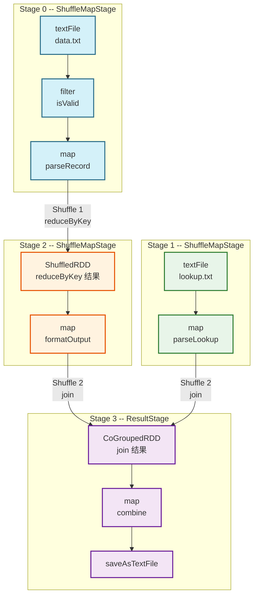

# 02 DAGScheduler 核心逻辑：Stage 划分算法与逻辑计划生成

> [!abstract] 摘要
> 上一篇追踪了 Action 算子如何通过事件驱动机制触达 `handleJobSubmitted`。本文深入这个方法的核心——`DAGScheduler` 的 Stage 划分算法。这是 Spark 调度系统最重要的一个决策点：它决定了一个 Job 会被切分为多少个 Stage，哪些算子可以 Pipeline 在一起，哪些必须等待 Shuffle 完成后才能启动。本文将完整推导：Stage 的本质定义是什么 → `getOrCreateShuffleMapStage` 如何递归构建 Stage DAG → `getMissingParentStages` 的 DFS 遍历逻辑 → `submitMissingTasks` 如何将 Stage 转化为 TaskSet → Stage 级别容错的完整机制 → 以及 `MapOutputTracker` 在 Shuffle 数据定位中扮演的角色。

---

## 第 1 章 为什么要划分 Stage：同步屏障的物理必然性

### 1.1 分布式计算的核心约束

在 100 台机器的集群上并行处理 1TB 数据时，绝大多数算子（`map`、`filter`、`flatMap`）都是"本地的"——每台机器处理自己的数据分区，互不依赖，可以真正并行。

但 `groupByKey`、`reduceByKey`、`join` 等算子要求**全局数据重组**：相同 Key 的数据必须汇聚到同一个计算节点，而这些数据可能分散在 100 台机器的任意位置。这种全局重组只有一种实现方式：**Shuffle**——每台机器将自己的数据按 Key 分类写出，其他机器来拉取。

Shuffle 引入了一个不可回避的物理约束：**下游必须等待所有上游写完 Shuffle 数据后，才能开始拉取**。这个等待点，就是 Stage 边界的物理本质。

Stage 的定义可以精确表述为：**Stage 是一组可以流水线（Pipeline）执行的 Task 集合，Stage 内部所有 Task 之间没有数据依赖（只有窄依赖），Stage 与 Stage 之间通过 Shuffle 通信（宽依赖），后一个 Stage 必须等待前一个 Stage 完全完成后才能启动。**

### 1.2 Stage 的两种形态

DAGScheduler 将 Stage 划分为两类，分别对应 Shuffle 数据管道的"生产端"和"消费端"：

**ShuffleMapStage（Shuffle 数据生产者）**：
- 对应 DAG 中的非末端节点（上游 Stage）
- 每个 Task（ShuffleMapTask）完成后，将结果按分区写入本地磁盘的 Shuffle 文件
- 向 `MapOutputTracker` 汇报每个输出分区的数据量和位置（`MapStatus`）
- 只有当 Stage 的所有 Task 都完成（`isAvailable == true`）后，下游 Stage 才能启动

**ResultStage（最终结果生产者）**：
- 对应 DAG 中的末端 Stage（唯一的 ResultStage）
- 每个 Task（ResultTask）完成后，将结果直接返回 Driver（如 `collect`）或写入外部存储（如 `saveAsTextFile`）
- 每个分区完成后通知 `JobWaiter`，所有分区完成后 Job 结束

### 1.3 Stage 数量与 Shuffle 数量的关系

一个 Job 的 Stage 数量 = Shuffle 操作数 + 1。

推导：每次 Shuffle 产生一个 ShuffleMapStage（上游）和一个下游 Stage（可能是另一个 ShuffleMapStage 或 ResultStage）。有 k 次 Shuffle 的 DAG，产生 k 个 ShuffleMapStage + 1 个 ResultStage = k+1 个 Stage。

这个规律的直接含义：**减少 Shuffle 次数是降低 Stage 数量、提升作业性能的最直接手段**。

---

## 第 2 章 Stage 创建算法：从 ResultStage 到完整 Stage DAG

### 2.1 createResultStage：向上递归构建

`handleJobSubmitted` 首先调用 `createResultStage`，这是整个 Stage 创建过程的入口：

```scala
private def createResultStage(
    rdd: RDD[_],          // Action 作用的末端 RDD
    func: (TaskContext, Iterator[_]) => _,
    partitions: Array[Int],
    jobId: Int,
    callSite: CallSite): ResultStage = {
    
  checkBarrierStageWithDynamicAllocation(rdd)
  checkBarrierStageWithNumSlots(rdd, resourceProfile)
  checkBarrierStageWithRDDChainPattern(rdd, partitions.toSet)
  
  // 关键：为当前 RDD 的所有 ShuffleDependency 创建父 ShuffleMapStage
  // 这个调用会递归向上遍历，创建完整的 Stage DAG
  val parents = getOrCreateParentStages(rdd, jobId)
  
  val id = nextStageId.getAndIncrement()
  val stage = new ResultStage(id, rdd, func, partitions, parents, jobId, callSite)
  stageIdToStage(id) = stage
  updateJobIdStageIdMaps(jobId, stage)
  stage
}
```

### 2.2 getOrCreateParentStages：发现上游 Stage

```scala
private def getOrCreateParentStages(rdd: RDD[_], firstJobId: Int): List[Stage] = {
  // 找到当前 RDD 可直接"看到"的所有 ShuffleDependency（不穿越其他 ShuffleDependency）
  getShuffleDependencies(rdd).map { shuffleDep =>
    // 对每个 ShuffleDependency，创建或复用对应的 ShuffleMapStage
    getOrCreateShuffleMapStage(shuffleDep, firstJobId)
  }.toList
}
```

### 2.3 getShuffleDependencies：找到最近的宽依赖边界

这是 Stage 划分算法的核心——找到从当前 RDD 向上"可以看到"的第一层 ShuffleDependency：

```scala
private[scheduler] def getShuffleDependencies(
    rdd: RDD[_]): HashSet[ShuffleDependency[_, _, _]] = {
    
  val parents = new HashSet[ShuffleDependency[_, _, _]]
  val visited = new HashSet[RDD[_]]
  val waitingForVisit = new ArrayStack[RDD[_]]
  
  waitingForVisit.push(rdd)
  while (waitingForVisit.nonEmpty) {
    val toVisit = waitingForVisit.pop()
    if (!visited(toVisit)) {
      visited += toVisit
      toVisit.dependencies.foreach {
        case shuffleDep: ShuffleDependency[_, _, _] =>
          // 遇到宽依赖：记录它，停止该方向的遍历（不再向上穿越）
          parents += shuffleDep
        case dependency =>
          // 遇到窄依赖：继续向上遍历（窄依赖不是边界，并入当前 Stage）
          waitingForVisit.push(dependency.rdd)
      }
    }
  }
  parents
}
```

**算法语义**：从给定 RDD 出发，沿窄依赖向上遍历，直到遇到 ShuffleDependency 为止。所有遇到的 ShuffleDependency 就是当前 Stage 的"上游边界"。

**为什么遇到 ShuffleDependency 就停止？** 因为 ShuffleDependency 对应的父 RDD 属于上游 Stage（ShuffleMapStage），不属于当前 Stage。当前 Stage 只负责从 Shuffle 数据源（ShuffledRDD）开始，到当前 Stage 的末端 RDD 为止的所有窄依赖链。

### 2.4 getOrCreateShuffleMapStage：创建/复用 Stage

```scala
private def getOrCreateShuffleMapStage(
    shuffleDep: ShuffleDependency[_, _, _],
    firstJobId: Int): ShuffleMapStage = {
    
  shuffleIdToMapStage.get(shuffleDep.shuffleId) match {
    case Some(stage) =>
      // 已存在的 Stage：复用（同一个 Shuffle 可能被多个 Job 共享）
      stage
    case None =>
      // 尚不存在：需要创建
      // 首先，递归确保这个 ShuffleMapStage 的所有父 Stage 也被创建
      getMissingAncestorShuffleDependencies(shuffleDep.rdd).foreach { dep =>
        if (!shuffleIdToMapStage.contains(dep.shuffleId)) {
          createShuffleMapStage(dep, firstJobId)
        }
      }
      // 创建当前 ShuffleMapStage
      createShuffleMapStage(shuffleDep, firstJobId)
  }
}

private def createShuffleMapStage[K, V, C](
    shuffleDep: ShuffleDependency[K, V, C], jobId: Int): ShuffleMapStage = {
    
  val rdd = shuffleDep.rdd
  val numTasks = rdd.partitions.length
  
  // 递归创建当前 Stage 的父 Stage
  val parents = getOrCreateParentStages(rdd, jobId)
  
  val id = nextStageId.getAndIncrement()
  val stage = new ShuffleMapStage(
    id, rdd, numTasks, parents, jobId, rdd.creationSite, shuffleDep, mapOutputTracker)
  
  stageIdToStage(id) = stage
  shuffleIdToMapStage(shuffleDep.shuffleId) = stage
  updateJobIdStageIdMaps(jobId, stage)
  stage
}
```

**Stage 共享机制**：`shuffleIdToMapStage` 缓存了 ShuffleId 到 ShuffleMapStage 的映射。如果同一个 Shuffle（如 `rdd.reduceByKey`）被多个 Job 共用（如同一个 RDD 被多次触发 Action），`getOrCreateShuffleMapStage` 会复用已有的 Stage 而非重新创建，避免重复计算。

---

## 第 3 章 Stage DAG 的完整构建过程：一个具体案例

用一个三 Stage 的例子来梳理完整流程：

```scala
val rdd1 = sc.textFile("hdfs://data.txt")           // HadoopRDD
val rdd2 = rdd1.filter(isValid)                       // FilteredRDD（窄）
val rdd3 = rdd2.map(parseRecord)                      // MappedRDD（窄）
val rdd4 = rdd3.reduceByKey(_ + _)                    // ShuffledRDD（宽）← Shuffle 1
val rdd5 = rdd4.map(formatOutput)                     // MappedRDD（窄）
val rdd6 = sc.textFile("hdfs://lookup.txt")           // HadoopRDD
val rdd7 = rdd6.map(parseLookup)                      // MappedRDD（窄）
val rdd8 = rdd5.join(rdd7)                            // CoGroupedRDD（宽）← Shuffle 2
val rdd9 = rdd8.map(combine)                          // MappedRDD（窄）
rdd9.saveAsTextFile("hdfs://output/")                 // Action
```

**构建过程**（`createResultStage(rdd9)`）：

1. `getShuffleDependencies(rdd9)` → 向上遍历（rdd9 → rdd8 为 NarrowDep，继续），遇到 rdd8 的两个 ShuffleDependency（Shuffle 1 和 Shuffle 2），停止
2. 对 Shuffle 2（rdd5.join(rdd7)），调用 `getOrCreateShuffleMapStage`：
   - 递归 `getShuffleDependencies(rdd5)` → 找到 Shuffle 1（reduceByKey）
   - 为 Shuffle 1 创建 **Stage 0**（ShuffleMapStage，包含 rdd1→rdd2→rdd3）
   - 为 rdd7 创建 **Stage 1**（ShuffleMapStage，包含 rdd6→rdd7）
   - 创建 **Stage 2**（ShuffleMapStage，包含 rdd4→rdd5）
3. 创建 **Stage 3**（ResultStage，包含 rdd8→rdd9）

| Stage | 类型 | 包含的 RDD 算子链 | 依赖 |
| :--- | :--- | :--- | :--- |
| Stage 0 | ShuffleMapStage | textFile → filter → map | 无父 Stage |
| Stage 1 | ShuffleMapStage | textFile → map | 无父 Stage |
| Stage 2 | ShuffleMapStage | ShuffledRDD(reduceByKey) → map | Stage 0 |
| Stage 3 | ResultStage | CoGroupedRDD(join) → map → save | Stage 1, Stage 2 |

执行顺序：Stage 0 和 Stage 1 可以并行执行，Stage 2 等待 Stage 0 完成，Stage 3 等待 Stage 1 和 Stage 2 均完成。



---

## 第 4 章 getMissingParentStages：提交前的依赖检查

Stage 创建完成后，`submitStage` 调用 `getMissingParentStages` 检查哪些父 Stage 尚未完成：

```scala
private def getMissingParentStages(stage: Stage): List[Stage] = {
  val missing = new HashSet[Stage]
  val visited = new HashSet[RDD[_]]
  val waitingForVisit = new ArrayStack[RDD[_]]
  
  def visit(rdd: RDD[_]): Unit = {
    if (!visited(rdd)) {
      visited += rdd
      // 关键优化：如果这个 RDD 的所有分区都已缓存，不需要向上追溯
      val rddHasUncachedPartitions = getCacheLocs(rdd).contains(Nil)
      if (rddHasUncachedPartitions) {
        for (dep <- rdd.dependencies) {
          dep match {
            case shufDep: ShuffleDependency[_, _, _] =>
              val mapStage = getOrCreateShuffleMapStage(shufDep, stage.firstJobId)
              if (!mapStage.isAvailable) {
                missing += mapStage  // 父 Stage 未完成，加入缺失列表
              }
            case narrowDep: NarrowDependency[_] =>
              waitingForVisit.push(narrowDep.rdd)  // 窄依赖，继续向上检查
          }
        }
      }
    }
  }
  
  waitingForVisit.push(stage.rdd)
  while (waitingForVisit.nonEmpty) {
    visit(waitingForVisit.pop())
  }
  missing.toList
}
```

**缓存的截断效果**：`getCacheLocs(rdd).contains(Nil)` 检查这个 RDD 是否所有分区都已缓存。如果是，不需要向上追溯血缘——缓存相当于在血缘图中插入了一个"已计算完成"的节点，上游 Stage 不需要重新执行。这是 `cache()` 能提升迭代计算性能的调度层面解释。

---

## 第 5 章 submitMissingTasks：将 Stage 转化为 TaskSet

当一个 Stage 的所有父 Stage 都已完成，`submitMissingTasks` 负责将该 Stage 转化为一组具体的 Task：

```scala
private def submitMissingTasks(stage: Stage, jobId: Int): Unit = {
  // 找出这个 Stage 中哪些分区还没有计算完成（考虑缓存和 checkpoint）
  val partitionsToCompute: Seq[Int] = stage.findMissingPartitions()
  
  // 为每个需要计算的分区创建 Task
  val tasks: Seq[Task[_]] = try {
    val serializedTaskMetrics = closureSerializer.serialize(stage.latestInfo.taskMetrics).array()
    stage match {
      case stage: ShuffleMapStage =>
        stage.pendingPartitions.clear()
        partitionsToCompute.map { id =>
          val locs = taskIdToLocations(id)  // 数据本地性偏好位置
          val part = partitions(id)
          stage.pendingPartitions += id
          // 创建 ShuffleMapTask：执行分区数据并写 Shuffle 文件
          new ShuffleMapTask(stage.id, stage.latestInfo.attemptNumber, taskBinary,
            part, locs, properties, serializedTaskMetrics, Option(jobId), Option(sc.applicationId),
            sc.applicationAttemptId, stage.rdd.isBarrier())
        }

      case stage: ResultStage =>
        partitionsToCompute.map { id =>
          val p: Int = stage.partitions(id)
          val part = partitions(p)
          val locs = taskIdToLocations(id)
          // 创建 ResultTask：执行分区数据并返回结果给 Driver
          new ResultTask(stage.id, stage.latestInfo.attemptNumber, taskBinary, part,
            locs, id, properties, serializedTaskMetrics, Option(jobId),
            Option(sc.applicationId), sc.applicationAttemptId, stage.rdd.isBarrier())
        }
    }
  }
  
  if (tasks.nonEmpty) {
    logInfo(s"Submitting ${tasks.size} missing tasks from $stage ...")
    // 将 Task 集合封装为 TaskSet，提交给 TaskScheduler
    taskScheduler.submitTasks(
      new TaskSet(tasks.toArray, stage.id, stage.latestInfo.attemptNumber, jobId, properties,
        stage.resourceProfileId))
  }
}
```

**`taskBinary` 的序列化**：在创建 Task 之前，`submitMissingTasks` 会将 Stage 对应的 RDD 和函数闭包**序列化为字节数组**（`taskBinary`），这是 Task 在网络上传输到 Executor 的"货物"。所有同一个 Stage 的 Task 共享同一份序列化的 `taskBinary`，避免重复序列化。

---

## 第 6 章 Stage 完成与下游触发：handleShuffleMapStageCompletion

当一个 ShuffleMapStage 的所有 Task 都完成后，事件循环线程执行 `handleShuffleMapStageCompletion`：

```scala
private def handleShuffleMapStageCompletion(shuffleStage: ShuffleMapStage): Unit = {
  shuffleStage.isAvailable = true  // 标记 Stage 为可用
  
  // 通知 MapOutputTracker：该 Shuffle 的所有输出位置已就绪
  mapOutputTracker.registerAllMapOutput(shuffleStage.shuffleDep.shuffleId,
    shuffleStage.outputLocs.map(_.head).toArray)
  
  // 检查是否有等待该 Stage 完成的下游 Stage
  if (waitingStages.nonEmpty || runningStages.nonEmpty || failedStages.nonEmpty) {
    val newlyRunnable = new ArrayBuffer[Stage]
    for (waiting <- waitingStages) {
      logDebug("Checking if stage " + waiting + " is now runnable")
      val missing = getMissingParentStages(waiting)
      if (missing.isEmpty) {
        logInfo("Submitting " + waiting + " which is now runnable")
        newlyRunnable += waiting
      }
    }
    waitingStages --= newlyRunnable
    runningStages ++= newlyRunnable
    for (stage <- newlyRunnable.sortBy(_.id)) {
      submitMissingTasks(stage, jobIdForStage(stage).get)
    }
  }
}
```

**触发链**：Stage 0 完成 → 检查 waitingStages → 发现 Stage 2 的所有父 Stage（Stage 0）已完成 → 将 Stage 2 从 waiting 移到 running → `submitMissingTasks(Stage 2)` → Stage 2 的 TaskSet 提交给 TaskScheduler。

---

## 第 7 章 Stage 级容错：FetchFailedException 的处理

### 7.1 什么触发了 Stage 级重算？

当一个 Reduce Task 在读取 Shuffle 数据时失败，抛出 `FetchFailedException`（通常因为存储 Map 端 Shuffle 文件的 Executor 崩溃），这个异常被封装为 `CompletionEvent(task, FetchFailed(...))` 投递到事件循环。

### 7.2 handleTaskCompletion 中的 FetchFailed 处理

```scala
case FetchFailed(bmAddress, shuffleId, _, mapIndex, reduceId, failureMessage) =>
  val failedStage = stageIdToStage(task.stageId)
  val mapStage = shuffleIdToMapStage(shuffleId)
  
  if (failedStage.latestInfo.attemptNumber != task.stageAttemptId) {
    // 这是旧 attempt 的失败，忽略
  } else {
    // 将失败的 Stage 和其上游 ShuffleMapStage 标记为需要重算
    failedStages += failedStage
    failedStages += mapStage
    
    // 清理 MapOutputTracker 中该 Shuffle 的输出记录
    // （使已经完成的 Reduce Task 可以重新拉取）
    mapOutputTracker.unregisterAllMapOutput(shuffleId)
    
    // 清理 BlockManagerMaster 中该 Executor 的 Shuffle 文件记录
    if (bmAddress != null) {
      blockManagerMaster.removeExecutorAsync(bmAddress.executorId)
    }
  }
  
  // 调度重新提交（在下一次调度循环中触发）
  messageScheduler.schedule(
    new Runnable { def run(): Unit = eventProcessLoop.post(ResubmitFailedStages) },
    DAGScheduler.RESUBMIT_TIMEOUT,
    TimeUnit.MILLISECONDS)
```

**级联效果**：一个 Executor 崩溃导致 Map 端 Shuffle 文件丢失，可能触发当前正在运行的所有依赖该 Shuffle 输出的 Reduce Task 全部失败，并重新触发整个 ShuffleMapStage 的重算。这正是宽依赖容错代价高昂的调度层面体现。

---

## 第 8 章 MapOutputTracker：Shuffle 数据的"寻址簿"

`MapOutputTracker` 是 DAGScheduler 容错机制的重要基础设施。它维护了一张全局的"Shuffle 输出地址簿"：

- **Driver 端**（`MapOutputTrackerMaster`）：维护每个 Shuffle 的所有 Map Task 输出位置（`MapStatus`，包含 Executor 地址和每个分区的数据量）
- **Executor 端**（`MapOutputTrackerWorker`）：缓存本 Executor 查询过的 Map 输出位置，避免重复查询 Driver

当 Reduce Task 需要读取 Shuffle 数据时：
1. 向本地 `MapOutputTrackerWorker` 查询目标 Map 输出的位置
2. `MapOutputTrackerWorker` 若无缓存，向 Driver 端的 `MapOutputTrackerMaster` 发 RPC 请求
3. `MapOutputTrackerMaster` 返回所有 Map 输出的位置信息（哪台 Executor、哪个文件、哪个偏移区间）
4. Reduce Task 根据这些位置信息，通过 `BlockTransferService` 从对应 Executor 拉取数据

当 Shuffle 文件丢失（Executor 崩溃）时，DAGScheduler 调用 `mapOutputTracker.unregisterAllMapOutput(shuffleId)` 清空该 Shuffle 的位置记录，使后续的 Reduce Task 无法找到数据，进而触发 `FetchFailedException`，推动 Stage 重算。

---

## 第 9 章 总结

DAGScheduler 的 Stage 划分算法是 Spark 调度系统最精华的设计之一：

- **Stage 划分的物理依据**：宽依赖（Shuffle）引入的同步屏障，是 Stage 边界的唯一判断标准
- **递归构建算法**：从末端 RDD 向上 DFS，窄依赖并入当前 Stage，宽依赖处切割创建父 ShuffleMapStage
- **Stage 的执行顺序**：拓扑排序，所有父 Stage 完成后子 Stage 才能提交
- **缓存对调度的影响**：`getCacheLocs` 检查允许 Stage 划分跳过已缓存的 RDD，减少不必要的重算
- **容错机制**：`FetchFailedException` 触发上游 ShuffleMapStage 重算，`MapOutputTracker` 维护 Shuffle 输出的全局位置索引

在 **[[03 TaskScheduler 架构解析：任务编排与调度后端的协作机制|下一篇文章]]** 中，我们将追踪 `submitMissingTasks` 提交的 `TaskSet` 如何被 `TaskScheduler` 接收、匹配资源并最终分发到 Executor 执行。

---

> [!note] 思考题
> 1. 同一个 `ShuffleMapStage` 可以被多个 Job 共享吗？如果两个独立的 Job 都依赖同一个 `rdd.reduceByKey`（比如从同一个 cached RDD 出发），这个 reduceByKey 对应的 ShuffleMapStage 会被执行两次吗？
> 2. `getMissingParentStages` 遇到已缓存的 RDD 会停止向上遍历。如果一个 RDD 被 `cache()` 但其中 30% 的分区因内存压力被逐出，`getMissingParentStages` 会怎么处理？那些被逐出分区对应的 Task 需要重算吗？
> 3. 当 Stage 2 因为 FetchFailedException 需要重算 Stage 0 时，Stage 3（ResultStage）中已经完成的 Task 还需要重跑吗？已经写入 HDFS 的分区数据需要删除吗？
