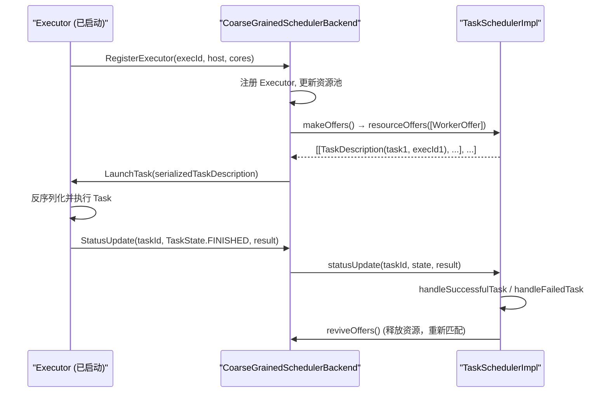

# 03 TaskScheduler 架构解析：任务编排与调度后端的协作机制

> [!abstract] 摘要
> 上一篇中，`DAGScheduler` 完成了从逻辑 DAG 到物理 Stage 的转化，并将每个 Stage 封装为 `TaskSet` 提交给 `TaskScheduler`。从这一刻起，调度的视角从"Stage 级别"下降到"Task 级别"。`TaskScheduler` 不再关心 RDD 血缘和 Stage 依赖，它只关注一件事：**把手中的 Task 分配给合适的 Executor 执行**。本文将系统解析 `TaskSchedulerImpl` 的核心架构：`TaskSet` 如何被包装为 `TaskSetManager` → Resource Offer 机制的本质 → 多层本地化匹配算法 → `SchedulerBackend` 的抽象设计与解耦价值 → 任务状态追踪与反馈机制 → 以及黑名单（Exclusion）机制在生产环境中的防雪崩作用。

---

## 第 1 章 TaskScheduler 的边界定义：它负责什么，不负责什么

### 1.1 职责内聚

理解一个组件的价值，先要理解它的边界。`TaskScheduler` 的职责边界极为清晰：

**负责**：
- 接收 `TaskSet`（一个 Stage 所有 Task 的集合），为每个 Task 找到合适的 Executor
- 根据数据本地性（Data Locality）偏好，尽量将 Task 分配到数据所在的节点
- 追踪每个 Task 的执行状态（等待、运行、成功、失败）
- 处理 Task 级别的失败与重试（最多重试 `spark.task.maxFailures` 次）
- 启动推测执行（Speculative Execution）处理长尾 Task

**不负责**：
- 不理解 Shuffle 的含义（不知道什么是 ShuffleDependency）
- 不处理 Stage 之间的依赖关系（上游 Stage 是否完成由 DAGScheduler 控制）
- 不直接与 YARN/K8s 通信（通过 `SchedulerBackend` 抽象层隔离）
- 不处理 `FetchFailedException`（这是 Stage 级别的容错，由 DAGScheduler 处理）

### 1.2 双层调度器的协作模式

Spark 的调度体系是经典的双层设计：

```
DAGScheduler（上层调度器）
    ↕ TaskSet / TaskSchedulerListener
TaskScheduler（下层调度器）
    ↕ WorkerOffer / TaskDescription
SchedulerBackend（资源管理适配层）
    ↕ 资源协议（YARN ApplicationMaster、K8s Pod）
集群资源管理器（YARN、K8s、Standalone）
```

这种分层使得 `DAGScheduler` 与具体的集群环境完全解耦——同一套 DAGScheduler 代码可以在 YARN 集群、K8s 集群或 Standalone 模式下无需修改地运行，只需要切换不同的 `SchedulerBackend` 实现。

---

## 第 2 章 TaskSetManager：Task 的贴身管家

### 2.1 从 TaskSet 到 TaskSetManager

当 `DAGScheduler.submitMissingTasks` 调用 `taskScheduler.submitTasks(taskSet)` 时，`TaskSchedulerImpl` 会为每个 `TaskSet` 创建一个 `TaskSetManager`：

```scala
// TaskSchedulerImpl.submitTasks
override def submitTasks(taskSet: TaskSet): Unit = {
  val tasks = taskSet.tasks
  logInfo("Adding task set " + taskSet.id + " with " + tasks.length + " tasks "
    + "resource profile " + taskSet.resourceProfileId)
  
  this.synchronized {
    // 创建 TaskSetManager，负责管理这个 TaskSet 的生命周期
    val manager = createTaskSetManager(taskSet, maxTaskFailures)
    
    val stage = taskSet.stageId
    val stageTaskSets = taskSetsByStageIdAndAttempt.getOrElseUpdate(
      stage, new HashMap[Int, TaskSetManager])
    
    // 同一个 Stage 可能因为失败而重试，每次重试创建新的 TaskSetManager
    stageTaskSets.foreach { case (_, ts) =>
      ts.isZombie = true  // 将旧的 TaskSetManager 标记为僵尸状态
    }
    stageTaskSets(taskSet.stageAttemptId) = manager
    
    // 将 TaskSetManager 加入调度池（rootPool）
    schedulableBuilder.addTaskSetManager(manager, manager.taskSet.properties)
    
    // 如果 SchedulerBackend 已就绪，立即请求资源
    if (!isLocal && !hasReceivedTask) {
      starvationTimer.scheduleAtFixedRate(new TimerTask() {
        override def run(): Unit = {
          if (!hasLaunchedTask) {
            logWarning("Initial job has not accepted any resources; " +
              "check your cluster UI to ensure that workers are registered " +
              "and have sufficient resources")
          } else {
            this.cancel()
          }
        }
      }, STARVATION_TIMEOUT_MS, STARVATION_TIMEOUT_MS)
    }
    hasReceivedTask = true
  }
  backend.reviveOffers()  // 触发资源要约，启动 Task 分配流程
}
```

### 2.2 TaskSetManager 的核心状态

每个 `TaskSetManager` 维护以下核心状态：

```scala
private[spark] class TaskSetManager(
    sched: TaskSchedulerImpl,
    val taskSet: TaskSet,
    val maxTaskFailures: Int,
    ...) extends Schedulable {

  val tasks = taskSet.tasks               // 所有 Task 的数组
  val numTasks = tasks.length             // Task 总数
  
  // 追踪每个 Task 的状态
  private val taskAttempts = Array.fill[List[TaskInfo]](numTasks)(Nil)
  private val successful = new Array[Boolean](numTasks)  // 已成功完成的分区
  private val numFailures = new Array[Int](numTasks)     // 每个 Task 的失败次数
  
  // 数据本地性偏好信息
  private val myLocalityLevels = computeValidLocalityLevels()
  private val localityWaits = myLocalityLevels.map(getLocalityWait)
  
  // 僵尸状态：Stage 重试时旧 TaskSetManager 进入此状态
  var isZombie = false
  
  // 已成功完成的 Task 数量
  var tasksSuccessful = 0
}
```

### 2.3 僵尸模式（Zombie Mode）的设计意图

当一个 Stage 因为 `FetchFailedException` 需要重试时，`DAGScheduler` 会提交新的 `TaskSet`（`stageAttemptId` 加一），创建新的 `TaskSetManager`。此时旧的 `TaskSetManager` 被标记为 `isZombie = true`。

僵尸模式的 `TaskSetManager` 不再接受新的 Task 分配，但仍然处理已分发出去的 Task 的完成通知（因为 Executor 端的旧 Task 仍可能正在运行并返回结果）。这种设计避免了"强制取消 Executor 上运行中的任务"的复杂操作，用自然的状态过渡来处理 Stage 重试。

---

## 第 3 章 Resource Offer 机制：Spark 任务分配的核心协议

### 3.1 为什么是"要约（Offer）"而非"指派（Assignment）"？

传统的集群调度系统通常是"主动指派"模式：中央调度器主动决定将任务发送到哪个节点。Spark 采用的是"要约"模式：**Executor 汇报可用资源，调度器根据要约决定分配哪些 Task**。

这种模式的优势：
- **去中心化的资源感知**：调度器不需要维护每个 Executor 的实时可用资源状态，只需响应 Offer
- **自然的背压控制**：Executor 忙碌时不发 Offer，调度器自然不会过载该 Executor
- **容易扩展**：新的 Executor 加入时，发送初始 Offer 即可，调度器无需主动感知

### 3.2 Resource Offer 的触发时机

`SchedulerBackend` 在以下情况向 `TaskScheduler` 发起 Resource Offer：

| 触发事件 | 原因 |
| :--- | :--- |
| Executor 注册到 Driver | 新的计算资源可用 |
| Task 完成（成功或失败） | 资源核被释放 |
| 新 TaskSet 提交 | 有新任务需要执行，触发 `backend.reviveOffers()` |
| 心跳周期（定时） | 防止任务饥饿（Starvation） |

### 3.3 resourceOffers：任务匹配的完整逻辑

`TaskSchedulerImpl.resourceOffers` 是调度系统中最重要的方法之一，它接收一批可用 Executor 的资源信息，输出每个 Executor 应该执行哪些 Task：

```scala
def resourceOffers(
    offers: IndexedSeq[WorkerOffer],
    isAllFreeResources: Boolean = true
): Seq[Seq[TaskDescription]] = synchronized {

  // 步骤一：更新 Executor 可用状态，过滤黑名单中的 Executor
  var newExecAvail = false
  for (o <- offers) {
    if (!hostToExecutors.contains(o.host)) {
      hostToExecutors(o.host) = new HashSet[String]()
    }
    if (!executorIdToRunningTaskIds.contains(o.executorId)) {
      hostToExecutors(o.host) += o.executorId
      executorAdded(o.executorId, o.host)
      executorIdToResourceProfileId(o.executorId) = o.resourceProfileId
      newExecAvail = true
    }
    for (rack <- getRackForHost(o.host)) {
      hostsByRack.getOrElseUpdate(rack, new HashSet[String]()) += o.host
    }
  }

  // 步骤二：随机打乱 Offer 顺序，保证各 Executor 分配的公平性
  val shuffledOffers = shuffleOffers(filteredOffers)
  
  // 为每个 Executor 创建待分配 Task 的列表
  val tasks = shuffledOffers.map(o => new ArrayBuffer[TaskDescription](o.cores / CPUS_PER_TASK))
  val availableCpus = shuffledOffers.map(o => o.cores).toArray
  val availableResources = shuffledOffers.map(_.resources).toArray

  // 步骤三：获取按调度策略排序的 TaskSetManager 列表（FIFO 或 FAIR）
  val sortedTaskSets = rootPool.getSortedTaskSetQueue
  for (taskSet <- sortedTaskSets) {
    logDebug("parentName: %s, name: %s, runningTasks: %s".format(
      taskSet.parent.name, taskSet.name, taskSet.runningTasks))
    if (newExecAvail) {
      taskSet.executorAdded()  // 通知 TaskSetManager 有新 Executor 可用，可能需要重置本地化等待时间
    }
  }

  // 步骤四：多层本地化级别循环匹配
  // 外层：本地化级别（从高到低：PROCESS_LOCAL → NODE_LOCAL → NO_PREF → RACK_LOCAL → ANY）
  // 内层：TaskSetManager → Executor
  for (taskSet <- sortedTaskSets) {
    var launchedAnyTask = false
    var noDelaySchedulingRejects = true
    var globalMinLocality: Option[TaskLocality] = None
    
    for (currentMaxLocality <- taskSet.myLocalityLevels) {
      var launchedTaskAtCurrentMaxLocality = false
      do {
        launchedTaskAtCurrentMaxLocality = false
        for (i <- shuffledOffers.indices) {
          val execId = shuffledOffers(i).executorId
          val host = shuffledOffers(i).host
          if (availableCpus(i) >= CPUS_PER_TASK) {
            try {
              // 尝试在给定的本地化级别下为该 Executor 分配一个 Task
              for (task <- taskSet.resourceOffer(execId, host, currentMaxLocality,
                taskCpus, availableResources(i))) {
                tasks(i) += task
                val tid = task.taskId
                taskIdToTaskSetManager.put(tid, taskSet)
                taskIdToExecutorId(tid) = execId
                executorIdToRunningTaskIds(execId).add(tid)
                availableCpus(i) -= CPUS_PER_TASK
                launchedTaskAtCurrentMaxLocality = true
                launchedAnyTask = true
              }
            } catch {
              case e: TaskNotSerializableException => ...
            }
          }
        }
      } while (launchedTaskAtCurrentMaxLocality)  // 在同一本地化级别下持续分配，直到无法继续
    }
    
    // 如果一个 TaskSet 完全无法分配任务，记录原因
    if (!launchedAnyTask) {
      taskSet.getCompletelyBlacklistedTaskIfAny(hostToExecutors).foreach { taskIndex =>
        executorIdToRunningTaskIds.find(x => !isExecutorBusy(x._1)).foreach {
          case (executorId, _) => ...
        }
      }
    }
  }
  tasks
}
```

### 3.4 本地化等待（Locality Wait）：在理想与现实之间的平衡

`TaskSetManager.resourceOffer` 在匹配时不是无条件等待最优本地性，而是有一个**时间窗口（Locality Wait）**机制：

```
场景：Task 的数据在 nodeA 上，当前只有 nodeB 有空闲 CPU

理想：等待 nodeA 空出 CPU 后再执行（NODE_LOCAL）
现实代价：nodeA 可能需要等很久才有空闲，浪费了 nodeB 的空闲资源

Locality Wait 策略：
1. 先等待 spark.locality.wait.node（默认 3 秒）
2. 若 3 秒内 nodeA 没有空出 CPU，降级为 RACK_LOCAL，接受同机架节点
3. 若再等 spark.locality.wait.rack（默认 3 秒），仍无合适节点，降级为 ANY
4. 在 ANY 级别，直接分配到 nodeB 执行（跨节点数据传输，但不再等待）
```

**配置参数**：
```scala
spark.locality.wait         = 3s  // 所有级别的基础等待时间
spark.locality.wait.process = 3s  // 等待 PROCESS_LOCAL 的时间
spark.locality.wait.node    = 3s  // 等待 NODE_LOCAL 的时间
spark.locality.wait.rack    = 3s  // 等待 RACK_LOCAL 的时间
```

---

## 第 4 章 TaskSetManager.resourceOffer：单个 Task 的匹配决策

`TaskSetManager.resourceOffer` 是 `resourceOffers` 调用的内层方法，负责在给定 Executor 和本地化级别约束下，从 `TaskSetManager` 中选出一个合适的 Task：

```scala
// TaskSetManager.scala
def resourceOffer(
    execId: String,
    host: String,
    maxLocality: TaskLocality,
    taskCpus: Int = 1,
    availableResources: Map[String, Buffer[String]] = Map.empty
): Option[TaskDescription] = {
  
  // 检查 Executor 和 Host 是否在黑名单中
  if (!isZombie && !isExecutorBlacklisted(execId) && !isHostBlacklisted(host)) {
    
    // 计算此次分配能接受的最高本地化级别
    val locality = getAllowedLocalityLevel(execId, host)
    
    if (locality <= maxLocality) {
      // 找一个符合本地化要求的等待 Task
      dequeueTask(execId, host, locality) match {
        case Some((index, taskLocality, speculative)) =>
          // 找到合适 Task，创建 TaskDescription
          val task = tasks(index)
          val taskId = sched.newTaskId()
          
          val attemptNum = taskAttempts(index).size
          val info = new TaskInfo(taskId, index, attemptNum, curTime,
            execId, host, taskLocality, speculative)
          taskInfos(taskId) = info
          taskAttempts(index) = info :: taskAttempts(index)
          
          // 序列化 Task（闭包 + 分区信息）
          val serializedTask: ByteBuffer = try {
            ser.serialize(task)
          } catch {
            case NonFatal(e) =>
              val msg = s"Failed to serialize task $taskId, not attempting to retry it."
              logError(msg, e)
              abort(s"$msg Exception during serialization: $e")
              throw new TaskNotSerializableException(e)
          }
          
          // 返回 TaskDescription（包含发送到 Executor 的所有信息）
          Some(new TaskDescription(
            taskId = taskId,
            attemptNumber = attemptNum,
            executorId = execId,
            name = s"task ${info.id} in stage ${taskSet.id}",
            index = index,
            partitionId = task.partitionId,
            addedFiles = currentFiles,
            addedJars = currentJars,
            addedArchives = currentArchives,
            properties = taskSet.properties,
            cpus = taskCpus,
            resources = Map.empty,
            serializedTask = serializedTask
          ))
        case None => None
      }
    } else {
      None  // 此 Executor 能提供的本地化级别不满足要求，跳过
    }
  } else {
    None  // Executor 在黑名单中，跳过
  }
}
```

### 4.1 dequeueTask：按本地化优先级出队

`dequeueTask` 内部维护了按本地化级别分组的"等待 Task 队列"：

```scala
private def dequeueTask(
    execId: String,
    host: String,
    maxLocality: TaskLocality
): Option[(Int, TaskLocality, Boolean)] = {
  
  // 优先尝试最高本地化级别
  // PROCESS_LOCAL：Task 的数据就在这个 Executor 的内存中（cached RDD）
  for (index <- dequeueTaskFromList(execId, host, getPendingTasksForExecutor(execId))) {
    return Some((index, TaskLocality.PROCESS_LOCAL, false))
  }
  
  // NODE_LOCAL：数据在同一节点的磁盘上（HDFS 本地副本）
  if (TaskLocality.isAllowed(maxLocality, TaskLocality.NODE_LOCAL)) {
    for (index <- dequeueTaskFromList(execId, host, getPendingTasksForHost(host))) {
      return Some((index, TaskLocality.NODE_LOCAL, false))
    }
  }
  
  // NO_PREF：Task 没有本地性偏好（如从 S3 读取数据）
  if (TaskLocality.isAllowed(maxLocality, TaskLocality.NO_PREF)) {
    for (index <- dequeueTaskFromList(execId, host, pendingTasksWithNoPrefs)) {
      return Some((index, TaskLocality.NO_PREF, false))
    }
  }
  
  // RACK_LOCAL：数据在同机架的其他节点上
  if (TaskLocality.isAllowed(maxLocality, TaskLocality.RACK_LOCAL)) {
    for {
      rack <- sched.getRackForHost(host)
      index <- dequeueTaskFromList(execId, host, getPendingTasksForRack(rack))
    } {
      return Some((index, TaskLocality.RACK_LOCAL, false))
    }
  }
  
  // ANY：任意节点
  if (TaskLocality.isAllowed(maxLocality, TaskLocality.ANY)) {
    for (index <- dequeueTaskFromList(execId, host, allPendingTasks)) {
      return Some((index, TaskLocality.ANY, false))
    }
  }
  
  // 推测执行（Speculative Execution）：检查是否有运行缓慢的 Task 可以推测执行
  dequeueSpeculativeTask(execId, host, maxLocality)
}
```

---

## 第 5 章 SchedulerBackend：解耦集群环境的抽象层

### 5.1 SchedulerBackend 接口设计

```scala
// org.apache.spark.scheduler.SchedulerBackend.scala
trait SchedulerBackend {
  private val appId = "spark-application-" + System.currentTimeMillis
  
  def start(): Unit
  def stop(): Unit
  
  // 核心方法：触发 TaskScheduler 进行一轮资源要约匹配
  def reviveOffers(): Unit
  
  // 结束指定 Task（用于取消或清理）
  def killTask(
      taskId: Long,
      executorId: String,
      interruptThread: Boolean,
      reason: String): Unit = {
    throw new UnsupportedOperationException
  }
  
  // 获取当前应用的默认并行度（分区数）
  def defaultParallelism(): Int
  
  // 获取应用 ID
  def applicationId(): String = appId
  
  // 当 TaskScheduler 接收到新 TaskSet 时，这个方法可以告知 Backend 有新工作
  def reviveOffers(): Unit
}
```

### 5.2 三种主要的 SchedulerBackend 实现

| 实现类 | 适用场景 | 资源协议 |
| :--- | :--- | :--- |
| `LocalSchedulerBackend` | 本地模式（`local[*]`） | 同进程内的线程池 |
| `CoarseGrainedSchedulerBackend` | YARN/K8s/Standalone | 长驻 Executor 进程（粗粒度资源） |
| `MesosCoarseGrainedSchedulerBackend` | Apache Mesos（已废弃） | Mesos 任务框架 |

**`CoarseGrainedSchedulerBackend`** 是生产中最常用的实现，它的工作模式：
1. Executor 启动时，向 Driver 的 `CoarseGrainedSchedulerBackend` 发送 `RegisterExecutor` RPC
2. Backend 注册 Executor，将其加入可用资源池
3. 调用 `makeOffers()`，将所有可用 Executor 的空闲 CPU 打包为 `WorkerOffer`，调用 `taskScheduler.resourceOffers`
4. `resourceOffers` 返回 `Seq[Seq[TaskDescription]]` 后，Backend 逐个将 Task 通过 Akka/Netty RPC 发送到对应 Executor



---

## 第 6 章 Task 状态追踪与反馈：从 Executor 到 Driver 的闭环

### 6.1 StatusUpdate：Task 完成的回报机制

Executor 在 Task 完成（无论成功或失败）后，通过 RPC 向 Driver 发送 `StatusUpdate`：

```scala
// CoarseGrainedExecutorBackend.scala（Executor 端）
override def statusUpdate(taskId: Long, state: TaskState, data: ByteBuffer): Unit = {
  driver match {
    case Some(driverRef) =>
      driverRef.send(StatusUpdate(executorId, taskId, state, data))
    case None =>
      logWarning(s"Drop $taskId because has not yet connected to driver")
  }
}
```

Driver 端的 `CoarseGrainedSchedulerBackend` 接收到 `StatusUpdate` 后，调用 `taskScheduler.statusUpdate`，进而触发 `TaskSetManager` 的状态更新。

### 6.2 任务成功：handleSuccessfulTask

```scala
// TaskSetManager.handleSuccessfulTask
def handleSuccessfulTask(tid: Long, result: DirectTaskResult[_]): Unit = {
  val info = taskInfos(tid)
  val index = info.index
  
  // 如果 Task 是推测执行的副本，且原始 Task 已成功，忽略此结果
  if (successful(index) && killedByOtherAttempt.contains(tid)) {
    ...
  } else {
    info.markFinished(TaskState.FINISHED, clock.getTimeMillis())
    
    // 标记分区为已完成
    successful(index) = true
    tasksSuccessful += 1
    
    // 通知 DAGScheduler：这个分区的 Task 完成了
    sched.dagScheduler.taskEnded(tasks(index), Success, result.value(), ...)
    
    // 如果 TaskSet 的所有 Task 都完成了
    if (tasksSuccessful == numTasks) {
      isZombie = true  // 标记为僵尸，不再接受新分配
      maybeFinishTaskSet()
    }
  }
}
```

---

## 第 7 章 黑名单与容错：防止集群雪崩的防火墙

### 7.1 为什么需要黑名单机制？

在大规模集群中，经常出现"问题节点"（Problematic Nodes）：
- 磁盘损坏导致频繁 I/O 错误
- 内存条故障导致 JVM 崩溃
- 网络问题导致频繁超时
- 机器负载异常高导致 Task 执行极慢

如果没有黑名单机制，TaskScheduler 会不断地将 Task 分配到这些故障节点，导致：
1. Task 反复失败，触发重试
2. 重试后再次分配到故障节点，再次失败
3. 最终达到 `spark.task.maxFailures` 上限，整个作业失败

### 7.2 Spark 的黑名单（Exclusion）机制

Spark 3.1+ 将 "Blacklist" 重命名为 "Exclusion"，功能相同：

```scala
spark.excludeOnFailure.enabled = true
spark.excludeOnFailure.task.maxTaskAttemptsPerExecutor = 1  // 同一 Executor 最多失败1次就排除
spark.excludeOnFailure.task.maxTaskAttemptsPerNode = 2       // 同一节点最多失败2次就排除
spark.excludeOnFailure.application.maxFailedTasksPerExecutor = 2  // 超过2次则排除整个应用的 Executor
spark.excludeOnFailure.killExcludedExecutors = true         // 自动 kill 被排除的 Executor
```

**黑名单的层级结构**：
1. **Task 级别**：某个特定 Task 在某个 Executor 上失败 → 这个 Task 不会再被分配到该 Executor
2. **Stage 级别**：某个 Stage 的多个 Task 在同一 Executor 上失败 → 该 Executor 在本 Stage 被排除
3. **应用级别**：整个应用运行期间，某 Executor 失败次数超过阈值 → 该 Executor 在整个应用生命周期内被排除（并可能被 kill）

**排除时间窗口**：默认情况下，黑名单条目在 `spark.excludeOnFailure.timeout`（默认 1 小时）后自动清除，使故障节点在修复后可以重新被使用。

---

## 第 8 章 总结

`TaskScheduler` 是 Spark 调度系统中真正"让任务动起来"的组件：

- **TaskSetManager**：TaskSet 的生命周期管理器，维护每个 Task 的运行状态和本地性偏好
- **Resource Offer 机制**：Executor 主动汇报空闲资源，TaskScheduler 被动响应分配，实现自然的背压控制
- **多层本地化匹配**：PROCESS_LOCAL → NODE_LOCAL → RACK_LOCAL → ANY，通过 Locality Wait 在理想与现实之间动态权衡
- **SchedulerBackend 抽象**：屏蔽 YARN/K8s/Standalone 的差异，使 TaskScheduler 与集群无关
- **黑名单机制**：多层级的故障节点隔离，防止问题节点拖垮整个作业

在 **[[04 调度后端（SchedulerBackend）：Spark 与资源管理器（YARN，K8s）的对接细节|下一篇文章]]** 中，我们将深入 `SchedulerBackend` 的具体实现，解析 Spark 在 YARN 和 Kubernetes 模式下如何申请、管理和释放 Executor 资源。

---

> [!note] 思考题
> 1. `resourceOffers` 中对 Offer 列表进行了 `Random.shuffle`。如果不打乱，而是按固定顺序（如按 Executor ID 排序）分配 Task，会产生什么问题？在实际生产中，这个 shuffle 对性能有可见的影响吗？
> 2. Locality Wait 机制意味着高本地性的 Task 可能因等待而延迟执行，而此时其他 Executor 有空闲资源。在什么情况下应该将 `spark.locality.wait` 设为 0（不等待，直接 ANY）？这会带来什么代价？
> 3. 黑名单机制排除了一个 Executor 后，原来分配在该 Executor 上、已经运行到一半的 Task 会怎样处理？黑名单触发时，DAGScheduler 是否需要感知？
