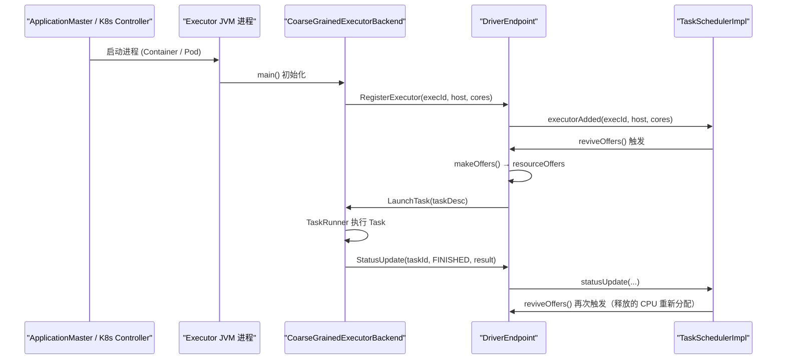
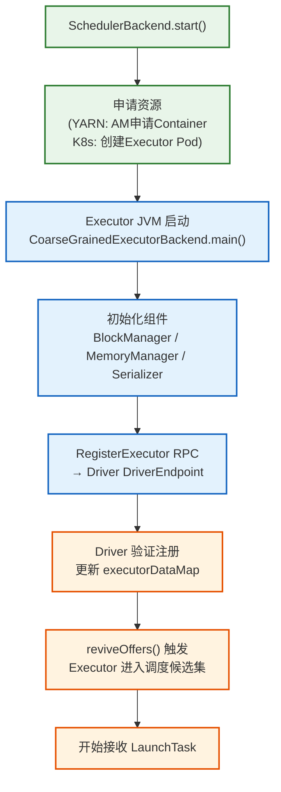

# 04 调度后端（SchedulerBackend）：Spark 与资源管理器（YARN/K8s）的对接细节

> [!abstract] 摘要
> `TaskScheduler` 知道"把 Task 分给谁"，但它不知道"怎么把 Task 送过去"，也不知道"怎么向集群申请计算资源"。这两件事由 **SchedulerBackend** 负责。`SchedulerBackend` 是 Spark 与异构集群环境的"外交层"——它将 YARN Container、Kubernetes Pod、Standalone Worker 的差异全部屏蔽，向上呈现统一的"资源要约（Resource Offer）"协议。本文将系统解析 `SchedulerBackend` 的抽象设计哲学 → `CoarseGrainedSchedulerBackend` 的通用实现 → YARN 模式下 ApplicationMaster 的中转机制 → Kubernetes 模式下声明式 Pod 管理与 Watch 机制 → Executor 注册与心跳的完整生命周期 → 以及粗粒度（Coarse-Grained）资源分配模式的设计权衡。

---

## 第 1 章 为什么需要 SchedulerBackend：适配器模式的工程价值

### 1.1 集群环境的异构性问题

Spark 需要在多种集群环境中运行，这些环境的资源管理 API 完全不同：

| 集群环境 | 资源单元 | 申请 API | 通信协议 |
| :--- | :--- | :--- | :--- |
| YARN | Container（CPU + 内存） | ApplicationMaster ↔ ResourceManager | YARN NM 协议 |
| Kubernetes | Pod | Kubernetes API Server | HTTP REST / Watch |
| Standalone | Worker | SparkDeploySchedulerBackend RPC | Akka/Netty |
| Local | 线程 | 进程内直接调用 | 无网络 |

如果 `TaskScheduler` 直接与这些 API 交互，就需要为每种环境维护一套完全不同的代码，且任何新增的集群支持都需要修改核心调度逻辑。

**适配器模式（Adapter Pattern）的解法**：定义 `SchedulerBackend` 接口，为每种集群环境实现一个适配器，`TaskScheduler` 只依赖抽象接口，完全与具体环境解耦。

### 1.2 SchedulerBackend 接口的最小契约

```scala
// org.apache.spark.scheduler.SchedulerBackend.scala
trait SchedulerBackend {
  
  def start(): Unit
  // 启动后端，建立与集群管理器的连接，开始申请 Executor

  def stop(): Unit
  // 优雅停止，释放所有申请的 Executor 资源

  def reviveOffers(): Unit
  // 核心方法：通知 TaskScheduler 检查并分配当前可用资源
  // 在有新 Executor 注册、有 Task 完成释放 CPU、或新 TaskSet 提交时调用

  def killTask(taskId: Long, executorId: String, interruptThread: Boolean, reason: String): Unit
  // 向指定 Executor 发送 Kill Task 指令（用于推测执行取消或作业取消）

  def defaultParallelism(): Int
  // 返回集群的默认并行度（通常等于总 CPU 核数）

  def isReady(): Boolean = true
  // 后端是否已就绪（所有 Executor 注册完毕）
}
```

接口设计极其克制：**只暴露调度需要的最小能力**，屏蔽所有与资源管理器协议相关的细节。

---

## 第 2 章 CoarseGrainedSchedulerBackend：通用基础实现

### 2.1 粗粒度（Coarse-Grained）资源分配的含义

Spark 默认使用**粗粒度资源分配**：应用启动时向集群申请好所有需要的 Executor 进程，这些 Executor 在整个应用生命周期内长驻，不会在 Task 完成后被释放。

对比**细粒度（Fine-Grained）资源分配**（Mesos 的细粒度模式，已废弃）：每个 Task 都单独申请资源，Task 完成后立即释放。

| 维度 | 粗粒度 | 细粒度 |
| :--- | :--- | :--- |
| **Task 启动延迟** | 极低（Executor 已就绪） | 高（每次都要申请新进程） |
| **资源利用率** | 较低（空闲期也占着资源） | 高（按需申请，立即释放） |
| **JVM 预热效果** | 好（JIT 编译优化累积） | 差（每个 Task 都是冷 JVM） |
| **适用场景** | 批处理、迭代计算（主流场景） | 极短 Task、高弹性场景 |

粗粒度是生产中的绝对主流选择，因为 **JVM 预热**（JIT 编译）和**数据本地性**（缓存数据在 Executor 内存中）在长时间运行的 Executor 上效果最佳。

### 2.2 DriverEndpoint 与 ExecutorEndpoint：RPC 通信的基础设施

`CoarseGrainedSchedulerBackend` 在 Driver 端维护一个 **`DriverEndpoint`**（Akka Actor 或 Netty RPC Endpoint），负责：
- 接收 Executor 的注册请求（`RegisterExecutor`）
- 向 Executor 发送 Task（`LaunchTask`）
- 接收 Task 完成通知（`StatusUpdate`）
- 接收 Executor 心跳（`Heartbeat`）

Executor 端有对应的 **`CoarseGrainedExecutorBackend`**，它是 Executor JVM 进程的主类。



### 2.3 makeOffers：将 Executor 状态转化为 Resource Offer

`DriverEndpoint` 中的 `makeOffers` 方法负责汇总所有可用 Executor 的资源，生成 `WorkerOffer` 列表传给 `TaskScheduler`：

```scala
// CoarseGrainedSchedulerBackend.DriverEndpoint
private def makeOffers(): Unit = {
  // 过滤掉状态不健康的 Executor
  val taskDescs = withLock {
    val activeExecutors = executorDataMap.filterKeys(isExecutorActive)
    val workOffers = activeExecutors.map {
      case (id, executorData) =>
        new WorkerOffer(
          id,
          executorData.executorHost,
          executorData.freeCores,        // 当前空闲 CPU 核数
          Some(executorData.executorAddress.hostPort),
          executorData.resourcesInfo.map {
            case (rName, rInfo) => (rName, rInfo.availableAddrs.toBuffer)
          },
          executorData.resourceProfileId
        )
    }.toIndexedSeq
    
    // 将 WorkerOffer 提交给 TaskScheduler，获取分配方案
    scheduler.resourceOffers(workOffers)
  }
  
  // 逐个发送 LaunchTask
  if (taskDescs.nonEmpty) {
    launchTasks(taskDescs)
  }
}

private def launchTasks(tasks: Seq[Seq[TaskDescription]]): Unit = {
  for (task <- tasks.flatten) {
    // 序列化 TaskDescription（含 Task 闭包）
    val serializedTask = TaskDescription.encode(task)
    
    if (serializedTask.limit() >= maxRpcMessageSize) {
      // Task 太大，不能通过 RPC 发送，需要广播或减小闭包
      scheduler.taskIdToTaskSetManager.get(task.taskId).foreach { manager =>
        manager.abort("Task %s:%d serialized %d bytes, which exceeds max allowed: ...".format(...))
      }
    } else {
      // 通过 RPC 发送 LaunchTask 消息到目标 Executor
      val executor = executorDataMap(task.executorId)
      executor.freeCores -= task.cpus  // 立即扣减空闲 CPU
      executor.executorEndpoint.send(LaunchTask(new SerializableBuffer(serializedTask)))
    }
  }
}
```

---

## 第 3 章 YARN 模式：ApplicationMaster 的中转角色

### 3.1 YARN 架构回顾与 Spark 的位置

YARN（Yet Another Resource Negotiator）是 Hadoop 生态的通用资源管理层：
- **ResourceManager（RM）**：集群级别的资源仲裁者，管理所有节点的资源
- **NodeManager（NM）**：每个节点上的资源代理，负责启动和监控 Container
- **ApplicationMaster（AM）**：每个应用的资源谈判代理，向 RM 申请 Container

Spark 在 YARN 模式下的部署：
- **Client 模式**：Driver 在提交机器上运行，AM 在 YARN 中运行，AM 负责申请 Executor Container
- **Cluster 模式**：Driver 也在 YARN 的 AM Container 中运行，AM 同时承担 Driver 的角色

### 3.2 YarnSchedulerBackend 的双层架构

在 YARN 模式下，`SchedulerBackend` 的实现是双层的：
- **`YarnSchedulerBackend`（Driver 端）**：与 AM 通信，转发资源需求和状态
- **`YarnAllocator`（AM 端）**：实际与 YARN RM 通信，执行 Container 申请

```
Driver 进程                              AM 进程（YARN Container）
─────────────────────                   ─────────────────────────
YarnSchedulerBackend                    ApplicationMaster
  │                                       │
  ├─ YarnSchedulerEndpoint  ────RPC────►  YarnSchedulerEndpoint
  │  (接收 AM 的 Executor 注册)             │
  │                                       └─ YarnAllocator
  └─ 向 TaskScheduler 汇报资源                ├─ 与 YARN RM 心跳（申请/释放 Container）
                                            └─ 启动 Executor 进程（通过 NM）
```

### 3.3 资源申请的动态调整

`YarnAllocator` 会根据 Driver 端 `YarnSchedulerBackend` 发来的"期望 Executor 数量"动态调整向 RM 的资源申请：

```scala
// YarnAllocator（简化）
def requestTotalExecutorsWithPreferredLocalities(
    requestedTotal: Int,
    localityAwareTasks: Int,
    hostToLocalTaskCount: Map[String, Int],
    ...): Boolean = {
    
  // 计算需要新申请的数量
  val delta = requestedTotal - (numExecutorsRunning + numPendingAllocate)
  
  if (delta > 0) {
    // 需要更多 Executor：向 RM 发送 Container 申请
    // 尽量把申请"绑定"到有数据的节点（数据本地性）
    val preferredHosts = hostToLocalTaskCount.keys.toSet
    addResourceRequests(delta, preferredHosts)
  } else if (delta < 0) {
    // 有多余 Executor：释放空闲的 Container（动态分配场景）
    killExecutors(-delta)
  }
}
```

**本地性感知的资源申请**：`YarnAllocator` 在申请 Container 时，会优先申请"有待处理 Task 数据"的节点上的 Container。这与 `TaskScheduler` 的本地化调度配合，实现端到端的数据本地性优化。

---

## 第 4 章 Kubernetes 模式：声明式调度的新范式

### 4.1 K8s 与 YARN 的核心差异

| 维度 | YARN 模式 | K8s 模式 |
| :--- | :--- | :--- |
| **资源申请方式** | 指令式（AM 主动向 RM 申请 Container） | 声明式（创建 Pod Spec，K8s 自动调度） |
| **Executor 标识** | Container ID（YARN 分配） | Pod Name（用户/Spark 生成） |
| **状态感知方式** | AM 主动轮询 / RM 回调 | K8s Watch API（事件流） |
| **网络模型** | YARN 内部网络 | K8s Pod 网络（CNI 插件） |
| **镜像管理** | 无（依赖 YARN 节点环境） | Docker Image（完全隔离） |

### 4.2 KubernetesClusterSchedulerBackend 的 Watch 机制

`KubernetesClusterSchedulerBackend` 启动时会创建一个 Kubernetes API Watch，监听 Executor Pod 的状态变化：

```scala
// KubernetesClusterSchedulerBackend（简化）
override def start(): Unit = {
  super.start()
  
  // 启动 Pod 申请协程：根据需要创建 Executor Pod
  executorPodsAllocator.start(applicationId)
  
  // 启动 Pod 状态 Watch：监听 Pod 生命周期事件
  executorPodsLifecycleEventHandler.start(this)
  
  // Watch 回调：当 Pod 进入 Running 状态时注册为可用 Executor
  // 当 Pod 失败/消失时处理 Executor Lost 事件
}

// ExecutorPodsLifecycleManager（简化）
def onModified(pods: Seq[Pod]): Unit = {
  pods.groupBy(_.getStatus.getPhase).foreach {
    case ("Running", runningPods) =>
      runningPods.foreach { pod =>
        val execId = pod.getMetadata.getLabels.get(SPARK_EXECUTOR_ID_LABEL)
        // 等待 Executor 进程主动注册到 Driver（RegisterExecutor RPC）
        // Pod Running 不等于 Executor 已就绪
      }
    case ("Failed", failedPods) | ("Unknown", failedPods) =>
      failedPods.foreach { pod =>
        onExecutorLost(pod)  // 通知 TaskScheduler Executor 丢失
      }
  }
}
```

### 4.3 Executor Pod 的创建模板

K8s 模式下，`ExecutorPodsAllocator` 根据 Spark 配置生成 Pod Spec：

```yaml
# Spark 生成的 Executor Pod Spec（示意）
apiVersion: v1
kind: Pod
metadata:
  name: spark-executor-<appId>-<execId>
  labels:
    spark-app-id: <applicationId>
    spark-executor-id: <executorId>
spec:
  containers:
  - name: spark-executor
    image: apache/spark:3.5.0  # 由 spark.kubernetes.executor.container.image 指定
    command: ["/opt/spark/bin/spark-class"]
    args: ["org.apache.spark.executor.CoarseGrainedExecutorBackend", ...]
    resources:
      requests:
        cpu: "1"                # spark.executor.cores
        memory: "4Gi"           # spark.executor.memory + overhead
      limits:
        cpu: "1"
        memory: "4Gi"
    env:
    - name: SPARK_EXECUTOR_ID
      value: "<executorId>"
    - name: SPARK_DRIVER_URL
      value: "spark://CoarseGrainedScheduler@<driverHost>:<driverPort>"
```

---

## 第 5 章 Executor 生命周期管理的完整视图

### 5.1 Executor 从启动到就绪的全流程



### 5.2 Executor 的退出场景与处理

| 退出场景 | 触发方式 | Driver 的响应 |
| :--- | :--- | :--- |
| 正常退出（应用结束） | Driver 发送 StopExecutor RPC | 清理资源，更新状态 |
| OOM Killed | JVM Crash，Container/Pod 退出 | 心跳超时 → ExecutorLost |
| 节点故障 | 底层节点宕机 | 心跳超时 → ExecutorLost |
| 推测执行取消 | Driver 发送 KillTask RPC | Task 被标记为 KILLED，Executor 继续存活 |
| 动态分配缩容 | Driver 主动请求释放 Executor | 等待 Executor 空闲后优雅退出 |

**ExecutorLost 的处理链**（以 YARN 模式为例）：
1. Driver 心跳检测到 Executor 失联
2. `CoarseGrainedSchedulerBackend` 触发 `removeExecutor(execId, reason)`
3. `TaskSchedulerImpl.executorLost(execId)` 标记该 Executor 上所有运行中 Task 失败
4. `DAGScheduler.executorLost(execId)` 检查是否有 Shuffle 文件丢失
   - 若有 Shuffle 文件丢失：触发相关 ShuffleMapStage 的重算
5. `YarnSchedulerBackend` 通知 AM 重新申请 Container

---

## 第 6 章 生产配置与调优

### 6.1 YARN 模式的关键参数

```properties
# Executor 申请的内存（含 JVM overhead，实际 Container 内存 = memory + memoryOverhead）
spark.executor.memory=8g
spark.executor.memoryOverhead=2g

# Executor 数量控制
spark.dynamicAllocation.enabled=true
spark.dynamicAllocation.minExecutors=5
spark.dynamicAllocation.maxExecutors=200
spark.dynamicAllocation.initialExecutors=20

# YARN 本地性申请
spark.yarn.executor.nodeLabelExpression=gpu  # 申请有 GPU 标签的节点
```

### 6.2 K8s 模式的关键参数

```properties
# Executor Pod 镜像
spark.kubernetes.executor.container.image=company.registry.io/spark:3.5.0

# Pod 资源
spark.executor.cores=2
spark.executor.memory=4g
spark.kubernetes.executor.request.cores=1.5  # CPU request（可低于 limit）

# 动态分配（K8s 模式推荐开启）
spark.dynamicAllocation.enabled=true
spark.dynamicAllocation.shuffleTracking.enabled=true  # K8s 模式无 ExternalShuffleService，需开启

# 节点选择
spark.kubernetes.node.selector.accelerator=gpu  # 选择有 GPU 的节点
```

### 6.3 Driver ↔ Executor 网络连通性调优

```properties
# Driver 对外暴露的地址（K8s 中需要是 ClusterIP/LoadBalancer，YARN 中需要能被 NM 访问）
spark.driver.host=spark-driver.spark-ns.svc.cluster.local
spark.driver.port=7078

# RPC 超时配置
spark.rpc.message.maxSize=256  # 最大 RPC 消息大小（MB），Task 闭包超大时需要调大
spark.network.timeout=120s      # 网络超时（心跳超时的上限）
```

---

## 第 7 章 总结

`SchedulerBackend` 是 Spark "Write Once, Run Anywhere" 能力的核心技术支撑：

- **接口设计**：最小化抽象契约（`start/stop/reviveOffers/killTask`），屏蔽所有集群细节
- **粗粒度分配**：长驻 Executor 进程实现零启动延迟，JIT 预热效果最大化
- **YARN 模式**：通过 ApplicationMaster 中转，遵循 YARN 的资源申请协议，支持本地性感知的 Container 申请
- **K8s 模式**：通过声明式 Pod 创建和 Watch 机制实现 Executor 生命周期管理，天然容器化隔离
- **故障处理**：Executor Lost 触发级联响应（Task 重试 → Shuffle 重算 → 重新申请资源）

在 **[[05 调度算法深度剖析：FIFO 与 FAIR 策略的实现原理与应用场景|下一篇文章]]** 中，我们将回到 `TaskScheduler` 内部，解析当多个并发 Job 竞争有限资源时，FIFO 和 FAIR 两种调度算法如何决定谁先执行。

---

> [!note] 思考题
> 1. `CoarseGrainedExecutorBackend.main()` 启动时需要知道 Driver 的地址和端口。在 YARN Client 模式下，Driver 在提交机器上运行，而 Executor 在集群节点上运行。如果提交机器的 IP 在集群内部不可达（如在 NAT 后面），会发生什么？如何解决？
> 2. K8s 模式下，`spark.dynamicAllocation.shuffleTracking.enabled=true` 是什么意思？为什么 K8s 模式下不能直接使用 ExternalShuffleService（YARN 模式下可以）？
> 3. 当 `makeOffers()` 向 `TaskScheduler.resourceOffers()` 提交了一批 WorkerOffer，但 `resourceOffers` 返回的 TaskDescription 为空（没有 Task 可以分配），这说明什么？ `reviveOffers()` 会被反复调用吗？有没有频率控制机制？
