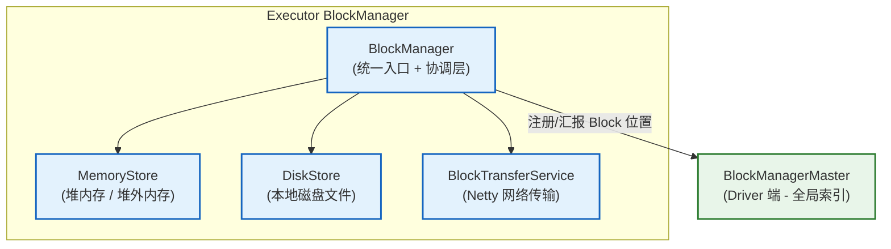

# 07 执行器（Executor）底层机制：任务运行环境、线程池管理与资源隔离

> [!abstract] 摘要
> Executor 是 Spark 真正消耗 CPU、内存、磁盘与网络资源的执行实体。前几篇解析了 Task 如何被选中、封装、发往 Executor——但 Task"落地"后，Executor 内部是如何运转的？本文深入 Executor JVM 进程的内核：从进程启动到就绪的完整初始化链路 → 线程池的并发模型与 Task 隔离机制 → 执行内存与存储内存的统一管理与动态借用 → BlockManager 作为数据中枢的工作原理 → 心跳机制的设计与 Executor Lost 的判定逻辑 → 以及 executor.cores 的调优对性能的影响。理解 Executor，是将调度策略落实到资源层的关键。

---

## 第 1 章 Executor 的系统定位：三位一体的执行实体

### 1.1 三大核心职责

**职责一：执行 Task**
接收 Driver 通过 RPC 发来的 `LaunchTask` 消息，创建 `TaskRunner` 线程，在 JVM 线程池中执行 Task 的计算逻辑。Task 执行期间消耗 CPU、内存（执行内存区域）、磁盘（Shuffle Spill）和网络（Shuffle Read）。

**职责二：管理数据块（Block）**
Executor 内嵌了一个 `BlockManager`，负责管理该节点上所有类型的数据块：
- **缓存块**：`cache()/persist()` 的 RDD 分区数据（存储内存区域）
- **广播块**：`sc.broadcast()` 的广播变量副本
- **Shuffle 块**：ShuffleMapTask 写出的 Shuffle 中间数据
- **Task 结果块**：大 Task 结果（IndirectTaskResult）的临时存储

**职责三：向 Driver 汇报状态**
Executor 通过周期性心跳（默认每 10 秒）向 Driver 上报：
- 当前运行中 Task 的度量数据（GC 时间、输入/输出字节数等）
- Block 状态变化（新增/删除的 Block，驱动 BlockManagerMaster 更新索引）

这三个职责共享同一套 JVM 进程资源（内存、CPU、磁盘、网络），相互之间存在资源竞争——这是调优 Executor 配置的核心矛盾。

### 1.2 粗粒度模式：长驻进程的设计价值

Spark 默认的 Coarse-Grained 模式下，Executor 是**长驻 JVM 进程**——应用启动时创建，应用结束时才销毁，不会因为 Task 完成而退出。

**为什么长驻进程价值极高？**

- **JIT 预热效应**：JVM JIT 编译器识别热点代码后将其编译为本机机器码。在迭代计算中，同一份用户函数（`map/filter`）被多个 Task 反复执行，随着运行时间积累，JIT 预热效果显著，后续 Task 执行速度大幅快于冷启动。
- **数据本地性**：长驻 Executor 可在内存中缓存 RDD 数据（`cache()`），使后续 Job 的 Task 以 PROCESS_LOCAL 访问，完全消除磁盘 I/O 和网络开销。
- **避免进程启动开销**：启动一个 JVM 进程含 Spark 初始化通常需要 5-30 秒。粗粒度模式只付出一次；细粒度模式每 Task 都需要付出这个代价。

---

## 第 2 章 Executor 启动与初始化链路

### 2.1 进程入口：CoarseGrainedExecutorBackend.main()

无论 YARN、K8s 还是 Standalone 模式，Executor 进程都以 `CoarseGrainedExecutorBackend.main()` 为入口。关键初始化步骤：

```scala
// 简化流程
private def run(arguments: Arguments, ...) = {

  // 步骤一：初始化 SparkEnv（Executor 侧）
  // 包含 BlockManager、MemoryManager、Serializer、RpcEnv 等
  val env = SparkEnv.createExecutorEnv(
    driverConf, arguments.executorId, arguments.bindAddress,
    arguments.hostname, arguments.cores, cfg.port, isLocal = false)

  // 步骤二：创建并注册 RPC 端点
  env.rpcEnv.setupEndpoint("Executor",
    new CoarseGrainedExecutorBackend(env.rpcEnv, arguments.driverUrl,
      arguments.executorId, ...))

  // 步骤三：阻塞等待，直到 Driver 发来停止信号
  env.rpcEnv.awaitTermination()
}
```

### 2.2 向 Driver 注册：RegisterExecutor 握手

`CoarseGrainedExecutorBackend.onStart()` 在 RPC 端点启动时自动调用，向 Driver 发送 `RegisterExecutor` 消息：

```scala
override def onStart(): Unit = {
  rpcEnv.asyncSetupEndpointRefByURI(driverUrl).flatMap { ref =>
    driver = Some(ref)
    // 发送注册请求：告知 Driver 我的 executorId、主机名、CPU 核数
    ref.ask[Boolean](RegisterExecutor(executorId, self, hostname, cores,
      extractLogUrls, extractAttributes, _resources, resourceProfile.id))
  }.onComplete {
    case Success(_) =>
      self.send(RegisteredExecutor)  // 注册成功，触发 Executor 对象创建
    case Failure(e) =>
      exitExecutor(1, s"Cannot register with driver: $driverUrl", e)
  }
}

// Driver 确认注册后
case RegisteredExecutor =>
  try {
    // 创建核心 Executor 对象（真正的执行引擎，含线程池、心跳器等）
    executor = new Executor(executorId, hostname, env, userClassPath,
                            isLocal = false, resources = _resources)
    driver.get.send(LaunchedExecutor(executorId))  // 通知 Driver：已就绪，可以接收 Task
  } catch {
    case NonFatal(e) => exitExecutor(1, "Unable to create executor: " + e.getMessage, e)
  }
```

### 2.3 Executor 对象的核心组件

`new Executor(...)` 构造器完成以下核心初始化：

```scala
private[spark] class Executor(...) extends Logging {

  // ① Task 执行线程池：CachedThreadPool，线程数量随并发 Task 数动态扩展
  private val threadPool = {
    val threadFactory = new ThreadFactoryBuilder()
      .setDaemon(true)
      .setNameFormat("Executor task launch worker-%d")
      .build()
    Executors.newCachedThreadPool(threadFactory).asInstanceOf[ThreadPoolExecutor]
  }

  // ② 心跳发送器：周期性向 Driver 汇报状态
  private val heartbeater = new Heartbeater(
    () => Executor.this.reportHeartBeat(),
    "executor-heartbeater",
    HEARTBEAT_INTERVAL_MS)  // 默认 10 秒

  // ③ 初始化 BlockManager（向 BlockManagerMaster 注册）
  env.blockManager.initialize(conf.getAppId)

  // ④ 启动心跳线程
  heartbeater.start()

  // ⑤ 当前运行中的 Task 追踪表
  private val runningTasks = new ConcurrentHashMap[Long, TaskRunner]
}
```

---

## 第 3 章 线程模型：Task 并发执行的物理机制

### 3.1 线程池设计：CachedThreadPool 而非 FixedThreadPool

Executor 使用 `CachedThreadPool`（无上限线程池）而非 `FixedThreadPool`（固定线程数）。

**原因**：`CachedThreadPool` 会按需创建线程，空闲线程在 60 秒后自动回收。Spark 通过**资源要约（Resource Offer）机制**在调度层面控制并发 Task 数（不超过 `executor.cores / task.cpus`），因此不需要在线程池层面再设置上限。线程池只是执行容器，并发控制权在 TaskScheduler。

### 3.2 并发上限的真正来源

Executor 的并发 Task 数由 `executor.cores / spark.task.cpus` 决定：

```
executor.cores = 4, spark.task.cpus = 1 → 最多 4 个 Task 并发
executor.cores = 8, spark.task.cpus = 2 → 最多 4 个 Task 并发
executor.cores = 4, spark.task.cpus = 4 → 最多 1 个 Task（单 Task 独占所有核）
```

这个并发限制由 `TaskSchedulerImpl.resourceOffers` 在分配 Task 时强制执行——它只会分配不超过 `availableCpus / CPUS_PER_TASK` 个 Task 给每个 Executor。

### 3.3 Task 之间的隔离与资源竞争

同一 Executor 内并发运行的多个 Task **共享 JVM 进程内的所有资源**：

| 资源 | 隔离级别 | 竞争后果 |
| :--- | :--- | :--- |
| JVM 堆内存 | **无隔离**，所有 Task 共享 | GC 压力叠加，Full GC 影响所有 Task |
| 执行内存 | **软隔离**（MemoryManager 仲裁） | 某 Task 占用过多 → 其他 Task Spill 到磁盘 |
| 磁盘 I/O | **无隔离** | Shuffle Spill 激烈时 I/O 带宽被瓜分 |
| 网络带宽 | **无隔离** | Shuffle Read 并发时网络带宽受限 |
| CPU 时间片 | **OS 级别调度**，JVM 线程竞争 | 线程数超过核数时 CPU 上下文切换开销增加 |

> [!warning] executor.cores 并非越大越好
> 将 `executor.cores` 设为 16（单个大 Executor）vs 4 个 `executor.cores=4` 的小 Executor，相同总核数下：
> - **大 Executor 的问题**：16 个并发 Task 共享一个 JVM 堆，Full GC 时所有 16 个 Task 全部暂停；HDFS 的 3 副本并发上传可能超出 HDFS 客户端并发限制；单点故障影响更大（一个 Executor 崩溃损失 16 核）
> - **小 Executor 的问题**：JVM 进程数过多，overhead 内存（Driver 和 OS 级别的开销）总量增加；广播变量需要分发到更多进程
> - **实践黄金规则**：`executor.cores` 通常设为 4-5，平衡 JVM 堆压力与并发效率

---

## 第 4 章 内存架构：执行内存与存储内存的统一管理

### 4.1 Executor 内存的分区模型

一个 Executor JVM 进程的内存被划分为以下区域：

```
JVM 总内存（spark.executor.memory = 8g）
├── 系统预留（Reserved Memory）：300MB（固定）
│   └── Spark 框架自身代码、对象、类加载等
└── 统一内存池（Unified Memory）：(8g - 300MB) × spark.memory.fraction（默认 0.6）
    ├── 存储内存区（Storage Region）：统一池 × spark.memory.storageFraction（默认 0.5）
    │   └── RDD Cache、广播变量副本
    └── 执行内存区（Execution Region）：统一池的剩余部分（动态）
        └── Shuffle Buffer、Sort Buffer、聚合 Hash Map
剩余 40%（约 3.2g）：用户代码、Task 本地变量、JVM 运行时开销
```

另外，`spark.executor.memoryOverhead`（默认 = max(executor.memory × 0.1, 384MB)）是 JVM 进程的**堆外开销**（Metaspace、JVM 线程栈、DirectBuffer 等），由 YARN/K8s 在申请 Container 内存时额外加上，不在 `spark.executor.memory` 内。

### 4.2 UnifiedMemoryManager：动态借用的仲裁者

`UnifiedMemoryManager` 是 Spark 1.6+ 引入的统一内存管理器，实现了执行内存和存储内存的动态借用：

**执行内存借用存储内存的条件**：
```
执行内存不足时：
if (存储内存.used > 存储内存.保底线) {
    // 驱逐超出保底线的 Cache Block，腾出空间给执行内存
    storage.evict(amount = 需要的内存 - 执行内存.free)
} else if (存储内存.free > 0) {
    // 存储内存有空闲，直接借用（不驱逐 Cache）
    execution.borrow(amount = min(needed, storage.free))
}
```

**存储内存借用执行内存的条件**：
```
缓存新 Block 时：
if (执行内存.free > 0) {
    // 执行内存有空闲，借用（但如果执行内存后来需要，存储区必须归还）
    storage.borrow(amount = min(needed, execution.free))
}
// 注意：存储区借来的执行内存在执行区需要时会被"强制收回"（Block 被驱逐）
```

> [!info] 为什么存储内存有"保底线"？
> `spark.memory.storageFraction`（默认 0.5）定义了存储区的保底比例。在这个保底线以内的 Cache Block**不会被执行内存强制驱逐**，即使执行内存告急。这保证了用户通过 `cache()` 缓存的重要数据不会被轻易清除，维持了缓存的有效性预期。

### 4.3 Execution 内存的 Task 分配策略

同一 Executor 内的多个并发 Task 共享执行内存区域。`UnifiedMemoryManager` 对每个 Task 可获得的执行内存设有动态下限和上限：

```scala
// UnifiedMemoryManager 中 Task 执行内存分配策略（简化）
val numActiveTasks = memoryManager.getNumActiveTasks  // 当前活跃 Task 数

// 每个 Task 最少能获得的内存（防止饥饿）
val minMemoryPerTask = executionMemoryPool.poolSize / (2 * numActiveTasks)

// 每个 Task 最多能获得的内存（防止单 Task 独占）
val maxMemoryPerTask = executionMemoryPool.poolSize / numActiveTasks
```

**动态调整**：当 Task 数量变化时（新 Task 启动或旧 Task 完成），每个 Task 的内存份额上下限会相应调整。这意味着：
- 单个 Task 运行时：它可以获得几乎全部执行内存
- 4 个 Task 并发时：每个 Task 最多获得 1/4 执行内存，最少获得 1/8

---

## 第 5 章 BlockManager：Executor 的数据中枢

### 5.1 BlockManager 的架构分层

每个 Executor 上的 `BlockManager` 由三层组成：



**MemoryStore**：将 Block 存储在 JVM 堆内存（以 Java 对象或序列化字节数组形式）或堆外内存（以 `UnsafeRow` 二进制格式），对应不同的 `StorageLevel`。

**DiskStore**：将 Block 序列化后写入本地磁盘文件（`BlockId.name` 作为文件名），存储路径由 `spark.local.dir` 控制。

**BlockTransferService**：基于 Netty 实现的网络传输层，用于：
- 远程读取其他 Executor 上的 Cache Block（HDFS 本地性失效时）
- Shuffle Read（Reduce Task 从 Map Task 所在 Executor 拉取 Shuffle 数据）

### 5.2 BlockManager 在 Shuffle 中的核心作用

Shuffle 是 BlockManager 最繁忙的使用场景：

**Shuffle Write 阶段**（ShuffleMapTask 完成时）：
1. `ShuffleWriter`（如 `SortShuffleWriter`）将分区数据排序后写入本地磁盘
2. 文件通过 `DiskBlockManager` 管理（路径：`$spark.local.dir/blockmgr-UUID/hash/shuffle_shuffleId_mapId_reduceId.data`）
3. 向 Driver 端 `MapOutputTracker` 汇报：每个输出分区的数据量和 `BlockManager` 地址（`MapStatus`）

**Shuffle Read 阶段**（Reduce Task 拉取数据时）：
1. Reduce Task 向 `MapOutputTrackerWorker` 查询目标分区的 MapStatus
2. 根据 MapStatus 中的 Executor 地址，通过 `BlockTransferService` 远程拉取数据
3. 大批量数据通过 `FileRegion`（零拷贝）传输，小批量数据通过普通 `ByteBuffer` 传输

---

## 第 6 章 心跳机制：Driver 感知 Executor 状态的窗口

### 6.1 心跳的内容与发送

`Heartbeater` 线程每 `spark.executor.heartbeatInterval`（默认 10 秒）发送一次心跳：

```scala
// Executor.reportHeartBeat()（简化）
private def reportHeartBeat(): Unit = {
  val accumUpdates = new ArrayBuffer[(Long, Seq[AccumulatorV2[_, _]])]()
  val curGCTime = computeTotalGcTime()
  
  // 收集所有运行中 Task 的指标更新
  for ((id, taskRunner) <- runningTasks.asScala) {
    val metrics = taskRunner.task.metrics
    metrics.mergeShuffleReadMetrics()
    metrics.setJvmGCTime(curGCTime - taskRunner.startGCTime)
    
    // 收集每个 Task 的累加器更新（用于 Spark UI 实时显示）
    if (taskRunner.task != null) {
      accumUpdates += ((id, metrics.accumulators()))
    }
  }
  
  val message = Heartbeat(executorId, accumUpdates.toArray, env.blockManager.blockManagerId)
  
  try {
    val response = heartbeatReceiverRef.askSync[HeartbeatResponse](message,
      new RpcTimeout(HEARTBEAT_INTERVAL_MS.millis * 3, ...))
    
    if (response.reregisterBlockManager) {
      // Driver 要求重新注册 BlockManager（通常因为 Driver 重启）
      logInfo("Told to re-register on heartbeat")
      env.blockManager.reregister()
    }
  } catch {
    case NonFatal(e) =>
      logWarning(s"Issue communicating with driver in heartbeat", e)
  }
}
```

### 6.2 Executor Lost 的判定逻辑

Driver 端的 `HeartbeatReceiver` 会检测心跳超时：

```scala
// HeartbeatReceiver（Driver 端，简化）
// 周期性检查（每 spark.executor.heartbeatInterval 检查一次）
private def expireDeadHosts(): Unit = {
  val now = clock.getTimeMillis()
  for ((executorId, lastSeenMs) <- executorLastSeen) {
    if (now - lastSeenMs > executorTimeoutMs) {
      // 超过 spark.network.timeout（默认 120s）未收到心跳，判定 Executor Lost
      logWarning(s"Removing executor $executorId with no recent heartbeats: " +
        s"${now - lastSeenMs} ms exceeds timeout $executorTimeoutMs ms")
      scheduler.executorLost(executorId, SlaveLost("Lost executor " + executorId + 
        " (all tasks it was running marked as failed, it may be restarted)"))
      context.stop(self)
    }
  }
}
```

**超时时间的配置**：
```properties
spark.executor.heartbeatInterval = 10s   # Executor 发心跳的间隔
spark.network.timeout = 120s             # 网络超时（判定 Executor Lost 的阈值）
# 注意：network.timeout 必须 >> heartbeatInterval，否则会频繁误判 Executor Lost
# 建议：network.timeout 至少是 heartbeatInterval 的 3-5 倍
```

### 6.3 Executor Lost 的级联影响

```
Executor Lost（心跳超时 / 进程崩溃）
        ↓
TaskSchedulerImpl.executorLost(execId)
  → 标记该 Executor 上所有 running Task 为 FAILED
  → 对每个失败 Task，通知 TaskSetManager（触发重试 or Stage 终止）
        ↓
DAGScheduler.executorLost(execId)
  → 检查该 Executor 上是否有 ShuffleMapTask 的输出（MapStatus）
  → 若有：调用 mapOutputTracker.unregisterMapOutputs(shuffleId, mapIndex)
          → 触发上游 ShuffleMapStage 重算（FetchFailedException 的 Stage 级容错）
        ↓
SchedulerBackend（YARN/K8s）
  → 通知 AM/Controller 重新申请替代 Executor
```

---

## 第 7 章 生产调优：Executor 配置的工程实践

### 7.1 Executor 内存配置

```properties
# 基础配置
spark.executor.memory = 8g         # Executor JVM 堆内存
spark.executor.memoryOverhead = 2g  # JVM 堆外开销（Netty、OS overhead 等）
# Container 申请总内存 = 8g + 2g = 10g

# 内存分区调优
spark.memory.fraction = 0.6        # 统一内存池占比（默认 0.6）
spark.memory.storageFraction = 0.5  # 存储区保底比例（默认 0.5）

# 当 Shuffle 密集（执行内存压力大）时，可以调整：
spark.memory.fraction = 0.75       # 增大统一内存池
spark.memory.storageFraction = 0.3  # 减小存储保底，更多内存给执行

# 当 Cache 密集（迭代计算）时：
spark.memory.storageFraction = 0.7  # 增大存储保底，保护 Cache 不被驱逐
```

### 7.2 Executor 并发度配置

```properties
spark.executor.cores = 4           # 每个 Executor 的 CPU 核数（推荐 4-5）
spark.task.cpus = 1                # 每个 Task 占用的 CPU 核数（默认 1）
# 并发 Task 数 = 4 / 1 = 4

# 对于内存密集型 Task（每条记录占内存大），减少并发：
spark.executor.cores = 4
spark.task.cpus = 2                 # 每 Task 占 2 核，并发 = 2，内存压力减半

# 对于 CPU 密集型 Task（计算密集），可以尝试更高并发（但注意 GC 开销）：
spark.executor.cores = 8
spark.task.cpus = 1                 # 8 个并发，充分利用 CPU
```

### 7.3 本地磁盘配置（Shuffle 性能关键）

```properties
# 配置多个本地磁盘目录，实现磁盘 I/O 并行（推荐使用 SSD）
spark.local.dir = /data1/spark,/data2/spark,/data3/spark
# Spark 会轮询使用这些目录，分散 I/O 压力

# Shuffle 文件的合并策略（减少小文件数量）
spark.shuffle.file.buffer = 32k    # Shuffle Write 的 Buffer 大小（默认 32k，可调大）
spark.reducer.maxSizeInFlight = 96m # Shuffle Read 的并发请求数据量上限（默认 48m）
```

---

## 第 8 章 总结

Executor 是 Spark 执行模型的"物理载体"，其设计体现了在多维资源约束下的精细权衡：

- **线程池**：CachedThreadPool 提供按需创建线程的灵活性，并发上限通过 Resource Offer 机制在调度层面控制
- **内存模型**：UnifiedMemoryManager 的动态借用机制最大化内存利用率，但 Cache Block 有保底保护
- **BlockManager**：统一管理 Cache、广播变量、Shuffle 数据，是 Executor 的数据中枢
- **心跳机制**：10 秒一次的心跳是 Driver 感知 Executor 健康状态的唯一窗口，超时触发级联 Executor Lost 处理

在 **[[08 推测执行（Speculative Execution）：分布式环境下"长尾"任务的自动修复机制|下一篇文章]]** 中，我们将深入 Spark 应对"长尾 Task"问题的核心机制——推测执行，理解它如何识别慢 Task、启动副本、以及与 Executor 线程模型的配合。

---

> [!note] 思考题
> 1. 同一 Executor 内有 4 个并发 Task（T1、T2、T3、T4），其中 T1 做大量 Shuffle Sort 占用了 70% 执行内存，T2 尝试缓存一个 RDD 分区（需要存储内存），T3 需要执行内存但当前分配不到足够内存。请描述 UnifiedMemoryManager 在这种情况下的处理流程。T3 会 OOM 还是会 Spill？
> 2. Executor 的心跳包含了所有运行中 Task 的 Accumulator 更新。如果某个 Task 使用了一个值非常大的 Accumulator（如存储了一个大集合），会导致什么问题？Spark 对 Accumulator 的大小有没有限制？
> 3. 为什么 `spark.local.dir` 配置多个目录可以提升 Shuffle 性能？Spark 在多目录下如何分配 Shuffle 文件的写入位置？如果某个目录所在磁盘空间不足，会发生什么？
