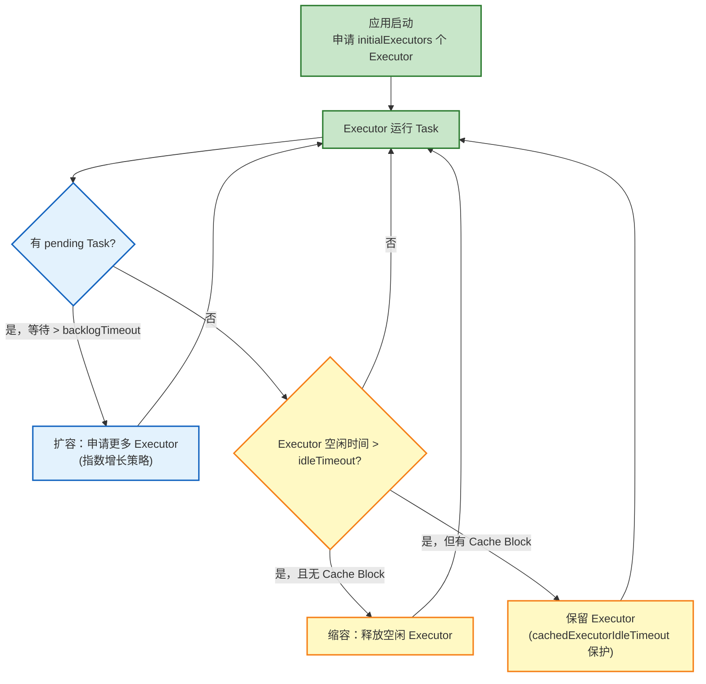
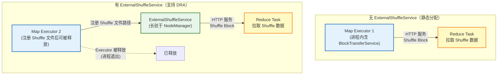

# 10 动态资源申请（Dynamic Resource Allocation）：弹性计算的资源调度逻辑

> [!abstract] 摘要
> 在传统的静态 Executor 模式下，一个 Spark 应用从开始到结束始终持有固定数量的 Executor——即使在 Job 之间的空闲期、Stage 等待期，这些 Executor 也在白白消耗集群资源。**动态资源分配（Dynamic Resource Allocation，DRA）**是 Spark 解决这一浪费问题的弹性机制：根据作业的实时负载动态增加或释放 Executor，在资源利用率和作业响应时间之间实现最优平衡。本文将深度解析：为什么静态分配在多租户集群中是不可接受的 → DRA 的"扩容"与"缩容"逻辑的精确触发条件 → ExternalShuffleService 为什么是 YARN 模式下 DRA 的前提 → K8s 模式下如何通过 ShuffleTracking 绕过这个约束 → 以及 DRA 与本地化调度、推测执行的交互复杂性。

---

## 第 1 章 静态分配的困境：资源的囤积与浪费

### 1.1 一个典型的资源浪费场景

考虑一个在多租户共享集群上运行的 Spark 批处理作业：

```
08:00 - 09:00: 数据加载阶段（Stage 1）
  需要 200 Executor 全速处理 HDFS 数据

09:00 - 09:05: 等待外部系统响应（空闲期）
  0 个 Task 在运行，200 Executor 全部空闲

09:05 - 10:00: 数据聚合阶段（Stage 2）
  需要 50 Executor 处理聚合逻辑

10:00 - 10:30: 结果写入阶段（Stage 3）
  需要 20 Executor 写 HDFS
```

在静态分配模式下，这个作业从 08:00 到 10:30 持续占用 200 个 Executor，而其中有相当长的时间实际需要的 Executor 数量不足 50 个。在共享集群中，这 150 个多余的 Executor 本可以被其他作业使用，却被白白浪费。

### 1.2 静态分配在多租户集群中的三个核心问题

**问题一：资源囤积导致集群利用率低下**

一个 100 节点的集群，如果每个 Spark 作业都预申请"最大可能需要"的 Executor 数量，多个作业同时运行时集群资源很快耗尽，新作业无法获得资源，排队等待时间极长。

**问题二：作业内部的资源需求波动极大**

一个典型的 Spark 作业有明显的"宽窄交替"特征：宽依赖（Shuffle）之后的 Stage 并行度通常小于宽依赖之前（`reduceByKey` 之后的分区数由 `spark.sql.shuffle.partitions` 决定，默认 200，可能远小于原始数据的分区数）。静态分配无法适应这种变化。

**问题三：Job 间的空闲期无法释放资源**

即使在两个 Job 之间（如用户代码中有 `Thread.sleep(60000)`，或等待外部数据），Executor 仍然持有资源。动态分配可以在这段空闲期释放 Executor，被其他作业利用。

### 1.3 动态资源分配的目标

**DRA 的核心目标**：在保证作业不因资源不足而显著变慢的前提下，尽快释放不需要的资源，使其可以被集群中其他作业使用。

这是一个典型的在**响应时间**和**资源利用率**之间的工程权衡：
- 过于激进的缩容 → Executor 刚被释放就需要重新申请，增加调度延迟，降低作业响应时间
- 过于保守的缩容 → 大量 Executor 空转，资源利用率低

---

## 第 2 章 动态分配的核心逻辑：扩容与缩容的触发条件

### 2.1 扩容（Scale Up）：何时申请更多 Executor？

**触发条件**：当有 Task 处于 pending 状态（等待执行但没有足够的 Executor）超过一定时间。

```scala
// ExecutorAllocationManager（简化）
// 扩容触发：有 pending Task 且等待时间超过阈值
private def addTime: Long = {
  if (numTasksPending > 0) {
    // 如果有 pending Task，立即申请更多 Executor（等待 spark.dynamicAllocation.schedulerBacklogTimeout）
    lastSchedulerBacklogTime + schedulerBacklogTimeoutS * 1000
  } else {
    Long.MaxValue
  }
}
```

**扩容的步进策略**：DRA 不是每次申请固定数量的 Executor，而是采用**指数增长**策略：
- 第 1 次扩容：申请 `initialExecutors` 个
- 之后每次扩容：申请上次申请量的 2 倍（直到达到 `maxExecutors`）

```properties
spark.dynamicAllocation.initialExecutors = 1      # 初始 Executor 数（默认等于 minExecutors）
spark.dynamicAllocation.minExecutors = 0          # 最小 Executor 数（默认 0）
spark.dynamicAllocation.maxExecutors = infinity   # 最大 Executor 数
spark.dynamicAllocation.schedulerBacklogTimeout = 1s  # 有 pending Task 后等待多久开始扩容
spark.dynamicAllocation.sustainedSchedulerBacklogTimeout = 1s  # 之后每次扩容的等待间隔
```

**指数增长的设计意图**：快速响应突发负载。如果一个批处理作业突然提交 1000 个 Task，从 1 个 Executor 开始，经过约 10 次翻倍扩容（1→2→4→8→16→32→64→128→256→512），可以在约 10 秒内达到 512 个 Executor，远快于每次申请固定数量的线性增长。

### 2.2 缩容（Scale Down）：何时释放多余 Executor？

**触发条件**：Executor 已经空闲（没有运行任何 Task）超过 `spark.dynamicAllocation.executorIdleTimeout` 时间。

```properties
spark.dynamicAllocation.executorIdleTimeout = 60s  # Executor 空闲多久后被释放（默认 60 秒）
spark.dynamicAllocation.cachedExecutorIdleTimeout = infinity  # 有 Cache Block 的 Executor 的空闲超时（默认永不释放）
```

**缩容的关键保护机制**：
1. **`minExecutors` 保底**：即使所有 Task 都已完成，也保留至少 `minExecutors` 个 Executor
2. **Cache 保护**：有 Cache Block 的 Executor 不会因为 `executorIdleTimeout` 被释放（由 `cachedExecutorIdleTimeout` 单独控制，默认 infinity）
3. **优雅关闭（Graceful Decommission）**：Driver 不会立即强制 Kill Executor，而是通知 Executor 进入"下线准备"状态，等待 Executor 上当前运行的 Task 完成后再释放

### 2.3 扩容与缩容的状态机



---

## 第 3 章 ExternalShuffleService：YARN 模式下 DRA 的前提

### 3.1 为什么 DRA 必须依赖 ExternalShuffleService？

这是理解 DRA 最关键的一个约束，需要从 Shuffle 数据的生命周期说起。

**问题**：在 DRA 场景下，Map Task 完成后 Executor 可能被缩容释放。Map Task 写出的 Shuffle 数据存储在该 Executor 的本地磁盘上。如果 Executor 被释放，其对应的进程退出，本地磁盘上的 Shuffle 数据虽然物理上可能还在（取决于 YARN Container 的清理策略），但没有进程来提供 Shuffle 数据的 HTTP 服务（`BlockTransferService`）——下游 Reduce Task 无法从该 Executor 拉取数据，触发 `FetchFailedException`，导致 Stage 重算。

**ExternalShuffleService 的解法**：在每个 NodeManager 节点上运行一个**独立的 ExternalShuffleService 进程**（非 Executor 进程），专门负责服务 Shuffle 数据。Shuffle 文件注册到 ExternalShuffleService 后，即使原始 Executor 进程退出，ExternalShuffleService 仍然可以响应下游 Reduce Task 的拉取请求。



### 3.2 ExternalShuffleService 的部署与配置

```properties
# Executor 侧：使用 ExternalShuffleService 提供 Shuffle 数据
spark.shuffle.service.enabled = true
spark.shuffle.service.port = 7337  # ExternalShuffleService 监听端口

# 开启动态分配
spark.dynamicAllocation.enabled = true
```

在 YARN 模式下，ExternalShuffleService 通常作为 YARN NodeManager 的辅助服务（Auxiliary Service）运行，通过 NodeManager 的 `yarn-site.xml` 配置：

```xml
<!-- yarn-site.xml -->
<property>
  <name>yarn.nodemanager.aux-services</name>
  <value>spark_shuffle</value>
</property>
<property>
  <name>yarn.nodemanager.aux-services.spark_shuffle.class</name>
  <value>org.apache.spark.network.yarn.YarnShuffleService</value>
</property>
```

### 3.3 ExternalShuffleService 的性能代价

ExternalShuffleService 虽然解决了 DRA 的核心问题，但也引入了一些代价：

**单点压力**：每个节点只有一个 ExternalShuffleService 进程，服务该节点上所有 Spark 应用的 Shuffle 数据请求。在高并发场景下，ExternalShuffleService 可能成为 I/O 瓶颈。

**数据清理复杂性**：Executor 退出后，ExternalShuffleService 需要依赖外部机制（Driver 通知或超时）来清理已注册的 Shuffle 文件，否则磁盘空间会逐渐耗尽。

**配置维护成本**：需要在所有 NodeManager 上部署和维护 ExternalShuffleService，增加运维复杂度。

---

## 第 4 章 K8s 模式的特殊挑战与 ShuffleTracking 解法

### 4.1 为什么 K8s 模式不能直接用 ExternalShuffleService？

在 Kubernetes 模式下，Executor 以 Pod 形式运行，每个 Pod 有独立的文件系统（默认是 emptyDir，随 Pod 消亡而消失）。YARN 的 ExternalShuffleService 依赖于 NodeManager 与 Container 共享宿主机磁盘的特性，而在 K8s 中，Pod 的存储是隔离的，无法简单复用。

**理论上的解法**：在 K8s 中部署一个独立的 ExternalShuffleService DaemonSet（每个节点一个 Pod），并通过 HostPath Volume 让 Executor Pod 和 ExternalShuffleService Pod 共享宿主机磁盘。但这会破坏 K8s 的安全隔离模型，且配置复杂，不是主流方案。

### 4.2 ShuffleTracking：K8s 模式的 DRA 方案

Spark 3.1 引入了 **ShuffleTracking** 机制，在 K8s 模式下无需 ExternalShuffleService 即可支持 DRA：

**核心思想**：追踪哪些 Executor 的 Shuffle 数据还在被下游 Stage 使用，**只释放 Shuffle 数据已经不被需要的 Executor**。

```properties
# K8s 模式下 DRA 的推荐配置
spark.dynamicAllocation.enabled = true
spark.dynamicAllocation.shuffleTracking.enabled = true  # 开启 ShuffleTracking
spark.dynamicAllocation.shuffleTracking.timeout = 5min  # Shuffle 数据超过多久无人使用后，允许释放 Executor
```

**ShuffleTracking 的工作原理**：

`ExecutorAllocationManager` 追踪每个 Executor 上存有哪些 Shuffle 数据（哪个 shuffleId 的哪些 mapId），以及这些 Shuffle 数据是否还有下游 Stage 在使用：

```
Executor A 上有 Shuffle 0 的 mapId 1、2、3 的数据
→ Stage 2（Shuffle 0 的下游）正在运行 → Executor A 不能被释放

Stage 2 完成后，Shuffle 0 不再被任何 Stage 使用
→ Executor A 上的 Shuffle 数据已无用
→ 等待 shuffleTracking.timeout 后，释放 Executor A
```

### 4.3 ShuffleTracking 的局限性

**数据安全保证较弱**：ShuffleTracking 保证了 Shuffle 数据"不被需要时"才释放 Executor。但如果 Executor 因节点故障（非 DRA 缩容）而意外退出，其 Shuffle 数据直接丢失，仍然需要触发 Stage 重算（与无 ExternalShuffleService 的静态分配相同的行为）。

**下游 Stage 完成前必须保留 Executor**：即使某些 Executor 非常空闲，只要其 Shuffle 数据仍被正在运行的 Stage 需要，就不能被释放。在宽依赖密集的作业中，这可能导致 DRA 的缩容效率低于预期。

---

## 第 5 章 DRA 的实现：ExecutorAllocationManager 源码解析

### 5.1 ExecutorAllocationManager 的核心状态

```scala
private[spark] class ExecutorAllocationManager(
    client: ExecutorAllocationClient,  // SchedulerBackend 的接口（用于实际申请/释放 Executor）
    listenerBus: LiveListenerBus,
    conf: SparkConf,
    cleaner: Option[ContextCleaner],
    clock: Clock = new SystemClock()
) extends SparkListener with Logging {

  // 关键状态：Executor 的生命周期追踪
  private val executorIds = new HashSet[String]          // 所有已注册的 Executor ID
  private val removeTimes = new HashMap[String, Long]    // Executor -> 计划释放时间（空闲超时）
  private val addTime: Long = ...                        // 计划扩容时间（pending Task 超时）

  // Shuffle 追踪（K8s 模式）
  private val shuffleIds = new HashSet[Int]              // 正在使用的 Shuffle ID
  private val shuffleToActiveStages = new HashMap[Int, HashSet[Int]]  // shuffleId -> 活跃的下游 Stage

  // 当前期望的 Executor 数量
  private var numExecutorsTarget = initialNumExecutors
  private var numExecutorsToAdd = 1  // 下次扩容增加的数量（指数增长）
}
```

### 5.2 扩容决策：updateAndSyncNumExecutorsTarget

```scala
// ExecutorAllocationManager 的主调度循环（每 100ms 执行一次）
private def schedule(): Unit = synchronized {
  val now = clock.getTimeMillis()

  updateAndSyncNumExecutorsTarget(now)  // 决定是否扩容
  val executorIdsToBeRemoved = executorMonitor.timedOutExecutors()  // 找出要释放的 Executor
  if (executorIdsToBeRemoved.nonEmpty) {
    initializing = false
    removeExecutors(executorIdsToBeRemoved)  // 执行缩容
  }
}

private def updateAndSyncNumExecutorsTarget(now: Long): Int = synchronized {
  val maxNeeded = maxNumExecutorsNeeded  // 根据 pending Task 数量估算需要的 Executor 数

  if (initializing) {
    0
  } else if (maxNeeded < numExecutorsTarget) {
    // 需要缩容
    val oldNumExecutorsTarget = numExecutorsTarget
    numExecutorsTarget = math.max(maxNeeded, minNumExecutors)
    numExecutorsToAdd = 1  // 重置指数增长的步进值
    updateDelta = numExecutorsTarget - oldNumExecutorsTarget  // 负数
    updateDelta
  } else if (addTime != NOT_SET && now >= addTime) {
    // 有 pending Task 且等待超时，需要扩容
    val delta = addExecutors(maxNeeded)
    updateDelta = delta
    delta
  } else {
    0
  }
}
```

### 5.3 缩容执行：removeExecutors

```scala
private def removeExecutors(executors: Seq[(String, Int)]): Seq[String] = synchronized {
  val executorIdsToBeRemoved = new ArrayBuffer[String]
  
  for ((executorId, cachedBlocks) <- executors) {
    if (cachedBlocks > 0 && !shuffleTrackingEnabled) {
      // 有 Cache Block 且未开启 ShuffleTracking，保留
      logDebug(s"Not removing executor $executorId because it has $cachedBlocks cached blocks")
    } else {
      executorIdsToBeRemoved += executorId
    }
  }
  
  if (executorIdsToBeRemoved.nonEmpty) {
    // 通过 SchedulerBackend 通知集群管理器释放这些 Executor
    // YARN 模式：通知 AM 释放 Container
    // K8s 模式：删除 Executor Pod
    client.killExecutors(executorIdsToBeRemoved, adjustTargetNumExecutors = true,
      countFailures = false, force = false)
  }
  
  executorIdsToBeRemoved
}
```

---

## 第 6 章 DRA 与其他机制的交互复杂性

### 6.1 DRA 与本地化调度的矛盾

DRA 可能释放某个节点的 Executor，而后续 Stage 的 Task 恰好需要该节点的本地数据（如 HDFS 副本）。当 DRA 重新申请 Executor 时，新 Executor 可能被分配到不同节点，导致 Task 无法获得 NODE_LOCAL 级别，性能下降。

**缓解策略**：`spark.dynamicAllocation.executorIdleTimeout` 设置不要太短（60 秒是合理的默认值）。在两个 Job 之间的短暂空闲期，不要立即释放 Executor。

### 6.2 DRA 与推测执行的双重开销

推测执行会在已有 Task 运行的基础上额外启动副本 Task。DRA 可能因为这些额外 Task 而误判"Task 积压增加"，触发不必要的扩容。

Spark 的实现中，推测执行的副本 Task 不计入"pending Task"统计（它们被特殊标记），避免误触发 DRA 扩容。

### 6.3 DRA 与 Barrier 模式的不兼容

Spark 的 **Barrier 模式**（`RDD.barrier().mapPartitions()`）要求所有 Task 同时启动、同时完成，用于实现分布式机器学习中的 AllReduce 通信。

DRA 与 Barrier 模式不兼容：Barrier 模式需要一次性获得足够的 Executor 资源，如果 DRA 在 Barrier Stage 执行期间触发缩容，会导致 Barrier Stage 失败。

Spark 的处理方式是：检测到 Barrier Stage 时，**临时禁用 DRA 的缩容**，直到 Barrier Stage 完成。

---

## 第 7 章 生产配置最佳实践

### 7.1 YARN 集群的 DRA 标准配置

```properties
# 开启 DRA
spark.dynamicAllocation.enabled = true
spark.shuffle.service.enabled = true  # 必须配置，否则 DRA 无效

# Executor 数量范围
spark.dynamicAllocation.minExecutors = 2       # 保留至少 2 个（防止冷启动延迟）
spark.dynamicAllocation.initialExecutors = 10  # 初始申请 10 个
spark.dynamicAllocation.maxExecutors = 200     # 最多申请 200 个

# 扩容触发
spark.dynamicAllocation.schedulerBacklogTimeout = 1s
spark.dynamicAllocation.sustainedSchedulerBacklogTimeout = 1s

# 缩容触发
spark.dynamicAllocation.executorIdleTimeout = 60s         # 普通 Executor：空闲 60 秒释放
spark.dynamicAllocation.cachedExecutorIdleTimeout = 3600s # 有 Cache 的 Executor：空闲 1 小时释放
```

### 7.2 K8s 集群的 DRA 标准配置

```properties
# 开启 DRA（K8s 模式）
spark.dynamicAllocation.enabled = true
spark.dynamicAllocation.shuffleTracking.enabled = true  # 替代 ExternalShuffleService
spark.dynamicAllocation.shuffleTracking.timeout = 300s  # Shuffle 数据 5 分钟无人使用后释放

# Executor 数量范围
spark.dynamicAllocation.minExecutors = 1
spark.dynamicAllocation.maxExecutors = 100

# 缩容
spark.dynamicAllocation.executorIdleTimeout = 30s  # K8s Pod 启动快，可以更积极地缩容
```

### 7.3 什么时候关闭 DRA？

| 场景 | 建议 | 原因 |
| :--- | :--- | :--- |
| 实时流处理（Structured Streaming） | 关闭 | 流处理需要稳定的 Executor 资源，频繁扩缩容影响延迟 |
| 机器学习训练（AllReduce 通信） | 关闭或谨慎使用 | Barrier 模式与 DRA 有不兼容风险 |
| 单次短作业（< 5 分钟） | 无意义 | DRA 的扩容/缩容延迟可能超过作业本身时间 |
| 独占集群（作业独占所有资源） | 关闭 | 没有其他作业争抢资源，DRA 无价值 |
| Cache 密集型迭代计算 | 谨慎 | 配置 `cachedExecutorIdleTimeout=infinity`，保护 Cache |

---

## 第 8 章 总结

动态资源分配是 Spark 在多租户共享集群环境下实现高效资源利用的核心机制：

- **扩容逻辑**：pending Task 等待超时 → 指数增长申请 Executor → 快速响应突发负载
- **缩容逻辑**：Executor 空闲超时 → 优雅关闭（等待当前 Task 完成）→ 释放给其他作业
- **ExternalShuffleService**：YARN 模式下 DRA 的必要前提，将 Shuffle 数据服务从 Executor 进程中解耦
- **ShuffleTracking**：K8s 模式下无 ExternalShuffleService 时的替代方案，通过追踪 Shuffle 数据的使用状态决定是否释放 Executor
- **保护机制**：`minExecutors` 保底、Cache Executor 保护、Barrier 模式期间禁用缩容

至此，调度系统与执行模型专栏的 10 篇文章全部完成。从 **[[01 任务提交全链路：从用户代码到 RDD 动作的触发细节|任务提交链路]]** 到 **[[10 动态资源申请（Dynamic Resource Allocation）：弹性计算的资源调度逻辑|动态资源分配]]**，完整覆盖了 Spark 调度系统从逻辑层（DAGScheduler Stage 划分）到物理层（Executor 线程池执行）再到弹性层（DRA 资源伸缩）的全链路架构。

---

> [!note] 思考题
> 1. DRA 的扩容采用指数增长策略（1→2→4→8→...）。假设集群有 1000 个 Task 同时 pending，初始从 1 个 Executor 开始扩容，每次扩容间隔 1 秒。需要多少秒达到 512 个 Executor？如果将步进策略改为"每次增加固定的 50 个"，达到 512 个 Executor 需要多少秒？两种策略的响应时间差异对作业性能有什么影响？
> 2. 开启 DRA 后，某个 Executor（E1）因为空闲超时被释放。E1 上有一个 RDD 分区的 Cache Block（StorageLevel.MEMORY_ONLY）。当下一个 Job 的 Task 需要这个分区时会发生什么？Spark 如何知道 E1 上的 Cache Block 已经不存在？`BlockManagerMaster` 是如何感知到这个变化的？
> 3. 在 K8s 的 ShuffleTracking 模式下，一个 Stage（使用 Shuffle 0）正在运行，其依赖的 Map 端 Executor（E2）已经空闲（Map Task 完成，但 Reduce Task 还在运行）。ShuffleTracking 能允许 DRA 在此时释放 E2 吗？如果 E2 被释放，正在运行的 Reduce Task 从 E2 拉取 Shuffle 数据时会发生什么？
